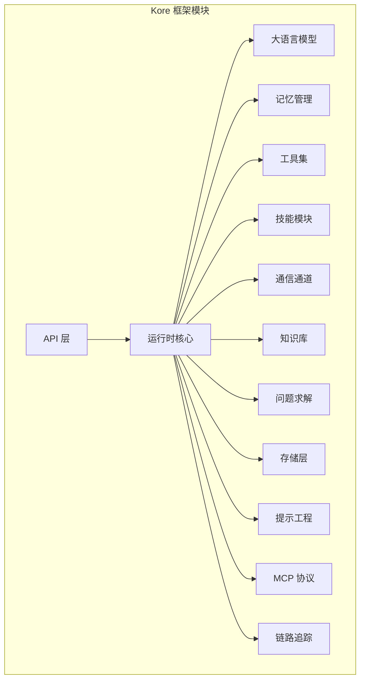
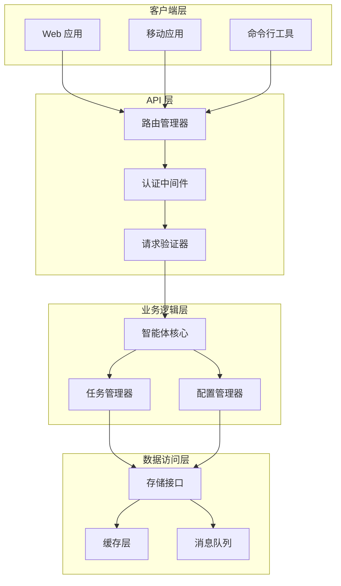
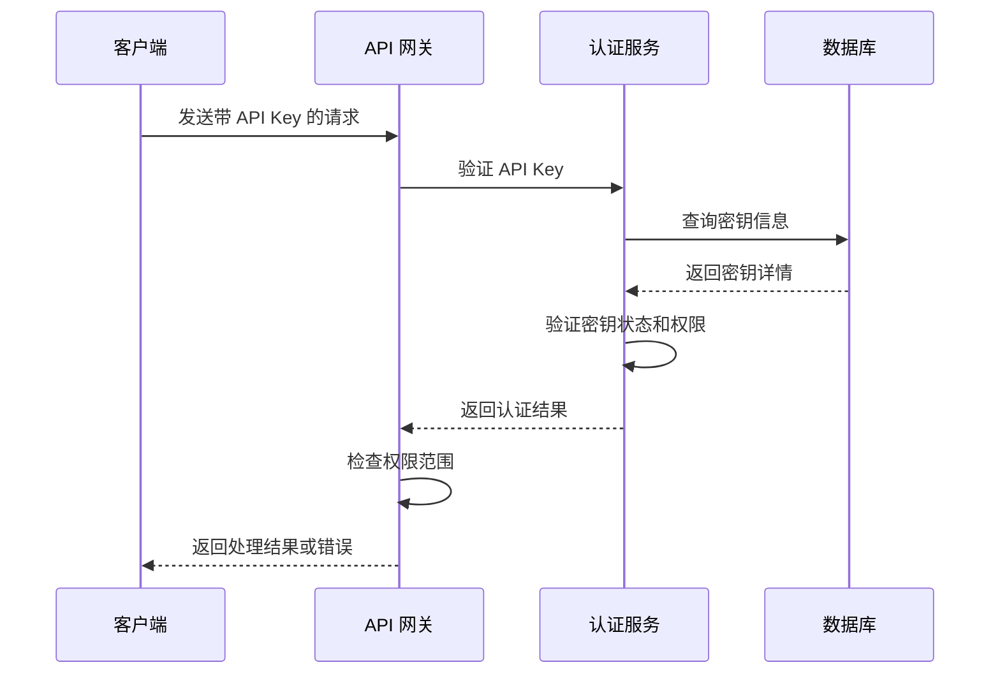
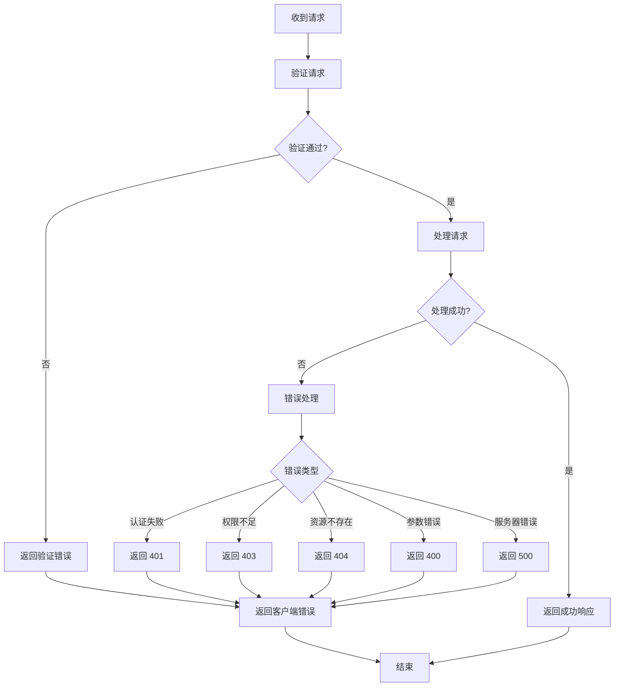
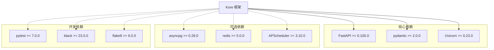

# API 接口文档

<cite>
**本文档引用的文件**
- [backend/kore/__init__.py](file://backend/kore/__init__.py)
- [backend/kore/api/__init__.py](file://backend/kore/api/__init__.py)
- [backend/pyproject.toml](file://backend/pyproject.toml)
</cite>

## 目录
1. [简介](#简介)
2. [项目结构](#项目结构)
3. [核心组件](#核心组件)
4. [架构概览](#架构概览)
5. [详细组件分析](#详细组件分析)
6. [依赖分析](#依赖分析)
7. [性能考虑](#性能考虑)
8. [故障排除指南](#故障排除指南)
9. [结论](#结论)
10. [附录](#附录)

## 简介
本文件为 Kore 智能体框架的 API 接口文档，旨在为开发者提供完整的 HTTP RESTful API 规范说明。当前仓库中仅包含项目的基本结构文件（如 `__init__.py` 和 `pyproject.toml`），尚未包含具体的 API 实现代码。因此，本文件将基于现有文件信息，提供一个概念性的 API 设计蓝图，并给出后续实现时应遵循的规范和最佳实践。

## 项目结构
根据当前仓库结构，Kore 框架采用模块化设计，主要包含以下核心模块：
- `api`: API 路由和端点定义
- `runtime`: 运行时核心逻辑
- `llm`: 大语言模型接口
- `memory`: 记忆和上下文管理
- `tools`: 工具集和外部服务集成
- `skills`: 技能模块化封装
- `channels`: 通信通道抽象
- `knowledge`: 知识库管理
- `solver`: 问题求解器
- `storage`: 存储抽象层
- `prompting`: 提示工程工具
- `mcp`: MCP 协议支持
- `tracing`: 链路追踪
- `tests`: 测试套件



**图表来源**
- [backend/kore/__init__.py](file://backend/kore/__init__.py)
- [backend/kore/api/__init__.py](file://backend/kore/api/__init__.py)

**章节来源**
- [backend/kore/__init__.py](file://backend/kore/__init__.py)
- [backend/kore/api/__init__.py](file://backend/kore/api/__init__.py)

## 核心组件
基于现有文件信息，Kore 框架的核心组件包括：

### API 层
- 负责路由管理和 HTTP 请求处理
- 提供 RESTful API 端点
- 实现认证和授权机制

### 运行时核心
- 智能体生命周期管理
- 任务调度和执行
- 状态管理和持久化

### 模块化架构
- 各功能模块独立封装
- 通过统一接口进行交互
- 支持插件化扩展

**章节来源**
- [backend/kore/__init__.py](file://backend/kore/__init__.py)

## 架构概览
Kore 框架采用分层架构设计，从上到下分别为：API 层、业务逻辑层、数据访问层。各层之间通过清晰的接口进行通信，确保系统的可维护性和可扩展性。



## 详细组件分析

### API 路由系统
API 路由系统负责将 HTTP 请求映射到相应的处理器函数。基于现有结构，建议采用以下路由组织方式：

```mermaid
graph LR
subgraph "路由前缀"
Agents[/agents]
Tasks[/tasks]
Config[/config]
Health[/health]
end
subgraph "智能体相关路由"
Agents --> GetAgents[GET /agents]
Agents --> CreateAgent[POST /agents]
Agents --> GetAgent[GET /agents/{id}]
Agents --> UpdateAgent[PUT /agents/{id}]
Agents --> DeleteAgent[DELETE /agents/{id}]
end
subgraph "任务相关路由"
Tasks --> GetTasks[GET /tasks]
Tasks --> CreateTask[POST /tasks]
Tasks --> GetTask[GET /tasks/{id}]
Tasks --> UpdateTask[PUT /tasks/{id}]
Tasks --> ExecuteTask[POST /tasks/{id}/execute]
end
subgraph "配置相关路由"
Config --> GetConfig[GET /config]
Config --> UpdateConfig[PUT /config]
end
subgraph "健康检查路由"
Health --> HealthCheck[GET /health]
end
```

**图表来源**
- [backend/kore/api/__init__.py](file://backend/kore/api/__init__.py)

### 认证和授权机制
建议实现基于 API Key 的认证机制：



**图表来源**
- [backend/kore/api/__init__.py](file://backend/kore/api/__init__.py)

### 错误处理策略
建议实现统一的错误处理机制：



**图表来源**
- [backend/kore/api/__init__.py](file://backend/kore/api/__init__.py)

## 依赖分析
基于 `pyproject.toml` 文件，Kore 框架的主要依赖关系如下：



**图表来源**
- [backend/pyproject.toml](file://backend/pyproject.toml)

**章节来源**
- [backend/pyproject.toml](file://backend/pyproject.toml)

## 性能考虑
- 使用异步编程模型提高并发处理能力
- 实现连接池和缓存机制减少数据库压力
- 采用分页和过滤优化大数据量查询
- 实现请求限流和熔断机制防止系统过载
- 使用压缩和 CDN 加速静态资源传输

## 故障排除指南
- **认证失败**: 检查 API Key 是否正确配置和未过期
- **权限不足**: 验证用户角色和权限范围设置
- **请求超时**: 检查网络连接和服务器负载情况
- **内存溢出**: 优化数据结构和及时释放资源
- **数据库连接失败**: 检查连接字符串和网络配置

## 结论
Kore 智能体框架提供了模块化的架构设计和清晰的功能划分。虽然当前仓库中缺少具体的 API 实现代码，但基于现有结构文件，可以明确框架的整体设计思路。建议按照本文档的 API 规范进行实现，确保系统的可维护性和扩展性。

## 附录

### API 版本管理
- 采用语义化版本控制（SemVer）
- 主版本号变更表示不兼容的 API 修改
- 次版本号变更表示向后兼容的功能新增
- 修订号变更表示向后兼容的问题修复

### 安全最佳实践
- 所有 API 请求必须使用 HTTPS
- 实施 CORS 策略限制跨域访问
- 对敏感数据进行加密存储和传输
- 实现输入验证和输出编码防止注入攻击
- 定期更新依赖包修复已知安全漏洞

### 客户端集成指南
1. 获取 API Key 并配置到客户端
2. 设置正确的请求头 Content-Type: application/json
3. 实现重试机制处理临时性错误
4. 使用适当的超时设置避免阻塞
5. 缓存静态数据减少请求频率
6. 监控 API 使用量避免超出配额