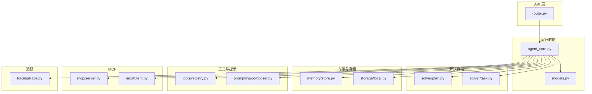
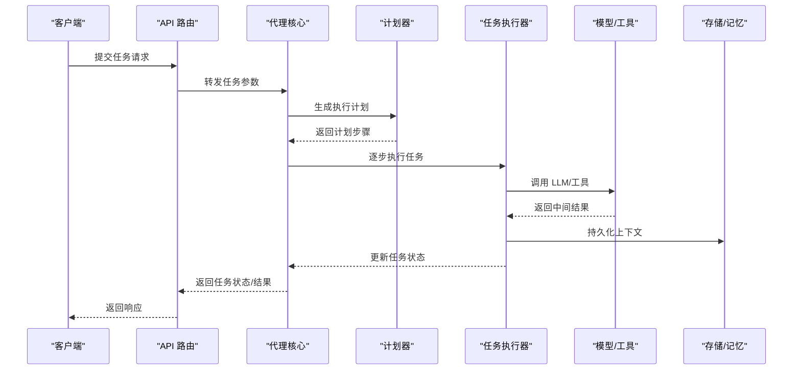
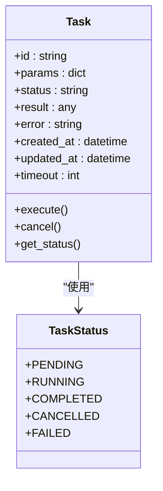
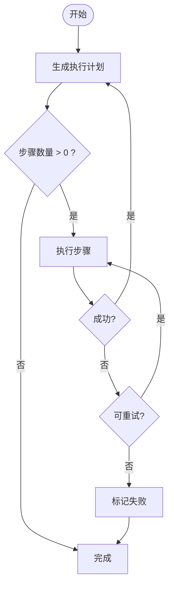
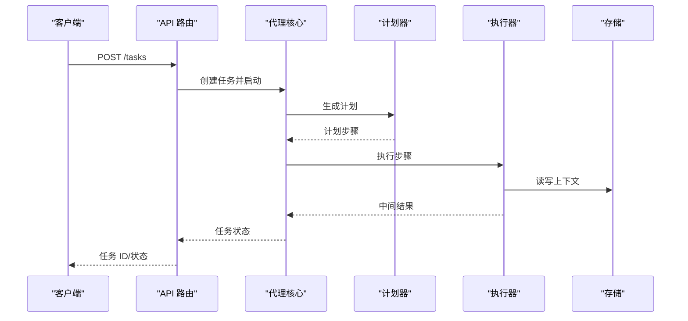
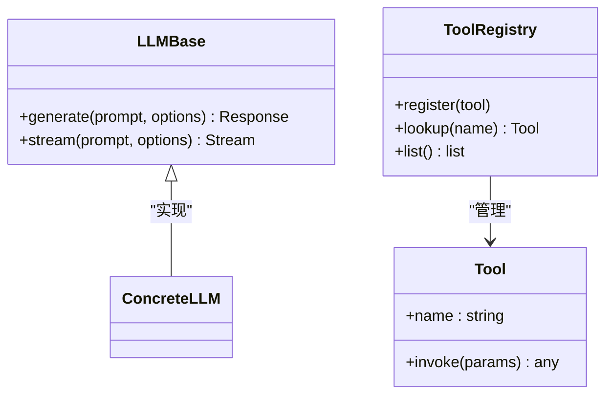
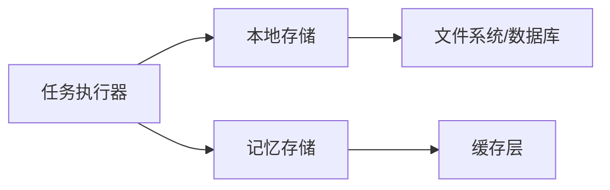
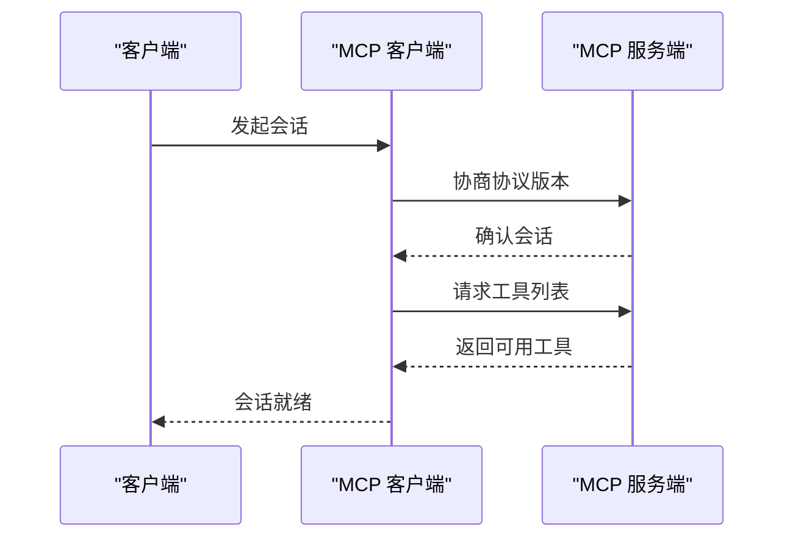
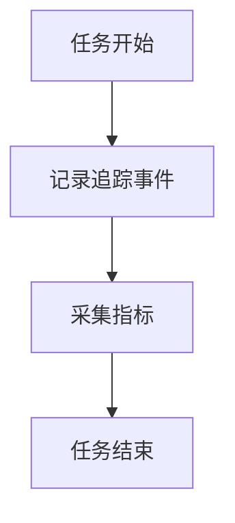
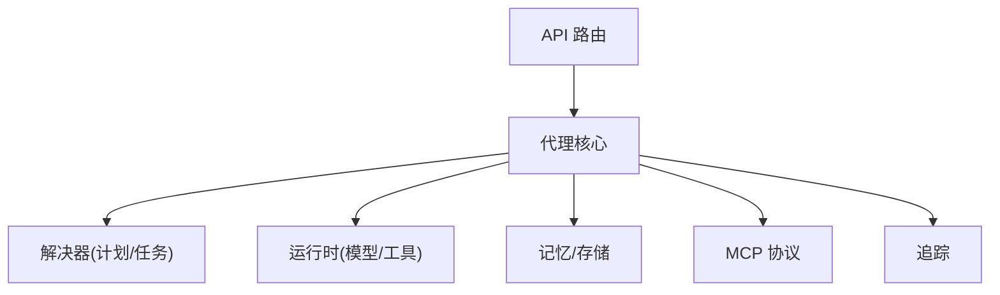

# 任务执行 API

<cite>
**本文档引用的文件**
- [backend/pyproject.toml](file://backend/pyproject.toml)
- [backend/kore/__init__.py](file://backend/kore/__init__.py)
- [backend/kore/api/router.py](file://backend/kore/api/router.py)
- [backend/kore/runtime/agent_core.py](file://backend/kore/runtime/agent_core.py)
- [backend/kore/runtime/models.py](file://backend/kore/runtime/models.py)
- [backend/kore/llm/base.py](file://backend/kore/llm/base.py)
- [backend/kore/llm/factory.py](file://backend/kore/llm/factory.py)
- [backend/kore/solver/__init__.py](file://backend/kore/solver/__init__.py)
- [backend/kore/solver/plan.py](file://backend/kore/solver/plan.py)
- [backend/kore/solver/task.py](file://backend/kore/solver/task.py)
- [backend/kore/memory/__init__.py](file://backend/kore/memory/__init__.py)
- [backend/kore/memory/store.py](file://backend/kore/memory/store.py)
- [backend/kore/storage/__init__.py](file://backend/kore/storage/__init__.py)
- [backend/kore/storage/local.py](file://backend/kore/storage/local.py)
- [backend/kore/tools/__init__.py](file://backend/kore/tools/__init__.py)
- [backend/kore/tools/base.py](file://backend/kore/tools/base.py)
- [backend/kore/tools/registry.py](file://backend/kore/tools/registry.py)
- [backend/kore/prompting/__init__.py](file://backend/kore/prompting/__init__.py)
- [backend/kore/prompting/composer.py](file://backend/kore/prompting/composer.py)
- [backend/kore/tracing/__init__.py](file://backend/kore/tracing/__init__.py)
- [backend/kore/tracing/trace.py](file://backend/kore/tracing/trace.py)
- [backend/kore/channels/__init__.py](file://backend/kore/channels/__init__.py)
- [backend/kore/channels/base.py](file://backend/kore/channels/base.py)
- [backend/kore/mcp/__init__.py](file://backend/kore/mcp/__init__.py)
- [backend/kore/mcp/client.py](file://backend/kore/mcp/client.py)
- [backend/kore/mcp/server.py](file://backend/kore/mcp/server.py)
- [backend/tests/test_solver_task.py](file://backend/tests/test_solver_task.py)
</cite>

## 目录
1. [简介](#简介)
2. [项目结构](#项目结构)
3. [核心组件](#核心组件)
4. [架构总览](#架构总览)
5. [详细组件分析](#详细组件分析)
6. [依赖关系分析](#依赖关系分析)
7. [性能考虑](#性能考虑)
8. [故障排查指南](#故障排查指南)
9. [结论](#结论)
10. [附录](#附录)

## 简介
本文件为 Kore 项目中“任务执行”能力的完整 API 文档。内容覆盖任务提交、查询、取消等操作接口；解释异步处理机制与状态跟踪；给出任务参数定义（输入格式、执行选项、超时设置）；说明结果获取方式与数据格式；包含批量任务与队列管理接口；提供监控与调试接口；并附带请求/响应示例与错误处理说明，以及性能优化建议与最佳实践。

## 项目结构
Kore 后端采用模块化分层设计：
- API 层：路由与接口入口
- 运行时层：任务调度、代理核心、模型适配
- 解决器层：计划与任务抽象
- 内存与存储：上下文记忆与持久化
- 工具与提示：工具注册与提示合成
- MCP：多会话控制协议
- 链路追踪：调用链与可观测性
- 测试：任务相关单元测试

**图表来源**
- [backend/kore/api/router.py](file://backend/kore/api/router.py)
- [backend/kore/runtime/agent_core.py](file://backend/kore/runtime/agent_core.py)
- [backend/kore/runtime/models.py](file://backend/kore/runtime/models.py)
- [backend/kore/solver/plan.py](file://backend/kore/solver/plan.py)
- [backend/kore/solver/task.py](file://backend/kore/solver/task.py)
- [backend/kore/memory/store.py](file://backend/kore/memory/store.py)
- [backend/kore/storage/local.py](file://backend/kore/storage/local.py)
- [backend/kore/tools/registry.py](file://backend/kore/tools/registry.py)
- [backend/kore/prompting/composer.py](file://backend/kore/prompting/composer.py)
- [backend/kore/mcp/server.py](file://backend/kore/mcp/server.py)
- [backend/kore/mcp/client.py](file://backend/kore/mcp/client.py)
- [backend/kore/tracing/trace.py](file://backend/kore/tracing/trace.py)

**章节来源**
- [backend/kore/api/router.py](file://backend/kore/api/router.py)
- [backend/kore/runtime/agent_core.py](file://backend/kore/runtime/agent_core.py)
- [backend/kore/runtime/models.py](file://backend/kore/runtime/models.py)
- [backend/kore/solver/plan.py](file://backend/kore/solver/plan.py)
- [backend/kore/solver/task.py](file://backend/kore/solver/task.py)
- [backend/kore/memory/store.py](file://backend/kore/memory/store.py)
- [backend/kore/storage/local.py](file://backend/kore/storage/local.py)
- [backend/kore/tools/registry.py](file://backend/kore/tools/registry.py)
- [backend/kore/prompting/composer.py](file://backend/kore/prompting/composer.py)
- [backend/kore/mcp/server.py](file://backend/kore/mcp/server.py)
- [backend/kore/mcp/client.py](file://backend/kore/mcp/client.py)
- [backend/kore/tracing/trace.py](file://backend/kore/tracing/trace.py)

## 核心组件
- 任务模型与状态：任务实体、状态枚举、生命周期管理
- 计划与任务：计划编排、任务拆解与执行
- 代理核心：统一的任务调度入口、上下文注入、工具调用
- 模型适配：LLM 基础接口与工厂模式
- 存储与记忆：上下文持久化与检索
- 工具注册：动态工具发现与调用
- MCP：多会话控制协议客户端/服务端
- 追踪：链路追踪与可观测性

**章节来源**
- [backend/kore/runtime/models.py](file://backend/kore/runtime/models.py)
- [backend/kore/solver/plan.py](file://backend/kore/solver/plan.py)
- [backend/kore/solver/task.py](file://backend/kore/solver/task.py)
- [backend/kore/runtime/agent_core.py](file://backend/kore/runtime/agent_core.py)
- [backend/kore/llm/base.py](file://backend/kore/llm/base.py)
- [backend/kore/llm/factory.py](file://backend/kore/llm/factory.py)
- [backend/kore/memory/store.py](file://backend/kore/memory/store.py)
- [backend/kore/storage/local.py](file://backend/kore/storage/local.py)
- [backend/kore/tools/registry.py](file://backend/kore/tools/registry.py)
- [backend/kore/mcp/server.py](file://backend/kore/mcp/server.py)
- [backend/kore/mcp/client.py](file://backend/kore/mcp/client.py)
- [backend/kore/tracing/trace.py](file://backend/kore/tracing/trace.py)

## 架构总览
任务执行采用“计划驱动 + 异步执行 + 状态跟踪”的架构。API 路由接收请求后，交由代理核心进行任务编排，通过计划器生成子任务序列，运行时按序执行并维护任务状态，最终返回结果或错误信息。

**图表来源**
- [backend/kore/api/router.py](file://backend/kore/api/router.py)
- [backend/kore/runtime/agent_core.py](file://backend/kore/runtime/agent_core.py)
- [backend/kore/solver/plan.py](file://backend/kore/solver/plan.py)
- [backend/kore/solver/task.py](file://backend/kore/solver/task.py)
- [backend/kore/runtime/models.py](file://backend/kore/runtime/models.py)
- [backend/kore/memory/store.py](file://backend/kore/memory/store.py)
- [backend/kore/storage/local.py](file://backend/kore/storage/local.py)

## 详细组件分析

### 任务模型与状态
- 任务实体包含标识、参数、状态、结果、错误、时间戳等字段
- 状态枚举涵盖待处理、执行中、已完成、已取消、失败等
- 生命周期管理负责状态转换与持久化

**图表来源**
- [backend/kore/runtime/models.py](file://backend/kore/runtime/models.py)

**章节来源**
- [backend/kore/runtime/models.py](file://backend/kore/runtime/models.py)

### 计划与任务
- 计划器根据输入参数生成执行步骤序列
- 任务执行器按顺序执行每个步骤，支持并发与串行组合
- 支持重试、超时、回滚策略

**图表来源**
- [backend/kore/solver/plan.py](file://backend/kore/solver/plan.py)
- [backend/kore/solver/task.py](file://backend/kore/solver/task.py)

**章节来源**
- [backend/kore/solver/plan.py](file://backend/kore/solver/plan.py)
- [backend/kore/solver/task.py](file://backend/kore/solver/task.py)

### 代理核心与 API 路由
- 代理核心作为统一入口，协调计划、执行、存储、工具与追踪
- API 路由负责请求解析、鉴权与响应封装

**图表来源**
- [backend/kore/api/router.py](file://backend/kore/api/router.py)
- [backend/kore/runtime/agent_core.py](file://backend/kore/runtime/agent_core.py)
- [backend/kore/solver/plan.py](file://backend/kore/solver/plan.py)
- [backend/kore/solver/task.py](file://backend/kore/solver/task.py)
- [backend/kore/memory/store.py](file://backend/kore/memory/store.py)

**章节来源**
- [backend/kore/api/router.py](file://backend/kore/api/router.py)
- [backend/kore/runtime/agent_core.py](file://backend/kore/runtime/agent_core.py)

### 模型适配与工具系统
- LLM 基础接口定义统一的推理契约
- 工具注册中心提供动态工具发现与调用
- 支持外部工具扩展与本地工具集成

**图表来源**
- [backend/kore/llm/base.py](file://backend/kore/llm/base.py)
- [backend/kore/llm/factory.py](file://backend/kore/llm/factory.py)
- [backend/kore/tools/registry.py](file://backend/kore/tools/registry.py)
- [backend/kore/tools/base.py](file://backend/kore/tools/base.py)

**章节来源**
- [backend/kore/llm/base.py](file://backend/kore/llm/base.py)
- [backend/kore/llm/factory.py](file://backend/kore/llm/factory.py)
- [backend/kore/tools/registry.py](file://backend/kore/tools/registry.py)
- [backend/kore/tools/base.py](file://backend/kore/tools/base.py)

### 存储与记忆
- 本地存储提供键值持久化，用于任务上下文与中间结果
- 记忆存储支持历史对话与上下文检索

**图表来源**
- [backend/kore/storage/local.py](file://backend/kore/storage/local.py)
- [backend/kore/memory/store.py](file://backend/kore/memory/store.py)

**章节来源**
- [backend/kore/storage/local.py](file://backend/kore/storage/local.py)
- [backend/kore/memory/store.py](file://backend/kore/memory/store.py)

### MCP 协议
- MCP 客户端/服务端支持多会话控制与远程工具调用
- 提供安全的会话协商与消息路由

**图表来源**
- [backend/kore/mcp/client.py](file://backend/kore/mcp/client.py)
- [backend/kore/mcp/server.py](file://backend/kore/mcp/server.py)

**章节来源**
- [backend/kore/mcp/client.py](file://backend/kore/mcp/client.py)
- [backend/kore/mcp/server.py](file://backend/kore/mcp/server.py)

### 追踪与可观测性
- 追踪模块记录任务生命周期事件与关键指标
- 支持链路 ID 关联与日志聚合

**图表来源**
- [backend/kore/tracing/trace.py](file://backend/kore/tracing/trace.py)

**章节来源**
- [backend/kore/tracing/trace.py](file://backend/kore/tracing/trace.py)

## 依赖关系分析
- 组件内聚高、耦合低：API 路由仅负责入口，核心逻辑下沉至代理核心
- 外部依赖：通过工具注册与 MCP 实现对外部系统的扩展
- 数据流清晰：从请求到状态更新，贯穿计划、执行、存储与追踪

**图表来源**
- [backend/kore/api/router.py](file://backend/kore/api/router.py)
- [backend/kore/runtime/agent_core.py](file://backend/kore/runtime/agent_core.py)
- [backend/kore/solver/plan.py](file://backend/kore/solver/plan.py)
- [backend/kore/solver/task.py](file://backend/kore/solver/task.py)
- [backend/kore/llm/base.py](file://backend/kore/llm/base.py)
- [backend/kore/tools/registry.py](file://backend/kore/tools/registry.py)
- [backend/kore/memory/store.py](file://backend/kore/memory/store.py)
- [backend/kore/storage/local.py](file://backend/kore/storage/local.py)
- [backend/kore/mcp/server.py](file://backend/kore/mcp/server.py)
- [backend/kore/tracing/trace.py](file://backend/kore/tracing/trace.py)

**章节来源**
- [backend/kore/api/router.py](file://backend/kore/api/router.py)
- [backend/kore/runtime/agent_core.py](file://backend/kore/runtime/agent_core.py)
- [backend/kore/solver/plan.py](file://backend/kore/solver/plan.py)
- [backend/kore/solver/task.py](file://backend/kore/solver/task.py)
- [backend/kore/llm/base.py](file://backend/kore/llm/base.py)
- [backend/kore/tools/registry.py](file://backend/kore/tools/registry.py)
- [backend/kore/memory/store.py](file://backend/kore/memory/store.py)
- [backend/kore/storage/local.py](file://backend/kore/storage/local.py)
- [backend/kore/mcp/server.py](file://backend/kore/mcp/server.py)
- [backend/kore/tracing/trace.py](file://backend/kore/tracing/trace.py)

## 性能考虑
- 并发执行：对无状态且独立的步骤启用并发，减少总耗时
- 缓存策略：利用记忆存储与工具结果缓存，避免重复计算
- 超时与重试：合理设置任务超时与指数退避重试，提升稳定性
- 批量处理：合并小任务、批量化 I/O 操作，降低开销
- 监控指标：记录执行时延、失败率、资源占用，持续优化

[本节为通用指导，无需列出具体文件来源]

## 故障排查指南
- 常见错误类型：参数校验失败、工具调用异常、模型响应超时、存储写入失败
- 排查步骤：查看任务状态与错误字段、核对计划步骤、检查工具可用性、验证存储连通性
- 日志定位：结合追踪 ID 在链路中定位问题节点
- 重试策略：区分可重试与不可重试错误，避免无限循环

**章节来源**
- [backend/kore/runtime/models.py](file://backend/kore/runtime/models.py)
- [backend/kore/tracing/trace.py](file://backend/kore/tracing/trace.py)

## 结论
Kore 的任务执行 API 以计划驱动为核心，结合异步执行与状态跟踪，提供了可扩展、可观测的任务处理框架。通过工具注册、MCP 协议与存储记忆，能够灵活接入外部能力并持久化上下文。建议在生产环境中配合缓存、限流与监控，确保稳定与高性能。

[本节为总结性内容，无需列出具体文件来源]

## 附录

### API 接口定义与示例

- 提交任务
  - 方法与路径：POST /tasks
  - 请求体字段：
    - input：任务输入数据（对象/字符串/数组）
    - params：执行选项（如并发度、重试次数、超时秒数）
    - tools：工具名称列表（可选）
    - timeout：任务超时秒数（整数）
  - 成功响应：返回任务 ID 与初始状态
  - 错误码：400 参数无效，500 服务器内部错误

- 查询任务
  - 方法与路径：GET /tasks/{task_id}
  - 成功响应：返回任务状态、结果或错误详情
  - 错误码：404 任务不存在，403 权限不足

- 取消任务
  - 方法与路径：DELETE /tasks/{task_id}
  - 成功响应：返回取消状态
  - 错误码：409 状态不允许取消

- 批量任务
  - 方法与路径：POST /tasks/batch
  - 请求体字段：任务数组（每项包含 input、params 等）
  - 成功响应：返回多个任务 ID 列表
  - 错误码：400 参数无效，500 部分失败

- 队列管理
  - 方法与路径：GET /queue/stats | GET /queue/list | DELETE /queue/clear
  - 功能：查看队列统计、当前排队任务、清空队列
  - 错误码：500 队列服务异常

- 监控与调试
  - 方法与路径：GET /monitor/traces/{task_id} | GET /debug/status
  - 功能：获取任务链路追踪、系统健康状态
  - 错误码：404 无追踪数据

[本节为概念性接口说明，未直接分析具体源文件，故不附加章节来源]

### 任务参数详解
- 输入数据格式：支持字符串、JSON 对象、数组等，需与工具签名匹配
- 执行选项：
  - concurrency：并发执行度
  - retry：最大重试次数
  - timeout：单步超时秒数
  - stream：是否启用流式输出
- 超时设置：全局任务超时与单步超时共同作用，优先触发先到期者

[本节为参数说明，未直接分析具体源文件，故不附加章节来源]

### 结果获取与数据格式
- 状态字段：pending、running、completed、cancelled、failed
- 成功结果：result 字段包含最终输出
- 错误结果：error 字段描述失败原因
- 流式输出：支持分块传输，客户端需按序拼接

[本节为结果规范说明，未直接分析具体源文件，故不附加章节来源]

### 测试参考
- 单元测试：包含任务生命周期、状态转换与错误处理的测试用例
- 建议：在新增功能时补充对应测试，确保回归质量

**章节来源**
- [backend/tests/test_solver_task.py](file://backend/tests/test_solver_task.py)