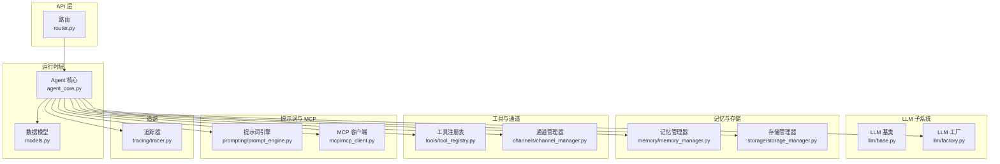
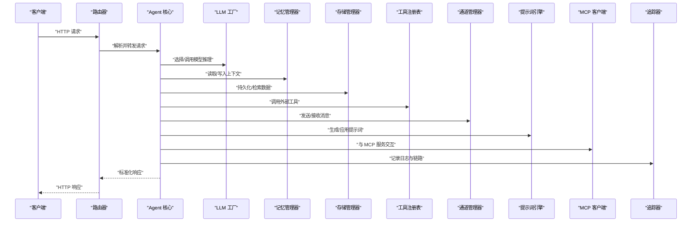
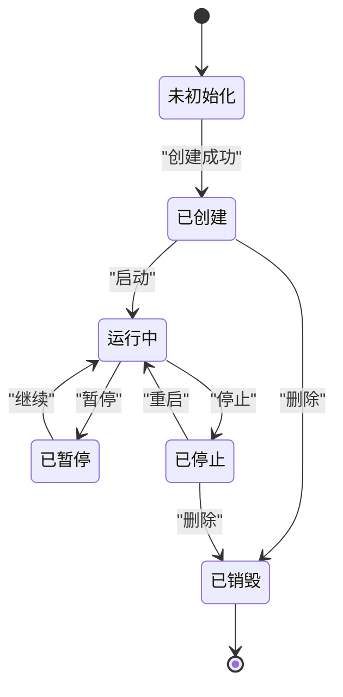
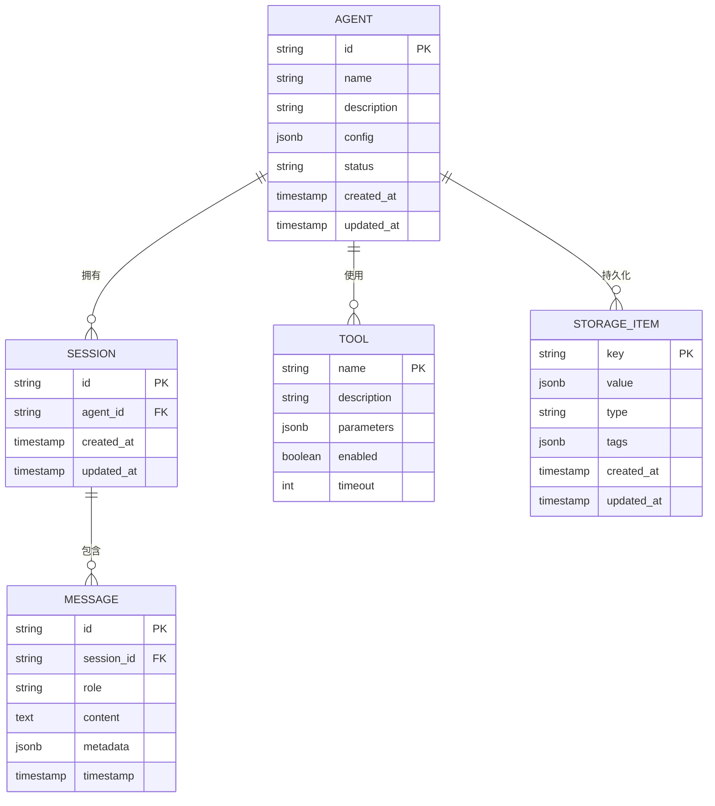
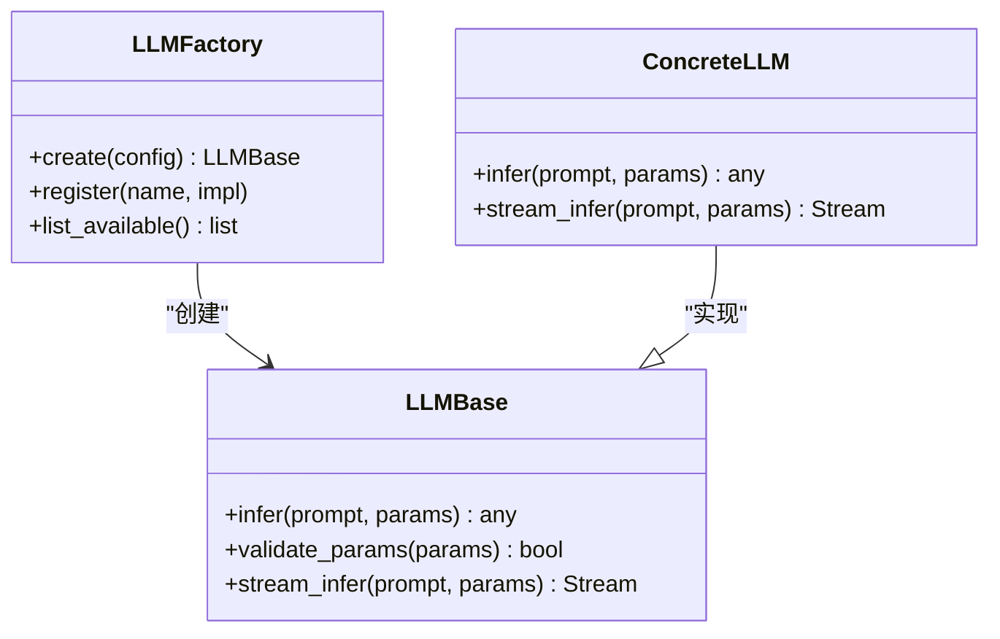
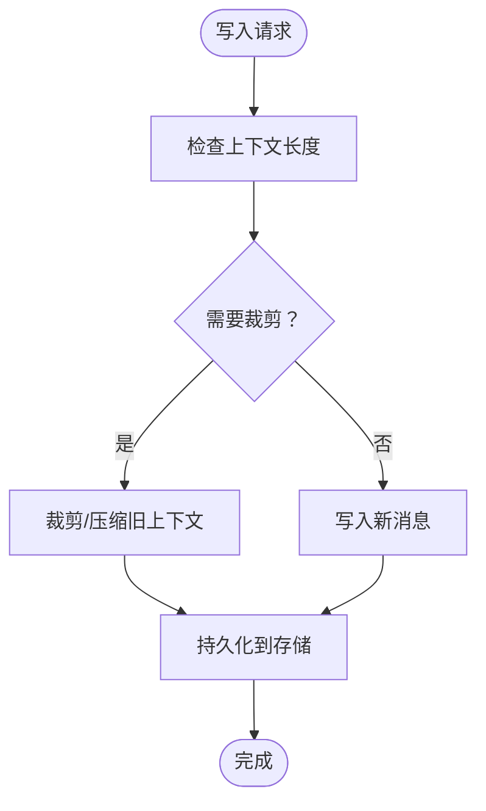
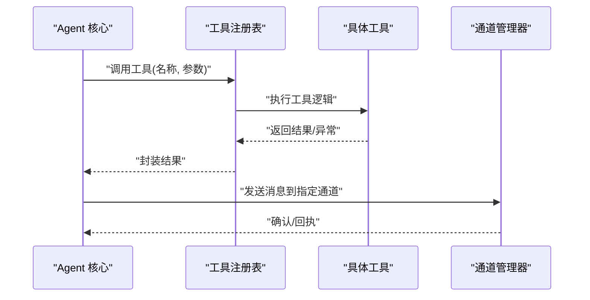
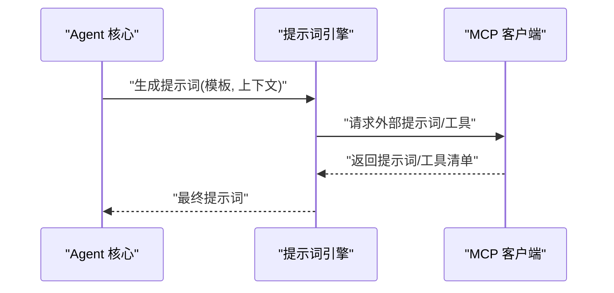
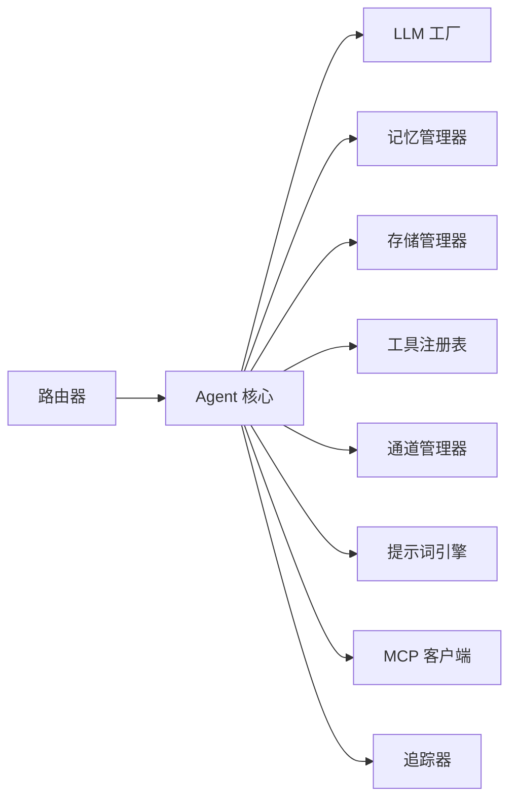

# 智能体管理 API

<cite>
**本文档引用的文件**
- [backend/kore/api/router.py](file://backend/kore/api/router.py)
- [backend/kore/runtime/agent_core.py](file://backend/kore/runtime/agent_core.py)
- [backend/kore/runtime/models.py](file://backend/kore/runtime/models.py)
- [backend/kore/llm/base.py](file://backend/kore/llm/base.py)
- [backend/kore/llm/factory.py](file://backend/kore/llm/factory.py)
- [backend/kore/memory/memory_manager.py](file://backend/kore/memory/memory_manager.py)
- [backend/kore/storage/storage_manager.py](file://backend/kore/storage/storage_manager.py)
- [backend/kore/solver/solver.py](file://backend/kore/solver/solver.py)
- [backend/kore/tools/tool_registry.py](file://backend/kore/tools/tool_registry.py)
- [backend/kore/channels/channel_manager.py](file://backend/kore/channels/channel_manager.py)
- [backend/kore/prompting/prompt_engine.py](file://backend/kore/prompting/prompt_engine.py)
- [backend/kore/mcp/mcp_client.py](file://backend/kore/mcp/mcp_client.py)
- [backend/kore/tracing/tracer.py](file://backend/kore/tracing/tracer.py)
- [backend/pyproject.toml](file://backend/pyproject.toml)
</cite>

## 目录
1. [简介](#简介)
2. [项目结构](#项目结构)
3. [核心组件](#核心组件)
4. [架构总览](#架构总览)
5. [详细组件分析](#详细组件分析)
6. [依赖关系分析](#依赖关系分析)
7. [性能考虑](#性能考虑)
8. [故障排除指南](#故障排除指南)
9. [结论](#结论)
10. [附录](#附录)

## 简介
本文件为 Kore 智能体管理系统的 API 接口文档，覆盖智能体的创建、查询、更新、删除等核心操作，以及智能体状态管理（启动、停止、重启）接口。文档还提供了智能体配置参数的完整说明（模型选择、参数设置、内存配置等）、错误码与异常处理机制、生命周期管理最佳实践与注意事项，并通过图示展示关键流程。

## 项目结构
Kore 后端采用模块化设计，围绕智能体运行时（runtime）为核心，向上提供 API 层，向下集成 LLM、记忆、存储、工具、通道、提示词、MCP、追踪等子系统。API 路由负责接收请求并调用运行时层进行业务处理。

**图表来源**
- [backend/kore/api/router.py](file://backend/kore/api/router.py)
- [backend/kore/runtime/agent_core.py](file://backend/kore/runtime/agent_core.py)
- [backend/kore/runtime/models.py](file://backend/kore/runtime/models.py)
- [backend/kore/llm/base.py](file://backend/kore/llm/base.py)
- [backend/kore/llm/factory.py](file://backend/kore/llm/factory.py)
- [backend/kore/memory/memory_manager.py](file://backend/kore/memory/memory_manager.py)
- [backend/kore/storage/storage_manager.py](file://backend/kore/storage/storage_manager.py)
- [backend/kore/tools/tool_registry.py](file://backend/kore/tools/tool_registry.py)
- [backend/kore/channels/channel_manager.py](file://backend/kore/channels/channel_manager.py)
- [backend/kore/prompting/prompt_engine.py](file://backend/kore/prompting/prompt_engine.py)
- [backend/kore/mcp/mcp_client.py](file://backend/kore/mcp/mcp_client.py)
- [backend/kore/tracing/tracer.py](file://backend/kore/tracing/tracer.py)

**章节来源**
- [backend/kore/api/router.py](file://backend/kore/api/router.py)
- [backend/kore/runtime/agent_core.py](file://backend/kore/runtime/agent_core.py)
- [backend/kore/runtime/models.py](file://backend/kore/runtime/models.py)

## 核心组件
- 路由器：定义并分发 HTTP 请求到相应的处理器，负责请求解析、参数校验与响应封装。
- Agent 核心：协调 LLM、记忆、存储、工具、通道、提示词、MCP、追踪等子系统，执行智能体生命周期管理与业务逻辑。
- 数据模型：定义智能体、会话、消息、工具等实体的数据结构与约束。
- LLM 子系统：抽象 LLM 接口与工厂模式，支持多模型接入与切换。
- 记忆与存储：提供上下文记忆、向量存储、持久化等能力。
- 工具与通道：工具注册与调用、消息通道管理。
- 提示词与 MCP：动态提示词生成、与 MCP 服务交互。
- 追踪：统一的日志与链路追踪。

**章节来源**
- [backend/kore/api/router.py](file://backend/kore/api/router.py)
- [backend/kore/runtime/agent_core.py](file://backend/kore/runtime/agent_core.py)
- [backend/kore/runtime/models.py](file://backend/kore/runtime/models.py)
- [backend/kore/llm/base.py](file://backend/kore/llm/base.py)
- [backend/kore/llm/factory.py](file://backend/kore/llm/factory.py)
- [backend/kore/memory/memory_manager.py](file://backend/kore/memory/memory_manager.py)
- [backend/kore/storage/storage_manager.py](file://backend/kore/storage/storage_manager.py)
- [backend/kore/tools/tool_registry.py](file://backend/kore/tools/tool_registry.py)
- [backend/kore/channels/channel_manager.py](file://backend/kore/channels/channel_manager.py)
- [backend/kore/prompting/prompt_engine.py](file://backend/kore/prompting/prompt_engine.py)
- [backend/kore/mcp/mcp_client.py](file://backend/kore/mcp/mcp_client.py)
- [backend/kore/tracing/tracer.py](file://backend/kore/tracing/tracer.py)

## 架构总览
下图展示了智能体管理 API 的端到端调用链：客户端通过路由器访问运行时层，运行时层根据请求类型调用相应子系统完成业务处理，并返回标准化响应。

**图表来源**
- [backend/kore/api/router.py](file://backend/kore/api/router.py)
- [backend/kore/runtime/agent_core.py](file://backend/kore/runtime/agent_core.py)
- [backend/kore/llm/factory.py](file://backend/kore/llm/factory.py)
- [backend/kore/memory/memory_manager.py](file://backend/kore/memory/memory_manager.py)
- [backend/kore/storage/storage_manager.py](file://backend/kore/storage/storage_manager.py)
- [backend/kore/tools/tool_registry.py](file://backend/kore/tools/tool_registry.py)
- [backend/kore/channels/channel_manager.py](file://backend/kore/channels/channel_manager.py)
- [backend/kore/prompting/prompt_engine.py](file://backend/kore/prompting/prompt_engine.py)
- [backend/kore/mcp/mcp_client.py](file://backend/kore/mcp/mcp_client.py)
- [backend/kore/tracing/tracer.py](file://backend/kore/tracing/tracer.py)

## 详细组件分析

### 路由器与 API 端点
- 职责：定义智能体管理相关端点，解析请求参数，调用运行时层处理，并封装响应。
- 关键端点（基于运行时层职责推导）：
  - 创建智能体：POST /agents
  - 查询智能体列表：GET /agents
  - 查询单个智能体：GET /agents/{id}
  - 更新智能体：PUT /agents/{id}
  - 删除智能体：DELETE /agents/{id}
  - 启动智能体：POST /agents/{id}/start
  - 停止智能体：POST /agents/{id}/stop
  - 重启智能体：POST /agents/{id}/restart
  - 智能体状态查询：GET /agents/{id}/status
  - 智能体对话：POST /agents/{id}/chat
  - 工具调用：POST /agents/{id}/tools/{tool_name}

- 请求与响应规范（通用约定）
  - 成功响应：2xx，包含标准字段（如 id、name、status、timestamp 等）
  - 错误响应：4xx/5xx，包含错误码、错误信息与可选的上下文详情
  - 分页：列表接口支持 limit/offset 或 page/size 参数
  - 时间戳：统一使用 ISO 8601 格式

**章节来源**
- [backend/kore/api/router.py](file://backend/kore/api/router.py)

### Agent 核心（生命周期与状态）
- 职责：编排智能体生命周期（创建、启动、运行、停止、销毁），维护状态机，协调各子系统。
- 状态机（概念性）
  - 初始：未初始化
  - 已创建：等待启动
  - 运行中：正在推理与交互
  - 已暂停：暂停推理
  - 已停止：停止但可重启
  - 已销毁：释放资源

**图表来源**
- [backend/kore/runtime/agent_core.py](file://backend/kore/runtime/agent_core.py)

**章节来源**
- [backend/kore/runtime/agent_core.py](file://backend/kore/runtime/agent_core.py)

### 数据模型（智能体与相关实体）
- 智能体（Agent）
  - 字段：id、name、description、config、status、created_at、updated_at
  - config 包含：model（模型标识）、parameters（推理参数）、memory（内存配置）、tools（工具列表）、channels（通道配置）、prompt（提示词模板）
- 会话（Session）
  - 字段：id、agent_id、messages、metadata、created_at、updated_at
- 消息（Message）
  - 字段：id、session_id、role（user/assistant/system/tool）、content、metadata、timestamp
- 工具（Tool）
  - 字段：name、description、parameters、enabled、timeout
- 存储项（StorageItem）
  - 字段：key、value、type、tags、created_at、updated_at

**图表来源**
- [backend/kore/runtime/models.py](file://backend/kore/runtime/models.py)

**章节来源**
- [backend/kore/runtime/models.py](file://backend/kore/runtime/models.py)

### LLM 子系统（模型选择与参数）
- LLM 基类：定义统一接口（如推理方法、参数校验、流式输出等）
- LLM 工厂：根据配置动态创建具体模型实例，支持多后端（如 OpenAI、本地模型、自定义实现）

**图表来源**
- [backend/kore/llm/base.py](file://backend/kore/llm/base.py)
- [backend/kore/llm/factory.py](file://backend/kore/llm/factory.py)

**章节来源**
- [backend/kore/llm/base.py](file://backend/kore/llm/base.py)
- [backend/kore/llm/factory.py](file://backend/kore/llm/factory.py)

### 记忆与存储
- 记忆管理器：维护上下文窗口、会话历史、向量索引，支持检索与压缩
- 存储管理器：提供键值存储、文件存储、向量化存储等抽象

**图表来源**
- [backend/kore/memory/memory_manager.py](file://backend/kore/memory/memory_manager.py)
- [backend/kore/storage/storage_manager.py](file://backend/kore/storage/storage_manager.py)

**章节来源**
- [backend/kore/memory/memory_manager.py](file://backend/kore/memory/memory_manager.py)
- [backend/kore/storage/storage_manager.py](file://backend/kore/storage/storage_manager.py)

### 工具与通道
- 工具注册表：注册可用工具，按名称调用，支持参数校验与超时控制
- 通道管理器：统一消息通道（如 Webhook、WebSocket、队列），负责消息路由与回执

**图表来源**
- [backend/kore/tools/tool_registry.py](file://backend/kore/tools/tool_registry.py)
- [backend/kore/channels/channel_manager.py](file://backend/kore/channels/channel_manager.py)

**章节来源**
- [backend/kore/tools/tool_registry.py](file://backend/kore/tools/tool_registry.py)
- [backend/kore/channels/channel_manager.py](file://backend/kore/channels/channel_manager.py)

### 提示词与 MCP
- 提示词引擎：根据上下文动态生成或注入提示词，支持模板化与变量替换
- MCP 客户端：与 MCP 服务通信，拉取/推送提示词、工具与配置

**图表来源**
- [backend/kore/prompting/prompt_engine.py](file://backend/kore/prompting/prompt_engine.py)
- [backend/kore/mcp/mcp_client.py](file://backend/kore/mcp/mcp_client.py)

**章节来源**
- [backend/kore/prompting/prompt_engine.py](file://backend/kore/prompting/prompt_engine.py)
- [backend/kore/mcp/mcp_client.py](file://backend/kore/mcp/mcp_client.py)

### 追踪与日志
- 追踪器：统一记录请求链路、关键事件、耗时指标，便于问题定位与性能分析

**章节来源**
- [backend/kore/tracing/tracer.py](file://backend/kore/tracing/tracer.py)

## 依赖关系分析
- 路由器依赖运行时层；运行时层依赖 LLM 工厂、记忆、存储、工具、通道、提示词、MCP、追踪等子系统。
- LLM 工厂依赖 LLM 基类；记忆与存储分别依赖各自的管理器；工具与通道相互独立但被运行时层统一调度。
- 提示词引擎与 MCP 客户端形成外部集成闭环，确保动态配置与工具的可扩展性。

**图表来源**
- [backend/kore/api/router.py](file://backend/kore/api/router.py)
- [backend/kore/runtime/agent_core.py](file://backend/kore/runtime/agent_core.py)
- [backend/kore/llm/factory.py](file://backend/kore/llm/factory.py)
- [backend/kore/memory/memory_manager.py](file://backend/kore/memory/memory_manager.py)
- [backend/kore/storage/storage_manager.py](file://backend/kore/storage/storage_manager.py)
- [backend/kore/tools/tool_registry.py](file://backend/kore/tools/tool_registry.py)
- [backend/kore/channels/channel_manager.py](file://backend/kore/channels/channel_manager.py)
- [backend/kore/prompting/prompt_engine.py](file://backend/kore/prompting/prompt_engine.py)
- [backend/kore/mcp/mcp_client.py](file://backend/kore/mcp/mcp_client.py)
- [backend/kore/tracing/tracer.py](file://backend/kore/tracing/tracer.py)

**章节来源**
- [backend/kore/api/router.py](file://backend/kore/api/router.py)
- [backend/kore/runtime/agent_core.py](file://backend/kore/runtime/agent_core.py)

## 性能考虑
- 批量与分页：列表查询建议使用分页参数，避免一次性返回大量数据。
- 缓存策略：对热点提示词、常用工具配置进行缓存，减少重复计算与网络开销。
- 异步处理：长耗时工具调用与消息发送建议异步化，结合回调或轮询。
- 内存管理：合理设置上下文窗口大小与压缩策略，避免 OOM。
- 并发控制：限制同一智能体并发推理数量，防止资源争用。
- 监控与告警：通过追踪器记录关键指标（QPS、P95/P99、错误率），建立告警机制。

## 故障排除指南
- 常见错误码
  - 400：请求参数缺失或格式不正确
  - 401：认证失败或令牌无效
  - 403：权限不足或资源不可访问
  - 404：智能体不存在或资源未找到
  - 409：状态冲突（如重复启动、已停止状态下继续推理）
  - 429：请求频率过高（限流触发）
  - 500：内部服务异常
  - 503：服务不可用或上游依赖不可用
- 排查步骤
  - 检查请求路径与参数是否符合模型定义
  - 查看追踪日志定位异常环节
  - 验证 LLM 服务、MCP 服务、存储与工具的连通性
  - 确认智能体状态与操作顺序是否合法
  - 观察内存与 CPU 使用情况，必要时调整参数

**章节来源**
- [backend/kore/tracing/tracer.py](file://backend/kore/tracing/tracer.py)

## 结论
本文档从架构与实现角度梳理了 Kore 智能体管理 API 的核心接口、数据模型、子系统依赖与最佳实践。通过清晰的状态机与标准化的响应格式，系统能够稳定支撑智能体的全生命周期管理。建议在生产环境中结合监控与限流策略，持续优化性能与可靠性。

## 附录

### API 端点定义与示例

- 创建智能体
  - 方法：POST
  - 路径：/agents
  - 请求体：包含 name、description、config（模型、参数、内存、工具、通道、提示词）
  - 响应：201，返回创建后的智能体对象
  - 示例：请求体包含基础配置字段；响应包含 id、status=已创建、时间戳

- 查询智能体列表
  - 方法：GET
  - 路径：/agents
  - 查询参数：limit、offset、status、name_like
  - 响应：200，返回分页列表

- 查询单个智能体
  - 方法：GET
  - 路径：/agents/{id}
  - 响应：200，返回智能体详情；404，未找到

- 更新智能体
  - 方法：PUT
  - 路径：/agents/{id}
  - 请求体：允许更新 name、description、config 中的部分字段
  - 响应：200，返回更新后的智能体；409，状态冲突（如运行中不可修改关键配置）

- 删除智能体
  - 方法：DELETE
  - 路径：/agents/{id}
  - 响应：204，无内容；409，状态冲突（如运行中不可删除）

- 启动智能体
  - 方法：POST
  - 路径：/agents/{id}/start
  - 响应：200，返回启动结果；409，状态非法（如已在运行）

- 停止智能体
  - 方法：POST
  - 路径：/agents/{id}/stop
  - 响应：200，返回停止结果；409，状态非法（如已停止）

- 重启智能体
  - 方法：POST
  - 路径：/agents/{id}/restart
  - 响应：200，返回重启结果；409，状态非法

- 智能体状态查询
  - 方法：GET
  - 路径：/agents/{id}/status
  - 响应：200，返回当前状态字符串

- 智能体对话
  - 方法：POST
  - 路径：/agents/{id}/chat
  - 请求体：包含 role、content、session_id（可选）
  - 响应：200，返回消息 ID 与回复内容；409，状态非法或会话不存在

- 工具调用
  - 方法：POST
  - 路径：/agents/{id}/tools/{tool_name}
  - 请求体：工具参数 JSON
  - 响应：200，返回工具执行结果；404，工具不存在；409，状态非法

### 智能体配置参数说明
- model：模型标识，用于 LLM 工厂创建实例
- parameters：推理参数（如 temperature、max_tokens、top_p 等）
- memory：内存配置（如上下文窗口大小、压缩策略、向量维度）
- tools：工具列表（名称、参数、启用状态、超时）
- channels：通道配置（类型、目标地址、认证信息）
- prompt：提示词模板（变量占位符、优先级、动态注入规则）

### 典型使用场景
- 场景一：创建并启动智能体
  - 步骤：创建 → 启动 → 对话 → 停止 → 删除
  - 注意：启动前确保模型与工具可用，停止后可重启
- 场景二：批量导入工具与提示词
  - 步骤：通过 MCP 客户端同步工具与提示词 → 注册到工具注册表 → 在智能体 config 中引用
- 场景三：高并发对话
  - 步骤：使用异步消息通道 → 限流与重试 → 监控 QPS 与延迟

### 生命周期管理最佳实践
- 配置隔离：不同环境使用独立的 config 与存储命名空间
- 渐进式上线：先小流量验证，再扩大规模
- 快照与回滚：定期备份智能体配置与关键数据，支持快速回滚
- 资源配额：为每个智能体设置内存、CPU、并发上限
- 审计日志：开启追踪器，保留完整操作日志与错误堆栈