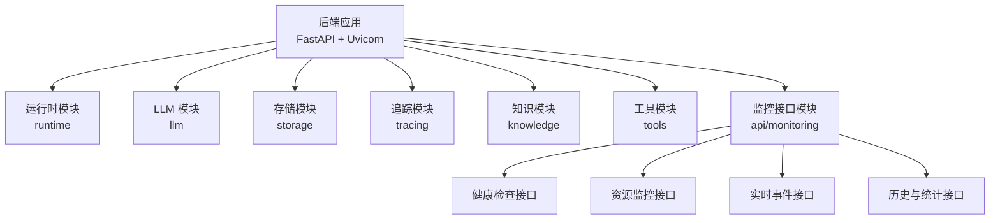
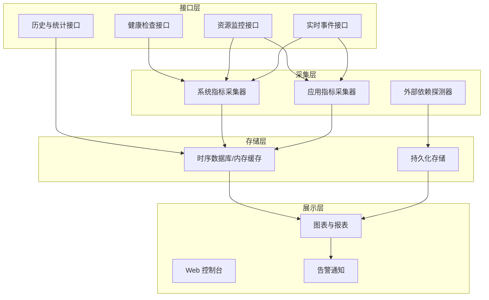
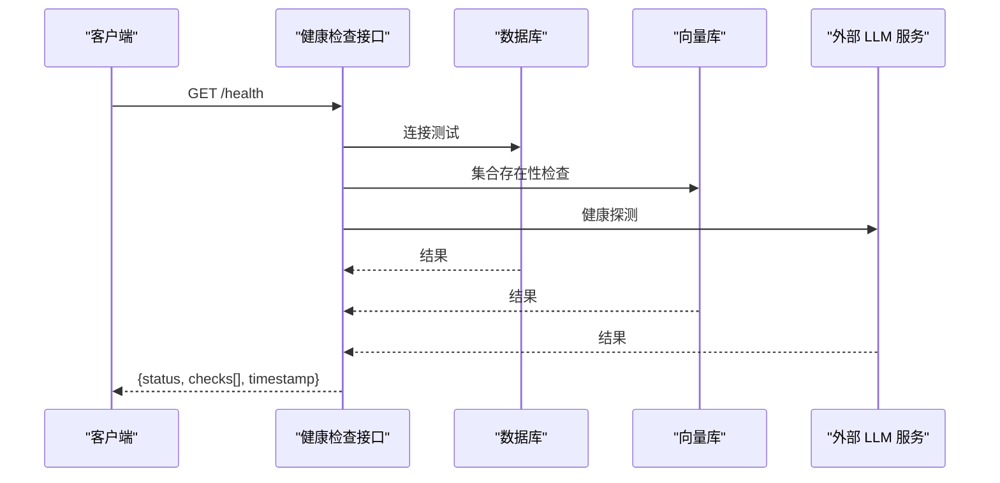
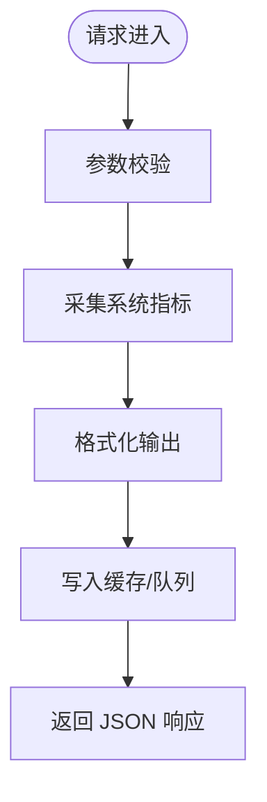
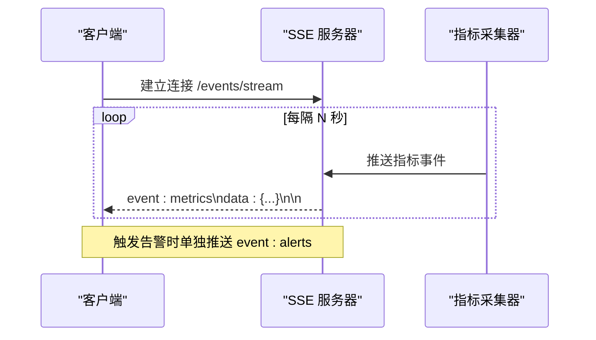
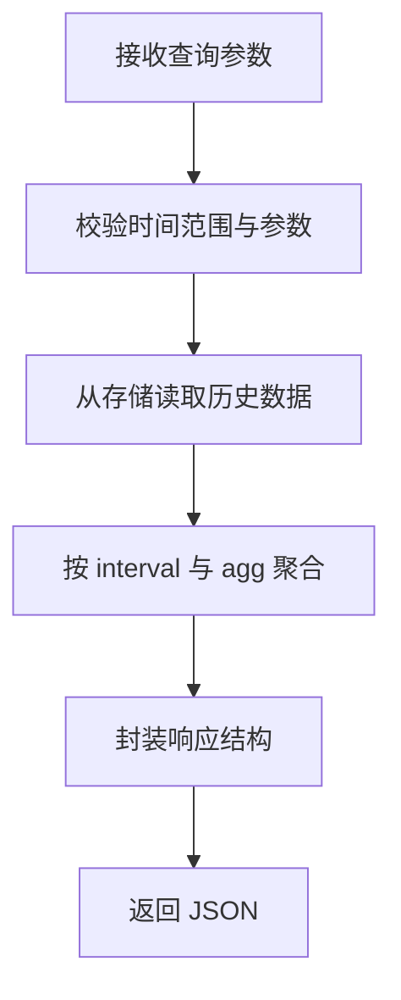
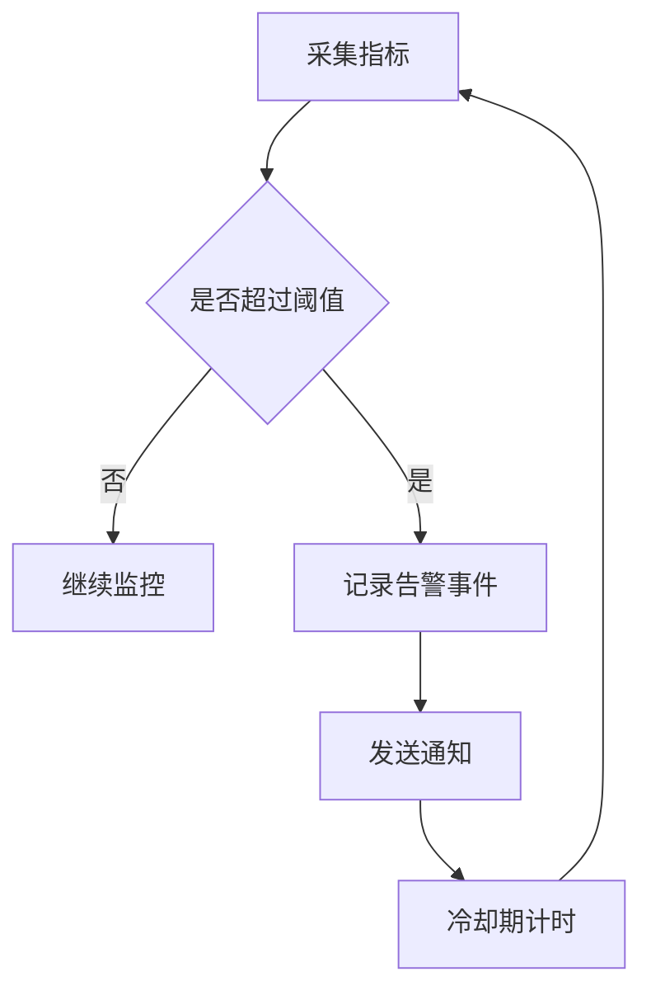
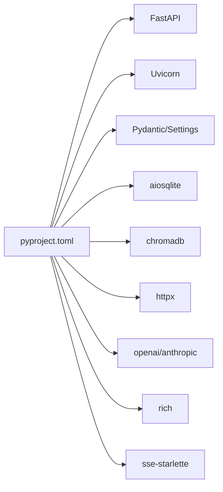

# 状态监控 API

<cite>
**本文引用的文件**
- [backend/pyproject.toml](file://backend/pyproject.toml)
- [backend/kore/__init__.py](file://backend/kore/__init__.py)
</cite>

## 目录
1. [简介](#简介)
2. [项目结构](#项目结构)
3. [核心组件](#核心组件)
4. [架构总览](#架构总览)
5. [详细组件分析](#详细组件分析)
6. [依赖分析](#依赖分析)
7. [性能考虑](#性能考虑)
8. [故障排查指南](#故障排查指南)
9. [结论](#结论)
10. [附录](#附录)

## 简介
本文件旨在为 Kore 项目的“状态监控”能力提供完整的 API 接口文档。当前仓库中未发现直接的状态监控实现或路由定义文件，但根据项目的技术栈（FastAPI、Uvicorn）和模块化结构，可设计一套标准化的监控接口规范，覆盖系统健康检查、资源使用情况查询、实时数据流、历史数据与统计分析、告警阈值与通知、以及可视化与报表生成等能力。

由于当前代码库尚未包含具体监控实现，本文档以“接口规范+最佳实践”的形式呈现，便于后续在现有 FastAPI 基础上扩展实现。

## 项目结构
- 后端采用 Python 与 FastAPI 框架，使用 Uvicorn 作为 ASGI 服务器。
- 项目按领域模块划分（如 runtime、llm、storage、tracing 等），便于后续在相应模块中集成监控接口。
- 未发现现有监控 API 路由文件，建议在 api 目录下新增监控路由模块，并在主应用入口注册。

**章节来源**
- [backend/pyproject.toml:1-34](file://backend/pyproject.toml#L1-L34)

## 核心组件
- 健康检查接口：用于快速判断服务可用性与依赖项状态。
- 资源监控接口：返回 CPU、内存、磁盘、网络等指标。
- 实时事件接口：通过 SSE 提供近实时监控数据推送。
- 历史与统计接口：支持时间范围查询与聚合统计。
- 告警与通知：阈值配置、触发条件与通知通道。
- 可视化与报表：图表渲染与导出能力。

## 架构总览
监控系统建议采用“接口层 + 采集层 + 存储层 + 展示层”的分层架构，结合 FastAPI 的异步能力与 SSE 支持，实现低延迟、高并发的监控体验。

## 详细组件分析

### 健康检查接口
- 功能：验证服务自身与关键依赖（数据库、向量库、外部 LLM 服务等）的连通性与可用性。
- 请求方法：GET
- 路径：/health
- 响应字段：
  - status：服务状态（healthy/unhealthy）
  - checks：各子系统检查结果列表（名称、状态、耗时、错误信息）
  - timestamp：检查时间戳
- 示例响应结构（字段说明）：
  - status: 字符串，枚举值
  - checks: 数组，元素包含 name、status、duration_ms、error
  - timestamp: 时间戳

**章节来源**
- [backend/pyproject.toml:7-18](file://backend/pyproject.toml#L7-L18)

### 资源监控接口
- 功能：返回系统与应用的资源使用情况。
- 请求方法：GET
- 路径：/metrics/system
- 响应字段（示例）：
  - cpu：CPU 使用率百分比
  - memory：内存使用量与总量
  - disk：磁盘使用量与总量
  - network：入/出带宽与连接数
  - uptime：服务运行时长
  - timestamp：采样时间戳
- 数据刷新频率：建议每 5-15 秒采样一次，可根据负载调整。

**章节来源**
- [backend/pyproject.toml:7-18](file://backend/pyproject.toml#L7-L18)

### 实时事件接口（SSE）
- 功能：持续推送系统与应用的实时指标变化。
- 请求方法：GET
- 路径：/events/stream
- 事件类型：metrics（周期性）、alerts（触发时）
- 事件数据：JSON 对象，包含指标名称、数值、时间戳、标签等。
- 客户端断线重连：建议客户端实现指数退避重连策略。

**章节来源**
- [backend/pyproject.toml:18](file://backend/pyproject.toml#L18)

### 历史与统计接口
- 功能：按时间范围查询历史指标，支持聚合统计（均值、最大值、最小值、分位数）。
- 请求方法：GET
- 路径：/metrics/history
- 查询参数：
  - metric：指标名称（必填）
  - start_time：开始时间（必填）
  - end_time：结束时间（必填）
  - interval：聚合间隔（如 1m/5m/1h）
  - agg：聚合函数（avg/max/min/count/percentile）
- 响应字段：
  - series：时间序列数组，元素包含 timestamp 与 value
  - summary：统计摘要（count、avg、min、max、p95 等）

**章节来源**
- [backend/pyproject.toml:7-18](file://backend/pyproject.toml#L7-L18)

### 告警与通知
- 阈值配置：
  - CPU 使用率 > 90% 持续 5 分钟
  - 内存使用率 > 85%
  - 磁盘剩余 < 10%
  - LLM 服务响应时间 > 5s
- 触发条件：滑动窗口 + 延迟冷却
- 通知渠道：邮件、Webhook、IM（如企业微信/钉钉）
- 建议：将阈值与通知规则持久化到配置中心或数据库，支持动态更新。

### 可视化与报表
- 图表：折线图（趋势）、柱状图（分布）、仪表盘（实时指标）
- 报表：日/周/月报，导出为 PDF/CSV
- 建议：前端使用图表库（如 ECharts 或 Chart.js），后端提供标准数据格式接口

## 依赖分析
- FastAPI：提供高性能异步 Web 框架与自动 OpenAPI 文档
- Uvicorn：ASGI 服务器，支持 SSE
- Pydantic/Pydantic-settings：模型定义与配置管理
- aiosqlite/ChromaDB：本地数据与向量存储
- httpx/openai/anthropic：外部服务集成
- rich/sse-starlette：终端输出与 SSE 支持

**图表来源**
- [backend/pyproject.toml:1-34](file://backend/pyproject.toml#L1-L34)

**章节来源**
- [backend/pyproject.toml:1-34](file://backend/pyproject.toml#L1-L34)

## 性能考虑
- 采样频率与数据粒度：根据硬件与业务负载选择合适的采样间隔，避免过度采集导致 IO 压力。
- 缓存策略：热点指标放入内存缓存，降低数据库压力；设置合理的过期时间。
- 并发与限流：对监控接口进行速率限制，防止突发流量影响生产服务。
- 异步化：利用 FastAPI 的异步特性与 SSE，提升实时推送吞吐量。
- 压缩与分页：历史数据查询支持分页与压缩传输，减少带宽消耗。

## 故障排查指南
- 健康检查失败：
  - 检查数据库连接字符串与权限
  - 验证向量库服务可达性与索引状态
  - 核对外部 LLM 服务的鉴权与配额
- 实时事件断流：
  - 确认客户端网络与代理设置
  - 检查服务器 SSE 配置与超时参数
- 历史数据缺失：
  - 核对时间范围与时区
  - 检查存储后端的保留策略与清理任务
- 告警不触发：
  - 复核阈值配置与触发条件
  - 查看告警日志与冷却期设置

## 结论
本文件基于 Kore 当前技术栈与模块化结构，提出了状态监控 API 的完整接口规范与实施建议。建议优先实现健康检查与系统指标接口，随后逐步完善实时事件、历史统计、告警通知与可视化能力，确保监控体系与业务系统解耦、可扩展且易于维护。

## 附录
- 访问权限与安全限制：
  - 建议对监控接口启用认证与授权（如基于 Token 的 RBAC）
  - 对外暴露的监控接口需走内网或受控出口
  - 对敏感指标（如密钥、内部路径）进行脱敏处理
- 数据保留策略：
  - 短期指标（秒级）保留 7 天
  - 中期指标（分钟级）保留 30 天
  - 长期指标（小时/天级）保留 1 年
- 版本与兼容性：
  - API 版本化（/api/v1/...），保证向后兼容
  - 对于破坏性变更，提供迁移指南与过渡期