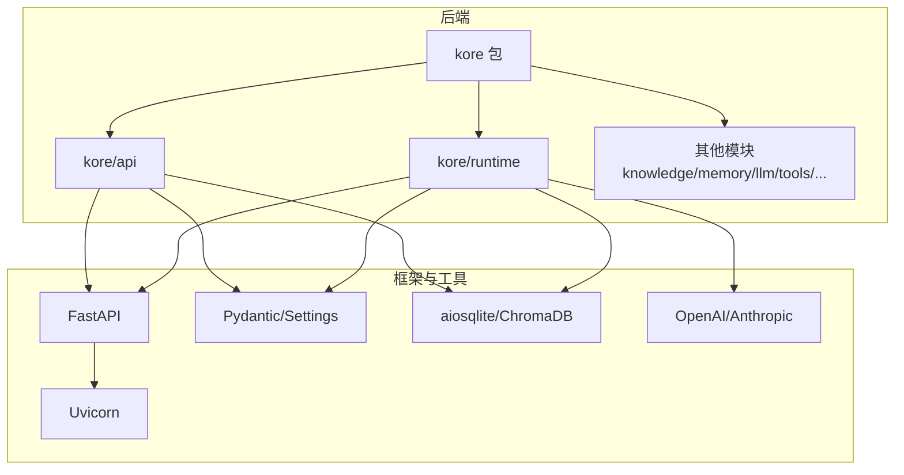
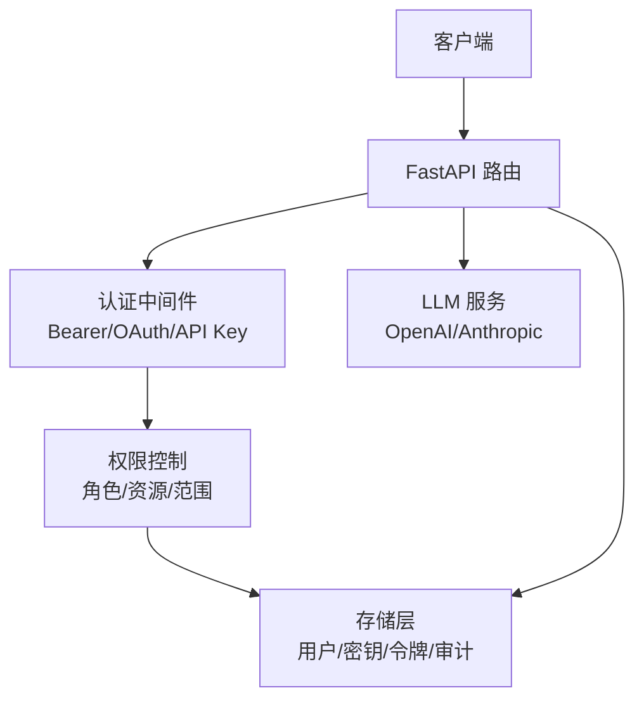
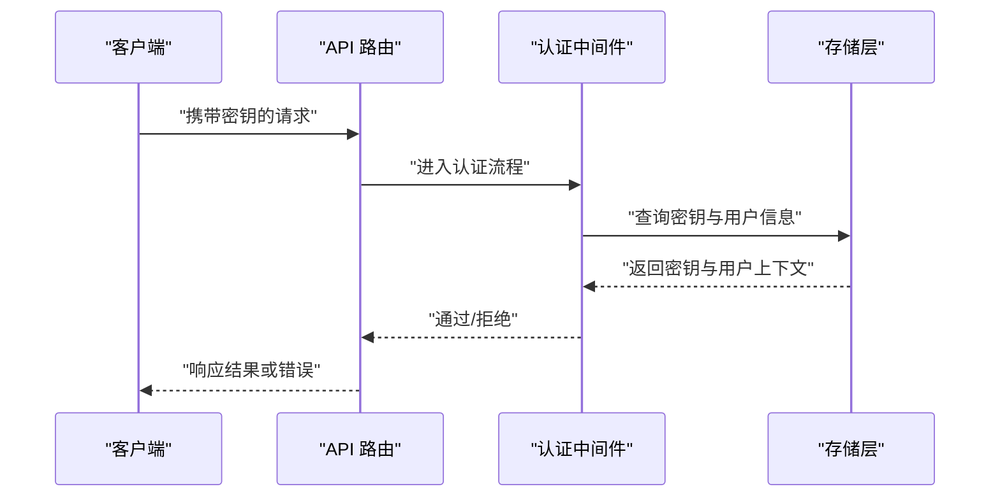
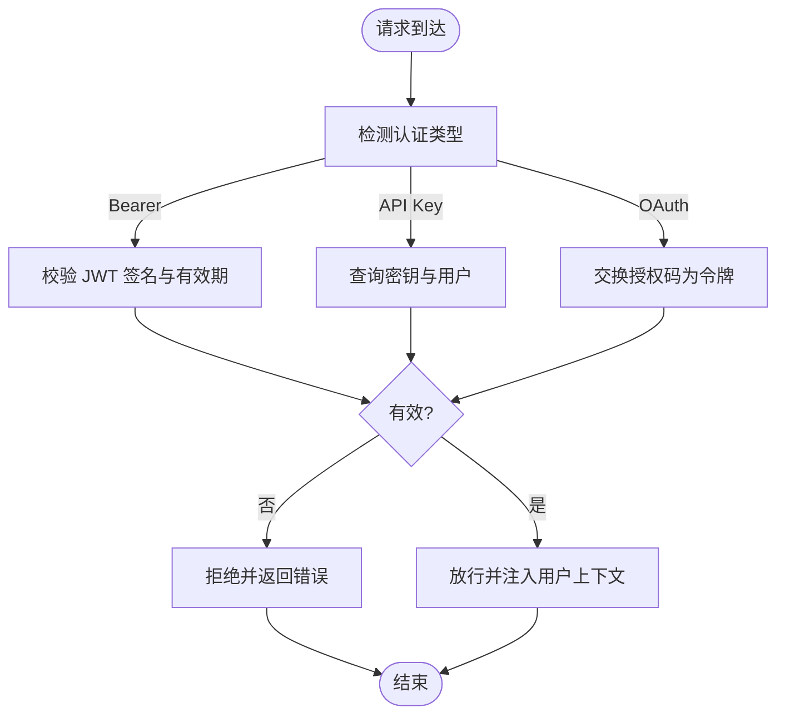
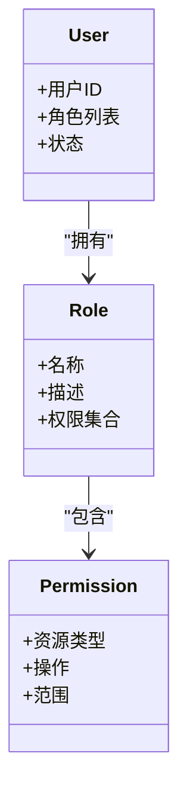
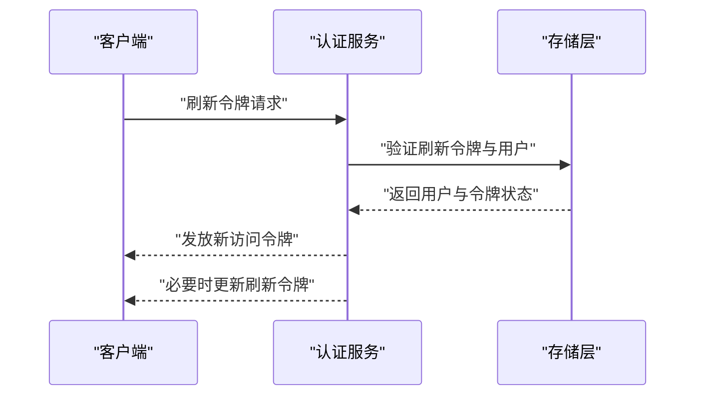
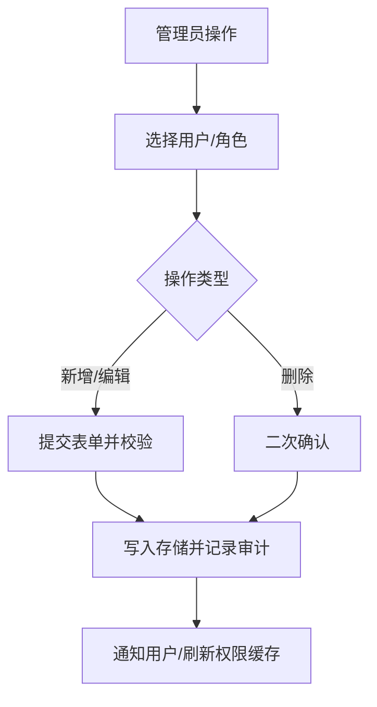
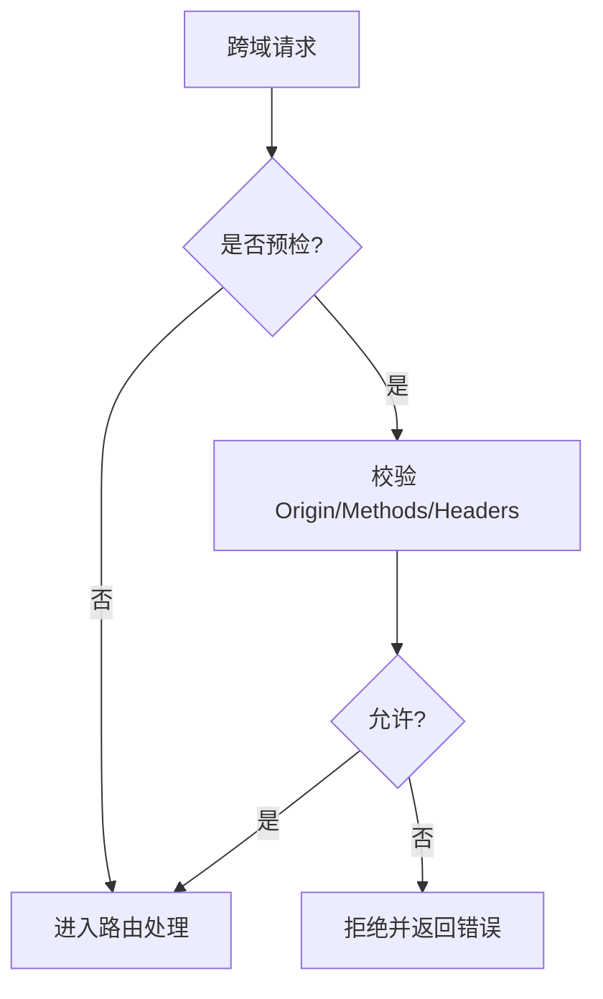
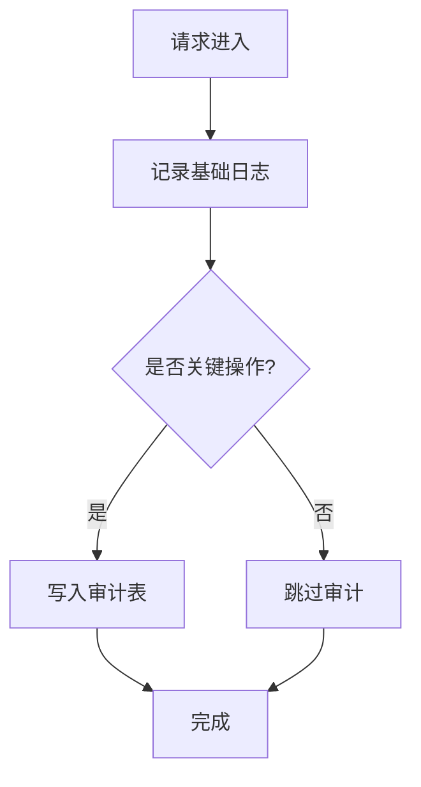
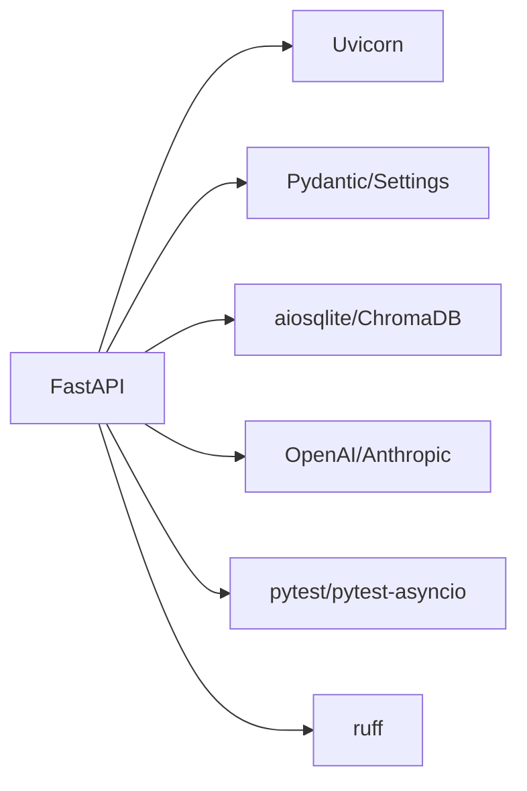

# 认证与授权

<cite>
**本文引用的文件**
- [pyproject.toml](file://backend/pyproject.toml)
- [__init__.py](file://backend/kore/__init__.py)
- [api/__init__.py](file://backend/kore/api/__init__.py)
- [runtime/__init__.py](file://backend/kore/runtime/__init__.py)
</cite>

## 目录
1. [引言](#引言)
2. [项目结构](#项目结构)
3. [核心组件](#核心组件)
4. [架构总览](#架构总览)
5. [详细组件分析](#详细组件分析)
6. [依赖分析](#依赖分析)
7. [性能考虑](#性能考虑)
8. [故障排除指南](#故障排除指南)
9. [结论](#结论)
10. [附录](#附录)

## 引言
本文件聚焦于 Kore 后端的 API 认证与授权机制设计与实现指导。当前仓库中未包含具体的认证实现代码（如路由、中间件、模型或服务层），但通过依赖清单与模块组织可知系统基于 FastAPI 构建，并具备扩展认证与授权能力的基础。本文将基于现有信息，提供一套可落地的认证与授权方案：涵盖 API 密钥生成与管理、多种认证方式（Bearer Token、API Key、OAuth）的实现路径、权限与角色模型、会话与令牌刷新策略、安全最佳实践、访问日志与审计、跨域配置以及认证失败的错误处理与用户体验优化建议。

## 项目结构
后端采用模块化组织，核心模块位于 backend/kore 下，当前可见的模块包括：
- kore：顶层包
- kore/api：API 路由与端点
- kore/runtime：运行时与代理核心
- 其他子模块：knowledge、memory、llm、tools、solver、storage、prompting、channels、mcp、skills、tracing 等

FastAPI 作为 Web 框架，是实现认证中间件、依赖注入、权限控制与路由装饰器的最佳载体；uvicorn 提供 ASGI 服务器支持；pydantic 与 pydantic-settings 支持配置与数据验证；aiosqlite、chromadb、httpx、openai、anthropic 等为业务能力提供支撑。

**图表来源**
- [pyproject.toml:6-19](file://backend/pyproject.toml#L6-L19)
- [__init__.py:1-1](file://backend/kore/__init__.py#L1-L1)
- [api/__init__.py:1-1](file://backend/kore/api/__init__.py#L1-L1)
- [runtime/__init__.py:1-1](file://backend/kore/runtime/__init__.py#L1-L1)

**章节来源**
- [pyproject.toml:1-35](file://backend/pyproject.toml#L1-L35)

## 核心组件
- Web 框架与服务器
  - FastAPI：用于构建 API 路由、依赖注入、异常处理与 OpenAPI 文档生成。
  - Uvicorn：ASGI 服务器，负责 HTTP/HTTPS 传输与连接管理。
- 数据与配置
  - Pydantic/Pydantic Settings：用于配置模型与环境变量加载，确保密钥与敏感参数的安全读取。
  - aiosqlite/ChromaDB：本地数据库与向量存储，可用于持久化用户、密钥、令牌与审计日志。
- 大模型集成
  - OpenAI/Anthropic：LLM 服务调用，通常需要在请求头中携带相应密钥，体现 API Key 的使用场景。
- SSE 支持
  - sse-starlette：用于流式响应，常配合认证中间件进行连接级鉴权。

上述组件为认证与授权的实现提供了基础设施：路由层负责拦截与校验，存储层负责持久化与审计，配置层负责密钥与策略管理。

**章节来源**
- [pyproject.toml:6-19](file://backend/pyproject.toml#L6-L19)

## 架构总览
下图展示了认证与授权在系统中的位置与交互关系。该图为概念性架构，展示从客户端到路由、中间件、权限控制与存储的典型流程。

[本图为概念性架构，不直接映射具体源码文件，因此不提供图表来源]

## 详细组件分析

### API 密钥生成、管理与使用
- 密钥生成
  - 建议使用安全随机数生成器生成唯一密钥标识与密钥材料，密钥材料仅保存哈希值，避免明文泄露。
  - 密钥应包含元数据：所属用户、用途（API Key/Service Account）、有效期、状态（启用/禁用）、创建时间与更新时间。
- 密钥管理
  - 存储：将密钥哈希与元数据存入数据库，敏感字段加密存储，最小化明文暴露面。
  - 生命周期：支持撤销、轮换与自动过期；提供批量失效与审计追踪。
  - 分发：首次生成后仅在创建时返回完整密钥材料，后续仅显示部分前缀/后缀以保护安全。
- 密钥使用
  - 在请求头中携带 Authorization: Bearer <token> 或自定义头部 X-API-Key。
  - 路由中间件解析并校验密钥，查询用户上下文与权限范围，拒绝无效或过期密钥。
  - 对高频请求实施速率限制与配额控制，防止滥用。

[本图为概念性流程，不直接映射具体源码文件，因此不提供图表来源]

### 认证方式实现
- Bearer Token（JWT）
  - 适用场景：用户登录后发放短期 JWT，支持刷新令牌与撤销列表。
  - 实现要点：签发时包含用户标识、角色、到期时间与签名算法；校验时检查签名、过期时间与黑名单。
- API Key
  - 适用场景：服务间调用、第三方集成与自动化脚本。
  - 实现要点：支持多密钥、按用途分类、速率限制与配额；支持临时密钥与一次性密钥。
- OAuth/OpenID Connect
  - 适用场景：企业 SSO、第三方登录与第三方应用授权。
  - 实现要点：使用标准授权码流程，回调地址白名单，ID Token 与 Access Token 分离，作用域最小化。

[本图为概念性流程，不直接映射具体源码文件，因此不提供图表来源]

### 权限级别与角色管理
- 角色模型
  - 用户角色：普通用户、管理员、审计员等。
  - 资源权限：按资源类型（知识库、代理、工具）与操作（读/写/删除/执行）定义细粒度权限。
  - 作用域与范围：OAuth 中的作用域与 API Key 的用途范围，最小授权原则。
- 权限判定
  - 在路由层或依赖注入中进行权限判定，结合用户角色与资源所有权进行合并判断。
  - 对于动态权限（如共享资源），在业务逻辑层补充二次校验。
- 变更与审计
  - 所有权限变更需记录审计日志，支持回溯与合规检查。

[本图为概念性类图，不直接映射具体源码文件，因此不提供图表来源]

### 会话管理与令牌刷新
- 会话模型
  - 短期会话：JWT 令牌有效期短，适合交互式 API。
  - 长期会话：Refresh Token 存储在安全 Cookie 或受控存储中，支持静默续期。
- 刷新机制
  - 客户端在 Access Token 过期前发起刷新请求，服务端验证 Refresh Token 并签发新的 Access Token。
  - 支持撤销刷新令牌与黑名单，防止已泄露令牌被复用。
- 安全措施
  - Refresh Token 与 Access Token 分离存储；刷新接口仅允许 HTTPS；绑定设备指纹或 IP 白名单。

[本图为概念性流程，不直接映射具体源码文件，因此不提供图表来源]

### 角色与用户管理接口与流程
- 接口建议
  - 用户注册/登录：支持邮箱/手机号与密码，或外部 OAuth 登录。
  - 用户资料：修改基本信息、绑定/解绑外部账号。
  - 角色与权限：分配角色、调整权限范围、批量导入导出。
  - 密钥管理：创建、轮换、撤销、查看使用统计。
- 流程要点
  - 所有敏感操作需二次确认与审计日志。
  - 角色变更即时生效，避免缓存导致的权限滞后。

[本图为概念性流程，不直接映射具体源码文件，因此不提供图表来源]

### 跨域请求配置与处理
- CORS 配置
  - 仅开放必要的域名与方法，严格限制凭据与头部。
  - 开发环境允许宽松配置，生产环境严格白名单。
- 预检请求
  - 正确处理 OPTIONS 预检，避免阻断前端开发工具链。
- 安全注意
  - 避免通配符 *，优先使用精确域名；对敏感端点关闭跨域。

[本图为概念性流程，不直接映射具体源码文件，因此不提供图表来源]

### API 访问日志与审计
- 日志内容
  - 请求时间、IP、用户标识、端点、方法、状态码、耗时、错误码与原因。
  - 敏感字段脱敏（如密钥、密码、令牌）。
- 审计范围
  - 关键操作：用户注册/登录、角色变更、密钥创建/撤销、权限调整、数据导出。
  - 存储：本地文件或集中式日志系统，保留至少 90 天。
- 查询与告警
  - 提供日志检索接口与异常行为告警（如频繁失败、异常地域访问）。

[本图为概念性流程，不直接映射具体源码文件，因此不提供图表来源]

## 依赖分析
- 框架与运行时
  - FastAPI：提供路由、依赖注入、异常处理与 OpenAPI 支持，是实现认证中间件与权限控制的核心。
  - Uvicorn：ASGI 服务器，负责 HTTP/HTTPS 传输与连接生命周期管理。
- 数据与配置
  - Pydantic/Pydantic Settings：用于配置模型与环境变量加载，确保密钥与敏感参数的安全读取。
  - aiosqlite/ChromaDB：本地数据库与向量存储，可用于持久化用户、密钥、令牌与审计日志。
- 外部服务
  - OpenAI/Anthropic：LLM 服务调用，通常需要在请求头中携带相应密钥，体现 API Key 的使用场景。
- 工具与测试
  - pytest/pytest-asyncio：异步测试支持，便于编写认证与授权相关的单元测试与集成测试。
  - ruff：代码风格与静态检查，保障安全与可维护性。

**图表来源**
- [pyproject.toml:6-19](file://backend/pyproject.toml#L6-L19)

**章节来源**
- [pyproject.toml:1-35](file://backend/pyproject.toml#L1-L35)

## 性能考虑
- 认证中间件
  - 将密钥/令牌解析与用户查询放在中间件层，尽量减少重复查询；对用户上下文进行轻量缓存。
- 存储访问
  - 使用连接池与索引优化，避免 N+1 查询；对热点数据进行内存缓存。
- 令牌大小
  - JWT 应保持精简，避免携带过多声明；长列表权限建议服务端拉取。
- 速率限制
  - 结合 IP/用户维度实施速率限制，防止暴力破解与滥用。

[本节为通用性能建议，不直接分析具体文件，因此不提供章节来源]

## 故障排除指南
- 常见错误
  - 401 未认证：检查请求头格式、令牌签名与有效期；确认密钥状态与权限范围。
  - 403 禁止访问：核对用户角色与资源权限；检查作用域与范围。
  - 429 过载保护：检查速率限制配置与配额；优化客户端重试策略。
- 用户体验优化
  - 明确错误提示与重试指引；提供自助重置与申诉渠道。
  - 对于 OAuth，提供清晰的授权页面与取消授权选项。
- 审计与监控
  - 记录失败原因与时间序列，设置阈值告警；定期审查异常模式。

[本节为通用故障排除建议，不直接分析具体文件，因此不提供章节来源]

## 结论
本文件基于现有依赖与模块组织，提出了 Kore 后端认证与授权的完整方案：以 FastAPI 为核心，结合安全的密钥与令牌管理、细粒度的角色与权限模型、完善的会话与审计体系，以及严格的跨域与日志策略。由于当前仓库未包含具体实现代码，建议在 kore/api 与 kore/runtime 模块中逐步引入认证中间件、权限控制与审计日志功能，并通过测试驱动开发确保安全性与稳定性。

[本节为总结性内容，不直接分析具体文件，因此不提供章节来源]

## 附录
- 快速检查清单
  - 是否使用 HTTPS 与安全的 Cookie 属性？
  - 是否对敏感日志字段进行脱敏？
  - 是否对所有外部服务调用进行密钥隔离与限额？
  - 是否提供密钥轮换与撤销能力？
  - 是否对异常访问行为进行告警？

[本节为通用附录，不直接分析具体文件，因此不提供章节来源]