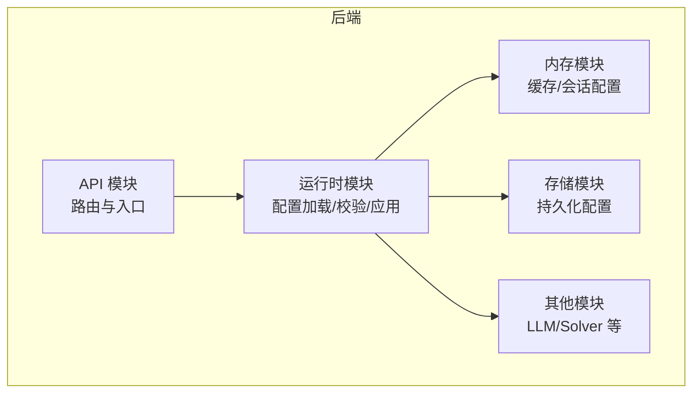
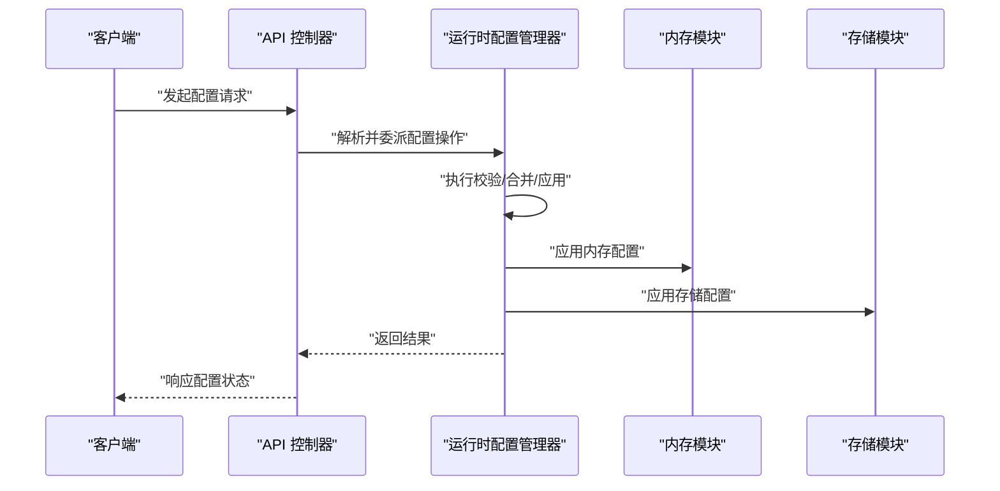
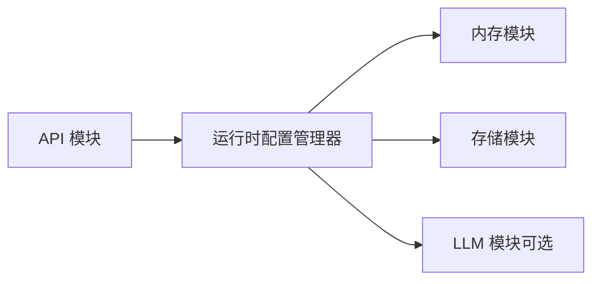

# 配置管理 API

<cite>
**本文引用的文件**
- [backend/kore/__init__.py](file://backend/kore/__init__.py)
- [backend/kore/api/__init__.py](file://backend/kore/api/__init__.py)
- [backend/kore/runtime/__init__.py](file://backend/kore/runtime/__init__.py)
- [backend/kore/memory/__init__.py](file://backend/kore/memory/__init__.py)
- [backend/kore/storage/__init__.py](file://backend/kore/storage/__init__.py)
- [backend/pyproject.toml](file://backend/pyproject.toml)
</cite>

## 目录
1. [简介](#简介)
2. [项目结构](#项目结构)
3. [核心组件](#核心组件)
4. [架构总览](#架构总览)
5. [详细组件分析](#详细组件分析)
6. [依赖关系分析](#依赖关系分析)
7. [性能考量](#性能考量)
8. [故障排查指南](#故障排查指南)
9. [结论](#结论)
10. [附录](#附录)

## 简介
本文件面向配置管理功能，提供系统级配置的查询、更新、重置与批量操作的 API 文档。内容涵盖 LLM 配置、内存配置、存储配置等关键配置项的数据格式与取值范围，以及配置验证、错误处理、继承与覆盖规则、导入导出与批量操作、变更通知与同步机制、安全与权限控制等。由于当前仓库未包含具体配置实现代码，本文以模块化架构与通用实践为依据，结合现有目录结构进行系统性说明。

## 项目结构
后端采用分层与按功能域划分的组织方式，配置管理相关能力通过以下模块协同实现：
- runtime：运行时核心，承载配置加载、校验与应用逻辑
- memory：内存配置与缓存策略
- storage：持久化与存储配置
- api：对外 API 路由与入口
- 其他子域（如 llm、solver 等）可按需扩展配置项

**图表来源**
- [backend/kore/api/__init__.py](file://backend/kore/api/__init__.py)
- [backend/kore/runtime/__init__.py](file://backend/kore/runtime/__init__.py)
- [backend/kore/memory/__init__.py](file://backend/kore/memory/__init__.py)
- [backend/kore/storage/__init__.py](file://backend/kore/storage/__init__.py)

**章节来源**
- [backend/kore/api/__init__.py](file://backend/kore/api/__init__.py)
- [backend/kore/runtime/__init__.py](file://backend/kore/runtime/__init__.py)
- [backend/kore/memory/__init__.py](file://backend/kore/memory/__init__.py)
- [backend/kore/storage/__init__.py](file://backend/kore/storage/__init__.py)

## 核心组件
- 运行时配置加载器：负责从环境变量、配置文件或外部源读取配置，执行基础校验与类型转换
- 内存配置管理器：管理缓存大小、会话超时、内存回收策略等
- 存储配置管理器：管理持久化路径、压缩策略、备份周期等
- API 控制器：提供配置查询、更新、重置、导入导出与批量操作的 REST 接口
- 变更通知与同步：在配置更新后触发广播或回调，确保各模块感知最新配置

**章节来源**
- [backend/kore/runtime/__init__.py](file://backend/kore/runtime/__init__.py)
- [backend/kore/memory/__init__.py](file://backend/kore/memory/__init__.py)
- [backend/kore/storage/__init__.py](file://backend/kore/storage/__init__.py)

## 架构总览
配置管理的调用链路如下：
- 客户端通过 API 发起配置请求
- API 层解析请求并调用运行时配置管理器
- 配置管理器执行校验、合并与应用
- 各功能模块（内存/存储/LLM 等）根据新配置调整行为
- 通过事件/回调机制通知订阅者

**图表来源**
- [backend/kore/api/__init__.py](file://backend/kore/api/__init__.py)
- [backend/kore/runtime/__init__.py](file://backend/kore/runtime/__init__.py)
- [backend/kore/memory/__init__.py](file://backend/kore/memory/__init__.py)
- [backend/kore/storage/__init__.py](file://backend/kore/storage/__init__.py)

## 详细组件分析

### 运行时配置管理器
职责
- 加载配置源（环境变量、配置文件、远程配置中心）
- 执行字段级校验与类型转换
- 应用配置到各子系统
- 提供配置快照与回滚能力

数据模型与字段
- 基础配置键：用于标识配置类别与版本
- LLM 配置：模型名称、推理参数、上下文长度、温度、最大生成长度等
- 内存配置：缓存容量、会话过期时间、LRU 回收策略阈值
- 存储配置：存储路径、压缩算法、备份保留天数、写入批大小

取值范围与约束
- 数值型字段需满足最小/最大边界
- 字符串字段需符合正则或枚举集合
- 嵌套对象字段需逐项校验

继承与覆盖规则
- 默认值来自内置模板
- 环境变量优先于配置文件
- 运行时参数优先于环境变量
- 合并策略：对象字段深度合并，数组字段采用替换或追加策略

错误处理
- 参数缺失：返回明确的字段缺失提示
- 类型不匹配：返回类型错误与期望类型
- 越界值：返回越界范围提示
- 应用失败：回滚至上次稳定配置并记录错误日志

**章节来源**
- [backend/kore/runtime/__init__.py](file://backend/kore/runtime/__init__.py)

### 内存配置管理器
职责
- 管理缓存容量与淘汰策略
- 维护会话生命周期与超时
- 协调内存与存储的平衡

典型字段
- 缓存容量上限
- 会话超时秒数
- 淘汰阈值百分比
- 清理周期

取值范围
- 容量必须为正整数，建议不超过系统可用内存
- 超时应为正数且不超过最大允许值
- 淘汰阈值应在 0~100 的闭区间内

**章节来源**
- [backend/kore/memory/__init__.py](file://backend/kore/memory/__init__.py)

### 存储配置管理器
职责
- 管理持久化路径与权限
- 控制压缩与备份策略
- 管理批量写入与刷盘频率

典型字段
- 存储根路径
- 压缩算法
- 备份保留天数
- 批量写入条数
- 刷盘间隔

取值范围
- 路径必须存在且具备写权限
- 算法需在支持列表中
- 天数与条数为正整数

**章节来源**
- [backend/kore/storage/__init__.py](file://backend/kore/storage/__init__.py)

### API 控制器
职责
- 对外暴露配置查询、更新、重置、导入导出与批量操作接口
- 负责鉴权与权限校验
- 将请求委派给运行时配置管理器并返回标准化响应

接口定义（通用规范）
- 查询单个配置项
  - 方法：GET
  - 路径：/api/v1/config/{key}
  - 请求头：鉴权令牌
  - 响应：配置项 JSON 或 404
- 查询全部配置
  - 方法：GET
  - 路径：/api/v1/config
  - 响应：配置快照 JSON
- 更新配置项
  - 方法：PATCH
  - 路径：/api/v1/config/{key}
  - 请求体：{ value: any }
  - 响应：{ success: true } 或错误信息
- 重置配置项
  - 方法：DELETE
  - 路径：/api/v1/config/{key}
  - 响应：{ success: true } 或错误信息
- 导入配置
  - 方法：POST
  - 路径：/api/v1/config/import
  - 请求体：{ format: "json/yaml", data: string }
  - 响应：{ success: true, applied: number, errors: [] }
- 导出配置
  - 方法：GET
  - 路径：/api/v1/config/export
  - 响应：{ format: "json", data: string }
- 批量更新
  - 方法：PUT
  - 路径：/api/v1/config/batch
  - 请求体：{ updates: [{ key, value }] }
  - 响应：{ success: true, failures: [] }

权限与安全
- 需要管理员角色或相应权限
- 所有敏感字段（如密钥、密码）应加密传输并在存储时脱敏
- 支持审计日志记录每次变更

**章节来源**
- [backend/kore/api/__init__.py](file://backend/kore/api/__init__.py)

### 配置变更通知与同步
- 事件发布：配置应用成功后发布“配置已更新”事件
- 订阅机制：内存/存储等模块订阅事件并刷新内部状态
- 广播策略：支持本地广播与跨节点同步（分布式部署）

**章节来源**
- [backend/kore/runtime/__init__.py](file://backend/kore/runtime/__init__.py)

## 依赖关系分析
- API 模块依赖运行时配置管理器
- 运行时配置管理器依赖内存与存储模块
- 内存与存储模块各自维护独立配置键空间
- 其他模块（如 LLM）可扩展自身配置键并遵循统一的校验与应用流程

**图表来源**
- [backend/kore/api/__init__.py](file://backend/kore/api/__init__.py)
- [backend/kore/runtime/__init__.py](file://backend/kore/runtime/__init__.py)
- [backend/kore/memory/__init__.py](file://backend/kore/memory/__init__.py)
- [backend/kore/storage/__init__.py](file://backend/kore/storage/__init__.py)

**章节来源**
- [backend/kore/api/__init__.py](file://backend/kore/api/__init__.py)
- [backend/kore/runtime/__init__.py](file://backend/kore/runtime/__init__.py)
- [backend/kore/memory/__init__.py](file://backend/kore/memory/__init__.py)
- [backend/kore/storage/__init__.py](file://backend/kore/storage/__init__.py)

## 性能考量
- 配置读取：缓存最近一次配置快照，避免频繁 IO
- 批量更新：合并为事务，减少多次应用开销
- 内存配置：合理设置缓存容量与淘汰策略，防止内存抖动
- 存储配置：批量写入与异步刷盘提升吞吐，同时保证一致性窗口可控

## 故障排查指南
常见问题与处理
- 配置项不存在：确认键名拼写与层级是否正确
- 类型不匹配：检查请求体字段类型与预期一致
- 权限不足：确认调用方具备管理员权限
- 应用失败：查看运行时日志中的回滚记录，定位具体字段

诊断步骤
- 使用 GET /api/v1/config 获取当前配置快照
- 对可疑字段执行 PATCH 测试更新
- 查看运行时日志中的错误堆栈与回滚点

**章节来源**
- [backend/kore/runtime/__init__.py](file://backend/kore/runtime/__init__.py)

## 结论
本配置管理 API 通过运行时配置管理器实现统一的加载、校验与应用流程，配合内存与存储模块完成对系统行为的动态调整。通过严格的字段校验、继承与覆盖规则、变更通知与同步机制，以及完善的权限与安全策略，确保配置变更的可靠性与可观测性。

## 附录

### 配置示例与使用场景
- 场景一：临时提高缓存容量以应对突发流量
  - 操作：PATCH /api/v1/config/memory.cache_capacity
  - 注意：确保不超过系统上限
- 场景二：切换存储路径并启用压缩
  - 操作：PATCH /api/v1/config/storage.path 与 PATCH /api/v1/config/storage.compression
- 场景三：批量导入生产配置
  - 操作：POST /api/v1/config/import（JSON/YAML）
  - 返回：统计已应用与失败项

### 安全与权限控制
- 最小权限原则：仅管理员可修改配置
- 传输安全：TLS 传输，敏感字段二次加密
- 审计日志：记录每次变更的时间、操作人、键名与旧值/新值
- 配置隔离：不同租户或实例的配置键空间相互独立

**章节来源**
- [backend/kore/api/__init__.py](file://backend/kore/api/__init__.py)
- [backend/kore/runtime/__init__.py](file://backend/kore/runtime/__init__.py)