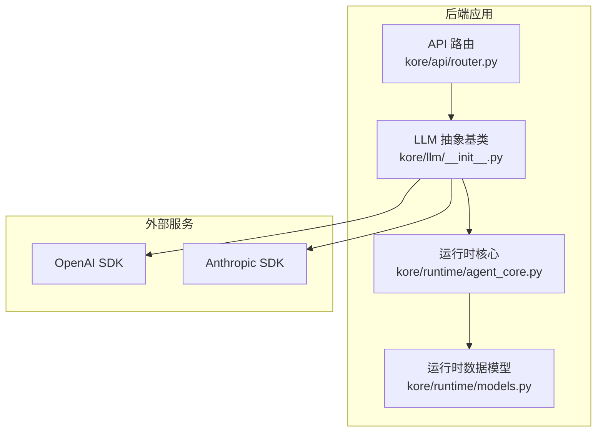
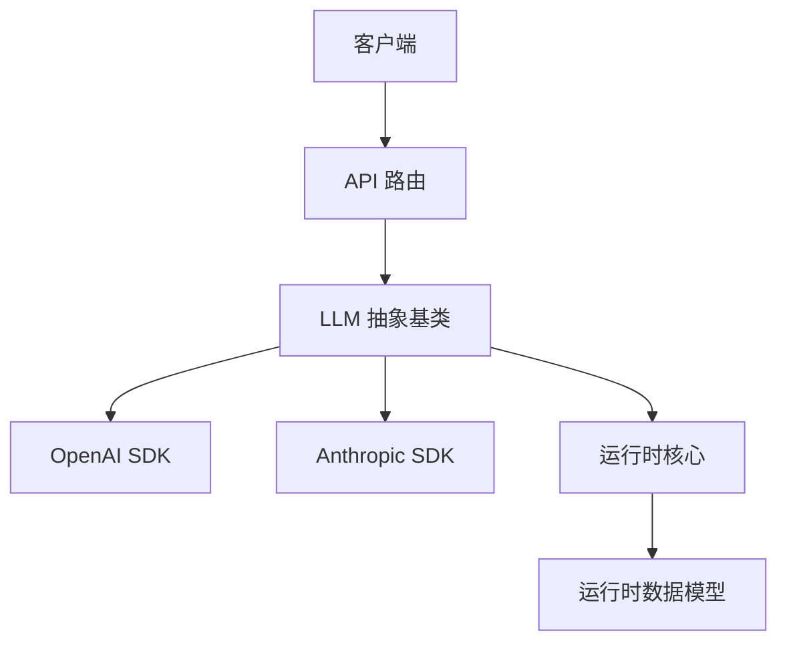
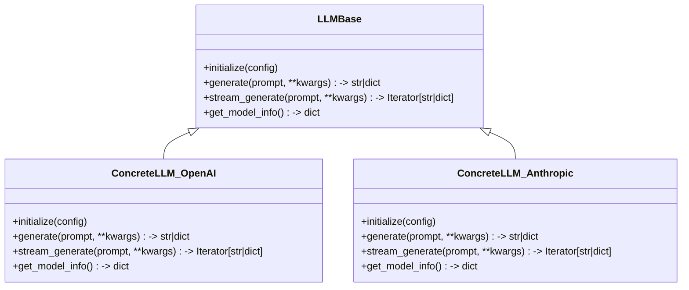
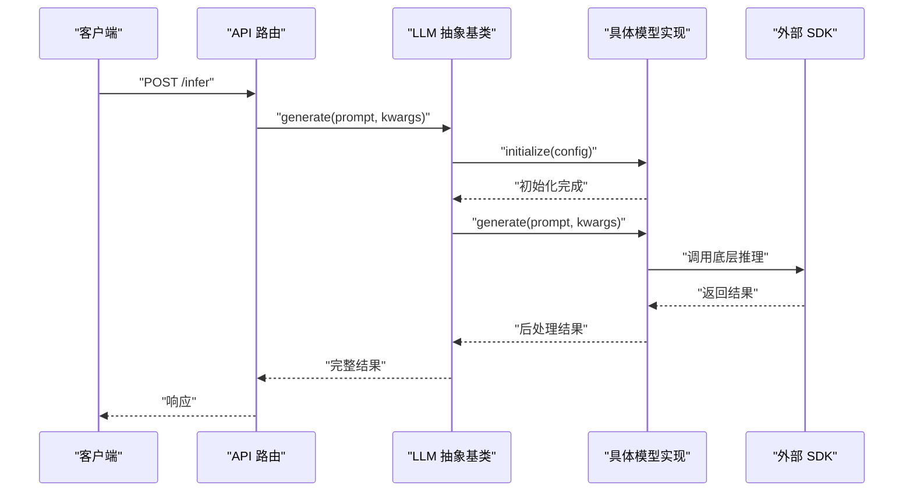
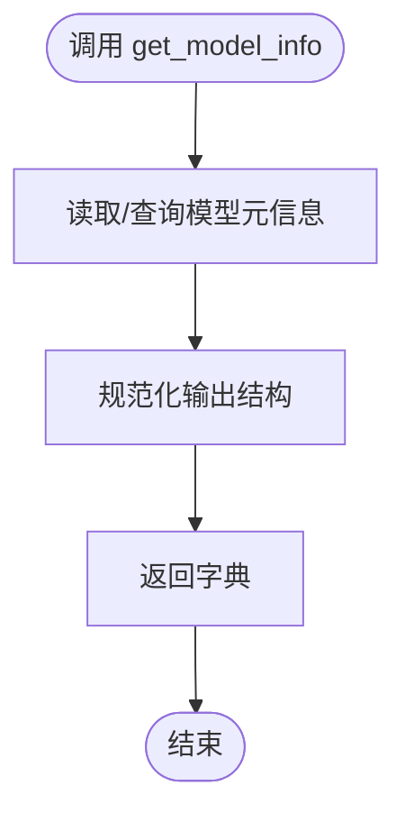
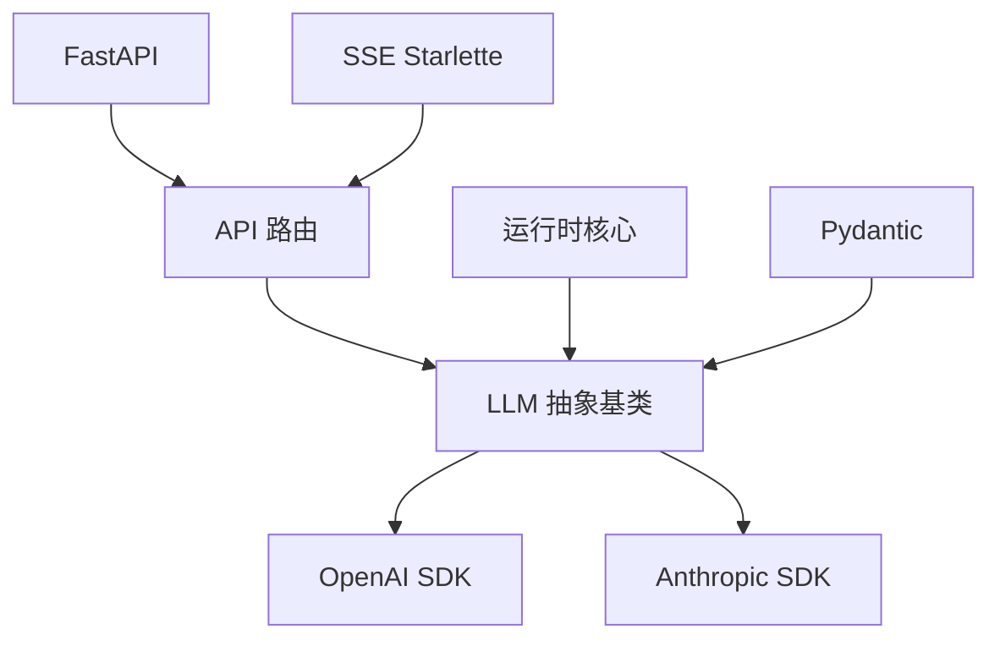

# LLM 基础架构

<cite>
**本文档引用的文件**
- [pyproject.toml](file://backend/pyproject.toml)
- [__init__.py](file://backend/kore/__init__.py)
- [router.py](file://backend/kore/api/router.py)
- [llm/__init__.py](file://backend/kore/llm/__init__.py)
</cite>

## 目录
1. [引言](#引言)
2. [项目结构](#项目结构)
3. [核心组件](#核心组件)
4. [架构总览](#架构总览)
5. [详细组件分析](#详细组件分析)
6. [依赖关系分析](#依赖关系分析)
7. [性能考虑](#性能考虑)
8. [故障排除指南](#故障排除指南)
9. [结论](#结论)

## 引言
本文件面向 Kore 智能体框架的 LLM 基础架构，聚焦于抽象基类的设计理念与接口规范，阐述模型初始化、推理调用、参数配置等核心方法的职责边界与使用方式；明确标准接口（如 generate、stream_generate、get_model_info）的作用与契约；梳理配置参数与约束条件（输入输出格式、参数验证规则），并总结继承最佳实践与注意事项，帮助开发者在不破坏统一接口的前提下实现自定义 LLM 类。同时阐明该基类在整个 LLM 集成系统中的作用与地位，以及如何通过统一接口确保不同模型的一致性。

## 项目结构
当前仓库后端采用模块化分层组织，LLM 子系统位于 kore/llm 目录下，配合 API 路由、运行时与工具模块协同工作。从依赖清单可见，项目集成了主流 LLM SDK（如 OpenAI、Anthropic），为后续实现具体 LLM 抽象基类提供了生态支持。

**章节来源**
- [pyproject.toml:1-34](file://backend/pyproject.toml#L1-L34)
- [router.py](file://backend/kore/api/router.py)
- [llm/__init__.py](file://backend/kore/llm/__init__.py)

## 核心组件
- 抽象基类：定义统一的 LLM 接口契约，屏蔽底层模型差异，提供标准化的推理能力与元信息查询能力。
- 标准接口：
  - 初始化与配置：负责加载模型、解析配置、校验参数、建立连接或会话。
  - 同步推理：generate(prompt, **kwargs) → 输出文本或结构化结果。
  - 流式推理：stream_generate(prompt, **kwargs) → 迭代返回增量片段。
  - 元信息查询：get_model_info() → 返回模型名称、版本、上下文长度、支持能力等。
- 参数与约束：
  - 输入输出格式：统一以字符串或消息列表形式接收 prompt；输出为字符串或流式片段。
  - 参数验证：对必填字段进行校验，对超长输入进行截断或报错策略。
  - 并发与资源：限制并发请求、控制缓存与会话生命周期。
- 继承最佳实践：
  - 明确职责边界：仅在子类中实现具体模型的调用细节，保持基类纯净。
  - 严格遵循接口契约：确保 generate/stream_generate/get_model_info 的行为与签名一致。
  - 错误处理与重试：在子类中实现幂等与可恢复的错误处理策略。
  - 文档与测试：为每个新实现补充接口文档与单元测试。

## 架构总览
LLM 抽象基类位于应用层与外部模型 SDK 之间，作为适配器与门面，向上提供统一接口，向下封装不同供应商的 SDK 差异。API 层通过路由调用 LLM，运行时负责状态管理与会话控制，最终将结果返回给客户端。

**图示来源**
- [router.py](file://backend/kore/api/router.py)
- [llm/__init__.py](file://backend/kore/llm/__init__.py)

## 详细组件分析

### 抽象基类设计与接口规范
- 设计理念
  - 单一职责：专注于统一接口与通用逻辑，不直接绑定具体实现。
  - 可扩展性：通过子类覆盖关键方法，实现不同模型的差异化行为。
  - 一致性：保证不同模型在相同调用方式下获得一致的体验。
- 关键方法职责
  - 初始化与配置：加载配置、校验参数、建立连接或会话。
  - 同步推理：执行一次完整推理，返回最终结果。
  - 流式推理：按块返回增量结果，适合实时展示与低延迟交互。
  - 元信息查询：返回模型能力、版本、上下文长度等静态信息。
- 使用方式
  - 外部调用方通过统一接口发起推理请求，无需关心底层模型差异。
  - 流式场景优先使用 stream_generate，非流式场景使用 generate。
  - 在需要选择模型或评估能力时，调用 get_model_info 获取元信息。

**图示来源**
- [llm/__init__.py](file://backend/kore/llm/__init__.py)

**章节来源**
- [llm/__init__.py](file://backend/kore/llm/__init__.py)

### 推理流程（同步与流式）
- 同步推理 generate
  - 输入：prompt（字符串或消息列表）、可选参数（如温度、最大长度等）。
  - 处理：参数校验、上下文组装、调用底层 SDK、结果后处理。
  - 输出：完整文本或结构化结果。
- 流式推理 stream_generate
  - 输入：与同步一致。
  - 处理：逐块生成并返回，支持中断与恢复。
  - 输出：迭代器，逐块返回增量片段。

**图示来源**
- [router.py](file://backend/kore/api/router.py)
- [llm/__init__.py](file://backend/kore/llm/__init__.py)

**章节来源**
- [router.py](file://backend/kore/api/router.py)
- [llm/__init__.py](file://backend/kore/llm/__init__.py)

### 元信息查询 get_model_info
- 作用：返回模型能力、版本、上下文长度、支持的参数集合等静态信息。
- 使用场景：前端动态渲染、模型选择、能力探测、限流与配额管理。
- 实现建议：在子类中维护常量或从 SDK 查询并规范化输出。

**图示来源**
- [llm/__init__.py](file://backend/kore/llm/__init__.py)

**章节来源**
- [llm/__init__.py](file://backend/kore/llm/__init__.py)

### 配置参数与约束条件
- 输入输出格式
  - prompt：字符串或消息列表（含角色与内容）。
  - 输出：字符串或结构化对象；流式模式返回迭代器。
- 参数验证规则
  - 必填参数：模型名称、API 密钥、基础 URL 等。
  - 数值范围：温度、最大长度、top_p 等需在有效区间内。
  - 长度限制：输入长度不得超过模型上下文上限。
- 并发与资源
  - 并发数限制：避免过度并发导致资源争用。
  - 会话与缓存：合理设置会话生命周期与缓存策略。

**章节来源**
- [llm/__init__.py](file://backend/kore/llm/__init__.py)

### 继承最佳实践与注意事项
- 最佳实践
  - 在子类中实现 initialize 时，先校验配置再建立连接。
  - generate 与 stream_generate 应保持语义一致，仅在返回方式上区分。
  - 对异常进行分类处理，区分网络错误、参数错误与模型内部错误。
  - 记录关键指标（耗时、Token 使用、错误码），便于监控与优化。
- 注意事项
  - 不要在基类中引入副作用或全局状态。
  - 严格遵守接口契约，避免破坏调用方预期。
  - 对外部 SDK 的变更保持兼容，必要时提供降级策略。

**章节来源**
- [llm/__init__.py](file://backend/kore/llm/__init__.py)

## 依赖关系分析
- 内部依赖
  - API 路由依赖 LLM 抽象基类提供统一推理能力。
  - 运行时核心依赖 LLM 提供推理接口与元信息。
- 外部依赖
  - OpenAI 与 Anthropic SDK 用于具体模型调用。
  - Pydantic 用于配置与数据模型的校验。
  - FastAPI 与 SSE Starlette 用于 API 与流式响应。

**图示来源**
- [pyproject.toml:1-34](file://backend/pyproject.toml#L1-L34)
- [router.py](file://backend/kore/api/router.py)
- [llm/__init__.py](file://backend/kore/llm/__init__.py)

**章节来源**
- [pyproject.toml:1-34](file://backend/pyproject.toml#L1-L34)

## 性能考虑
- 流式传输：优先使用 stream_generate 降低首字节延迟，提升用户体验。
- 批量与并发：合理设置并发数与批大小，避免触发外部速率限制。
- 缓存与复用：对相同输入的结果进行缓存，减少重复调用。
- 上下文裁剪：在输入过长时进行智能截断或摘要，避免超出上下文限制。
- 监控与告警：记录关键指标，及时发现性能瓶颈与异常波动。

## 故障排除指南
- 常见问题
  - 配置错误：检查模型名称、密钥与基础 URL 是否正确。
  - 参数越界：确认温度、最大长度等参数在有效范围内。
  - 超时与重试：对外部调用增加指数退避重试，避免雪崩效应。
  - 流式中断：在客户端侧实现断线重连与状态恢复。
- 定位手段
  - 查看日志与指标，定位失败环节。
  - 使用最小可复现样例，隔离问题来源。
  - 对比不同模型的返回差异，判断是实现问题还是模型差异。

## 结论
LLM 抽象基类通过统一接口与清晰的职责划分，为 Kore 框架提供了可扩展、可维护且一致的推理能力。开发者在继承时只需关注具体模型的差异化实现，即可无缝接入统一的 API 与运行时体系。结合完善的参数校验、流式传输与性能优化策略，能够稳定支撑多模型、多场景的智能体应用。