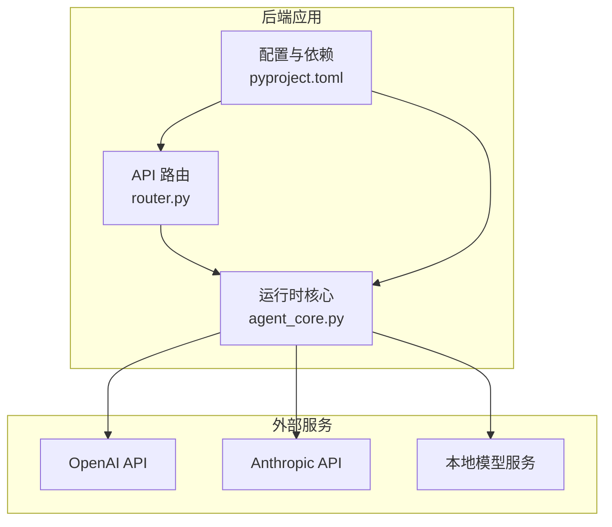
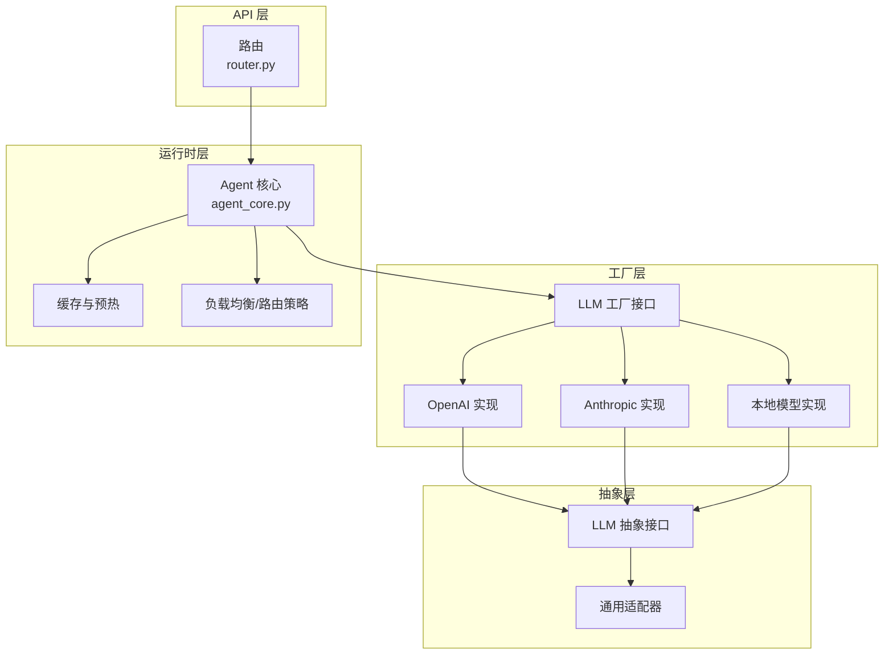
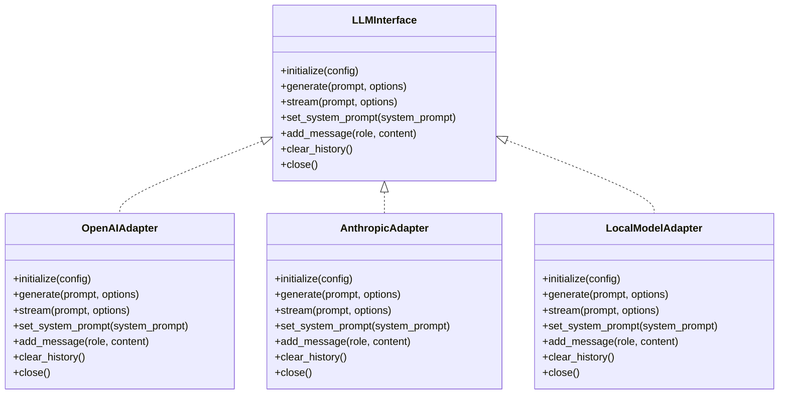
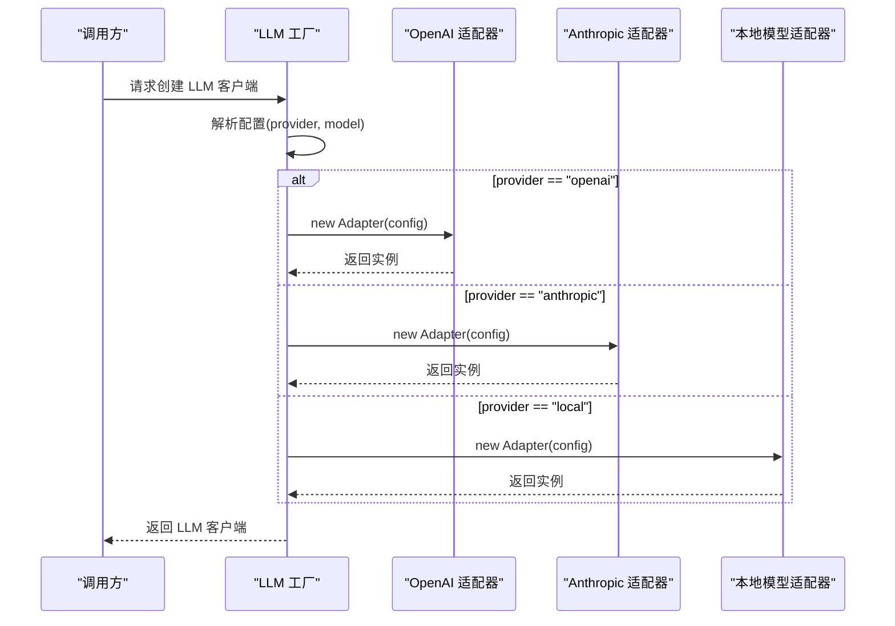
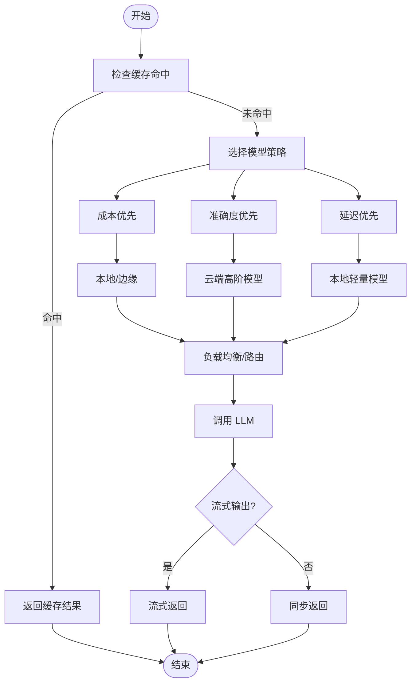
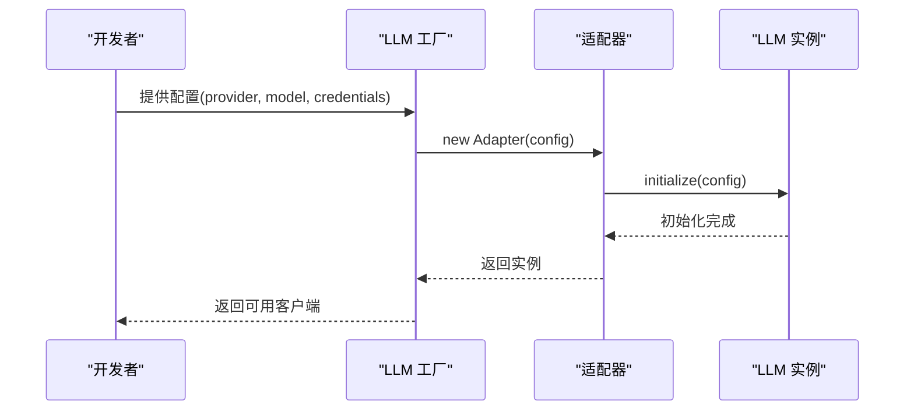
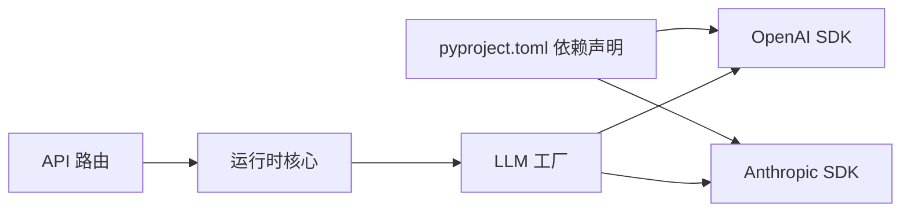

# LLM 集成系统

<cite>
**本文档引用的文件**
- [pyproject.toml](file://backend/pyproject.toml)
- [__init__.py](file://backend/kore/__init__.py)
- [router.py](file://backend/kore/api/router.py)
- [agent_core.py](file://backend/kore/runtime/agent_core.py)
- [models.py](file://backend/kore/runtime/models.py)
</cite>

## 目录
1. [简介](#简介)
2. [项目结构](#项目结构)
3. [核心组件](#核心组件)
4. [架构总览](#架构总览)
5. [详细组件分析](#详细组件分析)
6. [依赖分析](#依赖分析)
7. [性能考虑](#性能考虑)
8. [故障排除指南](#故障排除指南)
9. [结论](#结论)
10. [附录](#附录)

## 简介
本文件面向 Kore 智能体框架的 LLM 集成系统，目标是为开发者提供一套完整的设计与实现指南，涵盖抽象基类定义、工厂模式实现、多模型支持策略、配置管理、缓存与预热、负载均衡思路、性能优化与最佳实践，以及可扩展的自定义模型接入流程。由于当前仓库中 LLM 抽象层与工厂层尚未实现，本文将以“概念性设计 + 实践建议”的形式，帮助团队在现有基础之上构建健壮的 LLM 集成体系。

## 项目结构
Kore 后端采用模块化分层组织，LLM 集成应作为独立子系统与运行时、API 层解耦。当前仓库已具备以下关键基础设施：
- 运行时：智能体核心逻辑与任务调度（agent_core.py）
- API 层：路由与对外接口（router.py）
- 配置与环境：通过 pyproject.toml 管理依赖（FastAPI、OpenAI SDK、Anthropic SDK 等）

**图表来源**
- [router.py](file://backend/kore/api/router.py)
- [agent_core.py](file://backend/kore/runtime/agent_core.py)
- [pyproject.toml](file://backend/pyproject.toml)

**章节来源**
- [pyproject.toml:1-35](file://backend/pyproject.toml#L1-L35)
- [router.py](file://backend/kore/api/router.py)
- [agent_core.py](file://backend/kore/runtime/agent_core.py)

## 核心组件
- 抽象基类与接口规范：定义统一的 LLM 接口，确保不同供应商/本地模型的一致调用体验（如初始化、推理、流式输出、上下文管理等）。
- 工厂模式：通过统一工厂接口按需创建具体模型实例，支持配置驱动与动态切换。
- 运行时集成：在 agent_core 中注入 LLM 客户端，处理对话历史、工具调用、错误重试与超时控制。
- API 层对接：在 router 中暴露 LLM 相关端点，封装请求参数校验与响应格式化。
- 配置与依赖：通过 pyproject.toml 引入 OpenAI、Anthropic 等 SDK，确保运行时可用性。

**章节来源**
- [pyproject.toml:6-19](file://backend/pyproject.toml#L6-L19)
- [router.py](file://backend/kore/api/router.py)
- [agent_core.py](file://backend/kore/runtime/agent_core.py)

## 架构总览
下图展示了 Kore 的 LLM 集成建议架构：抽象层屏蔽差异，工厂层负责实例化，运行时层负责编排，API 层负责对外交互。

**图表来源**
- [agent_core.py](file://backend/kore/runtime/agent_core.py)
- [router.py](file://backend/kore/api/router.py)

## 详细组件分析

### 抽象基类与接口规范
- 设计目标：统一不同 LLM 的调用方式，隐藏供应商差异。
- 关键职责：
  - 初始化与配置加载（模型名称、温度、最大令牌数、超时等）
  - 文本生成与流式输出
  - 上下文管理（消息历史、角色标记、系统提示）
  - 错误处理与重试策略
  - 资源清理与连接池管理
- 接口建议（方法命名与职责示意）：
  - initialize(config)：加载配置并建立连接
  - generate(prompt, options)：同步生成文本
  - stream(prompt, options)：流式生成
  - set_system_prompt(system_prompt)：设置系统提示
  - add_message(role, content)：追加消息
  - clear_history()：清空历史
  - close()：释放资源

**图表来源**
- [agent_core.py](file://backend/kore/runtime/agent_core.py)

**章节来源**
- [agent_core.py](file://backend/kore/runtime/agent_core.py)

### 工厂模式实现机制
- 工厂接口职责：
  - 根据配置标识（如 provider、model_name）返回具体 LLM 实例
  - 维护实例池与生命周期管理
  - 支持动态切换与热更新
- 典型流程：
  - 输入配置 → 解析 provider/model → 选择适配器 → 创建实例 → 返回客户端
  - 可选：注册到全局注册表，便于监控与统计

**图表来源**
- [agent_core.py](file://backend/kore/runtime/agent_core.py)

**章节来源**
- [agent_core.py](file://backend/kore/runtime/agent_core.py)

### 支持的模型类型与配置选项
- 本地部署模型
  - 适用场景：隐私敏感、低延迟、可控成本
  - 配置要点：服务地址、模型路径、批处理大小、设备选择（CPU/GPU）、量化开关
- 云端 API 模型
  - OpenAI：模型版本、API 密钥、基础 URL、代理设置、并发限制
  - Anthropic：模型版本、API 密钥、基础 URL、代理设置、并发限制
- 通用配置项
  - 会话上下文：系统提示、消息历史长度、角色标记
  - 推理参数：温度、最大令牌数、top_p、频率惩罚、停用词
  - 超时与重试：请求超时、重试次数、退避策略
  - 流式输出：启用/禁用、缓冲策略

**章节来源**
- [pyproject.toml:14-15](file://backend/pyproject.toml#L14-L15)

### 自定义 LLM 模型集成指南
- 步骤一：实现抽象接口
  - 在适配器中实现 initialize/generate/stream 等方法
  - 处理异常与超时，确保幂等与可恢复
- 步骤二：注册到工厂
  - 在工厂中新增分支或映射，识别新 provider
  - 将适配器与配置键绑定
- 步骤三：配置管理
  - 在运行时读取配置，校验必填项
  - 支持环境变量与配置文件双通道
- 步骤四：性能优化
  - 连接池与长连接复用
  - 批量请求与异步并发
  - 缓存热点问题与预热策略
- 步骤五：测试与验证
  - 单元测试覆盖关键路径
  - 性能压测与稳定性评估

**章节来源**
- [agent_core.py](file://backend/kore/runtime/agent_core.py)

### 模型选择策略与负载均衡
- 选择策略
  - 成本优先：优先本地或边缘模型
  - 准确度优先：云端高阶模型
  - 延迟优先：本地轻量模型或缓存命中
- 负载均衡
  - 多实例轮询/权重分配
  - 基于健康状态与响应时间的动态调度
  - 并发上限与队列排队

**图表来源**
- [agent_core.py](file://backend/kore/runtime/agent_core.py)

**章节来源**
- [agent_core.py](file://backend/kore/runtime/agent_core.py)

### 缓存、预热与资源管理最佳实践
- 缓存
  - 结构化缓存键：模型名+参数+上下文摘要
  - LRU/LFU 缓存策略，避免内存膨胀
  - 失效策略：TTL、基于内容指纹的失效
- 预热
  - 启动阶段预热常用模型，降低首次延迟
  - 热身请求：小规模 prompt 验证连通性与性能
- 资源管理
  - 连接池：复用 HTTP/长连接，限制最大连接数
  - 超时与熔断：防止雪崩效应
  - 监控指标：QPS、P95/P99 延迟、错误率、缓存命中率

**章节来源**
- [agent_core.py](file://backend/kore/runtime/agent_core.py)

### 实际集成示例与配置模板
- 示例一：OpenAI 集成
  - 在工厂中注册 provider=openai，映射到 OpenAI 适配器
  - 配置项：api_key、base_url、model、temperature、max_tokens
- 示例二：Anthropic 集成
  - 在工厂中注册 provider=anthropic，映射到 Anthropic 适配器
  - 配置项：api_key、base_url、model、temperature、max_tokens
- 示例三：本地模型集成
  - 在工厂中注册 provider=local，映射到本地模型适配器
  - 配置项：model_path、device、batch_size、quantize

**图表来源**
- [agent_core.py](file://backend/kore/runtime/agent_core.py)

**章节来源**
- [agent_core.py](file://backend/kore/runtime/agent_core.py)

## 依赖分析
- 外部 SDK 依赖
  - OpenAI SDK：用于 OpenAI API 调用
  - Anthropic SDK：用于 Anthropic API 调用
- 内部依赖关系
  - API 层依赖运行时层
  - 运行时层依赖 LLM 抽象与工厂
  - 工厂依赖具体适配器实现

**图表来源**
- [pyproject.toml:14-15](file://backend/pyproject.toml#L14-L15)
- [router.py](file://backend/kore/api/router.py)
- [agent_core.py](file://backend/kore/runtime/agent_core.py)

**章节来源**
- [pyproject.toml:14-15](file://backend/pyproject.toml#L14-L15)
- [router.py](file://backend/kore/api/router.py)
- [agent_core.py](file://backend/kore/runtime/agent_core.py)

## 性能考虑
- I/O 优化
  - 使用异步 HTTP 客户端，减少阻塞
  - 合理设置超时与重试，避免长时间等待
- 计算优化
  - 对长上下文进行截断与摘要
  - 启用流式输出，提升感知延迟
- 存储优化
  - 控制消息历史长度，定期清理过期会话
  - 使用高效序列化与压缩策略

## 故障排除指南
- 常见问题
  - API 密钥无效：检查密钥与权限范围
  - 网络超时：调整超时阈值与重试策略
  - 模型不可用：确认模型版本与地区限制
- 排查步骤
  - 开启调试日志，定位失败阶段
  - 分离网络与模型侧问题，逐项验证
  - 使用最小可复现配置进行回归测试

**章节来源**
- [agent_core.py](file://backend/kore/runtime/agent_core.py)

## 结论
通过抽象基类与工厂模式，Kore 可以在不改变上层调用方式的前提下，灵活接入多种 LLM。建议尽快完善 LLM 抽象层与工厂层，结合运行时的缓存、预热与负载均衡策略，构建高性能、可扩展的智能体推理能力。同时，完善的配置管理与可观测性将显著提升系统的稳定性与可维护性。

## 附录
- 快速启动清单
  - 完成抽象接口设计与适配器实现
  - 注册工厂分支与配置映射
  - 部署缓存与预热策略
  - 设置监控与告警
  - 编写集成测试与性能基准