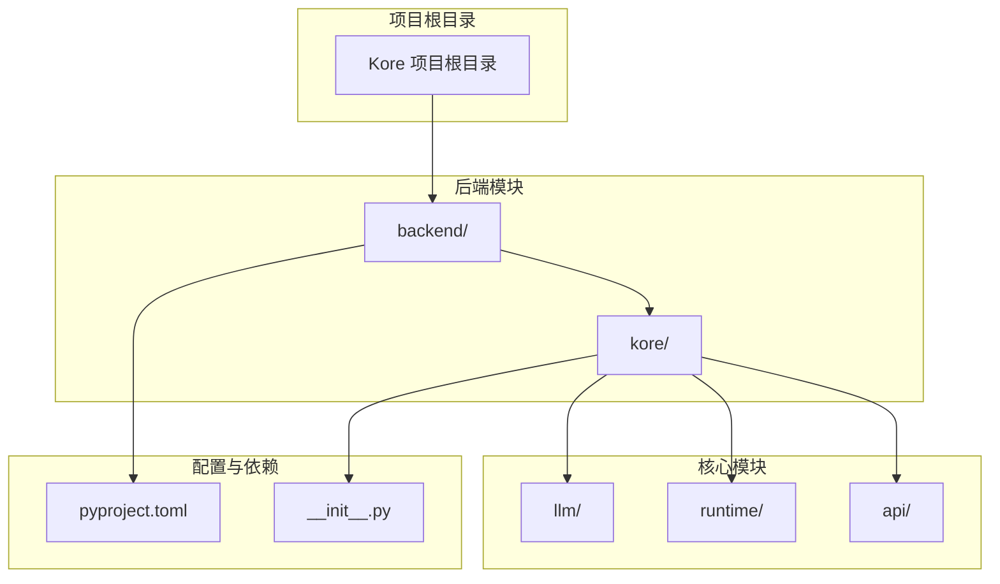
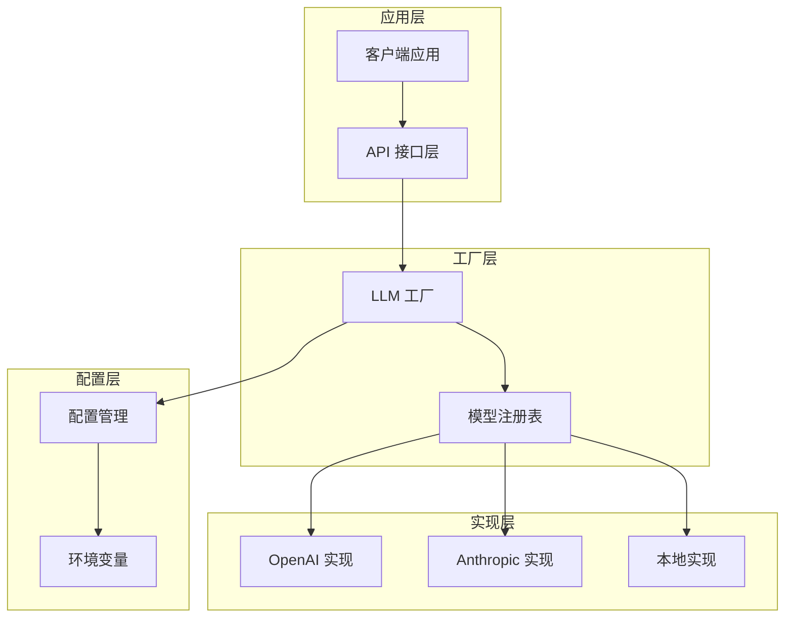
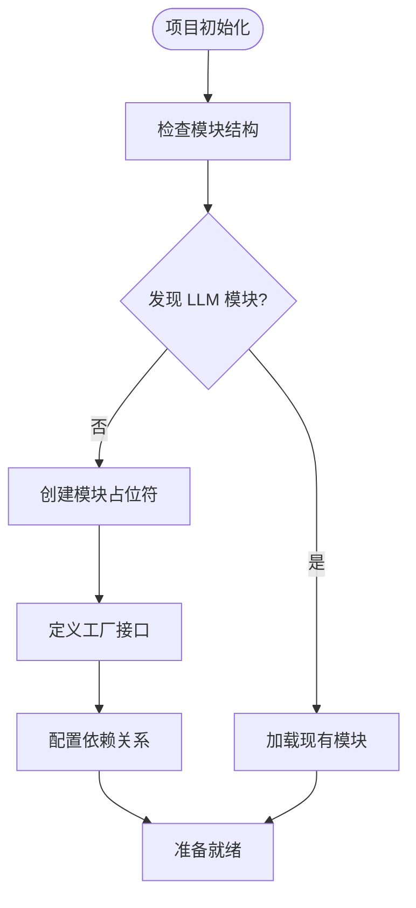
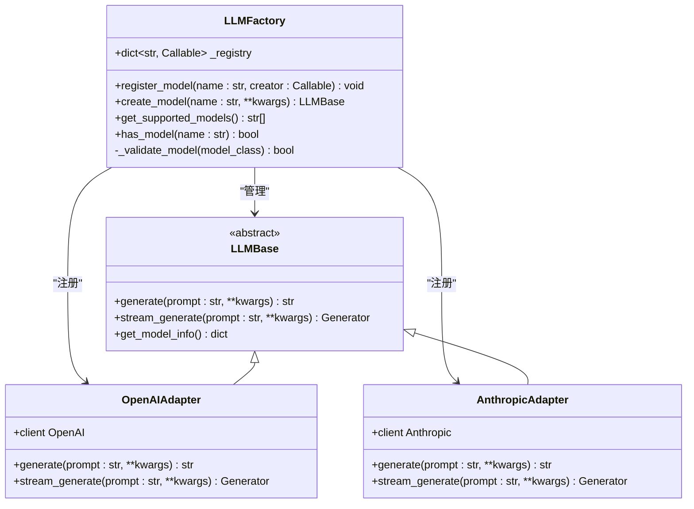
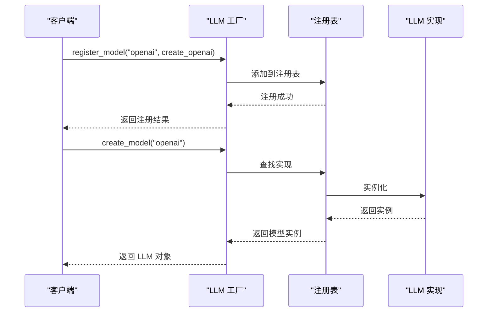
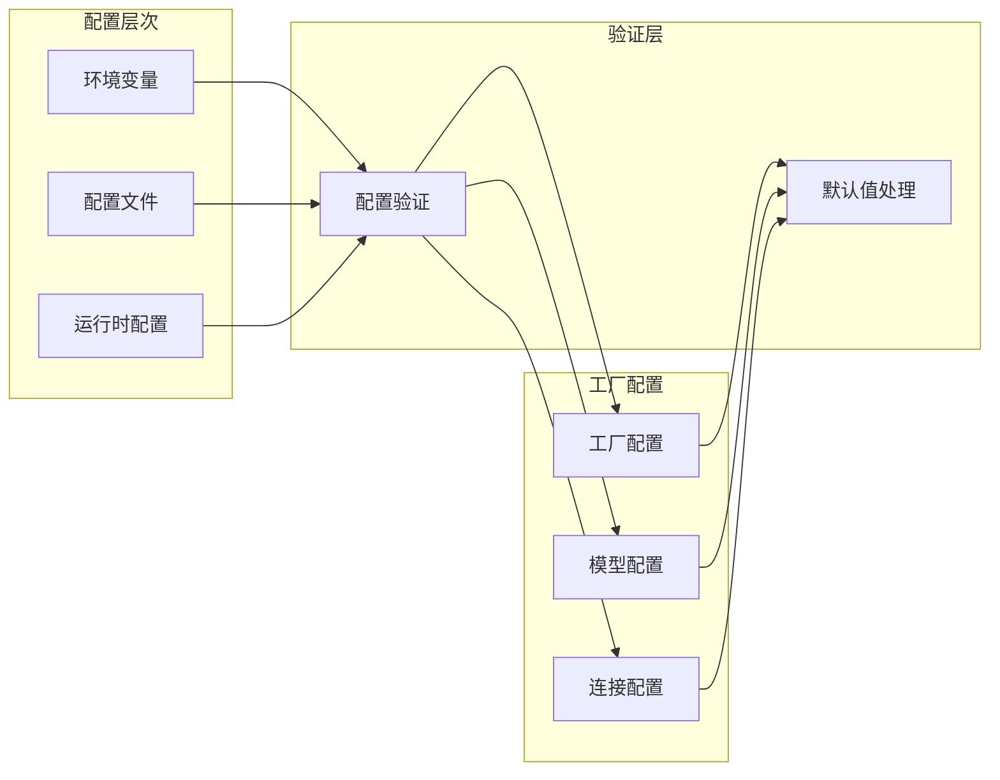
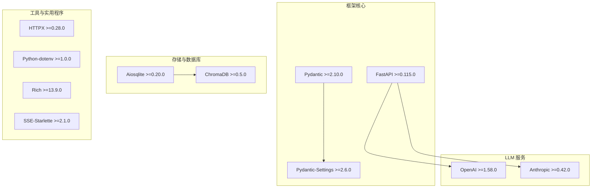
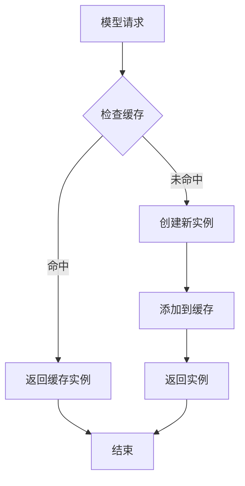
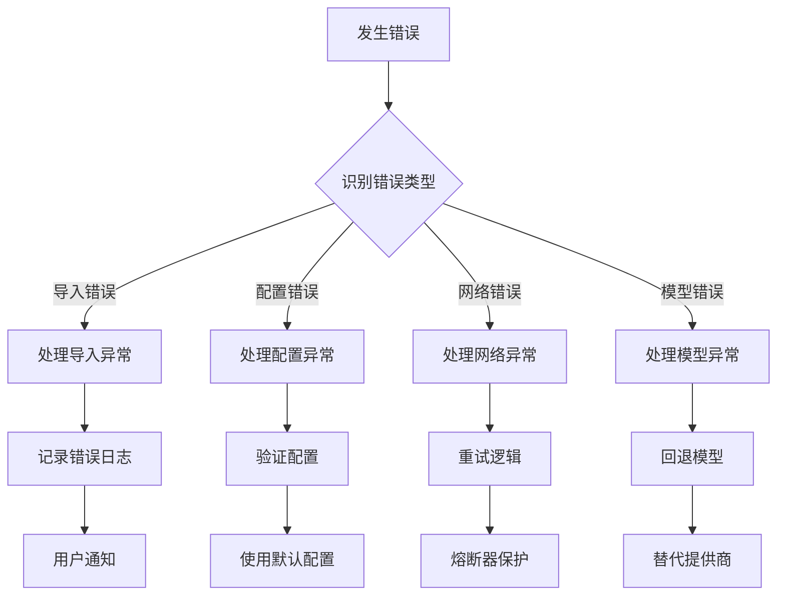

# 工厂模式实现

<cite>
**本文档引用的文件**
- [pyproject.toml](file://backend/pyproject.toml)
- [__init__.py](file://backend/kore/__init__.py)
- [llm/__init__.py](file://backend/kore/llm/__init__.py)
</cite>

## 目录
1. [引言](#引言)
2. [项目结构](#项目结构)
3. [核心组件](#核心组件)
4. [架构概览](#架构概览)
5. [详细组件分析](#详细组件分析)
6. [依赖分析](#依赖分析)
7. [性能考虑](#性能考虑)
8. [故障排除指南](#故障排除指南)
9. [结论](#结论)

## 引言

本文件旨在为 Kore 智能体框架的 LLM 工厂模式实现创建详细文档。根据当前代码库状态，该工厂模式仍处于设计阶段，尚未在代码库中实现具体的功能模块。本文档将基于项目结构和依赖关系，提供工厂模式的设计原理、实现机制、最佳实践以及未来扩展指南。

## 项目结构

基于当前代码库的结构，Kore 框架采用模块化的项目组织方式：



**图表来源**
- [pyproject.toml:1-34](file://backend/pyproject.toml#L1-L34)
- [__init__.py:1-1](file://backend/kore/__init__.py#L1-L1)
- [llm/__init__.py:1-1](file://backend/kore/llm/__init__.py#L1-L1)

**章节来源**
- [pyproject.toml:1-34](file://backend/pyproject.toml#L1-L34)
- [__init__.py:1-1](file://backend/kore/__init__.py#L1-L1)
- [llm/__init__.py:1-1](file://backend/kore/llm/__init__.py#L1-L1)

## 核心组件

### 当前可用组件

根据项目结构分析，当前可用的核心组件包括：

1. **LLM 模块占位符** (`backend/kore/llm/`)
   - 作为 LLM 工厂模式的预留位置
   - 支持未来扩展多种大语言模型实现

2. **项目配置** (`backend/pyproject.toml`)
   - 定义了框架的核心依赖关系
   - 包含 LLM 相关的第三方库支持

3. **模块初始化** (`backend/kore/__init__.py`)
   - 提供框架的基础初始化功能
   - 支持模块导入和配置管理

**章节来源**
- [pyproject.toml:6-19](file://backend/pyproject.toml#L6-L19)
- [__init__.py:1-1](file://backend/kore/__init__.py#L1-L1)

## 架构概览

### 设计架构图



### 当前实现状态

基于项目现状，当前架构呈现以下特点：



**图表来源**
- [pyproject.toml:6-19](file://backend/pyproject.toml#L6-L19)
- [llm/__init__.py:1-1](file://backend/kore/llm/__init__.py#L1-L1)

## 详细组件分析

### LLM 工厂模式设计

#### 预期的工厂类结构



#### 工厂注册机制



### 配置管理架构



**图表来源**
- [pyproject.toml:10-18](file://backend/pyproject.toml#L10-L18)

## 依赖分析

### 核心依赖关系



**图表来源**
- [pyproject.toml:6-19](file://backend/pyproject.toml#L6-L19)

### 依赖版本兼容性

根据项目配置，当前支持的 Python 版本要求为 3.12+，这确保了工厂模式实现能够利用现代 Python 特性，包括：

- 类型注解和类型检查
- 异步编程支持
- 数据类和配置管理
- 现代装饰器语法

**章节来源**
- [pyproject.toml:5](file://backend/pyproject.toml#L5)

## 性能考虑

### 工厂模式性能优势

1. **延迟加载**
   - 模型实例仅在需要时创建
   - 减少内存占用和启动时间

2. **缓存机制**
   - 支持模型实例缓存
   - 避免重复创建开销

3. **连接池管理**
   - 统一管理外部服务连接
   - 复用连接提高效率

### 内存管理策略



## 故障排除指南

### 常见问题诊断

1. **模块导入错误**
   ```python
   # 可能的错误场景
   from kore.llm.factory import LLMFactory  # ImportError
   ```

2. **配置验证失败**
   ```python
   # 配置项缺失或格式错误
   model_config = {
       "provider": "openai",  # 缺少必需参数
       "api_key": None       # 空值
   }
   ```

3. **依赖版本冲突**
   ```bash
   # 检查依赖版本
   pip check
   ```

### 错误处理策略



## 结论

基于当前代码库状态，Kore 智能体框架的 LLM 工厂模式仍处于设计和准备阶段。项目结构清晰地为工厂模式的实现预留了空间，特别是 `llm/` 目录作为未来的扩展点。

### 当前状态总结

- **架构准备**：项目结构已为工厂模式做好准备
- **依赖支持**：核心依赖关系已配置，支持 LLM 功能
- **扩展性**：模块化设计便于未来功能扩展

### 未来发展方向

1. **实现工厂类**：创建具体的 LLM 工厂实现
2. **添加模型适配器**：集成 OpenAI、Anthropic 等服务
3. **完善配置系统**：实现动态配置管理和热更新
4. **增强错误处理**：建立完善的异常处理和恢复机制

这个工厂模式设计为 Kore 框架提供了强大的可扩展性和灵活性，能够支持多种 LLM 实现的统一管理和动态加载。