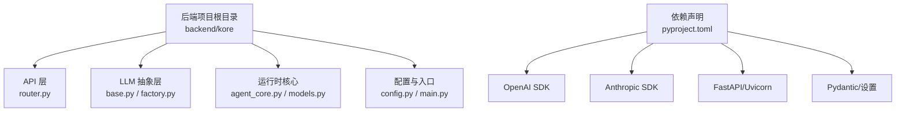
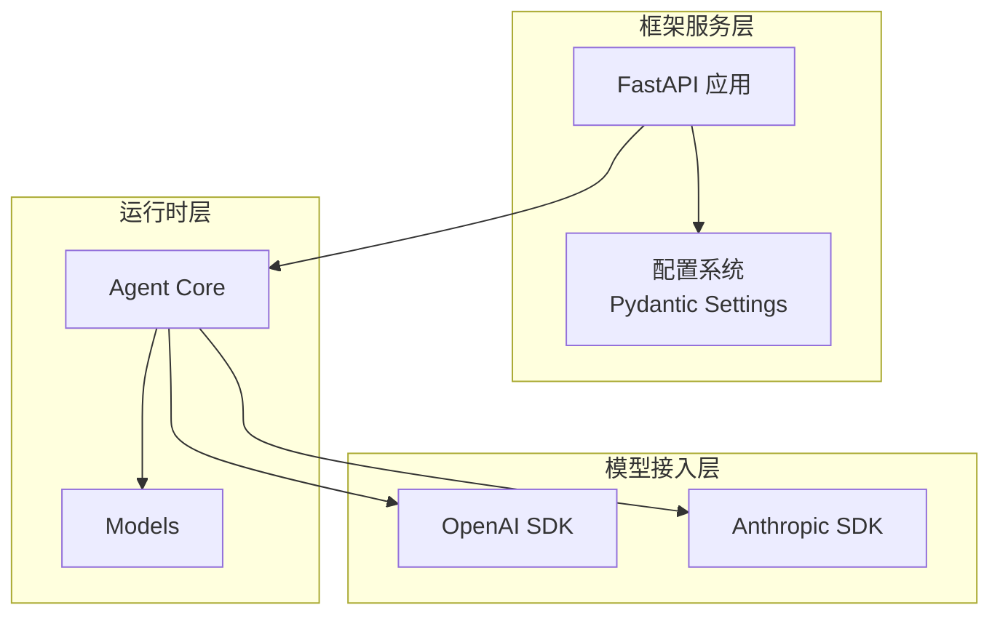
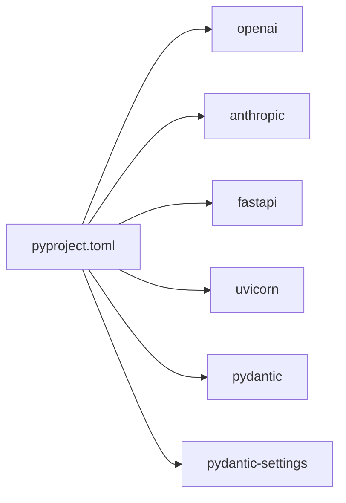

# 支持的模型类型

<cite>
**本文引用的文件**
- [pyproject.toml](file://backend/pyproject.toml)
</cite>

## 目录
1. [简介](#简介)
2. [项目结构](#项目结构)
3. [核心组件](#核心组件)
4. [架构总览](#架构总览)
5. [详细组件分析](#详细组件分析)
6. [依赖分析](#依赖分析)
7. [性能考虑](#性能考虑)
8. [故障排除指南](#故障排除指南)
9. [结论](#结论)
10. [附录](#附录)

## 简介
本文件面向 Kore 智能体框架的 LLM（大语言模型）支持情况，基于仓库中的依赖声明进行梳理与说明。当前仓库展示了框架对主流云端 LLM SDK 的依赖关系，包括 OpenAI 和 Anthropic 客户端库，这表明框架具备对接云端 API 模型的能力。由于仓库未包含本地模型运行时与工厂实现的具体代码文件，本文在“已知依赖”范围内给出可验证的支持清单与配置建议；对于本地模型与更多实现细节，请以后续迭代补充的源码为准。

## 项目结构
- 后端采用 Python 项目组织，核心模块位于 backend/kore 下，当前仓库中 LLM 相关目录存在但未包含具体实现文件。
- 项目通过 pyproject.toml 声明了对 FastAPI、Uvicorn、Pydantic、OpenAI、Anthropic 等依赖，体现了框架的服务化能力与对云端模型 SDK 的集成基础。

**章节来源**
- [pyproject.toml:1-35](file://backend/pyproject.toml#L1-L35)

## 核心组件
- 云端模型 SDK 集成：通过 openai 与 anthropic 依赖，框架具备对接 OpenAI 与 Anthropic 云端模型的能力。
- 服务化与配置：FastAPI 提供接口能力，Pydantic 与 pydantic-settings 负责配置校验与加载。
- 运行时与数据模型：runtime 目录下包含 agent_core 与 models，用于智能体运行时与数据建模。

**章节来源**
- [pyproject.toml:6-19](file://backend/pyproject.toml#L6-L19)

## 架构总览
下图展示框架与外部模型 SDK 的关系，以及服务化与配置的关键节点：

**图表来源**
- [pyproject.toml:6-19](file://backend/pyproject.toml#L6-L19)

## 详细组件分析
本节基于依赖声明对当前已知的模型支持进行说明。由于仓库未包含 LLM 抽象层与工厂实现的具体代码，以下内容为“已知依赖”的事实陈述与实践建议。

### 已声明的模型接入能力
- OpenAI 模型接入：通过 openai 依赖，框架可对接 OpenAI 的模型系列（如 gpt-4、gpt-3.5-turbo 等），用于文本生成、对话与工具调用等任务。
- Anthropic 模型接入：通过 anthropic 依赖，框架可对接 Claude 系列模型，适用于推理、长文生成与安全敏感场景。

上述能力由依赖声明直接体现，无需额外实现即可在服务层进行集成。

**章节来源**
- [pyproject.toml:14-15](file://backend/pyproject.toml#L14-L15)

### 服务化与配置
- FastAPI/Uvicorn：提供 HTTP 接口与异步运行时，便于对外暴露模型调用能力。
- Pydantic/Pydantic Settings：负责配置项的强类型校验与加载，确保模型参数与密钥的安全传递。

**章节来源**
- [pyproject.toml:7-10](file://backend/pyproject.toml#L7-L10)

## 依赖分析
- 直接依赖：OpenAI 与 Anthropic SDK 是模型接入的核心；FastAPI/Uvicorn 提供服务化能力；Pydantic/Settings 提供配置能力。
- 外部集成点：通过 SDK 将请求路由至云端模型服务，返回结果后再由框架进行统一处理与响应。

**图表来源**
- [pyproject.toml:6-19](file://backend/pyproject.toml#L6-L19)

**章节来源**
- [pyproject.toml:6-19](file://backend/pyproject.toml#L6-L19)

## 性能考虑
- 服务并发：使用 uvicorn 异步运行时提升并发吞吐，适合高 QPS 的模型调用场景。
- 配置校验：通过 Pydantic 设置对入参进行严格校验，减少无效请求带来的资源浪费。
- 模型调用：优先复用连接池与会话，避免频繁建立连接；合理设置超时与重试策略，平衡延迟与稳定性。

[本节为通用指导，不涉及具体文件分析]

## 故障排除指南
- 密钥与网络：确认环境变量中模型 API 密钥正确，且网络可访问对应云厂商服务。
- 版本兼容：若出现 SDK 兼容性问题，检查 openai 与 anthropic 的版本是否满足框架预期。
- 配置错误：当请求参数不符合 Pydantic 校验规则时，关注配置项命名与类型，确保与模型参数映射一致。

**章节来源**
- [pyproject.toml:14-15](file://backend/pyproject.toml#L14-L15)

## 结论
- 当前仓库明确声明了对 OpenAI 与 Anthropic 云端模型的接入能力，结合 FastAPI 与 Pydantic 生态，可快速构建对外服务。
- 本地模型与更丰富的 LLM 抽象层尚未在仓库中呈现，建议在后续迭代中完善 LLM 抽象、工厂与运行时实现，以覆盖更多模型类型与部署形态。

[本节为总结性内容，不涉及具体文件分析]

## 附录
- 模型选择建议（基于已声明依赖）
  - 需要与 OpenAI 生态深度集成的任务（如函数调用、工具使用）可优先选择 OpenAI 模型。
  - 对长文生成与安全合规有更高要求的场景可优先选择 Anthropic 模型。
- 配置最佳实践
  - 使用 Pydantic Settings 统一管理密钥与参数，避免硬编码。
  - 在 FastAPI 中为不同模型路径设置独立的限流与熔断策略。
  - 对模型调用进行可观测性埋点，记录耗时、错误率与令牌用量。

[本节为通用指导，不涉及具体文件分析]