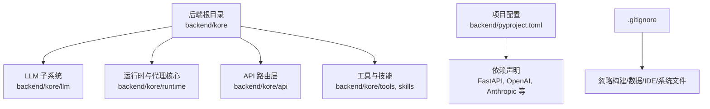
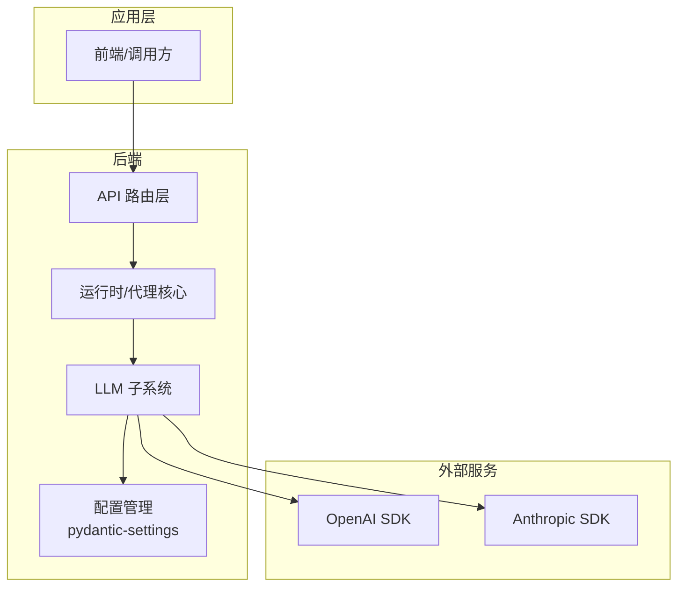
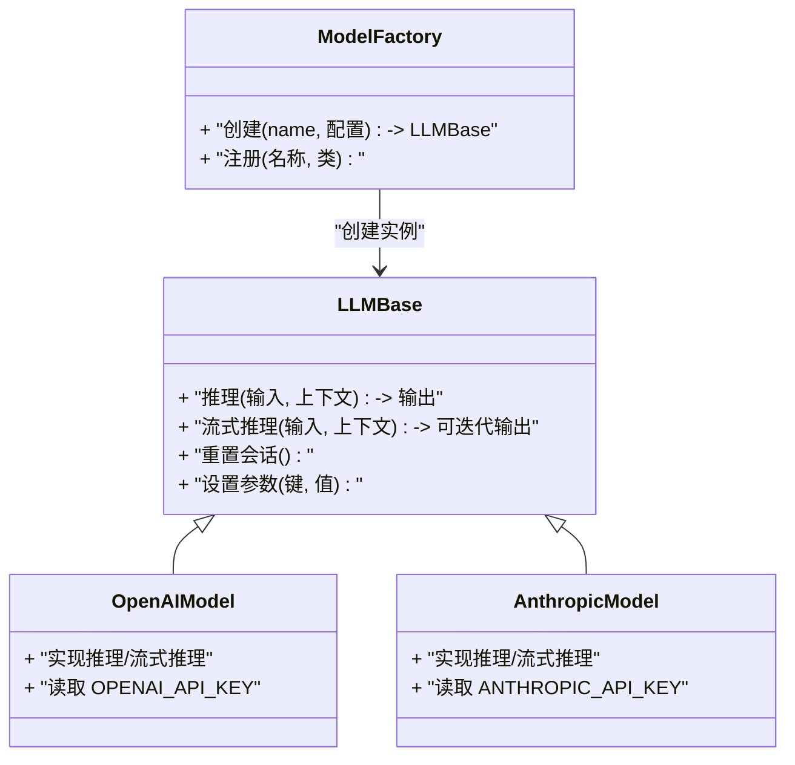
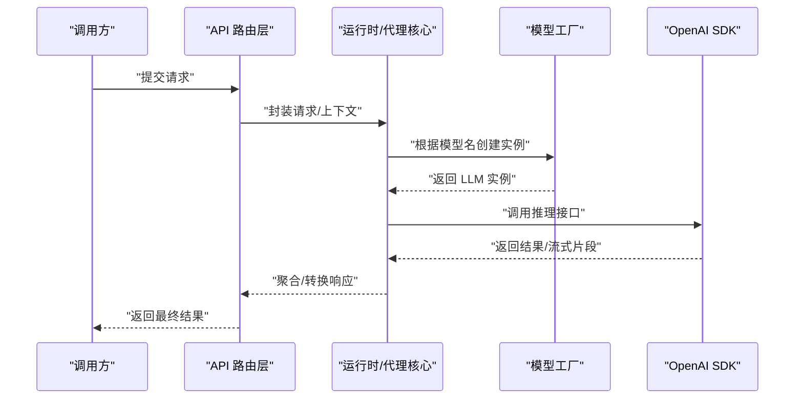
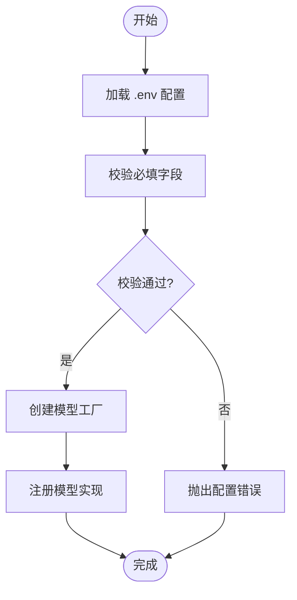
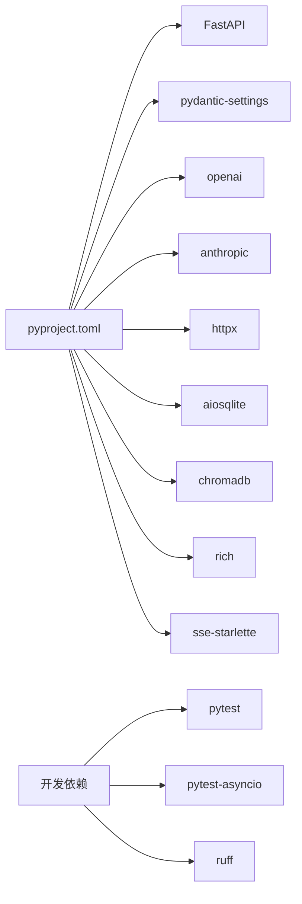

# 自定义模型集成

<cite>
**本文引用的文件**
- [pyproject.toml](file://backend/pyproject.toml)
- [.gitignore](file://.gitignore)
- [kore/llm/__init__.py](file://backend/kore/llm/__init__.py)
</cite>

## 目录
1. [简介](#简介)
2. [项目结构](#项目结构)
3. [核心组件](#核心组件)
4. [架构总览](#架构总览)
5. [详细组件分析](#详细组件分析)
6. [依赖分析](#依赖分析)
7. [性能考虑](#性能考虑)
8. [故障排除指南](#故障排除指南)
9. [结论](#结论)
10. [附录](#附录)

## 简介
本指南面向希望在 Kore 智能体框架中集成自定义 LLM（大语言模型）的开发者，提供从接口实现、配置管理、工厂注册到性能优化与测试调试的完整流程。当前仓库中与 LLM 相关的核心目录为 backend/kore/llm，其中包含初始化入口；同时，项目使用 Pydantic Settings 进行配置管理，依赖 openai 与 anthropic 等第三方 SDK，便于扩展云端模型。本指南将基于现有依赖与目录结构，给出可落地的实现步骤与最佳实践。

## 项目结构
- 后端主模块位于 backend/kore，LLM 子系统位于 backend/kore/llm
- 配置管理采用 pydantic-settings，支持 .env 环境变量加载
- 第三方依赖通过 pyproject.toml 统一声明，包含 FastAPI、OpenAI SDK、Anthropic SDK 等

**章节来源**
- [pyproject.toml:1-34](file://backend/pyproject.toml#L1-L34)
- [.gitignore:1-30](file://.gitignore#L1-L30)

## 核心组件
- LLM 初始化入口：backend/kore/llm/__init__.py
- 配置管理：基于 pydantic-settings 的设置加载与校验
- 外部模型 SDK：OpenAI 与 Anthropic SDK 已在依赖中声明，可直接用于云端模型集成
- 测试框架：pytest 与 pytest-asyncio 已配置，支持单元测试与异步测试

**章节来源**
- [kore/llm/__init__.py](file://backend/kore/llm/__init__.py)
- [pyproject.toml:1-34](file://backend/pyproject.toml#L1-L34)

## 架构总览
下图展示了 Kore 中 LLM 子系统的高层交互关系：应用通过 LLM 初始化入口接入模型工厂或直接调用第三方 SDK；配置通过 pydantic-settings 注入；API 层负责对外暴露服务。

## 详细组件分析

### LLM 子系统初始化与扩展点
- 当前仓库中 LLM 子系统仅包含初始化入口文件，未包含具体基类与工厂实现。建议在此基础上扩展：
  - 定义 LLM 抽象基类，统一接口规范（如推理、流式输出、上下文管理）
  - 实现工厂模式，按名称/类型动态创建模型实例
  - 提供配置类，集中管理模型参数与凭据

### 推理流程时序（以 OpenAI 为例）

### 配置管理与参数验证
- 使用 pydantic-settings 加载 .env 环境变量，确保敏感信息不硬编码
- 为每种模型定义独立的配置类，包含必填项与默认值
- 在工厂创建前进行参数校验，避免无效配置导致的运行时错误

### 性能优化策略
- 模型缓存：对重复输入或相似提示进行缓存，减少重复调用
- 批量处理：合并多个小请求为批次，提升吞吐
- 并发控制：限制并发数，避免资源争用；对流式输出采用背压策略
- 连接池：复用 HTTP 连接，降低握手开销
- 超时与重试：为外部调用设置合理超时与指数退避重试

### 测试与调试
- 单元测试：针对推理方法、参数校验、异常分支进行覆盖
- 集成测试：模拟 API 路由与运行时交互，验证端到端流程
- 调试技巧：开启详细日志、使用断点定位问题、录制请求/响应样本

## 依赖分析
- 必需依赖：FastAPI、pydantic、pydantic-settings、httpx、aiosqlite、chromadb、rich、sse-starlette
- 云模型 SDK：openai、anthropic
- 开发依赖：pytest、pytest-asyncio、ruff

**章节来源**
- [pyproject.toml:1-34](file://backend/pyproject.toml#L1-L34)

## 性能考虑
- 缓存策略：对相同 prompt 或相似上下文的结果进行缓存，注意缓存键设计与失效策略
- 批处理：将多个小请求合并为批次，减少网络往返与模型调度开销
- 并发控制：限制最大并发请求数，结合队列与信号量控制资源占用
- 超时与重试：为外部 API 设置合理超时与指数退避重试，避免雪崩效应
- 日志与监控：记录关键指标（延迟、吞吐、错误率），辅助性能调优

## 故障排除指南
- 配置错误
  - 症状：启动时报错或模型无法创建
  - 排查：检查 .env 是否存在且字段正确；确认 pydantic-settings 是否加载成功
- 认证失败
  - 症状：调用外部模型返回 401/403
  - 排查：核对 API Key 是否正确；确认网络访问权限与代理设置
- 超时与限流
  - 症状：请求长时间无响应或被拒绝
  - 排查：调整超时时间与重试策略；观察外部服务配额与速率限制
- 内存与并发问题
  - 症状：内存持续增长或并发请求失败
  - 排查：限制并发数；启用缓存；检查是否存在泄漏

## 结论
通过在 backend/kore/llm 下扩展抽象基类与工厂模式，并结合 pydantic-settings 的配置能力与现有第三方 SDK，可以高效地将本地或云端模型无缝集成到 Kore 框架中。建议遵循本文档的实现步骤、配置规范与性能优化策略，确保模型集成的稳定性与可维护性。

## 附录
- 环境变量建议
  - OPENAI_API_KEY：OpenAI 模型密钥
  - ANTHROPIC_API_KEY：Anthropic 模型密钥
  - MODEL_CACHE_SIZE：模型缓存大小
  - MAX_CONCURRENT_REQUESTS：最大并发请求数
- 目录与文件清单
  - backend/kore/llm/__init__.py：LLM 子系统初始化入口
  - backend/pyproject.toml：项目依赖与开发工具配置
  - .gitignore：构建/数据/IDE/系统文件忽略规则