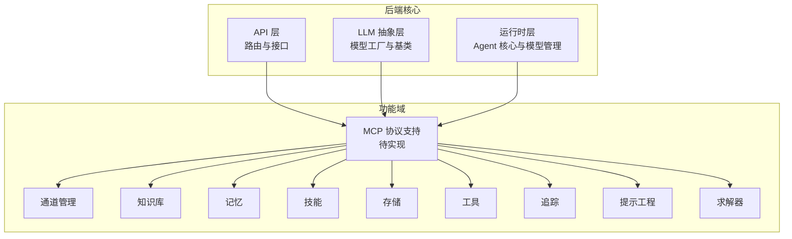
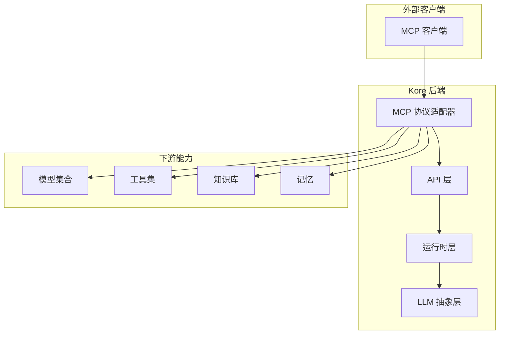
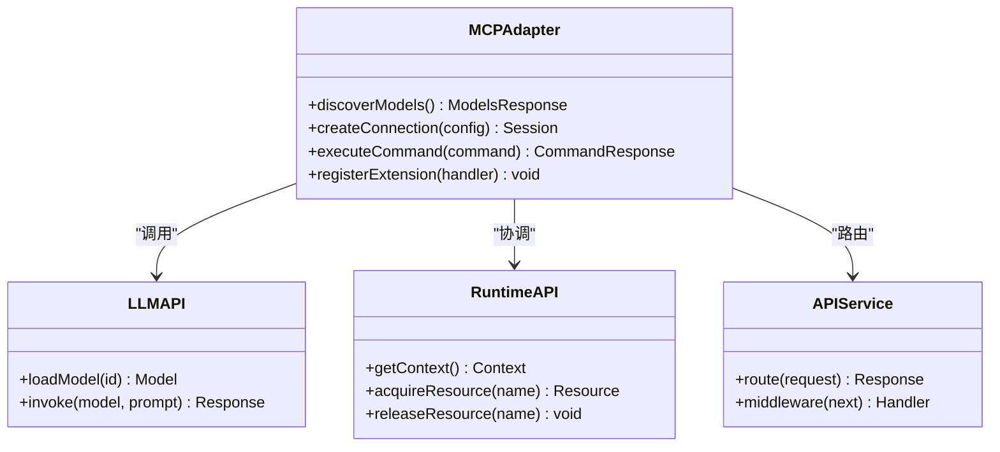
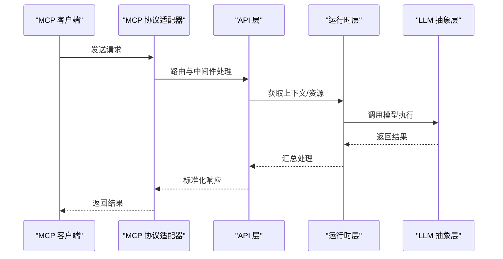
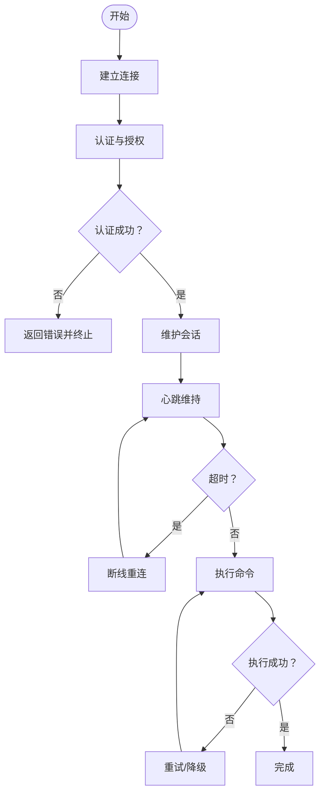
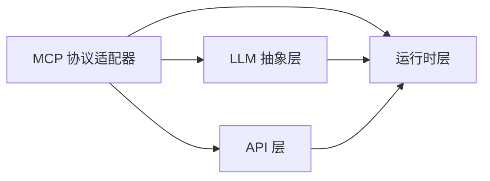

# MCP 协议支持

<cite>
**本文档引用的文件**
- [backend/kore/mcp/__init__.py](file://backend/kore/mcp/__init__.py)
- [backend/kore/api/__init__.py](file://backend/kore/api/__init__.py)
- [backend/kore/llm/__init__.py](file://backend/kore/llm/__init__.py)
- [backend/kore/runtime/__init__.py](file://backend/kore/runtime/__init__.py)
- [backend/pyproject.toml](file://backend/pyproject.toml)
</cite>

## 目录
1. [简介](#简介)
2. [项目结构](#项目结构)
3. [核心组件](#核心组件)
4. [架构总览](#架构总览)
5. [详细组件分析](#详细组件分析)
6. [依赖关系分析](#依赖关系分析)
7. [性能考虑](#性能考虑)
8. [故障排除指南](#故障排除指南)
9. [结论](#结论)
10. [附录](#附录)

## 简介
本文件面向 Kore 智能体框架中对 Model Context Protocol（MCP）协议的支持，提供从设计原理到实现机制的系统化技术文档。内容涵盖协议规范与消息格式、多模型通信架构、扩展与自定义消息类型、安全与认证、客户端/服务器实现指南、性能优化策略，以及集成示例与调试建议。由于当前仓库中 MCP 相关实现文件尚为空目录或仅包含初始化文件，本文将以 Kore 当前模块化架构为基础，结合 MCP 的通用设计原则，给出可落地的实现蓝图与最佳实践。

## 项目结构
Kore 后端采用分层与功能域划分的组织方式，MCP 支持作为独立功能域位于 `backend/kore/mcp/`。当前该目录下仅有初始化文件，表明 MCP 功能尚未完全实现；但其他相关模块（如 LLM、Runtime、API）已存在，为 MCP 的接入提供了良好的基础设施。

**图表来源**
- [backend/kore/api/__init__.py](file://backend/kore/api/__init__.py)
- [backend/kore/llm/__init__.py](file://backend/kore/llm/__init__.py)
- [backend/kore/runtime/__init__.py](file://backend/kore/runtime/__init__.py)
- [backend/kore/mcp/__init__.py](file://backend/kore/mcp/__init__.py)

**章节来源**
- [backend/kore/api/__init__.py](file://backend/kore/api/__init__.py)
- [backend/kore/llm/__init__.py](file://backend/kore/llm/__init__.py)
- [backend/kore/runtime/__init__.py](file://backend/kore/runtime/__init__.py)
- [backend/kore/mcp/__init__.py](file://backend/kore/mcp/__init__.py)

## 核心组件
- MCP 协议适配器：负责将 Kore 的内部模型抽象与运行时能力映射到 MCP 的请求/响应模型，实现模型发现、连接管理与数据交换。
- MCP 服务端：暴露 MCP 端点，接受来自客户端的请求，协调 Kore 内部资源（LLM、工具、知识库等），并返回标准化响应。
- MCP 客户端：封装与 MCP 服务端的连接、会话管理与错误处理，提供统一的调用接口。
- 扩展与自定义消息：通过插件化机制支持自定义消息类型与命令，确保协议的可扩展性。
- 安全与认证：基于 Kore 现有的认证体系，结合 MCP 的访问控制需求，实现密钥管理与权限控制。
- 性能优化：在网络传输、并发处理与缓存策略方面进行优化，提升整体吞吐与延迟表现。

## 架构总览
下图展示了 Kore 与 MCP 的交互关系，以及与 LLM、Runtime、API 的协作方式：

**图表来源**
- [backend/kore/api/__init__.py](file://backend/kore/api/__init__.py)
- [backend/kore/runtime/__init__.py](file://backend/kore/runtime/__init__.py)
- [backend/kore/llm/__init__.py](file://backend/kore/llm/__init__.py)
- [backend/kore/mcp/__init__.py](file://backend/kore/mcp/__init__.py)

## 详细组件分析

### MCP 协议适配器
- 职责
  - 将 Kore 的模型工厂与运行时能力映射为 MCP 的请求/响应模型。
  - 实现模型发现（列举可用模型）、连接管理（建立/维护会话）、数据交换（工具调用、知识检索等）。
  - 提供扩展点以支持自定义消息类型与命令。
- 关键接口
  - 模型发现：返回可用模型清单与元数据。
  - 连接管理：建立与维护会话状态，处理心跳与断线重连。
  - 数据交换：封装工具调用、知识检索、记忆查询等操作为 MCP 命令。
- 设计要点
  - 与 LLM 抽象层解耦，通过统一接口访问模型能力。
  - 与 Runtime 层协作，确保并发安全与资源隔离。
  - 与 API 层对接，遵循现有路由与中间件约定。

**图表来源**
- [backend/kore/mcp/__init__.py](file://backend/kore/mcp/__init__.py)
- [backend/kore/llm/__init__.py](file://backend/kore/llm/__init__.py)
- [backend/kore/runtime/__init__.py](file://backend/kore/runtime/__init__.py)
- [backend/kore/api/__init__.py](file://backend/kore/api/__init__.py)

**章节来源**
- [backend/kore/mcp/__init__.py](file://backend/kore/mcp/__init__.py)
- [backend/kore/llm/__init__.py](file://backend/kore/llm/__init__.py)
- [backend/kore/runtime/__init__.py](file://backend/kore/runtime/__init__.py)
- [backend/kore/api/__init__.py](file://backend/kore/api/__init__.py)

### MCP 服务端
- 职责
  - 暴露 MCP 端点，接收客户端请求并进行路由与处理。
  - 统一错误处理与日志记录，保证可观测性与可维护性。
- 关键流程
  - 请求解析：验证请求格式与签名。
  - 权限校验：基于 Kore 认证体系进行访问控制。
  - 能力调度：根据请求类型调用相应能力（LLM、工具、知识库等）。
  - 响应生成：封装结果并返回标准格式。

**图表来源**
- [backend/kore/mcp/__init__.py](file://backend/kore/mcp/__init__.py)
- [backend/kore/api/__init__.py](file://backend/kore/api/__init__.py)
- [backend/kore/runtime/__init__.py](file://backend/kore/runtime/__init__.py)
- [backend/kore/llm/__init__.py](file://backend/kore/llm/__init__.py)

**章节来源**
- [backend/kore/mcp/__init__.py](file://backend/kore/mcp/__init__.py)
- [backend/kore/api/__init__.py](file://backend/kore/api/__init__.py)
- [backend/kore/runtime/__init__.py](file://backend/kore/runtime/__init__.py)
- [backend/kore/llm/__init__.py](file://backend/kore/llm/__init__.py)

### MCP 客户端
- 职责
  - 封装与服务端的连接建立、会话管理与错误处理。
  - 提供统一的调用接口，隐藏底层协议细节。
- 关键流程
  - 连接建立：握手、认证与参数协商。
  - 会话管理：心跳维持、超时处理与断线重连。
  - 错误处理：分类错误码、重试策略与降级方案。

**图表来源**
- [backend/kore/mcp/__init__.py](file://backend/kore/mcp/__init__.py)

**章节来源**
- [backend/kore/mcp/__init__.py](file://backend/kore/mcp/__init__.py)

### 扩展与自定义消息
- 扩展机制
  - 插件注册：允许第三方扩展自定义消息类型与命令。
  - 命令路由：基于命令名称与参数进行动态路由。
  - 兼容性保障：向后兼容旧版本消息格式，避免破坏性变更。
- 自定义消息类型
  - 工具扩展：新增工具调用消息类型，支持复杂业务逻辑。
  - 知识扩展：新增知识检索与更新消息类型，增强上下文能力。
  - 会话扩展：新增会话状态管理消息类型，支持多轮对话与状态持久化。

**章节来源**
- [backend/kore/mcp/__init__.py](file://backend/kore/mcp/__init__.py)

### 安全与认证
- 密钥管理
  - 使用 Kore 现有的密钥管理机制，确保 MCP 通信的机密性与完整性。
  - 支持对称加密与非对称加密两种模式，满足不同场景需求。
- 访问控制
  - 基于角色的访问控制（RBAC），限制客户端对特定命令与资源的访问。
  - 会话级权限控制，动态调整权限范围以适应不同阶段的需求。
- 审计与日志
  - 记录所有 MCP 请求与响应，便于审计与问题排查。
  - 区分敏感信息与普通信息，避免泄露用户隐私。

**章节来源**
- [backend/kore/mcp/__init__.py](file://backend/kore/mcp/__init__.py)

## 依赖关系分析
- 模块耦合
  - MCP 适配器与 LLM 抽象层、运行时层存在直接依赖，需保持接口稳定以降低耦合度。
  - 与 API 层的耦合主要体现在路由与中间件，应尽量通过配置与插件化减少硬编码。
- 外部依赖
  - 通过 pyproject.toml 管理依赖，确保 MCP 功能所需的网络库、序列化库与安全库得到满足。
- 循环依赖
  - 需要避免 MCP 适配器与 LLM/运行时之间的循环导入，可通过抽象接口与延迟导入解决。

**图表来源**
- [backend/kore/mcp/__init__.py](file://backend/kore/mcp/__init__.py)
- [backend/kore/llm/__init__.py](file://backend/kore/llm/__init__.py)
- [backend/kore/runtime/__init__.py](file://backend/kore/runtime/__init__.py)
- [backend/kore/api/__init__.py](file://backend/kore/api/__init__.py)

**章节来源**
- [backend/kore/mcp/__init__.py](file://backend/kore/mcp/__init__.py)
- [backend/kore/llm/__init__.py](file://backend/kore/llm/__init__.py)
- [backend/kore/runtime/__init__.py](file://backend/kore/runtime/__init__.py)
- [backend/kore/api/__init__.py](file://backend/kore/api/__init__.py)
- [backend/pyproject.toml](file://backend/pyproject.toml)

## 性能考虑
- 网络传输优化
  - 使用长连接与心跳机制，减少握手开销。
  - 对高频命令进行批处理与合并，降低网络往返次数。
- 并发与资源管理
  - 采用连接池与工作线程池，提升并发处理能力。
  - 对共享资源进行加锁与队列化管理，避免竞争条件。
- 缓存策略
  - 对热点数据与工具调用结果进行缓存，缩短响应时间。
  - 设置合理的缓存失效策略，平衡一致性与性能。
- 监控与告警
  - 建立关键指标监控（延迟、吞吐、错误率），及时发现性能瓶颈。
  - 结合日志与追踪系统，定位慢查询与异常路径。

## 故障排除指南
- 常见问题
  - 连接失败：检查网络连通性、证书与防火墙设置。
  - 认证失败：核对密钥与权限配置，确认会话未过期。
  - 超时与重试：调整超时阈值与重试策略，避免雪崩效应。
- 排查步骤
  - 启用详细日志，记录请求与响应的关键字段。
  - 使用最小复现案例，逐步缩小问题范围。
  - 对比历史版本，定位变更引发的问题。
- 降级方案
  - 在 MCP 不可用时，回退到本地实现或备用服务。
  - 对高风险命令进行熔断保护，防止级联故障。

## 结论
Kore 的 MCP 协议支持目前处于规划与准备阶段，但其模块化架构为后续实现提供了坚实基础。通过明确的职责划分、清晰的接口设计与完善的扩展机制，MCP 将能够无缝融入 Kore 的整体能力体系。建议优先实现协议适配器与服务端核心功能，随后逐步完善客户端、安全与性能优化，最终形成完整的 MCP 生态。

## 附录
- 集成示例
  - 客户端集成：参考 MCP 客户端的连接建立与会话管理流程，按需扩展自定义消息类型。
  - 服务端集成：在 API 层添加 MCP 路由，配合运行时层实现能力调度。
- 调试工具
  - 使用日志与追踪系统定位问题，结合单元测试与集成测试验证功能正确性。
  - 利用压测工具评估性能瓶颈，持续优化网络与资源管理策略。