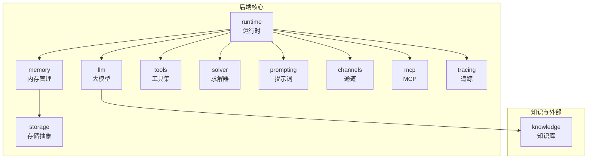
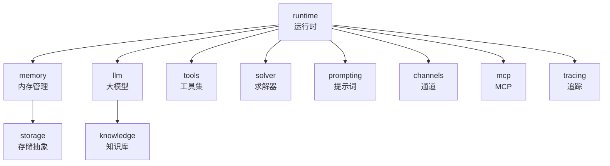
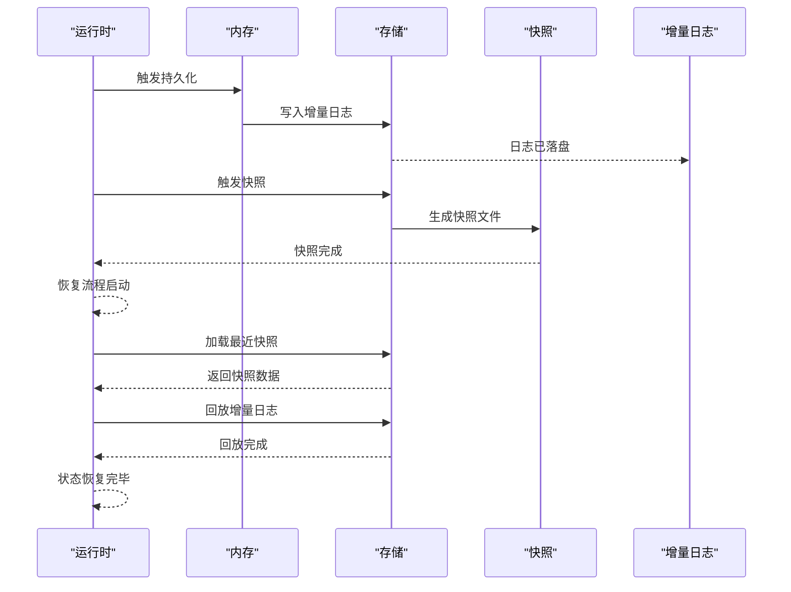
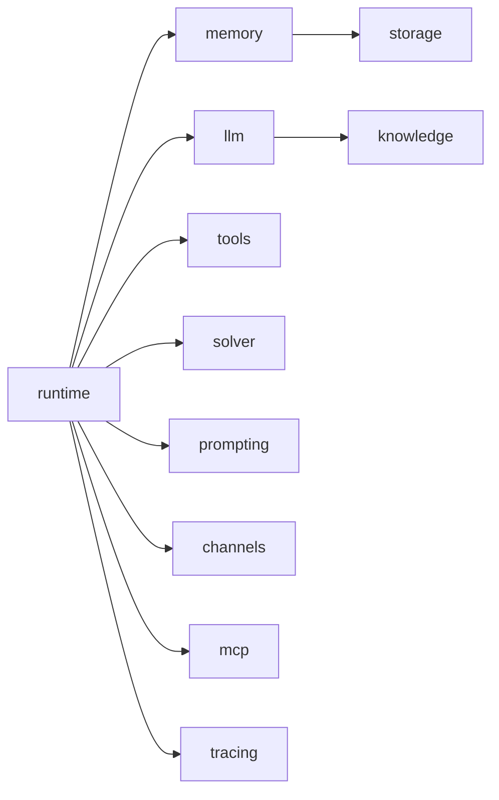

# 内存管理系统

<cite>
**本文引用的文件**
- [.gitignore](file://.gitignore)
- [backend/pyproject.toml](file://backend/pyproject.toml)
- [backend/kore/__init__.py](file://backend/kore/__init__.py)
- [backend/kore/api/router.py](file://backend/kore/api/router.py)
- [backend/kore/memory/__init__.py](file://backend/kore/memory/__init__.py)
- [backend/kore/storage/__init__.py](file://backend/kore/storage/__init__.py)
- [backend/kore/knowledge/__init__.py](file://backend/kore/knowledge/__init__.py)
- [backend/kore/runtime/__init__.py](file://backend/kore/runtime/__init__.py)
- [backend/kore/llm/base.py](file://backend/kore/llm/base.py)
- [backend/kore/llm/factory.py](file://backend/kore/llm/factory.py)
- [backend/kore/tools/__init__.py](file://backend/kore/tools/__init__.py)
- [backend/kore/solver/__init__.py](file://backend/kore/solver/__init__.py)
- [backend/kore/prompting/__init__.py](file://backend/kore/prompting/__init__.py)
- [backend/kore/channels/__init__.py](file://backend/kore/channels/__init__.py)
- [backend/kore/mcp/__init__.py](file://backend/kore/mcp/__init__.py)
- [backend/kore/tracing/__init__.py](file://backend/kore/tracing/__init__.py)
</cite>

## 目录
1. [简介](#简介)
2. [项目结构](#项目结构)
3. [核心组件](#核心组件)
4. [架构总览](#架构总览)
5. [详细组件分析](#详细组件分析)
6. [依赖关系分析](#依赖关系分析)
7. [性能考量](#性能考量)
8. [故障排查指南](#故障排查指南)
9. [结论](#结论)
10. [附录](#附录)

## 简介
本文件面向 Kore 智能体框架的内存管理子系统，聚焦于内存架构设计、状态持久化、缓存与内存池、垃圾回收优化、备份与恢复、监控与性能分析、以及内存泄漏检测与调试实践。由于当前仓库中与“内存”直接相关的具体实现文件尚未提供，本文基于现有目录结构与约定（如数据目录、模块划分）进行概念性与工程实践层面的系统化梳理，并给出可落地的配置与最佳实践建议，帮助开发者在不破坏现有模块边界的情况下，构建稳定高效的内存管理方案。

## 项目结构
Kore 后端采用按功能域分层的模块化组织方式，内存管理作为支撑性能力，通常与以下模块协同工作：
- runtime：运行时核心，承载智能体生命周期与状态流转
- memory：内存抽象与接口定义（当前为空实现，待填充）
- storage：通用存储抽象（当前为空实现，待填充）
- knowledge：知识库与向量索引等外部持久化资源
- llm：大模型接入与上下文管理
- tools/solver/prompting/channels/mcp/tracing：外围能力，可能间接影响内存占用与生命周期

**章节来源**
- [backend/kore/runtime/__init__.py](file://backend/kore/runtime/__init__.py)
- [backend/kore/memory/__init__.py](file://backend/kore/memory/__init__.py)
- [backend/kore/storage/__init__.py](file://backend/kore/storage/__init__.py)
- [backend/kore/knowledge/__init__.py](file://backend/kore/knowledge/__init__.py)
- [backend/kore/llm/base.py](file://backend/kore/llm/base.py)
- [backend/kore/llm/factory.py](file://backend/kore/llm/factory.py)
- [backend/kore/tools/__init__.py](file://backend/kore/tools/__init__.py)
- [backend/kore/solver/__init__.py](file://backend/kore/solver/__init__.py)
- [backend/kore/prompting/__init__.py](file://backend/kore/prompting/__init__.py)
- [backend/kore/channels/__init__.py](file://backend/kore/channels/__init__.py)
- [backend/kore/mcp/__init__.py](file://backend/kore/mcp/__init__.py)
- [backend/kore/tracing/__init__.py](file://backend/kore/tracing/__init__.py)

## 核心组件
- 运行时（runtime）：负责智能体状态的创建、更新、销毁与持久化触发；协调内存与存储的交互。
- 内存（memory）：抽象智能体的短期记忆、对话历史、中间结果等；提供统一的读写接口与生命周期管理。
- 存储（storage）：抽象持久化介质（文件/数据库），屏蔽上层实现细节；支持增量写入与批量落盘。
- 大模型（llm）：负责上下文窗口管理、提示词构造与输出解析，直接影响内存占用峰值。
- 工具/求解器/提示词/通道/MCP/追踪：这些模块在执行过程中产生中间结果与日志，需要纳入内存与存储的整体规划。

**章节来源**
- [backend/kore/runtime/__init__.py](file://backend/kore/runtime/__init__.py)
- [backend/kore/memory/__init__.py](file://backend/kore/memory/__init__.py)
- [backend/kore/storage/__init__.py](file://backend/kore/storage/__init__.py)
- [backend/kore/llm/base.py](file://backend/kore/llm/base.py)
- [backend/kore/llm/factory.py](file://backend/kore/llm/factory.py)
- [backend/kore/tools/__init__.py](file://backend/kore/tools/__init__.py)
- [backend/kore/solver/__init__.py](file://backend/kore/solver/__init__.py)
- [backend/kore/prompting/__init__.py](file://backend/kore/prompting/__init__.py)
- [backend/kore/channels/__init__.py](file://backend/kore/channels/__init__.py)
- [backend/kore/mcp/__init__.py](file://backend/kore/mcp/__init__.py)
- [backend/kore/tracing/__init__.py](file://backend/kore/tracing/__init__.py)

## 架构总览
下图展示内存管理在整体系统中的位置与交互关系。运行时驱动内存与存储，LLM 提供上下文与输出，外围模块通过通道与 MCP 与外部系统交互，追踪模块记录执行轨迹以便后续分析。

**图表来源**
- [backend/kore/runtime/__init__.py](file://backend/kore/runtime/__init__.py)
- [backend/kore/memory/__init__.py](file://backend/kore/memory/__init__.py)
- [backend/kore/storage/__init__.py](file://backend/kore/storage/__init__.py)
- [backend/kore/knowledge/__init__.py](file://backend/kore/knowledge/__init__.py)
- [backend/kore/llm/base.py](file://backend/kore/llm/base.py)
- [backend/kore/llm/factory.py](file://backend/kore/llm/factory.py)
- [backend/kore/tools/__init__.py](file://backend/kore/tools/__init__.py)
- [backend/kore/solver/__init__.py](file://backend/kore/solver/__init__.py)
- [backend/kore/prompting/__init__.py](file://backend/kore/prompting/__init__.py)
- [backend/kore/channels/__init__.py](file://backend/kore/channels/__init__.py)
- [backend/kore/mcp/__init__.py](file://backend/kore/mcp/__init__.py)
- [backend/kore/tracing/__init__.py](file://backend/kore/tracing/__init__.py)

## 详细组件分析

### 内存层次结构与数据组织
- 层次划分
  - 会话级（Session）：一次用户交互或任务执行的上下文容器，包含消息历史、工具调用记录、中间结果等。
  - 执行级（Execution）：单次推理或工具调用的临时状态，生命周期短，需及时释放。
  - 全局级（Global）：跨会话共享的只读或低频更新数据（如系统提示词模板、静态知识片段）。
- 数据组织
  - 基于键值对与层级结构（如会话ID、执行ID、时间戳）组织，便于快速检索与范围查询。
  - 对大对象（如长上下文、嵌入向量）采用延迟加载或分页策略，避免一次性占用过多内存。
- 访问模式
  - 读多写少：优先缓存热点数据，结合LRU/LFU策略淘汰冷数据。
  - 写多读少：批量写入，合并更新，减少碎片化与抖动。

### 智能体状态持久化机制
- 序列化策略
  - 结构化数据采用 JSON/MessagePack 等紧凑格式；二进制大对象采用分段存储与引用索引。
  - 时间序列数据按时间窗口切片，支持按窗口增量落盘。
- 存储策略
  - 热数据驻留内存，定期刷盘；温数据迁移到本地文件或轻量数据库；冷数据归档到远端存储。
  - 使用事务性写入保证一致性，失败重试与幂等处理。
- 恢复流程
  - 启动时按时间顺序加载最近的增量快照，再回放未落盘的变更日志，确保状态一致。
  - 对损坏片段进行隔离与跳过，不影响整体恢复。

### 缓存机制与内存池管理
- 缓存策略
  - LRU/LFU 淘汰，结合 TTL 与容量阈值双重控制；对热点键设置更高优先级。
  - 分层缓存：本地进程内缓存 + 进程间共享缓存（如 Redis），降低重复计算与IO。
- 内存池
  - 针对频繁分配的小对象（如消息节点、工具参数）建立对象池，减少 GC 压力。
  - 大块缓冲区采用池化与复用，避免频繁分配/释放导致的内存碎片。

### 垃圾回收优化
- 减少短生命周期对象：合并临时结构，重用可变容器。
- 弱引用与延迟释放：对可选资源使用弱引用，避免循环引用；在合适时机批量清理。
- 分代 GC 调优：根据业务特征调整新生代/老年代比例，缩短 Full GC 频率。

### 备份与恢复流程
- 增量备份
  - 基于 WAL 或变更日志的增量快照，周期性压缩与去重，降低带宽与存储开销。
- 快照管理
  - 定义快照命名规范与保留策略（如按天/周/月），自动清理过期快照。
- 灾难恢复
  - 支持从最近快照+增量日志恢复；提供校验与修复工具，保障数据完整性。

**图表来源**
- [backend/kore/runtime/__init__.py](file://backend/kore/runtime/__init__.py)
- [backend/kore/memory/__init__.py](file://backend/kore/memory/__init__.py)
- [backend/kore/storage/__init__.py](file://backend/kore/storage/__init__.py)

### 监控与性能分析
- 指标采集
  - 内存占用、GC 次数与耗时、缓存命中率、I/O 吞吐、请求延迟等。
- 可视化
  - 面板展示趋势与异常告警，支持按会话/执行维度钻取。
- 分析工具
  - 使用内存分析器定位大对象与泄漏路径；结合追踪模块的日志进行端到端分析。

### 内存泄漏检测与调试
- 常见原因
  - 循环引用、全局集合未清理、回调未注销、异步任务悬挂。
- 检测手段
  - 定期快照对比，观察对象增长曲线；利用弱引用与 finalizer 辅助定位。
- 调试步骤
  - 重现最小化场景，逐步排除无关模块；对疑似模块启用详细日志与采样。

**章节来源**
- [backend/kore/runtime/__init__.py](file://backend/kore/runtime/__init__.py)
- [backend/kore/memory/__init__.py](file://backend/kore/memory/__init__.py)
- [backend/kore/storage/__init__.py](file://backend/kore/storage/__init__.py)
- [backend/kore/tracing/__init__.py](file://backend/kore/tracing/__init__.py)

## 依赖关系分析
- 模块耦合
  - runtime 与 memory 强耦合，负责状态读写与生命周期；memory 与 storage 弱耦合，通过接口抽象隔离实现。
  - llm 与 knowledge 通过检索与上下文注入影响内存占用；tools/solver/prompting/channels/mcp/tracing 在执行链路中产生中间结果，需纳入内存与存储的整体规划。
- 外部依赖
  - 存储后端可替换（文件/数据库/云存储），通过配置切换；大模型 SDK 与外部服务的连接数与并发度需与内存预算匹配。

**图表来源**
- [backend/kore/runtime/__init__.py](file://backend/kore/runtime/__init__.py)
- [backend/kore/memory/__init__.py](file://backend/kore/memory/__init__.py)
- [backend/kore/storage/__init__.py](file://backend/kore/storage/__init__.py)
- [backend/kore/knowledge/__init__.py](file://backend/kore/knowledge/__init__.py)
- [backend/kore/llm/base.py](file://backend/kore/llm/base.py)
- [backend/kore/llm/factory.py](file://backend/kore/llm/factory.py)
- [backend/kore/tools/__init__.py](file://backend/kore/tools/__init__.py)
- [backend/kore/solver/__init__.py](file://backend/kore/solver/__init__.py)
- [backend/kore/prompting/__init__.py](file://backend/kore/prompting/__init__.py)
- [backend/kore/channels/__init__.py](file://backend/kore/channels/__init__.py)
- [backend/kore/mcp/__init__.py](file://backend/kore/mcp/__init__.py)
- [backend/kore/tracing/__init__.py](file://backend/kore/tracing/__init__.py)

**章节来源**
- [backend/kore/runtime/__init__.py](file://backend/kore/runtime/__init__.py)
- [backend/kore/memory/__init__.py](file://backend/kore/memory/__init__.py)
- [backend/kore/storage/__init__.py](file://backend/kore/storage/__init__.py)
- [backend/kore/knowledge/__init__.py](file://backend/kore/knowledge/__init__.py)
- [backend/kore/llm/base.py](file://backend/kore/llm/base.py)
- [backend/kore/llm/factory.py](file://backend/kore/llm/factory.py)
- [backend/kore/tools/__init__.py](file://backend/kore/tools/__init__.py)
- [backend/kore/solver/__init__.py](file://backend/kore/solver/__init__.py)
- [backend/kore/prompting/__init__.py](file://backend/kore/prompting/__init__.py)
- [backend/kore/channels/__init__.py](file://backend/kore/channels/__init__.py)
- [backend/kore/mcp/__init__.py](file://backend/kore/mcp/__init__.py)
- [backend/kore/tracing/__init__.py](file://backend/kore/tracing/__init__.py)

## 性能考量
- 上下文窗口与批处理
  - 控制单次推理的上下文长度，采用分段与摘要策略；批量处理工具调用与LLM请求，提升吞吐。
- 并发与锁粒度
  - 将共享状态拆分为细粒度区域，减少锁竞争；对只读数据采用无锁结构或不可变对象。
- I/O 与网络
  - 使用异步与流式处理，避免阻塞主线程；对远端存储采用连接池与超时重试。
- 配置建议
  - 根据硬件与负载设定缓存容量、快照频率、GC 参数与并发上限；定期压测验证。

[本节为通用指导，无需列出具体文件来源]

## 故障排查指南
- 常见问题
  - 内存持续上涨：检查是否存在未释放的大对象或缓存未淘汰；核对快照与日志是否正常。
  - 恢复失败：确认快照与日志的版本兼容性；检查损坏片段并进行隔离。
  - 性能抖动：排查 GC 抖动与 I/O 等待；优化批处理与缓存策略。
- 排查步骤
  - 启用详细日志与采样；导出内存快照与追踪数据；对比不同配置下的指标变化。
- 工具与命令
  - 使用系统监控工具与应用埋点；结合追踪模块定位瓶颈环节。

**章节来源**
- [backend/kore/tracing/__init__.py](file://backend/kore/tracing/__init__.py)

## 结论
Kore 的内存管理应以“模块化、可插拔、可观测”为核心原则：通过清晰的模块边界与抽象接口，将运行时、内存、存储与外围能力解耦；通过缓存、内存池与GC优化降低资源消耗；通过增量备份与快照管理保障可靠性；通过监控与分析工具持续优化性能与稳定性。

[本节为总结，无需列出具体文件来源]

## 附录

### 目录与数据约定
- 数据目录约定
  - 运行时数据默认位于 data 目录，包含 memory 与 traces 等子目录；知识库数据位于 data/knowledge/wiki。
- 版本与依赖
  - 项目使用 Python 与标准包管理工具，具体依赖项可在项目配置中声明与锁定。

**章节来源**
- [.gitignore](file://.gitignore)
- [backend/pyproject.toml](file://backend/pyproject.toml)

### 配置示例与最佳实践
- 配置要点
  - 明确内存预算与缓存容量上限；设定快照与日志轮转策略；为不同模块设置独立的并发与超时参数。
- 最佳实践
  - 将热数据与冷数据分离；对大对象采用分页与延迟加载；定期进行压力测试与容量评估；建立变更评审与回滚预案。

[本节为通用指导，无需列出具体文件来源]