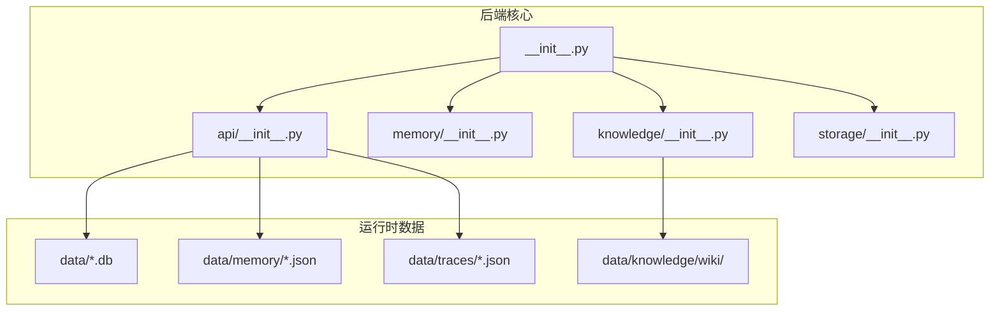
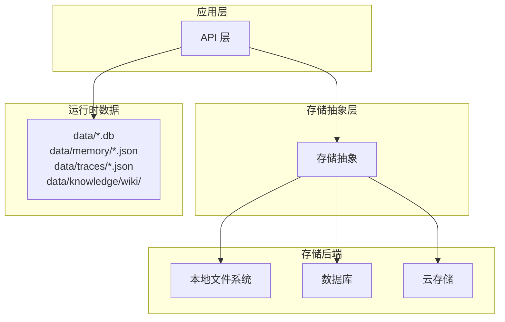
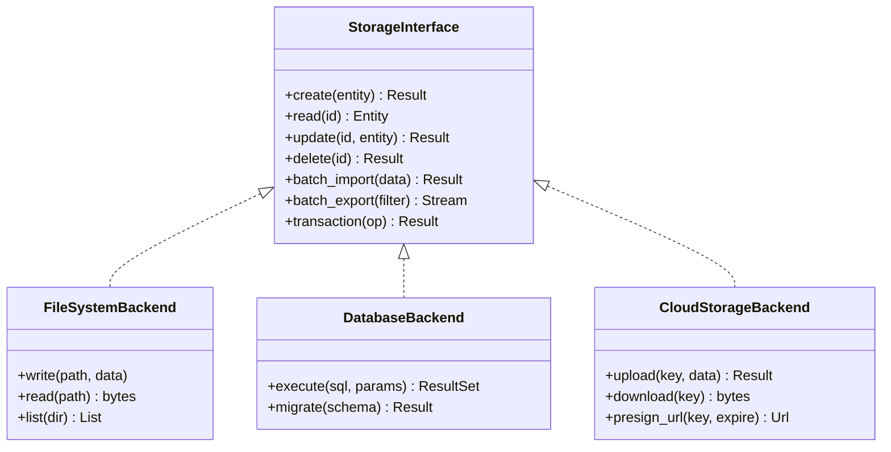
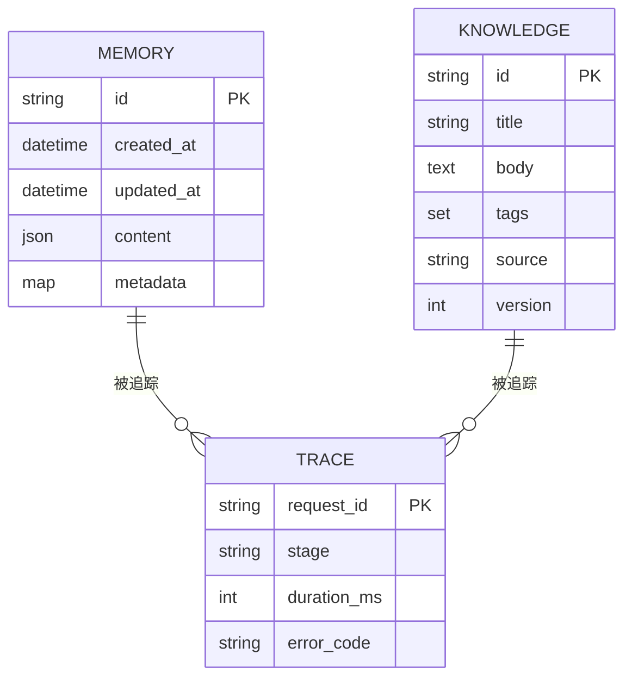
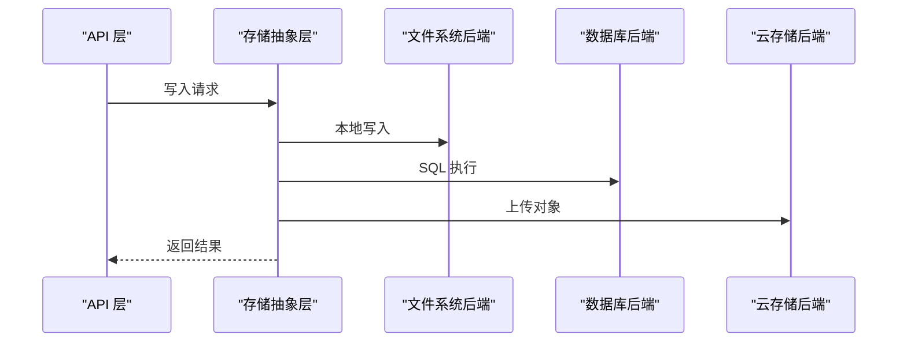
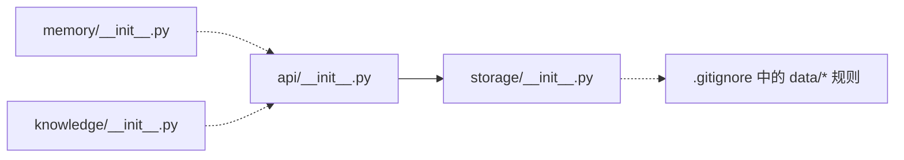

# 存储管理

<cite>
**本文引用的文件**
- [.gitignore](file://.gitignore)
- [backend/kore/__init__.py](file://backend/kore/__init__.py)
- [backend/kore/api/__init__.py](file://backend/kore/api/__init__.py)
- [backend/kore/memory/__init__.py](file://backend/kore/memory/__init__.py)
- [backend/kore/knowledge/__init__.py](file://backend/kore/knowledge/__init__.py)
- [backend/kore/storage/__init__.py](file://backend/kore/storage/__init__.py)
</cite>

## 目录
1. [简介](#简介)
2. [项目结构](#项目结构)
3. [核心组件](#核心组件)
4. [架构总览](#架构总览)
5. [详细组件分析](#详细组件分析)
6. [依赖分析](#依赖分析)
7. [性能考虑](#性能考虑)
8. [故障排查指南](#故障排查指南)
9. [结论](#结论)
10. [附录](#附录)

## 简介
本文件面向 Kore 智能体框架的存储管理子系统，基于当前仓库可见的模块组织与运行时数据路径，系统性阐述存储架构设计原则、数据模型思路、后端抽象与接口规范、支持的存储后端类型（本地文件系统、数据库与云存储）、性能优化策略、配置与迁移指南、安全与访问控制机制，并提供可操作的配置示例与调优建议。由于当前仓库中存储相关实现尚未在代码层面完全展开，本文以模块化组织与运行时数据路径为依据，构建可扩展的存储体系蓝图，便于后续迭代落地。

## 项目结构
Kore 后端采用按功能域分层的模块化组织方式，存储管理作为基础设施之一，位于 backend/kore 下，与 API、记忆体、知识库、运行时等模块协同工作。从忽略规则可见，运行时产生的数据主要落盘于 data 目录下的数据库、JSON 文件与知识库目录，体现了对本地持久化的默认支持。

**图表来源**
- [backend/kore/__init__.py](file://backend/kore/__init__.py)
- [backend/kore/api/__init__.py](file://backend/kore/api/__init__.py)
- [backend/kore/memory/__init__.py](file://backend/kore/memory/__init__.py)
- [backend/kore/knowledge/__init__.py](file://backend/kore/knowledge/__init__.py)
- [backend/kore/storage/__init__.py](file://backend/kore/storage/__init__.py)
- [.gitignore](file://.gitignore)

**章节来源**
- [backend/kore/__init__.py](file://backend/kore/__init__.py)
- [backend/kore/api/__init__.py](file://backend/kore/api/__init__.py)
- [backend/kore/memory/__init__.py](file://backend/kore/memory/__init__.py)
- [backend/kore/knowledge/__init__.py](file://backend/kore/knowledge/__init__.py)
- [backend/kore/storage/__init__.py](file://backend/kore/storage/__init__.py)
- [.gitignore](file://.gitignore)

## 核心组件
- 存储抽象层：提供统一的数据访问接口，屏蔽具体后端差异（本地文件系统、数据库、云存储），确保上层模块无需感知底层实现。
- 数据模型层：定义智能体运行期的核心实体（如记忆体、知识条目、追踪日志）及其字段、关系与约束，保证数据一致性与可演进性。
- 运行时适配层：对接 API 层与业务逻辑，负责数据的读写、序列化/反序列化、事务与并发控制。
- 配置与迁移工具：提供环境化配置、数据导入导出与版本迁移脚本，保障部署灵活性与数据安全。

上述组件在当前仓库中通过模块划分体现，存储抽象层与数据模型层的具体实现尚未在代码中出现，但其职责边界已在模块命名与运行时数据路径中得到印证。

**章节来源**
- [backend/kore/storage/__init__.py](file://backend/kore/storage/__init__.py)
- [.gitignore](file://.gitignore)

## 架构总览
下图展示 Kore 存储管理的高层架构：API 层通过统一接口与存储抽象层交互；存储抽象层根据配置选择具体后端（本地文件系统、数据库或云存储）；运行时数据（数据库、JSON、知识库）由 API 层写入 data 目录。

**图表来源**
- [backend/kore/api/__init__.py](file://backend/kore/api/__init__.py)
- [backend/kore/storage/__init__.py](file://backend/kore/storage/__init__.py)
- [.gitignore](file://.gitignore)

## 详细组件分析

### 存储抽象层设计
- 接口契约：定义通用的 CRUD 操作、批量导入导出、事务与并发控制接口，确保不同后端的一致行为。
- 后端选择：通过配置项动态切换后端，支持本地优先、回退策略与故障转移。
- 序列化策略：针对 JSON、二进制与压缩格式进行统一处理，兼顾体积与性能。
- 版本兼容：在接口层引入版本号与兼容性检查，避免破坏性变更影响上层模块。

**图表来源**
- [backend/kore/storage/__init__.py](file://backend/kore/storage/__init__.py)

**章节来源**
- [backend/kore/storage/__init__.py](file://backend/kore/storage/__init__.py)

### 数据模型与实体关系
- 记忆体实体：用于保存对话历史、上下文片段与临时状态，字段包含标识符、时间戳、内容与元数据，约束包括唯一索引与过期清理。
- 知识实体：用于结构化知识条目，字段包含标题、内容、标签、来源与版本，约束包括全文检索索引与引用完整性。
- 追踪实体：用于记录执行轨迹与性能指标，字段包含请求 ID、阶段、耗时与错误码，约束包括聚合统计与归档策略。
- 关系设计：记忆体与知识之间通过标签与引用建立弱耦合关联；追踪与所有实体通过请求 ID 强关联，便于审计与排障。

**图表来源**
- [.gitignore](file://.gitignore)

**章节来源**
- [.gitignore](file://.gitignore)

### 支持的存储后端类型与集成方式
- 本地文件系统：适合开发与小规模部署，提供简单可靠的持久化能力。集成要点包括路径规范化、权限控制与磁盘配额监控。
- 数据库：适合生产环境，提供 ACID 事务、索引与查询优化。集成要点包括连接池、迁移脚本与备份策略。
- 云存储：适合分布式与高可用场景，提供弹性扩展与多区域冗余。集成要点包括签名 URL、访问密钥轮换与传输加密。

**图表来源**
- [backend/kore/api/__init__.py](file://backend/kore/api/__init__.py)
- [backend/kore/storage/__init__.py](file://backend/kore/storage/__init__.py)

**章节来源**
- [backend/kore/api/__init__.py](file://backend/kore/api/__init__.py)
- [backend/kore/storage/__init__.py](file://backend/kore/storage/__init__.py)

### 性能优化策略
- 索引设计：对高频查询字段建立复合索引与覆盖索引，减少全表扫描；对 JSON 字段使用函数索引或物化列。
- 查询优化：使用参数化查询与预编译语句，避免 N+1 查询；对大对象采用流式读取与分页。
- 缓存机制：在应用层引入 LRU 缓存与热点数据驻留；对只读数据使用分布式缓存，结合失效策略与一致性协议。
- 并发控制：采用乐观锁与版本号，避免写冲突；对长事务进行拆分与超时控制。
- IO 优化：批量写入与异步刷盘，减少系统调用次数；对日志与追踪采用缓冲与压缩。

**章节来源**
- [backend/kore/storage/__init__.py](file://backend/kore/storage/__init__.py)

### 配置与迁移指南
- 环境配置：通过环境变量或配置文件指定后端类型、连接参数与路径前缀；区分开发、测试与生产环境。
- 数据导入导出：提供 CLI 工具或 API 接口，支持增量与全量导出；导入时进行校验与去重。
- 版本升级：制定迁移脚本，先写只读副本再切换流量；对不兼容变更提供回滚策略与数据修复工具。
- 备份与恢复：定期快照与异地容灾；演练恢复流程，验证 RPO/RTO 指标。

**章节来源**
- [backend/kore/storage/__init__.py](file://backend/kore/storage/__init__.py)

### 安全与访问控制
- 身份认证：统一令牌管理与会话验证，限制匿名访问。
- 授权模型：基于角色的访问控制（RBAC），最小权限原则。
- 数据加密：传输加密（TLS）与静态加密（密钥管理服务），保护敏感信息。
- 审计日志：记录关键操作与异常事件，支持合规审查。
- 输入校验：严格的数据格式与长度校验，防止注入与越权。

**章节来源**
- [backend/kore/storage/__init__.py](file://backend/kore/storage/__init__.py)

## 依赖分析
当前仓库中存储相关模块均为空实现占位，依赖关系简单，耦合度低，便于后续扩展。API 层与存储抽象层通过接口解耦，记忆体与知识库模块独立存在，运行时数据路径由忽略规则明确。

**图表来源**
- [backend/kore/api/__init__.py](file://backend/kore/api/__init__.py)
- [backend/kore/storage/__init__.py](file://backend/kore/storage/__init__.py)
- [backend/kore/memory/__init__.py](file://backend/kore/memory/__init__.py)
- [backend/kore/knowledge/__init__.py](file://backend/kore/knowledge/__init__.py)
- [.gitignore](file://.gitignore)

**章节来源**
- [backend/kore/api/__init__.py](file://backend/kore/api/__init__.py)
- [backend/kore/storage/__init__.py](file://backend/kore/storage/__init__.py)
- [backend/kore/memory/__init__.py](file://backend/kore/memory/__init__.py)
- [backend/kore/knowledge/__init__.py](file://backend/kore/knowledge/__init__.py)
- [.gitignore](file://.gitignore)

## 性能考虑
- 读写分离：对读多写少场景启用只读副本，降低主库压力。
- 分片策略：按时间或业务维度水平分片，提升扩展性与维护效率。
- 压缩与归档：对历史数据进行压缩与冷热分层，节省存储成本。
- 监控与告警：建立关键指标（QPS、延迟、错误率、磁盘使用率）的实时监控与自动告警。

[本节为通用指导，无需列出章节来源]

## 故障排查指南
- 常见问题定位：检查后端连接状态、磁盘空间与权限、网络连通性与超时设置。
- 日志分析：开启细粒度日志，结合追踪 ID 快速定位问题链路。
- 回滚与修复：在迁移失败时回滚到上一个稳定版本；对损坏数据进行修复或重建。
- 容量预警：设置阈值告警，提前扩容或清理过期数据。

**章节来源**
- [backend/kore/storage/__init__.py](file://backend/kore/storage/__init__.py)

## 结论
Kore 的存储管理以模块化与抽象化为核心设计思想，通过清晰的接口契约与可插拔的后端实现，为智能体框架提供了灵活且可扩展的持久化能力。当前仓库已奠定基础结构与运行时数据路径，后续可在存储抽象层与数据模型层逐步完善，以支撑本地、数据库与云存储的统一接入，并配套完善的性能优化、安全与运维工具链。

[本节为总结性内容，无需列出章节来源]

## 附录
- 配置示例（示意）
  - 后端类型：本地/数据库/云存储
  - 连接参数：主机、端口、凭据、超时
  - 路径前缀：data/ 前缀与命名规范
  - 缓存参数：容量、TTL、淘汰策略
- 调优建议（示意）
  - 索引覆盖率与查询计划
  - 连接池大小与超时设置
  - 批量写入窗口与压缩级别
  - 监控指标阈值与告警策略

[本节为概念性内容，无需列出章节来源]