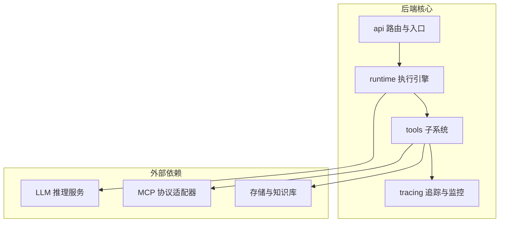
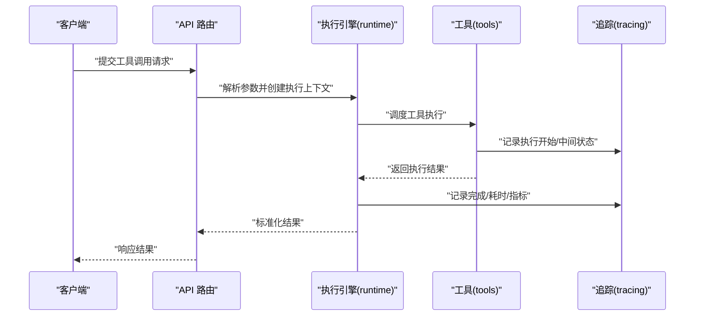
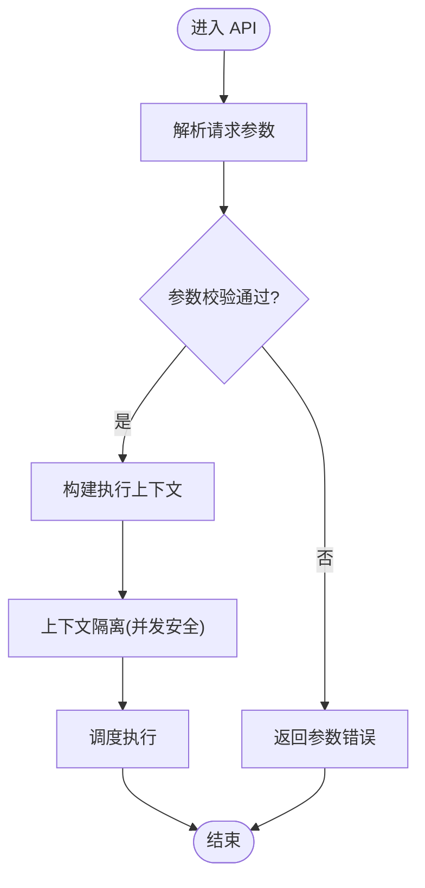
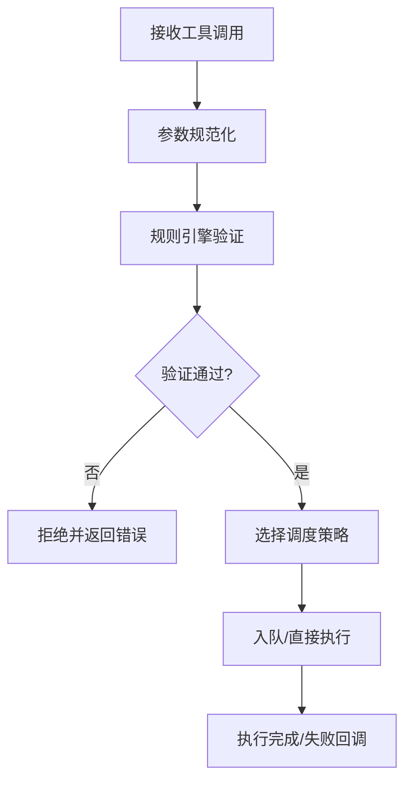
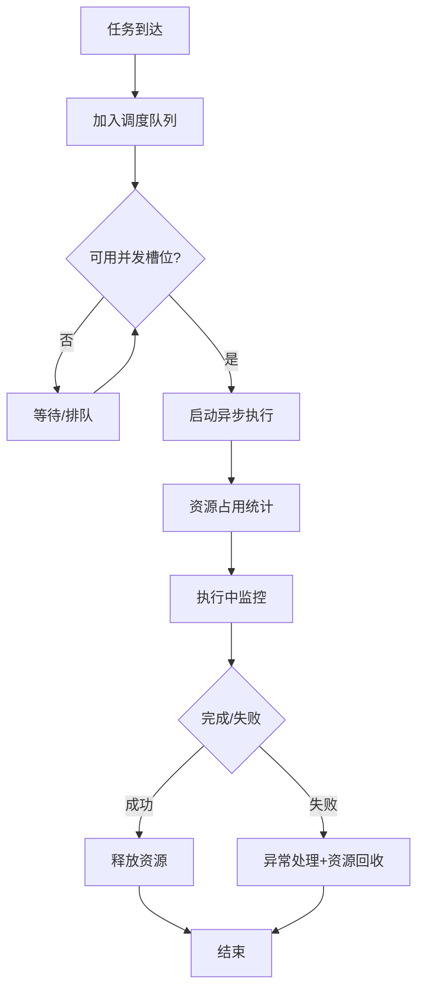
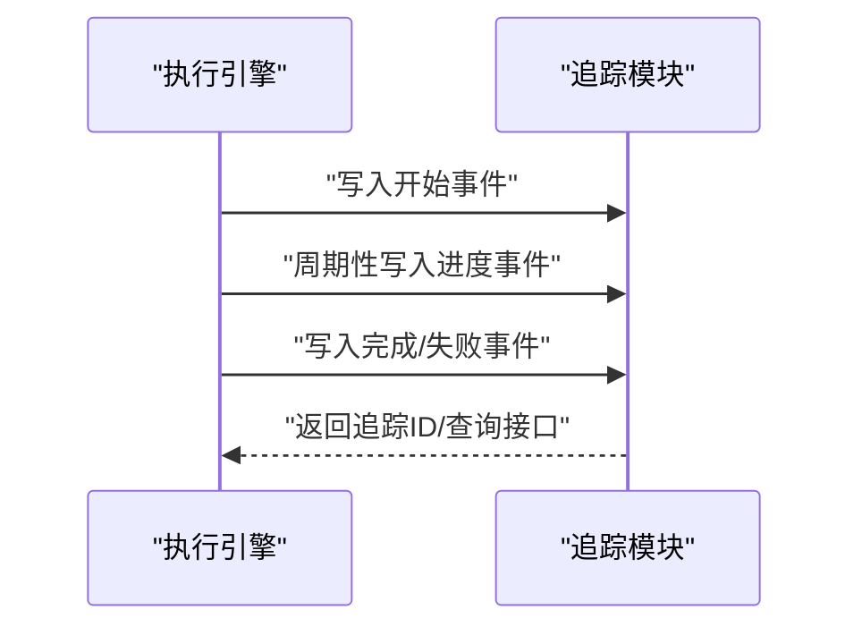
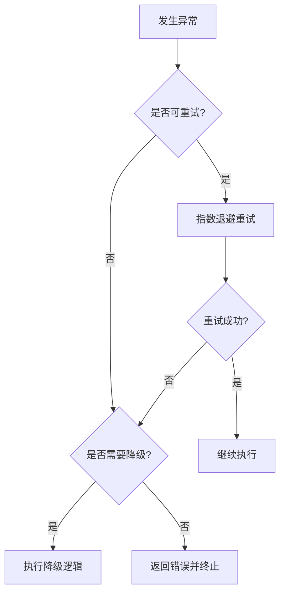
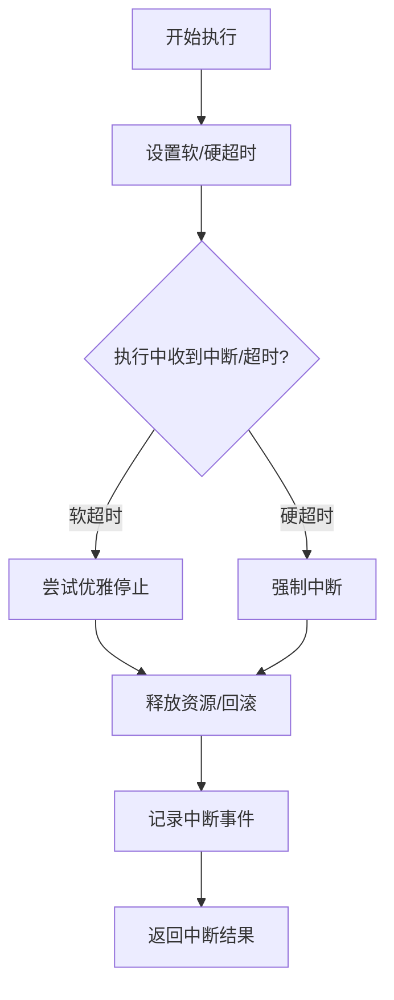
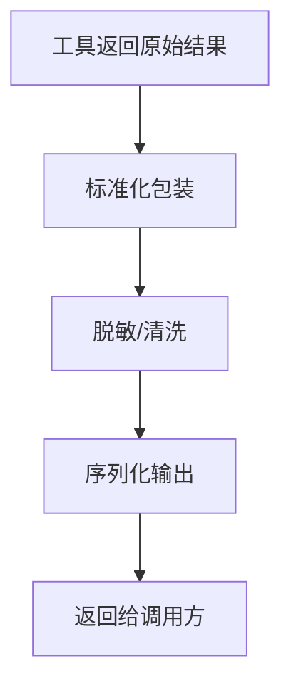
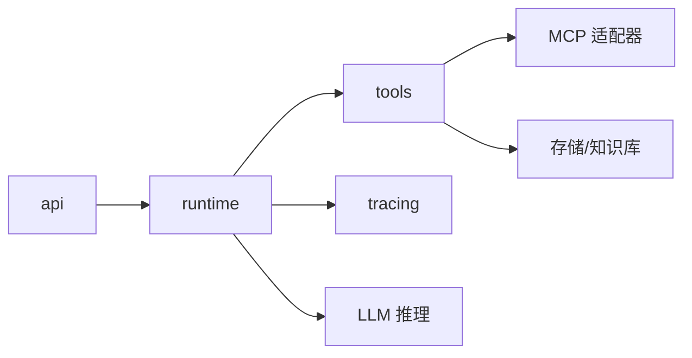

# 工具执行机制

<cite>
**本文引用的文件**
- [backend/kore/tools/__init__.py](file://backend/kore/tools/__init__.py)
- [backend/kore/runtime/__init__.py](file://backend/kore/runtime/__init__.py)
- [backend/kore/api/__init__.py](file://backend/kore/api/__init__.py)
- [backend/kore/tracing/__init__.py](file://backend/kore/tracing/__init__.py)
- [backend/pyproject.toml](file://backend/pyproject.toml)
</cite>

## 目录
1. [引言](#引言)
2. [项目结构](#项目结构)
3. [核心组件](#核心组件)
4. [架构总览](#架构总览)
5. [详细组件分析](#详细组件分析)
6. [依赖关系分析](#依赖关系分析)
7. [性能考量](#性能考量)
8. [故障排查指南](#故障排查指南)
9. [结论](#结论)
10. [附录](#附录)

## 引言
本文件聚焦 Kore 智能体框架中的“工具执行机制”，围绕以下目标展开：执行上下文创建、参数验证与执行调度；异步处理与并发控制、资源管理；监控与追踪（状态跟踪、性能指标）；错误处理策略（异常捕获、重试、降级）；超时控制与中断处理；以及执行结果的格式化与标准化。由于当前仓库中工具执行的具体实现文件尚未完全呈现，本文基于现有模块接口与典型工程实践进行系统性梳理与可视化说明，帮助读者建立对 Kore 工具执行体系的整体认知。

## 项目结构
Kore 后端采用分层与功能域划分的组织方式，工具执行相关能力主要分布在 tools、runtime、api、tracing 等子包中。下图给出概览性结构：

**图表来源**
- [backend/kore/tools/__init__.py](file://backend/kore/tools/__init__.py)
- [backend/kore/runtime/__init__.py](file://backend/kore/runtime/__init__.py)
- [backend/kore/api/__init__.py](file://backend/kore/api/__init__.py)
- [backend/kore/tracing/__init__.py](file://backend/kore/tracing/__init__.py)

**章节来源**
- [backend/kore/tools/__init__.py](file://backend/kore/tools/__init__.py)
- [backend/kore/runtime/__init__.py](file://backend/kore/runtime/__init__.py)
- [backend/kore/api/__init__.py](file://backend/kore/api/__init__.py)
- [backend/kore/tracing/__init__.py](file://backend/kore/tracing/__init__.py)

## 核心组件
- 工具注册与发现：tools 子系统负责工具的声明、注册与发现，形成统一的工具清单与元数据。
- 执行引擎：runtime 提供执行上下文、调度器、并发控制与资源管理能力。
- API 入口：api 子系统接收请求，解析调用参数，触发执行引擎。
- 追踪与监控：tracing 子系统贯穿执行生命周期，采集状态与性能指标。
- 外部集成：通过 MCP 协议适配器与 LLM/存储等外部系统交互。

上述职责边界清晰，便于扩展与维护。

**章节来源**
- [backend/kore/tools/__init__.py](file://backend/kore/tools/__init__.py)
- [backend/kore/runtime/__init__.py](file://backend/kore/runtime/__init__.py)
- [backend/kore/api/__init__.py](file://backend/kore/api/__init__.py)
- [backend/kore/tracing/__init__.py](file://backend/kore/tracing/__init__.py)

## 架构总览
工具执行从 API 入口开始，经由执行引擎调度到具体工具，期间通过追踪模块记录状态与指标，最终返回标准化结果。下图展示端到端流程：

**图表来源**
- [backend/kore/api/__init__.py](file://backend/kore/api/__init__.py)
- [backend/kore/runtime/__init__.py](file://backend/kore/runtime/__init__.py)
- [backend/kore/tools/__init__.py](file://backend/kore/tools/__init__.py)
- [backend/kore/tracing/__init__.py](file://backend/kore/tracing/__init__.py)

## 详细组件分析

### 执行上下文创建
- 参数解析：API 层负责提取请求参数，校验必填字段与类型，构建初始上下文对象。
- 上下文扩展：执行引擎根据工具元数据与运行环境，补充会话、权限、超时等上下文信息。
- 上下文隔离：为每个任务创建独立上下文，避免并发场景下的状态污染。

**图表来源**
- [backend/kore/api/__init__.py](file://backend/kore/api/__init__.py)
- [backend/kore/runtime/__init__.py](file://backend/kore/runtime/__init__.py)

**章节来源**
- [backend/kore/api/__init__.py](file://backend/kore/api/__init__.py)
- [backend/kore/runtime/__init__.py](file://backend/kore/runtime/__init__.py)

### 参数验证与执行调度
- 验证策略：采用白名单/黑名单结合的规则集，支持类型约束、范围限制与业务规则。
- 调度策略：按工具类别、优先级与资源占用进行队列化调度；支持抢占式与非抢占式两种模式。
- 工具选择：依据工具元数据（能力、兼容性、SLA）与当前负载动态选择最优执行路径。

**图表来源**
- [backend/kore/tools/__init__.py](file://backend/kore/tools/__init__.py)
- [backend/kore/runtime/__init__.py](file://backend/kore/runtime/__init__.py)

**章节来源**
- [backend/kore/tools/__init__.py](file://backend/kore/tools/__init__.py)
- [backend/kore/runtime/__init__.py](file://backend/kore/runtime/__init__.py)

### 异步处理、并发控制与资源管理
- 异步模型：使用事件循环与协程模型，避免阻塞主线程；IO 密集型工具优先采用异步执行。
- 并发控制：设置全局并发上限与工具粒度并发上限；基于信号量/计数锁实现公平调度。
- 资源管理：统一管理 CPU、内存、网络与外部连接池；超限时自动回收与降级。

**图表来源**
- [backend/kore/runtime/__init__.py](file://backend/kore/runtime/__init__.py)
- [backend/kore/tools/__init__.py](file://backend/kore/tools/__init__.py)

**章节来源**
- [backend/kore/runtime/__init__.py](file://backend/kore/runtime/__init__.py)
- [backend/kore/tools/__init__.py](file://backend/kore/tools/__init__.py)

### 监控与追踪（状态跟踪与性能指标）
- 状态追踪：在“开始/中间/完成/失败”等关键节点写入追踪事件，包含任务 ID、阶段、耗时、工具名、输入摘要等。
- 指标采集：CPU 使用率、内存占用、IO 延迟、工具成功率、P95/P99 延迟等。
- 可视化与告警：通过追踪事件驱动仪表盘与阈值告警，支持实时与离线分析。

**图表来源**
- [backend/kore/tracing/__init__.py](file://backend/kore/tracing/__init__.py)
- [backend/kore/runtime/__init__.py](file://backend/kore/runtime/__init__.py)

**章节来源**
- [backend/kore/tracing/__init__.py](file://backend/kore/tracing/__init__.py)
- [backend/kore/runtime/__init__.py](file://backend/kore/runtime/__init__.py)

### 错误处理策略（异常捕获、重试与降级）
- 异常分类：网络异常、工具内部错误、参数错误、超时错误等。
- 重试策略：指数退避、抖动、最大重试次数；区分可重试与不可重试错误。
- 降级策略：快速失败、兜底方案、熔断保护；在高失败率时切换到稳定但低效路径。
- 统一错误码与消息：对外输出结构化错误，保留内部诊断信息以便追踪。

**图表来源**
- [backend/kore/runtime/__init__.py](file://backend/kore/runtime/__init__.py)
- [backend/kore/tools/__init__.py](file://backend/kore/tools/__init__.py)

**章节来源**
- [backend/kore/runtime/__init__.py](file://backend/kore/runtime/__init__.py)
- [backend/kore/tools/__init__.py](file://backend/kore/tools/__init__.py)

### 超时控制与中断处理
- 超时策略：为任务设置软/硬超时；软超时触发优雅停止，硬超时强制中断。
- 中断机制：支持取消令牌与信号处理；在工具侧实现可中断点，确保资源及时释放。
- 回退与补偿：超时后回滚已执行副作用或触发补偿动作。

**图表来源**
- [backend/kore/runtime/__init__.py](file://backend/kore/runtime/__init__.py)
- [backend/kore/tools/__init__.py](file://backend/kore/tools/__init__.py)

**章节来源**
- [backend/kore/runtime/__init__.py](file://backend/kore/runtime/__init__.py)
- [backend/kore/tools/__init__.py](file://backend/kore/tools/__init__.py)

### 结果格式化与标准化
- 结构化输出：统一返回体包含结果主体、元数据（时间戳、工具名、版本）、状态码与可选错误信息。
- 数据清洗：对敏感字段脱敏、对大字段压缩或分页返回。
- 兼容性：支持多种序列化格式（JSON/Protobuf），并提供向后兼容映射。

**图表来源**
- [backend/kore/tools/__init__.py](file://backend/kore/tools/__init__.py)
- [backend/kore/api/__init__.py](file://backend/kore/api/__init__.py)

**章节来源**
- [backend/kore/tools/__init__.py](file://backend/kore/tools/__init__.py)
- [backend/kore/api/__init__.py](file://backend/kore/api/__init__.py)

## 依赖关系分析
- 内部依赖：api → runtime → tools；runtime 与 tracing 解耦，通过事件/日志解耦。
- 外部依赖：工具可能依赖 MCP、存储、LLM 等外部系统；通过适配器与配置隔离。
- 版本与兼容：通过 pyproject.toml 管理依赖版本，确保工具链一致性。

**图表来源**
- [backend/kore/api/__init__.py](file://backend/kore/api/__init__.py)
- [backend/kore/runtime/__init__.py](file://backend/kore/runtime/__init__.py)
- [backend/kore/tools/__init__.py](file://backend/kore/tools/__init__.py)
- [backend/kore/tracing/__init__.py](file://backend/kore/tracing/__init__.py)
- [backend/pyproject.toml](file://backend/pyproject.toml)

**章节来源**
- [backend/kore/api/__init__.py](file://backend/kore/api/__init__.py)
- [backend/kore/runtime/__init__.py](file://backend/kore/runtime/__init__.py)
- [backend/kore/tools/__init__.py](file://backend/kore/tools/__init__.py)
- [backend/kore/tracing/__init__.py](file://backend/kore/tracing/__init__.py)
- [backend/pyproject.toml](file://backend/pyproject.toml)

## 性能考量
- I/O 与 CPU 分离：将 I/O 密集型与 CPU 密集型工具分离，避免互相抢占。
- 缓存与批处理：对重复请求进行缓存；对相似任务进行批处理以提升吞吐。
- 资源配额：为不同工具设定资源配额，防止头部应用影响整体稳定性。
- 监控驱动优化：基于追踪指标持续优化热点路径与瓶颈环节。

## 故障排查指南
- 快速定位：通过追踪事件 ID 定位任务全生命周期日志，确认失败阶段。
- 常见问题：
  - 参数错误：检查 API 层参数校验规则与工具元数据。
  - 超时/中断：核查超时配置与工具侧中断点实现。
  - 并发冲突：查看并发上限与队列长度，必要时调整限流策略。
  - 外部依赖异常：检查 MCP/存储/LLM 的可用性与鉴权配置。
- 诊断工具：结合追踪事件与指标面板，定位延迟峰值与失败集中时段。

**章节来源**
- [backend/kore/tracing/__init__.py](file://backend/kore/tracing/__init__.py)
- [backend/kore/runtime/__init__.py](file://backend/kore/runtime/__init__.py)
- [backend/kore/tools/__init__.py](file://backend/kore/tools/__init__.py)

## 结论
Kore 的工具执行机制以“可观察、可扩展、可治理”为目标，通过清晰的分层与模块化设计，实现了从请求到结果的全链路可控。建议在后续迭代中进一步完善工具元数据模型、增强自愈能力与多租户隔离，以支撑更大规模的生产场景。

## 附录
- 关键接口与职责建议（示意）：
  - API 层：请求解析、参数校验、结果封装
  - 执行引擎：上下文管理、调度、并发与资源控制
  - 工具层：能力声明、参数验证、执行实现
  - 追踪层：事件采集、指标上报、可视化支持
- 依赖版本管理：通过 pyproject.toml 统一管理第三方依赖版本，确保工具链稳定。

**章节来源**
- [backend/kore/api/__init__.py](file://backend/kore/api/__init__.py)
- [backend/kore/runtime/__init__.py](file://backend/kore/runtime/__init__.py)
- [backend/kore/tools/__init__.py](file://backend/kore/tools/__init__.py)
- [backend/kore/tracing/__init__.py](file://backend/kore/tracing/__init__.py)
- [backend/pyproject.toml](file://backend/pyproject.toml)