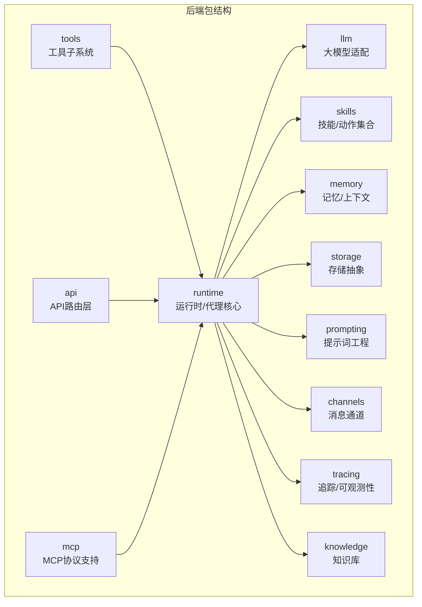
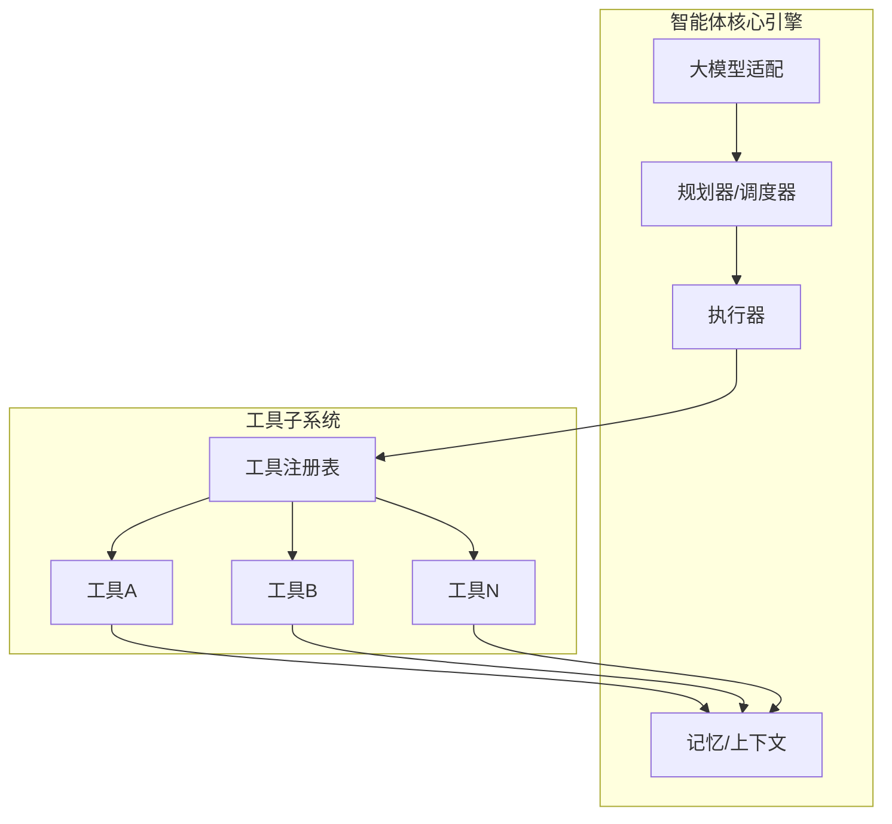
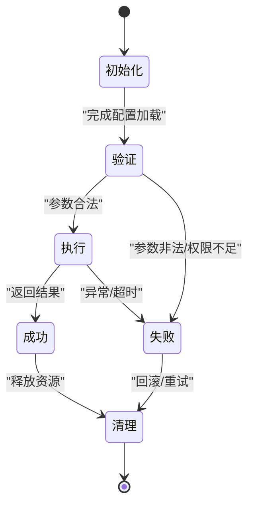
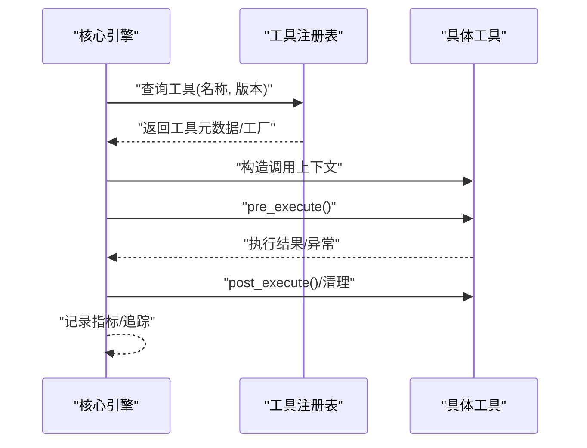
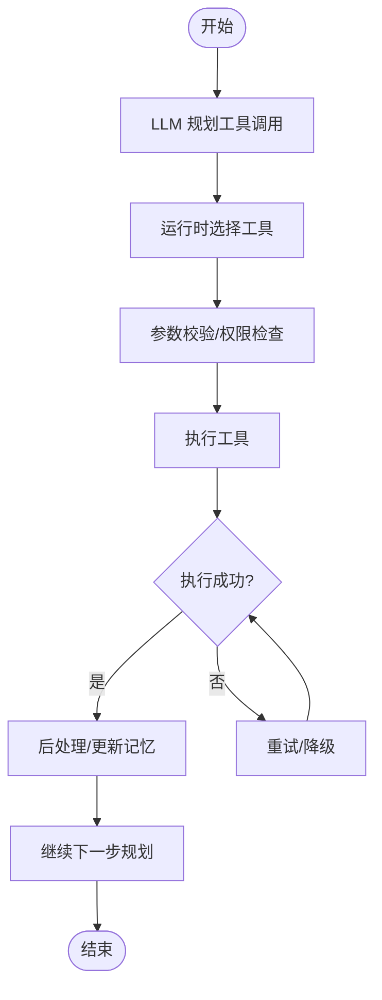
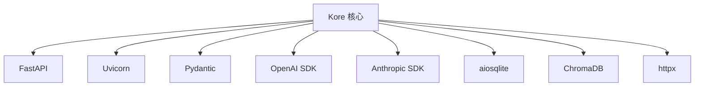

# 工具架构设计

<cite>
**本文引用的文件**
- [pyproject.toml](file://backend/pyproject.toml)
- [.gitignore](file://.gitignore)
</cite>

## 目录
1. [引言](#引言)
2. [项目结构](#项目结构)
3. [核心组件](#核心组件)
4. [架构总览](#架构总览)
5. [详细组件分析](#详细组件分析)
6. [依赖分析](#依赖分析)
7. [性能考虑](#性能考虑)
8. [故障排查指南](#故障排查指南)
9. [结论](#结论)
10. [附录](#附录)

## 引言
本文件面向 Kore 智能体框架的工具架构设计，聚焦于工具系统的整体架构原理、工具抽象基类的设计思路、工具接口的标准化定义、工具生命周期管理机制、工具分类体系、工具注册表的作用与实现机制、扩展性（插件化与模块化）设计考量，以及工具系统与智能体核心引擎的集成方式与数据流转过程。由于当前仓库中未包含工具子系统源码文件，本文在缺乏具体实现细节的情况下，基于现有依赖与目录结构进行概念性与架构层面的系统化阐述，并给出可落地的设计建议与最佳实践。

## 项目结构
从已知的项目结构看，后端采用 Python 包组织方式，顶层包含多个功能域子包，如 tools、runtime、llm 等。工具系统作为智能体能力的“插件化扩展”，通常位于 tools 子包下；运行时与代理核心逻辑位于 runtime；大模型适配位于 llm。这些模块之间通过清晰的职责边界协作：tools 提供可复用的能力单元，runtime 负责编排与调度，llm 提供推理能力。

**章节来源**
- [pyproject.toml:1-34](file://backend/pyproject.toml#L1-L34)

## 核心组件
- 工具抽象基类：定义统一的工具接口契约，确保不同工具具备一致的输入输出规范、生命周期钩子与错误处理策略。
- 工具接口标准化：以 Pydantic 模型或数据类描述工具参数与返回值，保证序列化、校验与跨模块传递的一致性。
- 工具生命周期管理：涵盖初始化、验证、执行、清理等阶段，支持并发安全与资源回收。
- 工具注册表：集中管理工具清单、版本与元数据，提供动态发现、加载与卸载能力。
- 工具分类体系：按功能特性（查询、操作、生成）、使用场景（对话、计划、执行）与类型（HTTP、数据库、外部服务）进行分层归类。
- 扩展性设计：插件化与模块化原则，允许第三方工具以约定格式接入，同时保持核心引擎稳定。

## 架构总览
工具系统与核心引擎的集成遵循“解耦+编排”的模式：工具作为独立能力单元被注册到注册表，核心引擎在决策与执行阶段按需调用工具，LLM 负责将任务转化为工具调用指令，运行时负责调度与状态管理。

## 详细组件分析

### 工具抽象基类设计
- 设计目标：统一工具行为与接口，便于编排、缓存、限流与可观测性。
- 关键要素：
  - 输入/输出模型：使用强类型数据结构描述参数与返回值。
  - 生命周期钩子：如 pre_execute、post_execute、on_error 等。
  - 元数据：名称、描述、版本、依赖、权限与安全策略。
  - 并发与资源：支持异步执行、连接池与超时控制。
- 建议实现要点：
  - 将工具封装为可序列化的对象，便于跨进程/网络传输。
  - 在基类中内置校验与默认行为，降低重复代码。

### 工具接口标准化
- 参数与返回值：以 Pydantic 模型或等价数据结构定义，确保跨模块一致性。
- 错误模型：统一异常类型与错误码，便于上层捕获与恢复。
- 文档与示例：为每个工具提供最小可运行示例，降低接入成本。

### 工具生命周期管理
- 初始化：加载配置、建立连接、预热缓存。
- 验证：参数校验、权限检查、配额限制。
- 执行：调用底层能力，处理中间态与重试。
- 清理：释放资源、回滚事务、记录日志。
- 监控：埋点指标、追踪链路、告警阈值。

### 工具分类体系
- 功能特性分类：
  - 查询类：检索、搜索、统计。
  - 操作类：写入、更新、删除、变更。
  - 生成类：文本生成、图像生成、代码生成。
- 使用场景归类：
  - 对话增强：意图识别、实体抽取、多轮对齐。
  - 计划执行：子任务拆分、依赖分析、时序编排。
  - 决策支持：规则匹配、评分排序、风险评估。
- 类型划分：
  - HTTP 工具：REST/GraphQL 接口封装。
  - 数据库工具：SQL/ORM 抽象。
  - 外部服务工具：三方 API、SDK 封装。
  - 文件/存储工具：上传、下载、压缩、归档。

### 工具注册表
- 作用：集中管理工具清单、版本、元数据与依赖，提供动态发现与加载能力。
- 实现机制建议：
  - 注册：工具类或实例注册到全局注册表，记录元信息与工厂方法。
  - 发现：扫描模块、读取配置或注解，自动发现可用工具。
  - 加载：按需加载，支持懒加载与热更新。
  - 卸载：安全关闭与资源回收，避免泄漏。
- 与运行时的交互：执行前由调度器查询注册表，解析工具名与版本，构造调用上下文。

### 扩展性设计（插件化与模块化）
- 插件化：
  - 规范工具入口与接口，第三方以标准包形式发布。
  - 支持热插拔与灰度发布，避免影响主流程。
- 模块化：
  - 工具按领域拆分模块，降低耦合度。
  - 明确模块间依赖与边界，避免循环依赖。
- 安全与治理：
  - 权限控制与沙箱执行，限制高危操作。
  - 审计日志与合规检查，满足企业级要求。

### 与智能体核心引擎的集成与数据流转
- 数据流：
  - LLM 将用户意图转化为工具调用计划；
  - 运行时根据计划查询注册表，选择合适工具；
  - 工具执行完成后，结果回传给运行时，驱动下一步决策或输出。
- 控制流：
  - 规划阶段：生成工具调用序列与参数；
  - 执行阶段：并发/串行调度工具，处理失败与重试；
  - 回收阶段：清理资源、更新记忆、记录轨迹。

## 依赖分析
- 语言与框架：Python 3.12+，FastAPI、Uvicorn、Pydantic、Pydantic Settings 等。
- 大模型 SDK：OpenAI、Anthropic 等，用于推理与工具调用生成。
- 数据与存储：aiosqlite、ChromaDB 等，支撑记忆与知识检索。
- HTTP 客户端：httpx，用于外部服务调用。
- 开发与测试：pytest、pytest-asyncio、ruff，保障质量与效率。

**章节来源**
- [pyproject.toml:1-34](file://backend/pyproject.toml#L1-L34)

## 性能考虑
- 并发与限流：为高并发工具设置连接池与速率限制，避免下游过载。
- 缓存策略：对热点查询与静态数据进行缓存，减少重复调用。
- 超时与重试：合理设置超时与指数退避重试，提升稳定性。
- 序列化与传输：使用高效序列化格式，控制消息体积。
- 监控与观测：埋点关键指标，结合追踪链路定位瓶颈。

## 故障排查指南
- 常见问题：
  - 工具未注册：检查注册表是否正确加载工具模块。
  - 参数校验失败：核对输入模型与字段约束。
  - 超时与重试：确认网络与下游服务状态。
  - 资源泄漏：确保清理钩子与异常分支均执行。
- 建议手段：
  - 启用详细日志与追踪 ID，快速定位问题。
  - 使用断言与单元测试覆盖关键路径。
  - 建立健康检查与熔断机制，保护系统稳定。

## 结论
工具架构应以“抽象统一、接口标准、生命周期可控、注册表驱动、扩展性强”为核心设计原则。通过将工具模块化与插件化，配合运行时的编排与监控，Kore 可实现灵活、可扩展且可维护的智能体工具体系。当前仓库尚未包含工具子系统的具体实现文件，建议后续在 tools 子包中引入上述设计，并在 runtime 中完善与 LLM 的协同机制与数据流编排。

## 附录
- 依赖清单与版本范围：参见后端依赖配置文件。
- 环境与数据目录：参见忽略规则，确保开发与生产环境隔离。

**章节来源**
- [pyproject.toml:1-34](file://backend/pyproject.toml#L1-L34)
- [.gitignore:1-30](file://.gitignore#L1-L30)