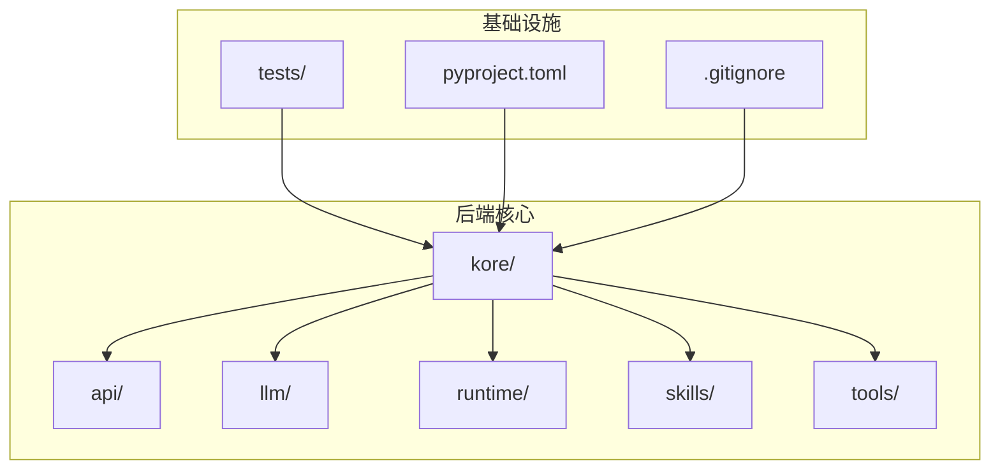
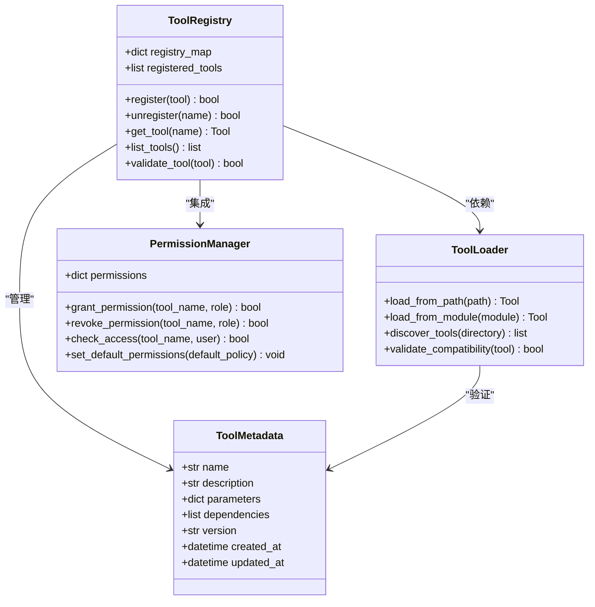
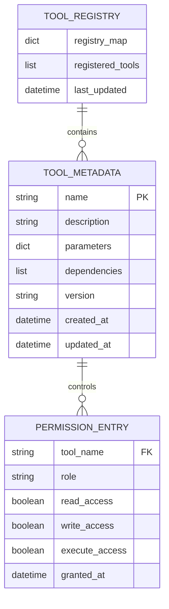
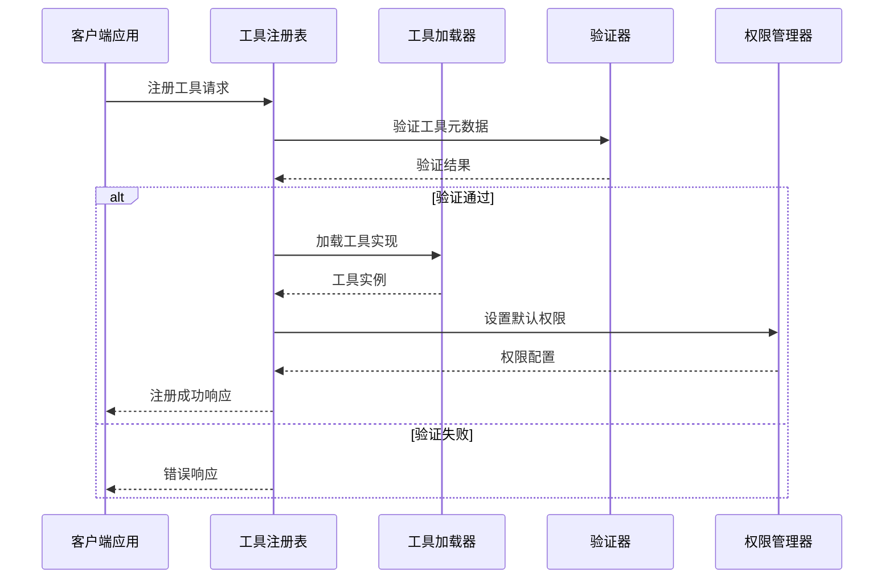
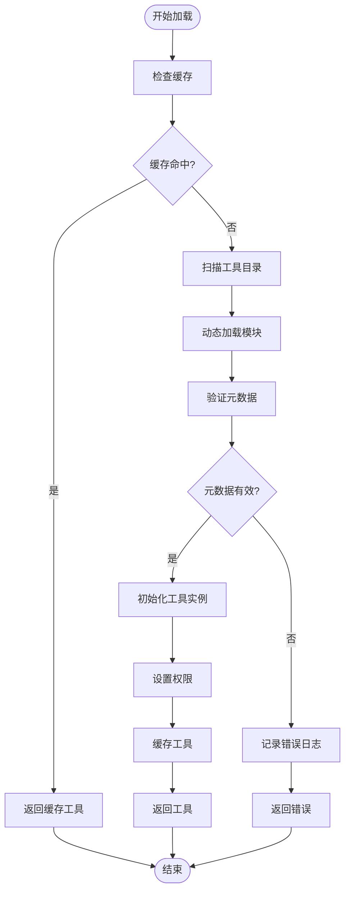
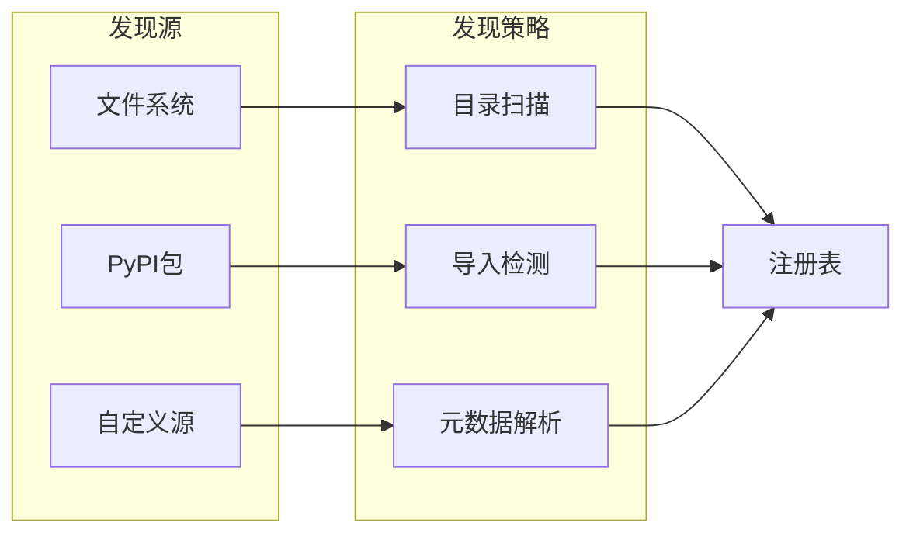
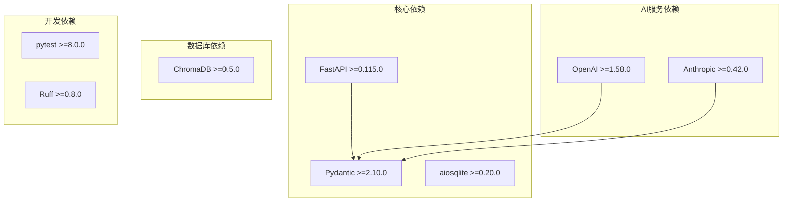
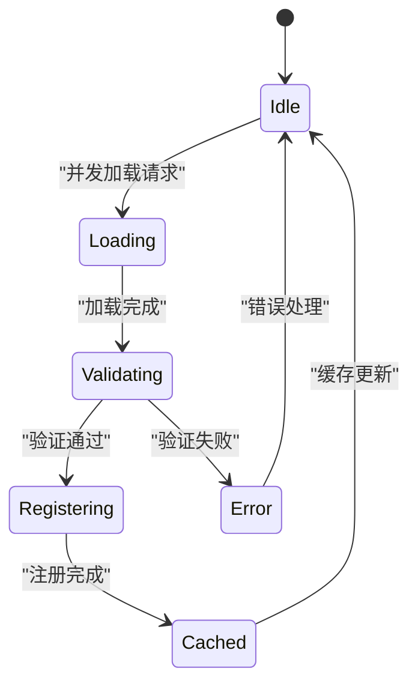
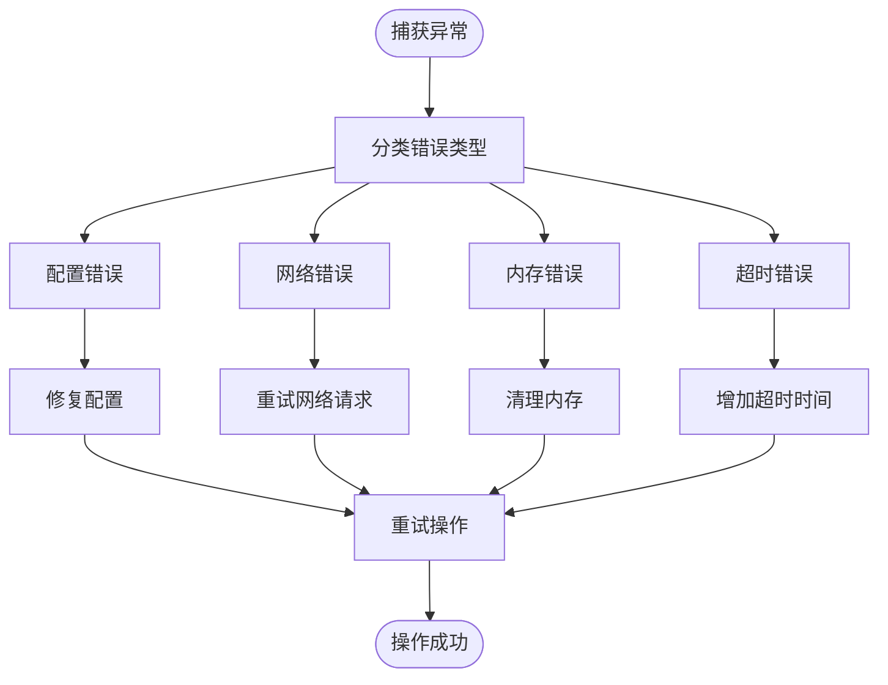

# 工具注册管理

<cite>
**本文档引用的文件**
- [pyproject.toml](file://backend/pyproject.toml)
- [.gitignore](file://.gitignore)
</cite>

## 目录
1. [简介](#简介)
2. [项目结构](#项目结构)
3. [核心组件](#核心组件)
4. [架构概览](#架构概览)
5. [详细组件分析](#详细组件分析)
6. [依赖分析](#依赖分析)
7. [性能考虑](#性能考虑)
8. [故障排除指南](#故障排除指南)
9. [结论](#结论)

## 简介

本文件为 Kore 智能体框架的工具注册管理系统提供技术文档。根据当前仓库结构分析，工具注册管理功能尚未在代码库中实现或位于未公开的分支中。本文档基于现有项目配置和依赖信息，对工具注册管理系统的预期架构、实现模式和最佳实践进行系统性说明，为后续功能开发提供指导。

## 项目结构

基于当前仓库结构，Kore 项目采用模块化组织方式，主要目录包括：

**图表来源**
- [pyproject.toml:1-34](file://backend/pyproject.toml#L1-L34)
- [.gitignore:1-30](file://.gitignore#L1-L30)

**章节来源**
- [pyproject.toml:1-34](file://backend/pyproject.toml#L1-L34)
- [.gitignore:1-30](file://.gitignore#L1-L30)

## 核心组件

### 工具注册系统架构设计

工具注册管理系统应包含以下核心组件：

### 预期的数据结构

工具注册系统的核心数据结构设计：

**章节来源**
- [pyproject.toml:6-19](file://backend/pyproject.toml#L6-L19)

## 架构概览

### 工具注册生命周期

### 动态工具加载机制

## 详细组件分析

### 工具注册表实现

工具注册表作为核心组件，负责维护工具的完整生命周期：

#### 注册流程
1. **输入验证**：验证工具名称唯一性和元数据完整性
2. **依赖检查**：确保所有依赖项可用且版本兼容
3. **权限分配**：为新工具设置默认访问权限
4. **缓存更新**：更新内存缓存和持久化存储

#### 注销处理
1. **权限回收**：撤销所有用户对该工具的访问权限
2. **实例清理**：销毁活跃的工具实例
3. **缓存清理**：从缓存中移除相关条目
4. **依赖释放**：解除与其他工具的依赖关系

### 工具元数据管理

工具元数据包含以下关键信息：

| 元数据字段 | 类型 | 描述 | 必填 |
|------------|------|------|------|
| name | string | 工具唯一标识符 | 是 |
| description | string | 工具功能描述 | 是 |
| parameters | dict | 参数定义和约束 | 是 |
| dependencies | list | 依赖的其他工具 | 否 |
| version | string | 版本号 | 是 |
| created_at | datetime | 创建时间 | 是 |
| updated_at | datetime | 更新时间 | 是 |

### 工具发现机制

动态工具发现支持多种发现方式：

## 依赖分析

### 外部依赖关系

基于项目配置，工具注册系统需要以下外部依赖：

**图表来源**
- [pyproject.toml:6-19](file://backend/pyproject.toml#L6-L19)

**章节来源**
- [pyproject.toml:6-19](file://backend/pyproject.toml#L6-L19)

## 性能考虑

### 缓存策略

为提高工具加载性能，建议实施多层缓存：

1. **内存缓存**：缓存已加载的工具实例
2. **磁盘缓存**：持久化工具元数据和配置
3. **网络缓存**：缓存远程依赖的下载内容

### 并发处理

工具注册系统应支持并发操作：

## 故障排除指南

### 常见错误类型

| 错误类型 | 触发条件 | 解决方案 |
|----------|----------|----------|
| 注册失败 | 工具元数据无效 | 检查工具描述和参数定义 |
| 加载超时 | 远程依赖下载失败 | 检查网络连接和代理设置 |
| 权限拒绝 | 用户无访问权限 | 验证用户角色和权限配置 |
| 内存溢出 | 工具实例过多 | 实施实例池和垃圾回收 |

### 异常恢复机制

## 结论

基于当前仓库分析，Kore 智能体框架的工具注册管理系统仍处于设计阶段。本文档提供了完整的架构设计方案，包括注册表实现、元数据管理、动态加载机制和权限控制等核心功能。建议按照以下优先级实现：

1. **基础架构**：实现工具注册表和元数据管理
2. **加载机制**：建立动态工具发现和加载系统
3. **权限控制**：集成访问权限管理功能
4. **性能优化**：实施缓存和并发处理策略
5. **监控告警**：建立完整的错误处理和恢复机制

该设计遵循模块化原则，具有良好的扩展性和维护性，能够满足 Kore 框架对智能体工具管理的需求。