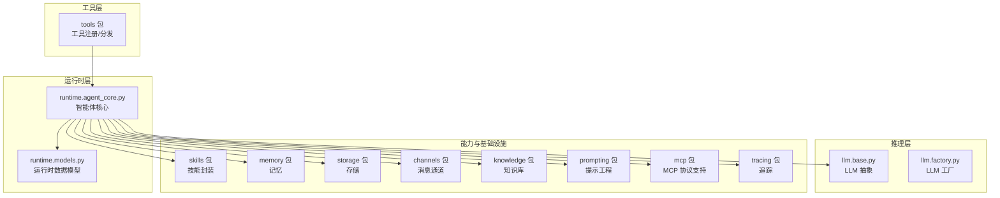
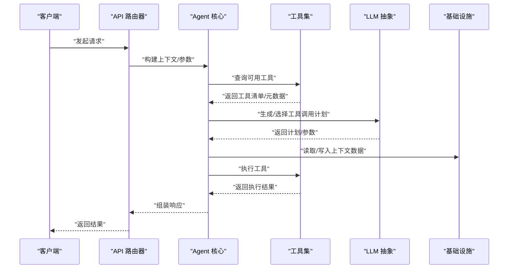
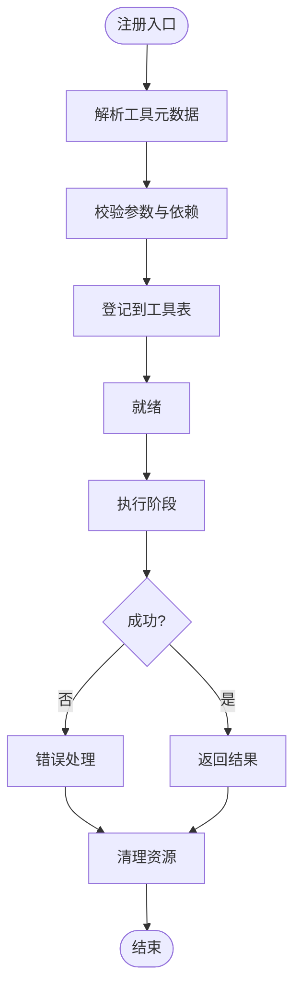
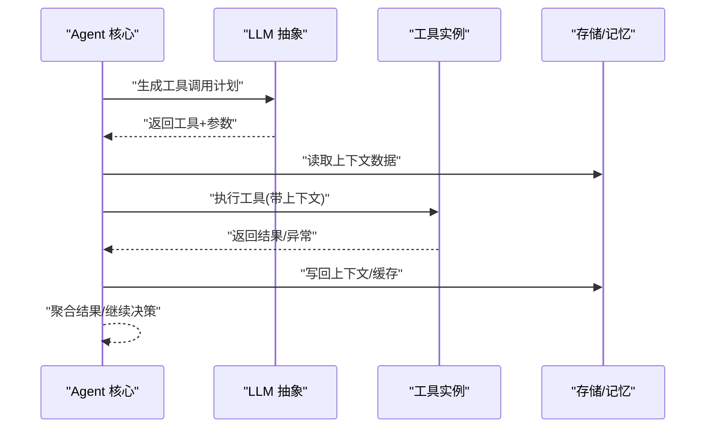
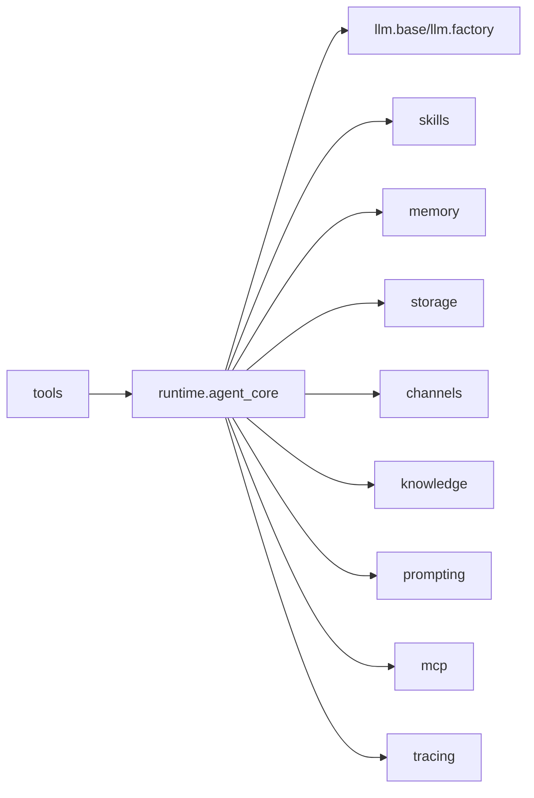

# 工具集系统

<cite>
**本文档引用的文件**
- [backend/kore/tools/__init__.py](file://backend/kore/tools/__init__.py)
- [backend/kore/api/router.py](file://backend/kore/api/router.py)
- [backend/kore/llm/base.py](file://backend/kore/llm/base.py)
- [backend/kore/llm/factory.py](file://backend/kore/llm/factory.py)
- [backend/kore/runtime/agent_core.py](file://backend/kore/runtime/agent_core.py)
- [backend/kore/runtime/models.py](file://backend/kore/runtime/models.py)
- [backend/kore/skills/__init__.py](file://backend/kore/skills/__init__.py)
- [backend/kore/memory/__init__.py](file://backend/kore/memory/__init__.py)
- [backend/kore/storage/__init__.py](file://backend/kore/storage/__init__.py)
- [backend/kore/channels/__init__.py](file://backend/kore/channels/__init__.py)
- [backend/kore/knowledge/__init__.py](file://backend/kore/knowledge/__init__.py)
- [backend/kore/prompting/__init__.py](file://backend/kore/prompting/__init__.py)
- [backend/kore/mcp/__init__.py](file://backend/kore/mcp/__init__.py)
- [backend/kore/tracing/__init__.py](file://backend/kore/tracing/__init__.py)
- [backend/pyproject.toml](file://backend/pyproject.toml)
</cite>

## 目录
1. [简介](#简介)
2. [项目结构](#项目结构)
3. [核心组件](#核心组件)
4. [架构总览](#架构总览)
5. [详细组件分析](#详细组件分析)
6. [依赖分析](#依赖分析)
7. [性能考虑](#性能考虑)
8. [故障排查指南](#故障排查指南)
9. [结论](#结论)
10. [附录](#附录)

## 简介
本文件面向 Kore 智能体框架的“工具集系统”，系统性阐述工具的架构设计、注册机制、执行流程与生命周期管理；解析工具分类与组织方式；给出工具开发指南（接口定义、实现规范、测试方法）；说明上下文管理与参数传递机制；记录工具组合与链式调用的实现思路；提供自定义工具开发示例与最佳实践；并覆盖版本管理与兼容性策略。

当前仓库中工具集系统的核心入口位于 tools 包，配合运行时（runtime）、LLM 抽象层（llm）、技能（skills）等模块协同工作。由于部分文件在当前快照中为空或未提供内容，本文在缺少具体实现细节的情况下，仍基于现有文件与模块命名进行概念性架构说明，并提供可落地的开发与集成建议。

## 项目结构
Kore 后端采用按功能域划分的模块化组织方式，工具集系统作为智能体能力扩展的核心，主要通过以下模块协同：
- tools：工具注册与分发入口
- runtime：智能体核心运行时（Agent Core）、模型与状态管理
- llm：大语言模型抽象与工厂
- skills：技能封装与编排
- memory、storage、channels、knowledge、prompting、mcp、tracing：支撑工具执行的基础设施与能力

图表来源
- [backend/kore/tools/__init__.py](file://backend/kore/tools/__init__.py)
- [backend/kore/runtime/agent_core.py](file://backend/kore/runtime/agent_core.py)
- [backend/kore/runtime/models.py](file://backend/kore/runtime/models.py)
- [backend/kore/llm/base.py](file://backend/kore/llm/base.py)
- [backend/kore/llm/factory.py](file://backend/kore/llm/factory.py)
- [backend/kore/skills/__init__.py](file://backend/kore/skills/__init__.py)
- [backend/kore/memory/__init__.py](file://backend/kore/memory/__init__.py)
- [backend/kore/storage/__init__.py](file://backend/kore/storage/__init__.py)
- [backend/kore/channels/__init__.py](file://backend/kore/channels/__init__.py)
- [backend/kore/knowledge/__init__.py](file://backend/kore/knowledge/__init__.py)
- [backend/kore/prompting/__init__.py](file://backend/kore/prompting/__init__.py)
- [backend/kore/mcp/__init__.py](file://backend/kore/mcp/__init__.py)
- [backend/kore/tracing/__init__.py](file://backend/kore/tracing/__init__.py)

章节来源
- [backend/kore/tools/__init__.py](file://backend/kore/tools/__init__.py)
- [backend/kore/runtime/agent_core.py](file://backend/kore/runtime/agent_core.py)
- [backend/kore/llm/base.py](file://backend/kore/llm/base.py)
- [backend/kore/llm/factory.py](file://backend/kore/llm/factory.py)

## 核心组件
- 工具注册与分发（tools）
  - 职责：集中注册各类工具，提供统一的查询与调用接口；维护工具清单与元数据；支持工具启用/禁用与优先级排序。
  - 入口：tools/__init__.py 提供工具注册函数与工具集合访问器。
- 运行时核心（runtime.agent_core.py）
  - 职责：承载智能体生命周期，调度工具执行，协调上下文与状态；负责工具选择策略与执行编排。
  - 关键点：与 LLM、Memory、Storage、Skills 等模块交互。
- LLM 抽象与工厂（llm.base.py、llm.factory.py）
  - 职责：统一不同推理后端的接口；根据配置动态创建推理实例；为工具执行提供上下文注入与提示模板。
- 技能（skills）
  - 职责：对工具进行更高层的封装与组合，形成可复用的“技能”单元，便于链式调用与条件编排。
- 基础设施（memory、storage、channels、knowledge、prompting、mcp、tracing）
  - 职责：为工具执行提供上下文数据、持久化能力、消息通道、知识检索、提示模板、MCP 协议与可观测性支持。

章节来源
- [backend/kore/tools/__init__.py](file://backend/kore/tools/__init__.py)
- [backend/kore/runtime/agent_core.py](file://backend/kore/runtime/agent_core.py)
- [backend/kore/llm/base.py](file://backend/kore/llm/base.py)
- [backend/kore/llm/factory.py](file://backend/kore/llm/factory.py)
- [backend/kore/skills/__init__.py](file://backend/kore/skills/__init__.py)

## 架构总览
工具集系统围绕“工具注册—运行时调度—推理与上下文—基础设施支撑”的主干路径展开。下图展示从 API 请求到工具执行的关键交互：

图表来源
- [backend/kore/api/router.py](file://backend/kore/api/router.py)
- [backend/kore/runtime/agent_core.py](file://backend/kore/runtime/agent_core.py)
- [backend/kore/llm/base.py](file://backend/kore/llm/base.py)
- [backend/kore/tools/__init__.py](file://backend/kore/tools/__init__.py)
- [backend/kore/memory/__init__.py](file://backend/kore/memory/__init__.py)
- [backend/kore/storage/__init__.py](file://backend/kore/storage/__init__.py)
- [backend/kore/channels/__init__.py](file://backend/kore/channels/__init__.py)
- [backend/kore/knowledge/__init__.py](file://backend/kore/knowledge/__init__.py)
- [backend/kore/prompting/__init__.py](file://backend/kore/prompting/__init__.py)
- [backend/kore/mcp/__init__.py](file://backend/kore/mcp/__init__.py)
- [backend/kore/tracing/__init__.py](file://backend/kore/tracing/__init__.py)

## 详细组件分析

### 工具注册与生命周期
- 注册机制
  - 在 tools/__init__.py 中提供注册函数，接收工具描述（名称、类型、参数约束、权限等），并登记到全局工具表。
  - 支持工具分类标签（如“检索”、“计算”、“通信”），便于运行时按需筛选。
- 生命周期管理
  - 初始化：加载工具配置，建立连接或准备资源。
  - 执行：接收上下文参数，执行工具逻辑，返回结果或异常。
  - 销毁：释放资源，清理缓存或会话。
- 元数据与版本
  - 工具元数据包含版本号、兼容性范围、依赖项、变更日志链接等，用于版本管理与兼容性校验。

图表来源
- [backend/kore/tools/__init__.py](file://backend/kore/tools/__init__.py)

章节来源
- [backend/kore/tools/__init__.py](file://backend/kore/tools/__init__.py)

### 工具执行流程与上下文管理
- 上下文注入
  - Agent 核心从请求中提取上下文（用户信息、历史对话、时间戳、设备信息等），并通过 LLM 抽象将其注入到工具调用计划中。
- 参数传递
  - 工具参数遵循预定义 Schema，支持必填/可选字段、默认值、类型校验与范围限制；运行时对参数进行序列化/反序列化与安全校验。
- 执行编排
  - Agent 核心根据工具类型与上下文，选择合适工具并决定并发/串行执行；必要时调用 Skills 对多个工具进行组合。

图表来源
- [backend/kore/runtime/agent_core.py](file://backend/kore/runtime/agent_core.py)
- [backend/kore/llm/base.py](file://backend/kore/llm/base.py)
- [backend/kore/tools/__init__.py](file://backend/kore/tools/__init__.py)
- [backend/kore/memory/__init__.py](file://backend/kore/memory/__init__.py)
- [backend/kore/storage/__init__.py](file://backend/kore/storage/__init__.py)

章节来源
- [backend/kore/runtime/agent_core.py](file://backend/kore/runtime/agent_core.py)
- [backend/kore/llm/base.py](file://backend/kore/llm/base.py)

### 工具分类与组织方式
- 分类维度
  - 功能域：检索、计算、通信、文件操作、系统集成等。
  - 安全等级：高/中/低，影响权限控制与沙箱策略。
  - 性能特征：CPU 密集、IO 密集、延迟敏感度。
- 组织策略
  - 按包/模块隔离不同类别的工具，便于独立开发、测试与部署。
  - 使用统一的工具接口协议，确保不同类别工具具备一致的调用体验。

章节来源
- [backend/kore/tools/__init__.py](file://backend/kore/tools/__init__.py)

### 内置工具与使用场景
- 检索类工具
  - 场景：知识问答、文档检索、外部数据库查询。
  - 特性：支持关键词/向量检索、结果过滤与去重。
- 计算类工具
  - 场景：数值计算、公式求解、统计分析。
  - 特性：参数校验严格、结果缓存、错误边界清晰。
- 通信类工具
  - 场景：消息推送、邮件发送、Webhook 回调。
  - 特性：异步执行、重试与幂等、鉴权与签名。
- 文件/系统类工具
  - 场景：文件上传/下载、目录扫描、进程调用。
  - 特性：沙箱隔离、大小限制、权限控制。

章节来源
- [backend/kore/tools/__init__.py](file://backend/kore/tools/__init__.py)

### 工具开发指南
- 接口定义
  - 工具应实现统一的接口协议，包含：工具标识、输入 Schema、输出 Schema、执行函数、元数据（版本、依赖、变更日志）。
- 实现规范
  - 参数校验：在进入业务逻辑前完成类型与范围校验。
  - 异常处理：抛出明确的错误码与可读消息，避免泄露内部细节。
  - 幂等性：对可重复执行的操作保证幂等，支持重试。
  - 日志与追踪：记录关键步骤与耗时，便于问题定位。
- 测试方法
  - 单元测试：覆盖正常路径、边界条件与异常分支。
  - 集成测试：模拟 Agent 核心与 LLM 的协作，验证端到端流程。
  - 压力测试：评估工具在高并发下的稳定性与资源占用。

章节来源
- [backend/kore/tools/__init__.py](file://backend/kore/tools/__init__.py)
- [backend/kore/runtime/agent_core.py](file://backend/kore/runtime/agent_core.py)
- [backend/kore/llm/base.py](file://backend/kore/llm/base.py)

### 工具组合与链式调用
- 组合策略
  - 条件分支：根据上下文选择不同工具路径。
  - 顺序执行：前一个工具的输出作为下一个工具的输入。
  - 并行执行：多个工具并行运行，最后合并结果。
- 技能封装
  - 将常用工具组合封装为“技能”，提供更高层的语义接口，简化调用方复杂度。
- 可观测性
  - 记录每个工具的执行轨迹、耗时与依赖关系，便于性能分析与问题回溯。

章节来源
- [backend/kore/skills/__init__.py](file://backend/kore/skills/__init__.py)
- [backend/kore/runtime/agent_core.py](file://backend/kore/runtime/agent_core.py)

### 自定义工具开发示例（实现模式）
- 模式一：纯函数式工具
  - 输入为结构化参数，输出为结构化结果；适合无状态、可缓存的计算类工具。
- 模式二：有状态工具
  - 维护会话或连接，适合长链路通信或文件处理工具。
- 模式三：事件驱动工具
  - 基于回调或订阅机制，适合消息通道与外部系统集成。
- 模式四：批处理工具
  - 支持批量输入与分片处理，适合大数据量的检索或转换任务。

章节来源
- [backend/kore/tools/__init__.py](file://backend/kore/tools/__init__.py)

### 版本管理与兼容性
- 版本策略
  - 语义化版本：工具版本号遵循主版本.次版本.修订号，重大变更提升主版本。
  - 兼容性声明：在元数据中标注最低兼容 LLM/运行时版本。
- 升级与回滚
  - 发布前进行灰度验证；失败时快速回滚至上一稳定版本。
- 元数据与迁移
  - 记录参数字段变更、默认值调整与废弃字段，提供迁移脚本或自动适配。

章节来源
- [backend/kore/tools/__init__.py](file://backend/kore/tools/__init__.py)

## 依赖分析
- 模块耦合
  - tools 与 runtime 存在直接耦合：工具注册与执行由 Agent 核心协调。
  - runtime 与 llm 存在直接耦合：推理计划由 LLM 抽象生成。
  - runtime 与其他基础设施松耦合：通过统一接口访问，降低耦合度。
- 外部依赖
  - LLM 后端可插拔，通过工厂模式创建；推理配置可热更新。
  - 存储与记忆通过抽象接口对接，支持多种实现（内存/磁盘/云存储）。

图表来源
- [backend/kore/tools/__init__.py](file://backend/kore/tools/__init__.py)
- [backend/kore/runtime/agent_core.py](file://backend/kore/runtime/agent_core.py)
- [backend/kore/llm/base.py](file://backend/kore/llm/base.py)
- [backend/kore/llm/factory.py](file://backend/kore/llm/factory.py)
- [backend/kore/skills/__init__.py](file://backend/kore/skills/__init__.py)
- [backend/kore/memory/__init__.py](file://backend/kore/memory/__init__.py)
- [backend/kore/storage/__init__.py](file://backend/kore/storage/__init__.py)
- [backend/kore/channels/__init__.py](file://backend/kore/channels/__init__.py)
- [backend/kore/knowledge/__init__.py](file://backend/kore/knowledge/__init__.py)
- [backend/kore/prompting/__init__.py](file://backend/kore/prompting/__init__.py)
- [backend/kore/mcp/__init__.py](file://backend/kore/mcp/__init__.py)
- [backend/kore/tracing/__init__.py](file://backend/kore/tracing/__init__.py)

章节来源
- [backend/kore/tools/__init__.py](file://backend/kore/tools/__init__.py)
- [backend/kore/runtime/agent_core.py](file://backend/kore/runtime/agent_core.py)
- [backend/kore/llm/base.py](file://backend/kore/llm/base.py)
- [backend/kore/llm/factory.py](file://backend/kore/llm/factory.py)

## 性能考虑
- 工具执行优化
  - 结果缓存：对相同输入的结果进行缓存，减少重复计算。
  - 并发调度：对无共享状态的工具采用并发执行，提高吞吐。
  - 资源池：对数据库/网络连接等资源进行池化管理。
- 上下文压缩
  - 对长文本进行摘要或截断，避免上下文超限。
- LLM 调度
  - 通过提示模板与上下文注入，减少不必要的 token 消耗。
- 监控与告警
  - 关键指标：工具执行耗时、成功率、资源占用、错误率阈值告警。

## 故障排查指南
- 常见问题
  - 工具未注册：检查 tools 的注册入口是否被正确调用。
  - 参数校验失败：核对输入 Schema 与调用参数，确认必填字段与类型。
  - 执行超时：检查工具内部阻塞点，优化 IO 或引入异步执行。
  - 权限不足：核对工具的安全等级与运行环境权限。
- 排查步骤
  - 开启追踪日志，定位工具执行链路。
  - 检查存储/记忆读写是否异常。
  - 验证 LLM 输出的工具调用计划是否合理。
- 回滚与恢复
  - 快速回滚至上一稳定版本。
  - 清理缓存与临时文件，重启相关服务。

章节来源
- [backend/kore/tools/__init__.py](file://backend/kore/tools/__init__.py)
- [backend/kore/runtime/agent_core.py](file://backend/kore/runtime/agent_core.py)
- [backend/kore/tracing/__init__.py](file://backend/kore/tracing/__init__.py)

## 结论
Kore 的工具集系统以“注册—调度—执行—反馈”为主线，结合 LLM 抽象与多维基础设施，形成可扩展、可观测、可演进的工具生态。通过标准化接口、严格的参数与版本管理、以及完善的测试与监控体系，能够支撑从简单工具到复杂技能的全栈能力构建。

## 附录
- 项目配置参考
  - 依赖与版本：参考 backend/pyproject.toml 中的依赖声明与版本约束。
- API 路由参考
  - 请求入口与参数映射：参考 backend/kore/api/router.py 的路由定义与中间件。

章节来源
- [backend/pyproject.toml](file://backend/pyproject.toml)
- [backend/kore/api/router.py](file://backend/kore/api/router.py)