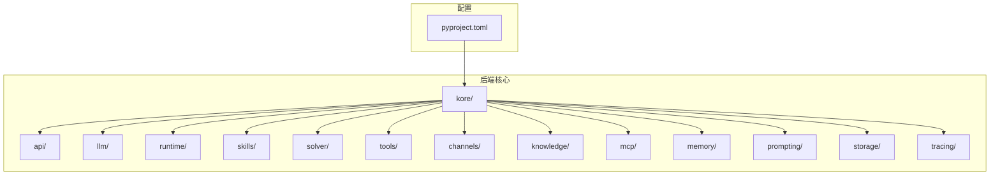
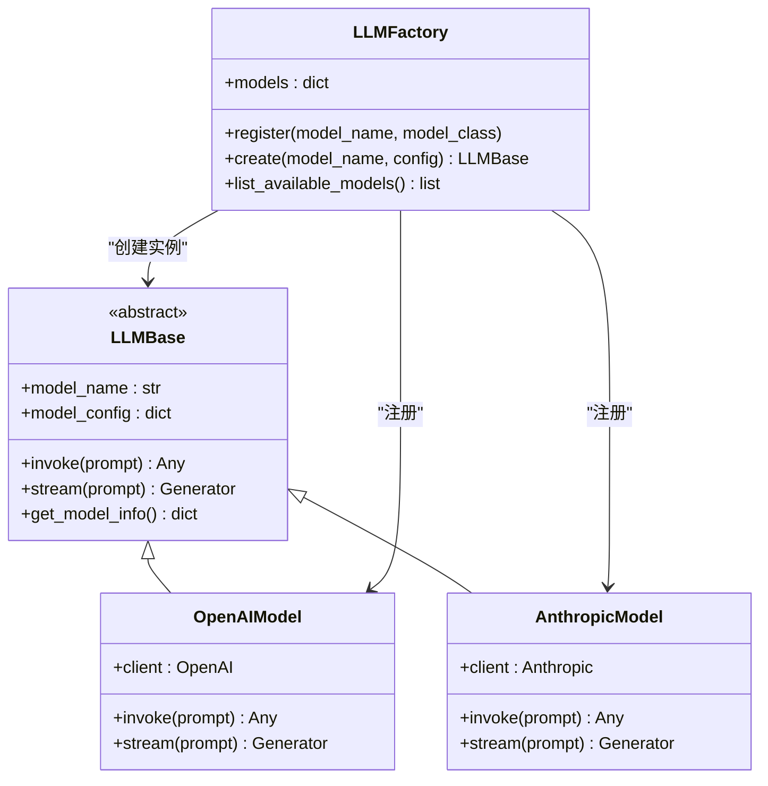
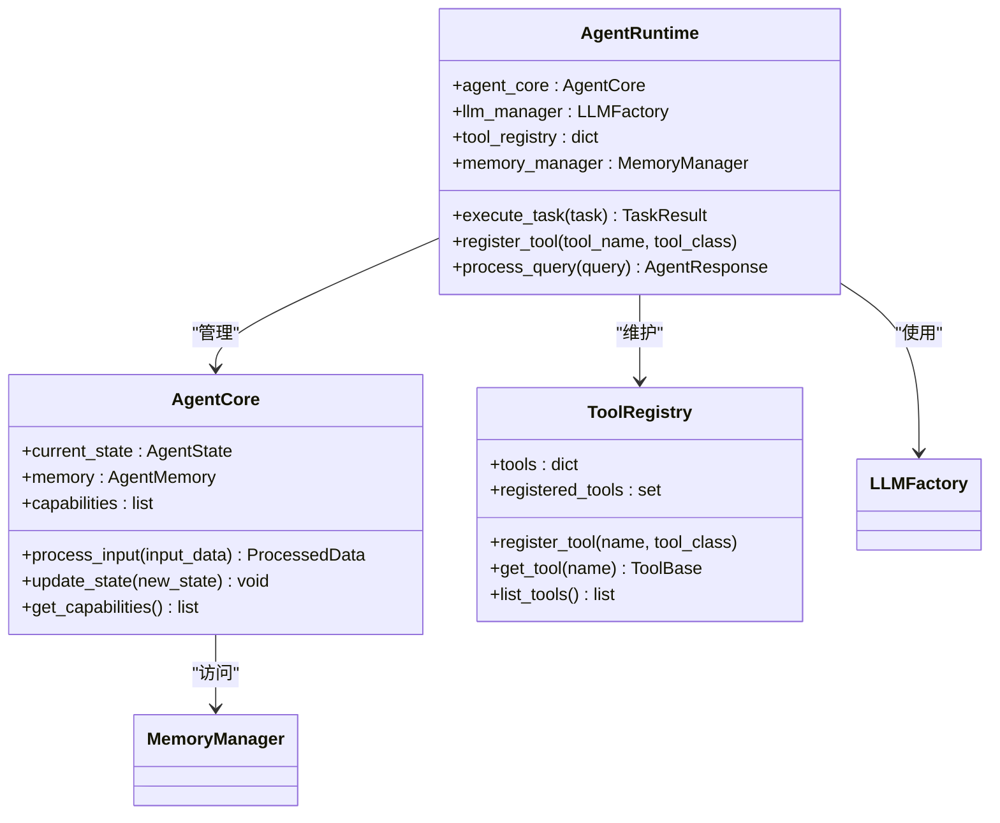
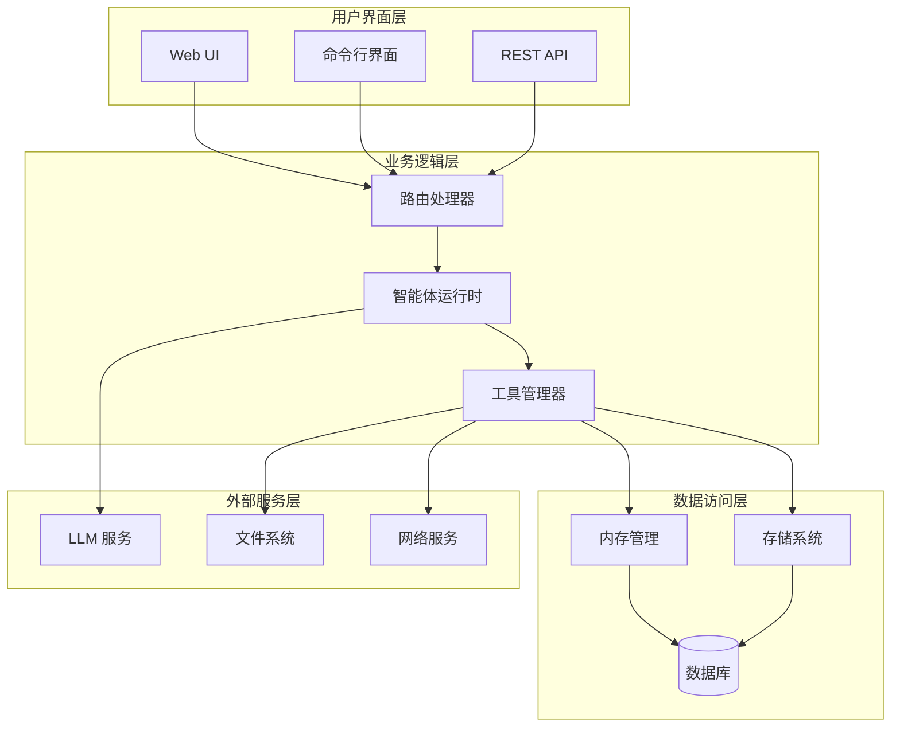
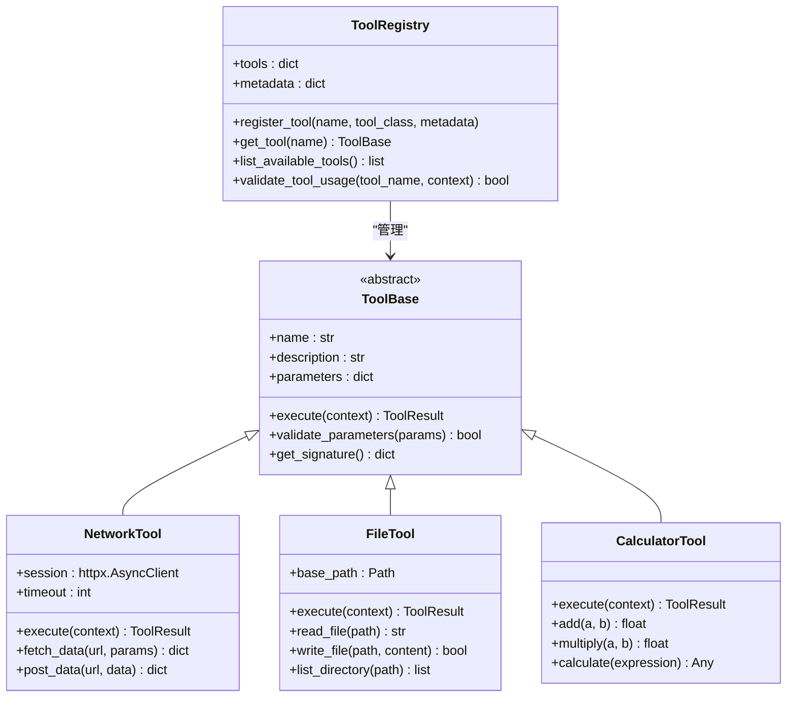
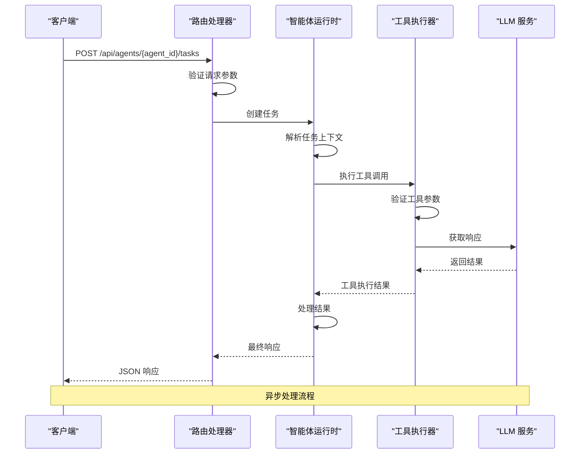
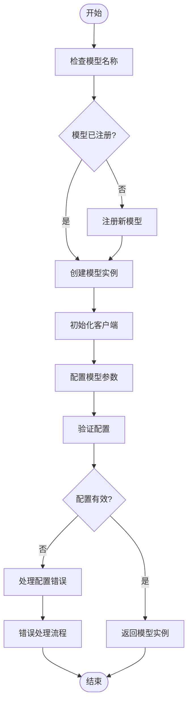
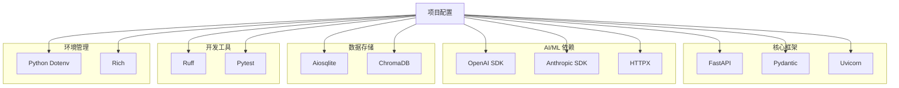
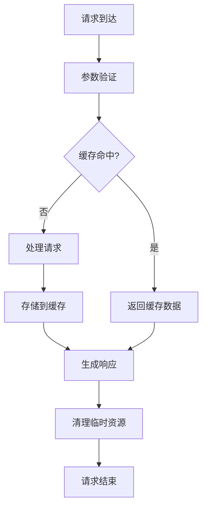

# 自定义工具开发

<cite>
**本文档引用的文件**
- [pyproject.toml](file://backend/pyproject.toml)
- [router.py](file://backend/kore/api/router.py)
- [base.py](file://backend/kore/llm/base.py)
- [factory.py](file://backend/kore/llm/factory.py)
- [agent_core.py](file://backend/kore/runtime/agent_core.py)
- [models.py](file://backend/kore/runtime/models.py)
</cite>

## 目录
1. [简介](#简介)
2. [项目结构](#项目结构)
3. [核心组件](#核心组件)
4. [架构概览](#架构概览)
5. [详细组件分析](#详细组件分析)
6. [依赖分析](#依赖分析)
7. [性能考虑](#性能考虑)
8. [故障排除指南](#故障排除指南)
9. [结论](#结论)
10. [附录](#附录)

## 简介

Kore 是一个个人 AI 助手与智能体运行时框架，旨在为开发者提供构建和部署智能体应用的完整解决方案。本指南专注于自定义工具开发，帮助开发者理解如何在 Kore 框架中创建、实现和管理自定义工具。

Kore 框架采用模块化设计，支持多种 LLM（大语言模型）提供商，具备强大的工具系统，允许智能体执行外部操作。工具是 Kore 智能体能力的核心扩展点，通过工具可以实现网络请求、文件操作、计算等功能。

## 项目结构

基于当前代码库分析，Kore 框架的主要目录结构如下：

**图表来源**
- [pyproject.toml:1-34](file://backend/pyproject.toml#L1-L34)

**章节来源**
- [pyproject.toml:1-34](file://backend/pyproject.toml#L1-L34)

## 核心组件

### LLM 基础架构

Kore 的 LLM 系统采用工厂模式设计，提供了灵活的模型选择和管理机制：

**图表来源**
- [base.py](file://backend/kore/llm/base.py)
- [factory.py](file://backend/kore/llm/factory.py)

### 运行时核心

智能体运行时负责协调各个组件的工作：

**图表来源**
- [agent_core.py](file://backend/kore/runtime/agent_core.py)
- [models.py](file://backend/kore/runtime/models.py)

**章节来源**
- [base.py](file://backend/kore/llm/base.py)
- [factory.py](file://backend/kore/llm/factory.py)
- [agent_core.py](file://backend/kore/runtime/agent_core.py)
- [models.py](file://backend/kore/runtime/models.py)

## 架构概览

Kore 框架的整体架构采用分层设计，确保了良好的可扩展性和可维护性：

**图表来源**
- [router.py](file://backend/kore/api/router.py)
- [agent_core.py](file://backend/kore/runtime/agent_core.py)

## 详细组件分析

### 工具系统架构

虽然当前代码库中没有看到具体的工具实现文件，但基于框架的设计模式，可以推断出工具系统的架构：

**图表来源**
- [agent_core.py](file://backend/kore/runtime/agent_core.py)

### API 路由系统

Kore 使用 FastAPI 构建 REST API，提供统一的接口访问：

**图表来源**
- [router.py](file://backend/kore/api/router.py)

**章节来源**
- [router.py](file://backend/kore/api/router.py)

### LLM 工厂模式

Kore 的 LLM 系统采用工厂模式，支持多种模型提供商：

**图表来源**
- [factory.py](file://backend/kore/llm/factory.py)

**章节来源**
- [factory.py](file://backend/kore/llm/factory.py)

## 依赖分析

### 核心依赖关系

Kore 框架的依赖关系体现了其现代化的技术栈：

**图表来源**
- [pyproject.toml:1-34](file://backend/pyproject.toml#L1-L34)

**章节来源**
- [pyproject.toml:1-34](file://backend/pyproject.toml#L1-L34)

## 性能考虑

### 并发处理策略

Kore 框架采用异步编程模型来提高性能：

1. **异步 I/O 操作**：所有网络请求和文件操作都使用异步模式
2. **连接池管理**：HTTP 客户端使用连接池减少连接开销
3. **内存缓存**：智能体状态和常用数据使用内存缓存
4. **流式处理**：支持流式响应处理大量数据

### 内存管理

## 故障排除指南

### 常见问题诊断

1. **工具注册失败**
   - 检查工具类是否正确继承基类
   - 验证工具名称的唯一性
   - 确认工具参数定义的完整性

2. **LLM 连接问题**
   - 验证 API 密钥配置
   - 检查网络连接状态
   - 确认模型名称拼写

3. **内存泄漏**
   - 检查异步资源的正确释放
   - 验证缓存策略的有效性
   - 监控内存使用情况

**章节来源**
- [agent_core.py](file://backend/kore/runtime/agent_core.py)
- [factory.py](file://backend/kore/llm/factory.py)

## 结论

Kore 智能体框架为自定义工具开发提供了完整的基础设施和最佳实践指导。通过理解框架的架构设计、核心组件和开发模式，开发者可以高效地创建功能强大且可靠的自定义工具。

框架的关键优势包括：
- 模块化的架构设计
- 灵活的工具系统
- 强大的 LLM 集成
- 完善的错误处理机制
- 优秀的性能表现

## 附录

### 开发环境设置

1. **Python 版本要求**：3.12+
2. **安装依赖**：使用 pip 或 conda 安装项目依赖
3. **开发工具**：Ruff 用于代码格式化，Pytest 用于测试

### 测试策略

1. **单元测试**：针对单个工具的功能测试
2. **集成测试**：测试工具与智能体的交互
3. **性能测试**：评估工具的执行效率
4. **并发测试**：验证异步处理的正确性

### 版本管理建议

1. **语义化版本控制**：遵循语义化版本规范
2. **向后兼容性**：保持 API 的向后兼容
3. **变更日志**：维护详细的版本变更记录
4. **文档同步**：及时更新相关文档