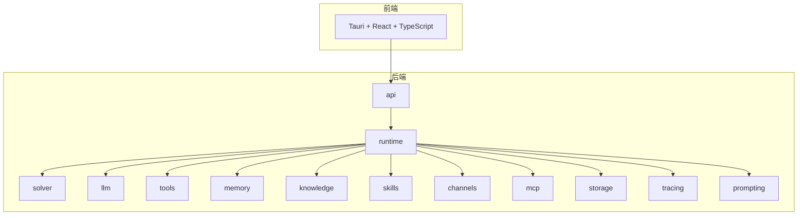
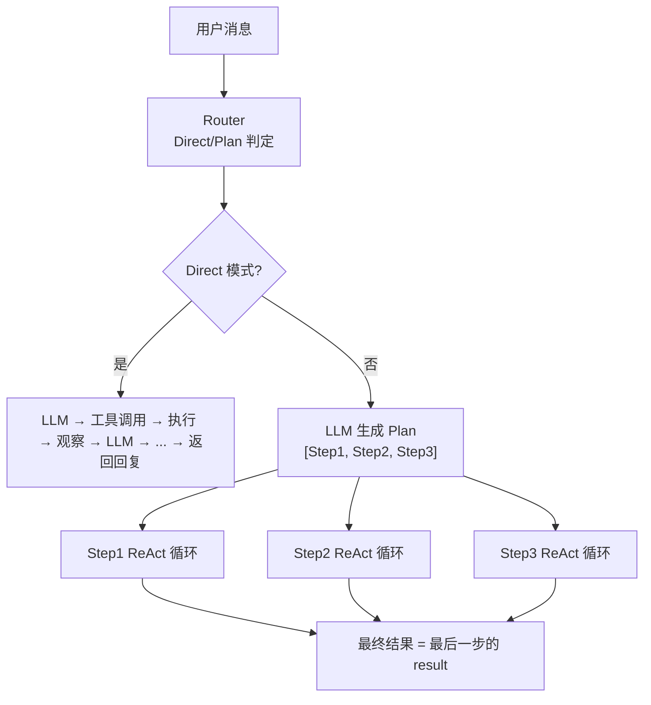
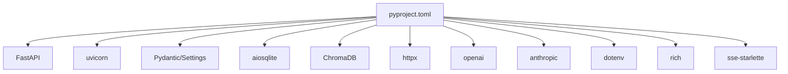

# 开发者指南

<cite>
**本文引用的文件**
- [development-progress.md](file://development-progress.md)
- [pyproject.toml](file://backend/pyproject.toml)
- [__init__.py](file://backend/kore/__init__.py)
- [api/__init__.py](file://backend/kore/api/__init__.py)
- [llm/__init__.py](file://backend/kore/llm/__init__.py)
- [runtime/__init__.py](file://backend/kore/runtime/__init__.py)
- [solver/__init__.py](file://backend/kore/solver/__init__.py)
- [tools/__init__.py](file://backend/kore/tools/__init__.py)
- [memory/__init__.py](file://backend/kore/memory/__init__.py)
- [knowledge/__init__.py](file://backend/kore/knowledge/__init__.py)
- [skills/__init__.py](file://backend/kore/skills/__init__.py)
- [channels/__init__.py](file://backend/kore/channels/__init__.py)
- [mcp/__init__.py](file://backend/kore/mcp/__init__.py)
- [storage/__init__.py](file://backend/kore/storage/__init__.py)
- [tracing/__init__.py](file://backend/kore/tracing/__init__.py)
- [prompting/__init__.py](file://backend/kore/prompting/__init__.py)
</cite>

## 目录
1. [简介](#简介)
2. [项目结构](#项目结构)
3. [核心组件](#核心组件)
4. [架构总览](#架构总览)
5. [详细组件分析](#详细组件分析)
6. [依赖分析](#依赖分析)
7. [性能考虑](#性能考虑)
8. [故障排查指南](#故障排查指南)
9. [结论](#结论)
10. [附录](#附录)

## 简介
本指南面向 Kore 智能体框架的开发者，提供从开发环境搭建、IDE 配置、调试工具到贡献流程、扩展最佳实践、性能优化与质量规范的全流程说明。Kore 是一个面向个人的本地运行智能助手与 Agent Runtime，采用 Python 后端（FastAPI）与 Tauri 前端（React + TypeScript）的技术组合，支持双模式自适应执行（Direct/Plan）、工具调用、三层记忆系统、知识库、技能系统、多渠道接入与 MCP 协议集成，并强调可观察性与单机部署。

## 项目结构
后端采用按功能域分层的模块化组织方式，主要目录如下：
- runtime：运行时核心（AgentCore、运行上下文、路由）
- solver：局部求解器（ReAct 循环）
- llm：多模型抽象层（OpenAI、Claude、DeepSeek、Qwen 等）
- tools：工具系统（注册中心、执行器、内置工具）
- memory：三层记忆系统
- knowledge：知识库（Markdown Wiki + 知识图谱）
- skills：技能系统（加载器、执行器、Hub）
- channels：多渠道接入（Web/Tauri、Telegram、微信等）
- mcp：MCP 协议集成
- storage：存储层（SQLite + ChromaDB + 文件）
- tracing：可观察性（Trace 事件流）
- prompting：Prompt 模板与构建
- api：REST API 路由
- tests：测试入口（pytest）

**图表来源**
- [development-progress.md:32-60](file://development-progress.md#L32-L60)
- [development-progress.md:64-104](file://development-progress.md#L64-L104)

**章节来源**
- [development-progress.md:64-104](file://development-progress.md#L64-L104)

## 核心组件
- 运行时核心（runtime）：负责一次“运行”的编排与调度，包含 AgentCore、RunContext、Router 等。
- 求解器（solver）：ReAct 循环的局部求解逻辑。
- LLM 抽象层（llm）：统一多模型接口，屏蔽不同供应商差异。
- 工具系统（tools）：工具注册中心、执行器与内置工具集合。
- 记忆系统（memory）：上下文、日记忆、核心记忆三层体系。
- 知识库（knowledge）：Markdown Wiki 与知识图谱。
- 技能系统（skills）：技能加载、执行与 Hub。
- 渠道（channels）：Web/Tauri、Telegram、微信等接入。
- MCP（mcp）：与外部 MCP Server 的协议集成。
- 存储（storage）：SQLite、ChromaDB、文件系统。
- 可观察性（tracing）：Trace 事件流。
- Prompting（prompting）：Prompt 模板与构建。
- API（api）：REST API 路由。

**章节来源**
- [development-progress.md:225-254](file://development-progress.md#L225-L254)

## 架构总览
Kore 的执行框架采用“双模式自适应”：根据任务复杂度选择 Direct（快捷）或 Plan（规划）模式。Direct 模式为纯 ReAct 循环；Plan 模式先生成步骤列表，再逐步执行并在每步内部进行 ReAct。所有模块通过清晰的边界解耦，便于独立替换与扩展。

**图表来源**
- [development-progress.md:227-244](file://development-progress.md#L227-L244)

## 详细组件分析

### 运行时核心（runtime）
- 职责：编排一次运行，维护 RunContext，决定 Direct/Plan 路由策略。
- 关键数据结构：RunMode、RunContext、PlanStep、Message、ToolCall、ChatResponse。
- 与求解器（solver）协作完成 ReAct 循环；与 LLM、Tools、Memory、Knowledge、Skills、Channels、MCP、Storage、Tracing、Prompting 等模块交互。

**章节来源**
- [development-progress.md:246-254](file://development-progress.md#L246-L254)

### LLM 抽象层（llm）
- 目标：统一多模型接口，屏蔽不同供应商差异。
- 建议：定义 LLMProvider 基类与 ChatResponse 结构，分别对接 OpenAI、Anthropic、DeepSeek、Qwen 等。
- 集成点：runtime 在 Direct/Plan 模式下调用 LLM 获取响应与工具调用建议。

**章节来源**
- [development-progress.md:131-136](file://development-progress.md#L131-L136)

### 工具系统（tools）
- 目标：提供工具注册中心与执行器，内置常用工具如 web_search、read_file、write_file、web_fetch、terminal 等。
- 建议：使用装饰器注册工具，统一输入输出校验与错误处理；支持异步工具执行与超时控制。

**章节来源**
- [development-progress.md:135-136](file://development-progress.md#L135-L136)
- [development-progress.md:150-153](file://development-progress.md#L150-L153)

### 记忆系统（memory）
- 目标：三层记忆（上下文、日记忆、核心记忆），支持滑动窗口与 token 预算、日记忆蒸馏、混合检索（关键词 + 向量）。
- 建议：将对话上下文、日志与核心记忆文件化，定期进行蒸馏与索引更新。

**章节来源**
- [development-progress.md:161-166](file://development-progress.md#L161-L166)

### 知识库（knowledge）
- 目标：Markdown Wiki CRUD、知识图谱数据模型与自动抽取。
- 建议：以文件系统为知识基座，结合 ChromaDB 做向量化检索，提供统一的知识查询接口。

**章节来源**
- [development-progress.md:174-177](file://development-progress.md#L174-L177)

### 技能系统（skills）
- 目标：技能 Manifest 格式、加载器、Skill Hub 客户端。
- 建议：标准化技能元数据与依赖声明，支持离线安装与版本管理。

**章节来源**
- [development-progress.md:177-179](file://development-progress.md#L177-L179)

### 渠道（channels）
- 目标：Web/Tauri、Telegram、微信等多渠道接入。
- 建议：抽象 Channel 接口，统一消息收发与事件推送（含 SSE）。

**章节来源**
- [development-progress.md:201-203](file://development-progress.md#L201-L203)

### MCP（mcp）
- 目标：连接外部 MCP Server，扩展工具与资源。
- 建议：实现 MCP 客户端协议，支持清单发现与远程工具调用。

**章节来源**
- [development-progress.md:153](file://development-progress.md#L153)

### 存储（storage）
- 目标：SQLite、ChromaDB、文件系统统一管理。
- 建议：对关键数据建立索引，保证查询性能与一致性。

**章节来源**
- [development-progress.md:214-216](file://development-progress.md#L214-L216)

### 可观察性（tracing）
- 目标：Trace 事件流，记录 Agent 的思考过程与执行轨迹。
- 建议：在关键节点写入 Trace，前端可实时消费 SSE 展示。

**章节来源**
- [development-progress.md:18-18](file://development-progress.md#L18-L18)
- [development-progress.md:204](file://development-progress.md#L204)

### Prompting（prompting）
- 目标：Prompt 模板与构建，提升提示工程复用性与一致性。
- 建议：将常见提示模板化，支持参数注入与动态拼装。

**章节来源**
- [development-progress.md:84](file://development-progress.md#L84-L84)

### API（api）
- 目标：提供 REST API 路由，如 /api/chat/send（SSE 流式）。
- 建议：遵循统一的请求/响应结构，确保与前端约定一致。

**章节来源**
- [development-progress.md:137](file://development-progress.md#L137)

## 依赖分析
后端使用 FastAPI + uvicorn 提供服务，依赖 Pydantic/Settings 管理配置，aiosqlite 与 ChromaDB 支持存储与向量检索，httpx、openai、anthropic 提供 LLM 能力，rich 与 sse-starlette 支持可观察性与流式输出。开发依赖包括 pytest、pytest-asyncio、ruff。

**图表来源**
- [pyproject.toml:1-35](file://backend/pyproject.toml#L1-L35)

**章节来源**
- [pyproject.toml:1-35](file://backend/pyproject.toml#L1-L35)

## 性能考虑
- LLM 调用优化：合理设置系统提示与上下文长度，避免不必要的 token 消耗；对工具调用进行批处理与去重。
- 存储与检索：为常用查询建立索引，使用向量检索与关键词检索混合策略；定期清理过期数据。
- 并发与异步：充分利用 asyncio 与异步数据库驱动，避免阻塞；对长耗时操作使用队列与后台任务。
- 可观察性：通过 Trace 事件流定位瓶颈，结合 SSE 实时反馈用户体验。
- 前端渲染：在前端侧对消息流进行节流与虚拟滚动，减少 DOM 压力。

## 故障排查指南
- 启动失败：检查环境变量与依赖安装，确认端口未被占用；查看 uvicorn 日志与 rich 输出。
- LLM 调用异常：核对 API Key 与网络连通性；检查模型名称与参数是否匹配 SDK 要求。
- 工具执行失败：验证工具注册与权限；捕获并记录异常堆栈；必要时增加重试与降级策略。
- 记忆与知识库：确认 SQLite 与 ChromaDB 文件路径与权限；检查索引重建与数据一致性。
- SSE 与前端：确认 CORS 配置与事件通道；在浏览器开发者工具中观察 Network 与 EventStream。

## 结论
Kore 通过清晰的模块划分与双模式执行框架，提供了可扩展、可观测且易于本地部署的智能体运行时。开发者可基于现有目录结构快速扩展 LLM 集成、工具与技能，同时遵循统一的数据结构与接口契约，确保系统的稳定性与可维护性。

## 附录

### 开发环境搭建
- Python 版本：>=3.12
- 包管理：pip/venv
- 依赖安装：使用 pyproject.toml 中的依赖与可选开发依赖
- IDE 建议：VSCode（Python 扩展、Ruff 插件、Python Docstring Generator）、PyCharm
- 调试：使用 uvicorn 启动 FastAPI 应用，配合 rich 输出与 SSE 观察事件流
- 前端：Tauri + React + TypeScript，使用 pnpm 管理 Node 依赖

**章节来源**
- [pyproject.toml:5-19](file://backend/pyproject.toml#L5-L19)
- [development-progress.md:209-222](file://development-progress.md#L209-L222)

### 代码贡献流程
- 分支管理：采用特性分支（feature/*）、修复分支（fix/*）、热修复（hotfix/*）命名规范
- 提交流程：提交前运行 ruff 格式化与 pytest 测试；编写变更说明与测试覆盖
- 代码审查：至少一名维护者审查；关注可扩展性、性能与可观察性
- 发布流程：合并主分支后打标签并发布

**章节来源**
- [pyproject.toml:21-35](file://backend/pyproject.toml#L21-L35)

### 扩展开发最佳实践
- 插件架构：通过注册中心与装饰器机制扩展工具与技能；保持接口最小化与向后兼容
- 接口设计：统一输入输出结构（如 Message、ToolCall、ChatResponse），增强契约明确性
- 向后兼容：对公共接口进行版本化管理，提供迁移指南与兼容层
- 可观察性：在关键路径写入 Trace 事件，便于问题定位与性能分析

**章节来源**
- [development-progress.md:225-254](file://development-progress.md#L225-L254)

### 性能优化与调试技巧
- 内存分析：使用 tracemalloc 或 memory_profiler 定位内存泄漏
- 性能剖析：使用 cProfile 或 py-spy 分析热点函数
- 问题定位：结合 Trace 事件流与 SSE，逐步缩小问题范围
- 前端调试：利用浏览器开发者工具的 Network 与 Console，观察事件与错误

**章节来源**
- [development-progress.md:18](file://development-progress.md#L18-L18)

### 代码规范与质量标准
- 编码风格：遵循 Ruff 配置（行长 100，Python 3.12 目标版本）
- 文档要求：为公共接口与模块补充 docstring，保持 README 与进度文档同步
- 测试覆盖率：使用 pytest 与 asyncio 模式，覆盖核心路径与边界条件

**章节来源**
- [pyproject.toml:28-35](file://backend/pyproject.toml#L28-L35)

### 实际开发示例与项目模板
- 示例：实现一个新的 LLM Provider（如 DeepSeek/OpenAI 兼容接口），在 runtime 中通过工厂或路由选择该 Provider
- 示例：新增一个工具（如 web_fetch），使用装饰器注册，实现输入校验与执行逻辑，加入内置工具集
- 示例：实现一个技能（Manifest 格式），在 skills 加载器中解析并注册，支持 Hub 安装
- 模板：参考现有模块的 __init__.py 与目录结构，新建子模块并完善 API 与测试

**章节来源**
- [development-progress.md:131-136](file://development-progress.md#L131-L136)
- [development-progress.md:150-153](file://development-progress.md#L150-L153)
- [development-progress.md:177-179](file://development-progress.md#L177-L179)