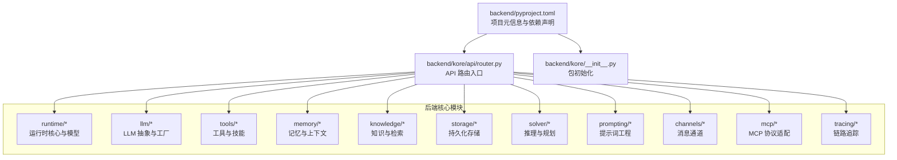
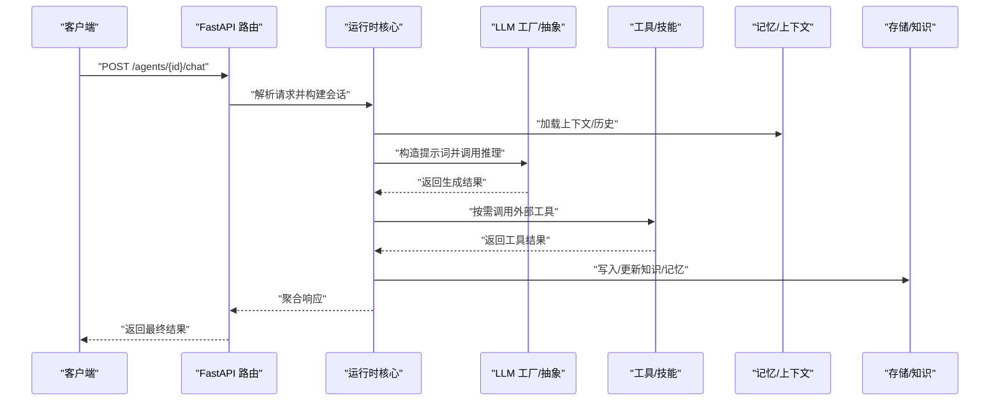
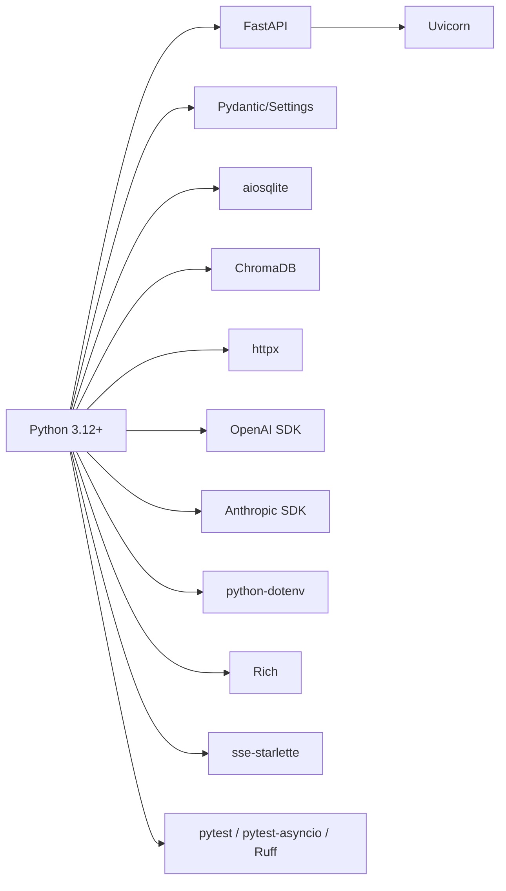
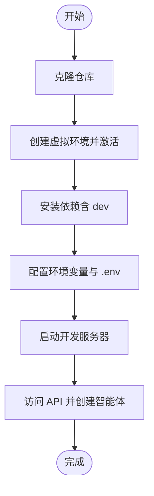

# 快速开始

<cite>
**本文引用的文件**
- [pyproject.toml](file://backend/pyproject.toml)
- [router.py](file://backend/kore/api/router.py)
- [__init__.py](file://backend/kore/__init__.py)
- [.gitignore](file://.gitignore)
</cite>

## 目录
1. [简介](#简介)
2. [项目结构](#项目结构)
3. [核心组件](#核心组件)
4. [架构总览](#架构总览)
5. [详细组件分析](#详细组件分析)
6. [依赖分析](#依赖分析)
7. [性能考虑](#性能考虑)
8. [故障排除指南](#故障排除指南)
9. [结论](#结论)
10. [附录](#附录)

## 简介
本指南面向首次接触 Kore 智能体框架的新用户，帮助你在 30 分钟内完成环境准备、依赖安装、配置设置与第一个智能体示例的启动。Kore 是一个个人 AI 助手与智能体运行时框架，采用 FastAPI 提供服务端能力，支持多种 LLM 供应商（如 OpenAI、Anthropic），并内置向量存储、工具调用、内存与知识管理等模块化能力。

## 项目结构
后端采用 Python 包结构组织，核心模块位于 backend/kore 下，包含 API 路由、LLM 抽象与工厂、运行时核心、工具与技能、存储与知识、内存与提示词等子系统。前端或示例应用可直接通过 FastAPI 启动服务进行交互。

**图表来源**
- [pyproject.toml:1-35](file://backend/pyproject.toml#L1-L35)
- [router.py](file://backend/kore/api/router.py)
- [__init__.py](file://backend/kore/__init__.py)

**章节来源**
- [pyproject.toml:1-35](file://backend/pyproject.toml#L1-L35)
- [router.py](file://backend/kore/api/router.py)
- [__init__.py](file://backend/kore/__init__.py)

## 核心组件
- 运行时核心：负责智能体生命周期管理、状态维护、任务调度与执行编排。
- LLM 抽象与工厂：统一不同 LLM 供应商的接入方式，屏蔽差异，便于切换与扩展。
- 工具与技能：封装外部能力调用（如搜索、计算、API 调用）与领域技能。
- 存储与知识：提供向量数据库集成、文档索引与检索能力。
- 内存：维护对话历史、长期记忆与上下文压缩策略。
- 提示词工程：标准化提示词模板与多轮对话格式。
- 消息通道与 MCP：支持多协议消息通道与 MCP（Model Context Protocol）适配。
- 链路追踪：记录请求链路与性能指标，便于调试与优化。

**章节来源**
- [router.py](file://backend/kore/api/router.py)

## 架构总览
Kore 的服务端通过 FastAPI 暴露 REST 接口，路由层将请求分发至运行时核心，运行时根据配置选择合适的 LLM 与工具链，结合记忆与知识模块生成响应。下图展示了从客户端到服务端再到运行时与 LLM 的典型调用序列。

**图表来源**
- [router.py](file://backend/kore/api/router.py)

## 详细组件分析

### API 路由与入口
- 路由模块负责接收客户端请求，校验参数，调用运行时核心处理，并返回结构化响应。
- 建议在本地开发时使用 Uvicorn 启动服务，监听本地端口以便调试。

**章节来源**
- [router.py](file://backend/kore/api/router.py)

### LLM 抽象与工厂
- 抽象层定义统一的模型接口，工厂层根据配置选择具体供应商（如 OpenAI、Anthropic）。
- 支持流式输出与非流式输出，便于前端实时渲染与日志记录。

**章节来源**
- [router.py](file://backend/kore/api/router.py)

### 运行时核心
- 负责智能体状态管理、任务编排、工具调用与结果聚合。
- 可扩展为多智能体协作、计划-执行循环与记忆增强。

**章节来源**
- [router.py](file://backend/kore/api/router.py)

### 工具与技能
- 封装常用外部能力，如搜索引擎、计算器、天气查询等。
- 支持自定义技能注册与动态加载。

**章节来源**
- [router.py](file://backend/kore/api/router.py)

### 存储与知识
- 集成向量数据库（如 ChromaDB），支持文档嵌入、索引与检索。
- 提供知识入库、更新与清理流程。

**章节来源**
- [router.py](file://backend/kore/api/router.py)

### 内存与提示词工程
- 维护对话历史与长期记忆，控制上下文长度与压缩策略。
- 提供标准化提示词模板，支持多轮对话与角色扮演。

**章节来源**
- [router.py](file://backend/kore/api/router.py)

### 消息通道与 MCP
- 支持 WebSocket/SSE 等消息通道，便于实时交互。
- MCP 适配器用于与外部模型上下文协议对接。

**章节来源**
- [router.py](file://backend/kore/api/router.py)

### 链路追踪
- 记录请求链路、耗时与错误，辅助定位性能瓶颈与异常。

**章节来源**
- [router.py](file://backend/kore/api/router.py)

## 依赖分析
- Python 版本：要求 Python 3.12 或更高版本。
- Web 框架：FastAPI + Uvicorn，提供高性能异步服务。
- 数据验证：Pydantic 与 Pydantic Settings，用于配置与请求体校验。
- 数据库与向量：aiosqlite（SQLite 异步驱动）、ChromaDB（向量存储）。
- HTTP 客户端：httpx，支持同步与异步请求。
- LLM 供应商：OpenAI、Anthropic SDK。
- 环境变量：python-dotenv，便于本地开发。
- 日志与终端：Rich，美化控制台输出。
- SSE：sse-starlette，支持服务器推送事件。
- 开发工具：pytest、pytest-asyncio、Ruff（代码风格与静态检查）。

**图表来源**
- [pyproject.toml:1-35](file://backend/pyproject.toml#L1-L35)

**章节来源**
- [pyproject.toml:1-35](file://backend/pyproject.toml#L1-L35)

## 性能考虑
- 使用异步 I/O 与连接池，减少阻塞。
- 对长上下文进行压缩与截断，避免超出模型上下文窗口。
- 向量检索前进行过滤与重排，提升相关性与速度。
- 合理缓存热点数据与工具调用结果。
- 在生产环境中启用 Gzip 压缩与限流策略。

[本节为通用建议，无需引用具体文件]

## 故障排除指南
- Python 版本不匹配
  - 症状：安装或运行时报错，提示需要 Python 3.12+。
  - 处理：升级 Python 至 3.12 或更高版本；使用虚拟环境隔离依赖。
- 依赖安装失败
  - 症状：pip 安装报错或版本冲突。
  - 处理：使用隔离的虚拟环境；优先使用 pip-tools 或 Poetry；必要时指定兼容版本。
- LLM SDK 配置错误
  - 症状：调用 LLM 返回鉴权失败或无响应。
  - 处理：检查环境变量中的密钥与端点；确认网络可达；查看 SDK 文档与 SDK 版本兼容性。
- 向量存储初始化失败
  - 症状：启动时报错无法连接或创建集合。
  - 处理：确认 ChromaDB 服务可用；检查权限与磁盘空间；清理损坏的数据目录后重试。
- 端口占用
  - 症状：Uvicorn 启动失败，提示端口被占用。
  - 处理：更换端口或终止占用进程。
- 控制台输出乱码
  - 症状：Rich 输出出现编码问题。
  - 处理：检查终端编码设置为 UTF-8。

**章节来源**
- [pyproject.toml:1-35](file://backend/pyproject.toml#L1-L35)

## 结论
通过本指南，你已了解 Kore 框架的核心模块、依赖关系与基本运行方式。建议先在本地完成依赖安装与最小化配置，再逐步接入 LLM 与知识库，最终部署到生产环境。后续可参考各模块源码进一步扩展功能。

[本节为总结性内容，无需引用具体文件]

## 附录

### 环境要求与依赖安装
- Python 版本：3.12+
- 安装步骤（示例）
  - 创建并激活虚拟环境
  - 安装项目依赖（含 dev 依赖）
  - 安装可选的向量化与数据库组件（如需要）
- 常用命令（示例）
  - 启动开发服务器
  - 运行测试
  - 代码风格检查

**章节来源**
- [pyproject.toml:1-35](file://backend/pyproject.toml#L1-L35)

### 配置文件与环境变量
- 环境变量
  - LLM 供应商密钥与端点
  - 数据库与向量存储地址
  - 日志级别与输出格式
- 运行时参数
  - 上下文长度、温度、最大生成长度
  - 工具开关与超时设置
- 配置加载
  - 使用 Pydantic Settings 从环境变量与 .env 文件加载

**章节来源**
- [pyproject.toml:1-35](file://backend/pyproject.toml#L1-L35)

### 项目初始化与启动
- 克隆仓库
- 安装依赖
- 设置环境变量
- 启动服务
- 访问 API 并创建第一个智能体

[本图为概念流程图，无需图表来源]

### 实际示例与命令行操作
- 示例目标：启动服务并通过 API 发送一条聊天消息，观察流式响应。
- 关键步骤
  - 启动服务（监听本地端口）
  - 使用 curl 或浏览器访问 API 端点
  - 观察 SSE 流式输出
- 注意事项
  - 确保 LLM 密钥有效
  - 如需向量检索，提前准备知识库并建立索引

**章节来源**
- [router.py](file://backend/kore/api/router.py)

### 常见问题解答
- Q：为什么我的 Python 版本不满足要求？
  - A：请升级到 Python 3.12+，并使用虚拟环境。
- Q：如何切换不同的 LLM 供应商？
  - A：通过配置项选择供应商，并提供对应密钥与端点。
- Q：如何接入本地向量数据库？
  - A：安装 ChromaDB 并配置连接参数；或使用远程服务。
- Q：如何启用调试模式？
  - A：设置日志级别为 debug，并在启动参数中开启调试模式。

**章节来源**
- [pyproject.toml:1-35](file://backend/pyproject.toml#L1-L35)