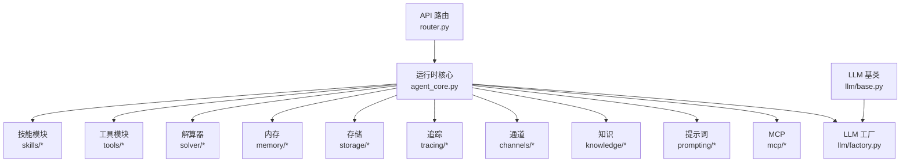
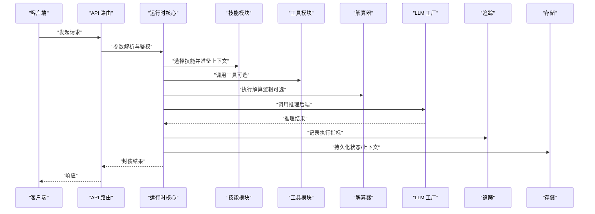
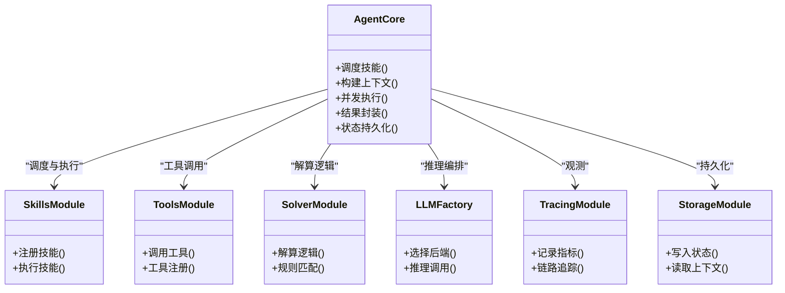
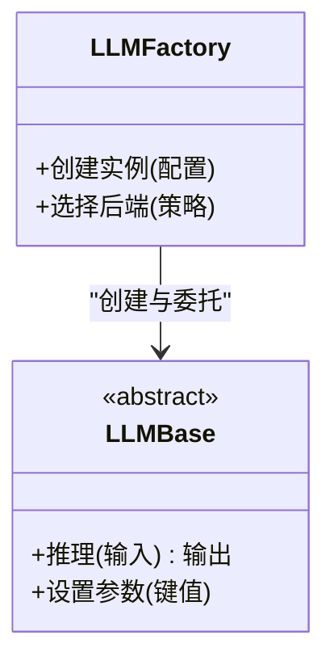
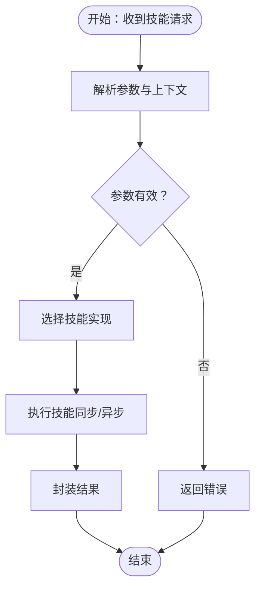
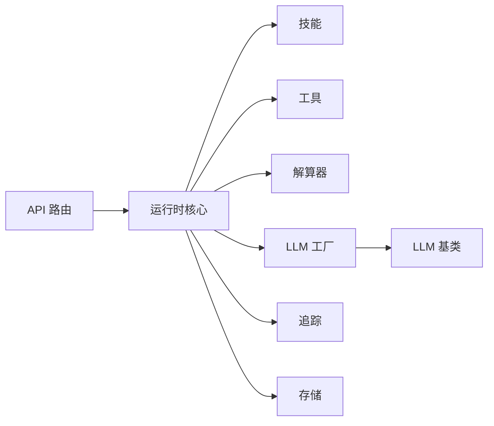

# 技能执行机制

<cite>
**本文引用的文件**
- [backend/kore/__init__.py](file://backend/kore/__init__.py)
- [backend/kore/api/router.py](file://backend/kore/api/router.py)
- [backend/kore/runtime/agent_core.py](file://backend/kore/runtime/agent_core.py)
- [backend/kore/runtime/models.py](file://backend/kore/runtime/models.py)
- [backend/kore/llm/base.py](file://backend/kore/llm/base.py)
- [backend/kore/llm/factory.py](file://backend/kore/llm/factory.py)
- [backend/kore/skills/__init__.py](file://backend/kore/skills/__init__.py)
- [backend/kore/tools/__init__.py](file://backend/kore/tools/__init__.py)
- [backend/kore/solver/__init__.py](file://backend/kore/solver/__init__.py)
- [backend/kore/memory/__init__.py](file://backend/kore/memory/__init__.py)
- [backend/kore/storage/__init__.py](file://backend/kore/storage/__init__.py)
- [backend/kore/tracing/__init__.py](file://backend/kore/tracing/__init__.py)
- [backend/kore/channels/__init__.py](file://backend/kore/channels/__init__.py)
- [backend/kore/knowledge/__init__.py](file://backend/kore/knowledge/__init__.py)
- [backend/kore/prompting/__init__.py](file://backend/kore/prompting/__init__.py)
- [backend/kore/mcp/__init__.py](file://backend/kore/mcp/__init__.py)
- [backend/pyproject.toml](file://backend/pyproject.toml)
</cite>

## 目录
1. [引言](#引言)
2. [项目结构](#项目结构)
3. [核心组件](#核心组件)
4. [架构总览](#架构总览)
5. [详细组件分析](#详细组件分析)
6. [依赖关系分析](#依赖关系分析)
7. [性能考量](#性能考量)
8. [故障排查指南](#故障排查指南)
9. [结论](#结论)
10. [附录](#附录)

## 引言
本文件围绕 Kore 智能体框架的“技能执行机制”进行系统化技术说明，聚焦以下主题：
- 技能调度与执行流程：从请求入口到具体技能执行的端到端路径
- 上下文传递与状态管理：参数解析、环境准备、结果封装与状态持久化
- 异步处理与并发：并发执行、任务队列与资源管理
- 错误处理与异常恢复：统一异常捕获、重试与降级策略
- 性能监控与优化：执行时间统计、资源消耗分析与调优建议
- 调试工具与诊断方法：日志、追踪与可观测性
- 安全控制与权限验证：访问控制、输入校验与最小权限原则
- 常见问题排查与性能调优：典型问题定位与优化实践

## 项目结构
Kore 后端采用模块化分层设计，核心执行链路涉及以下关键模块：
- API 层：对外提供路由与请求入口
- 运行时（Runtime）：智能体核心执行引擎与模型编排
- LLM 子系统：基础抽象与工厂模式选择推理后端
- 技能（Skills）：可插拔的业务能力单元
- 工具（Tools）：通用能力封装（如外部服务调用）
- 解算器（Solver）：推理与决策逻辑
- 内存（Memory）：对话与上下文记忆
- 存储（Storage）：数据持久化
- 追踪（Tracing）：可观测性与性能分析
- 通道（Channels）：消息与事件通道
- 知识（Knowledge）：知识库与检索增强
- Prompting：提示词工程
- MCP：多模态与跨协议适配

**图表来源**
- [backend/kore/api/router.py](file://backend/kore/api/router.py)
- [backend/kore/runtime/agent_core.py](file://backend/kore/runtime/agent_core.py)
- [backend/kore/llm/base.py](file://backend/kore/llm/base.py)
- [backend/kore/llm/factory.py](file://backend/kore/llm/factory.py)
- [backend/kore/skills/__init__.py](file://backend/kore/skills/__init__.py)
- [backend/kore/tools/__init__.py](file://backend/kore/tools/__init__.py)
- [backend/kore/solver/__init__.py](file://backend/kore/solver/__init__.py)
- [backend/kore/memory/__init__.py](file://backend/kore/memory/__init__.py)
- [backend/kore/storage/__init__.py](file://backend/kore/storage/__init__.py)
- [backend/kore/tracing/__init__.py](file://backend/kore/tracing/__init__.py)
- [backend/kore/channels/__init__.py](file://backend/kore/channels/__init__.py)
- [backend/kore/knowledge/__init__.py](file://backend/kore/knowledge/__init__.py)
- [backend/kore/prompting/__init__.py](file://backend/kore/prompting/__init__.py)
- [backend/kore/mcp/__init__.py](file://backend/kore/mcp/__init__.py)

**章节来源**
- [backend/kore/__init__.py](file://backend/kore/__init__.py)
- [backend/kore/api/router.py](file://backend/kore/api/router.py)
- [backend/kore/runtime/agent_core.py](file://backend/kore/runtime/agent_core.py)
- [backend/kore/runtime/models.py](file://backend/kore/runtime/models.py)
- [backend/kore/llm/base.py](file://backend/kore/llm/base.py)
- [backend/kore/llm/factory.py](file://backend/kore/llm/factory.py)
- [backend/kore/skills/__init__.py](file://backend/kore/skills/__init__.py)
- [backend/kore/tools/__init__.py](file://backend/kore/tools/__init__.py)
- [backend/kore/solver/__init__.py](file://backend/kore/solver/__init__.py)
- [backend/kore/memory/__init__.py](file://backend/kore/memory/__init__.py)
- [backend/kore/storage/__init__.py](file://backend/kore/storage/__init__.py)
- [backend/kore/tracing/__init__.py](file://backend/kore/tracing/__init__.py)
- [backend/kore/channels/__init__.py](file://backend/kore/channels/__init__.py)
- [backend/kore/knowledge/__init__.py](file://backend/kore/knowledge/__init__.py)
- [backend/kore/prompting/__init__.py](file://backend/kore/prompting/__init__.py)
- [backend/kore/mcp/__init__.py](file://backend/kore/mcp/__init__.py)

## 核心组件
- API 路由：负责接收外部请求、参数解析与鉴权，转发至运行时核心
- 运行时核心：编排技能、工具与解算器，维护上下文与状态，协调 LLM 推理
- LLM 子系统：抽象推理接口与工厂选择不同推理后端
- 技能模块：可插拔的能力单元，支持同步与异步执行
- 工具模块：通用能力封装，如外部服务调用、数据库操作等
- 解算器：基于规则或模型的推理与决策逻辑
- 内存与存储：上下文与状态的持久化与检索
- 追踪：性能指标采集与链路追踪
- 通道与知识：消息通道与检索增强
- Prompting 与 MCP：提示词工程与多模态/跨协议适配

**章节来源**
- [backend/kore/api/router.py](file://backend/kore/api/router.py)
- [backend/kore/runtime/agent_core.py](file://backend/kore/runtime/agent_core.py)
- [backend/kore/llm/base.py](file://backend/kore/llm/base.py)
- [backend/kore/llm/factory.py](file://backend/kore/llm/factory.py)
- [backend/kore/skills/__init__.py](file://backend/kore/skills/__init__.py)
- [backend/kore/tools/__init__.py](file://backend/kore/tools/__init__.py)
- [backend/kore/solver/__init__.py](file://backend/kore/solver/__init__.py)
- [backend/kore/memory/__init__.py](file://backend/kore/memory/__init__.py)
- [backend/kore/storage/__init__.py](file://backend/kore/storage/__init__.py)
- [backend/kore/tracing/__init__.py](file://backend/kore/tracing/__init__.py)
- [backend/kore/channels/__init__.py](file://backend/kore/channels/__init__.py)
- [backend/kore/knowledge/__init__.py](file://backend/kore/knowledge/__init__.py)
- [backend/kore/prompting/__init__.py](file://backend/kore/prompting/__init__.py)
- [backend/kore/mcp/__init__.py](file://backend/kore/mcp/__init__.py)

## 架构总览
技能执行的端到端流程如下：
- 请求进入 API 路由，进行鉴权与参数解析
- 路由将请求转交运行时核心
- 运行时核心根据技能类型与上下文选择合适的工具/解算器/LLM
- 执行完成后，结果通过追踪与存储进行记录，并返回给调用方

**图表来源**
- [backend/kore/api/router.py](file://backend/kore/api/router.py)
- [backend/kore/runtime/agent_core.py](file://backend/kore/runtime/agent_core.py)
- [backend/kore/skills/__init__.py](file://backend/kore/skills/__init__.py)
- [backend/kore/tools/__init__.py](file://backend/kore/tools/__init__.py)
- [backend/kore/solver/__init__.py](file://backend/kore/solver/__init__.py)
- [backend/kore/llm/factory.py](file://backend/kore/llm/factory.py)
- [backend/kore/tracing/__init__.py](file://backend/kore/tracing/__init__.py)
- [backend/kore/storage/__init__.py](file://backend/kore/storage/__init__.py)

## 详细组件分析

### 运行时核心（Agent Core）
职责与特性：
- 技能调度：根据请求类型与上下文选择技能实现
- 上下文管理：聚合用户输入、历史对话、工具输出与外部状态
- 并发与队列：协调异步任务与资源分配
- 结果封装：将多源输出整合为统一响应格式
- 状态持久化：通过存储模块写入/读取上下文与中间态

**图表来源**
- [backend/kore/runtime/agent_core.py](file://backend/kore/runtime/agent_core.py)
- [backend/kore/skills/__init__.py](file://backend/kore/skills/__init__.py)
- [backend/kore/tools/__init__.py](file://backend/kore/tools/__init__.py)
- [backend/kore/solver/__init__.py](file://backend/kore/solver/__init__.py)
- [backend/kore/llm/factory.py](file://backend/kore/llm/factory.py)
- [backend/kore/tracing/__init__.py](file://backend/kore/tracing/__init__.py)
- [backend/kore/storage/__init__.py](file://backend/kore/storage/__init__.py)

**章节来源**
- [backend/kore/runtime/agent_core.py](file://backend/kore/runtime/agent_core.py)
- [backend/kore/runtime/models.py](file://backend/kore/runtime/models.py)

### LLM 子系统（Base 与 Factory）
职责与特性：
- Base：定义统一的推理接口与抽象方法
- Factory：根据配置与环境动态选择推理后端，屏蔽底层差异

**图表来源**
- [backend/kore/llm/base.py](file://backend/kore/llm/base.py)
- [backend/kore/llm/factory.py](file://backend/kore/llm/factory.py)

**章节来源**
- [backend/kore/llm/base.py](file://backend/kore/llm/base.py)
- [backend/kore/llm/factory.py](file://backend/kore/llm/factory.py)

### 技能模块（Skills）
职责与特性：
- 可插拔能力单元，支持同步与异步执行
- 参数解析与校验
- 与工具/解算器协作完成复杂任务
- 结果封装与错误传播

**图表来源**
- [backend/kore/skills/__init__.py](file://backend/kore/skills/__init__.py)

**章节来源**
- [backend/kore/skills/__init__.py](file://backend/kore/skills/__init__.py)

### 工具模块（Tools）
职责与特性：
- 封装通用能力（如外部 API、数据库、文件系统）
- 提供统一的调用接口与错误处理
- 支持超时、重试与熔断

**章节来源**
- [backend/kore/tools/__init__.py](file://backend/kore/tools/__init__.py)

### 解算器模块（Solver）
职责与特性：
- 规则驱动与模型混合的推理
- 条件分支与决策树
- 与 LLM 协同以提升准确性

**章节来源**
- [backend/kore/solver/__init__.py](file://backend/kore/solver/__init__.py)

### 内存与存储（Memory & Storage）
职责与特性：
- 内存：短期上下文与对话历史
- 存储：长期状态与中间结果持久化
- 一致性与并发安全

**章节来源**
- [backend/kore/memory/__init__.py](file://backend/kore/memory/__init__.py)
- [backend/kore/storage/__init__.py](file://backend/kore/storage/__init__.py)

### 追踪与可观测性（Tracing）
职责与特性：
- 记录执行时间、吞吐量与错误率
- 链路追踪与采样策略
- 指标导出与告警集成

**章节来源**
- [backend/kore/tracing/__init__.py](file://backend/kore/tracing/__init__.py)

### 通道与知识（Channels & Knowledge）
职责与特性：
- 通道：消息与事件的传输与编排
- 知识：检索增强与外部知识库接入

**章节来源**
- [backend/kore/channels/__init__.py](file://backend/kore/channels/__init__.py)
- [backend/kore/knowledge/__init__.py](file://backend/kore/knowledge/__init__.py)

### Prompting 与 MCP
职责与特性：
- Prompting：提示词模板与参数注入
- MCP：多模态与跨协议适配

**章节来源**
- [backend/kore/prompting/__init__.py](file://backend/kore/prompting/__init__.py)
- [backend/kore/mcp/__init__.py](file://backend/kore/mcp/__init__.py)

## 依赖关系分析
模块间耦合与协作：
- API 路由依赖运行时核心；运行时核心依赖技能、工具、解算器、LLM、追踪与存储
- LLM 工厂依赖 LLM 基类；技能与工具模块通过运行时核心进行编排
- 追踪与存储贯穿执行链路，提供可观测性与持久化

**图表来源**
- [backend/kore/api/router.py](file://backend/kore/api/router.py)
- [backend/kore/runtime/agent_core.py](file://backend/kore/runtime/agent_core.py)
- [backend/kore/llm/factory.py](file://backend/kore/llm/factory.py)
- [backend/kore/llm/base.py](file://backend/kore/llm/base.py)
- [backend/kore/skills/__init__.py](file://backend/kore/skills/__init__.py)
- [backend/kore/tools/__init__.py](file://backend/kore/tools/__init__.py)
- [backend/kore/solver/__init__.py](file://backend/kore/solver/__init__.py)
- [backend/kore/tracing/__init__.py](file://backend/kore/tracing/__init__.py)
- [backend/kore/storage/__init__.py](file://backend/kore/storage/__init__.py)

**章节来源**
- [backend/kore/api/router.py](file://backend/kore/api/router.py)
- [backend/kore/runtime/agent_core.py](file://backend/kore/runtime/agent_core.py)
- [backend/kore/llm/base.py](file://backend/kore/llm/base.py)
- [backend/kore/llm/factory.py](file://backend/kore/llm/factory.py)
- [backend/kore/skills/__init__.py](file://backend/kore/skills/__init__.py)
- [backend/kore/tools/__init__.py](file://backend/kore/tools/__init__.py)
- [backend/kore/solver/__init__.py](file://backend/kore/solver/__init__.py)
- [backend/kore/tracing/__init__.py](file://backend/kore/tracing/__init__.py)
- [backend/kore/storage/__init__.py](file://backend/kore/storage/__init__.py)

## 性能考量
- 执行时间统计：在追踪模块中记录关键阶段耗时，结合采样策略避免过载
- 资源消耗分析：CPU/内存/GPU 使用率与并发度平衡
- 并发与队列：使用有界队列与优先级调度，防止资源饥饿
- 缓存与预热：对热点技能与工具建立缓存，减少重复开销
- 超时与重试：为外部依赖设置合理超时与指数退避重试
- 调优建议：逐步调整并发度、批大小与缓存命中率，观察指标变化

[本节为通用性能指导，不直接分析具体文件]

## 故障排查指南
- 日志与追踪：启用细粒度日志与链路追踪，定位慢调用与失败点
- 错误分类：区分输入错误、依赖不可用、推理异常与权限问题
- 回滚与降级：在关键依赖失败时切换到降级路径或缓存
- 重试策略：幂等操作可重试，非幂等需去重与补偿
- 资源检查：监控队列长度、线程池饱和度与存储延迟

**章节来源**
- [backend/kore/tracing/__init__.py](file://backend/kore/tracing/__init__.py)
- [backend/kore/runtime/agent_core.py](file://backend/kore/runtime/agent_core.py)

## 结论
Kore 的技能执行机制通过清晰的分层与模块化设计，实现了高内聚、低耦合的执行链路。运行时核心作为编排中枢，结合 LLM 工厂、技能与工具模块，形成可扩展的执行平台。配合追踪与存储，系统具备良好的可观测性与持久化能力。未来可在并发调度、缓存策略与资源治理方面持续优化。

[本节为总结性内容，不直接分析具体文件]

## 附录
- 项目依赖与版本信息：参考项目配置文件
- 快速启动与本地开发：参考项目配置与模块初始化

**章节来源**
- [backend/pyproject.toml](file://backend/pyproject.toml)
- [backend/kore/__init__.py](file://backend/kore/__init__.py)