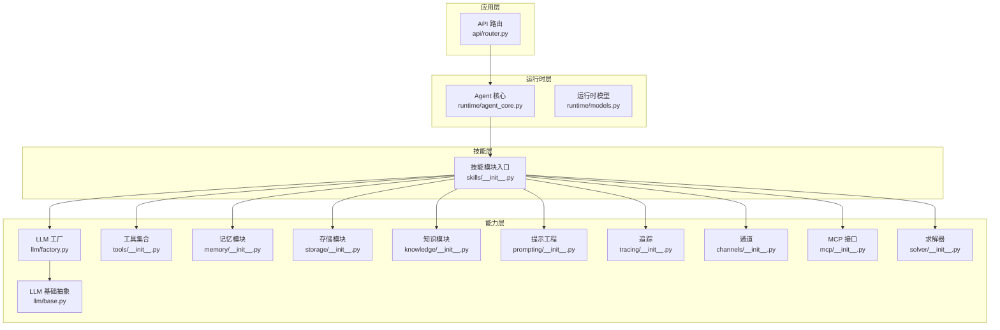
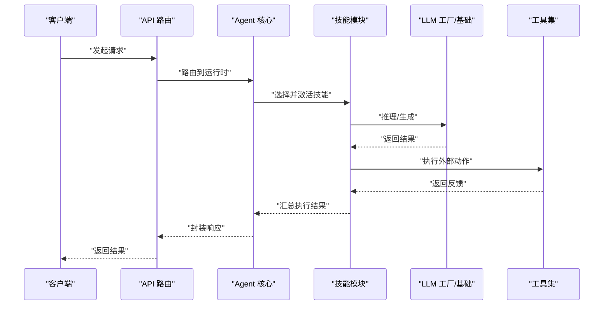
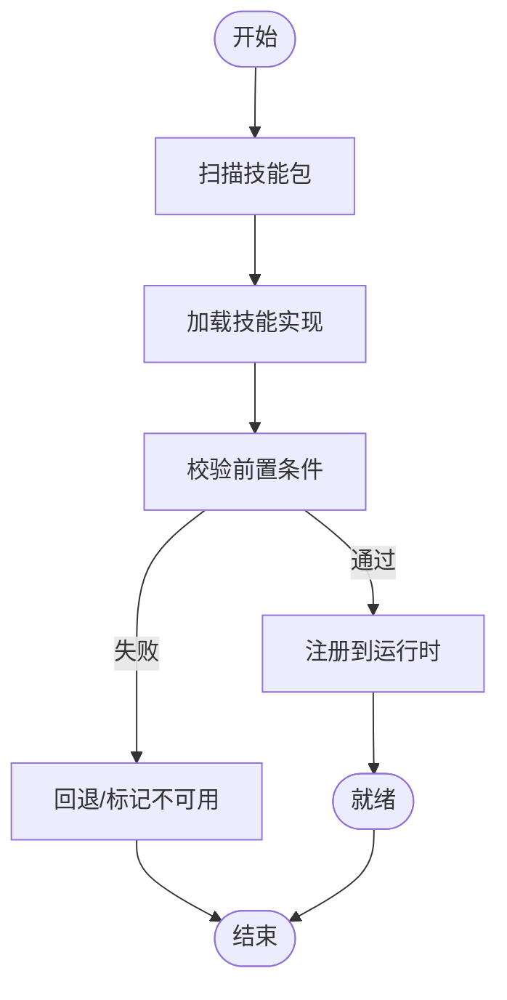
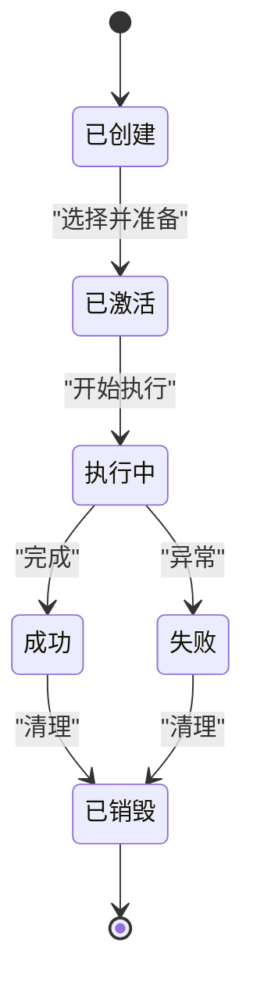
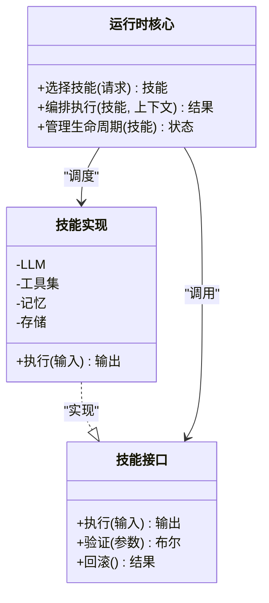
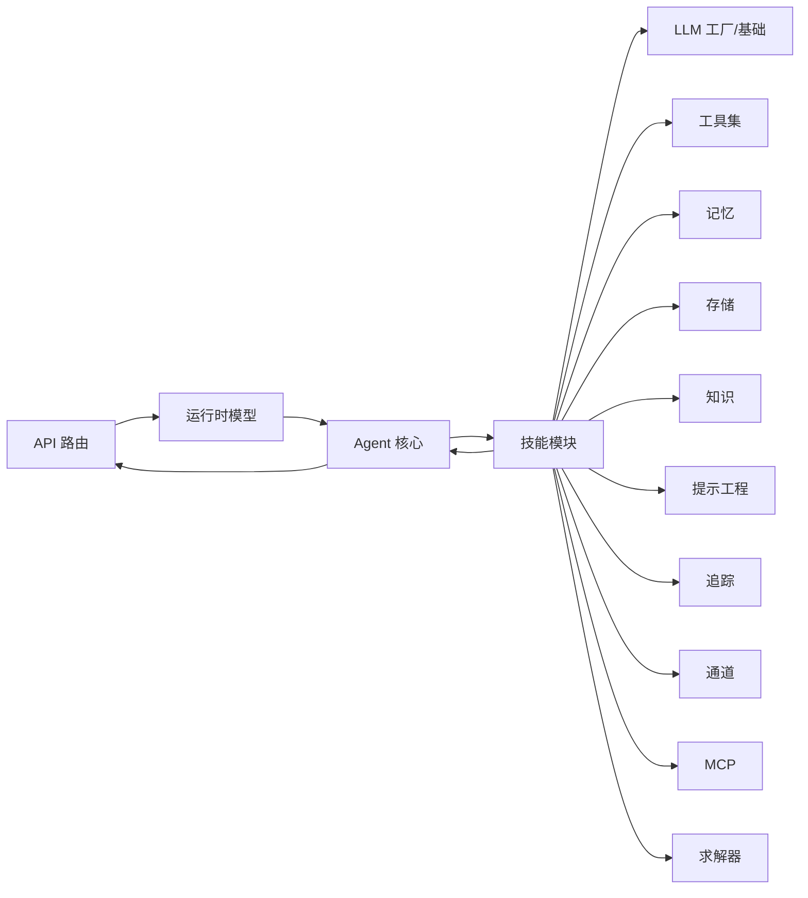
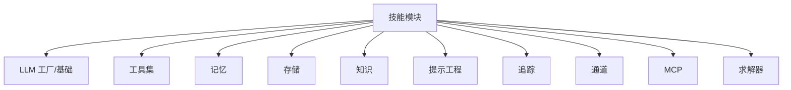

# 技能架构设计

<cite>
**本文档引用的文件**
- [backend/kore/skills/__init__.py](file://backend/kore/skills/__init__.py)
- [backend/kore/runtime/agent_core.py](file://backend/kore/runtime/agent_core.py)
- [backend/kore/runtime/models.py](file://backend/kore/runtime/models.py)
- [backend/kore/api/router.py](file://backend/kore/api/router.py)
- [backend/kore/llm/base.py](file://backend/kore/llm/base.py)
- [backend/kore/llm/factory.py](file://backend/kore/llm/factory.py)
- [backend/kore/tools/__init__.py](file://backend/kore/tools/__init__.py)
- [backend/kore/memory/__init__.py](file://backend/kore/memory/__init__.py)
- [backend/kore/storage/__init__.py](file://backend/kore/storage/__init__.py)
- [backend/kore/knowledge/__init__.py](file://backend/kore/knowledge/__init__.py)
- [backend/kore/prompting/__init__.py](file://backend/kore/prompting/__init__.py)
- [backend/kore/tracing/__init__.py](file://backend/kore/tracing/__init__.py)
- [backend/kore/channels/__init__.py](file://backend/kore/channels/__init__.py)
- [backend/kore/mcp/__init__.py](file://backend/kore/mcp/__init__.py)
- [backend/kore/solver/__init__.py](file://backend/kore/solver/__init__.py)
- [backend/pyproject.toml](file://backend/pyproject.toml)
</cite>

## 目录
1. [引言](#引言)
2. [项目结构](#项目结构)
3. [核心组件](#核心组件)
4. [架构总览](#架构总览)
5. [详细组件分析](#详细组件分析)
6. [依赖分析](#依赖分析)
7. [性能考虑](#性能考虑)
8. [故障排除指南](#故障排除指南)
9. [结论](#结论)
10. [附录](#附录)

## 引言
本文件面向 Kore 智能体框架的技能系统，系统性阐述其架构设计理念、分层结构、组件交互与数据流，并对技能注册机制、生命周期管理、扩展性设计进行深入解析。文档以可操作的方式呈现架构图与组件关系图，帮助开发者快速理解并高效扩展技能体系。

## 项目结构
Kore 后端采用模块化分层组织：技能（skills）位于核心层，向上通过运行时（runtime）与 API 层对接，向下连接 LLM、工具（tools）、记忆（memory）、存储（storage）、知识（knowledge）、提示工程（prompting）、追踪（tracing）、通道（channels）、MCP、求解器（solver）等子系统。该结构支持插件化扩展与职责分离，便于按需启用或替换能力模块。

**图表来源**
- [backend/kore/api/router.py](file://backend/kore/api/router.py)
- [backend/kore/runtime/agent_core.py](file://backend/kore/runtime/agent_core.py)
- [backend/kore/runtime/models.py](file://backend/kore/runtime/models.py)
- [backend/kore/skills/__init__.py](file://backend/kore/skills/__init__.py)
- [backend/kore/llm/base.py](file://backend/kore/llm/base.py)
- [backend/kore/llm/factory.py](file://backend/kore/llm/factory.py)
- [backend/kore/tools/__init__.py](file://backend/kore/tools/__init__.py)
- [backend/kore/memory/__init__.py](file://backend/kore/memory/__init__.py)
- [backend/kore/storage/__init__.py](file://backend/kore/storage/__init__.py)
- [backend/kore/knowledge/__init__.py](file://backend/kore/knowledge/__init__.py)
- [backend/kore/prompting/__init__.py](file://backend/kore/prompting/__init__.py)
- [backend/kore/tracing/__init__.py](file://backend/kore/tracing/__init__.py)
- [backend/kore/channels/__init__.py](file://backend/kore/channels/__init__.py)
- [backend/kore/mcp/__init__.py](file://backend/kore/mcp/__init__.py)
- [backend/kore/solver/__init__.py](file://backend/kore/solver/__init__.py)

**章节来源**
- [backend/kore/skills/__init__.py](file://backend/kore/skills/__init__.py)
- [backend/kore/runtime/agent_core.py](file://backend/kore/runtime/agent_core.py)
- [backend/kore/runtime/models.py](file://backend/kore/runtime/models.py)
- [backend/kore/api/router.py](file://backend/kore/api/router.py)
- [backend/kore/llm/base.py](file://backend/kore/llm/base.py)
- [backend/kore/llm/factory.py](file://backend/kore/llm/factory.py)
- [backend/kore/tools/__init__.py](file://backend/kore/tools/__init__.py)
- [backend/kore/memory/__init__.py](file://backend/kore/memory/__init__.py)
- [backend/kore/storage/__init__.py](file://backend/kore/storage/__init__.py)
- [backend/kore/knowledge/__init__.py](file://backend/kore/knowledge/__init__.py)
- [backend/kore/prompting/__init__.py](file://backend/kore/prompting/__init__.py)
- [backend/kore/tracing/__init__.py](file://backend/kore/tracing/__init__.py)
- [backend/kore/channels/__init__.py](file://backend/kore/channels/__init__.py)
- [backend/kore/mcp/__init__.py](file://backend/kore/mcp/__init__.py)
- [backend/kore/solver/__init__.py](file://backend/kore/solver/__init__.py)

## 核心组件
- 技能模块入口（skills/__init__.py）
  - 作为技能系统的统一暴露点，负责技能注册、发现与初始化的编排。
  - 提供技能清单、元数据与生命周期钩子的集中管理。
- 运行时核心（runtime/agent_core.py）
  - 承载智能体的执行引擎，协调技能调用、状态管理与上下文传递。
  - 与 API 层交互，接收请求并返回结果。
- 运行时模型（runtime/models.py）
  - 定义技能执行所需的通用数据结构、消息协议与状态模型。
- LLM 子系统（llm/base.py, llm/factory.py）
  - 提供大语言模型抽象与工厂模式的实例化策略，支撑技能中的推理与生成。
- 工具、记忆、存储、知识、提示工程、追踪、通道、MCP、求解器
  - 作为可插拔能力模块，被技能在执行过程中按需调用，形成“技能 + 能力”的组合式架构。

**章节来源**
- [backend/kore/skills/__init__.py](file://backend/kore/skills/__init__.py)
- [backend/kore/runtime/agent_core.py](file://backend/kore/runtime/agent_core.py)
- [backend/kore/runtime/models.py](file://backend/kore/runtime/models.py)
- [backend/kore/llm/base.py](file://backend/kore/llm/base.py)
- [backend/kore/llm/factory.py](file://backend/kore/llm/factory.py)
- [backend/kore/tools/__init__.py](file://backend/kore/tools/__init__.py)
- [backend/kore/memory/__init__.py](file://backend/kore/memory/__init__.py)
- [backend/kore/storage/__init__.py](file://backend/kore/storage/__init__.py)
- [backend/kore/knowledge/__init__.py](file://backend/kore/knowledge/__init__.py)
- [backend/kore/prompting/__init__.py](file://backend/kore/prompting/__init__.py)
- [backend/kore/tracing/__init__.py](file://backend/kore/tracing/__init__.py)
- [backend/kore/channels/__init__.py](file://backend/kore/channels/__init__.py)
- [backend/kore/mcp/__init__.py](file://backend/kore/mcp/__init__.py)
- [backend/kore/solver/__init__.py](file://backend/kore/solver/__init__.py)

## 架构总览
技能架构采用“运行时驱动 + 能力插件”的分层设计。技能通过运行时核心进行编排，按需调用能力模块完成复杂任务。API 层负责请求接入与响应输出，形成“请求 → 运行时 → 技能 → 能力”的闭环。

**图表来源**
- [backend/kore/api/router.py](file://backend/kore/api/router.py)
- [backend/kore/runtime/agent_core.py](file://backend/kore/runtime/agent_core.py)
- [backend/kore/skills/__init__.py](file://backend/kore/skills/__init__.py)
- [backend/kore/llm/factory.py](file://backend/kore/llm/factory.py)
- [backend/kore/llm/base.py](file://backend/kore/llm/base.py)
- [backend/kore/tools/__init__.py](file://backend/kore/tools/__init__.py)

## 详细组件分析

### 技能注册机制
- 发现与加载
  - 通过技能模块入口扫描可用技能包，读取元数据与依赖声明。
  - 使用工厂或动态导入策略加载技能实现，确保最小化启动开销。
- 初始化流程
  - 在运行时核心中注册技能，建立名称到实现的映射。
  - 验证前置条件（如 LLM 可用性、工具可用性），失败则回退或标记不可用。
- 生命周期钩子
  - 支持技能级的预处理、后处理钩子，用于上下文注入与清理。

**图表来源**
- [backend/kore/skills/__init__.py](file://backend/kore/skills/__init__.py)
- [backend/kore/runtime/agent_core.py](file://backend/kore/runtime/agent_core.py)

**章节来源**
- [backend/kore/skills/__init__.py](file://backend/kore/skills/__init__.py)
- [backend/kore/runtime/agent_core.py](file://backend/kore/runtime/agent_core.py)

### 技能生命周期管理
- 创建
  - 解析技能配置与参数，构建执行上下文。
- 激活
  - 运行时根据输入选择合适技能，准备资源与依赖。
- 执行
  - 调用 LLM 与工具链，按顺序推进步骤，收集中间态。
- 销毁
  - 清理临时资源、回滚状态、释放锁与连接。

**图表来源**
- [backend/kore/runtime/agent_core.py](file://backend/kore/runtime/agent_core.py)
- [backend/kore/runtime/models.py](file://backend/kore/runtime/models.py)

**章节来源**
- [backend/kore/runtime/agent_core.py](file://backend/kore/runtime/agent_core.py)
- [backend/kore/runtime/models.py](file://backend/kore/runtime/models.py)

### 技能接口与实现分层
- 接口层（抽象）
  - 定义技能签名、输入输出规范、错误码与状态枚举。
- 实现层（具体）
  - 将接口映射到 LLM 推理、工具调用、记忆检索、存储写入等原子能力。
- 编排层（运行时）
  - 组合多个技能步骤，串联能力模块，保证一致性与可观测性。

**图表来源**
- [backend/kore/skills/__init__.py](file://backend/kore/skills/__init__.py)
- [backend/kore/runtime/agent_core.py](file://backend/kore/runtime/agent_core.py)
- [backend/kore/llm/base.py](file://backend/kore/llm/base.py)
- [backend/kore/tools/__init__.py](file://backend/kore/tools/__init__.py)
- [backend/kore/memory/__init__.py](file://backend/kore/memory/__init__.py)
- [backend/kore/storage/__init__.py](file://backend/kore/storage/__init__.py)

**章节来源**
- [backend/kore/skills/__init__.py](file://backend/kore/skills/__init__.py)
- [backend/kore/runtime/agent_core.py](file://backend/kore/runtime/agent_core.py)
- [backend/kore/llm/base.py](file://backend/kore/llm/base.py)
- [backend/kore/tools/__init__.py](file://backend/kore/tools/__init__.py)
- [backend/kore/memory/__init__.py](file://backend/kore/memory/__init__.py)
- [backend/kore/storage/__init__.py](file://backend/kore/storage/__init__.py)

### 数据流与控制流
- 输入数据流
  - API 层接收请求，转换为运行时模型，再交由技能解析。
- 控制流
  - 运行时根据意图识别与上下文，选择技能并串行/并行编排能力。
- 输出数据流
  - 技能聚合结果，经运行时封装，返回 API 层并最终输出。

**图表来源**
- [backend/kore/api/router.py](file://backend/kore/api/router.py)
- [backend/kore/runtime/models.py](file://backend/kore/runtime/models.py)
- [backend/kore/runtime/agent_core.py](file://backend/kore/runtime/agent_core.py)
- [backend/kore/skills/__init__.py](file://backend/kore/skills/__init__.py)
- [backend/kore/llm/factory.py](file://backend/kore/llm/factory.py)
- [backend/kore/llm/base.py](file://backend/kore/llm/base.py)
- [backend/kore/tools/__init__.py](file://backend/kore/tools/__init__.py)
- [backend/kore/memory/__init__.py](file://backend/kore/memory/__init__.py)
- [backend/kore/storage/__init__.py](file://backend/kore/storage/__init__.py)
- [backend/kore/knowledge/__init__.py](file://backend/kore/knowledge/__init__.py)
- [backend/kore/prompting/__init__.py](file://backend/kore/prompting/__init__.py)
- [backend/kore/tracing/__init__.py](file://backend/kore/tracing/__init__.py)
- [backend/kore/channels/__init__.py](file://backend/kore/channels/__init__.py)
- [backend/kore/mcp/__init__.py](file://backend/kore/mcp/__init__.py)
- [backend/kore/solver/__init__.py](file://backend/kore/solver/__init__.py)

**章节来源**
- [backend/kore/api/router.py](file://backend/kore/api/router.py)
- [backend/kore/runtime/models.py](file://backend/kore/runtime/models.py)
- [backend/kore/runtime/agent_core.py](file://backend/kore/runtime/agent_core.py)
- [backend/kore/skills/__init__.py](file://backend/kore/skills/__init__.py)

## 依赖分析
- 内聚性
  - 技能模块与运行时紧密耦合，但通过清晰接口与工厂模式降低对具体实现的依赖。
- 耦合度
  - 能力模块以插件形式存在，技能仅依赖抽象接口，避免直接耦合具体实现。
- 可扩展性
  - 新增能力只需实现接口并注册，无需修改既有技能逻辑；新技能通过统一入口即可接入。

**图表来源**
- [backend/kore/skills/__init__.py](file://backend/kore/skills/__init__.py)
- [backend/kore/llm/factory.py](file://backend/kore/llm/factory.py)
- [backend/kore/llm/base.py](file://backend/kore/llm/base.py)
- [backend/kore/tools/__init__.py](file://backend/kore/tools/__init__.py)
- [backend/kore/memory/__init__.py](file://backend/kore/memory/__init__.py)
- [backend/kore/storage/__init__.py](file://backend/kore/storage/__init__.py)
- [backend/kore/knowledge/__init__.py](file://backend/kore/knowledge/__init__.py)
- [backend/kore/prompting/__init__.py](file://backend/kore/prompting/__init__.py)
- [backend/kore/tracing/__init__.py](file://backend/kore/tracing/__init__.py)
- [backend/kore/channels/__init__.py](file://backend/kore/channels/__init__.py)
- [backend/kore/mcp/__init__.py](file://backend/kore/mcp/__init__.py)
- [backend/kore/solver/__init__.py](file://backend/kore/solver/__init__.py)

**章节来源**
- [backend/kore/skills/__init__.py](file://backend/kore/skills/__init__.py)
- [backend/kore/llm/factory.py](file://backend/kore/llm/factory.py)
- [backend/kore/llm/base.py](file://backend/kore/llm/base.py)
- [backend/kore/tools/__init__.py](file://backend/kore/tools/__init__.py)
- [backend/kore/memory/__init__.py](file://backend/kore/memory/__init__.py)
- [backend/kore/storage/__init__.py](file://backend/kore/storage/__init__.py)
- [backend/kore/knowledge/__init__.py](file://backend/kore/knowledge/__init__.py)
- [backend/kore/prompting/__init__.py](file://backend/kore/prompting/__init__.py)
- [backend/kore/tracing/__init__.py](file://backend/kore/tracing/__init__.py)
- [backend/kore/channels/__init__.py](file://backend/kore/channels/__init__.py)
- [backend/kore/mcp/__init__.py](file://backend/kore/mcp/__init__.py)
- [backend/kore/solver/__init__.py](file://backend/kore/solver/__init__.py)

## 性能考虑
- 启动阶段
  - 延迟加载能力模块，仅在首次使用时初始化，减少冷启动时间。
- 执行阶段
  - 对频繁调用的能力模块引入缓存与连接池，降低延迟与资源消耗。
- 可观测性
  - 在关键路径埋点，结合追踪模块输出执行耗时与吞吐指标，辅助优化。

## 故障排除指南
- 技能未加载
  - 检查技能入口是否正确注册，确认前置依赖（如 LLM、工具）可用。
- 执行异常
  - 查看运行时模型与上下文是否完整，核对技能回滚逻辑是否触发。
- 性能瓶颈
  - 关注 LLM 推理耗时与工具调用延迟，评估缓存命中率与并发度。

**章节来源**
- [backend/kore/runtime/agent_core.py](file://backend/kore/runtime/agent_core.py)
- [backend/kore/runtime/models.py](file://backend/kore/runtime/models.py)
- [backend/kore/tracing/__init__.py](file://backend/kore/tracing/__init__.py)

## 结论
Kore 的技能架构以“运行时驱动 + 能力插件”为核心，通过清晰的接口与工厂模式实现低耦合高内聚。技能注册与生命周期管理保障了可维护性，插件化与模块化设计提供了良好的扩展性。建议在生产环境中配合缓存、连接池与可观测性方案，持续优化性能与稳定性。

## 附录
- 项目依赖与打包信息参考：[backend/pyproject.toml](file://backend/pyproject.toml)