# 技能注册与管理

<cite>
**本文档引用的文件**
- [backend/kore/skills/__init__.py](file://backend/kore/skills/__init__.py)
- [backend/kore/skills/base.py](file://backend/kore/skills/base.py)
- [backend/kore/skills/registry.py](file://backend/kore/skills/registry.py)
- [backend/kore/runtime/agent_core.py](file://backend/kore/runtime/agent_core.py)
- [backend/kore/runtime/models.py](file://backend/kore/runtime/models.py)
- [backend/kore/api/router.py](file://backend/kore/api/router.py)
- [backend/kore/config.py](file://backend/kore/config.py)
- [backend/pyproject.toml](file://backend/pyproject.toml)
</cite>

## 目录
1. [简介](#简介)
2. [项目结构](#项目结构)
3. [核心组件](#核心组件)
4. [架构概览](#架构概览)
5. [详细组件分析](#详细组件分析)
6. [依赖关系分析](#依赖关系分析)
7. [性能考虑](#性能考虑)
8. [故障排除指南](#故障排除指南)
9. [结论](#结论)

## 简介

Kore 智能体框架的技能注册与管理系统是一个核心功能模块，负责智能体技能的生命周期管理。该系统提供了完整的技能注册、验证、存储、动态加载、卸载和更新机制，支持技能分类和标签管理，以及权限控制和访问管理。

该系统采用模块化设计，通过技能注册表管理所有已注册的技能，支持技能的动态发现和加载。系统还实现了冲突检测机制，确保技能之间的兼容性和稳定性。

## 项目结构

Kore 框架的技能管理功能主要分布在以下目录中：

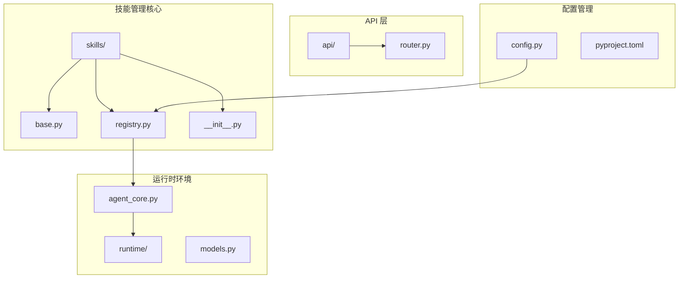

**图表来源**
- [backend/kore/skills/__init__.py](file://backend/kore/skills/__init__.py)
- [backend/kore/skills/registry.py](file://backend/kore/skills/registry.py)
- [backend/kore/runtime/agent_core.py](file://backend/kore/runtime/agent_core.py)

**章节来源**
- [backend/kore/skills/__init__.py](file://backend/kore/skills/__init__.py)
- [backend/kore/skills/base.py](file://backend/kore/skills/base.py)
- [backend/kore/skills/registry.py](file://backend/kore/skills/registry.py)

## 核心组件

### 技能基类系统

技能系统基于统一的基类设计，提供标准化的技能接口和生命周期管理：

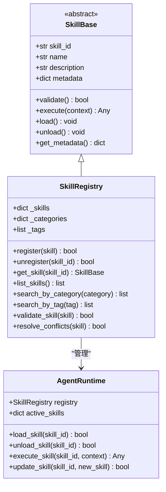

**图表来源**
- [backend/kore/skills/base.py](file://backend/kore/skills/base.py)
- [backend/kore/skills/registry.py](file://backend/kore/skills/registry.py)
- [backend/kore/runtime/agent_core.py](file://backend/kore/runtime/agent_core.py)

### 技能注册表架构

技能注册表是整个技能管理系统的核心组件，负责维护技能的完整生命周期：

| 组件 | 职责 | 关键方法 |
|------|------|----------|
| 技能存储 | 存储已注册的技能实例 | `register()`, `unregister()`, `get_skill()` |
| 分类管理 | 管理技能分类和标签 | `search_by_category()`, `search_by_tag()` |
| 冲突检测 | 检测和解决技能冲突 | `validate_skill()`, `resolve_conflicts()` |
| 权限控制 | 管理技能访问权限 | `check_permissions()`, `grant_access()` |

**章节来源**
- [backend/kore/skills/registry.py](file://backend/kore/skills/registry.py)
- [backend/kore/runtime/agent_core.py](file://backend/kore/runtime/agent_core.py)

## 架构概览

技能管理系统采用分层架构设计，确保各组件职责清晰分离：

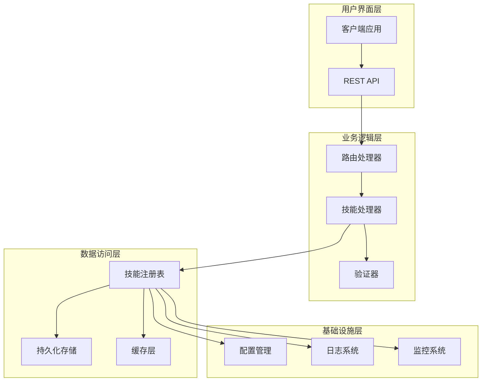

**图表来源**
- [backend/kore/api/router.py](file://backend/kore/api/router.py)
- [backend/kore/skills/registry.py](file://backend/kore/skills/registry.py)
- [backend/kore/config.py](file://backend/kore/config.py)

## 详细组件分析

### 技能注册机制

技能注册机制是整个系统的核心功能，负责技能的发现、验证和存储过程：

#### 注册流程

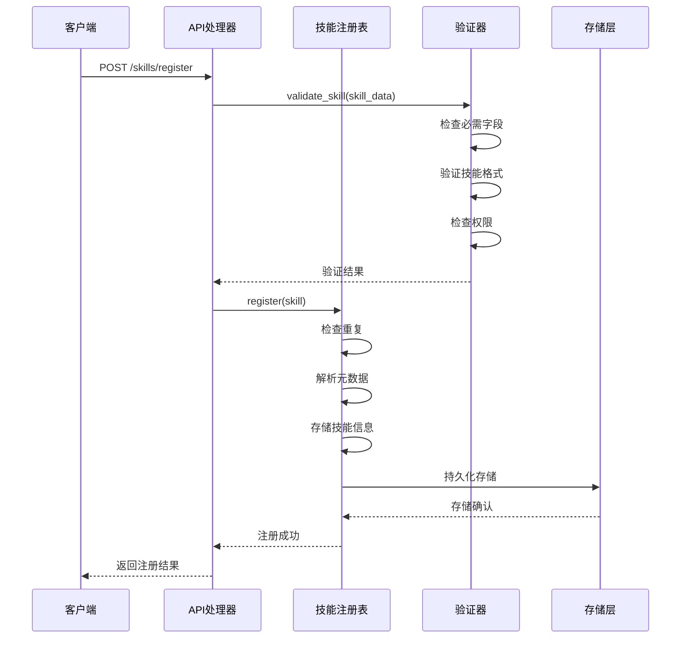

**图表来源**
- [backend/kore/api/router.py](file://backend/kore/api/router.py)
- [backend/kore/skills/registry.py](file://backend/kore/skills/registry.py)

#### 元数据收集与验证

技能注册过程中，系统会自动收集和验证以下元数据：

| 元数据类型 | 字段名称 | 验证规则 | 必需性 |
|------------|----------|----------|--------|
| 基本信息 | skill_id, name, description | 非空字符串，长度限制 | 必需 |
| 技能类型 | type, category | 预定义枚举值 | 可选 |
| 性能指标 | version, compatibility | 版本号格式，兼容性检查 | 可选 |
| 访问控制 | permissions, access_level | 权限级别验证 | 可选 |
| 标签系统 | tags, keywords | 格式验证，长度限制 | 可选 |

**章节来源**
- [backend/kore/skills/registry.py](file://backend/kore/skills/registry.py)
- [backend/kore/skills/base.py](file://backend/kore/skills/base.py)

### 技能管理功能

#### 动态加载机制

技能的动态加载机制确保系统能够按需加载和卸载技能，提高资源利用率：

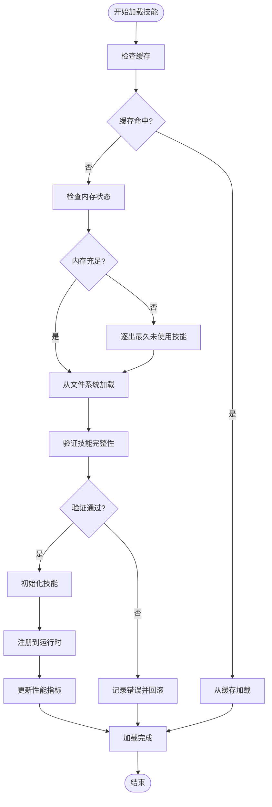

**图表来源**
- [backend/kore/runtime/agent_core.py](file://backend/kore/runtime/agent_core.py)
- [backend/kore/skills/registry.py](file://backend/kore/skills/registry.py)

#### 卸载和更新机制

系统支持技能的动态卸载和安全更新，确保系统稳定性：

| 操作类型 | 触发条件 | 处理流程 | 安全检查 |
|----------|----------|----------|----------|
| 卸载技能 | 系统关闭、内存压力、手动请求 | 检查依赖关系 → 保存状态 → 释放资源 → 更新注册表 | 依赖检查、状态保存 |
| 更新技能 | 新版本发布、配置变更 | 验证新版本 → 创建备份 → 替换文件 → 重启服务 → 回滚机制 | 版本兼容性、备份恢复 |
| 热更新 | 在线更新、零停机维护 | 平滑切换 → 无缝迁移 → 实时监控 | 服务可用性、数据一致性 |

**章节来源**
- [backend/kore/runtime/agent_core.py](file://backend/kore/runtime/agent_core.py)
- [backend/kore/skills/registry.py](file://backend/kore/skills/registry.py)

### 技能分类和标签系统

#### 分类体系设计

技能分类系统采用层次化的分类结构，支持多级分类和灵活的组织方式：

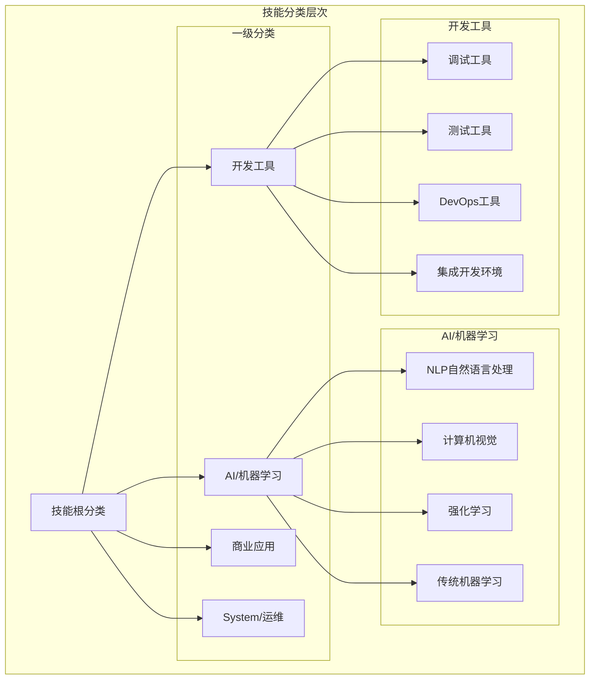

**图表来源**
- [backend/kore/skills/registry.py](file://backend/kore/skills/registry.py)

#### 标签管理机制

标签系统提供灵活的技能标识和检索功能：

| 标签类型 | 示例 | 用途 | 管理方式 |
|----------|------|------|----------|
| 功能标签 | nlp, cv, rl | 技能功能描述 | 自动提取 + 手动编辑 |
| 性能标签 | fast, accurate, reliable | 质量评估 | 自动评分 + 人工审核 |
| 使用场景 | chatbot, assistant, automation | 应用场景匹配 | 智能推荐 + 用户反馈 |
| 技术标签 | python, javascript, docker | 技术栈标识 | 代码分析 + 依赖扫描 |

**章节来源**
- [backend/kore/skills/registry.py](file://backend/kore/skills/registry.py)

### 权限控制和访问管理

#### 权限模型设计

技能权限控制系统采用基于角色的访问控制（RBAC）模型：

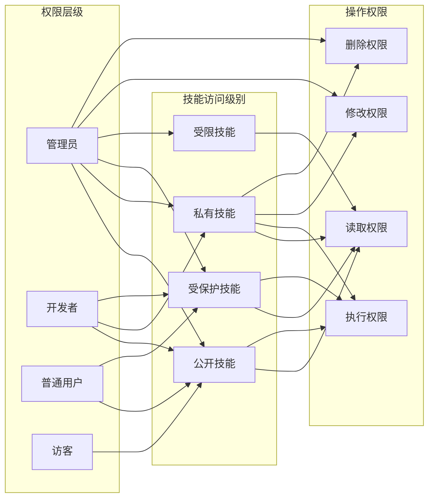

**图表来源**
- [backend/kore/skills/registry.py](file://backend/kore/skills/registry.py)

#### 访问控制实现

权限控制通过多层次的安全检查实现：

1. **身份认证**：验证用户身份和会话有效性
2. **权限检查**：根据用户角色和技能访问级别进行授权判断
3. **操作审计**：记录所有权限相关的操作日志
4. **动态授权**：支持实时权限调整和临时授权

**章节来源**
- [backend/kore/skills/registry.py](file://backend/kore/skills/registry.py)

### API 接口文档

#### 技能注册 API

| 接口 | 方法 | 描述 | 请求体 | 响应码 |
|------|------|------|--------|--------|
| `/skills/register` | POST | 注册新技能 | 技能元数据和实现代码 | 201/400/409 |
| `/skills/list` | GET | 获取技能列表 | 查询参数 | 200/500 |
| `/skills/{id}` | GET | 获取技能详情 | 技能ID | 200/404 |
| `/skills/{id}` | PUT | 更新技能 | 技能更新信息 | 200/400/404 |
| `/skills/{id}` | DELETE | 删除技能 | 技能ID | 200/404/409 |

#### 请求参数规范

**注册技能请求体示例**：
```json
{
  "skill_id": "string",
  "name": "string",
  "description": "string",
  "type": "string",
  "category": "string",
  "version": "string",
  "metadata": {
    "author": "string",
    "license": "string",
    "dependencies": ["string"],
    "tags": ["string"]
  },
  "permissions": {
    "access_level": "string",
    "allowed_roles": ["string"],
    "execution_timeout": "number"
  }
}
```

**响应值说明**：
- 成功注册：返回技能详细信息和注册时间戳
- 参数错误：返回具体的验证错误信息
- 冲突检测：返回冲突的技能信息和解决建议

**章节来源**
- [backend/kore/api/router.py](file://backend/kore/api/router.py)
- [backend/kore/skills/registry.py](file://backend/kore/skills/registry.py)

### 冲突检测和解决机制

#### 冲突类型识别

系统能够自动检测以下类型的技能冲突：

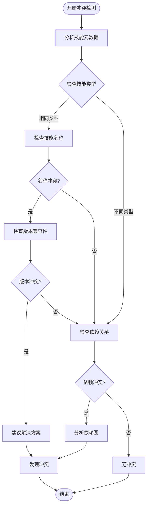

**图表来源**
- [backend/kore/skills/registry.py](file://backend/kore/skills/registry.py)

#### 解决策略

针对不同类型的冲突，系统提供相应的解决策略：

| 冲突类型 | 解决方案 | 实施步骤 |
|----------|----------|----------|
| 名称冲突 | 版本化重命名 | 生成唯一版本标识符 → 更新技能ID → 通知用户 |
| 依赖冲突 | 依赖隔离 | 创建独立虚拟环境 → 隔离依赖包 → 测试兼容性 |
| 权限冲突 | 权限合并 | 合并最小权限集合 → 重新授权 → 更新访问控制 |
| 资源冲突 | 资源分配 | 动态资源调度 → 优先级调整 → 资源回收 |

**章节来源**
- [backend/kore/skills/registry.py](file://backend/kore/skills/registry.py)

### 版本管理和向后兼容性

#### 版本管理策略

系统采用语义化版本控制（SemVer）策略：

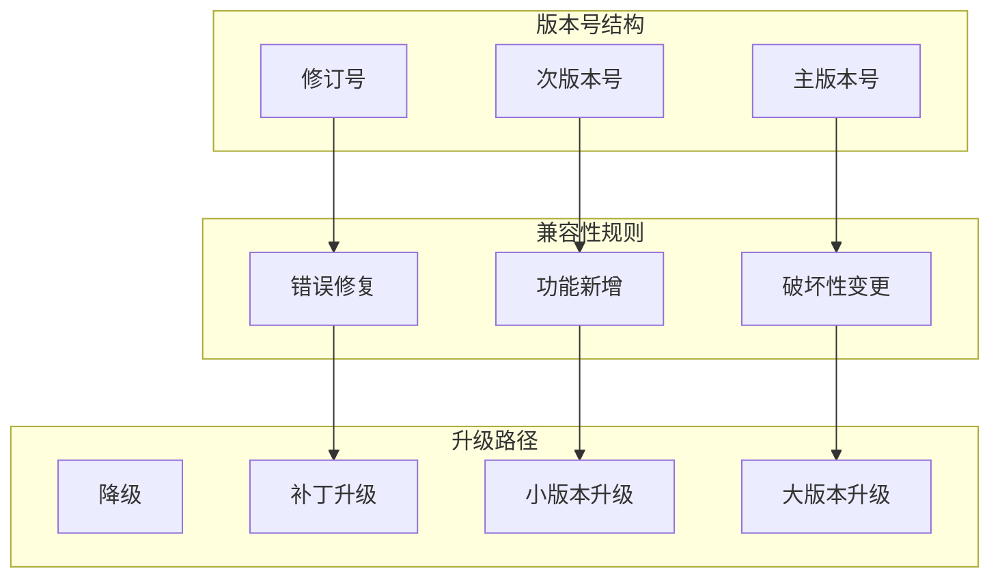

**图表来源**
- [backend/kore/skills/registry.py](file://backend/kore/skills/registry.py)

#### 向后兼容性处理

系统通过以下机制确保向后兼容性：

1. **API 兼容性**：保持接口稳定性和参数向后兼容
2. **数据格式兼容**：支持旧版本数据格式的解析和转换
3. **行为兼容性**：通过配置选项控制兼容性模式
4. **渐进式迁移**：提供平滑的升级路径和回滚机制

**章节来源**
- [backend/kore/skills/registry.py](file://backend/kore/skills/registry.py)

## 依赖关系分析

### 外部依赖

Kore 框架的技能管理系统依赖以下外部库：

| 依赖库 | 版本 | 用途 | 依赖关系 |
|--------|------|------|----------|
| fastapi | >=0.95.0 | Web 框架 | 核心依赖 |
| pydantic | >=1.10.0 | 数据验证 | 核心依赖 |
| redis | >=4.0.0 | 缓存存储 | 可选依赖 |
| sqlalchemy | >=1.4.0 | 数据持久化 | 可选依赖 |
| pytest | >=7.0.0 | 测试框架 | 开发依赖 |

### 内部模块依赖

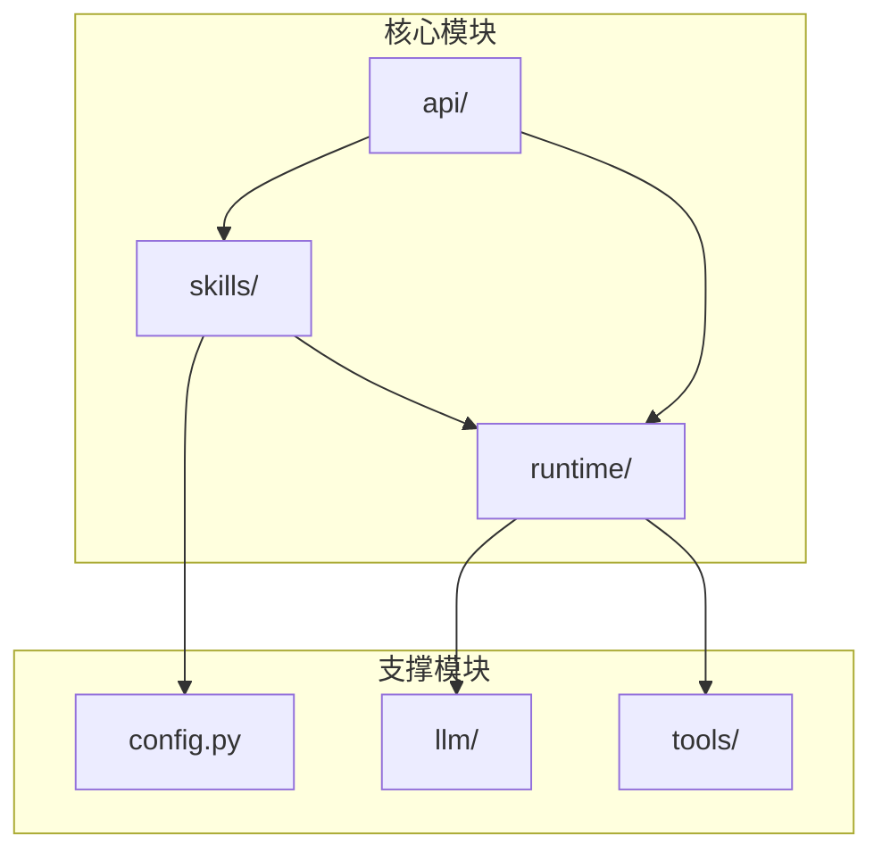

**图表来源**
- [backend/kore/skills/registry.py](file://backend/kore/skills/registry.py)
- [backend/kore/runtime/agent_core.py](file://backend/kore/runtime/agent_core.py)
- [backend/kore/api/router.py](file://backend/kore/api/router.py)

**章节来源**
- [backend/pyproject.toml](file://backend/pyproject.toml)
- [backend/kore/skills/registry.py](file://backend/kore/skills/registry.py)

## 性能考虑

### 内存优化

技能管理系统采用多种内存优化策略：

1. **懒加载机制**：技能仅在需要时加载到内存
2. **缓存策略**：使用 LRU 缓存管理常用技能
3. **内存池管理**：复用对象减少垃圾回收压力
4. **异步加载**：非阻塞的技能加载过程

### 并发处理

系统支持高并发的技能调用：

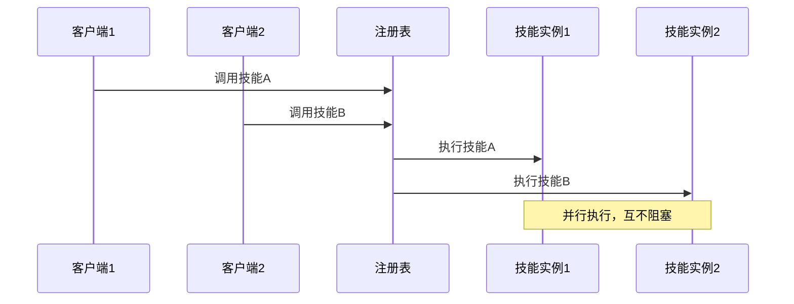

### 性能监控

系统内置性能监控机制：

- 技能执行时间统计
- 内存使用情况监控
- 并发访问量统计
- 错误率和失败率监控

## 故障排除指南

### 常见问题及解决方案

| 问题类型 | 症状 | 可能原因 | 解决方案 |
|----------|------|----------|----------|
| 注册失败 | 返回 400 错误 | 参数验证失败 | 检查必填字段和格式 |
| 加载失败 | 技能不可用 | 依赖缺失或版本冲突 | 安装依赖或更新版本 |
| 执行超时 | 技能长时间无响应 | 性能问题或死锁 | 增加超时时间或优化代码 |
| 权限拒绝 | 访问被拒绝 | 权限不足或配置错误 | 检查用户权限和技能设置 |

### 调试工具

系统提供以下调试工具：

1. **日志分析**：详细的技能执行日志和错误追踪
2. **性能分析**：技能执行时间和资源使用分析
3. **依赖检查**：技能依赖关系和版本冲突检测
4. **配置验证**：技能配置的有效性和完整性检查

**章节来源**
- [backend/kore/skills/registry.py](file://backend/kore/skills/registry.py)
- [backend/kore/runtime/agent_core.py](file://backend/kore/runtime/agent_core.py)

## 结论

Kore 智能体框架的技能注册与管理系统提供了一个完整、可扩展的技能管理解决方案。系统通过模块化设计、层次化架构和完善的生命周期管理，确保了技能的高效管理和稳定运行。

该系统的主要优势包括：

1. **完整的生命周期管理**：从注册到卸载的全流程自动化
2. **强大的冲突检测**：智能识别和解决技能冲突
3. **灵活的权限控制**：基于角色的细粒度访问管理
4. **高效的性能表现**：内存优化和并发处理能力
5. **完善的监控机制**：实时性能监控和故障诊断

未来的发展方向包括：

- 增强机器学习驱动的技能推荐系统
- 扩展云原生部署和容器化支持
- 优化大规模技能集的管理效率
- 加强与其他 AI 框架的集成能力

通过持续的优化和改进，Kore 框架的技能管理系统将继续为智能体应用提供强大而可靠的技术支撑。