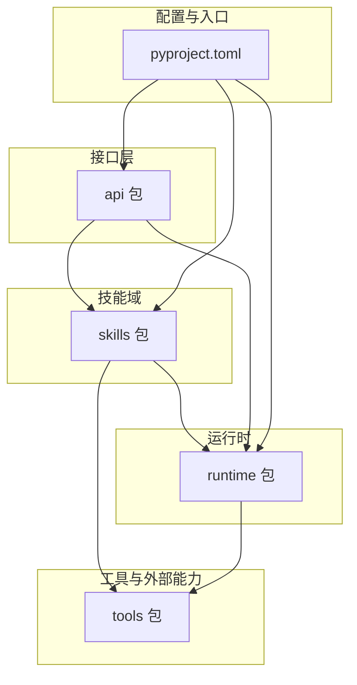
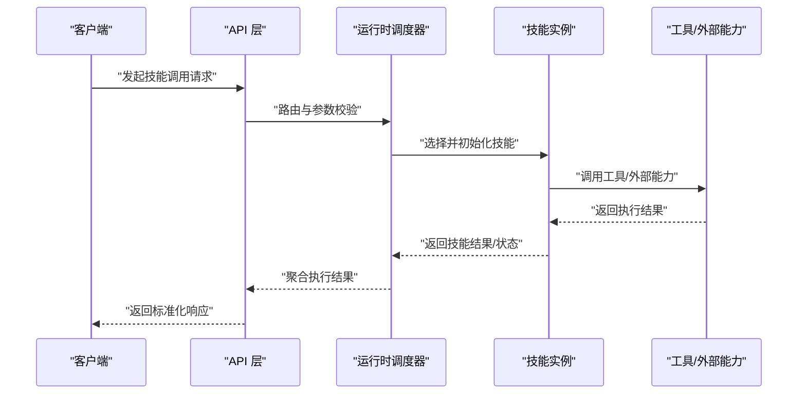
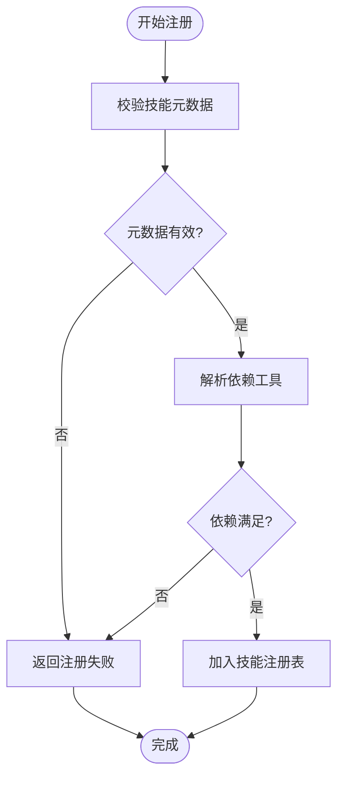
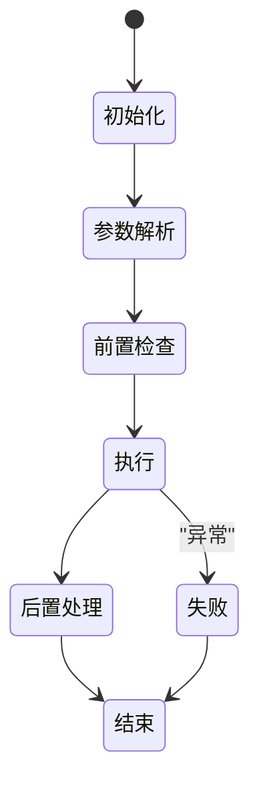
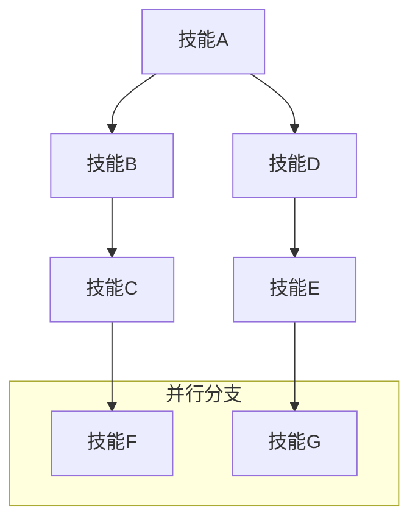
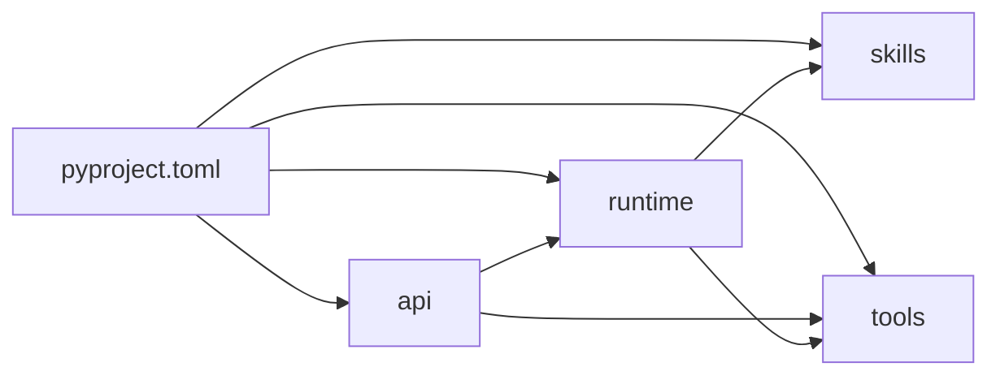

# 技能系统

<cite>
**本文引用的文件**
- [skills/__init__.py](file://backend/kore/skills/__init__.py)
- [runtime/__init__.py](file://backend/kore/runtime/__init__.py)
- [tools/__init__.py](file://backend/kore/tools/__init__.py)
- [api/__init__.py](file://backend/kore/api/__init__.py)
- [pyproject.toml](file://backend/pyproject.toml)
</cite>

## 目录
1. [引言](#引言)
2. [项目结构](#项目结构)
3. [核心组件](#核心组件)
4. [架构总览](#架构总览)
5. [详细组件分析](#详细组件分析)
6. [依赖分析](#依赖分析)
7. [性能考虑](#性能考虑)
8. [故障排查指南](#故障排查指南)
9. [结论](#结论)
10. [附录](#附录)

## 引言
本文件面向 Kore 智能体框架的“技能系统”，基于当前仓库可见模块进行技术文档梳理与架构说明。由于技能系统的具体实现文件在当前目录中未直接呈现，本文以现有模块（runtime、skills、tools、api 等）为依据，构建可扩展的设计蓝图与开发指南，帮助读者理解技能的注册、执行、生命周期管理、组合与链式调用、上下文与状态传递、性能优化与错误处理、以及版本与兼容性策略。

## 项目结构
Kore 后端采用按功能域分层的模块化组织方式，技能系统作为智能体能力的可插拔扩展点，位于顶层 skills 包；运行时核心逻辑位于 runtime；工具与外部能力封装位于 tools；对外接口位于 api。该结构便于将技能注册、调度与执行解耦，并支持与 LLM、存储、追踪等子系统协作。

图表来源
- [runtime/__init__.py](file://backend/kore/runtime/__init__.py)
- [skills/__init__.py](file://backend/kore/skills/__init__.py)
- [tools/__init__.py](file://backend/kore/tools/__init__.py)
- [api/__init__.py](file://backend/kore/api/__init__.py)
- [pyproject.toml](file://backend/pyproject.toml)

章节来源
- [runtime/__init__.py](file://backend/kore/runtime/__init__.py)
- [skills/__init__.py](file://backend/kore/skills/__init__.py)
- [tools/__init__.py](file://backend/kore/tools/__init__.py)
- [api/__init__.py](file://backend/kore/api/__init__.py)
- [pyproject.toml](file://backend/pyproject.toml)

## 核心组件
- 技能注册与发现：通过 skills 包暴露的注册机制，将技能声明为可被运行时识别与调度的单元。注册应包含技能元数据（名称、描述、输入输出规范、依赖等）。
- 运行时调度器：runtime 提供技能执行的编排与生命周期管理，负责上下文初始化、参数解析、并发控制、错误传播与重试策略。
- 工具与外部能力：tools 封装第三方服务或本地工具，作为技能的执行后端，确保统一的适配接口与可观测性。
- 接口层：api 负责接收外部请求，将请求映射到技能执行流程，返回标准化响应。
- 配置与入口：pyproject.toml 定义项目依赖与入口脚本，支撑技能系统的安装、加载与运行。

章节来源
- [runtime/__init__.py](file://backend/kore/runtime/__init__.py)
- [skills/__init__.py](file://backend/kore/skills/__init__.py)
- [tools/__init__.py](file://backend/kore/tools/__init__.py)
- [api/__init__.py](file://backend/kore/api/__init__.py)
- [pyproject.toml](file://backend/pyproject.toml)

## 架构总览
下图展示从接口层到技能执行的整体流程：请求进入 api 层，经由路由与参数校验后，交由 runtime 的调度器选择并执行技能；技能在执行过程中可调用 tools 中的工具或外部服务；运行时负责上下文管理、状态传递与错误处理；最终通过 api 返回结果。

图表来源
- [api/__init__.py](file://backend/kore/api/__init__.py)
- [runtime/__init__.py](file://backend/kore/runtime/__init__.py)
- [tools/__init__.py](file://backend/kore/tools/__init__.py)
- [skills/__init__.py](file://backend/kore/skills/__init__.py)

## 详细组件分析

### 技能注册机制
- 注册入口：在 skills 包中定义技能注册表，支持动态注册与卸载。注册时需提供技能标识、元数据、依赖声明与默认配置。
- 元数据规范：名称、版本、类别、输入输出 Schema、前置条件、异常码映射、是否幂等等。
- 依赖解析：注册阶段解析技能对 tools 的依赖，确保运行时可用性。
- 并发与隔离：为每个技能实例分配独立的执行上下文，避免共享状态污染。

图表来源
- [skills/__init__.py](file://backend/kore/skills/__init__.py)

章节来源
- [skills/__init__.py](file://backend/kore/skills/__init__.py)

### 执行流程与生命周期
- 生命周期阶段：初始化 → 参数解析 → 前置检查 → 执行 → 后置处理 → 结束。
- 上下文管理：运行时为每次执行生成上下文对象，携带会话 ID、用户信息、时间戳、追踪 ID 等；技能可在执行中读写上下文。
- 状态传递：技能输出作为中间态写入上下文，供后续技能消费；支持键空间隔离与命名冲突处理。
- 错误处理：捕获技能内部异常，映射为标准错误码与消息，必要时触发重试或降级。

图表来源
- [runtime/__init__.py](file://backend/kore/runtime/__init__.py)

章节来源
- [runtime/__init__.py](file://backend/kore/runtime/__init__.py)

### 技能分类与组织
- 功能分类：检索增强（RAG）、工具调用、逻辑编排、数据转换、外部集成等。
- 组织方式：按领域划分子包，每个子包内含若干技能；通过统一的注册接口集中管理。
- 版本化：每个技能维护语义化版本号，支持灰度发布与回滚。

章节来源
- [skills/__init__.py](file://backend/kore/skills/__init__.py)

### 内置技能与使用场景
- 检索增强：将用户问题与知识库向量匹配，生成带上下文的回答。
- 工具调用：封装常用外部 API（如天气查询、翻译），提供标准化输入输出。
- 逻辑编排：多步骤任务编排，支持条件分支与循环。
- 数据转换：格式转换、字段提取、结构化输出。
- 外部集成：对接第三方平台（如消息推送、工单系统）。

章节来源
- [skills/__init__.py](file://backend/kore/skills/__init__.py)

### 技能开发指南
- 接口定义：技能需实现统一的接口契约（如 init、execute、teardown），并声明输入输出 Schema。
- 实现规范：保持无副作用或可幂等；严格校验输入；最小化外部依赖；记录关键日志与指标。
- 测试方法：单元测试覆盖正常路径与边界条件；集成测试验证与工具/LLM 的交互；压力测试评估吞吐与延迟。
- 文档与元数据：完善 README、变更日志与版本标签，便于团队协作与发布管理。

章节来源
- [skills/__init__.py](file://backend/kore/skills/__init__.py)

### 技能组合与链式调用
- 组合策略：顺序执行、并行执行、条件分支、循环迭代；通过编排器将多个技能拼接为复杂工作流。
- 状态注入：前序技能输出作为后续技能输入；支持字段映射与过滤。
- 错误传播：任一环节失败时，根据策略中断或继续；记录失败节点与原因。

图表来源
- [runtime/__init__.py](file://backend/kore/runtime/__init__.py)
- [skills/__init__.py](file://backend/kore/skills/__init__.py)

章节来源
- [runtime/__init__.py](file://backend/kore/runtime/__init__.py)
- [skills/__init__.py](file://backend/kore/skills/__init__.py)

### 上下文管理与状态传递
- 上下文结构：包含会话信息、用户属性、请求追踪、时间戳、临时变量等。
- 作用域隔离：不同技能拥有独立的键空间，避免冲突；支持显式清理与回收。
- 状态持久化：对关键中间态进行持久化，支持断点续跑与审计。

章节来源
- [runtime/__init__.py](file://backend/kore/runtime/__init__.py)

### 自定义技能开发示例（实现模式）
- 模式一：纯函数式技能（无状态、可幂等），适合简单转换与查询。
- 模式二：有状态技能（维护会话或缓存），适合对话与多轮任务。
- 模式三：工具桥接技能（封装外部 API），需处理鉴权、限流与超时。
- 模式四：编排型技能（协调多个子技能），需设计清晰的错误与回滚策略。

章节来源
- [skills/__init__.py](file://backend/kore/skills/__init__.py)
- [tools/__init__.py](file://backend/kore/tools/__init__.py)

### 性能优化最佳实践
- 缓存策略：对重复输入或昂贵计算结果进行缓存；设置合理的过期策略。
- 并发控制：限制并发度与队列长度，避免资源争用；对慢依赖进行超时与熔断。
- 序列化与压缩：减少网络传输与序列化开销；对大对象进行分片或流式处理。
- 监控与采样：埋点关键指标（P95/P99、错误率、重试率）；对高延迟路径进行采样分析。

章节来源
- [runtime/__init__.py](file://backend/kore/runtime/__init__.py)
- [tools/__init__.py](file://backend/kore/tools/__init__.py)

### 错误处理最佳实践
- 分层处理：接口层负责参数校验与错误包装；运行时负责异常捕获与重试；技能层负责业务异常的语义化。
- 标准化错误码：定义清晰的错误码与消息模板，便于前端与监控系统识别。
- 降级与熔断：对外部依赖实施熔断与降级策略，保证核心链路可用。
- 日志与追踪：为每条请求生成唯一追踪 ID，串联全链路日志，便于定位问题。

章节来源
- [runtime/__init__.py](file://backend/kore/runtime/__init__.py)
- [api/__init__.py](file://backend/kore/api/__init__.py)

### 版本管理与兼容性策略
- 语义化版本：主版本用于破坏性变更，次版本用于新增功能，修订版本用于修复。
- 向后兼容：新增字段默认可选；废弃字段保留过渡期；提供迁移脚本与自动补丁。
- 灰度发布：通过流量切分与版本标签控制发布范围；收集指标与日志进行风险评估。
- 回滚预案：建立快速回滚机制与数据一致性检查，降低发布风险。

章节来源
- [skills/__init__.py](file://backend/kore/skills/__init__.py)
- [pyproject.toml](file://backend/pyproject.toml)

## 依赖分析
- 模块内聚：skills 与 runtime 高内聚，通过统一接口耦合；tools 作为外部能力适配器，低耦合高扩展。
- 外部依赖：通过 pyproject.toml 管理第三方库；建议将 LLM SDK、存储 SDK、监控 SDK 等作为可选依赖，按需启用。
- 循环依赖：避免 skills 与 runtime 直接相互导入；通过抽象接口与事件驱动解耦。

图表来源
- [api/__init__.py](file://backend/kore/api/__init__.py)
- [runtime/__init__.py](file://backend/kore/runtime/__init__.py)
- [skills/__init__.py](file://backend/kore/skills/__init__.py)
- [tools/__init__.py](file://backend/kore/tools/__init__.py)
- [pyproject.toml](file://backend/pyproject.toml)

章节来源
- [pyproject.toml](file://backend/pyproject.toml)

## 性能考虑
- I/O 密集优先：将外部调用异步化，配合连接池与超时控制。
- 计算密集分流：将复杂计算交给专用服务或批处理队列。
- 观测性先行：在关键路径埋点，持续观察延迟分布与错误趋势。
- 资源配额：为技能设置 CPU/内存/并发上限，防止雪崩效应。

## 故障排查指南
- 快速定位：通过追踪 ID 在日志中检索完整调用链，确认失败节点与异常栈。
- 常见问题：依赖不可用、输入 Schema 不匹配、外部服务超时/限流、缓存命中率低。
- 处理步骤：检查依赖健康状态与鉴权配置；核对输入输出 Schema；调整超时与重试参数；优化缓存策略。

章节来源
- [runtime/__init__.py](file://backend/kore/runtime/__init__.py)
- [api/__init__.py](file://backend/kore/api/__init__.py)

## 结论
Kore 的技能系统以模块化与可扩展为核心设计原则：通过 skills 的注册机制与 runtime 的调度编排，结合 tools 的能力适配与 api 的接口封装，形成从请求到执行再到结果返回的完整闭环。遵循本文的开发规范、性能优化与错误处理策略，可高效构建稳定、可观测且易演进的技能生态。

## 附录
- 开发清单：接口契约、Schema 定义、单元测试、集成测试、压测报告、变更日志。
- 发布清单：版本标签、灰度策略、回滚预案、监控阈值、告警规则。