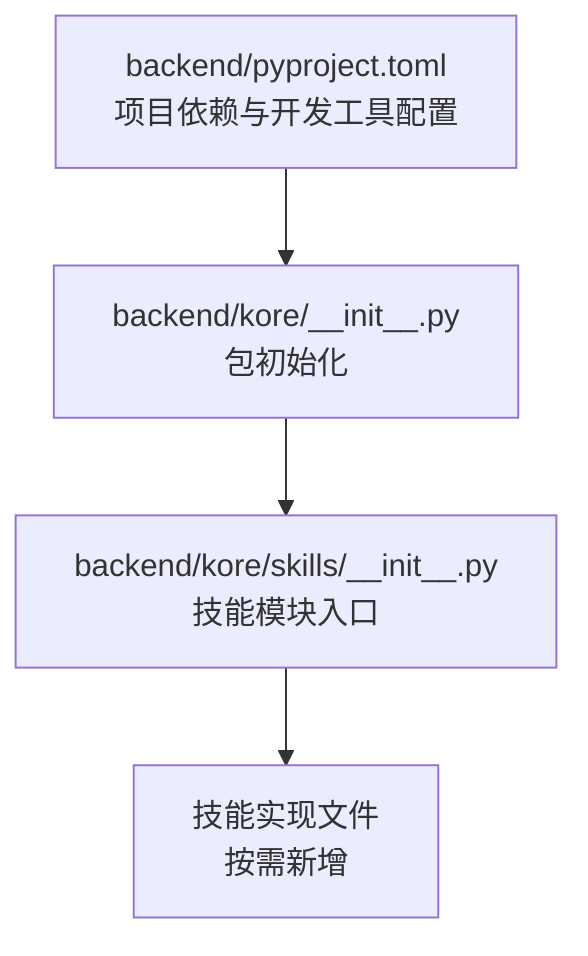
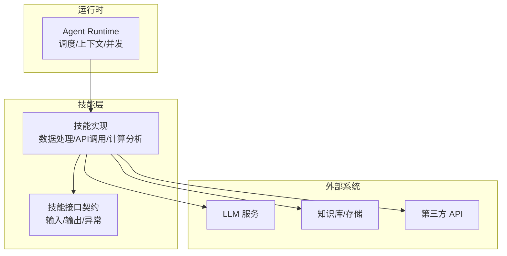
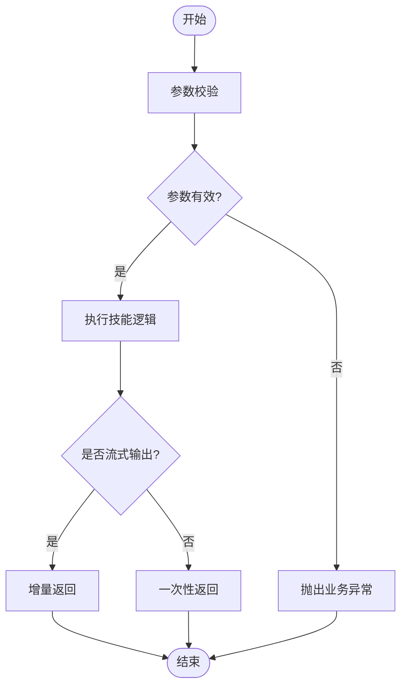
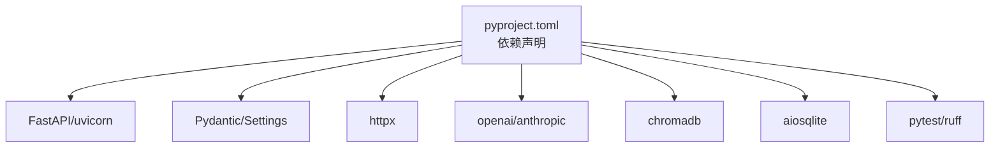

# 自定义技能开发

<cite>
**本文引用的文件**
- [pyproject.toml](file://backend/pyproject.toml)
- [__init__.py](file://backend/kore/__init__.py)
- [skills/__init__.py](file://backend/kore/skills/__init__.py)
</cite>

## 目录
1. [简介](#简介)
2. [项目结构](#项目结构)
3. [核心组件](#核心组件)
4. [架构总览](#架构总览)
5. [详细组件分析](#详细组件分析)
6. [依赖分析](#依赖分析)
7. [性能考量](#性能考量)
8. [故障排查指南](#故障排查指南)
9. [结论](#结论)
10. [附录](#附录)

## 简介
本指南面向在 Kore 智能体框架中开发“自定义技能”的工程师与技术作者。Kore 是一个个人智能助手与智能体运行时系统，当前仓库提供了技能模块的入口与基础配置。本指南将围绕以下目标展开：  
- 明确技能开发的端到端流程（需求分析、设计、实现、测试、调试、部署与发布）  
- 解释技能接口的定义规范（输入/输出、异常处理、返回值格式）  
- 提供多种技能类型（数据处理、API 调用、计算分析）的实现思路与最佳实践  
- 给出测试方法与工具（单元测试、集成测试、性能测试）  
- 总结调试技巧与常见问题的解决方案  
- 提供部署与发布的流程说明  
- 提供技能开发模板与脚手架工具使用建议  

由于当前仓库未包含具体技能实现代码文件，本指南以“概念性+可落地”的方式组织内容，帮助读者在现有框架下快速构建高质量的自定义技能。

## 项目结构
后端采用 Python 包结构，核心模块位于 backend/kore 下，其中 skills 子包为技能能力的承载位置。项目通过 pyproject.toml 管理依赖与开发工具，pytest 配置已启用异步模式，便于编写异步技能逻辑。

**图示来源**
- [pyproject.toml:1-35](file://backend/pyproject.toml#L1-L35)
- [__init__.py:1-1](file://backend/kore/__init__.py#L1-L1)
- [skills/__init__.py:1-1](file://backend/kore/skills/__init__.py#L1-L1)

**章节来源**
- [pyproject.toml:1-35](file://backend/pyproject.toml#L1-L35)
- [__init__.py:1-1](file://backend/kore/__init__.py#L1-L1)
- [skills/__init__.py:1-1](file://backend/kore/skills/__init__.py#L1-L1)

## 核心组件
- 技能模块入口：位于 skills/__init__.py，作为技能注册与发现的统一出口。  
- 项目依赖与工具链：通过 pyproject.toml 声明 FastAPI、Pydantic、OpenAI/Anthropic 客户端、SQLite、ChromaDB、HTTPX 等，支持异步与流式通信。  
- 测试与质量工具：pytest（异步模式）、Ruff（代码风格与静态检查）。  

这些组件共同构成技能开发的基础环境与约束条件，后续实现需遵循依赖与工具链约定。

**章节来源**
- [pyproject.toml:1-35](file://backend/pyproject.toml#L1-L35)
- [skills/__init__.py:1-1](file://backend/kore/skills/__init__.py#L1-L1)

## 架构总览
Kore 的技能体系建议采用“插件化 + 接口契约”的架构：  
- 技能以独立模块存在，通过统一入口注册  
- 技能对外暴露标准化的输入/输出与异常语义  
- 运行时负责调度、上下文注入、并发控制与结果聚合  
- 外部服务（LLM、数据库、第三方 API）通过适配器接入  

[本图为概念性架构示意，不直接映射具体源码文件]

## 详细组件分析

### 技能接口定义规范
为确保技能可组合、可测试、可演进，建议制定统一的接口契约：  

- 输入参数
  - 必填字段：明确标识必填项，避免空值导致的运行时异常  
  - 可选字段：提供默认值或显式校验策略  
  - 类型约束：使用强类型定义（如 Pydantic 模型），在入参阶段完成校验  
  - 上下文注入：允许运行时注入会话、用户、时间戳等上下文信息  

- 输出结果
  - 结构化返回：统一返回模型，包含业务数据与元信息（如耗时、采样参数）  
  - 成功/失败语义：区分业务成功与系统错误，便于上层统一处理  
  - 流式输出：对长任务支持增量返回，提升用户体验  

- 异常处理
  - 业务异常：如参数非法、资源不可用、权限不足等，抛出自定义异常并携带明确错误码与提示  
  - 系统异常：网络超时、服务不可达、序列化失败等，进行重试/降级或回退策略  
  - 日志与追踪：为异常附加上下文 ID，便于定位问题  

- 返回值格式
  - JSON 序列化：确保返回值可被下游组件稳定解析  
  - 兼容性：向前兼容字段，避免破坏性变更  

**章节来源**
- [pyproject.toml:6-19](file://backend/pyproject.toml#L6-L19)

### 技能类型与实现示例

- 数据处理技能
  - 场景：清洗、转换、聚合、可视化准备  
  - 实现要点：纯函数式处理优先；对大体量数据分批处理；必要时引入缓存与索引  
  - 示例路径参考：在 skills 目录下新增模块，导出符合接口契约的处理函数  

- API 调用技能
  - 场景：对接第三方服务（天气、地图、支付、消息推送）  
  - 实现要点：统一客户端封装、超时与重试策略、鉴权与签名、响应解码与错误映射  
  - 示例路径参考：在 skills 目录下新增模块，封装 HTTPX 客户端与业务方法  

- 计算分析技能
  - 场景：统计分析、趋势预测、规则引擎  
  - 实现要点：数值稳定性、边界条件处理、结果校验与可视化参数生成  
  - 示例路径参考：在 skills 目录下新增模块，结合 Pydantic 模型输出结构化结果  

[本图为通用流程示意，不直接映射具体源码文件]

### 最佳实践
- 代码结构
  - 按功能拆分模块，保持单一职责；公共逻辑抽取为工具模块  
  - 使用 Pydantic 定义输入/输出模型，确保类型安全与文档化  
- 错误处理
  - 明确异常分类与传播路径；为关键路径增加断言与防御性编程  
  - 对外部依赖设置超时与重试，避免阻塞主线程  
- 性能优化
  - 合理使用异步 I/O；对热点路径进行缓存与批处理  
  - 控制日志级别与采样率，避免 IO 放大  
- 安全考虑
  - 敏感参数脱敏；鉴权与授权最小化原则；输入输出严格校验  
  - 第三方 API 使用密钥管理与访问控制  

**章节来源**
- [pyproject.toml:6-19](file://backend/pyproject.toml#L6-L19)

### 调试与问题排查
- 单元测试
  - 使用 pytest 编写针对技能函数的单元测试，覆盖正常与异常分支  
  - 对异步函数使用 asyncio.run 或 pytest-asyncio 的标记  
- 集成测试
  - 模拟外部依赖（LLM、数据库、第三方 API），验证端到端流程  
  - 使用临时/沙箱环境，避免污染生产数据  
- 性能测试
  - 使用压力测试工具评估吞吐与延迟；关注内存占用与 GC 行为  
- 调试技巧
  - 在关键节点打印上下文 ID 与时间戳；利用富文本日志输出中间态  
  - 对流式输出场景，逐步比对增量结果与期望差异  

**章节来源**
- [pyproject.toml:21-26](file://backend/pyproject.toml#L21-L26)

### 部署与发布
- 本地开发
  - 使用 uvicorn 启动服务，FastAPI 提供自动 OpenAPI 文档  
  - 通过 dotenv 管理环境变量，确保敏感配置不进入版本库  
- 容器化（建议）
  - 将依赖打包至容器镜像，固定 Python 版本与依赖版本  
- 发布流程
  - 代码审查与自动化测试通过后合并主干；打标签并发布制品  
  - 更新技能清单与版本号，通知使用者  

**章节来源**
- [pyproject.toml:7-18](file://backend/pyproject.toml#L7-L18)

### 常见问题与经验总结
- 参数校验失败
  - 现象：技能直接报错或返回空结果  
  - 处理：在入口处集中校验，提供清晰的错误提示与修复建议  
- 外部服务不稳定
  - 现象：偶发超时或返回异常  
  - 处理：引入指数退避重试、熔断与降级策略  
- 性能瓶颈
  - 现象：高并发下延迟上升  
  - 处理：识别热点路径、引入缓存与限流；优化序列化与 I/O  
- 版本兼容
  - 现象：升级依赖后行为变化  
  - 处理：在 pyproject.toml 固定兼容范围；对破坏性变更做迁移指引  

**章节来源**
- [pyproject.toml:1-35](file://backend/pyproject.toml#L1-L35)

### 模板与脚手架工具
- 项目模板
  - 基于现有 pyproject.toml，新增技能模块目录与 __init__.py 导出  
  - 在 skills 目录下创建新模块，遵循统一的输入/输出与异常约定  
- 脚手架建议
  - 自动生成测试骨架与 pytest 配置  
  - 提供 FastAPI 路由示例与 OpenAPI 注解模板  
  - 集成 Ruff 格式化与 lint 规则，保证代码一致性  

**章节来源**
- [pyproject.toml:28-34](file://backend/pyproject.toml#L28-L34)

## 依赖分析
Kore 当前依赖以运行时与工具链为主，技能开发应充分利用以下能力：  
- FastAPI/uvicorn：提供高性能 Web 服务与 SSE 支持  
- Pydantic/Settings：结构化数据与配置管理  
- httpx/openai/anthropic：统一的 HTTP 客户端与 LLM SDK  
- chromadb/aiosqlite：向量检索与嵌入式数据库  
- pytest/ruff：测试与代码质量保障  

**图示来源**
- [pyproject.toml:6-26](file://backend/pyproject.toml#L6-L26)

**章节来源**
- [pyproject.toml:1-35](file://backend/pyproject.toml#L1-L35)

## 性能考量
- 异步优先：I/O 密集型技能尽量使用异步实现，减少线程阻塞  
- 批处理与缓存：对重复计算与查询引入缓存；对批量请求进行合并  
- 资源限制：为长任务设置最大执行时长与内存上限，防止资源耗尽  
- 监控与观测：为关键指标埋点，结合追踪系统定位性能瓶颈  

[本节为通用性能建议，不直接分析具体源码文件]

## 故障排查指南
- 日志与追踪
  - 为每个技能生成唯一请求 ID，贯穿整个调用链  
  - 使用 rich 输出结构化日志，便于快速定位  
- 常见症状与对策
  - 超时：检查网络与上游服务 SLA，增加超时与重试  
  - 内存泄漏：排查循环引用与未释放的连接句柄  
  - 结果不一致：核对输入参数快照与中间态输出  
- 工具链
  - 使用 pytest 的 --tb=short 快速定位异常栈  
  - 使用 Ruff 的 --fix 自动修复风格问题  

**章节来源**
- [pyproject.toml:21-26](file://backend/pyproject.toml#L21-L26)

## 结论
在 Kore 框架中开发自定义技能的关键在于：建立清晰的接口契约、遵循统一的错误与返回规范、利用现有依赖与工具链提升开发效率与质量。通过模块化设计、完善的测试与可观测性，可以构建稳定、可扩展且易于维护的技能体系。

[本节为总结性内容，不直接分析具体源码文件]

## 附录
- 开发流程清单
  - 需求与接口设计 → 模块拆分与导出 → 实现与单元测试 → 集成与性能测试 → 调试与优化 → 部署与发布  
- 参考文件
  - [pyproject.toml](file://backend/pyproject.toml)
  - [skills/__init__.py](file://backend/kore/skills/__init__.py)