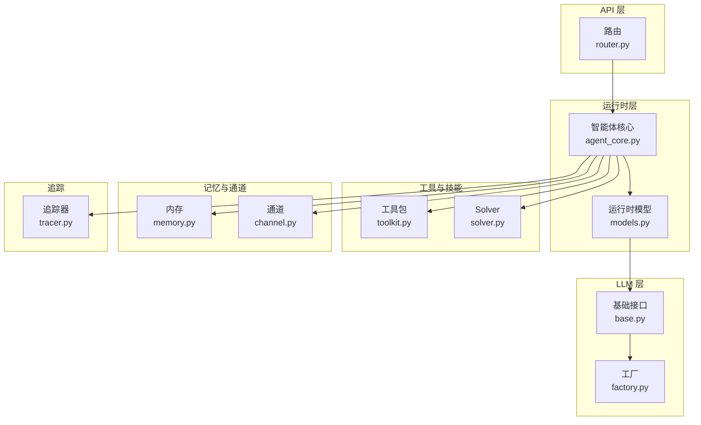
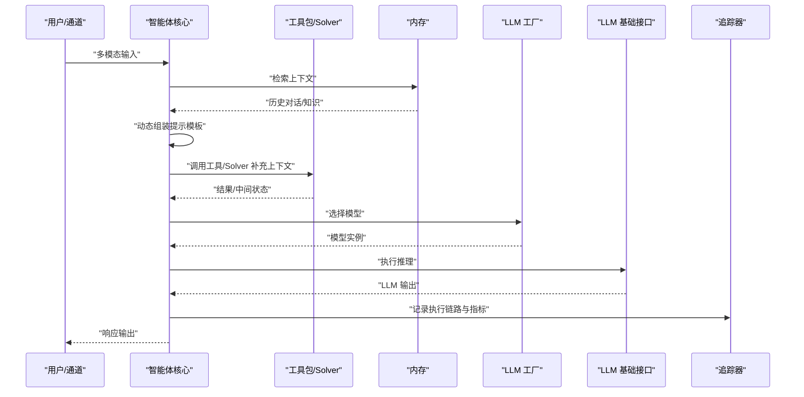
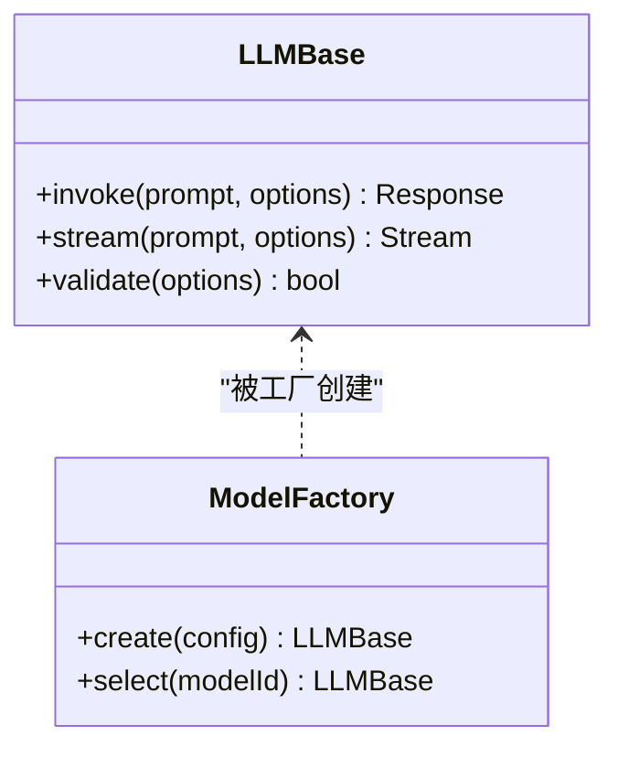
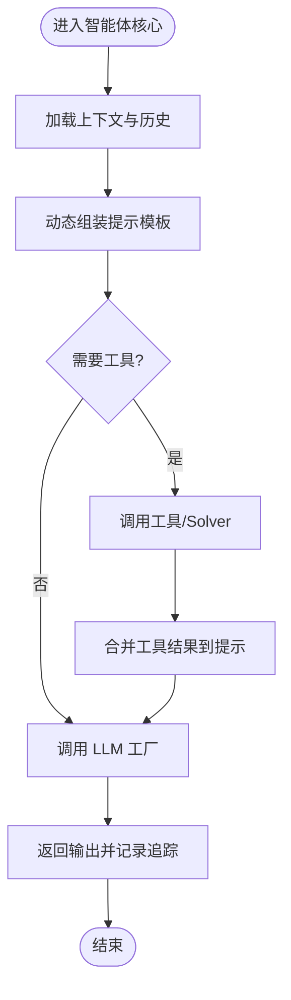
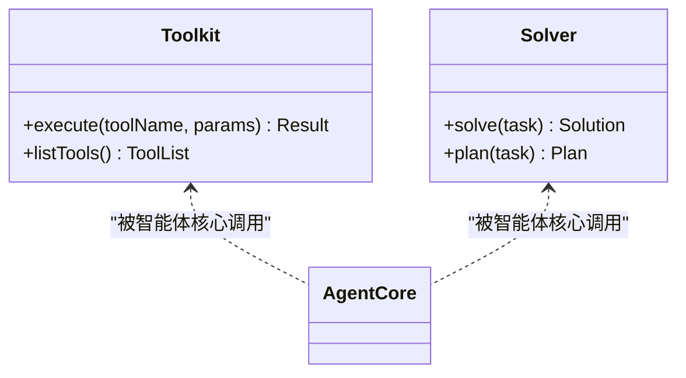
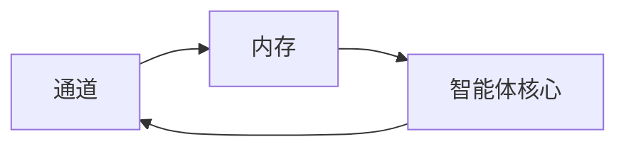
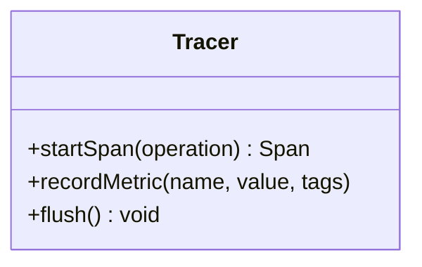
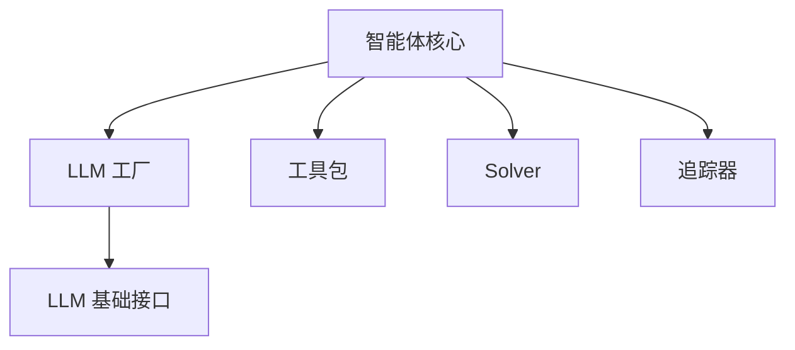

# 提示工程

<cite>
**本文档引用的文件**
- [backend/kore/api/router.py](file://backend/kore/api/router.py)
- [backend/kore/llm/base.py](file://backend/kore/llm/base.py)
- [backend/kore/llm/factory.py](file://backend/kore/llm/factory.py)
- [backend/kore/runtime/agent_core.py](file://backend/kore/runtime/agent_core.py)
- [backend/kore/runtime/models.py](file://backend/kore/runtime/models.py)
- [backend/kore/memory/memory.py](file://backend/kore/memory/memory.py)
- [backend/kore/tools/toolkit.py](file://backend/kore/tools/toolkit.py)
- [backend/kore/solver/solver.py](file://backend/kore/solver/solver.py)
- [backend/kore/channels/channel.py](file://backend/kore/channels/channel.py)
- [backend/kore/tracing/tracer.py](file://backend/kore/tracing/tracer.py)
- [backend/pyproject.toml](file://backend/pyproject.toml)
</cite>

## 目录
1. [简介](#简介)
2. [项目结构](#项目结构)
3. [核心组件](#核心组件)
4. [架构总览](#架构总览)
5. [详细组件分析](#详细组件分析)
6. [依赖分析](#依赖分析)
7. [性能考虑](#性能考虑)
8. [故障排除指南](#故障排除指南)
9. [结论](#结论)
10. [附录](#附录)

## 简介
本技术文档聚焦 Kore 智能体框架中的提示工程系统，围绕提示模板管理、动态生成与优化策略展开，系统性阐述模板组织方式（语法、变量替换、条件逻辑）、多模态提示处理机制（文本、图像、音频融合）、提示优化与效果评估方法（A/B 测试、性能指标、改进策略），并提供提示开发最佳实践与安全过滤机制。由于当前仓库中未发现专门的提示工程子模块文件，本文基于现有代码结构进行架构推演与设计原则说明，旨在为后续扩展提示工程能力提供清晰的蓝图。

## 项目结构
Kore 后端采用模块化分层设计，提示工程可作为横切关注点集成到以下模块：
- LLM 层：抽象与工厂负责模型选择与调用
- 运行时层：智能体核心与运行时模型承载对话与推理
- 工具与技能：为提示注入外部能力与上下文
- 内存与回放缓冲：为提示提供历史上下文
- 通道与追踪：为提示执行提供输入输出与可观测性

**图表来源**
- [backend/kore/api/router.py](file://backend/kore/api/router.py)
- [backend/kore/runtime/agent_core.py](file://backend/kore/runtime/agent_core.py)
- [backend/kore/runtime/models.py](file://backend/kore/runtime/models.py)
- [backend/kore/llm/base.py](file://backend/kore/llm/base.py)
- [backend/kore/llm/factory.py](file://backend/kore/llm/factory.py)
- [backend/kore/tools/toolkit.py](file://backend/kore/tools/toolkit.py)
- [backend/kore/solver/solver.py](file://backend/kore/solver/solver.py)
- [backend/kore/memory/memory.py](file://backend/kore/memory/memory.py)
- [backend/kore/channels/channel.py](file://backend/kore/channels/channel.py)
- [backend/kore/tracing/tracer.py](file://backend/kore/tracing/tracer.py)

**章节来源**
- [backend/kore/api/router.py](file://backend/kore/api/router.py)
- [backend/kore/runtime/agent_core.py](file://backend/kore/runtime/agent_core.py)
- [backend/kore/runtime/models.py](file://backend/kore/runtime/models.py)
- [backend/kore/llm/base.py](file://backend/kore/llm/base.py)
- [backend/kore/llm/factory.py](file://backend/kore/llm/factory.py)
- [backend/kore/memory/memory.py](file://backend/kore/memory/memory.py)
- [backend/kore/tools/toolkit.py](file://backend/kore/tools/toolkit.py)
- [backend/kore/solver/solver.py](file://backend/kore/solver/solver.py)
- [backend/kore/channels/channel.py](file://backend/kore/channels/channel.py)
- [backend/kore/tracing/tracer.py](file://backend/kore/tracing/tracer.py)

## 核心组件
- LLM 基础接口与工厂：定义统一的提示调用协议与模型实例化策略，为提示工程提供稳定的执行环境。
- 运行时智能体核心：协调工具、记忆、通道与追踪，承载提示的动态组装与执行。
- 工具与 Solver：为提示注入外部知识与计算能力，支持复杂推理与任务分解。
- 内存与通道：提供上下文回放与多模态输入输出，支撑提示的历史依赖与跨模态融合。
- 追踪：记录提示执行链路与性能指标，为优化与 A/B 测试提供数据基础。

**章节来源**
- [backend/kore/llm/base.py](file://backend/kore/llm/base.py)
- [backend/kore/llm/factory.py](file://backend/kore/llm/factory.py)
- [backend/kore/runtime/agent_core.py](file://backend/kore/runtime/agent_core.py)
- [backend/kore/tools/toolkit.py](file://backend/kore/tools/toolkit.py)
- [backend/kore/solver/solver.py](file://backend/kore/solver/solver.py)
- [backend/kore/memory/memory.py](file://backend/kore/memory/memory.py)
- [backend/kore/channels/channel.py](file://backend/kore/channels/channel.py)
- [backend/kore/tracing/tracer.py](file://backend/kore/tracing/tracer.py)

## 架构总览
提示工程在 Kore 中以“模板 + 动态组装 + 执行优化”的方式实现。其核心流程如下：
- 输入预处理：从通道接收多模态输入，经内存回放形成上下文。
- 模板组装：根据意图与上下文动态拼接提示模板，完成变量替换与条件分支。
- LLM 调用：通过工厂选择模型，调用基础接口执行推理。
- 结果后处理：将输出写入通道，并记录追踪信息用于评估与优化。

**图表来源**
- [backend/kore/runtime/agent_core.py](file://backend/kore/runtime/agent_core.py)
- [backend/kore/memory/memory.py](file://backend/kore/memory/memory.py)
- [backend/kore/tools/toolkit.py](file://backend/kore/tools/toolkit.py)
- [backend/kore/solver/solver.py](file://backend/kore/solver/solver.py)
- [backend/kore/llm/factory.py](file://backend/kore/llm/factory.py)
- [backend/kore/llm/base.py](file://backend/kore/llm/base.py)
- [backend/kore/tracing/tracer.py](file://backend/kore/tracing/tracer.py)

## 详细组件分析

### LLM 基础接口与工厂
- 基础接口职责：定义统一的提示调用协议，屏蔽不同模型的差异；支持流式/非流式输出、错误处理与超时控制。
- 工厂模式：依据配置选择具体模型实现，支持多供应商/多版本切换；为提示工程提供可插拔的执行后端。

**图表来源**
- [backend/kore/llm/base.py](file://backend/kore/llm/base.py)
- [backend/kore/llm/factory.py](file://backend/kore/llm/factory.py)

**章节来源**
- [backend/kore/llm/base.py](file://backend/kore/llm/base.py)
- [backend/kore/llm/factory.py](file://backend/kore/llm/factory.py)

### 运行时智能体核心
- 协调器角色：整合工具、记忆、通道与追踪，驱动提示的动态组装与执行。
- 上下文管理：维护会话状态与历史回放，确保提示具备充分的上下文语义。
- 执行编排：按需调用工具与 Solver，将外部能力注入提示，提升复杂任务的完成度。

**图表来源**
- [backend/kore/runtime/agent_core.py](file://backend/kore/runtime/agent_core.py)
- [backend/kore/tools/toolkit.py](file://backend/kore/tools/toolkit.py)
- [backend/kore/solver/solver.py](file://backend/kore/solver/solver.py)
- [backend/kore/llm/factory.py](file://backend/kore/llm/factory.py)
- [backend/kore/tracing/tracer.py](file://backend/kore/tracing/tracer.py)

**章节来源**
- [backend/kore/runtime/agent_core.py](file://backend/kore/runtime/agent_core.py)
- [backend/kore/tools/toolkit.py](file://backend/kore/tools/toolkit.py)
- [backend/kore/solver/solver.py](file://backend/kore/solver/solver.py)
- [backend/kore/tracing/tracer.py](file://backend/kore/tracing/tracer.py)

### 工具与 Solver 集成
- 工具包：封装外部能力（如查询、计算、检索），为提示注入结构化上下文。
- Solver：面向复杂推理的任务分解与求解，辅助提示生成更高质量的中间步骤与最终答案。

**图表来源**
- [backend/kore/tools/toolkit.py](file://backend/kore/tools/toolkit.py)
- [backend/kore/solver/solver.py](file://backend/kore/solver/solver.py)
- [backend/kore/runtime/agent_core.py](file://backend/kore/runtime/agent_core.py)

**章节来源**
- [backend/kore/tools/toolkit.py](file://backend/kore/tools/toolkit.py)
- [backend/kore/solver/solver.py](file://backend/kore/solver/solver.py)
- [backend/kore/runtime/agent_core.py](file://backend/kore/runtime/agent_core.py)

### 内存与通道
- 内存：存储对话历史与知识片段，支持检索增强与上下文压缩，为提示提供长期与短期记忆。
- 通道：统一接入多模态输入（文本、图像、音频）与输出，保证提示对异构数据的一致处理。

**图表来源**
- [backend/kore/channels/channel.py](file://backend/kore/channels/channel.py)
- [backend/kore/memory/memory.py](file://backend/kore/memory/memory.py)
- [backend/kore/runtime/agent_core.py](file://backend/kore/runtime/agent_core.py)

**章节来源**
- [backend/kore/channels/channel.py](file://backend/kore/channels/channel.py)
- [backend/kore/memory/memory.py](file://backend/kore/memory/memory.py)
- [backend/kore/runtime/agent_core.py](file://backend/kore/runtime/agent_core.py)

### 追踪与可观测性
- 追踪器：记录提示执行的关键节点、耗时与错误，为性能评估与 A/B 测试提供数据基础。
- 指标采集：建议采集请求延迟、吞吐量、错误率、Token 使用量等指标，支撑持续优化。

**图表来源**
- [backend/kore/tracing/tracer.py](file://backend/kore/tracing/tracer.py)

**章节来源**
- [backend/kore/tracing/tracer.py](file://backend/kore/tracing/tracer.py)

## 依赖分析
- 组件耦合：智能体核心与 LLM 工厂之间存在直接依赖；工具与 Solver 通过智能体核心间接耦合至 LLM。
- 外部依赖：通过 pyproject.toml 管理第三方库，建议在提示工程扩展中保持最小化依赖以降低维护成本。
- 可能的循环依赖：当前结构中未见明显循环依赖，但提示模板解析与工具调用应避免反向依赖。

**图表来源**
- [backend/kore/runtime/agent_core.py](file://backend/kore/runtime/agent_core.py)
- [backend/kore/llm/factory.py](file://backend/kore/llm/factory.py)
- [backend/kore/llm/base.py](file://backend/kore/llm/base.py)
- [backend/kore/tools/toolkit.py](file://backend/kore/tools/toolkit.py)
- [backend/kore/solver/solver.py](file://backend/kore/solver/solver.py)
- [backend/kore/tracing/tracer.py](file://backend/kore/tracing/tracer.py)

**章节来源**
- [backend/kore/runtime/agent_core.py](file://backend/kore/runtime/agent_core.py)
- [backend/kore/llm/factory.py](file://backend/kore/llm/factory.py)
- [backend/kore/llm/base.py](file://backend/kore/llm/base.py)
- [backend/kore/tools/toolkit.py](file://backend/kore/tools/toolkit.py)
- [backend/kore/solver/solver.py](file://backend/kore/solver/solver.py)
- [backend/kore/tracing/tracer.py](file://backend/kore/tracing/tracer.py)
- [backend/pyproject.toml](file://backend/pyproject.toml)

## 性能考虑
- 模型选择与批处理：通过工厂按负载与延迟目标选择合适模型；对相似提示进行批处理以提升吞吐。
- 上下文长度控制：在提示组装阶段限制历史回放长度，避免超出上下文窗口导致性能下降。
- 缓存与重用：对重复的工具调用与检索结果进行缓存，减少重复计算。
- 异步执行：对长尾工具调用与流式输出采用异步策略，提升响应速度。

## 故障排除指南
- 提示超时：检查 LLM 基础接口的超时配置与工厂的降级策略；必要时启用快速失败与重试。
- 上下文缺失：确认内存模块正确回放历史；在智能体核心中增加上下文完整性校验。
- 工具调用失败：通过追踪器定位失败节点，检查工具参数与权限；为工具调用添加重试与熔断。
- 输出异常：在通道层增加输出格式校验与默认兜底策略，防止空输出影响用户体验。

**章节来源**
- [backend/kore/llm/base.py](file://backend/kore/llm/base.py)
- [backend/kore/llm/factory.py](file://backend/kore/llm/factory.py)
- [backend/kore/memory/memory.py](file://backend/kore/memory/memory.py)
- [backend/kore/tools/toolkit.py](file://backend/kore/tools/toolkit.py)
- [backend/kore/channels/channel.py](file://backend/kore/channels/channel.py)
- [backend/kore/tracing/tracer.py](file://backend/kore/tracing/tracer.py)

## 结论
Kore 的提示工程可基于现有模块自然演进：以智能体核心为调度中枢，结合 LLM 工厂与基础接口实现稳定执行，利用工具与 Solver 注入外部能力，通过内存与通道提供上下文与多模态输入，最后由追踪器保障可观测性与优化闭环。尽管当前仓库未包含专门的提示工程子模块，上述架构设计为后续扩展提供了清晰的落点与最佳实践路径。

## 附录

### 提示模板组织与动态生成（设计建议）
- 模板语法：建议采用占位符与条件块组合，支持嵌套与函数式表达，便于在智能体核心中进行变量替换与分支判断。
- 变量替换：在提示组装阶段统一解析上下文变量，确保类型安全与默认值处理。
- 条件逻辑：通过布尔表达式控制分支渲染，避免冗余提示，提升执行效率。

### 多模态提示处理（设计建议）
- 文本：作为主要载体，通过通道标准化输入，结合内存回放形成上下文。
- 图像/音频：在通道层进行格式转换与特征提取，将关键信息映射为文本描述注入提示。
- 融合策略：优先保留高置信度的跨模态特征，避免信息冗余与噪声干扰。

### 提示优化与效果评估（设计建议）
- A/B 测试：通过追踪器记录两组提示的性能指标，对比延迟、准确率与用户反馈。
- 指标体系：请求延迟、吞吐量、错误率、Token 使用量、任务成功率。
- 改进策略：基于热点路径优化模板结构，调整工具调用时机，引入缓存与批处理。

### 安全与内容过滤（设计建议）
- 入口校验：在通道层对输入进行敏感词与格式校验，拒绝高风险请求。
- 内容过滤：在提示组装前对变量值进行脱敏与裁剪，避免泄露敏感信息。
- 审计日志：通过追踪器记录关键操作与异常，支持事后审计与合规检查。

### 实际使用场景（设计建议）
- 对话问答：结合历史上下文与工具检索，生成简洁准确的答案。
- 复杂推理：通过 Solver 分解任务，逐步完善提示，提升最终结果质量。
- 多轮引导：利用内存模块维持一致性，通过条件逻辑适配不同用户意图。