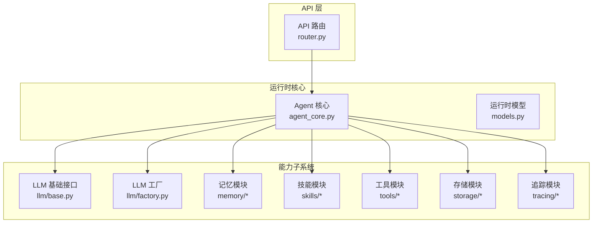
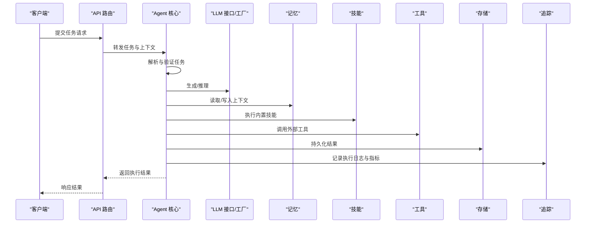
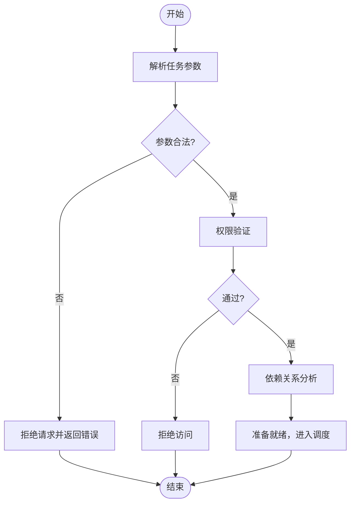
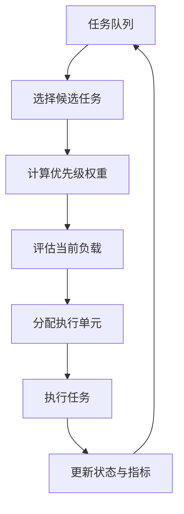
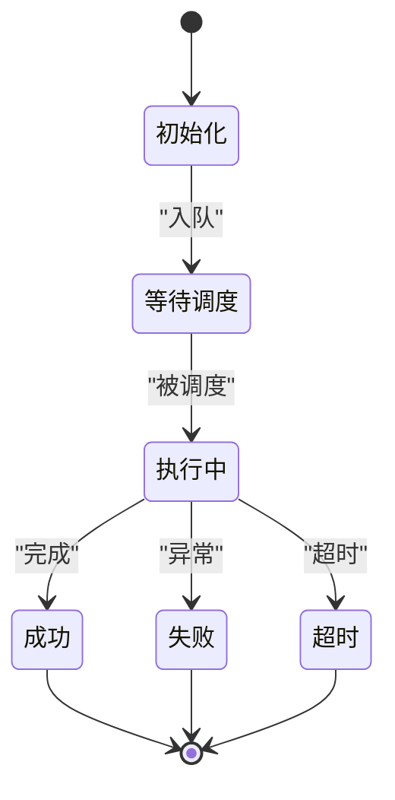
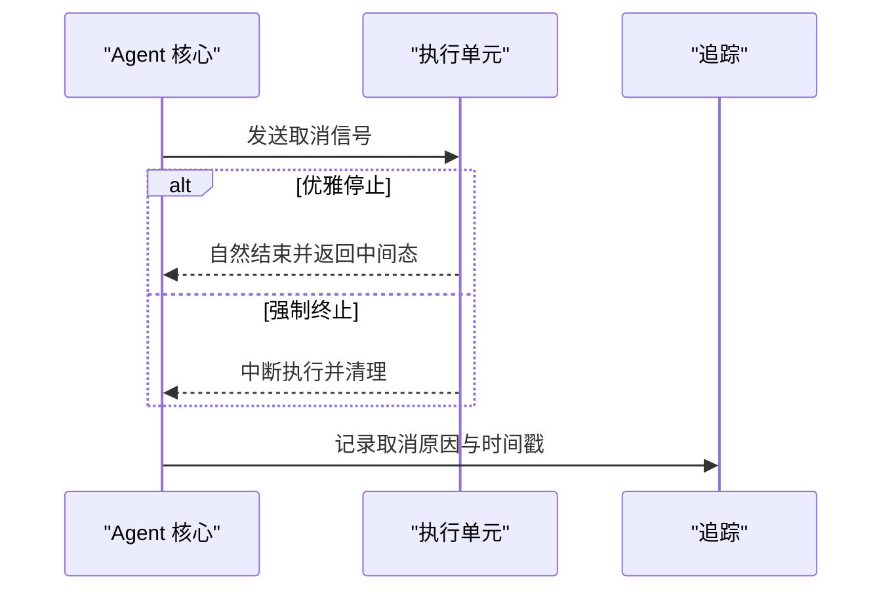
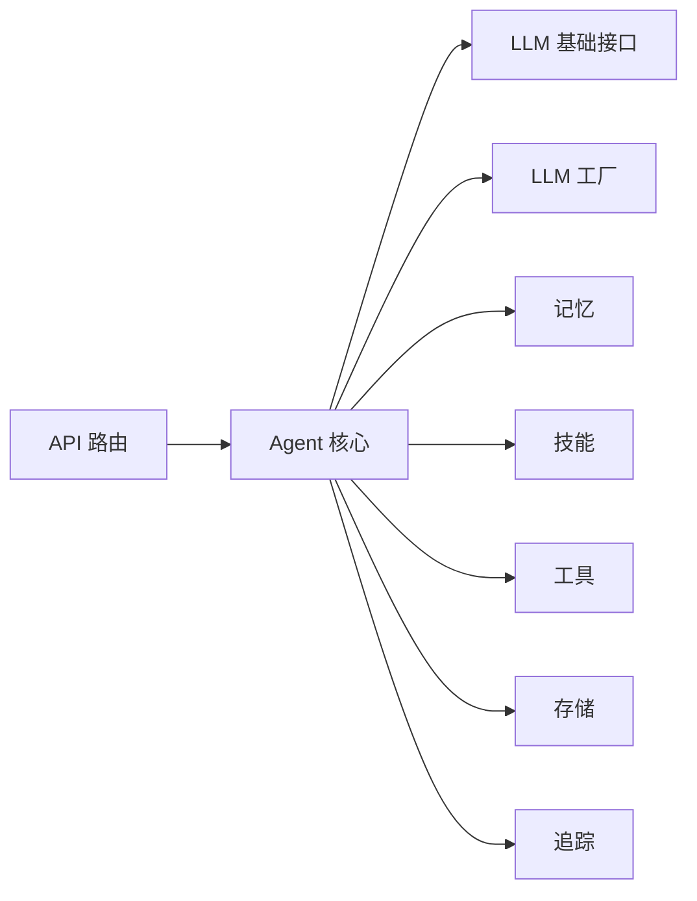

# 任务执行引擎

<cite>
**本文引用的文件**
- [backend/pyproject.toml](file://backend/pyproject.toml)
- [backend/kore/__init__.py](file://backend/kore/__init__.py)
- [backend/kore/api/router.py](file://backend/kore/api/router.py)
- [backend/kore/runtime/__init__.py](file://backend/kore/runtime/__init__.py)
- [backend/kore/runtime/agent_core.py](file://backend/kore/runtime/agent_core.py)
- [backend/kore/runtime/models.py](file://backend/kore/runtime/models.py)
- [backend/kore/llm/base.py](file://backend/kore/llm/base.py)
- [backend/kore/llm/factory.py](file://backend/kore/llm/factory.py)
- [backend/kore/memory/__init__.py](file://backend/kore/memory/__init__.py)
- [backend/kore/skills/__init__.py](file://backend/kore/skills/__init__.py)
- [backend/kore/tools/__init__.py](file://backend/kore/tools/__init__.py)
- [backend/kore/storage/__init__.py](file://backend/kore/storage/__init__.py)
- [backend/kore/tracing/__init__.py](file://backend/kore/tracing/__init__.py)
</cite>

## 目录
1. [引言](#引言)
2. [项目结构](#项目结构)
3. [核心组件](#核心组件)
4. [架构总览](#架构总览)
5. [详细组件分析](#详细组件分析)
6. [依赖分析](#依赖分析)
7. [性能考虑](#性能考虑)
8. [故障排除指南](#故障排除指南)
9. [结论](#结论)
10. [附录](#附录)

## 引言
本技术文档围绕智能体任务执行引擎进行系统化梳理，聚焦于任务队列管理、调度算法与执行监控机制的设计与实现。文档从架构视角出发，结合现有模块边界与职责划分，对任务类型（同步、异步、定时、条件）、任务解析与验证流程、调度策略（优先级、负载均衡、资源分配）、执行监控与状态跟踪、任务取消与中断机制、以及性能优化策略进行深入阐述，并提供可操作的最佳实践与排障建议。

## 项目结构
后端采用多包分层组织，核心运行时位于 runtime 包，LLM 模块负责大模型能力抽象与工厂化选择，API 层通过路由对接外部请求，记忆、工具、存储、追踪等子系统作为支撑能力存在。整体呈现“路由入口 → 运行时核心 → 能力子系统”的层次化结构。

图表来源
- [backend/kore/api/router.py](file://backend/kore/api/router.py)
- [backend/kore/runtime/agent_core.py](file://backend/kore/runtime/agent_core.py)
- [backend/kore/runtime/models.py](file://backend/kore/runtime/models.py)
- [backend/kore/llm/base.py](file://backend/kore/llm/base.py)
- [backend/kore/llm/factory.py](file://backend/kore/llm/factory.py)
- [backend/kore/memory/__init__.py](file://backend/kore/memory/__init__.py)
- [backend/kore/skills/__init__.py](file://backend/kore/skills/__init__.py)
- [backend/kore/tools/__init__.py](file://backend/kore/tools/__init__.py)
- [backend/kore/storage/__init__.py](file://backend/kore/storage/__init__.py)
- [backend/kore/tracing/__init__.py](file://backend/kore/tracing/__init__.py)

章节来源
- [backend/kore/api/router.py](file://backend/kore/api/router.py)
- [backend/kore/runtime/agent_core.py](file://backend/kore/runtime/agent_core.py)
- [backend/kore/runtime/models.py](file://backend/kore/runtime/models.py)
- [backend/kore/llm/base.py](file://backend/kore/llm/base.py)
- [backend/kore/llm/factory.py](file://backend/kore/llm/factory.py)
- [backend/kore/memory/__init__.py](file://backend/kore/memory/__init__.py)
- [backend/kore/skills/__init__.py](file://backend/kore/skills/__init__.py)
- [backend/kore/tools/__init__.py](file://backend/kore/tools/__init__.py)
- [backend/kore/storage/__init__.py](file://backend/kore/storage/__init__.py)
- [backend/kore/tracing/__init__.py](file://backend/kore/tracing/__init__.py)

## 核心组件
- Agent 核心：负责任务生命周期编排、调度与执行协调，连接 LLM、记忆、工具、存储与追踪等子系统。
- 运行时模型：承载任务元数据、状态、上下文与执行结果的数据结构。
- LLM 抽象与工厂：提供统一的大模型接口与按配置选择具体实现的能力。
- 记忆、技能、工具、存储、追踪：为任务执行提供上下文、行为能力、外部交互与可观测性支持。

章节来源
- [backend/kore/runtime/agent_core.py](file://backend/kore/runtime/agent_core.py)
- [backend/kore/runtime/models.py](file://backend/kore/runtime/models.py)
- [backend/kore/llm/base.py](file://backend/kore/llm/base.py)
- [backend/kore/llm/factory.py](file://backend/kore/llm/factory.py)
- [backend/kore/memory/__init__.py](file://backend/kore/memory/__init__.py)
- [backend/kore/skills/__init__.py](file://backend/kore/skills/__init__.py)
- [backend/kore/tools/__init__.py](file://backend/kore/tools/__init__.py)
- [backend/kore/storage/__init__.py](file://backend/kore/storage/__init__.py)
- [backend/kore/tracing/__init__.py](file://backend/kore/tracing/__init__.py)

## 架构总览
任务执行引擎以“请求路由 → 运行时核心 → 能力子系统”的链路组织。API 路由接收外部请求，交由 Agent 核心进行任务解析、校验与调度；Agent 核心根据任务类型与优先级选择执行策略，调用相应子系统完成计算或外部交互，并通过追踪模块记录执行轨迹与状态。

图表来源
- [backend/kore/api/router.py](file://backend/kore/api/router.py)
- [backend/kore/runtime/agent_core.py](file://backend/kore/runtime/agent_core.py)
- [backend/kore/llm/base.py](file://backend/kore/llm/base.py)
- [backend/kore/llm/factory.py](file://backend/kore/llm/factory.py)
- [backend/kore/memory/__init__.py](file://backend/kore/memory/__init__.py)
- [backend/kore/skills/__init__.py](file://backend/kore/skills/__init__.py)
- [backend/kore/tools/__init__.py](file://backend/kore/tools/__init__.py)
- [backend/kore/storage/__init__.py](file://backend/kore/storage/__init__.py)
- [backend/kore/tracing/__init__.py](file://backend/kore/tracing/__init__.py)

## 详细组件分析

### 任务类型与分类
- 同步任务：请求-响应式任务，需要在限定时间内返回结果，适合即时推理与简单工具调用。
- 异步任务：提交后立即返回受理，后续通过回调或轮询获取结果，适合长耗时推理或批量处理。
- 定时任务：基于时间触发的任务，支持周期性或一次性调度，需结合调度器与时间窗口管理。
- 条件任务：依赖前置条件满足后才执行，条件可来自状态、时间、外部事件或依赖结果。

上述分类在 Agent 核心中通过任务元数据与状态机进行区分与调度决策。

章节来源
- [backend/kore/runtime/models.py](file://backend/kore/runtime/models.py)
- [backend/kore/runtime/agent_core.py](file://backend/kore/runtime/agent_core.py)

### 任务解析与验证流程
- 输入参数检查：校验必填字段、格式合法性与范围约束，拒绝非法请求。
- 权限验证：基于身份与角色判断是否具备执行权限，必要时进行资源授权检查。
- 依赖关系分析：识别任务间依赖、工具依赖与外部服务依赖，确保前置条件满足后再进入执行阶段。

图表来源
- [backend/kore/runtime/agent_core.py](file://backend/kore/runtime/agent_core.py)
- [backend/kore/runtime/models.py](file://backend/kore/runtime/models.py)

章节来源
- [backend/kore/runtime/agent_core.py](file://backend/kore/runtime/agent_core.py)
- [backend/kore/runtime/models.py](file://backend/kore/runtime/models.py)

### 调度策略
- 优先级调度：根据任务紧急度、影响范围与 SLA 设置优先级，高优任务优先出队与抢占资源。
- 负载均衡：在多实例或多线程环境下，将任务均匀分配至可用执行单元，避免热点与拥塞。
- 资源分配：依据任务所需算力、内存与 I/O 预留资源配额，防止资源争抢导致的抖动。

图表来源
- [backend/kore/runtime/agent_core.py](file://backend/kore/runtime/agent_core.py)

章节来源
- [backend/kore/runtime/agent_core.py](file://backend/kore/runtime/agent_core.py)

### 执行监控与状态跟踪
- 进度报告：在长任务中定期上报进度，支持百分比、阶段描述与剩余估计。
- 异常捕获：统一异常捕获与分类，记录堆栈与上下文信息，便于回溯与修复。
- 超时处理：为每个任务设置超时阈值，超时自动中断并回滚关键状态。

图表来源
- [backend/kore/runtime/agent_core.py](file://backend/kore/runtime/agent_core.py)
- [backend/kore/tracing/__init__.py](file://backend/kore/tracing/__init__.py)

章节来源
- [backend/kore/runtime/agent_core.py](file://backend/kore/runtime/agent_core.py)
- [backend/kore/tracing/__init__.py](file://backend/kore/tracing/__init__.py)

### 任务取消与中断机制
- 优雅停止：向执行单元发送取消信号，等待当前步骤自然结束，保存中间状态并释放资源。
- 强制终止：超时或异常情况下直接中断执行，清理临时资源并标记失败。

图表来源
- [backend/kore/runtime/agent_core.py](file://backend/kore/runtime/agent_core.py)
- [backend/kore/tracing/__init__.py](file://backend/kore/tracing/__init__.py)

章节来源
- [backend/kore/runtime/agent_core.py](file://backend/kore/runtime/agent_core.py)
- [backend/kore/tracing/__init__.py](file://backend/kore/tracing/__init__.py)

### 性能优化策略
- 并发控制：限制同时执行的任务数量，避免资源过载；对 I/O 密集型任务采用异步并发。
- 批处理：对相似小任务进行合并批处理，降低调度开销与系统抖动。
- 缓存机制：对重复输入或中间结果进行缓存，减少重复计算与 I/O。

章节来源
- [backend/kore/runtime/agent_core.py](file://backend/kore/runtime/agent_core.py)
- [backend/kore/memory/__init__.py](file://backend/kore/memory/__init__.py)

### 实际使用示例与最佳实践
- 示例场景：对话式问答（同步）、批量数据处理（异步）、周期性报表生成（定时）、条件触发的告警（条件）。
- 最佳实践：
  - 明确任务 SLA 与优先级，合理设置超时与重试策略。
  - 对长任务启用进度上报与断点续传。
  - 使用追踪模块记录关键指标，建立监控告警。
  - 将高成本操作放入工具或外部服务，保持核心轻量化。

## 依赖分析
- 组件耦合：Agent 核心与各子系统通过接口解耦，LLM 工厂与基础接口提供可替换性。
- 外部依赖：通过 pyproject.toml 管理第三方库，建议在运行时核心中集中引入与版本锁定。
- 可能的循环依赖：当前结构以 API 路由与运行时为核心向外辐射，未见明显循环依赖迹象。

图表来源
- [backend/kore/api/router.py](file://backend/kore/api/router.py)
- [backend/kore/runtime/agent_core.py](file://backend/kore/runtime/agent_core.py)
- [backend/kore/llm/base.py](file://backend/kore/llm/base.py)
- [backend/kore/llm/factory.py](file://backend/kore/llm/factory.py)
- [backend/kore/memory/__init__.py](file://backend/kore/memory/__init__.py)
- [backend/kore/skills/__init__.py](file://backend/kore/skills/__init__.py)
- [backend/kore/tools/__init__.py](file://backend/kore/tools/__init__.py)
- [backend/kore/storage/__init__.py](file://backend/kore/storage/__init__.py)
- [backend/kore/tracing/__init__.py](file://backend/kore/tracing/__init__.py)

章节来源
- [backend/kore/api/router.py](file://backend/kore/api/router.py)
- [backend/kore/runtime/agent_core.py](file://backend/kore/runtime/agent_core.py)
- [backend/kore/llm/base.py](file://backend/kore/llm/base.py)
- [backend/kore/llm/factory.py](file://backend/kore/llm/factory.py)
- [backend/kore/memory/__init__.py](file://backend/kore/memory/__init__.py)
- [backend/kore/skills/__init__.py](file://backend/kore/skills/__init__.py)
- [backend/kore/tools/__init__.py](file://backend/kore/tools/__init__.py)
- [backend/kore/storage/__init__.py](file://backend/kore/storage/__init__.py)
- [backend/kore/tracing/__init__.py](file://backend/kore/tracing/__init__.py)

## 性能考虑
- 队列与调度：采用优先级队列与公平调度算法，避免饥饿与热点。
- 资源隔离：为不同优先级与类型的任务划分资源配额，保障关键路径。
- I/O 优化：对频繁 I/O 的任务进行批处理与缓存，减少网络与磁盘抖动。
- 监控与自适应：基于历史指标动态调整并发度与批大小，提升吞吐与稳定性。

## 故障排除指南
- 常见问题
  - 任务长时间无响应：检查是否存在阻塞 I/O 或死循环，启用超时与断点。
  - 结果不一致：核对依赖顺序与幂等性设计，确保状态一致性。
  - 资源不足：观察并发与内存占用，调整配额与批大小。
- 排障步骤
  - 查看追踪日志定位阶段与耗时。
  - 回放关键输入与上下文，复现问题。
  - 分离问题模块（LLM、工具、存储）逐一验证。

章节来源
- [backend/kore/tracing/__init__.py](file://backend/kore/tracing/__init__.py)
- [backend/kore/runtime/agent_core.py](file://backend/kore/runtime/agent_core.py)

## 结论
该任务执行引擎以清晰的分层架构与模块化设计为基础，围绕任务生命周期的关键环节（解析、验证、调度、执行、监控、取消）构建了可扩展的执行框架。通过优先级调度、负载均衡与资源分配策略，结合进度上报、异常捕获与超时处理，实现了稳定高效的智能体任务执行能力。建议在生产环境中进一步完善队列持久化、弹性扩缩容与可观测性指标体系，持续优化并发与批处理策略以提升整体吞吐。

## 附录
- 版本与依赖：参考项目根目录的依赖声明文件，确保运行环境与依赖版本一致。
- 开发规范：统一接口命名、错误码与日志格式，保证跨模块协作的一致性。

章节来源
- [backend/pyproject.toml](file://backend/pyproject.toml)
- [backend/kore/__init__.py](file://backend/kore/__init__.py)