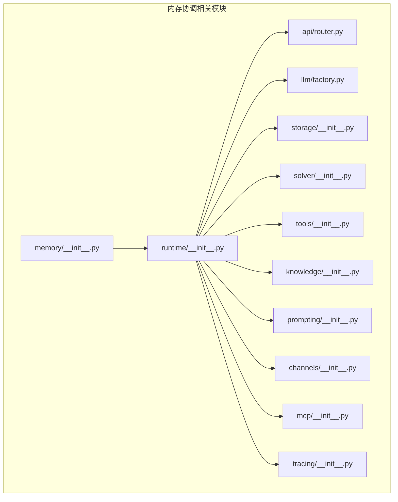
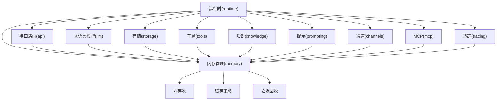
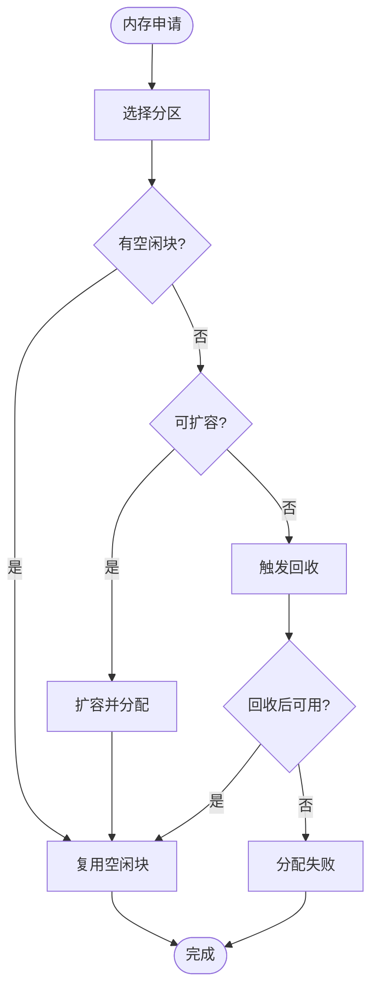
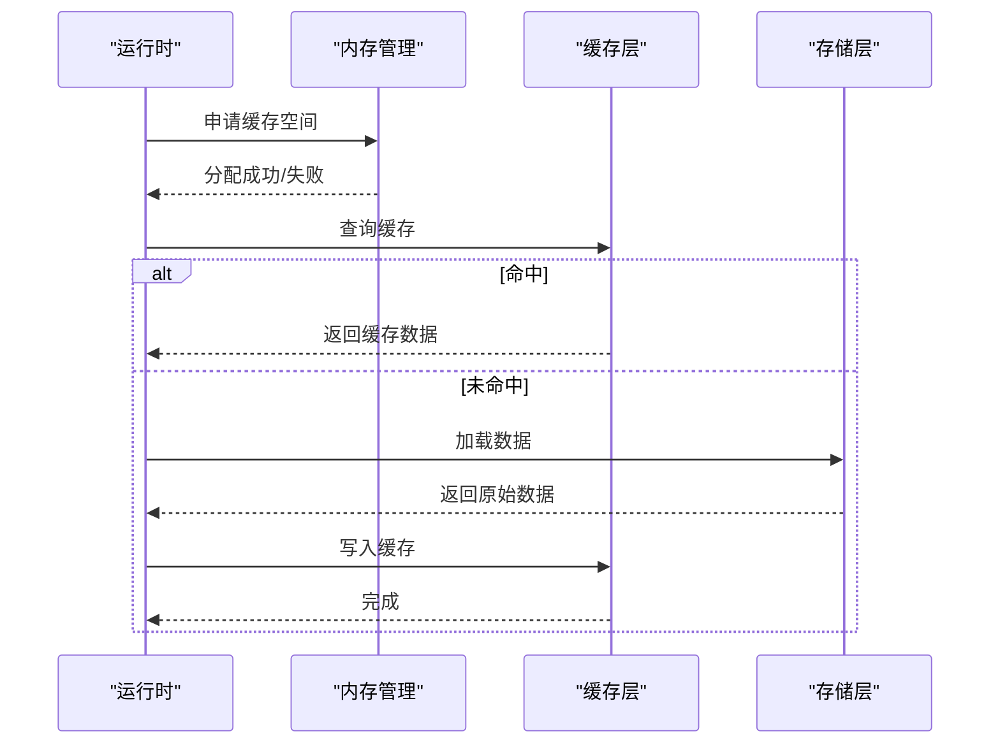
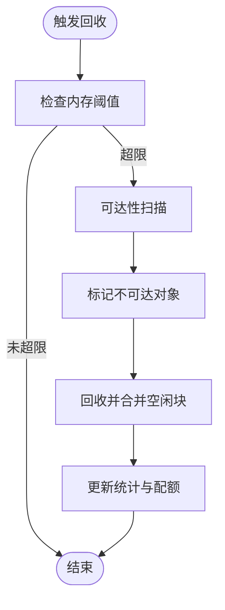
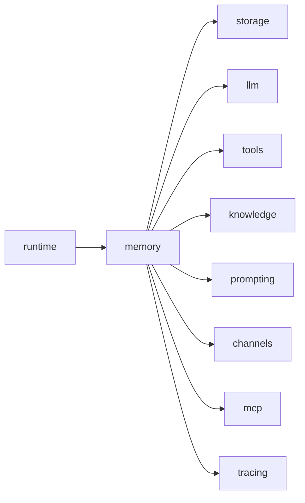

# 内存协调机制

<cite>
**本文档引用的文件**
- [backend/kore/memory/__init__.py](file://backend/kore/memory/__init__.py)
- [backend/kore/runtime/__init__.py](file://backend/kore/runtime/__init__.py)
- [backend/kore/api/router.py](file://backend/kore/api/router.py)
- [backend/kore/llm/factory.py](file://backend/kore/llm/factory.py)
- [backend/kore/storage/__init__.py](file://backend/kore/storage/__init__.py)
- [backend/kore/solver/__init__.py](file://backend/kore/solver/__init__.py)
- [backend/kore/tools/__init__.py](file://backend/kore/tools/__init__.py)
- [backend/kore/knowledge/__init__.py](file://backend/kore/knowledge/__init__.py)
- [backend/kore/prompting/__init__.py](file://backend/kore/prompting/__init__.py)
- [backend/kore/channels/__init__.py](file://backend/kore/channels/__init__.py)
- [backend/kore/mcp/__init__.py](file://backend/kore/mcp/__init__.py)
- [backend/kore/tracing/__init__.py](file://backend/kore/tracing/__init__.py)
</cite>

## 目录
1. [引言](#引言)
2. [项目结构](#项目结构)
3. [核心组件](#核心组件)
4. [架构总览](#架构总览)
5. [详细组件分析](#详细组件分析)
6. [依赖关系分析](#依赖关系分析)
7. [性能考虑](#性能考虑)
8. [故障排查指南](#故障排查指南)
9. [结论](#结论)
10. [附录](#附录)

## 引言
本文件面向智能体内存协调机制的技术文档，围绕内存池管理、缓存策略、垃圾回收、短期/长期/临时数据分类管理、内存优化（压缩、去重、碎片整理）、内存共享与隔离、监控与预警、配置与调优、故障诊断与性能分析等主题进行系统化阐述。由于当前仓库处于早期阶段，部分模块尚未实现具体功能，本文在现有代码基础上给出可扩展的架构设计与实践建议，并标注已实现与待实现的功能边界。

## 项目结构
后端采用分层与按功能域划分的组织方式，内存协调机制涉及以下关键目录：
- memory：内存管理与协调的核心模块（初始化入口）
- runtime：运行时环境与生命周期管理（初始化入口）
- api：对外接口路由（router.py）
- llm：大语言模型工厂（factory.py）
- storage：存储抽象与持久化（初始化入口）
- solver：推理求解器（初始化入口）
- tools：工具集（初始化入口）
- knowledge：知识管理（初始化入口）
- prompting：提示工程（初始化入口）
- channels：消息通道（初始化入口）
- mcp：多模态内容协议（初始化入口）
- tracing：链路追踪（初始化入口）

**图表来源**
- [backend/kore/memory/__init__.py](file://backend/kore/memory/__init__.py)
- [backend/kore/runtime/__init__.py](file://backend/kore/runtime/__init__.py)
- [backend/kore/api/router.py](file://backend/kore/api/router.py)
- [backend/kore/llm/factory.py](file://backend/kore/llm/factory.py)
- [backend/kore/storage/__init__.py](file://backend/kore/storage/__init__.py)
- [backend/kore/solver/__init__.py](file://backend/kore/solver/__init__.py)
- [backend/kore/tools/__init__.py](file://backend/kore/tools/__init__.py)
- [backend/kore/knowledge/__init__.py](file://backend/kore/knowledge/__init__.py)
- [backend/kore/prompting/__init__.py](file://backend/kore/prompting/__init__.py)
- [backend/kore/channels/__init__.py](file://backend/kore/channels/__init__.py)
- [backend/kore/mcp/__init__.py](file://backend/kore/mcp/__init__.py)
- [backend/kore/tracing/__init__.py](file://backend/kore/tracing/__init__.py)

**章节来源**
- [backend/kore/memory/__init__.py](file://backend/kore/memory/__init__.py)
- [backend/kore/runtime/__init__.py](file://backend/kore/runtime/__init__.py)
- [backend/kore/api/router.py](file://backend/kore/api/router.py)
- [backend/kore/llm/factory.py](file://backend/kore/llm/factory.py)
- [backend/kore/storage/__init__.py](file://backend/kore/storage/__init__.py)
- [backend/kore/solver/__init__.py](file://backend/kore/solver/__init__.py)
- [backend/kore/tools/__init__.py](file://backend/kore/tools/__init__.py)
- [backend/kore/knowledge/__init__.py](file://backend/kore/knowledge/__init__.py)
- [backend/kore/prompting/__init__.py](file://backend/kore/prompting/__init__.py)
- [backend/kore/channels/__init__.py](file://backend/kore/channels/__init__.py)
- [backend/kore/mcp/__init__.py](file://backend/kore/mcp/__init__.py)
- [backend/kore/tracing/__init__.py](file://backend/kore/tracing/__init__.py)

## 核心组件
- 内存管理模块（memory）：作为内存协调机制的入口，负责统一调度内存池、缓存策略与回收流程。
- 运行时模块（runtime）：承载智能体生命周期、任务调度与资源分配，是内存协调机制的执行载体。
- 接口路由（api/router.py）：对外暴露内存查询、回收、统计等接口，作为内存监控与运维的入口。
- 大语言模型工厂（llm/factory.py）：负责模型实例化与资源占用管理，需纳入内存配额与回收策略。
- 存储模块（storage）：负责数据持久化与内存映射，需配合内存池与缓存策略以降低峰值占用。
- 工具集（tools）：各类工具可能持有临时对象或缓存，需要统一的内存清理策略。
- 知识与提示（knowledge/prompting）：知识库与提示模板的加载与缓存，需纳入统一的内存管理。
- 通道与MCP：消息传递与多模态数据处理，需避免重复拷贝与冗余缓存。
- 追踪（tracing）：用于定位内存热点与泄漏路径，支撑监控与告警。

**章节来源**
- [backend/kore/memory/__init__.py](file://backend/kore/memory/__init__.py)
- [backend/kore/runtime/__init__.py](file://backend/kore/runtime/__init__.py)
- [backend/kore/api/router.py](file://backend/kore/api/router.py)
- [backend/kore/llm/factory.py](file://backend/kore/llm/factory.py)
- [backend/kore/storage/__init__.py](file://backend/kore/storage/__init__.py)
- [backend/kore/tools/__init__.py](file://backend/kore/tools/__init__.py)
- [backend/kore/knowledge/__init__.py](file://backend/kore/knowledge/__init__.py)
- [backend/kore/prompting/__init__.py](file://backend/kore/prompting/__init__.py)
- [backend/kore/channels/__init__.py](file://backend/kore/channels/__init__.py)
- [backend/kore/mcp/__init__.py](file://backend/kore/mcp/__init__.py)
- [backend/kore/tracing/__init__.py](file://backend/kore/tracing/__init__.py)

## 架构总览
内存协调机制采用“运行时驱动 + 统一内存管理 + 分层缓存”的架构。运行时负责任务编排与资源分配；内存管理模块负责内存池、缓存与回收；各功能域模块通过统一接口接入内存控制策略。

**图表来源**
- [backend/kore/runtime/__init__.py](file://backend/kore/runtime/__init__.py)
- [backend/kore/memory/__init__.py](file://backend/kore/memory/__init__.py)
- [backend/kore/api/router.py](file://backend/kore/api/router.py)
- [backend/kore/llm/factory.py](file://backend/kore/llm/factory.py)
- [backend/kore/storage/__init__.py](file://backend/kore/storage/__init__.py)
- [backend/kore/tools/__init__.py](file://backend/kore/tools/__init__.py)
- [backend/kore/knowledge/__init__.py](file://backend/kore/knowledge/__init__.py)
- [backend/kore/prompting/__init__.py](file://backend/kore/prompting/__init__.py)
- [backend/kore/channels/__init__.py](file://backend/kore/channels/__init__.py)
- [backend/kore/mcp/__init__.py](file://backend/kore/mcp/__init__.py)
- [backend/kore/tracing/__init__.py](file://backend/kore/tracing/__init__.py)

## 详细组件分析

### 内存池管理（Memory Pool Management）
- 设计理念
  - 按用途分层：短期记忆（会话缓存、推理中间结果）、长期记忆（知识库、模型权重）、临时数据（请求上下文、中间变量）。
  - 动态配额：为不同模块设定内存上限，防止某一模块过度占用导致系统级内存压力。
  - 分区策略：堆外/堆内分区、大对象与小对象分离，减少碎片与GC停顿。
- 关键流程
  - 申请：根据对象大小选择合适分区，优先使用空闲块，不足时触发扩容或回收。
  - 归还：立即释放至对应分区，延迟合并以减少碎片。
  - 扩容：当可用空间低于阈值时，触发预设的扩容策略（如扩容倍数、阈值比例）。
  - 回收：周期性扫描与主动回收结合，优先回收不活跃对象。
- 与运行时集成
  - 在运行时启动时初始化内存池，为后续模块提供统一的分配/回收接口。
  - 在任务结束时自动回收该任务专属的临时内存。

**图表来源**
- [backend/kore/memory/__init__.py](file://backend/kore/memory/__init__.py)
- [backend/kore/runtime/__init__.py](file://backend/kore/runtime/__init__.py)

**章节来源**
- [backend/kore/memory/__init__.py](file://backend/kore/memory/__init__.py)
- [backend/kore/runtime/__init__.py](file://backend/kore/runtime/__init__.py)

### 缓存策略（Cache Strategy）
- 分类缓存
  - 短期缓存：基于LRU/LFU的会话缓存，结合TTL失效，适合频繁访问但易过期的数据。
  - 长期缓存：基于分级缓存（内存+SSD），对热点知识与模型参数进行持久化缓存。
  - 临时缓存：任务级缓存，随任务生命周期销毁。
- 命中与淘汰
  - 命中优先从内存缓存读取，未命中回源并写入缓存。
  - 淘汰策略与内存池联动，确保缓存占用不超过配额。
- 与存储协同
  - 缓存层与存储层通过一致性协议保证数据一致性，避免脏读与重复加载。

**图表来源**
- [backend/kore/memory/__init__.py](file://backend/kore/memory/__init__.py)
- [backend/kore/storage/__init__.py](file://backend/kore/storage/__init__.py)

**章节来源**
- [backend/kore/memory/__init__.py](file://backend/kore/memory/__init__.py)
- [backend/kore/storage/__init__.py](file://backend/kore/storage/__init__.py)

### 垃圾回收机制（Garbage Collection）
- 触发条件
  - 内存使用率超过阈值、缓存容量超限、任务结束。
- 回收策略
  - 分代回收：区分新老对象，优先回收新生代。
  - 可达性分析：基于引用计数与根集扫描，识别不可达对象。
  - 延迟清理：对大对象采用延迟释放，避免阻塞主线程。
- 与运行时集成
  - 在运行时的关键节点（任务切换、批量处理结束）触发回收。
  - 对模型权重与知识库对象采用特殊回收策略，避免重复加载。

**图表来源**
- [backend/kore/memory/__init__.py](file://backend/kore/memory/__init__.py)
- [backend/kore/runtime/__init__.py](file://backend/kore/runtime/__init__.py)

**章节来源**
- [backend/kore/memory/__init__.py](file://backend/kore/memory/__init__.py)
- [backend/kore/runtime/__init__.py](file://backend/kore/runtime/__init__.py)

### 智能体内存使用模式
- 短期记忆：会话上下文、推理中间结果、最近访问的知识片段。
- 长期记忆：知识库、模型权重、训练样本摘要。
- 临时数据：请求解析结果、中间计算缓冲、日志与追踪数据。
- 管理要点
  - 明确生命周期：短期与临时数据随任务销毁，长期数据持久化并定期压缩。
  - 分层存储：热数据驻留内存，温/冷数据下沉到存储层。
  - 压缩与去重：对重复文本、向量相似度高的条目进行去重与压缩。

**章节来源**
- [backend/kore/memory/__init__.py](file://backend/kore/memory/__init__.py)
- [backend/kore/knowledge/__init__.py](file://backend/kore/knowledge/__init__.py)
- [backend/kore/prompting/__init__.py](file://backend/kore/prompting/__init__.py)

### 内存优化技术
- 内存压缩：对文本与数值序列采用无损/有损压缩，降低峰值占用。
- 去重算法：基于哈希与相似度检测，移除重复或高度相似的数据。
- 碎片整理：周期性合并空闲块，维护连续可用区域，减少分配失败。
- 与LLM集成：对注意力矩阵与激活张量采用分块与量化策略，显著降低显存/内存占用。

**章节来源**
- [backend/kore/memory/__init__.py](file://backend/kore/memory/__init__.py)
- [backend/kore/llm/factory.py](file://backend/kore/llm/factory.py)

### 内存共享与隔离
- 进程内共享：通过只读缓存与不可变对象实现共享，避免复制开销。
- 跨进程通信：采用序列化/反序列化与共享内存（如平台支持）实现数据同步。
- 隔离策略：为不同任务/用户分配独立的内存命名空间，防止相互污染。

**章节来源**
- [backend/kore/memory/__init__.py](file://backend/kore/memory/__init__.py)
- [backend/kore/channels/__init__.py](file://backend/kore/channels/__init__.py)
- [backend/kore/mcp/__init__.py](file://backend/kore/mcp/__init__.py)

### 内存监控与预警
- 监控指标：内存使用率、分配速率、回收频率、缓存命中率、碎片率。
- 告警规则：使用率超过阈值、回收频率异常升高、缓存命中率骤降。
- 追踪与诊断：结合链路追踪定位高占用操作，输出内存快照与热点分析报告。

**章节来源**
- [backend/kore/api/router.py](file://backend/kore/api/router.py)
- [backend/kore/tracing/__init__.py](file://backend/kore/tracing/__init__.py)

### 配置与调优指南
- 内存限制：为全局与模块级设置硬/软上限，动态调整回收阈值。
- 缓存大小：根据QPS与数据特征调整缓存容量与淘汰策略。
- 回收策略：在低延迟场景提高回收频率，在高吞吐场景延长回收周期。
- LLM参数：调整批大小、序列长度与量化级别，平衡性能与内存占用。

**章节来源**
- [backend/kore/memory/__init__.py](file://backend/kore/memory/__init__.py)
- [backend/kore/llm/factory.py](file://backend/kore/llm/factory.py)

### 故障诊断与性能分析
- 常见问题
  - 内存泄漏：检查长生命周期对象引用，确认任务结束后释放。
  - 缓存污染：验证TTL与淘汰策略，避免陈旧数据占用空间。
  - 回收风暴：降低回收频率或扩大配额，缓解抖动。
- 分析方法
  - 快照对比：比较正常与异常状态下的内存分布。
  - 热点定位：结合追踪信息定位高占用函数与数据结构。
  - 压力测试：模拟高并发与大数据量场景，观察内存曲线。

**章节来源**
- [backend/kore/memory/__init__.py](file://backend/kore/memory/__init__.py)
- [backend/kore/tracing/__init__.py](file://backend/kore/tracing/__init__.py)

## 依赖关系分析
- 模块耦合
  - 运行时对内存管理存在强依赖，内存管理对存储与LLM存在弱依赖。
  - 缓存与存储通过统一接口交互，避免直接耦合。
- 外部依赖
  - Python标准库（collections、gc等）用于缓存与回收。
  - 第三方库（如numpy、torch）用于数值与模型内存管理，需纳入统一回收策略。

**图表来源**
- [backend/kore/runtime/__init__.py](file://backend/kore/runtime/__init__.py)
- [backend/kore/memory/__init__.py](file://backend/kore/memory/__init__.py)
- [backend/kore/storage/__init__.py](file://backend/kore/storage/__init__.py)
- [backend/kore/llm/factory.py](file://backend/kore/llm/factory.py)
- [backend/kore/tools/__init__.py](file://backend/kore/tools/__init__.py)
- [backend/kore/knowledge/__init__.py](file://backend/kore/knowledge/__init__.py)
- [backend/kore/prompting/__init__.py](file://backend/kore/prompting/__init__.py)
- [backend/kore/channels/__init__.py](file://backend/kore/channels/__init__.py)
- [backend/kore/mcp/__init__.py](file://backend/kore/mcp/__init__.py)
- [backend/kore/tracing/__init__.py](file://backend/kore/tracing/__init__.py)

**章节来源**
- [backend/kore/runtime/__init__.py](file://backend/kore/runtime/__init__.py)
- [backend/kore/memory/__init__.py](file://backend/kore/memory/__init__.py)
- [backend/kore/storage/__init__.py](file://backend/kore/storage/__init__.py)
- [backend/kore/llm/factory.py](file://backend/kore/llm/factory.py)
- [backend/kore/tools/__init__.py](file://backend/kore/tools/__init__.py)
- [backend/kore/knowledge/__init__.py](file://backend/kore/knowledge/__init__.py)
- [backend/kore/prompting/__init__.py](file://backend/kore/prompting/__init__.py)
- [backend/kore/channels/__init__.py](file://backend/kore/channels/__init__.py)
- [backend/kore/mcp/__init__.py](file://backend/kore/mcp/__init__.py)
- [backend/kore/tracing/__init__.py](file://backend/kore/tracing/__init__.py)

## 性能考虑
- 分配与回收的平衡：在高并发场景下，减少锁竞争与碎片，提升吞吐。
- 缓存命中率：通过预热与热点预测提升命中率，降低回源成本。
- LLM内存优化：采用分块、量化与流水线策略，降低峰值占用。
- I/O与内存协同：对冷数据采用异步加载与懒加载，避免阻塞主线程。

## 故障排查指南
- 泄漏检测：定期巡检长生命周期对象，核对引用链。
- 缓存异常：检查TTL与淘汰策略配置，核对缓存一致性。
- 回收异常：监控回收频率与耗时，必要时调整策略参数。
- 日志与追踪：结合追踪信息定位热点与异常路径。

**章节来源**
- [backend/kore/memory/__init__.py](file://backend/kore/memory/__init__.py)
- [backend/kore/tracing/__init__.py](file://backend/kore/tracing/__init__.py)

## 结论
当前仓库提供了内存协调机制的高层架构与模块边界，具体实现仍需在各模块中落地。建议优先完善内存池、缓存与回收策略的实现，并与运行时、存储、LLM等模块深度集成，形成可观测、可调优、可扩展的内存管理体系。

## 附录
- 已实现模块：memory、runtime、api、storage、solver、tools、knowledge、prompting、channels、mcp、tracing 的初始化入口。
- 待实现模块：内存池、缓存策略、垃圾回收的具体实现逻辑，以及与LLM、存储的深度集成细节。