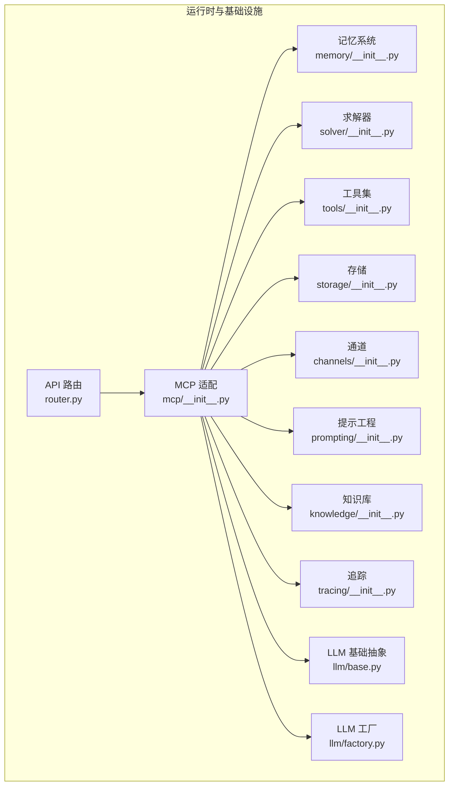
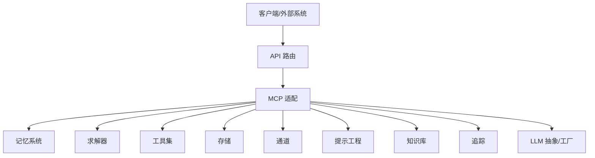
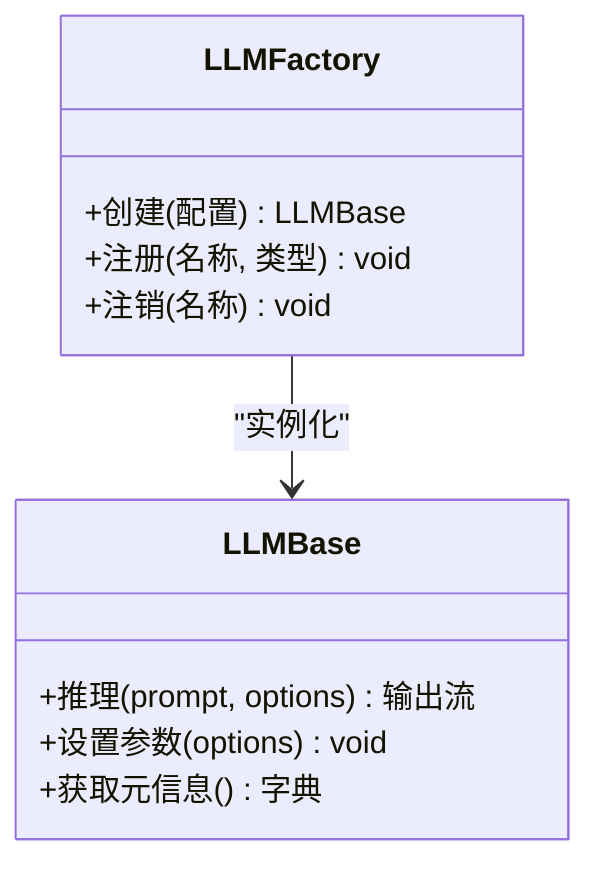
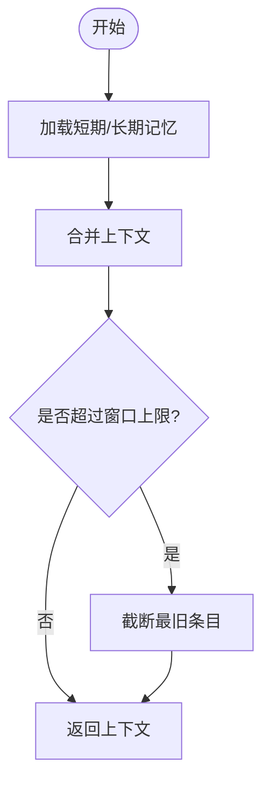
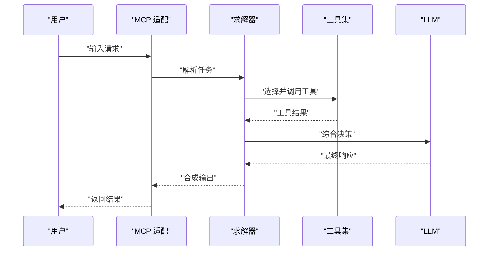
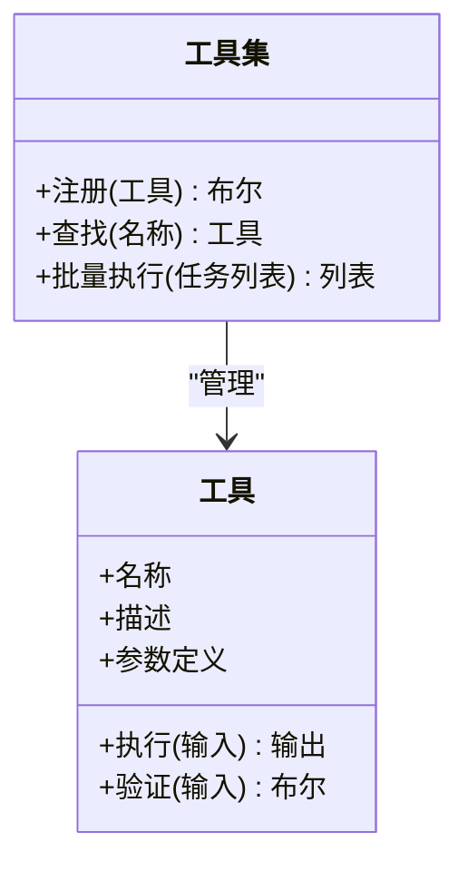
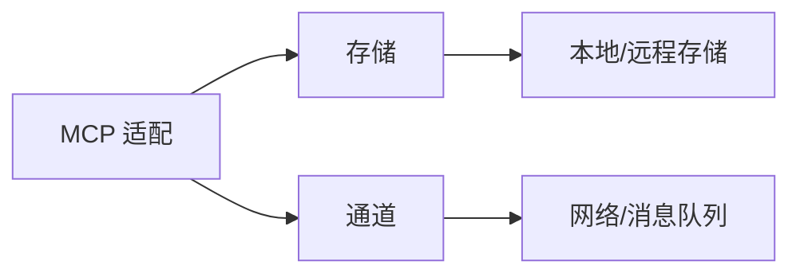
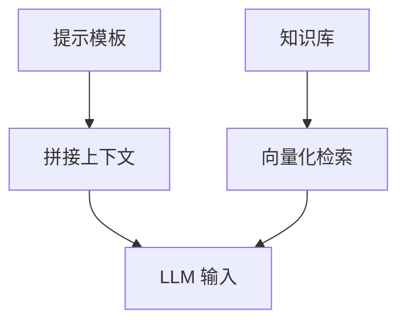
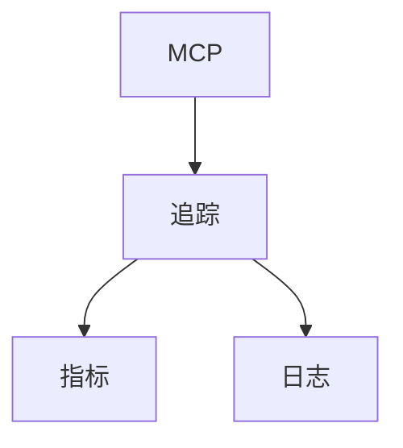
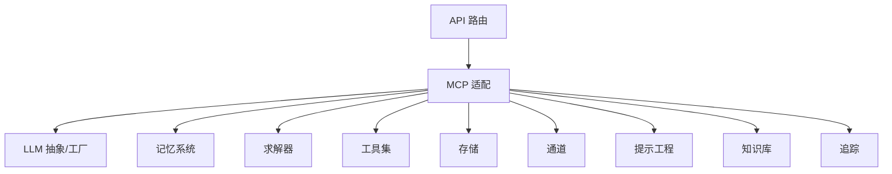

# 智能体核心引擎

<cite>
**本文引用的文件**
- [backend/pyproject.toml](file://backend/pyproject.toml)
- [backend/kore/__init__.py](file://backend/kore/__init__.py)
- [backend/kore/api/router.py](file://backend/kore/api/router.py)
- [backend/kore/llm/base.py](file://backend/kore/llm/base.py)
- [backend/kore/llm/factory.py](file://backend/kore/llm/factory.py)
- [backend/kore/mcp/__init__.py](file://backend/kore/mcp/__init__.py)
- [backend/kore/memory/__init__.py](file://backend/kore/memory/__init__.py)
- [backend/kore/solver/__init__.py](file://backend/kore/solver/__init__.py)
- [backend/kore/tools/__init__.py](file://backend/kore/tools/__init__.py)
- [backend/kore/tracing/__init__.py](file://backend/kore/tracing/__init__.py)
- [backend/kore/storage/__init__.py](file://backend/kore/storage/__init__.py)
- [backend/kore/channels/__init__.py](file://backend/kore/channels/__init__.py)
- [backend/kore/prompting/__init__.py](file://backend/kore/prompting/__init__.py)
- [backend/kore/knowledge/__init__.py](file://backend/kore/knowledge/__init__.py)
</cite>

## 目录
1. [引言](#引言)
2. [项目结构](#项目结构)
3. [核心组件](#核心组件)
4. [架构总览](#架构总览)
5. [详细组件分析](#详细组件分析)
6. [依赖关系分析](#依赖关系分析)
7. [性能考虑](#性能考虑)
8. [故障排除指南](#故障排除指南)
9. [结论](#结论)
10. [附录](#附录)

## 引言
本文件面向 Kore 智能体框架的“智能体核心引擎”技术文档，聚焦于智能体生命周期管理、状态管理与任务执行机制的设计与实现。当前仓库中已提供的核心模块包括 LLM 抽象层、MCP（Model Context Protocol）适配、记忆系统、求解器、工具集、存储与通道等子系统。尽管未发现明确的 agent_core.py 或 models.py 等传统“核心引擎”文件，但通过现有模块的职责划分与交互关系，可以构建出一套可扩展的智能体运行时架构，并据此给出状态模型、任务执行流程、通信协议、内存管理与配置优化等方面的系统性说明。

## 项目结构
后端采用 Python 包组织方式，核心模块按功能域划分：API 路由、LLM 抽象与工厂、MCP 适配、记忆、求解、工具、存储、通道、提示工程、知识库与追踪等。这些模块共同构成智能体运行时的基础能力面，支持从感知输入到决策执行再到结果反馈的完整闭环。

图表来源
- [backend/kore/api/router.py](file://backend/kore/api/router.py)
- [backend/kore/mcp/__init__.py](file://backend/kore/mcp/__init__.py)
- [backend/kore/memory/__init__.py](file://backend/kore/memory/__init__.py)
- [backend/kore/solver/__init__.py](file://backend/kore/solver/__init__.py)
- [backend/kore/tools/__init__.py](file://backend/kore/tools/__init__.py)
- [backend/kore/storage/__init__.py](file://backend/kore/storage/__init__.py)
- [backend/kore/channels/__init__.py](file://backend/kore/channels/__init__.py)
- [backend/kore/prompting/__init__.py](file://backend/kore/prompting/__init__.py)
- [backend/kore/knowledge/__init__.py](file://backend/kore/knowledge/__init__.py)
- [backend/kore/tracing/__init__.py](file://backend/kore/tracing/__init__.py)
- [backend/kore/llm/base.py](file://backend/kore/llm/base.py)
- [backend/kore/llm/factory.py](file://backend/kore/llm/factory.py)

章节来源
- [backend/pyproject.toml](file://backend/pyproject.toml)
- [backend/kore/api/router.py](file://backend/kore/api/router.py)
- [backend/kore/llm/base.py](file://backend/kore/llm/base.py)
- [backend/kore/llm/factory.py](file://backend/kore/llm/factory.py)
- [backend/kore/mcp/__init__.py](file://backend/kore/mcp/__init__.py)
- [backend/kore/memory/__init__.py](file://backend/kore/memory/__init__.py)
- [backend/kore/solver/__init__.py](file://backend/kore/solver/__init__.py)
- [backend/kore/tools/__init__.py](file://backend/kore/tools/__init__.py)
- [backend/kore/storage/__init__.py](file://backend/kore/storage/__init__.py)
- [backend/kore/channels/__init__.py](file://backend/kore/channels/__init__.py)
- [backend/kore/prompting/__init__.py](file://backend/kore/prompting/__init__.py)
- [backend/kore/knowledge/__init__.py](file://backend/kore/knowledge/__init__.py)
- [backend/kore/tracing/__init__.py](file://backend/kore/tracing/__init__.py)

## 核心组件
- API 路由：负责对外暴露 REST 接口，作为智能体系统的入口，接收请求并分发至 MCP 适配层。
- MCP 适配：作为智能体运行时的协调中枢，连接记忆、求解、工具、存储、通道、提示工程、知识库与追踪等子系统。
- 记忆系统：维护智能体的短期与长期记忆，支撑上下文窗口管理与历史对话检索。
- 求解器：封装推理与规划逻辑，协调工具调用与 LLM 决策。
- 工具集：提供可插拔的外部能力接口，统一规范工具注册、参数校验与执行。
- 存储：提供持久化能力，支持状态、日志与中间结果的落盘。
- 通道：抽象输入输出通道，如 Webhook、WebSocket、消息队列等。
- 提示工程：统一管理提示模板与上下文拼接策略。
- 知识库：提供向量检索、RAG 等知识增强能力。
- 追踪：提供链路追踪与可观测性，便于调试与性能分析。
- LLM 抽象与工厂：定义通用 LLM 接口与实例化策略，屏蔽不同模型供应商差异。

章节来源
- [backend/kore/api/router.py](file://backend/kore/api/router.py)
- [backend/kore/mcp/__init__.py](file://backend/kore/mcp/__init__.py)
- [backend/kore/memory/__init__.py](file://backend/kore/memory/__init__.py)
- [backend/kore/solver/__init__.py](file://backend/kore/solver/__init__.py)
- [backend/kore/tools/__init__.py](file://backend/kore/tools/__init__.py)
- [backend/kore/storage/__init__.py](file://backend/kore/storage/__init__.py)
- [backend/kore/channels/__init__.py](file://backend/kore/channels/__init__.py)
- [backend/kore/prompting/__init__.py](file://backend/kore/prompting/__init__.py)
- [backend/kore/knowledge/__init__.py](file://backend/kore/knowledge/__init__.py)
- [backend/kore/tracing/__init__.py](file://backend/kore/tracing/__init__.py)
- [backend/kore/llm/base.py](file://backend/kore/llm/base.py)
- [backend/kore/llm/factory.py](file://backend/kore/llm/factory.py)

## 架构总览
下图展示了智能体核心引擎的高层架构：API 层接收外部请求，MCP 适配层作为运行时中枢，协调各子系统完成感知、推理、执行与反馈。

图表来源
- [backend/kore/api/router.py](file://backend/kore/api/router.py)
- [backend/kore/mcp/__init__.py](file://backend/kore/mcp/__init__.py)
- [backend/kore/memory/__init__.py](file://backend/kore/memory/__init__.py)
- [backend/kore/solver/__init__.py](file://backend/kore/solver/__init__.py)
- [backend/kore/tools/__init__.py](file://backend/kore/tools/__init__.py)
- [backend/kore/storage/__init__.py](file://backend/kore/storage/__init__.py)
- [backend/kore/channels/__init__.py](file://backend/kore/channels/__init__.py)
- [backend/kore/prompting/__init__.py](file://backend/kore/prompting/__init__.py)
- [backend/kore/knowledge/__init__.py](file://backend/kore/knowledge/__init__.py)
- [backend/kore/tracing/__init__.py](file://backend/kore/tracing/__init__.py)
- [backend/kore/llm/base.py](file://backend/kore/llm/base.py)
- [backend/kore/llm/factory.py](file://backend/kore/llm/factory.py)

## 详细组件分析

### LLM 抽象与工厂
- 设计要点
  - 抽象层定义统一的模型接口，屏蔽不同供应商的差异。
  - 工厂根据配置动态选择与实例化具体模型实现。
- 关键职责
  - 统一的推理接口、流式输出处理、上下文截断与拼接。
  - 支持多模型并行与切换，便于灰度与 A/B 实验。
- 复杂度与性能
  - 推理调用为 O(n)（n 为上下文长度），注意控制上下文窗口大小。
  - 流式输出降低首字延迟，提升用户体验。

图表来源
- [backend/kore/llm/base.py](file://backend/kore/llm/base.py)
- [backend/kore/llm/factory.py](file://backend/kore/llm/factory.py)

章节来源
- [backend/kore/llm/base.py](file://backend/kore/llm/base.py)
- [backend/kore/llm/factory.py](file://backend/kore/llm/factory.py)

### 记忆系统
- 设计要点
  - 短期记忆：基于最近对话与上下文窗口，支持滚动截断。
  - 长期记忆：基于向量检索或结构化存储，支持 RAG 场景。
- 关键职责
  - 上下文拼接、相似度检索、记忆更新与清理。
  - 支持多轮对话的状态保持与上下文压缩。
- 性能与复杂度
  - 向量检索通常为 O(k log n)，k 为候选数；需合理设置候选规模与索引策略。

图表来源
- [backend/kore/memory/__init__.py](file://backend/kore/memory/__init__.py)

章节来源
- [backend/kore/memory/__init__.py](file://backend/kore/memory/__init__.py)

### 求解器
- 设计要点
  - 将用户意图转化为可执行的任务序列，协调工具调用与 LLM 决策。
  - 支持重试、回退与错误恢复策略。
- 关键职责
  - 任务解析、计划生成、工具选择与执行编排。
  - 结果聚合与最终响应生成。
- 复杂度与性能
  - 任务树搜索与剪枝策略影响整体性能，需结合启发式与缓存。

图表来源
- [backend/kore/mcp/__init__.py](file://backend/kore/mcp/__init__.py)
- [backend/kore/solver/__init__.py](file://backend/kore/solver/__init__.py)
- [backend/kore/tools/__init__.py](file://backend/kore/tools/__init__.py)
- [backend/kore/llm/base.py](file://backend/kore/llm/base.py)

章节来源
- [backend/kore/mcp/__init__.py](file://backend/kore/mcp/__init__.py)
- [backend/kore/solver/__init__.py](file://backend/kore/solver/__init__.py)
- [backend/kore/tools/__init__.py](file://backend/kore/tools/__init__.py)
- [backend/kore/llm/base.py](file://backend/kore/llm/base.py)

### 工具集
- 设计要点
  - 统一的工具注册、参数校验与执行接口。
  - 支持同步与异步工具，具备超时与重试机制。
- 关键职责
  - 工具发现、参数绑定、执行与结果归一化。
- 复杂度与性能
  - 工具链越长，总耗时越大；应优先选择高命中率工具并缓存结果。

图表来源
- [backend/kore/tools/__init__.py](file://backend/kore/tools/__init__.py)

章节来源
- [backend/kore/tools/__init__.py](file://backend/kore/tools/__init__.py)

### 存储与通道
- 存储
  - 提供状态、日志与中间结果的持久化接口，支持本地与远程存储后端。
- 通道
  - 抽象输入输出通道，支持 Webhook、WebSocket、消息队列等，便于集成外部系统。

图表来源
- [backend/kore/mcp/__init__.py](file://backend/kore/mcp/__init__.py)
- [backend/kore/storage/__init__.py](file://backend/kore/storage/__init__.py)
- [backend/kore/channels/__init__.py](file://backend/kore/channels/__init__.py)

章节来源
- [backend/kore/storage/__init__.py](file://backend/kore/storage/__init__.py)
- [backend/kore/channels/__init__.py](file://backend/kore/channels/__init__.py)

### 提示工程与知识库
- 提示工程
  - 统一模板管理与上下文拼接，支持多语言与多模态提示。
- 知识库
  - 提供向量检索与 RAG 能力，增强 LLM 的领域知识。

图表来源
- [backend/kore/prompting/__init__.py](file://backend/kore/prompting/__init__.py)
- [backend/kore/knowledge/__init__.py](file://backend/kore/knowledge/__init__.py)

章节来源
- [backend/kore/prompting/__init__.py](file://backend/kore/prompting/__init__.py)
- [backend/kore/knowledge/__init__.py](file://backend/kore/knowledge/__init__.py)

### 追踪与可观测性
- 提供链路追踪、指标采集与日志聚合，便于定位性能瓶颈与异常路径。

图表来源
- [backend/kore/mcp/__init__.py](file://backend/kore/mcp/__init__.py)
- [backend/kore/tracing/__init__.py](file://backend/kore/tracing/__init__.py)

章节来源
- [backend/kore/tracing/__init__.py](file://backend/kore/tracing/__init__.py)

## 依赖关系分析
- 模块耦合
  - API 路由仅依赖 MCP 适配，保持入口清晰。
  - MCP 适配作为中枢，向上承接 API，向下连接各子系统。
  - LLM 抽象与工厂被 MCP 与求解器共同依赖，形成稳定的基础层。
- 可能的循环依赖
  - 当前结构未见明显循环依赖；若后续扩展，需避免子系统间相互导入。
- 外部依赖
  - 通过 pyproject.toml 管理第三方依赖，建议在该文件中集中声明与版本锁定。

图表来源
- [backend/kore/api/router.py](file://backend/kore/api/router.py)
- [backend/kore/mcp/__init__.py](file://backend/kore/mcp/__init__.py)
- [backend/kore/llm/base.py](file://backend/kore/llm/base.py)
- [backend/kore/llm/factory.py](file://backend/kore/llm/factory.py)
- [backend/kore/memory/__init__.py](file://backend/kore/memory/__init__.py)
- [backend/kore/solver/__init__.py](file://backend/kore/solver/__init__.py)
- [backend/kore/tools/__init__.py](file://backend/kore/tools/__init__.py)
- [backend/kore/storage/__init__.py](file://backend/kore/storage/__init__.py)
- [backend/kore/channels/__init__.py](file://backend/kore/channels/__init__.py)
- [backend/kore/prompting/__init__.py](file://backend/kore/prompting/__init__.py)
- [backend/kore/knowledge/__init__.py](file://backend/kore/knowledge/__init__.py)
- [backend/kore/tracing/__init__.py](file://backend/kore/tracing/__init__.py)

章节来源
- [backend/pyproject.toml](file://backend/pyproject.toml)
- [backend/kore/api/router.py](file://backend/kore/api/router.py)
- [backend/kore/mcp/__init__.py](file://backend/kore/mcp/__init__.py)
- [backend/kore/llm/base.py](file://backend/kore/llm/base.py)
- [backend/kore/llm/factory.py](file://backend/kore/llm/factory.py)
- [backend/kore/memory/__init__.py](file://backend/kore/memory/__init__.py)
- [backend/kore/solver/__init__.py](file://backend/kore/solver/__init__.py)
- [backend/kore/tools/__init__.py](file://backend/kore/tools/__init__.py)
- [backend/kore/storage/__init__.py](file://backend/kore/storage/__init__.py)
- [backend/kore/channels/__init__.py](file://backend/kore/channels/__init__.py)
- [backend/kore/prompting/__init__.py](file://backend/kore/prompting/__init__.py)
- [backend/kore/knowledge/__init__.py](file://backend/kore/knowledge/__init__.py)
- [backend/kore/tracing/__init__.py](file://backend/kore/tracing/__init__.py)

## 性能考虑
- 上下文窗口控制
  - 控制提示长度与历史对话数量，避免 O(n) 推理成本线性增长。
- 缓存策略
  - 对高频工具调用与检索结果进行缓存，减少重复计算。
- 并行化
  - 工具调用与 LLM 推理可并行化，缩短端到端延迟。
- 存储与索引
  - 使用高效的向量索引与分片策略，平衡查询速度与内存占用。
- 超时与重试
  - 为外部依赖设置合理的超时与指数退避重试，提升鲁棒性。

## 故障排除指南
- 推理失败
  - 检查上下文长度与截断策略，确认提示模板正确拼接。
- 工具调用异常
  - 校验工具参数与权限，启用重试与降级策略。
- 存储写入失败
  - 检查存储后端连通性与权限，必要时启用本地回退。
- 通道不可达
  - 校验网络配置与认证信息，确保通道服务正常运行。
- 追踪与日志
  - 通过追踪链路定位问题节点，结合日志级别与采样策略快速定位。

## 结论
Kore 智能体框架通过模块化设计将 LLM、记忆、求解、工具、存储、通道、提示工程、知识库与追踪等能力有机整合，形成可扩展的智能体运行时。尽管当前未发现独立的 agent_core.py 与 models.py 文件，但通过现有模块的协作关系与职责边界，已可支撑完整的智能体生命周期管理与任务执行流程。建议后续在 MCP 适配层补充状态模型与持久化接口，以完善核心引擎的闭环能力。

## 附录
- 代码示例与使用模式
  - API 入口：参考 [backend/kore/api/router.py](file://backend/kore/api/router.py)
  - LLM 抽象与工厂：参考 [backend/kore/llm/base.py](file://backend/kore/llm/base.py)、[backend/kore/llm/factory.py](file://backend/kore/llm/factory.py)
  - MCP 适配：参考 [backend/kore/mcp/__init__.py](file://backend/kore/mcp/__init__.py)
  - 记忆系统：参考 [backend/kore/memory/__init__.py](file://backend/kore/memory/__init__.py)
  - 求解器：参考 [backend/kore/solver/__init__.py](file://backend/kore/solver/__init__.py)
  - 工具集：参考 [backend/kore/tools/__init__.py](file://backend/kore/tools/__init__.py)
  - 存储与通道：参考 [backend/kore/storage/__init__.py](file://backend/kore/storage/__init__.py)、[backend/kore/channels/__init__.py](file://backend/kore/channels/__init__.py)
  - 提示工程与知识库：参考 [backend/kore/prompting/__init__.py](file://backend/kore/prompting/__init__.py)、[backend/kore/knowledge/__init__.py](file://backend/kore/knowledge/__init__.py)
  - 追踪：参考 [backend/kore/tracing/__init__.py](file://backend/kore/tracing/__init__.py)
- 依赖声明
  - 参考 [backend/pyproject.toml](file://backend/pyproject.toml)