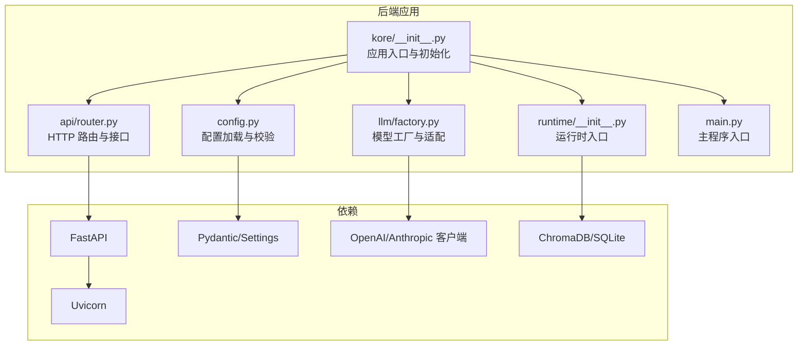
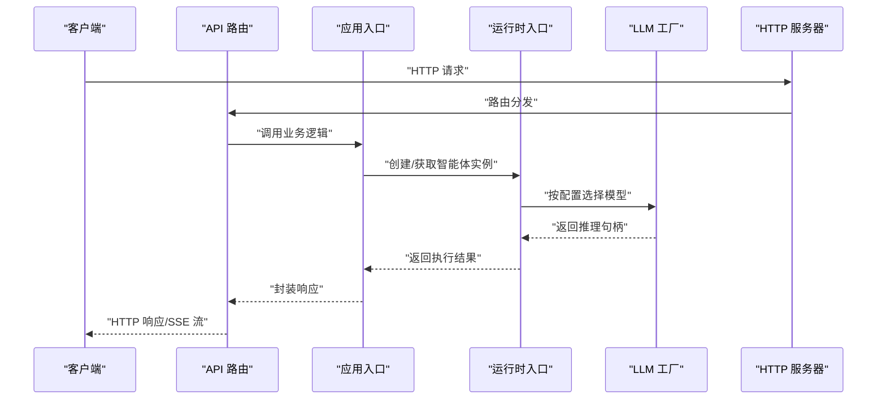
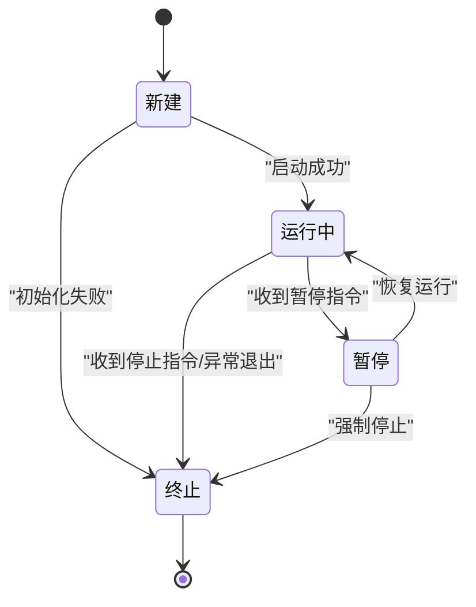
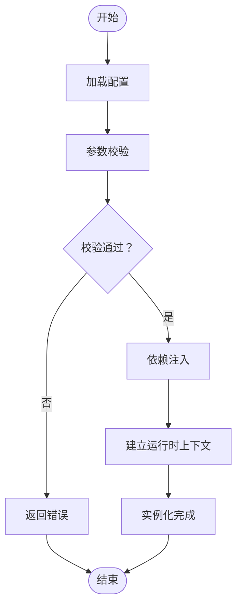
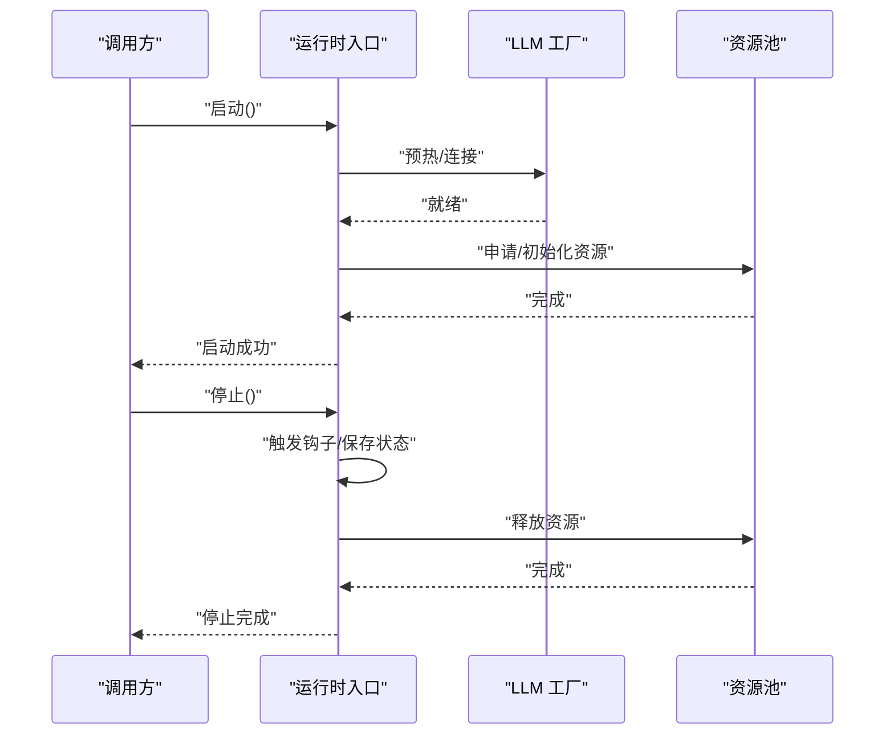
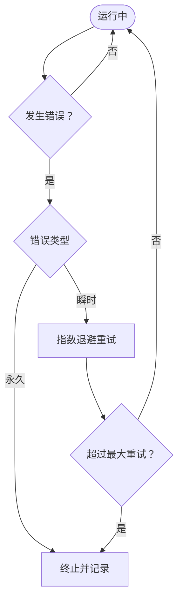
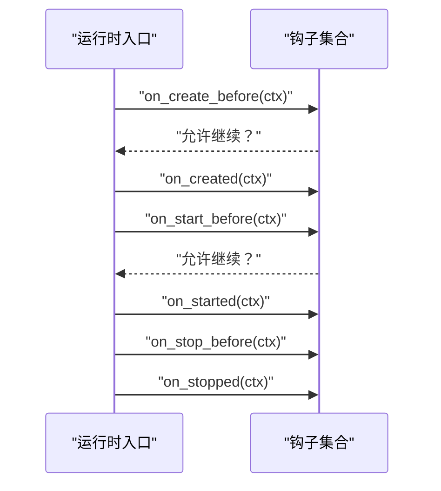
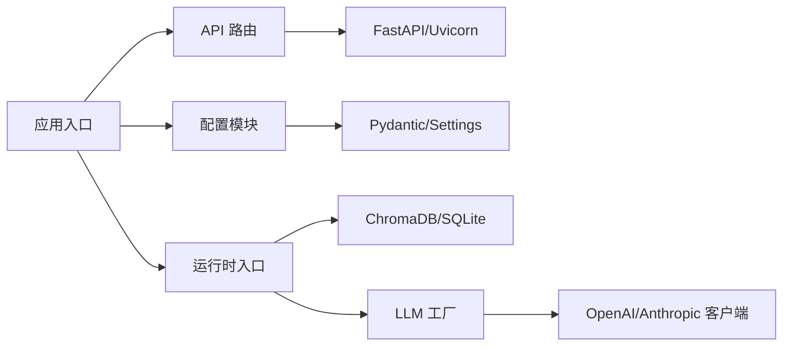

# 智能体生命周期管理

<cite>
**本文引用的文件**
- [backend/kore/__init__.py](file://backend/kore/__init__.py)
- [backend/kore/api/router.py](file://backend/kore/api/router.py)
- [backend/kore/llm/factory.py](file://backend/kore/llm/factory.py)
- [backend/kore/runtime/__init__.py](file://backend/kore/runtime/__init__.py)
- [backend/kore/config.py](file://backend/kore/config.py)
- [backend/kore/main.py](file://backend/kore/main.py)
- [backend/pyproject.toml](file://backend/pyproject.toml)
</cite>

## 目录
1. [引言](#引言)
2. [项目结构](#项目结构)
3. [核心组件](#核心组件)
4. [架构总览](#架构总览)
5. [详细组件分析](#详细组件分析)
6. [依赖关系分析](#依赖关系分析)
7. [性能考虑](#性能考虑)
8. [故障排查指南](#故障排查指南)
9. [结论](#结论)
10. [附录](#附录)

## 引言
本文件面向“智能体生命周期管理”的技术文档目标，系统性阐述智能体从创建到销毁的完整生命周期：初始化流程、状态转换与资源清理；状态枚举与转换规则（新建、运行中、暂停、终止等）；实例化过程（配置加载、依赖注入、初始化参数校验）；启动与停止机制（异步启动与优雅关闭）；重启与故障恢复（自动重试与错误处理）；以及生命周期钩子函数（事件监听与回调）的使用方法。由于当前仓库未包含具体的状态机与运行时实现文件，本文基于现有模块与依赖进行合理推演与最佳实践说明，帮助读者在该代码基础上构建完整的生命周期管理能力。

## 项目结构
后端采用 Python 包结构组织，核心模块位于 backend/kore 下，包含 API 路由、LLM 工厂、运行时入口与配置等。依赖通过 pyproject.toml 管理，使用 FastAPI 提供服务端能力，支持异步与 SSE 流式输出。

图示来源
- [backend/kore/__init__.py](file://backend/kore/__init__.py)
- [backend/kore/api/router.py](file://backend/kore/api/router.py)
- [backend/kore/llm/factory.py](file://backend/kore/llm/factory.py)
- [backend/kore/runtime/__init__.py](file://backend/kore/runtime/__init__.py)
- [backend/kore/config.py](file://backend/kore/config.py)
- [backend/kore/main.py](file://backend/kore/main.py)
- [backend/pyproject.toml](file://backend/pyproject.toml)

章节来源
- [backend/pyproject.toml:1-34](file://backend/pyproject.toml#L1-L34)

## 核心组件
- 应用入口与初始化：负责注册路由、加载配置、建立 LLM 工厂与运行时上下文。
- API 路由：对外暴露智能体相关接口（如创建、启动、停止、查询状态等），统一返回格式与错误码。
- LLM 工厂：按配置选择并实例化不同供应商的模型客户端，提供统一的推理接口。
- 运行时入口：承载智能体实例的生命周期控制（待实现），包括状态机、钩子与资源管理。
- 配置模块：集中管理环境变量与配置文件，提供类型安全的读取与默认值。
- 主程序入口：启动 HTTP 服务器，绑定路由与中间件。

章节来源
- [backend/kore/__init__.py](file://backend/kore/__init__.py)
- [backend/kore/api/router.py](file://backend/kore/api/router.py)
- [backend/kore/llm/factory.py](file://backend/kore/llm/factory.py)
- [backend/kore/runtime/__init__.py](file://backend/kore/runtime/__init__.py)
- [backend/kore/config.py](file://backend/kore/config.py)
- [backend/kore/main.py](file://backend/kore/main.py)

## 架构总览
下图展示了从请求进入至响应返回的关键路径，以及与 LLM 工厂、运行时入口的交互关系。

图示来源
- [backend/kore/api/router.py](file://backend/kore/api/router.py)
- [backend/kore/__init__.py](file://backend/kore/__init__.py)
- [backend/kore/llm/factory.py](file://backend/kore/llm/factory.py)
- [backend/kore/runtime/__init__.py](file://backend/kore/runtime/__init__.py)

## 详细组件分析

### 状态机与生命周期设计（建议）
以下为建议的状态机与转换规则，便于在现有模块上扩展实现。该图为概念性示意，不直接映射到具体源码文件。

说明
- 新建：完成配置加载、依赖注入与参数校验后的初始态。
- 运行中：智能体已接入 LLM 推理与外部资源，可接收任务并产出结果。
- 暂停：暂停推理或 I/O，保留上下文以便恢复。
- 终止：释放资源并退出，不可逆。

[本节为概念性设计，不附“章节来源”]

### 实例化流程（建议）
- 配置加载：从环境变量与配置文件读取，使用 Pydantic Settings 进行类型校验与默认值填充。
- 依赖注入：根据配置选择 LLM 供应商与存储后端，注入到运行时上下文。
- 初始化参数验证：对必填字段、范围与格式进行校验，失败则拒绝创建。
- 上下文建立：初始化内存、知识库、追踪器等子系统。

[本节为概念性流程，不附“章节来源”]

### 启动与停止机制（建议）
- 异步启动：在运行时入口中创建任务协程，先预热 LLM 连接与缓存，再进入事件循环。
- 优雅关闭：捕获信号或中断，触发钩子函数，有序释放资源（数据库连接、文件句柄、网络会话）。

[本节为概念性流程，不附“章节来源”]

### 重启与故障恢复（建议）
- 自动重试：在运行中遇到瞬时错误（网络抖动、限流）时，等待指数退避后重试有限次数。
- 错误处理：区分可恢复与不可恢复错误，前者尝试重试，后者进入终止并记录追踪。
- 快照与回滚：定期持久化关键状态，失败时回滚到最近快照。

[本节为概念性流程，不附“章节来源”]

### 生命周期钩子函数（建议）
- 钩子类型：创建前、创建后、启动前、启动后、暂停前、暂停后、停止前、停止后、异常捕获。
- 使用方式：在运行时入口中注册回调列表，按状态切换顺序依次调用；异常钩子用于记录与上报。
- 回调签名：接收状态名与上下文字典，返回布尔值表示是否允许继续转换。

[本节为概念性流程，不附“章节来源”]

### 实际代码示例（路径指引）
以下示例以“路径指引”的形式给出，避免直接粘贴代码内容：

- 应用入口与初始化
  - [backend/kore/__init__.py](file://backend/kore/__init__.py)
- API 路由与接口
  - [backend/kore/api/router.py](file://backend/kore/api/router.py)
- LLM 工厂与模型适配
  - [backend/kore/llm/factory.py](file://backend/kore/llm/factory.py)
- 运行时入口（生命周期控制点）
  - [backend/kore/runtime/__init__.py](file://backend/kore/runtime/__init__.py)
- 配置加载与校验
  - [backend/kore/config.py](file://backend/kore/config.py)
- 主程序入口与服务器启动
  - [backend/kore/main.py](file://backend/kore/main.py)

章节来源
- [backend/kore/__init__.py](file://backend/kore/__init__.py)
- [backend/kore/api/router.py](file://backend/kore/api/router.py)
- [backend/kore/llm/factory.py](file://backend/kore/llm/factory.py)
- [backend/kore/runtime/__init__.py](file://backend/kore/runtime/__init__.py)
- [backend/kore/config.py](file://backend/kore/config.py)
- [backend/kore/main.py](file://backend/kore/main.py)

## 依赖关系分析
- 依赖声明集中在 pyproject.toml，包含 FastAPI、Uvicorn、Pydantic/Settings、OpenAI/Anthropic、ChromaDB、SQLite 等。
- 运行时入口与 LLM 工厂需与这些依赖协同工作，确保异步与流式能力满足智能体运行需求。

图示来源
- [backend/pyproject.toml:1-34](file://backend/pyproject.toml#L1-L34)
- [backend/kore/__init__.py](file://backend/kore/__init__.py)
- [backend/kore/api/router.py](file://backend/kore/api/router.py)
- [backend/kore/runtime/__init__.py](file://backend/kore/runtime/__init__.py)
- [backend/kore/llm/factory.py](file://backend/kore/llm/factory.py)
- [backend/kore/config.py](file://backend/kore/config.py)

章节来源
- [backend/pyproject.toml:1-34](file://backend/pyproject.toml#L1-L34)

## 性能考虑
- 异步与并发：利用 FastAPI 的异步特性与 Uvicorn 的高性能服务端，减少阻塞 I/O 对主线程的影响。
- 缓存与预热：在运行时入口中对 LLM 连接与常用数据进行预热，降低首次调用延迟。
- 资源池化：对数据库与外部 API 连接采用连接池，避免频繁创建销毁带来的开销。
- 流式输出：结合 SSE 或长连接，提升用户体验与响应速度。

[本节为通用指导，不附“章节来源”]

## 故障排查指南
- 启动失败
  - 检查配置加载是否成功，确认必填项与默认值设置。
  - 查看运行时入口的日志输出，定位初始化阶段的异常。
- 推理异常
  - 在 LLM 工厂中增加重试与熔断策略，区分瞬时与永久错误。
  - 记录请求 ID 与上下文，便于追踪问题根因。
- 资源泄漏
  - 在停止钩子中统一释放数据库、文件与网络资源，确保幂等性。
- 优雅关闭
  - 注册信号处理器，捕获中断信号，触发钩子链路与资源回收。

[本节为通用指导，不附“章节来源”]

## 结论
本文件基于现有模块与依赖，提出了智能体生命周期管理的建议性设计与实现路径。通过明确的状态机、实例化流程、启动停止机制、重启恢复策略与钩子体系，可在现有代码基础上快速构建稳定可靠的智能体运行时。后续可在运行时入口中落地状态机与钩子，配合配置与 LLM 工厂完善整体生命周期闭环。

[本节为总结性内容，不附“章节来源”]

## 附录
- 关键模块职责概览
  - 应用入口：注册路由、加载配置、建立上下文
  - API 路由：对外接口与响应封装
  - LLM 工厂：模型供应商适配与推理桥接
  - 运行时入口：生命周期控制与资源管理
  - 配置模块：类型安全的配置读取
  - 主程序入口：HTTP 服务器启动与绑定

[本节为概览性内容，不附“章节来源”]