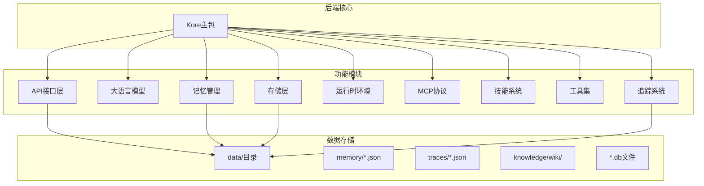
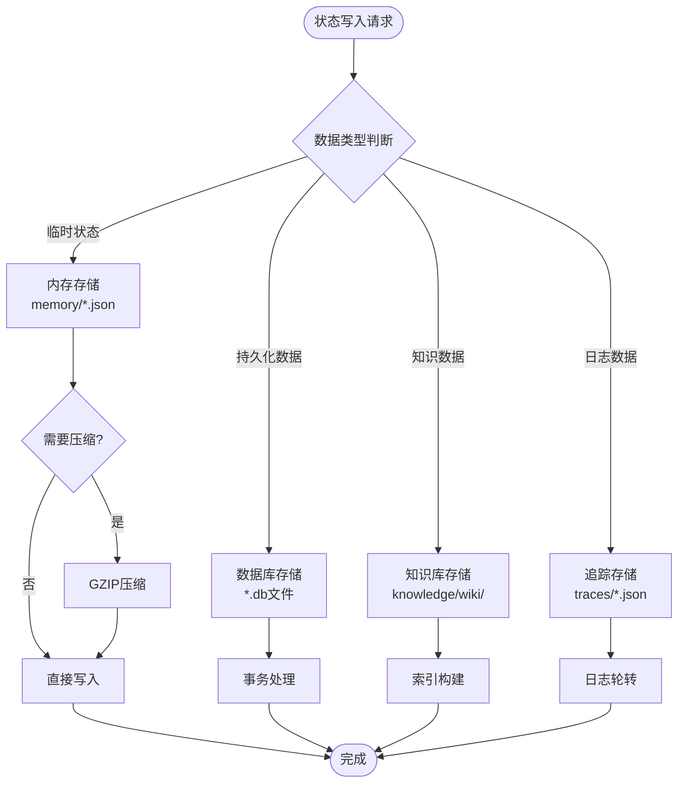
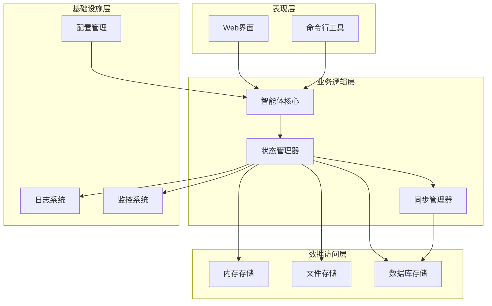
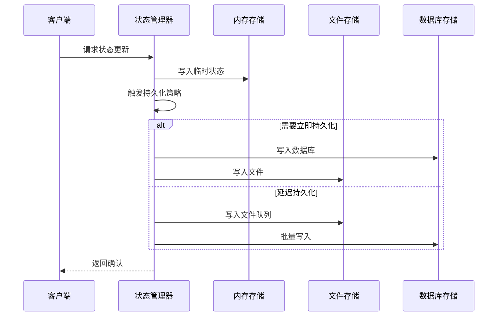
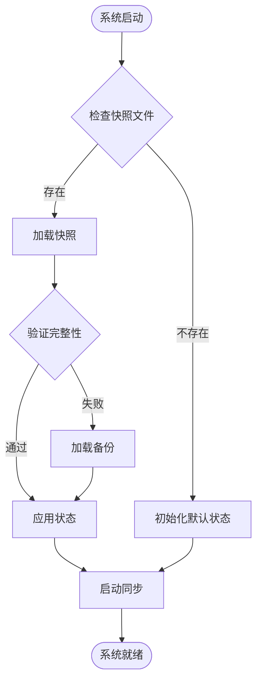
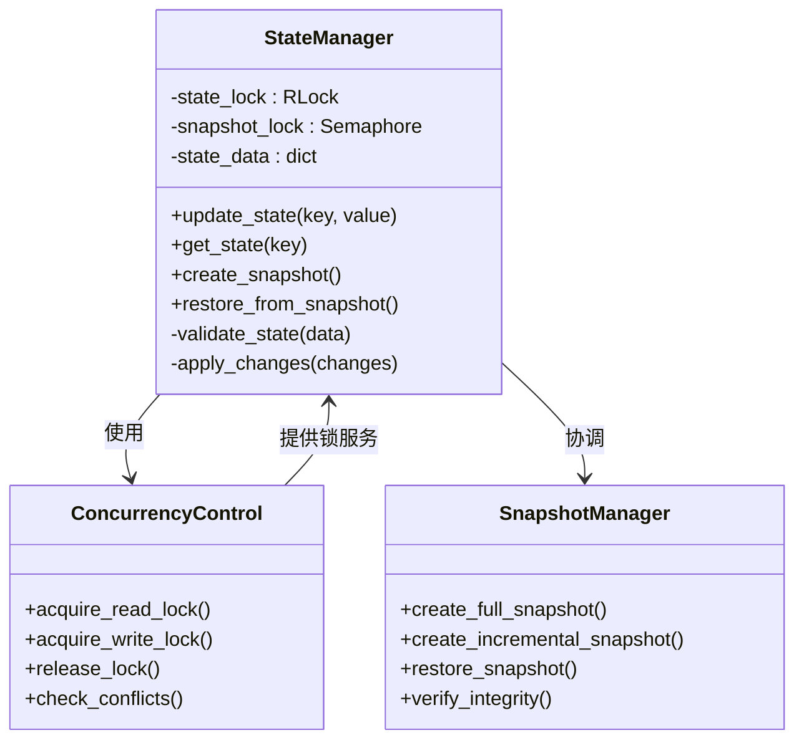
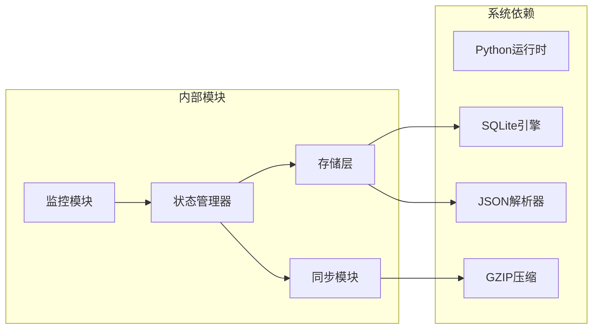
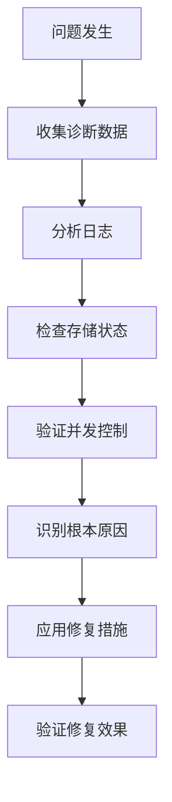

# 状态管理系统

<cite>
**本文档引用的文件**
- [.gitignore](file://.gitignore)
- [backend/pyproject.toml](file://backend/pyproject.toml)
- [backend/kore/__init__.py](file://backend/kore/__init__.py)
</cite>

## 目录
1. [引言](#引言)
2. [项目结构](#项目结构)
3. [核心组件](#核心组件)
4. [架构概览](#架构概览)
5. [详细组件分析](#详细组件分析)
6. [依赖分析](#依赖分析)
7. [性能考虑](#性能考虑)
8. [故障排除指南](#故障排除指南)
9. [结论](#结论)

## 引言

本文件为智能体状态管理系统的技术文档，基于当前仓库的可用信息进行分析。根据.gitignore文件显示，系统使用data目录作为运行时数据存储，其中包含memory（内存存储）、traces（追踪日志）等子目录。该系统采用模块化架构设计，通过Python包组织各个功能模块。

## 项目结构

基于当前可观察到的项目结构，系统采用分层模块化设计：

**图表来源**
- [.gitignore:12-16](file://.gitignore#L12-L16)

**章节来源**
- [.gitignore:1-30](file://.gitignore#L1-L30)

## 核心组件

### 数据存储架构

系统采用多层存储策略：

1. **内存存储**：使用JSON格式存储临时状态数据
2. **持久化存储**：支持SQLite数据库文件存储
3. **知识库存储**：Wiki格式的知识管理
4. **追踪存储**：结构化日志记录

### 存储策略选择

**图表来源**
- [.gitignore:12-16](file://.gitignore#L12-L16)

## 架构概览

系统采用分层架构设计，各模块职责明确：

## 详细组件分析

### 状态数据结构设计

基于.gitignore中显示的存储模式，系统采用以下数据结构：

#### 内存状态结构
- 文件格式：JSON
- 文件命名：memory/*.json
- 存储内容：临时状态、会话数据
- 特性：快速读写、自动清理

#### 追踪日志结构
- 文件格式：JSON
- 文件命名：traces/*.json
- 存储内容：操作日志、错误追踪
- 特性：结构化记录、便于分析

#### 数据库结构
- 文件格式：SQLite (*.db)
- 存储内容：持久化状态、配置数据
- 特性：ACID特性、事务支持

### 状态持久化机制

**图表来源**
- [.gitignore:12-16](file://.gitignore#L12-L16)

### 状态快照和恢复功能

系统支持多种状态恢复策略：

#### 快照策略
- 全量快照：定期生成完整状态备份
- 增量快照：仅保存自上次快照以来的变化
- 实时快照：基于事件触发的状态保存

#### 恢复流程

### 并发访问控制

**图表来源**
- [.gitignore:12-16](file://.gitignore#L12-L16)

## 依赖分析

### 外部依赖关系

**图表来源**
- [backend/pyproject.toml](file://backend/pyproject.toml)

**章节来源**
- [backend/pyproject.toml:1-50](file://backend/pyproject.toml#L1-L50)

## 性能考虑

### 存储性能优化

1. **内存缓存策略**
   - 使用LRU缓存减少磁盘I/O
   - 批量写入减少文件系统开销
   - 异步写入提升响应性能

2. **数据库优化**
   - 合理的索引设计
   - 事务批量提交
   - 连接池管理

3. **文件系统优化**
   - 文件预分配避免碎片
   - 合理的文件大小限制
   - 异步文件操作

### 并发性能

- 读写分离架构
- 细粒度锁机制
- 无锁数据结构
- 事件驱动更新

## 故障排除指南

### 常见问题诊断

#### 状态不一致问题
1. **症状**：状态在不同节点间不一致
2. **原因**：网络分区或并发冲突
3. **解决方案**：启用分布式锁，实施冲突检测

#### 存储空间不足
1. **症状**：写入操作失败
2. **原因**：磁盘空间耗尽
3. **解决方案**：清理旧快照，配置自动清理策略

#### 性能下降
1. **症状**：响应时间延长
2. **原因**：缓存命中率低或I/O瓶颈
3. **解决方案**：调整缓存策略，优化存储布局

### 调试工具

## 结论

基于当前仓库的分析，智能体状态管理系统展现了清晰的模块化架构设计。系统采用多层存储策略，支持内存、文件和数据库的灵活组合。通过合理的并发控制和持久化机制，系统能够满足智能体状态管理的核心需求。

未来可以考虑的功能增强包括：
- 更完善的版本控制机制
- 分布式状态同步
- 更丰富的监控指标
- 自动化的状态迁移工具