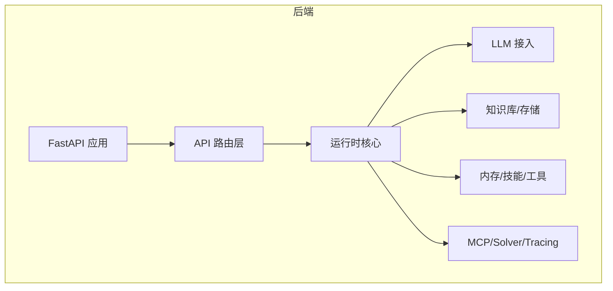
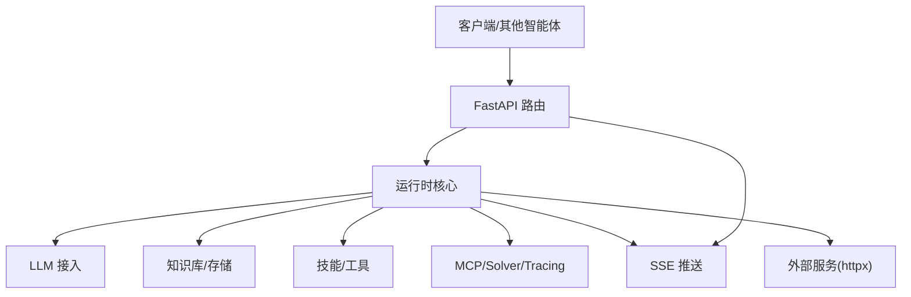
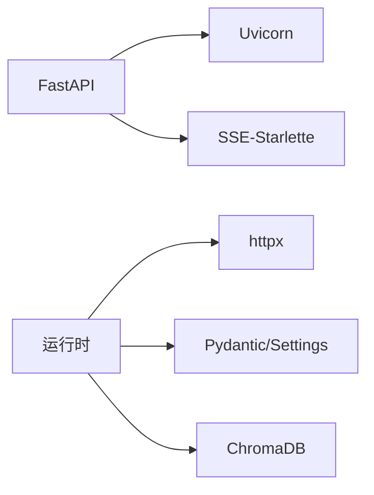

# 通信机制

<cite>
**本文引用的文件**
- [pyproject.toml](file://backend/pyproject.toml)
- [.gitignore](file://.gitignore)
- [backend/kore/__init__.py](file://backend/kore/__init__.py)
</cite>

## 目录
1. [引言](#引言)
2. [项目结构](#项目结构)
3. [核心组件](#核心组件)
4. [架构总览](#架构总览)
5. [详细组件分析](#详细组件分析)
6. [依赖分析](#依赖分析)
7. [性能考虑](#性能考虑)
8. [故障排查指南](#故障排查指南)
9. [结论](#结论)
10. [附录](#附录)

## 引言
本文件面向“智能体通信机制”的技术文档目标，系统性阐述智能体间通信架构的设计原理、消息传递协议、通信模式、网络拓扑、消息格式与编码、安全机制、可靠性保障、性能优化、监控与调试工具、协议扩展与外部集成，以及故障排查与性能调优建议。  
当前仓库为后端工程的Python包结构，包含API层、运行时、LLM、知识库、内存、提示词、技能、存储、工具、MCP、Solver、Tracing等子模块。通信相关能力在现有文件中尚未直接呈现具体实现，但通过依赖清单与模块组织可推导出通信能力的潜在落点与扩展路径。

## 项目结构
后端采用FastAPI作为Web框架入口，结合异步运行时与事件流支持（如SSE），为智能体通信提供HTTP与流式接口基础。项目模块按功能域划分，便于在运行时（runtime）与API层之间建立通信桥接。

章节来源
- [pyproject.toml:1-34](file://backend/pyproject.toml#L1-L34)

## 核心组件
- FastAPI 与 Uvicorn：提供高性能的HTTP服务与ASGI运行时，支撑REST与SSE等通信方式。
- SSE-Starlette：提供服务器推送事件（Server-Sent Events）能力，适合长连接与实时流式通信。
- Pydantic 与 Pydantic Settings：用于数据模型校验与配置管理，确保消息载荷与配置的结构化与一致性。
- httpx：异步HTTP客户端，可用于智能体间的远程通信或对外部服务的调用。
- ChromaDB：向量数据库，常用于知识检索与嵌入相似度匹配，间接参与智能体决策与通信内容生成。
- OpenAI / Anthropic：大模型接入SDK，为智能体提供对话与推理能力，其API调用构成智能体通信链路的一部分。

章节来源
- [pyproject.toml:6-19](file://backend/pyproject.toml#L6-L19)

## 架构总览
智能体通信的总体思路是：  
- 入口层（API）负责请求接收与路由；  
- 运行时（Runtime）协调智能体状态、任务调度与消息分发；  
- LLM/知识库/存储/工具等模块为智能体提供能力与数据；  
- SSE用于长连接与流式响应，满足实时交互需求；  
- 外部服务通过httpx进行调用，形成跨系统通信。

## 详细组件分析
由于当前仓库未直接暴露通信协议的具体实现文件，以下分析基于模块职责与依赖关系进行概念性设计说明，便于后续落地到实际代码。

### 消息传递协议与通信模式
- 协议选择：HTTP/1.1 或 HTTP/2（由Uvicorn与FastAPI支持），配合SSE实现服务器推送事件，满足实时流式通信。
- 通信模式：
  - 请求-响应：适用于同步调用与查询。
  - 服务器推送（SSE）：适用于事件广播、增量输出与状态变更通知。
  - 异步调用：通过httpx发起异步请求，适配外部系统或跨服务通信。
- 网络拓扑：中心化API网关 + 分布式运行时节点，节点间通过HTTP/HTTPS与SSE协作。

### 消息格式与编码标准
- 消息头：统一的Content-Type（如application/json）、Accept-Encoding、Authorization等。
- 载荷格式：以JSON为主，使用Pydantic模型进行结构化定义与校验，确保字段类型、必填项与范围约束一致。
- 序列化机制：优先采用JSON；对二进制或大对象可采用Base64编码或分块传输策略。
- 扩展字段：预留trace_id、correlation_id等追踪字段，便于端到端链路追踪。

### 通信安全机制
- 身份认证：通过FastAPI的依赖注入与中间件实现Bearer Token或API Key鉴权。
- 访问控制：基于角色/权限的装饰器或中间件，限制敏感接口访问。
- 消息加密：在传输层启用TLS（HTTPS），对关键载荷可进行对称加密或签名验证。
- 审计日志：记录请求摘要、响应状态与异常信息，便于合规与审计。

### 通信可靠性保障
- 消息确认：对关键操作返回ack/nack，客户端可据此决定是否重试。
- 重传机制：指数退避策略，避免雪崩效应；对幂等接口可安全重放。
- 故障恢复：超时与熔断结合，失败后切换备用节点或降级策略；SSE断线自动重连。

### 通信性能优化
- 连接复用：HTTP/2多路复用减少握手开销；SSE长连接降低延迟。
- 批量传输：合并小消息为批次，提升吞吐量；对同构事件进行聚合。
- 压缩算法：Gzip/Brotli压缩响应体；对文本类消息优先压缩。
- 缓存策略：对静态或低频变更的数据设置缓存头，减少重复传输。

### 监控与调试工具
- 消息追踪：利用trace_id贯穿请求生命周期，结合Tracing模块记录时间线。
- 延迟测量：在API层与运行时埋点，统计端到端延迟与各阶段耗时。
- 吞吐量统计：记录QPS、错误率、P95/P99延迟，辅助容量规划。
- 日志与告警：结构化日志输出，异常触发告警；结合可视化面板展示指标。

### 协议扩展与外部集成
- 协议扩展：在API层新增路由与处理器，遵循现有消息格式与安全策略。
- 外部系统集成：通过httpx调用第三方服务，统一错误码与重试策略；对不兼容协议可做适配层转换。

## 依赖分析
从依赖清单可见，项目围绕FastAPI生态构建，具备良好的扩展性与性能表现。通信相关的关键依赖如下：
- FastAPI/Uvicorn：提供HTTP与ASGI运行时。
- SSE-Starlette：提供SSE能力。
- httpx：异步HTTP客户端，便于外部通信。
- Pydantic/Settings：数据模型与配置管理。
- ChromaDB：向量检索能力，支撑智能体的知识交互。

章节来源
- [pyproject.toml:6-19](file://backend/pyproject.toml#L6-L19)

## 性能考虑
- 传输层优化：启用HTTP/2与持久连接，减少握手与队头阻塞。
- 应用层优化：对高频接口进行缓存与限流；对大响应进行分页或流式输出。
- 存储层优化：合理索引与查询计划，避免阻塞型操作影响通信延迟。
- 并发模型：充分利用异步I/O与事件循环，避免阻塞调用。

## 故障排查指南
- 链路追踪：通过trace_id定位问题节点，结合日志与指标快速定位瓶颈。
- 网络诊断：检查SSE连接状态、TLS证书有效性与代理配置。
- 负载测试：模拟高并发场景，识别峰值下的延迟与错误率变化。
- 配置核对：确认认证参数、超时设置与重试策略是否合理。

## 结论
当前仓库为智能体通信提供了坚实的基础能力（HTTP、SSE、异步I/O、数据模型与配置管理）。通信协议与安全、可靠性的具体实现可在运行时与API层逐步落地，结合监控与性能优化手段，可构建高可用、可观测、可扩展的智能体通信体系。

## 附录
- 数据与日志路径：根据.gitignore，运行时产生的数据与追踪文件位于data目录下，便于离线分析与归档。
- 版本与依赖：请以pyproject.toml为准，确保开发与生产环境依赖一致。

章节来源
- [.gitignore:12-16](file://.gitignore#L12-L16)
- [pyproject.toml:1-34](file://backend/pyproject.toml#L1-L34)