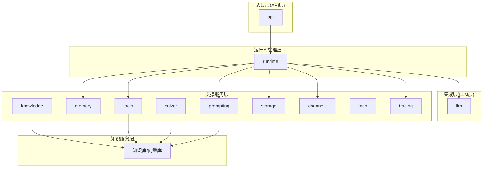
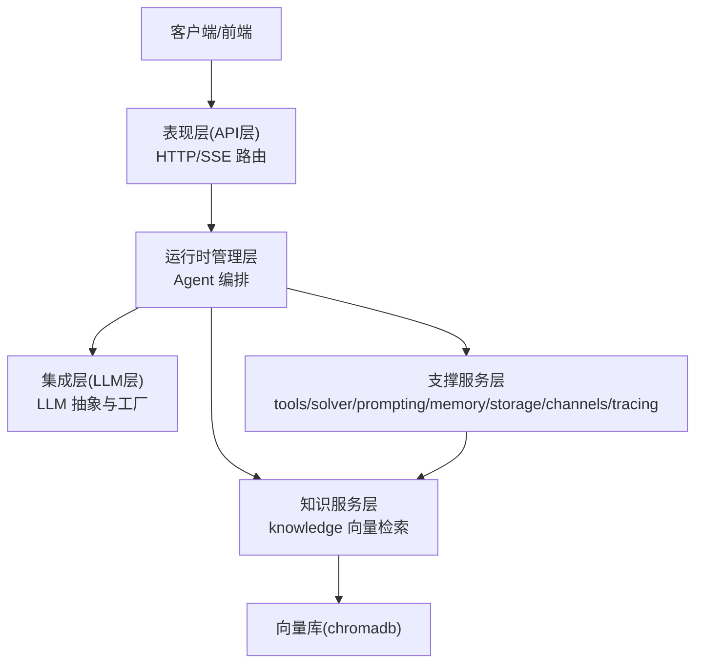
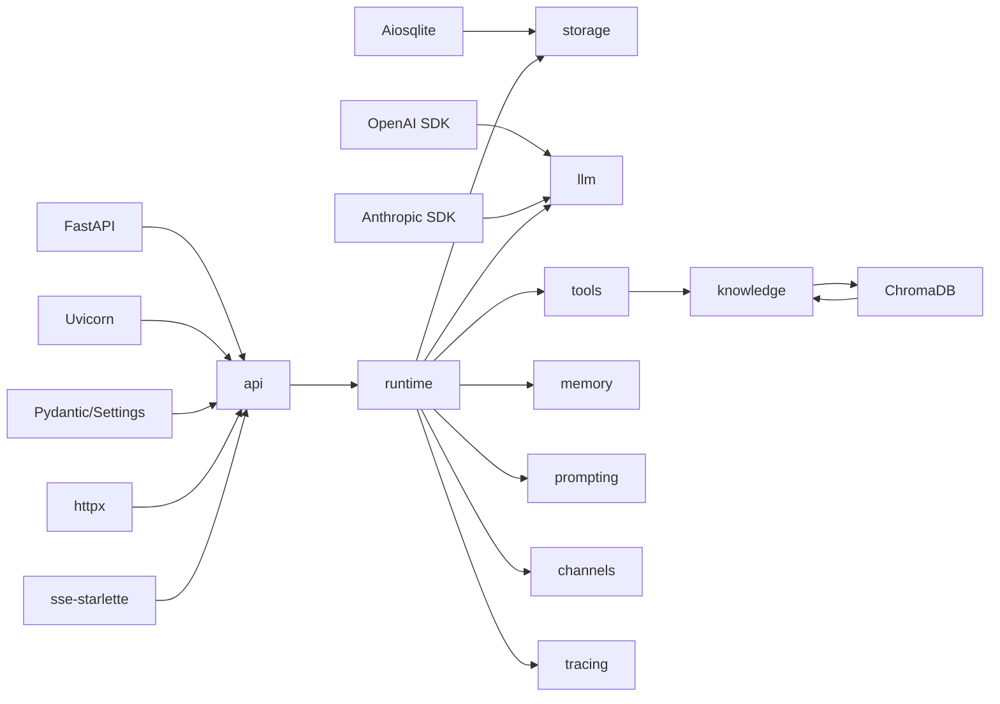

# 分层架构详解

<cite>
**本文引用的文件**
- [backend/pyproject.toml](file://backend/pyproject.toml)
- [backend/kore/__init__.py](file://backend/kore/__init__.py)
- [backend/kore/api/__init__.py](file://backend/kore/api/__init__.py)
- [backend/kore/llm/__init__.py](file://backend/kore/llm/__init__.py)
- [backend/kore/runtime/__init__.py](file://backend/kore/runtime/__init__.py)
- [backend/kore/knowledge/__init__.py](file://backend/kore/knowledge/__init__.py)
- [backend/kore/memory/__init__.py](file://backend/kore/memory/__init__.py)
- [backend/kore/tools/__init__.py](file://backend/kore/tools/__init__.py)
- [backend/kore/solver/__init__.py](file://backend/kore/solver/__init__.py)
- [backend/kore/prompting/__init__.py](file://backend/kore/prompting/__init__.py)
- [backend/kore/storage/__init__.py](file://backend/kore/storage/__init__.py)
- [backend/kore/channels/__init__.py](file://backend/kore/channels/__init__.py)
- [backend/kore/mcp/__init__.py](file://backend/kore/mcp/__init__.py)
- [backend/kore/tracing/__init__.py](file://backend/kore/tracing/__init__.py)
</cite>

## 目录
1. [引言](#引言)
2. [项目结构](#项目结构)
3. [核心组件](#核心组件)
4. [架构总览](#架构总览)
5. [详细组件分析](#详细组件分析)
6. [依赖分析](#依赖分析)
7. [性能考虑](#性能考虑)
8. [故障排除指南](#故障排除指南)
9. [结论](#结论)
10. [附录](#附录)

## 引言
本文件面向 Kore 智能体框架，系统化阐述其分层架构设计与实现要点。依据仓库现有模块，Kore 已形成以“表现层（API 层）”、“集成层（LLM 层）”、“运行时管理层”、“支撑服务层”和“知识服务层”为核心的五层架构。本文将从职责边界、模块组织、接口契约、数据流与控制流、依赖关系、可扩展性与可维护性等方面进行深入解析，并给出可视化图示与实践建议。

## 项目结构
后端采用 Python 包结构组织，顶层模块按功能域划分为多个子包，体现清晰的分层与解耦：
- 表现层（API 层）：负责对外 HTTP 接口与请求路由
- 集成层（LLM 层）：抽象与工厂化 LLM 能力接入
- 运行时管理层：Agent 核心与运行时模型
- 支撑服务层：工具、提示词、存储、通道、追踪等通用能力
- 知识服务层：知识检索与向量数据库对接

图表来源
- [backend/kore/api/__init__.py](file://backend/kore/api/__init__.py)
- [backend/kore/llm/__init__.py](file://backend/kore/llm/__init__.py)
- [backend/kore/runtime/__init__.py](file://backend/kore/runtime/__init__.py)
- [backend/kore/knowledge/__init__.py](file://backend/kore/knowledge/__init__.py)
- [backend/kore/memory/__init__.py](file://backend/kore/memory/__init__.py)
- [backend/kore/tools/__init__.py](file://backend/kore/tools/__init__.py)
- [backend/kore/solver/__init__.py](file://backend/kore/solver/__init__.py)
- [backend/kore/prompting/__init__.py](file://backend/kore/prompting/__init__.py)
- [backend/kore/storage/__init__.py](file://backend/kore/storage/__init__.py)
- [backend/kore/channels/__init__.py](file://backend/kore/channels/__init__.py)
- [backend/kore/mcp/__init__.py](file://backend/kore/mcp/__init__.py)
- [backend/kore/tracing/__init__.py](file://backend/kore/tracing/__init__.py)

章节来源
- [backend/pyproject.toml:1-35](file://backend/pyproject.toml#L1-L35)
- [backend/kore/__init__.py](file://backend/kore/__init__.py)

## 核心组件
- 表现层（API 层）
  - 职责：对外提供 HTTP 接口，路由到运行时管理器；支持 SSE 等实时推送
  - 关键模块：api（对外暴露路由与控制器）
- 集成层（LLM 层）
  - 职责：抽象 LLM 统一接口，通过工厂模式接入不同供应商（如 OpenAI、Anthropic）
  - 关键模块：llm（base 抽象、factory 工厂）
- 运行时管理层
  - 职责：编排 Agent 生命周期、对话与推理流程；协调工具、记忆、提示词、存储与通道
  - 关键模块：runtime（agent_core、models）
- 支撑服务层
  - 职责：提供工具、提示词工程、存储、通道、追踪等横切能力
  - 关键模块：tools、solver、prompting、storage、channels、mcp、tracing、memory、knowledge
- 知识服务层
  - 职责：向量检索、知识索引与查询；与 chromadb 等向量库对接
  - 关键模块：knowledge（与 storage、tools、solver 协同）

章节来源
- [backend/kore/api/__init__.py](file://backend/kore/api/__init__.py)
- [backend/kore/llm/__init__.py](file://backend/kore/llm/__init__.py)
- [backend/kore/runtime/__init__.py](file://backend/kore/runtime/__init__.py)
- [backend/kore/knowledge/__init__.py](file://backend/kore/knowledge/__init__.py)
- [backend/kore/memory/__init__.py](file://backend/kore/memory/__init__.py)
- [backend/kore/tools/__init__.py](file://backend/kore/tools/__init__.py)
- [backend/kore/solver/__init__.py](file://backend/kore/solver/__init__.py)
- [backend/kore/prompting/__init__.py](file://backend/kore/prompting/__init__.py)
- [backend/kore/storage/__init__.py](file://backend/kore/storage/__init__.py)
- [backend/kore/channels/__init__.py](file://backend/kore/channels/__init__.py)
- [backend/kore/mcp/__init__.py](file://backend/kore/mcp/__init__.py)
- [backend/kore/tracing/__init__.py](file://backend/kore/tracing/__init__.py)

## 架构总览
Kore 的分层架构遵循“自顶向下”的职责分离原则：
- 表现层仅处理输入输出与路由，不承载业务逻辑
- 集成层屏蔽多供应商差异，统一对外接口
- 运行时管理层编排核心流程，连接各支撑模块
- 支撑服务层提供可插拔能力，便于替换与扩展
- 知识服务层独立于业务流程，专注检索与索引

图表来源
- [backend/kore/api/__init__.py](file://backend/kore/api/__init__.py)
- [backend/kore/llm/__init__.py](file://backend/kore/llm/__init__.py)
- [backend/kore/runtime/__init__.py](file://backend/kore/runtime/__init__.py)
- [backend/kore/knowledge/__init__.py](file://backend/kore/knowledge/__init__.py)
- [backend/kore/memory/__init__.py](file://backend/kore/memory/__init__.py)
- [backend/kore/tools/__init__.py](file://backend/kore/tools/__init__.py)
- [backend/kore/solver/__init__.py](file://backend/kore/solver/__init__.py)
- [backend/kore/prompting/__init__.py](file://backend/kore/prompting/__init__.py)
- [backend/kore/storage/__init__.py](file://backend/kore/storage/__init__.py)
- [backend/kore/channels/__init__.py](file://backend/kore/channels/__init__.py)
- [backend/kore/mcp/__init__.py](file://backend/kore/mcp/__init__.py)
- [backend/kore/tracing/__init__.py](file://backend/kore/tracing/__init__.py)

## 详细组件分析

### 表现层（API 层）
- 职责
  - 对外提供 HTTP 接口，接收请求并返回响应
  - 将请求路由至运行时管理层，必要时启用 SSE 实时流式输出
- 内部组织
  - 通过模块化路由组织接口，避免在单一文件中堆积逻辑
- 数据与控制流
  - 输入：HTTP 请求（含参数、负载）
  - 处理：路由到运行时管理层
  - 输出：JSON 响应或事件流
- 扩展点
  - 新增接口：在 api 下新增路由与控制器
  - 自定义鉴权/中间件：在 FastAPI 应用层注入
- 可测试性
  - 通过 HTTP 层隔离业务逻辑，便于单元测试与集成测试

章节来源
- [backend/kore/api/__init__.py](file://backend/kore/api/__init__.py)

### 集成层（LLM 层）
- 职责
  - 定义统一的 LLM 接口抽象，屏蔽不同供应商的差异
  - 提供工厂模式，按配置选择具体实现（OpenAI、Anthropic 等）
- 内部组织
  - base：抽象接口与通用行为
  - factory：根据配置实例化具体 LLM 实现
- 数据与控制流
  - 输入：统一的提示词与参数
  - 处理：工厂选择实现，调用抽象接口
  - 输出：标准化的生成结果
- 扩展点
  - 新增供应商：实现 base 中的抽象接口并在 factory 注册
  - 参数与策略：通过配置驱动行为切换
- 可测试性
  - 通过抽象接口与工厂注入，便于替换为测试替身

章节来源
- [backend/kore/llm/__init__.py](file://backend/kore/llm/__init__.py)

### 运行时管理层
- 职责
  - 编排 Agent 的完整生命周期：初始化、对话、推理、工具调用、状态持久化
  - 协调 LLM、工具、记忆、提示词、存储与通道
- 内部组织
  - agent_core：核心运行时逻辑与编排
  - models：运行时相关的数据模型与类型定义
- 数据与控制流
  - 输入：来自表现层的请求与上下文
  - 处理：按阶段执行（提示词构建、LLM 推理、工具调用、记忆更新）
  - 输出：结构化结果与事件流
- 扩展点
  - 新增运行时阶段：在 agent_core 中扩展编排流程
  - 新增模型类型：在 models 中补充数据结构
- 可测试性
  - 通过模块化编排与清晰的接口，便于模拟与断言

章节来源
- [backend/kore/runtime/__init__.py](file://backend/kore/runtime/__init__.py)

### 支撑服务层
- 职责
  - 提供横切能力：工具执行、问题求解、提示词工程、存储、通道、追踪、记忆、知识
- 内部组织
  - tools：可复用的外部能力封装
  - solver：问题求解与算法编排
  - prompting：提示词模板与动态构建
  - memory：短期/长期记忆管理
  - storage：本地/远程存储抽象
  - channels：消息通道与事件分发
  - tracing：调用链追踪与可观测性
- 数据与控制流
  - 输入：运行时管理层的调用请求
  - 处理：按模块职责执行具体任务
  - 输出：结构化结果或副作用（写入存储、发送事件）
- 扩展点
  - 新增工具：在 tools 下新增实现并注册
  - 新增求解器：在 solver 下新增策略
  - 新增通道：在 channels 下新增协议适配
- 可测试性
  - 模块职责明确，便于独立测试与替换

章节来源
- [backend/kore/tools/__init__.py](file://backend/kore/tools/__init__.py)
- [backend/kore/solver/__init__.py](file://backend/kore/solver/__init__.py)
- [backend/kore/prompting/__init__.py](file://backend/kore/prompting/__init__.py)
- [backend/kore/memory/__init__.py](file://backend/kore/memory/__init__.py)
- [backend/kore/storage/__init__.py](file://backend/kore/storage/__init__.py)
- [backend/kore/channels/__init__.py](file://backend/kore/channels/__init__.py)
- [backend/kore/tracing/__init__.py](file://backend/kore/tracing/__init__.py)

### 知识服务层
- 职责
  - 提供知识检索与向量化能力，支撑 RAG 与上下文增强
- 内部组织
  - knowledge：知识索引与检索入口
- 数据与控制流
  - 输入：查询文本与上下文
  - 处理：向量化、相似度检索、结果排序
  - 输出：相关片段与元数据
- 扩展点
  - 新增向量库：通过 storage 与 knowledge 的适配层接入
  - 新增检索策略：在 knowledge 中扩展检索算法
- 可测试性
  - 通过抽象接口与测试替身，便于离线验证检索效果

章节来源
- [backend/kore/knowledge/__init__.py](file://backend/kore/knowledge/__init__.py)

## 依赖分析
- 外部依赖
  - FastAPI、Uvicorn：Web 框架与 ASGI 服务器
  - Pydantic/Settings：配置与数据校验
  - Aiosqlite、ChromaDB：存储与向量检索
  - OpenAI、Anthropic：LLM 供应商 SDK
  - httpx、sse-starlette：网络与事件流
- 内部依赖
  - 表现层依赖运行时管理层
  - 运行时管理层依赖 LLM 层与支撑服务层
  - 知识服务层与存储/工具/求解器协同

图表来源
- [backend/pyproject.toml:6-19](file://backend/pyproject.toml#L6-L19)

章节来源
- [backend/pyproject.toml:1-35](file://backend/pyproject.toml#L1-L35)

## 性能考虑
- I/O 密集与并发
  - 使用异步/并发模型（基于 FastAPI/Uvicorn），提升高并发下的吞吐
- 存储与检索
  - 向量检索与缓存结合，减少重复计算；合理设置批处理与分页
- LLM 调用
  - 通过工厂与抽象层统一限流与重试策略；对长上下文进行截断与摘要
- 观测性
  - 利用 tracing 与 channels 记录关键路径，定位瓶颈

## 故障排除指南
- 接口异常
  - 检查表现层路由与参数校验；确认运行时管理层错误传播
- LLM 调用失败
  - 核查供应商密钥与网络连通；查看工厂实例化日志
- 知识检索异常
  - 校验向量库可用性与索引完整性；检查 embedding 与查询向量维度
- 存储与持久化
  - 关注 aiosqlite 连接池与事务一致性；必要时开启只读副本

## 结论
Kore 的五层架构实现了清晰的职责分离与高内聚低耦合的设计。通过抽象接口与工厂模式，系统在保持可扩展性的同时提升了可测试性与可维护性。建议在后续迭代中完善各层的契约文档与自动化测试矩阵，持续优化检索与推理性能，并加强可观测性与灰度发布能力。

## 附录
- 扩展点清单
  - 新增表现层接口：在 api 下新增路由与控制器
  - 新增 LLM 供应商：实现 base 抽象并在 factory 注册
  - 新增工具/求解器：在 tools/solver 下新增实现并注册
  - 新增通道协议：在 channels 下新增适配
  - 新增向量库：通过 storage 与 knowledge 的适配层接入
- 最佳实践
  - 严格遵守层间依赖方向，避免反向依赖
  - 通过配置驱动行为切换，降低硬编码
  - 为每个模块提供最小接口与清晰契约，便于替换与测试