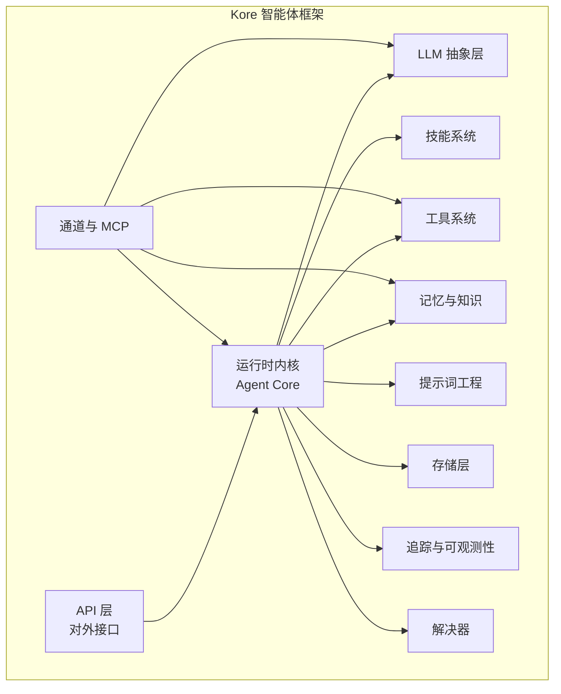
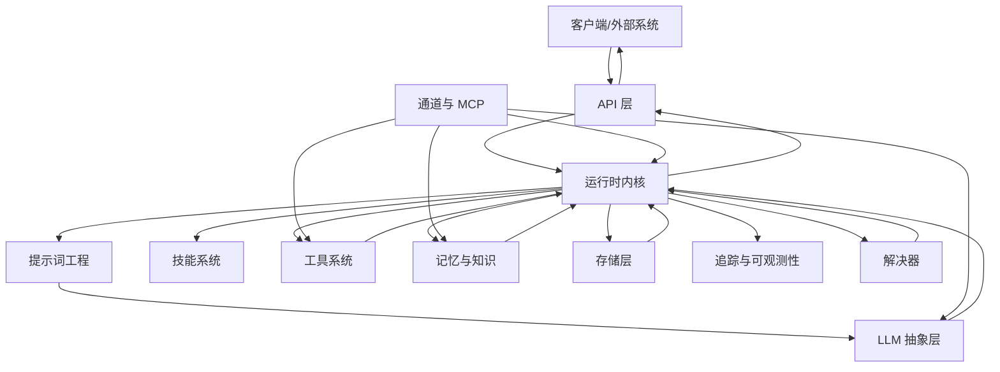
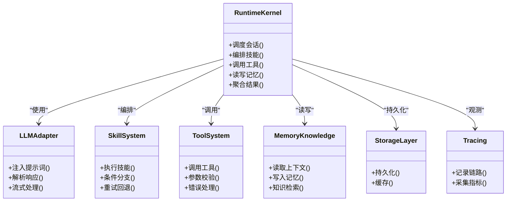
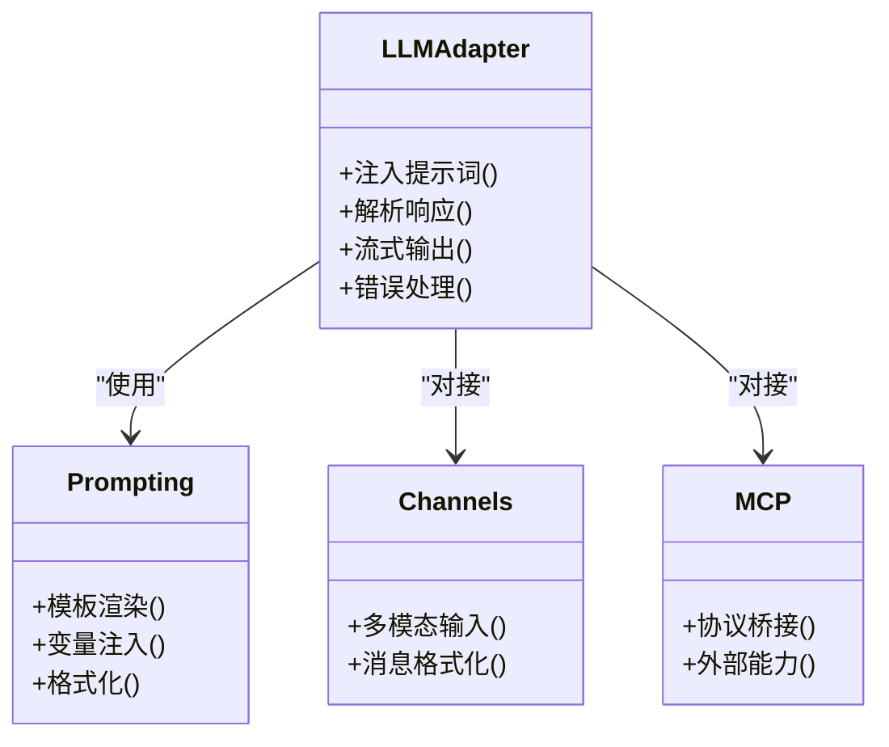
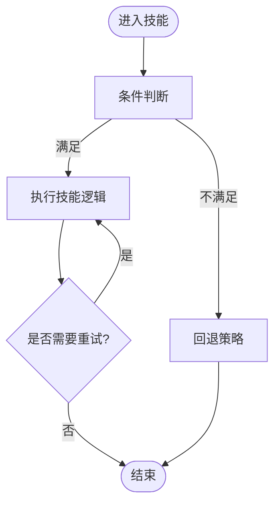
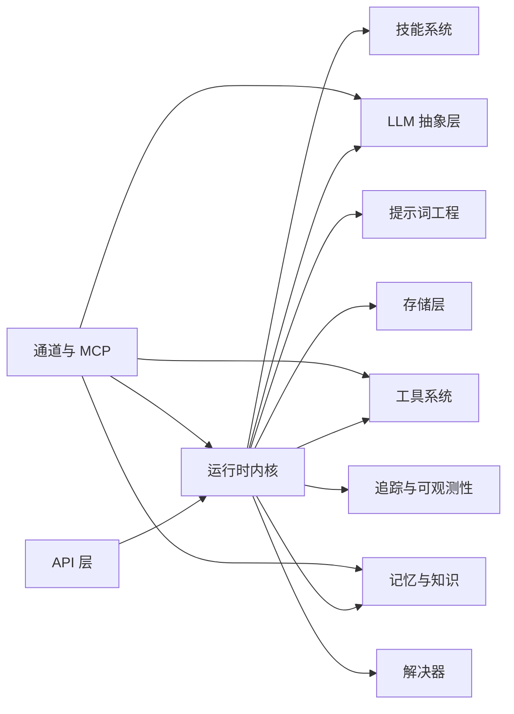

# 整体架构概览

<cite>
**本文档引用的文件**
- [backend/kore/__init__.py](file://backend/kore/__init__.py)
- [backend/pyproject.toml](file://backend/pyproject.toml)
- [backend/kore/api/__init__.py](file://backend/kore/api/__init__.py)
- [backend/kore/llm/__init__.py](file://backend/kore/llm/__init__.py)
- [backend/kore/runtime/__init__.py](file://backend/kore/runtime/__init__.py)
- [backend/kore/skills/__init__.py](file://backend/kore/skills/__init__.py)
- [backend/kore/memory/__init__.py](file://backend/kore/memory/__init__.py)
- [backend/kore/tools/__init__.py](file://backend/kore/tools/__init__.py)
- [backend/kore/knowledge/__init__.py](file://backend/kore/knowledge/__init__.py)
- [backend/kore/prompting/__init__.py](file://backend/kore/prompting/__init__.py)
- [backend/kore/storage/__init__.py](file://backend/kore/storage/__init__.py)
- [backend/kore/channels/__init__.py](file://backend/kore/channels/__init__.py)
- [backend/kore/mcp/__init__.py](file://backend/kore/mcp/__init__.py)
- [backend/kore/solver/__init__.py](file://backend/kore/solver/__init__.py)
- [backend/kore/tracing/__init__.py](file://backend/kore/tracing/__init__.py)
</cite>

## 目录
1. [引言](#引言)
2. [项目结构](#项目结构)
3. [核心组件](#核心组件)
4. [架构总览](#架构总览)
5. [详细组件分析](#详细组件分析)
6. [依赖关系分析](#依赖关系分析)
7. [性能考虑](#性能考虑)
8. [故障排除指南](#故障排除指南)
9. [结论](#结论)

## 引言
本文件面向 Kore 智能体框架，提供整体架构概览与设计说明。Kore 采用模块化分层设计，围绕“智能体内核”构建，通过 LLM 抽象、技能系统、工具系统、记忆与知识、通道与 MCP 等子系统协同工作，形成可扩展、可维护、可演进的智能体运行时平台。本文档旨在帮助读者快速理解 Kore 的系统边界、模块职责、数据流与控制流，并对比传统架构模式，阐明 Kore 的设计原则与创新点。

## 项目结构
Kore 的后端以 Python 包形式组织，采用按功能域划分的模块化布局：  
- 核心运行时（runtime）：承载智能体内核与状态管理  
- 语言模型抽象（llm）：统一接入不同推理后端  
- 技能系统（skills）：封装可复用的智能体行为  
- 工具系统（tools）：提供外部能力调用接口  
- 记忆与知识（memory、knowledge）：支撑上下文与知识检索  
- 通道与 MCP（channels、mcp）：连接外部世界与智能体  
- 提示词工程（prompting）：结构化提示词与模板管理  
- 存储（storage）：持久化与缓存  
- API 层（api）：对外暴露服务接口  
- 追踪与可观测性（tracing）：日志与链路追踪  
- 解决器（solver）：问题求解与决策流程编排  

**图表来源**
- [backend/kore/api/__init__.py](file://backend/kore/api/__init__.py)
- [backend/kore/runtime/__init__.py](file://backend/kore/runtime/__init__.py)
- [backend/kore/llm/__init__.py](file://backend/kore/llm/__init__.py)
- [backend/kore/skills/__init__.py](file://backend/kore/skills/__init__.py)
- [backend/kore/tools/__init__.py](file://backend/kore/tools/__init__.py)
- [backend/kore/memory/__init__.py](file://backend/kore/memory/__init__.py)
- [backend/kore/knowledge/__init__.py](file://backend/kore/knowledge/__init__.py)
- [backend/kore/prompting/__init__.py](file://backend/kore/prompting/__init__.py)
- [backend/kore/storage/__init__.py](file://backend/kore/storage/__init__.py)
- [backend/kore/channels/__init__.py](file://backend/kore/channels/__init__.py)
- [backend/kore/mcp/__init__.py](file://backend/kore/mcp/__init__.py)
- [backend/kore/solver/__init__.py](file://backend/kore/solver/__init__.py)
- [backend/kore/tracing/__init__.py](file://backend/kore/tracing/__init__.py)

**章节来源**
- [backend/kore/__init__.py](file://backend/kore/__init__.py)
- [backend/pyproject.toml](file://backend/pyproject.toml)

## 核心组件
- 运行时内核（runtime）：作为智能体的中枢，负责状态管理、调度与协调各子系统，是数据流与控制流的汇聚点。  
- LLM 抽象层（llm）：屏蔽底层推理后端差异，提供统一的提示词注入、响应解析与流式处理能力。  
- 技能系统（skills）：封装可组合的行为单元，支持条件分支、重试、回退策略，便于复用与测试。  
- 工具系统（tools）：提供外部能力调用接口，支持参数校验、错误处理与结果转换。  
- 记忆与知识（memory、knowledge）：管理对话历史、长期记忆与知识库检索，支撑上下文增强与检索增强生成（RAG）。  
- 通道与 MCP（channels、mcp）：桥接外部协议与消息格式，实现多模态输入输出与外部系统集成。  
- 提示词工程（prompting）：结构化提示词模板与变量注入，确保提示词一致性与可维护性。  
- 存储层（storage）：提供键值、对象与缓存能力，支撑会话、配置与中间结果持久化。  
- API 层（api）：对外暴露 REST/GraphQL 接口，负责请求路由、鉴权与响应封装。  
- 追踪与可观测性（tracing）：记录链路、指标与日志，辅助调试与性能分析。  
- 解决器（solver）：对复杂任务进行分解、规划与执行，协调多个技能与工具完成端到端流程。

**章节来源**
- [backend/kore/runtime/__init__.py](file://backend/kore/runtime/__init__.py)
- [backend/kore/llm/__init__.py](file://backend/kore/llm/__init__.py)
- [backend/kore/skills/__init__.py](file://backend/kore/skills/__init__.py)
- [backend/kore/tools/__init__.py](file://backend/kore/tools/__init__.py)
- [backend/kore/memory/__init__.py](file://backend/kore/memory/__init__.py)
- [backend/kore/knowledge/__init__.py](file://backend/kore/knowledge/__init__.py)
- [backend/kore/prompting/__init__.py](file://backend/kore/prompting/__init__.py)
- [backend/kore/storage/__init__.py](file://backend/kore/storage/__init__.py)
- [backend/kore/api/__init__.py](file://backend/kore/api/__init__.py)
- [backend/kore/tracing/__init__.py](file://backend/kore/tracing/__init__.py)
- [backend/kore/solver/__init__.py](file://backend/kore/solver/__init__.py)
- [backend/kore/channels/__init__.py](file://backend/kore/channels/__init__.py)
- [backend/kore/mcp/__init__.py](file://backend/kore/mcp/__init__.py)

## 架构总览
Kore 采用“分层+插件化”的混合架构：  
- 分层清晰：API → 运行时内核 → 抽象层（LLM/工具/记忆/知识）→ 外部通道  
- 插件化：各子系统以接口契约解耦，支持替换与扩展  
- 数据流：请求经 API 路由至运行时内核，内核根据技能/提示词组装 LLM 输入，调用 LLM 后解析响应，结合工具与记忆/知识进行决策与执行，最终通过通道返回结果  
- 控制流：运行时内核负责编排，解决器负责复杂任务规划，追踪模块贯穿始终

**图表来源**
- [backend/kore/api/__init__.py](file://backend/kore/api/__init__.py)
- [backend/kore/runtime/__init__.py](file://backend/kore/runtime/__init__.py)
- [backend/kore/llm/__init__.py](file://backend/kore/llm/__init__.py)
- [backend/kore/skills/__init__.py](file://backend/kore/skills/__init__.py)
- [backend/kore/tools/__init__.py](file://backend/kore/tools/__init__.py)
- [backend/kore/memory/__init__.py](file://backend/kore/memory/__init__.py)
- [backend/kore/knowledge/__init__.py](file://backend/kore/knowledge/__init__.py)
- [backend/kore/prompting/__init__.py](file://backend/kore/prompting/__init__.py)
- [backend/kore/storage/__init__.py](file://backend/kore/storage/__init__.py)
- [backend/kore/channels/__init__.py](file://backend/kore/channels/__init__.py)
- [backend/kore/mcp/__init__.py](file://backend/kore/mcp/__init__.py)
- [backend/kore/solver/__init__.py](file://backend/kore/solver/__init__.py)
- [backend/kore/tracing/__init__.py](file://backend/kore/tracing/__init__.py)

## 详细组件分析

### 运行时内核（Runtime）
- 职责：会话管理、技能调度、工具调用编排、记忆/知识读写、结果聚合与返回  
- 设计要点：以“内核”为中心的编排器，向上承接 API 请求，向下协调各子系统；支持并发与异步执行；提供钩子与中间件扩展点  
- 关键交互：与 LLM 抽象层对接提示词与响应；与技能/工具系统协作完成动作；与记忆/知识系统共享上下文；与存储/追踪系统持久化与观测

**图表来源**
- [backend/kore/runtime/__init__.py](file://backend/kore/runtime/__init__.py)
- [backend/kore/llm/__init__.py](file://backend/kore/llm/__init__.py)
- [backend/kore/skills/__init__.py](file://backend/kore/skills/__init__.py)
- [backend/kore/tools/__init__.py](file://backend/kore/tools/__init__.py)
- [backend/kore/memory/__init__.py](file://backend/kore/memory/__init__.py)
- [backend/kore/knowledge/__init__.py](file://backend/kore/knowledge/__init__.py)
- [backend/kore/storage/__init__.py](file://backend/kore/storage/__init__.py)
- [backend/kore/tracing/__init__.py](file://backend/kore/tracing/__init__.py)

**章节来源**
- [backend/kore/runtime/__init__.py](file://backend/kore/runtime/__init__.py)

### LLM 抽象层（LLM）
- 职责：统一提示词注入、响应解析、流式输出与错误处理；屏蔽不同推理后端差异  
- 设计要点：适配器模式，支持多后端切换；提供模板化提示词与变量注入；支持流式与非流式两种模式  
- 关键交互：被运行时内核调用以生成回复；与提示词工程协作；与通道/MCP 协作处理多模态输入输出

**图表来源**
- [backend/kore/llm/__init__.py](file://backend/kore/llm/__init__.py)
- [backend/kore/prompting/__init__.py](file://backend/kore/prompting/__init__.py)
- [backend/kore/channels/__init__.py](file://backend/kore/channels/__init__.py)
- [backend/kore/mcp/__init__.py](file://backend/kore/mcp/__init__.py)

**章节来源**
- [backend/kore/llm/__init__.py](file://backend/kore/llm/__init__.py)

### 技能系统（Skills）
- 职责：封装可复用的智能体行为，支持条件判断、重试、回退与组合  
- 设计要点：以“技能”为最小执行单元；支持幂等与可测试；与运行时内核解耦  
- 关键交互：被运行时内核调度；与工具系统协作；与记忆/知识系统共享上下文

**图表来源**
- [backend/kore/skills/__init__.py](file://backend/kore/skills/__init__.py)
- [backend/kore/runtime/__init__.py](file://backend/kore/runtime/__init__.py)

**章节来源**
- [backend/kore/skills/__init__.py](file://backend/kore/skills/__init__.py)

### 工具系统（Tools）
- 职责：提供外部能力调用接口，封装参数校验、错误处理与结果转换  
- 设计要点：标准化工具接口；支持同步/异步调用；具备超时与熔断机制  
- 关键交互：被运行时内核调用；与 LLM 协作进行思维链推理；与存储层协作持久化中间结果

**章节来源**
- [backend/kore/tools/__init__.py](file://backend/kore/tools/__init__.py)
- [backend/kore/runtime/__init__.py](file://backend/kore/runtime/__init__.py)

### 记忆与知识（Memory & Knowledge）
- 职责：管理对话历史、长期记忆与知识检索，支撑上下文增强与 RAG  
- 设计要点：可插拔的记忆后端；支持向量检索与关键词检索；与提示词工程协作  
- 关键交互：被运行时内核读写；与 LLM 协作增强提示词；与存储层协作持久化

**章节来源**
- [backend/kore/memory/__init__.py](file://backend/kore/memory/__init__.py)
- [backend/kore/knowledge/__init__.py](file://backend/kore/knowledge/__init__.py)
- [backend/kore/prompting/__init__.py](file://backend/kore/prompting/__init__.py)

### 提示词工程（Prompting）
- 职责：结构化提示词模板与变量注入，确保一致性与可维护性  
- 设计要点：模板化与参数化；支持版本化与热更新；与 LLM 抽象层紧密协作  
- 关键交互：为 LLM 提供标准化输入；与运行时内核协作生成最终提示词

**章节来源**
- [backend/kore/prompting/__init__.py](file://backend/kore/prompting/__init__.py)
- [backend/kore/llm/__init__.py](file://backend/kore/llm/__init__.py)

### 存储层（Storage）
- 职责：提供键值、对象与缓存能力，支撑会话、配置与中间结果持久化  
- 设计要点：多后端适配；支持事务与一致性；与运行时内核解耦  
- 关键交互：被运行时内核读写；与记忆/知识系统协作；与追踪系统协作

**章节来源**
- [backend/kore/storage/__init__.py](file://backend/kore/storage/__init__.py)
- [backend/kore/runtime/__init__.py](file://backend/kore/runtime/__init__.py)

### 通道与 MCP（Channels & MCP）
- 职责：桥接外部协议与消息格式，实现多模态输入输出与外部系统集成  
- 设计要点：协议无关；可扩展的消息编解码；与 LLM/工具/记忆系统协作  
- 关键交互：接收外部事件；驱动运行时内核；向外部系统发送结果

**章节来源**
- [backend/kore/channels/__init__.py](file://backend/kore/channels/__init__.py)
- [backend/kore/mcp/__init__.py](file://backend/kore/mcp/__init__.py)
- [backend/kore/runtime/__init__.py](file://backend/kore/runtime/__init__.py)

### 解决器（Solver）
- 职责：对复杂任务进行分解、规划与执行，协调多个技能与工具完成端到端流程  
- 设计要点：任务规划与动态调度；与运行时内核深度协作；支持回滚与补偿  
- 关键交互：接收高层任务；分解为子任务；调度技能/工具执行

**章节来源**
- [backend/kore/solver/__init__.py](file://backend/kore/solver/__init__.py)
- [backend/kore/runtime/__init__.py](file://backend/kore/runtime/__init__.py)

### 追踪与可观测性（Tracing）
- 职责：记录链路、指标与日志，辅助调试与性能分析  
- 设计要点：无侵入埋点；结构化日志；与运行时内核集成  
- 关键交互：贯穿所有模块；与存储层协作持久化观测数据

**章节来源**
- [backend/kore/tracing/__init__.py](file://backend/kore/tracing/__init__.py)
- [backend/kore/runtime/__init__.py](file://backend/kore/runtime/__init__.py)

## 依赖关系分析
- 内聚性：各子系统围绕运行时内核形成高内聚的协作关系  
- 耦合度：通过接口契约解耦，避免循环依赖；API 层仅依赖运行时内核接口  
- 可扩展性：新增子系统只需实现约定接口；后端替换通过适配器模式实现  
- 外部依赖：通过 channels/mcp 与外部系统解耦；存储与 LLM 后端通过抽象层解耦

**图表来源**
- [backend/kore/api/__init__.py](file://backend/kore/api/__init__.py)
- [backend/kore/runtime/__init__.py](file://backend/kore/runtime/__init__.py)
- [backend/kore/llm/__init__.py](file://backend/kore/llm/__init__.py)
- [backend/kore/skills/__init__.py](file://backend/kore/skills/__init__.py)
- [backend/kore/tools/__init__.py](file://backend/kore/tools/__init__.py)
- [backend/kore/memory/__init__.py](file://backend/kore/memory/__init__.py)
- [backend/kore/knowledge/__init__.py](file://backend/kore/knowledge/__init__.py)
- [backend/kore/prompting/__init__.py](file://backend/kore/prompting/__init__.py)
- [backend/kore/storage/__init__.py](file://backend/kore/storage/__init__.py)
- [backend/kore/channels/__init__.py](file://backend/kore/channels/__init__.py)
- [backend/kore/mcp/__init__.py](file://backend/kore/mcp/__init__.py)
- [backend/kore/solver/__init__.py](file://backend/kore/solver/__init__.py)
- [backend/kore/tracing/__init__.py](file://backend/kore/tracing/__init__.py)

## 性能考虑
- 并发与异步：运行时内核应支持并发调度与异步 I/O，减少阻塞  
- 缓存策略：利用存储层缓存热点数据与中间结果，降低重复计算与 I/O  
- 流式处理：优先采用流式输出与增量解析，缩短首字节延迟  
- 资源隔离：通过工具与 LLM 的超时与熔断机制，避免级联故障  
- 观测先行：通过追踪模块持续监控关键路径，及时发现瓶颈

## 故障排除指南
- 请求无响应：检查 API 层路由与运行时内核调度；确认 LLM 后端可用性  
- 结果异常：核查提示词工程与 LLM 响应解析；检查工具调用参数与返回值  
- 记忆缺失：验证记忆/知识系统读写逻辑与存储层状态  
- 集成失败：排查通道与 MCP 的协议与编解码；确认外部系统可达性  
- 性能下降：启用追踪模块定位慢调用；优化缓存与并发策略

## 结论
Kore 智能体框架通过“分层+插件化”的架构设计，实现了模块化、可扩展与可维护的目标。其核心在于以运行时内核为中心的编排能力，配合 LLM 抽象、技能/工具系统、记忆/知识、通道/MCP、提示词工程、存储与追踪等子系统，形成从请求到执行的完整闭环。相较传统集中式架构，Kore 更强调接口契约与解耦，便于替换与扩展；相较纯函数式或事件驱动架构，Kore 在可控性与可观测性方面更具优势。未来可在多租户隔离、动态路由与自适应资源调度等方面进一步演进。