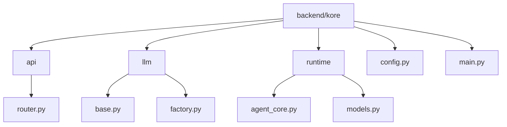
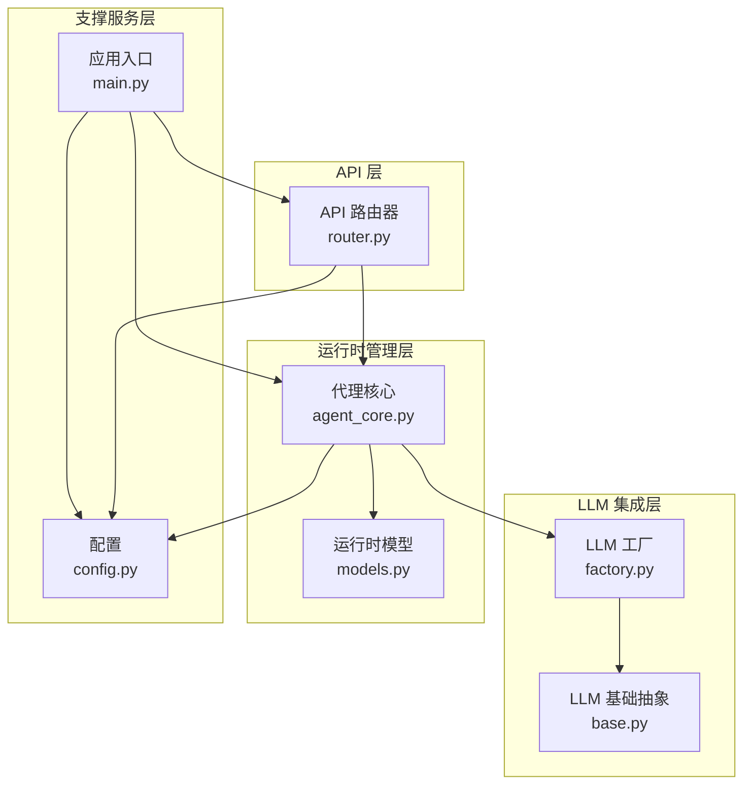
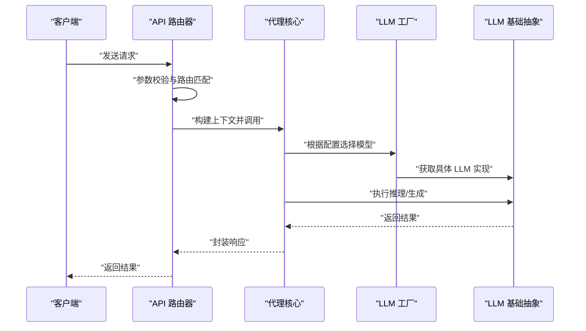
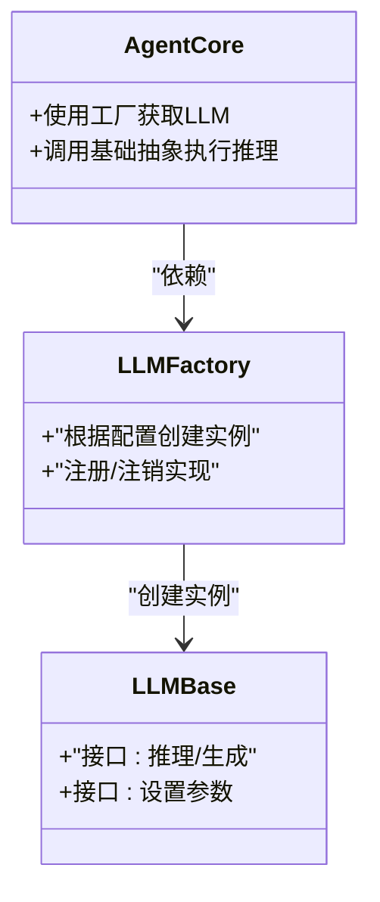
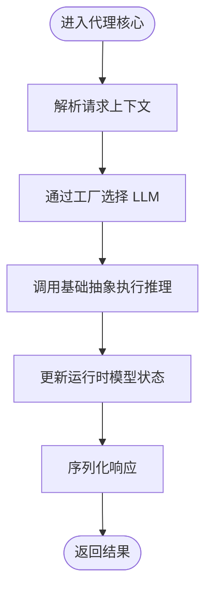
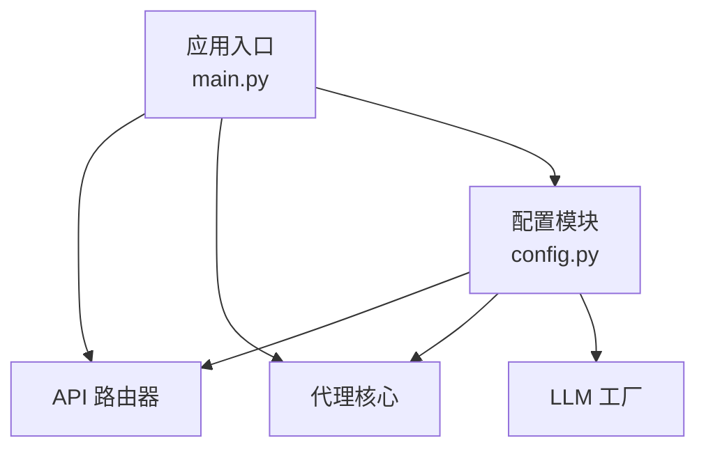
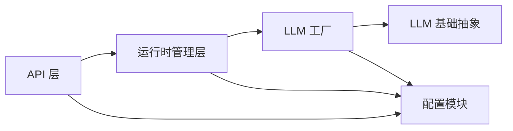

# 核心架构设计

<cite>
**本文档引用的文件**
- [backend/kore/__init__.py](file://backend/kore/__init__.py)
- [backend/kore/api/__init__.py](file://backend/kore/api/__init__.py)
- [backend/kore/llm/__init__.py](file://backend/kore/llm/__init__.py)
- [backend/kore/runtime/__init__.py](file://backend/kore/runtime/__init__.py)
- [backend/kore/main.py](file://backend/kore/main.py)
- [backend/kore/api/router.py](file://backend/kore/api/router.py)
- [backend/kore/llm/base.py](file://backend/kore/llm/base.py)
- [backend/kore/llm/factory.py](file://backend/kore/llm/factory.py)
- [backend/kore/runtime/agent_core.py](file://backend/kore/runtime/agent_core.py)
- [backend/kore/runtime/models.py](file://backend/kore/runtime/models.py)
- [backend/kore/config.py](file://backend/kore/config.py)
- [backend/pyproject.toml](file://backend/pyproject.toml)
</cite>

## 目录
1. [引言](#引言)
2. [项目结构](#项目结构)
3. [核心组件](#核心组件)
4. [架构总览](#架构总览)
5. [详细组件分析](#详细组件分析)
6. [依赖关系分析](#依赖关系分析)
7. [性能考虑](#性能考虑)
8. [故障排除指南](#故障排除指南)
9. [结论](#结论)
10. [附录](#附录)

## 引言
本设计文档面向 Kore 智能体框架，系统性阐述其分层架构与模块化设计。该框架采用清晰的分层组织：API 层负责对外接口与路由；LLM 集成层提供模型抽象与工厂化管理；运行时管理层承载智能体核心逻辑与状态；支撑服务层（配置、工具、存储等）提供横切能力。文档将重点解析各层职责、交互关系、数据与控制流，并给出架构图与组件关系图，帮助开发者快速理解并扩展系统。

## 项目结构
Kore 的后端采用 Python 包结构组织，核心目录包含：
- backend/kore：框架根包
- backend/kore/api：API 层（路由器）
- backend/kore/llm：LLM 集成层（基础抽象与工厂）
- backend/kore/runtime：运行时管理层（代理核心与模型定义）
- backend/kore/config.py：全局配置入口
- backend/kore/main.py：应用入口与初始化
- backend/pyproject.toml：项目依赖与元数据

**图表来源**
- [backend/kore/__init__.py](file://backend/kore/__init__.py)
- [backend/kore/api/__init__.py](file://backend/kore/api/__init__.py)
- [backend/kore/llm/__init__.py](file://backend/kore/llm/__init__.py)
- [backend/kore/runtime/__init__.py](file://backend/kore/runtime/__init__.py)
- [backend/kore/main.py](file://backend/kore/main.py)
- [backend/kore/api/router.py](file://backend/kore/api/router.py)
- [backend/kore/llm/base.py](file://backend/kore/llm/base.py)
- [backend/kore/llm/factory.py](file://backend/kore/llm/factory.py)
- [backend/kore/runtime/agent_core.py](file://backend/kore/runtime/agent_core.py)
- [backend/kore/runtime/models.py](file://backend/kore/runtime/models.py)
- [backend/kore/config.py](file://backend/kore/config.py)

**章节来源**
- [backend/kore/__init__.py](file://backend/kore/__init__.py)
- [backend/kore/api/__init__.py](file://backend/kore/api/__init__.py)
- [backend/kore/llm/__init__.py](file://backend/kore/llm/__init__.py)
- [backend/kore/runtime/__init__.py](file://backend/kore/runtime/__init__.py)
- [backend/kore/main.py](file://backend/kore/main.py)
- [backend/kore/config.py](file://backend/kore/config.py)
- [backend/pyproject.toml](file://backend/pyproject.toml)

## 核心组件
- 主入口与初始化：负责应用启动、配置加载与服务装配。
- API 路由器：承接外部请求，进行参数校验、鉴权与转发至运行时管理层。
- LLM 基础抽象与工厂：统一 LLM 接口契约，按配置动态选择具体实现。
- 运行时代理核心：封装智能体状态、推理循环与技能调用。
- 运行时模型：定义消息、会话、任务等运行时数据结构。
- 配置模块：集中管理环境变量、模型参数与运行参数。

**章节来源**
- [backend/kore/main.py](file://backend/kore/main.py)
- [backend/kore/api/router.py](file://backend/kore/api/router.py)
- [backend/kore/llm/base.py](file://backend/kore/llm/base.py)
- [backend/kore/llm/factory.py](file://backend/kore/llm/factory.py)
- [backend/kore/runtime/agent_core.py](file://backend/kore/runtime/agent_core.py)
- [backend/kore/runtime/models.py](file://backend/kore/runtime/models.py)
- [backend/kore/config.py](file://backend/kore/config.py)

## 架构总览
Kore 采用四层架构：
- API 层：对外暴露 REST/WS 接口，负责请求接入与路由分发。
- LLM 集成层：屏蔽底层模型差异，提供统一工厂与适配接口。
- 运行时管理层：承载智能体生命周期、对话历史、推理与技能执行。
- 支撑服务层：配置、日志、追踪、存储等横切能力。

**图表来源**
- [backend/kore/api/router.py](file://backend/kore/api/router.py)
- [backend/kore/llm/base.py](file://backend/kore/llm/base.py)
- [backend/kore/llm/factory.py](file://backend/kore/llm/factory.py)
- [backend/kore/runtime/agent_core.py](file://backend/kore/runtime/agent_core.py)
- [backend/kore/runtime/models.py](file://backend/kore/runtime/models.py)
- [backend/kore/config.py](file://backend/kore/config.py)
- [backend/kore/main.py](file://backend/kore/main.py)

## 详细组件分析

### API 层：路由器与请求处理
- 职责：接收外部请求，进行参数校验与路由分发，调用运行时管理层执行业务逻辑。
- 关键交互：从配置模块读取运行参数，向代理核心传递请求上下文，返回标准化响应。
- 数据流：请求进入 → 参数校验 → 路由匹配 → 代理核心执行 → 结果序列化返回。

**图表来源**
- [backend/kore/api/router.py](file://backend/kore/api/router.py)
- [backend/kore/runtime/agent_core.py](file://backend/kore/runtime/agent_core.py)
- [backend/kore/llm/factory.py](file://backend/kore/llm/factory.py)
- [backend/kore/llm/base.py](file://backend/kore/llm/base.py)

**章节来源**
- [backend/kore/api/router.py](file://backend/kore/api/router.py)
- [backend/kore/config.py](file://backend/kore/config.py)

### LLM 集成层：抽象与工厂
- 基础抽象：定义统一的 LLM 接口契约，屏蔽不同供应商或本地模型的差异。
- 工厂模式：依据配置动态创建与返回具体 LLM 实例，支持多实现切换与热替换。
- 协作机制：运行时管理层通过工厂获取 LLM 实例，再调用基础抽象方法完成推理。

**图表来源**
- [backend/kore/llm/base.py](file://backend/kore/llm/base.py)
- [backend/kore/llm/factory.py](file://backend/kore/llm/factory.py)
- [backend/kore/runtime/agent_core.py](file://backend/kore/runtime/agent_core.py)

**章节来源**
- [backend/kore/llm/base.py](file://backend/kore/llm/base.py)
- [backend/kore/llm/factory.py](file://backend/kore/llm/factory.py)

### 运行时管理层：代理核心与模型
- 代理核心：封装智能体状态、对话历史、推理循环与技能调用，协调 LLM 工厂与模型数据。
- 运行时模型：定义消息、会话、任务等数据结构，确保跨模块一致的数据契约。
- 控制流：接收请求 → 解析上下文 → 选择模型 → 执行推理 → 更新状态 → 返回结果。

**图表来源**
- [backend/kore/runtime/agent_core.py](file://backend/kore/runtime/agent_core.py)
- [backend/kore/runtime/models.py](file://backend/kore/runtime/models.py)
- [backend/kore/llm/factory.py](file://backend/kore/llm/factory.py)
- [backend/kore/llm/base.py](file://backend/kore/llm/base.py)

**章节来源**
- [backend/kore/runtime/agent_core.py](file://backend/kore/runtime/agent_core.py)
- [backend/kore/runtime/models.py](file://backend/kore/runtime/models.py)

### 支撑服务层：配置与入口
- 配置模块：集中管理运行参数、模型参数与环境变量，为各层提供只读访问。
- 应用入口：负责初始化配置、装配组件、启动服务，确保模块间解耦与可测试性。

**图表来源**
- [backend/kore/config.py](file://backend/kore/config.py)
- [backend/kore/main.py](file://backend/kore/main.py)
- [backend/kore/api/router.py](file://backend/kore/api/router.py)
- [backend/kore/runtime/agent_core.py](file://backend/kore/runtime/agent_core.py)
- [backend/kore/llm/factory.py](file://backend/kore/llm/factory.py)

**章节来源**
- [backend/kore/config.py](file://backend/kore/config.py)
- [backend/kore/main.py](file://backend/kore/main.py)

## 依赖关系分析
- 模块内聚：每个子包（api、llm、runtime）职责单一，内部通过公共接口协作。
- 层间耦合：API 层仅依赖运行时管理层；运行时管理层依赖 LLM 工厂；工厂依赖基础抽象；所有层共享配置模块。
- 外部依赖：通过 pyproject.toml 管理第三方库，避免在代码中硬编码版本。

**图表来源**
- [backend/kore/api/router.py](file://backend/kore/api/router.py)
- [backend/kore/runtime/agent_core.py](file://backend/kore/runtime/agent_core.py)
- [backend/kore/llm/factory.py](file://backend/kore/llm/factory.py)
- [backend/kore/llm/base.py](file://backend/kore/llm/base.py)
- [backend/kore/config.py](file://backend/kore/config.py)

**章节来源**
- [backend/pyproject.toml](file://backend/pyproject.toml)

## 性能考虑
- 模型选择与缓存：通过工厂按需创建 LLM 实例，结合连接池与会话复用减少初始化开销。
- 请求批处理：对相似请求进行合并与去重，降低重复推理成本。
- 异步执行：在 I/O 密集场景采用异步处理，提升吞吐量。
- 内存管理：运行时模型采用不可变数据结构，配合弱引用与定期清理策略，避免内存泄漏。
- 可观测性：集成追踪与指标上报，定位性能瓶颈。

## 故障排除指南
- 配置错误：检查配置模块中的参数类型与默认值，确认环境变量是否正确注入。
- LLM 初始化失败：验证工厂配置项与基础抽象实现，确认网络连通性与认证信息。
- 代理核心异常：查看运行时模型状态一致性，核对推理输入与输出格式。
- API 路由问题：检查路由器映射规则与中间件链路，确保请求路径与方法匹配。

**章节来源**
- [backend/kore/config.py](file://backend/kore/config.py)
- [backend/kore/llm/factory.py](file://backend/kore/llm/factory.py)
- [backend/kore/runtime/agent_core.py](file://backend/kore/runtime/agent_core.py)
- [backend/kore/api/router.py](file://backend/kore/api/router.py)

## 结论
Kore 智能体框架通过清晰的分层架构与模块化设计，在保持低耦合的同时实现了高内聚与可扩展性。API 层、LLM 集成层、运行时管理层与支撑服务层各司其职，配合工厂化与抽象化的 LLM 管理机制，为复杂智能体应用提供了稳健的基础设施。未来可在异步执行、缓存策略与可观测性方面进一步优化，以满足更高性能与可维护性的需求。

## 附录
- 术语表：API 层（对外接口）、LLM 集成层（模型抽象与工厂）、运行时管理层（代理核心与模型）、支撑服务层（配置与横切能力）。
- 版本与依赖：参考 pyproject.toml 中的依赖声明与版本约束。

**章节来源**
- [backend/pyproject.toml](file://backend/pyproject.toml)