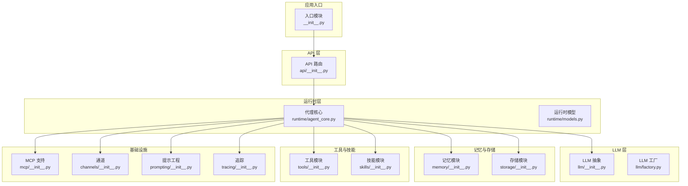
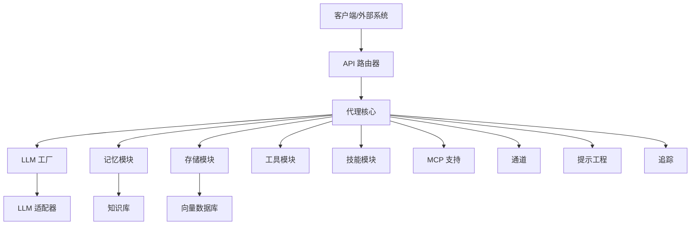
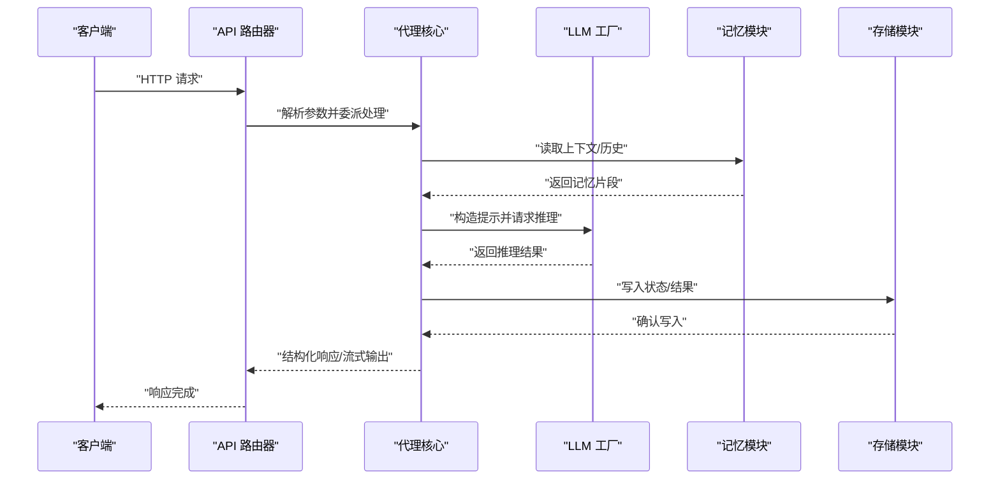
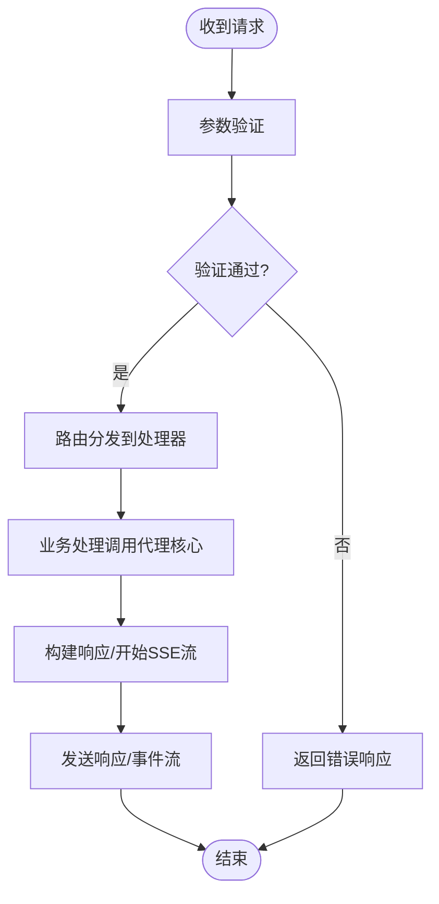
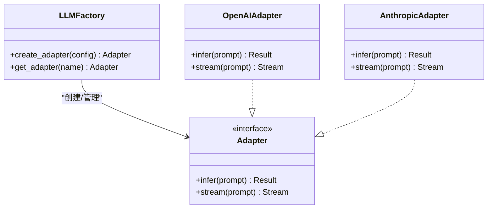
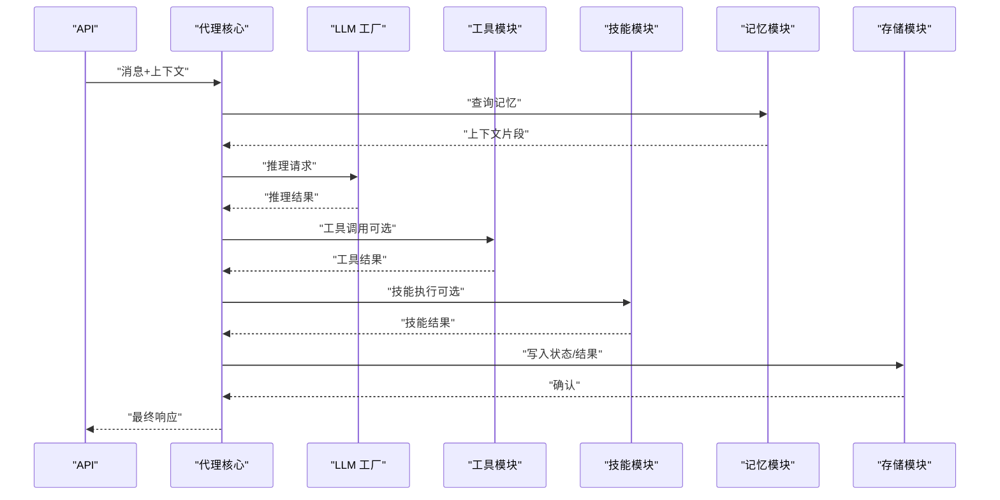
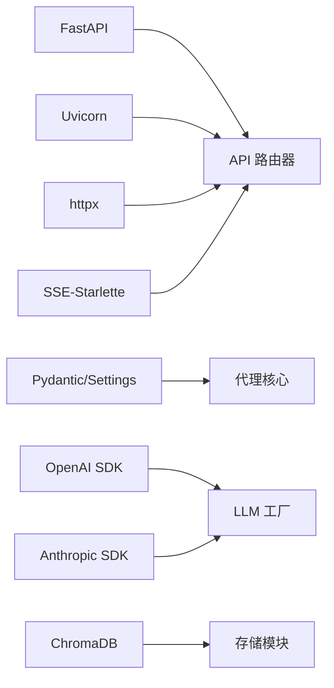

# 核心组件交互

<cite>
**本文档引用的文件**
- [backend/pyproject.toml](file://backend/pyproject.toml)
- [backend/kore/__init__.py](file://backend/kore/__init__.py)
- [backend/kore/api/__init__.py](file://backend/kore/api/__init__.py)
- [backend/kore/llm/__init__.py](file://backend/kore/llm/__init__.py)
- [backend/kore/runtime/__init__.py](file://backend/kore/runtime/__init__.py)
- [backend/kore/memory/__init__.py](file://backend/kore/memory/__init__.py)
- [backend/kore/tools/__init__.py](file://backend/kore/tools/__init__.py)
- [backend/kore/solver/__init__.py](file://backend/kore/solver/__init__.py)
- [backend/kore/storage/__init__.py](file://backend/kore/storage/__init__.py)
- [backend/kore/channels/__init__.py](file://backend/kore/channels/__init__.py)
- [backend/kore/knowledge/__init__.py](file://backend/kore/knowledge/__init__.py)
- [backend/kore/prompting/__init__.py](file://backend/kore/prompting/__init__.py)
- [backend/kore/mcp/__init__.py](file://backend/kore/mcp/__init__.py)
- [backend/kore/tracing/__init__.py](file://backend/kore/tracing/__init__.py)
- [backend/tests/__init__.py](file://backend/tests/__init__.py)
</cite>

## 目录
1. [简介](#简介)
2. [项目结构](#项目结构)
3. [核心组件](#核心组件)
4. [架构总览](#架构总览)
5. [详细组件分析](#详细组件分析)
6. [依赖分析](#依赖分析)
7. [性能考虑](#性能考虑)
8. [故障排查指南](#故障排查指南)
9. [结论](#结论)
10. [附录](#附录)

## 简介
本文件面向 Kore 智能体框架的核心组件交互，聚焦于主控制器（KoreMain）、API 路由器、LLM 工厂、代理核心（Agent Core）等关键模块的协作方式与生命周期管理。文档通过时序图、类图与流程图，系统化阐述组件间通信机制、数据交换格式与控制流，并给出解耦策略、扩展与替换最佳实践以及故障排查建议。

## 项目结构
Kore 采用按功能域划分的模块化组织方式，核心子系统包括：
- API 层：负责对外接口与路由
- LLM 层：抽象与工厂化管理大模型接入
- 运行时层：代理核心与运行时模型
- 记忆与存储：知识与向量检索
- 工具与技能：可插拔能力扩展
- MCP、通道、提示工程、追踪：支撑智能体行为与可观测性

图表来源
- [backend/kore/__init__.py](file://backend/kore/__init__.py)
- [backend/kore/api/__init__.py](file://backend/kore/api/__init__.py)
- [backend/kore/llm/__init__.py](file://backend/kore/llm/__init__.py)
- [backend/kore/runtime/__init__.py](file://backend/kore/runtime/__init__.py)
- [backend/kore/memory/__init__.py](file://backend/kore/memory/__init__.py)
- [backend/kore/tools/__init__.py](file://backend/kore/tools/__init__.py)
- [backend/kore/solver/__init__.py](file://backend/kore/solver/__init__.py)
- [backend/kore/storage/__init__.py](file://backend/kore/storage/__init__.py)
- [backend/kore/channels/__init__.py](file://backend/kore/channels/__init__.py)
- [backend/kore/knowledge/__init__.py](file://backend/kore/knowledge/__init__.py)
- [backend/kore/prompting/__init__.py](file://backend/kore/prompting/__init__.py)
- [backend/kore/mcp/__init__.py](file://backend/kore/mcp/__init__.py)
- [backend/kore/tracing/__init__.py](file://backend/kore/tracing/__init__.py)

章节来源
- [backend/pyproject.toml:1-35](file://backend/pyproject.toml#L1-L35)
- [backend/kore/__init__.py](file://backend/kore/__init__.py)
- [backend/kore/api/__init__.py](file://backend/kore/api/__init__.py)
- [backend/kore/llm/__init__.py](file://backend/kore/llm/__init__.py)
- [backend/kore/runtime/__init__.py](file://backend/kore/runtime/__init__.py)
- [backend/kore/memory/__init__.py](file://backend/kore/memory/__init__.py)
- [backend/kore/tools/__init__.py](file://backend/kore/tools/__init__.py)
- [backend/kore/solver/__init__.py](file://backend/kore/solver/__init__.py)
- [backend/kore/storage/__init__.py](file://backend/kore/storage/__init__.py)
- [backend/kore/channels/__init__.py](file://backend/kore/channels/__init__.py)
- [backend/kore/knowledge/__init__.py](file://backend/kore/knowledge/__init__.py)
- [backend/kore/prompting/__init__.py](file://backend/kore/prompting/__init__.py)
- [backend/kore/mcp/__init__.py](file://backend/kore/mcp/__init__.py)
- [backend/kore/tracing/__init__.py](file://backend/kore/tracing/__init__.py)

## 核心组件
- 主控制器（KoreMain）
  - 职责：协调各子系统初始化、配置加载、生命周期管理与事件分发
  - 关键交互：与 API 路由器、LLM 工厂、代理核心、存储与记忆模块建立连接
- API 路由器
  - 职责：定义 REST 接口、请求解析、响应封装与 SSE 流式输出
  - 关键交互：接收外部请求，委派给代理核心处理，返回结构化结果或流式数据
- LLM 工厂
  - 职责：统一创建与管理不同供应商的大模型实例，屏蔽底层差异
  - 关键交互：根据配置选择适配器，向代理核心提供推理服务
- 代理核心（Agent Core）
  - 职责：编排记忆、工具、技能、存储与提示工程，驱动对话与任务执行
  - 关键交互：消费 LLM 推理结果，调用工具/技能扩展能力，更新记忆与存储

章节来源
- [backend/kore/api/__init__.py](file://backend/kore/api/__init__.py)
- [backend/kore/llm/__init__.py](file://backend/kore/llm/__init__.py)
- [backend/kore/runtime/__init__.py](file://backend/kore/runtime/__init__.py)
- [backend/kore/memory/__init__.py](file://backend/kore/memory/__init__.py)
- [backend/kore/tools/__init__.py](file://backend/kore/tools/__init__.py)
- [backend/kore/storage/__init__.py](file://backend/kore/storage/__init__.py)

## 架构总览
下图展示了 Kore 的高层架构与组件间依赖关系。API 层作为入口，代理核心为核心编排单元，LLM 工厂提供推理能力，记忆与存储支撑状态持久化，工具与技能扩展行为，MCP、通道、提示工程与追踪完善智能体生态。

图表来源
- [backend/kore/api/__init__.py](file://backend/kore/api/__init__.py)
- [backend/kore/runtime/__init__.py](file://backend/kore/runtime/__init__.py)
- [backend/kore/llm/__init__.py](file://backend/kore/llm/__init__.py)
- [backend/kore/memory/__init__.py](file://backend/kore/memory/__init__.py)
- [backend/kore/storage/__init__.py](file://backend/kore/storage/__init__.py)
- [backend/kore/tools/__init__.py](file://backend/kore/tools/__init__.py)
- [backend/kore/solver/__init__.py](file://backend/kore/solver/__init__.py)
- [backend/kore/knowledge/__init__.py](file://backend/kore/knowledge/__init__.py)
- [backend/kore/channels/__init__.py](file://backend/kore/channels/__init__.py)
- [backend/kore/prompting/__init__.py](file://backend/kore/prompting/__init__.py)
- [backend/kore/mcp/__init__.py](file://backend/kore/mcp/__init__.py)
- [backend/kore/tracing/__init__.py](file://backend/kore/tracing/__init__.py)

## 详细组件分析

### 主控制器（KoreMain）与生命周期
- 初始化顺序
  1) 加载配置与环境变量
  2) 初始化日志与追踪
  3) 启动存储与向量数据库
  4) 初始化记忆与知识库
  5) 创建 LLM 工厂与适配器
  6) 构建代理核心并注入依赖
  7) 注册 API 路由与中间件
  8) 启动服务监听
- 生命周期管理
  - 启动阶段：校验依赖可用性，预热 LLM 适配器
  - 运行阶段：接收请求、编排代理核心、处理异常与重试
  - 停止阶段：优雅关闭，释放资源，持久化状态

图表来源
- [backend/kore/api/__init__.py](file://backend/kore/api/__init__.py)
- [backend/kore/runtime/__init__.py](file://backend/kore/runtime/__init__.py)
- [backend/kore/llm/__init__.py](file://backend/kore/llm/__init__.py)
- [backend/kore/memory/__init__.py](file://backend/kore/memory/__init__.py)
- [backend/kore/storage/__init__.py](file://backend/kore/storage/__init__.py)

章节来源
- [backend/kore/__init__.py](file://backend/kore/__init__.py)
- [backend/kore/api/__init__.py](file://backend/kore/api/__init__.py)
- [backend/kore/runtime/__init__.py](file://backend/kore/runtime/__init__.py)

### API 路由器
- 通信机制
  - REST 接口：JSON 请求/响应，支持分页与错误码
  - SSE 流：服务端推送增量结果，客户端按事件流消费
- 数据交换格式
  - 请求体：标准化消息结构（如会话 ID、用户输入、上下文）
  - 响应体：结构化结果或事件流负载
- 控制流程
  - 验证与鉴权 -> 参数解析 -> 路由分发 -> 业务处理 -> 结果封装

图表来源
- [backend/kore/api/__init__.py](file://backend/kore/api/__init__.py)

章节来源
- [backend/kore/api/__init__.py](file://backend/kore/api/__init__.py)

### LLM 工厂
- 设计模式
  - 工厂方法：根据配置动态创建适配器实例
  - 适配器模式：统一大模型接口，屏蔽供应商差异
- 依赖关系
  - 依赖 OpenAI、Anthropic 等 SDK，通过配置切换
  - 与代理核心解耦，仅暴露统一推理接口
- 扩展策略
  - 新增适配器需实现统一接口契约
  - 通过配置项选择适配器，避免硬编码

图表来源
- [backend/kore/llm/__init__.py](file://backend/kore/llm/__init__.py)

章节来源
- [backend/kore/llm/__init__.py](file://backend/kore/llm/__init__.py)

### 代理核心（Agent Core）
- 编排职责
  - 上下文管理：整合历史、记忆与外部状态
  - 工具/技能调度：根据意图选择合适能力
  - 存储与知识：读写向量与结构化数据
  - 提示工程：生成/优化提示词模板
- 与上下游交互
  - 输入：API 解析后的消息与上下文
  - 输出：结构化结果或流式事件
  - 内部：与记忆、存储、工具、技能、LLM 协作

图表来源
- [backend/kore/runtime/__init__.py](file://backend/kore/runtime/__init__.py)
- [backend/kore/api/__init__.py](file://backend/kore/api/__init__.py)
- [backend/kore/llm/__init__.py](file://backend/kore/llm/__init__.py)
- [backend/kore/tools/__init__.py](file://backend/kore/tools/__init__.py)
- [backend/kore/solver/__init__.py](file://backend/kore/solver/__init__.py)
- [backend/kore/memory/__init__.py](file://backend/kore/memory/__init__.py)
- [backend/kore/storage/__init__.py](file://backend/kore/storage/__init__.py)

章节来源
- [backend/kore/runtime/__init__.py](file://backend/kore/runtime/__init__.py)

### 记忆与存储
- 记忆模块
  - 负责短期与长期记忆的读写，支持检索与融合
- 存储模块
  - 结构化数据与向量数据的统一访问，支持索引与查询
- 与代理核心的协作
  - 记忆用于增强上下文，存储用于持久化状态与结果

章节来源
- [backend/kore/memory/__init__.py](file://backend/kore/memory/__init__.py)
- [backend/kore/storage/__init__.py](file://backend/kore/storage/__init__.py)

### 工具与技能
- 工具模块
  - 可插拔能力集合，代理核心按需调用
- 技能模块
  - 领域特定的执行逻辑，封装复杂流程
- 与代理核心的集成
  - 通过统一接口注册与发现，降低耦合

章节来源
- [backend/kore/tools/__init__.py](file://backend/kore/tools/__init__.py)
- [backend/kore/solver/__init__.py](file://backend/kore/solver/__init__.py)

### MCP、通道、提示工程与追踪
- MCP 支持：连接外部 MCP 服务器，扩展能力边界
- 通道：多模态输入输出通道，统一抽象
- 提示工程：模板化与动态提示生成，提升效果稳定性
- 追踪：全链路观测，定位性能瓶颈与异常

章节来源
- [backend/kore/mcp/__init__.py](file://backend/kore/mcp/__init__.py)
- [backend/kore/channels/__init__.py](file://backend/kore/channels/__init__.py)
- [backend/kore/prompting/__init__.py](file://backend/kore/prompting/__init__.py)
- [backend/kore/tracing/__init__.py](file://backend/kore/tracing/__init__.py)

## 依赖分析
- 外部依赖
  - FastAPI、Uvicorn：Web 框架与 ASGI 服务器
  - Pydantic/Settings：配置与数据校验
  - httpx：HTTP 客户端
  - OpenAI/Anthropic：大模型 SDK
  - ChromaDB：向量数据库
  - SSE-Starlette：服务端事件流
- 组件内聚与耦合
  - API 与代理核心通过清晰接口耦合
  - LLM 工厂与适配器通过接口解耦
  - 记忆/存储与代理核心弱耦合，通过契约交互

图表来源
- [backend/pyproject.toml:6-19](file://backend/pyproject.toml#L6-L19)
- [backend/kore/api/__init__.py](file://backend/kore/api/__init__.py)
- [backend/kore/runtime/__init__.py](file://backend/kore/runtime/__init__.py)
- [backend/kore/llm/__init__.py](file://backend/kore/llm/__init__.py)
- [backend/kore/storage/__init__.py](file://backend/kore/storage/__init__.py)

章节来源
- [backend/pyproject.toml:1-35](file://backend/pyproject.toml#L1-L35)

## 性能考虑
- 异步化与并发
  - 使用异步接口处理 I/O 密集型操作（存储、网络）
  - 合理设置并发上限，避免 LLM 与存储成为瓶颈
- 缓存与预热
  - 预热 LLM 适配器，减少首包延迟
  - 缓存热点记忆与常用查询结果
- 流式输出
  - 对长文本与推理过程使用 SSE 流式输出，改善用户体验
- 监控与追踪
  - 通过追踪记录关键路径耗时，定位慢调用

## 故障排查指南
- 常见问题
  - LLM 适配器不可用：检查密钥与网络连通性
  - 存储/向量库异常：确认服务地址与索引状态
  - API 返回错误：核对请求参数与鉴权信息
- 调试步骤
  - 开启追踪与日志，定位具体失败环节
  - 分段测试：先验证 LLM 适配器，再测试存储与记忆
  - 回归最小复现场景，逐步扩大范围
- 重试与降级
  - 对外部依赖实施指数退避重试
  - 在部分能力不可用时启用降级策略（如离线记忆）

章节来源
- [backend/kore/tracing/__init__.py](file://backend/kore/tracing/__init__.py)
- [backend/kore/api/__init__.py](file://backend/kore/api/__init__.py)
- [backend/kore/llm/__init__.py](file://backend/kore/llm/__init__.py)
- [backend/kore/storage/__init__.py](file://backend/kore/storage/__init__.py)

## 结论
Kore 通过清晰的分层与模块化设计，实现了 API、LLM、代理核心、记忆与存储等关键组件的高内聚、低耦合协作。主控制器承担编排与生命周期管理职责，API 路由器提供稳定接口，LLM 工厂屏蔽供应商差异，代理核心作为中枢协调各子系统。遵循本文档的解耦策略与扩展实践，可在保证系统稳定性的同时快速迭代与演进。

## 附录
- 最佳实践
  - 接口契约：统一输入输出格式，明确错误码与状态
  - 配置驱动：通过配置切换适配器与能力开关
  - 可观测性：全链路追踪与指标埋点
  - 安全与鉴权：在 API 层统一处理认证与授权
- 替换与扩展
  - 新增 LLM 适配器：实现统一接口并注册到工厂
  - 新增工具/技能：遵循注册与发现机制，确保幂等与隔离
  - 存储后端替换：保持读写接口一致，迁移索引与数据