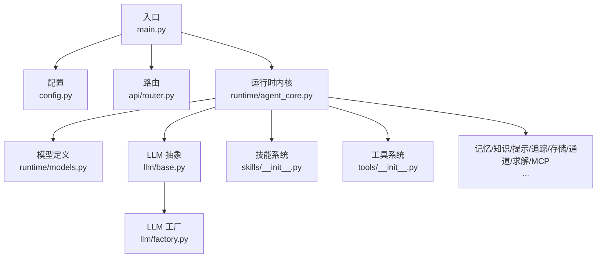
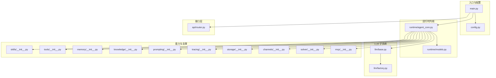
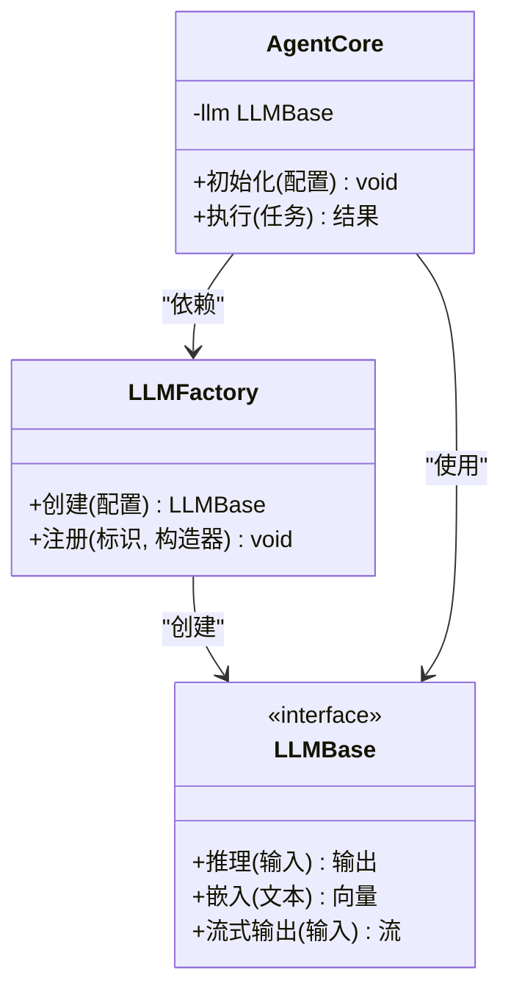
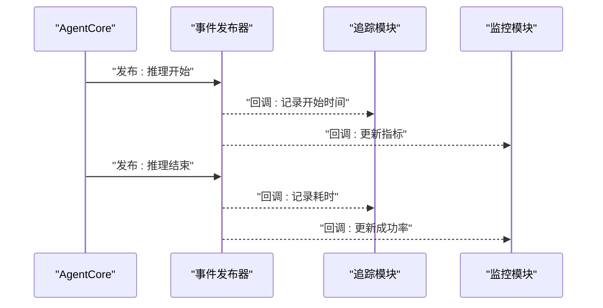
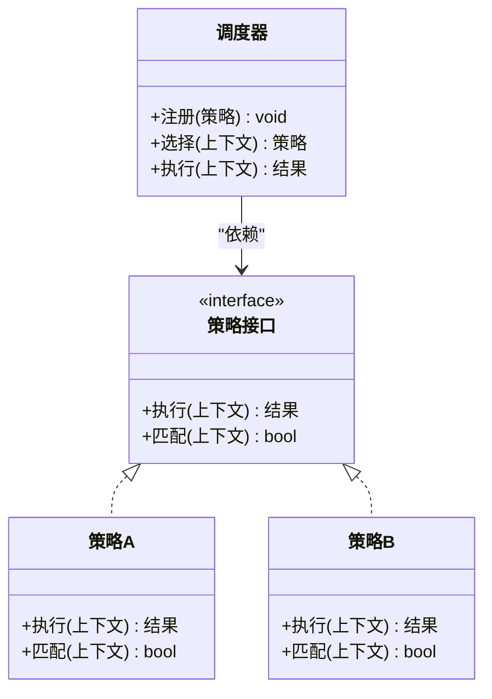
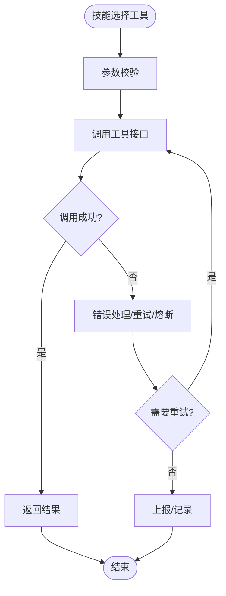
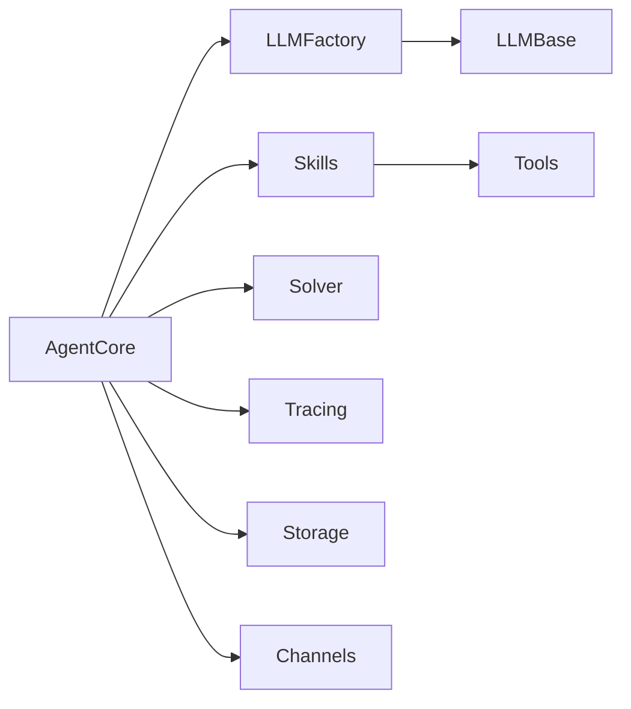

# 设计模式应用

<cite>
**本文引用的文件**
- [backend/kore/__init__.py](file://backend/kore/__init__.py)
- [backend/kore/main.py](file://backend/kore/main.py)
- [backend/kore/config.py](file://backend/kore/config.py)
- [backend/kore/api/router.py](file://backend/kore/api/router.py)
- [backend/kore/runtime/agent_core.py](file://backend/kore/runtime/agent_core.py)
- [backend/kore/runtime/models.py](file://backend/kore/runtime/models.py)
- [backend/kore/llm/base.py](file://backend/kore/llm/base.py)
- [backend/kore/llm/factory.py](file://backend/kore/llm/factory.py)
- [backend/kore/skills/__init__.py](file://backend/kore/skills/__init__.py)
- [backend/kore/tools/__init__.py](file://backend/kore/tools/__init__.py)
- [backend/kore/memory/__init__.py](file://backend/kore/memory/__init__.py)
- [backend/kore/channels/__init__.py](file://backend/kore/channels/__init__.py)
- [backend/kore/knowledge/__init__.py](file://backend/kore/knowledge/__init__.py)
- [backend/kore/prompting/__init__.py](file://backend/kore/prompting/__init__.py)
- [backend/kore/tracing/__init__.py](file://backend/kore/tracing/__init__.py)
- [backend/kore/solver/__init__.py](file://backend/kore/solver/__init__.py)
- [backend/kore/storage/__init__.py](file://backend/kore/storage/__init__.py)
- [backend/kore/mcp/__init__.py](file://backend/kore/mcp/__init__.py)
</cite>

## 目录
1. [引言](#引言)
2. [项目结构](#项目结构)
3. [核心组件](#核心组件)
4. [架构总览](#架构总览)
5. [详细组件分析](#详细组件分析)
6. [依赖关系分析](#依赖关系分析)
7. [性能考量](#性能考量)
8. [故障排查指南](#故障排查指南)
9. [结论](#结论)
10. [附录](#附录)

## 引言
本文件面向 Kore 智能体框架的设计与实现，聚焦于系统中已体现或可扩展的设计模式应用，包括但不限于：工厂模式（LLM 集成）、策略模式（技能系统）、观察者模式（事件与状态变更通知）。我们将从架构视角出发，结合模块职责与交互关系，系统阐述各模式的实现要点、优势与适用场景，并给出最佳实践、常见陷阱以及扩展新功能时的应用指导。

## 项目结构
Kore 后端采用分层与按功能域划分的组织方式：
- 核心入口与配置：main.py、config.py、__init__.py
- 接口层：api/router.py
- 运行时内核：runtime/agent_core.py、runtime/models.py
- LLM 抽象与工厂：llm/base.py、llm/factory.py
- 技能与工具：skills/__init__.py、tools/__init__.py
- 其他支撑模块：memory、channels、knowledge、prompting、tracing、solver、storage、mcp 等

**图表来源**
- [backend/kore/main.py](file://backend/kore/main.py)
- [backend/kore/config.py](file://backend/kore/config.py)
- [backend/kore/api/router.py](file://backend/kore/api/router.py)
- [backend/kore/runtime/agent_core.py](file://backend/kore/runtime/agent_core.py)
- [backend/kore/runtime/models.py](file://backend/kore/runtime/models.py)
- [backend/kore/llm/base.py](file://backend/kore/llm/base.py)
- [backend/kore/llm/factory.py](file://backend/kore/llm/factory.py)
- [backend/kore/skills/__init__.py](file://backend/kore/skills/__init__.py)
- [backend/kore/tools/__init__.py](file://backend/kore/tools/__init__.py)

**章节来源**
- [backend/kore/__init__.py](file://backend/kore/__init__.py)
- [backend/kore/main.py](file://backend/kore/main.py)
- [backend/kore/config.py](file://backend/kore/config.py)
- [backend/kore/api/router.py](file://backend/kore/api/router.py)
- [backend/kore/runtime/agent_core.py](file://backend/kore/runtime/agent_core.py)
- [backend/kore/runtime/models.py](file://backend/kore/runtime/models.py)
- [backend/kore/llm/base.py](file://backend/kore/llm/base.py)
- [backend/kore/llm/factory.py](file://backend/kore/llm/factory.py)
- [backend/kore/skills/__init__.py](file://backend/kore/skills/__init__.py)
- [backend/kore/tools/__init__.py](file://backend/kore/tools/__init__.py)

## 核心组件
- 运行时内核（Agent Core）：负责智能体生命周期、状态管理、任务调度与执行编排，是模式应用的核心载体。
- LLM 抽象与工厂：通过抽象接口统一不同大模型能力，通过工厂按配置动态创建具体实现，提升可替换性与可测试性。
- 技能系统：以策略化方式组织可插拔的行为单元，便于扩展、组合与独立测试。
- 工具系统：封装外部能力调用，作为技能的执行载体，支持统一的输入输出协议与错误处理。
- 路由与配置：提供统一入口与环境参数，驱动运行时行为。

**章节来源**
- [backend/kore/runtime/agent_core.py](file://backend/kore/runtime/agent_core.py)
- [backend/kore/llm/base.py](file://backend/kore/llm/base.py)
- [backend/kore/llm/factory.py](file://backend/kore/llm/factory.py)
- [backend/kore/skills/__init__.py](file://backend/kore/skills/__init__.py)
- [backend/kore/tools/__init__.py](file://backend/kore/tools/__init__.py)
- [backend/kore/api/router.py](file://backend/kore/api/router.py)
- [backend/kore/config.py](file://backend/kore/config.py)

## 架构总览
下图展示 Kore 的高层交互：入口加载配置后启动运行时内核；内核通过工厂创建 LLM 实例，结合技能与工具完成推理与执行；路由对外暴露 API；内存、知识、提示、追踪、存储、通道、求解、MCP 等模块作为支撑服务参与流程。

**图表来源**
- [backend/kore/main.py](file://backend/kore/main.py)
- [backend/kore/config.py](file://backend/kore/config.py)
- [backend/kore/runtime/agent_core.py](file://backend/kore/runtime/agent_core.py)
- [backend/kore/runtime/models.py](file://backend/kore/runtime/models.py)
- [backend/kore/llm/base.py](file://backend/kore/llm/base.py)
- [backend/kore/llm/factory.py](file://backend/kore/llm/factory.py)
- [backend/kore/skills/__init__.py](file://backend/kore/skills/__init__.py)
- [backend/kore/tools/__init__.py](file://backend/kore/tools/__init__.py)
- [backend/kore/memory/__init__.py](file://backend/kore/memory/__init__.py)
- [backend/kore/knowledge/__init__.py](file://backend/kore/knowledge/__init__.py)
- [backend/kore/prompting/__init__.py](file://backend/kore/prompting/__init__.py)
- [backend/kore/tracing/__init__.py](file://backend/kore/tracing/__init__.py)
- [backend/kore/storage/__init__.py](file://backend/kore/storage/__init__.py)
- [backend/kore/channels/__init__.py](file://backend/kore/channels/__init__.py)
- [backend/kore/solver/__init__.py](file://backend/kore/solver/__init__.py)
- [backend/kore/mcp/__init__.py](file://backend/kore/mcp/__init__.py)
- [backend/kore/api/router.py](file://backend/kore/api/router.py)

## 详细组件分析

### 工厂模式：LLM 集成
- 目标与动机
  - 统一不同大模型提供商的接入差异，屏蔽底层实现细节，便于替换与扩展。
  - 通过配置驱动实例化，降低耦合度，提升可测试性（可用模拟实现注入）。
- 关键实现点
  - 抽象层：定义通用接口与能力边界，确保工厂仅面向抽象编程。
  - 工厂层：根据配置选择具体实现，集中管理创建逻辑与依赖注入。
  - 运行时内核：通过工厂获取 LLM 实例，不直接依赖具体实现类。
- 优势
  - 可替换性强：新增模型只需实现抽象接口并注册到工厂。
  - 可测试性高：可在测试环境中注入模拟实现。
  - 可维护性好：创建逻辑集中，变更影响面可控。
- 使用场景
  - 多供应商 LLM 切换、A/B 测试、灰度发布、本地与云端模型切换。
- 建议与陷阱
  - 建议：抽象接口清晰、工厂注册表集中管理、异常路径明确。
  - 陷阱：过度复杂化抽象、工厂承担过多业务逻辑、未考虑并发安全与缓存策略。

**图表来源**
- [backend/kore/llm/base.py](file://backend/kore/llm/base.py)
- [backend/kore/llm/factory.py](file://backend/kore/llm/factory.py)
- [backend/kore/runtime/agent_core.py](file://backend/kore/runtime/agent_core.py)

**章节来源**
- [backend/kore/llm/base.py](file://backend/kore/llm/base.py)
- [backend/kore/llm/factory.py](file://backend/kore/llm/factory.py)
- [backend/kore/runtime/agent_core.py](file://backend/kore/runtime/agent_core.py)

### 观察者模式：事件与状态变更通知
- 目标与动机
  - 在智能体运行过程中，对关键事件（如状态变更、推理开始/结束、工具调用结果）进行广播，使多个订阅者（日志、追踪、监控、告警）能够异步响应。
- 关键实现点
  - 发布者：运行时内核在关键节点触发事件。
  - 订阅者：日志、追踪、监控等模块注册回调，实现解耦。
  - 事件模型：定义事件类型、负载结构与传播语义。
- 优势
  - 松耦合：发布者无需关心订阅者实现。
  - 可扩展：新增订阅者无需修改发布者。
  - 可观测性增强：统一事件源便于审计与调试。
- 使用场景
  - 推理生命周期事件、工具调用事件、内存/知识变更事件、错误与告警事件。
- 建议与陷阱
  - 建议：事件命名规范、幂等处理、异步回调、异常隔离。
  - 陷阱：事件风暴、回调阻塞、循环依赖、丢失事件。

**图表来源**
- [backend/kore/runtime/agent_core.py](file://backend/kore/runtime/agent_core.py)
- [backend/kore/tracing/__init__.py](file://backend/kore/tracing/__init__.py)
- [backend/kore/solver/__init__.py](file://backend/kore/solver/__init__.py)

**章节来源**
- [backend/kore/runtime/agent_core.py](file://backend/kore/runtime/agent_core.py)
- [backend/kore/tracing/__init__.py](file://backend/kore/tracing/__init__.py)
- [backend/kore/solver/__init__.py](file://backend/kore/solver/__init__.py)

### 策略模式：技能系统
- 目标与动机
  - 将智能体的“行为”抽象为可插拔的策略，支持按需组合、动态切换与独立测试，提升灵活性与可维护性。
- 关键实现点
  - 策略接口：定义统一的输入输出契约。
  - 具体策略：实现特定行为（如问答、规划、总结、工具调用）。
  - 策略调度器：根据上下文选择合适策略，支持优先级、条件匹配与组合。
- 优势
  - 可扩展：新增策略不影响既有策略。
  - 可测试：每个策略可独立验证。
  - 可组合：多策略组合形成复杂行为。
- 使用场景
  - 多轮对话策略、任务分解策略、工具选择策略、路由与决策策略。
- 建议与陷阱
  - 建议：策略命名清晰、输入输出协议一致、失败回退策略明确。
  - 陷阱：策略间耦合、状态共享导致副作用、策略选择逻辑复杂化。

**图表来源**
- [backend/kore/skills/__init__.py](file://backend/kore/skills/__init__.py)
- [backend/kore/runtime/agent_core.py](file://backend/kore/runtime/agent_core.py)

**章节来源**
- [backend/kore/skills/__init__.py](file://backend/kore/skills/__init__.py)
- [backend/kore/runtime/agent_core.py](file://backend/kore/runtime/agent_core.py)

### 工具模式：工具系统
- 目标与动机
  - 将外部能力（如搜索引擎、数据库查询、第三方 API）封装为统一工具，供技能系统调用，保证输入输出一致性与错误处理标准化。
- 关键实现点
  - 工具接口：定义调用协议、参数校验、返回值与错误码。
  - 工具实现：按接口实现具体能力。
  - 工具调度：由技能系统选择并调用，支持重试、超时与熔断。
- 优势
  - 可复用：工具可在多个技能中复用。
  - 可测试：可通过桩对象模拟外部依赖。
  - 可治理：统一的可观测性与限流策略。
- 使用场景
  - 搜索、计算、查询、写入、消息发送等。
- 建议与陷阱
  - 建议：参数最小化、错误分类、幂等设计、资源回收。
  - 陷阱：阻塞调用、泄漏资源、未处理网络异常、未记录调用轨迹。

**图表来源**
- [backend/kore/tools/__init__.py](file://backend/kore/tools/__init__.py)
- [backend/kore/skills/__init__.py](file://backend/kore/skills/__init__.py)

**章节来源**
- [backend/kore/tools/__init__.py](file://backend/kore/tools/__init__.py)
- [backend/kore/skills/__init__.py](file://backend/kore/skills/__init__.py)

### 其他支撑模块的模式化潜力
- 内存/知识/提示/追踪/存储/通道/求解/MCP：这些模块可作为“服务提供者”，通过统一接口被运行时内核按需调用，具备良好的可替换性与可测试性基础。建议逐步引入工厂/适配器/门面等模式以进一步解耦与增强扩展性。

**章节来源**
- [backend/kore/memory/__init__.py](file://backend/kore/memory/__init__.py)
- [backend/kore/knowledge/__init__.py](file://backend/kore/knowledge/__init__.py)
- [backend/kore/prompting/__init__.py](file://backend/kore/prompting/__init__.py)
- [backend/kore/tracing/__init__.py](file://backend/kore/tracing/__init__.py)
- [backend/kore/storage/__init__.py](file://backend/kore/storage/__init__.py)
- [backend/kore/channels/__init__.py](file://backend/kore/channels/__init__.py)
- [backend/kore/solver/__init__.py](file://backend/kore/solver/__init__.py)
- [backend/kore/mcp/__init__.py](file://backend/kore/mcp/__init__.py)

## 依赖关系分析
- 耦合与内聚
  - 运行时内核与 LLM 抽象/工厂之间保持高内聚低耦合，通过接口交互。
  - 技能与工具通过统一协议解耦，便于独立演进。
- 外部依赖
  - 配置驱动的外部服务（如 LLM 提供商、存储、通道等），通过工厂与适配器模式接入。
- 循环依赖
  - 当前结构未见明显循环依赖迹象，但应避免在工厂与内核之间引入直接循环引用。

**图表来源**
- [backend/kore/runtime/agent_core.py](file://backend/kore/runtime/agent_core.py)
- [backend/kore/llm/factory.py](file://backend/kore/llm/factory.py)
- [backend/kore/llm/base.py](file://backend/kore/llm/base.py)
- [backend/kore/skills/__init__.py](file://backend/kore/skills/__init__.py)
- [backend/kore/tools/__init__.py](file://backend/kore/tools/__init__.py)
- [backend/kore/solver/__init__.py](file://backend/kore/solver/__init__.py)
- [backend/kore/tracing/__init__.py](file://backend/kore/tracing/__init__.py)
- [backend/kore/storage/__init__.py](file://backend/kore/storage/__init__.py)
- [backend/kore/channels/__init__.py](file://backend/kore/channels/__init__.py)

**章节来源**
- [backend/kore/runtime/agent_core.py](file://backend/kore/runtime/agent_core.py)
- [backend/kore/llm/factory.py](file://backend/kore/llm/factory.py)
- [backend/kore/llm/base.py](file://backend/kore/llm/base.py)
- [backend/kore/skills/__init__.py](file://backend/kore/skills/__init__.py)
- [backend/kore/tools/__init__.py](file://backend/kore/tools/__init__.py)
- [backend/kore/solver/__init__.py](file://backend/kore/solver/__init__.py)
- [backend/kore/tracing/__init__.py](file://backend/kore/tracing/__init__.py)
- [backend/kore/storage/__init__.py](file://backend/kore/storage/__init__.py)
- [backend/kore/channels/__init__.py](file://backend/kore/channels/__init__.py)

## 性能考量
- 工厂模式
  - 缓存与懒加载：对昂贵的 LLM 实例进行缓存，避免重复创建。
  - 并发安全：工厂注册与实例获取需考虑线程安全。
- 观察者模式
  - 异步回调：避免阻塞主线程，必要时使用队列与后台线程。
  - 事件风暴防护：限制事件频率与批量处理。
- 策略模式
  - 策略选择算法优化：对高频选择场景建立索引或预筛选。
  - 策略组合的成本控制：避免过深嵌套与冗余计算。

## 故障排查指南
- LLM 工厂
  - 症状：实例创建失败、配置无效。
  - 排查：确认工厂注册表、配置项映射、异常分支。
- 观察者
  - 症状：事件未到达、回调异常中断。
  - 排查：检查发布顺序、订阅者异常隔离、回调幂等性。
- 技能/工具
  - 症状：策略不生效、工具调用超时。
  - 排查：确认匹配条件、参数校验、重试与熔断策略。

**章节来源**
- [backend/kore/llm/factory.py](file://backend/kore/llm/factory.py)
- [backend/kore/tracing/__init__.py](file://backend/kore/tracing/__init__.py)
- [backend/kore/skills/__init__.py](file://backend/kore/skills/__init__.py)
- [backend/kore/tools/__init__.py](file://backend/kore/tools/__init__.py)

## 结论
Kore 框架在运行时内核与 LLM 集成、技能与工具系统方面已体现出良好的可扩展性与可维护性设计。工厂模式为 LLM 提供了统一接入与灵活替换能力；策略模式为技能系统提供了可插拔与可组合的执行框架；观察者模式为事件与状态变更提供了松耦合的通知机制。未来可在更多模块中推广模式化实践，持续提升系统的可观测性、稳定性与演进速度。

## 附录
- 扩展新功能时的设计模式选择建议
  - 新增 LLM：优先采用工厂模式接入，确保抽象清晰与配置驱动。
  - 新增技能：采用策略模式，定义明确的输入输出与匹配条件。
  - 新增工具：采用工具模式，统一协议与错误处理。
  - 新增可观测性：采用观察者模式，确保事件发布与订阅解耦。
- 最佳实践清单
  - 明确抽象边界，避免过早具体化。
  - 事件与回调异步化，保障主流程稳定。
  - 策略与工具均提供模拟实现，便于单元测试。
  - 对高频路径进行性能评估与优化。
- 常见陷阱规避
  - 避免在工厂中混入业务逻辑。
  - 避免观察者回调阻塞与异常扩散。
  - 避免策略与工具之间的隐式耦合。