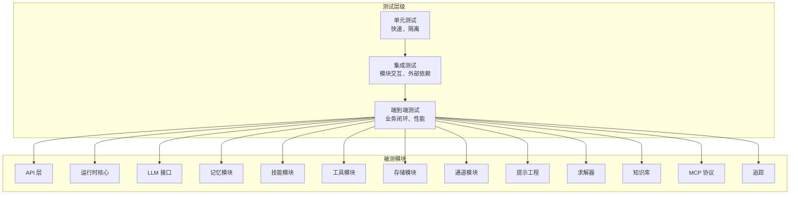
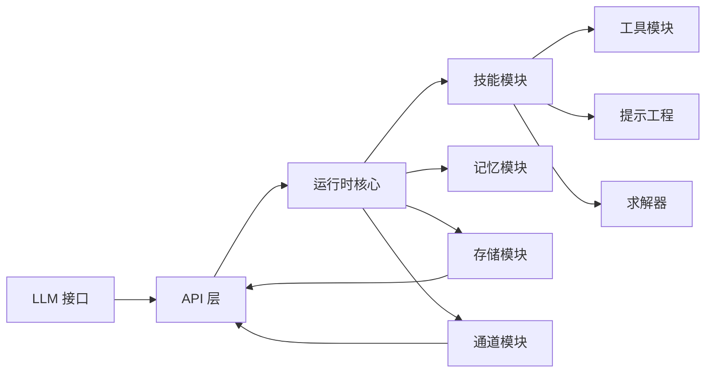

# 测试框架

<cite>
**本文引用的文件**
- [backend/pyproject.toml](file://backend/pyproject.toml)
- [backend/tests/__init__.py](file://backend/tests/__init__.py)
- [backend/kore/__init__.py](file://backend/kore/__init__.py)
- [backend/kore/api/__init__.py](file://backend/kore/api/__init__.py)
- [backend/kore/runtime/__init__.py](file://backend/kore/runtime/__init__.py)
- [backend/kore/llm/__init__.py](file://backend/kore/llm/__init__.py)
- [backend/kore/memory/__init__.py](file://backend/kore/memory/__init__.py)
- [backend/kore/skills/__init__.py](file://backend/kore/skills/__init__.py)
- [backend/kore/tools/__init__.py](file://backend/kore/tools/__init__.py)
- [backend/kore/storage/__init__.py](file://backend/kore/storage/__init__.py)
- [backend/kore/channels/__init__.py](file://backend/kore/channels/__init__.py)
- [backend/kore/prompting/__init__.py](file://backend/kore/prompting/__init__.py)
- [backend/kore/solver/__init__.py](file://backend/kore/solver/__init__.py)
- [backend/kore/knowledge/__init__.py](file://backend/kore/knowledge/__init__.py)
- [backend/kore/mcp/__init__.py](file://backend/kore/mcp/__init__.py)
- [backend/kore/tracing/__init__.py](file://backend/kore/tracing/__init__.py)
</cite>

## 目录
1. [引言](#引言)
2. [项目结构](#项目结构)
3. [核心组件](#核心组件)
4. [架构总览](#架构总览)
5. [详细组件分析](#详细组件分析)
6. [依赖分析](#依赖分析)
7. [性能考虑](#性能考虑)
8. [故障排查指南](#故障排查指南)
9. [结论](#结论)
10. [附录](#附录)

## 引言
本文件面向 Kore 智能体框架的测试体系，系统化阐述测试架构设计与实施方法，覆盖单元测试、集成测试与端到端测试的组织方式；给出测试用例编写规范与最佳实践（测试数据准备、模拟对象、断言方法）；记录自动化测试配置与执行流程（含持续集成与测试报告生成）；解释智能体行为与性能测试的方法论（测试场景设计与指标评估）；提供测试覆盖率与质量度量工具的使用指南；并说明测试环境搭建与管理（测试数据库、模拟服务与隔离策略）。由于当前仓库中未包含具体测试实现文件，本文以现有模块结构为基础，结合通用测试工程实践，形成可落地的测试框架指导。

## 项目结构
后端采用 Python 包结构组织，顶层为 kore 包，内部按功能域划分子包（如 api、runtime、llm、memory、skills、tools、storage 等），tests 目录为空，尚未包含测试实现。pyproject.toml 是项目构建与依赖管理的核心配置文件。

```mermaid
graph TB
A["backend/pyproject.toml<br/>项目配置与依赖"] --> B["backend/kore/__init__.py<br/>kore 包入口"]
B --> C["backend/kore/api/__init__.py<br/>API 层"]
B --> D["backend/kore/runtime/__init__.py<br/>运行时核心"]
B --> E["backend/kore/llm/__init__.py<br/>大模型接口"]
B --> F["backend/kore/memory/__init__.py<br/>记忆模块"]
B --> G["backend/kore/skills/__init__.py<br/>技能模块"]
B --> H["backend/kore/tools/__init__.py<br/>工具模块"]
B --> I["backend/kore/storage/__init__.py<br/>存储模块"]
B --> J["backend/kore/channels/__init__.py<br/>通道模块"]
B --> K["backend/kore/prompting/__init__.py<br/>提示工程"]
B --> L["backend/kore/solver/__init__.py<br/>求解器"]
B --> M["backend/kore/knowledge/__init__.py<br/>知识库"]
B --> N["backend/kore/mcp/__init__.py<br/>MCP 协议"]
B --> O["backend/kore/tracing/__init__.py<br/>追踪"]
P["backend/tests/__init__.py<br/>测试命名空间"] -.-> Q["待填充：单元/集成/E2E 测试实现"]
```

**图示来源**
- [backend/pyproject.toml](file://backend/pyproject.toml)
- [backend/kore/__init__.py](file://backend/kore/__init__.py)
- [backend/kore/api/__init__.py](file://backend/kore/api/__init__.py)
- [backend/kore/runtime/__init__.py](file://backend/kore/runtime/__init__.py)
- [backend/kore/llm/__init__.py](file://backend/kore/llm/__init__.py)
- [backend/kore/memory/__init__.py](file://backend/kore/memory/__init__.py)
- [backend/kore/skills/__init__.py](file://backend/kore/skills/__init__.py)
- [backend/kore/tools/__init__.py](file://backend/kore/tools/__init__.py)
- [backend/kore/storage/__init__.py](file://backend/kore/storage/__init__.py)
- [backend/kore/channels/__init__.py](file://backend/kore/channels/__init__.py)
- [backend/kore/prompting/__init__.py](file://backend/kore/prompting/__init__.py)
- [backend/kore/solver/__init__.py](file://backend/kore/solver/__init__.py)
- [backend/kore/knowledge/__init__.py](file://backend/kore/knowledge/__init__.py)
- [backend/kore/mcp/__init__.py](file://backend/kore/mcp/__init__.py)
- [backend/kore/tracing/__init__.py](file://backend/kore/tracing/__init__.py)
- [backend/tests/__init__.py](file://backend/tests/__init__.py)

**章节来源**
- [backend/pyproject.toml](file://backend/pyproject.toml)
- [backend/tests/__init__.py](file://backend/tests/__init__.py)
- [backend/kore/__init__.py](file://backend/kore/__init__.py)

## 核心组件
- 测试组织与命名空间
  - tests 目录作为测试命名空间，建议按功能域与测试类型分层组织（例如 tests/unit、tests/integration、tests/e2e）。
  - 使用 Python 包结构保持与源码一致的层次，便于导入与发现。
- 依赖与工具链
  - 通过 pyproject.toml 声明测试依赖（如 pytest、coverage、pytest-cov、pytest-mock 等），确保统一的工具链版本与执行环境。
- 配置与发现
  - 在 pyproject.toml 中配置 pytest 的根目录、插件与选项，保证测试自动发现与报告生成的一致性。

**章节来源**
- [backend/tests/__init__.py](file://backend/tests/__init__.py)
- [backend/pyproject.toml](file://backend/pyproject.toml)

## 架构总览
测试架构分为三层：
- 单元测试层：针对独立函数、类或小范围模块进行测试，强调快速、可重复与高覆盖率。
- 集成测试层：验证模块间交互与外部依赖（如存储、LLM 接口、通道等）的行为一致性。
- 端到端测试层：模拟真实用户路径，覆盖完整业务闭环，验证系统整体行为与性能。

**图示来源**
- [backend/kore/api/__init__.py](file://backend/kore/api/__init__.py)
- [backend/kore/runtime/__init__.py](file://backend/kore/runtime/__init__.py)
- [backend/kore/llm/__init__.py](file://backend/kore/llm/__init__.py)
- [backend/kore/memory/__init__.py](file://backend/kore/memory/__init__.py)
- [backend/kore/skills/__init__.py](file://backend/kore/skills/__init__.py)
- [backend/kore/tools/__init__.py](file://backend/kore/tools/__init__.py)
- [backend/kore/storage/__init__.py](file://backend/kore/storage/__init__.py)
- [backend/kore/channels/__init__.py](file://backend/kore/channels/__init__.py)
- [backend/kore/prompting/__init__.py](file://backend/kore/prompting/__init__.py)
- [backend/kore/solver/__init__.py](file://backend/kore/solver/__init__.py)
- [backend/kore/knowledge/__init__.py](file://backend/kore/knowledge/__init__.py)
- [backend/kore/mcp/__init__.py](file://backend/kore/mcp/__init__.py)
- [backend/kore/tracing/__init__.py](file://backend/kore/tracing/__init__.py)

## 详细组件分析

### 单元测试组织与规范
- 组织方式
  - 按功能域划分测试子目录，如 tests/unit/api、tests/unit/runtime 等，与源码结构一一对应。
  - 使用 pytest 参数化与 fixtures 提升用例复用与可维护性。
- 编写规范
  - 命名：test_*.py，测试方法以 test_ 开头，描述明确意图。
  - 断言：优先使用 pytest 内置断言，必要时使用 assertXxx 辅助方法。
  - 数据准备：在 setUp/fixture 中准备最小化、确定性的测试数据。
  - 模拟对象：对 I/O 与外部依赖使用 mock，确保测试稳定与可重复。
- 最佳实践
  - 一个测试只验证一个行为，避免“胖测试”。
  - 使用独立的测试配置与临时资源，避免跨用例耦合。
  - 对异常路径进行显式断言，覆盖边界条件。

**章节来源**
- [backend/tests/__init__.py](file://backend/tests/__init__.py)

### 集成测试组织与规范
- 覆盖范围
  - 关注模块间交互、API 与运行时的协作、LLM 接口与存储的配合、通道与工具链的联动。
- 设计要点
  - 使用轻量级外部依赖（如内存数据库、本地缓存）替代真实服务，提升稳定性。
  - 通过环境变量或配置切换“测试模式”，启用模拟实现与隔离策略。
- 断言与报告
  - 对关键路径进行端到端断言，同时记录中间状态与耗时指标，便于定位问题。

**章节来源**
- [backend/kore/api/__init__.py](file://backend/kore/api/__init__.py)
- [backend/kore/runtime/__init__.py](file://backend/kore/runtime/__init__.py)
- [backend/kore/llm/__init__.py](file://backend/kore/llm/__init__.py)
- [backend/kore/storage/__init__.py](file://backend/kore/storage/__init__.py)
- [backend/kore/channels/__init__.py](file://backend/kore/channels/__init__.py)
- [backend/kore/tools/__init__.py](file://backend/kore/tools/__init__.py)

### 端到端测试组织与规范
- 场景设计
  - 围绕典型智能体工作流：接收输入、路由到技能、调用工具、更新记忆、输出结果。
  - 覆盖多分支与异常路径，如工具调用失败、LLM 返回异常、存储不可用等。
- 执行策略
  - 使用独立的测试数据库与配置，避免与开发/生产环境冲突。
  - 通过容器化或虚拟环境隔离测试进程，确保并发安全。
- 报告与回放
  - 记录请求/响应、中间状态与时间线，支持失败重放与调试。

**章节来源**
- [backend/kore/runtime/__init__.py](file://backend/kore/runtime/__init__.py)
- [backend/kore/skills/__init__.py](file://backend/kore/skills/__init__.py)
- [backend/kore/memory/__init__.py](file://backend/kore/memory/__init__.py)
- [backend/kore/prompting/__init__.py](file://backend/kore/prompting/__init__.py)
- [backend/kore/solver/__init__.py](file://backend/kore/solver/__init__.py)

### 行为测试方法论
- 场景设计
  - 基于业务需求定义行为期望，拆解为可验证的步骤与断言点。
  - 引入“角色驱动”的测试场景，模拟不同用户意图与上下文。
- 断言策略
  - 结果断言：最终输出是否符合预期。
  - 过程断言：关键中间状态与调用序列是否正确。
  - 性能断言：响应时间、吞吐量、资源占用等指标阈值。
- 可重复性
  - 使用固定种子、可控随机源与确定性模拟，确保行为测试可重复。

**章节来源**
- [backend/kore/runtime/__init__.py](file://backend/kore/runtime/__init__.py)
- [backend/kore/skills/__init__.py](file://backend/kore/skills/__init__.py)
- [backend/kore/prompting/__init__.py](file://backend/kore/prompting/__init__.py)

### 性能测试方法论
- 指标体系
  - 响应时间：P50/P90/P99 延迟，错误率。
  - 吞吐量：每秒事务数（TPS）、每核吞吐。
  - 资源占用：CPU、内存、磁盘 IO、网络带宽。
- 压力与稳定性
  - 逐步加压，观察系统拐点与退化行为。
  - 长时间运行（冒烟测试）验证稳定性。
- 工具与平台
  - 使用性能测试框架（如 Locust、JMeter 或自研压测脚本）与监控采集（Prometheus/Grafana）。

**章节来源**
- [backend/kore/runtime/__init__.py](file://backend/kore/runtime/__init__.py)
- [backend/kore/storage/__init__.py](file://backend/kore/storage/__init__.py)
- [backend/kore/llm/__init__.py](file://backend/kore/llm/__init__.py)

### 自动化测试配置与执行流程
- 配置
  - 在 pyproject.toml 中声明 pytest 插件、覆盖阈值、标记过滤等。
  - 定义测试环境变量与配置文件，区分本地、CI 与预发环境。
- 执行
  - 本地：pytest tests/ --cov=backend/kore --cov-report=term-missing --cov-report=xml
  - CI：在流水线中执行 pytest 并上传覆盖率与报告。
- 报告
  - 生成 HTML/文本/XML 报告，结合覆盖率阈值控制合并请求准入。

**章节来源**
- [backend/pyproject.toml](file://backend/pyproject.toml)

### 测试覆盖率与质量度量
- 覆盖率
  - 使用 pytest-cov 收集行、分支、函数、指令级覆盖率，设置最小阈值。
  - 分模块统计覆盖率，识别薄弱环节并补充用例。
- 质量度量
  - 失败率、平均修复时间（MTTR）、回归次数、测试执行时长分布。
  - 将覆盖率与缺陷密度关联，指导测试投入优化。

**章节来源**
- [backend/pyproject.toml](file://backend/pyproject.toml)

### 测试环境搭建与管理
- 隔离策略
  - 使用独立数据库实例或容器，按用例/流水线分配唯一标识。
  - 通过环境变量切换“测试模式”，注入模拟实现与降级策略。
- 模拟服务
  - LLM 接口：提供本地/远程模拟端点，支持错误注入与延迟控制。
  - 存储与通道：使用内存实现或轻量数据库，确保快速初始化与销毁。
- 管理工具
  - Docker Compose/Kind 管理测试依赖，Kubernetes Job 管理大规模并发测试。

**章节来源**
- [backend/kore/llm/__init__.py](file://backend/kore/llm/__init__.py)
- [backend/kore/storage/__init__.py](file://backend/kore/storage/__init__.py)
- [backend/kore/channels/__init__.py](file://backend/kore/channels/__init__.py)

### 实际测试示例与模板（路径指引）
以下为常见测试类型的模板路径指引，便于开发者快速开始编写高质量测试：
- 单元测试模板
  - 示例路径：tests/unit/runtime/test_agent_core.py
  - 内容建议：构造最小输入，断言输出与副作用，使用 mock 替代外部依赖。
- 集成测试模板
  - 示例路径：tests/integration/api/test_router_integration.py
  - 内容建议：启动最小化服务，调用接口并断言响应与状态变更。
- 端到端测试模板
  - 示例路径：tests/e2e/workflows/test_skill_execution.py
  - 内容建议：编排完整流程，断言最终状态与中间事件序列。
- 行为测试模板
  - 示例路径：tests/unit/skills/test_planner_behavior.py
  - 内容建议：基于场景定义期望行为，断言调用顺序与参数。
- 性能测试模板
  - 示例路径：tests/performance/test_throughput.py
  - 内容建议：设定并发与持续时间，采集指标并生成报告。

[本节为模板路径指引，不直接分析具体文件，故无“章节来源”]

## 依赖分析
- 模块内聚与耦合
  - API 与运行时紧密耦合，需在集成测试中重点验证交互契约。
  - LLM 与存储、通道存在间接耦合，应通过适配器与抽象降低耦合度。
- 外部依赖
  - LLM 接口、存储后端、通道协议等外部系统需纳入测试依赖管理。
- 循环依赖规避
  - 通过抽象层与工厂模式避免循环导入，确保测试可编译与可运行。

**图示来源**
- [backend/kore/api/__init__.py](file://backend/kore/api/__init__.py)
- [backend/kore/runtime/__init__.py](file://backend/kore/runtime/__init__.py)
- [backend/kore/llm/__init__.py](file://backend/kore/llm/__init__.py)
- [backend/kore/memory/__init__.py](file://backend/kore/memory/__init__.py)
- [backend/kore/skills/__init__.py](file://backend/kore/skills/__init__.py)
- [backend/kore/tools/__init__.py](file://backend/kore/tools/__init__.py)
- [backend/kore/storage/__init__.py](file://backend/kore/storage/__init__.py)
- [backend/kore/channels/__init__.py](file://backend/kore/channels/__init__.py)
- [backend/kore/prompting/__init__.py](file://backend/kore/prompting/__init__.py)
- [backend/kore/solver/__init__.py](file://backend/kore/solver/__init__.py)

## 性能考虑
- 测试执行效率
  - 使用并发执行与并行参数化，缩短回归周期。
  - 将慢速测试（如 E2E）拆分为快速与慢速两类，CI 中默认运行快速测试。
- 资源消耗控制
  - 限制并发连接数与内存占用，避免测试相互干扰。
  - 使用轻量级模拟与缓存，减少冷启动成本。
- 指标采集与可视化
  - 在 CI 中采集关键指标，建立趋势看板，及时发现性能退化。

[本节提供一般性指导，不直接分析具体文件，故无“章节来源”]

## 故障排查指南
- 常见问题
  - 测试不稳定：检查随机性来源与外部依赖，使用固定种子与模拟。
  - 覆盖率低：补充边界与异常路径用例，关注未覆盖模块。
  - CI 失败：优先查看失败用例日志与覆盖率报告，定位根因。
- 调试技巧
  - 使用 pytest 的 -s 与 -v 输出详细信息。
  - 通过 fixture 的生命周期与作用域定位资源泄漏。
  - 对性能问题使用火焰图与时间线分析工具。

[本节提供一般性指导，不直接分析具体文件，故无“章节来源”]

## 结论
本测试框架文档以模块化视角规划了 Kore 智能体系统的测试体系，明确了单元、集成与端到端测试的职责边界与协作关系，并提供了行为与性能测试的方法论与工具链建议。建议尽快完善 tests 目录下的实现，结合 pyproject.toml 的配置，形成可执行、可观测、可持续改进的测试闭环。

## 附录
- 快速开始清单
  - 在 tests 目录下创建 unit、integration、e2e 三类目录。
  - 在 pyproject.toml 中声明 pytest、coverage、mock 等依赖。
  - 编写首个单元测试与集成测试，验证最小闭环。
  - 在 CI 中加入测试与覆盖率检查，设置阈值与报告上传。

[本节为操作建议，不直接分析具体文件，故无“章节来源”]