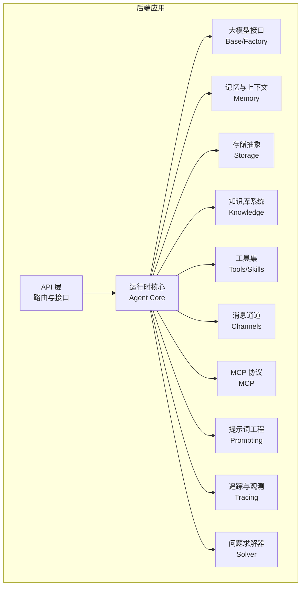
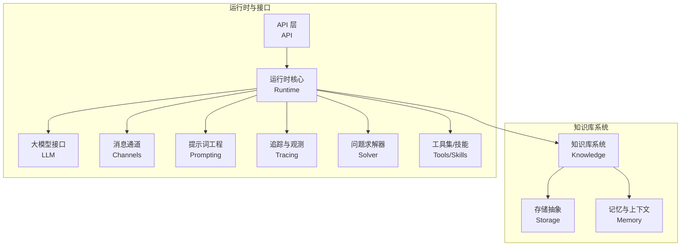
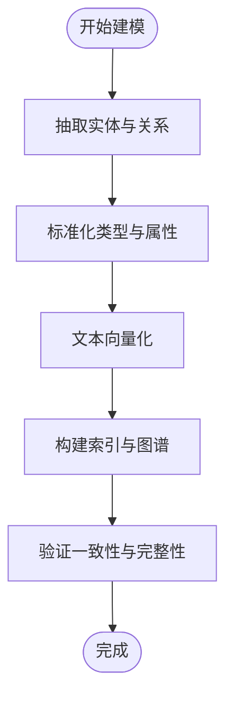
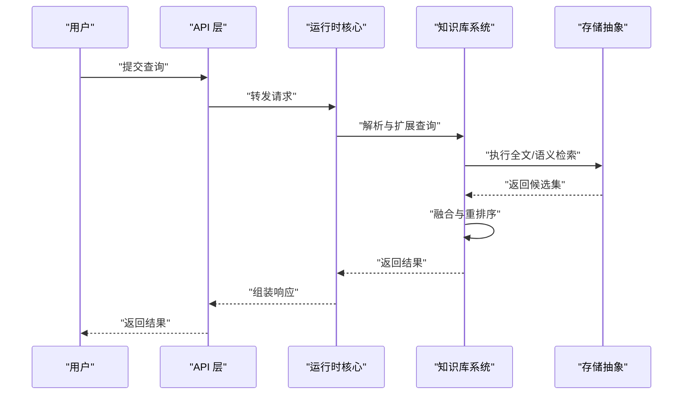
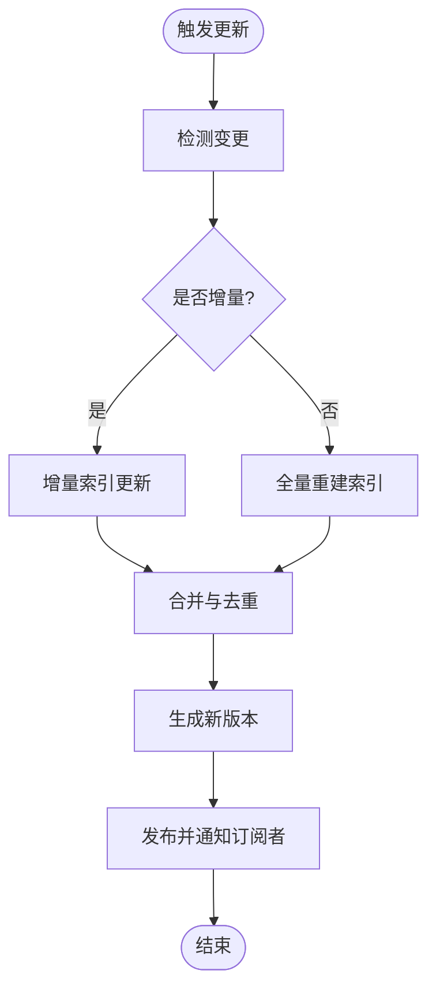
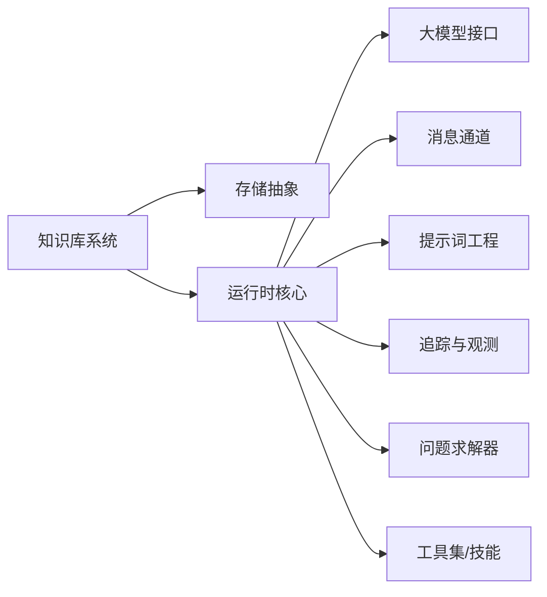

# 知识库系统

<cite>
**本文引用的文件**
- [backend/pyproject.toml](file://backend/pyproject.toml)
- [backend/kore/__init__.py](file://backend/kore/__init__.py)
- [backend/kore/api/__init__.py](file://backend/kore/api/__init__.py)
- [backend/kore/knowledge/__init__.py](file://backend/kore/knowledge/__init__.py)
- [backend/kore/storage/__init__.py](file://backend/kore/storage/__init__.py)
- [backend/kore/memory/__init__.py](file://backend/kore/memory/__init__.py)
- [backend/kore/runtime/__init__.py](file://backend/kore/runtime/__init__.py)
- [backend/kore/llm/base.py](file://backend/kore/llm/base.py)
- [backend/kore/llm/factory.py](file://backend/kore/llm/factory.py)
- [backend/kore/solver/__init__.py](file://backend/kore/solver/__init__.py)
- [backend/kore/tools/__init__.py](file://backend/kore/tools/__init__.py)
- [backend/kore/channels/__init__.py](file://backend/kore/channels/__init__.py)
- [backend/kore/mcp/__init__.py](file://backend/kore/mcp/__init__.py)
- [backend/kore/prompting/__init__.py](file://backend/kore/prompting/__init__.py)
- [backend/kore/tracing/__init__.py](file://backend/kore/tracing/__init__.py)
</cite>

## 目录
1. [简介](#简介)
2. [项目结构](#项目结构)
3. [核心组件](#核心组件)
4. [架构总览](#架构总览)
5. [详细组件分析](#详细组件分析)
6. [依赖分析](#依赖分析)
7. [性能考虑](#性能考虑)
8. [故障排查指南](#故障排查指南)
9. [结论](#结论)
10. [附录](#附录)

## 简介
本文件面向 Kore 智能体框架的知识库系统，提供从架构设计到实现细节的系统化技术文档。当前仓库中知识库相关模块以空的初始化文件形式存在，尚未包含具体实现代码。本文在不臆测缺失实现的前提下，基于现有目录结构与模块命名，给出知识库系统的概念性架构、数据流与交互模式、可扩展的设计原则与最佳实践建议，帮助开发者在后续迭代中高效落地知识存储、检索、更新与治理能力。

## 项目结构
后端采用 Python 包结构组织，顶层模块按功能域划分：API、LLM、Runtime、Memory、Storage、Knowledge、Solver、Tools、Channels、MCP、Prompting、Tracing 等。知识库系统作为核心能力之一，位于 knowledge 子包；存储抽象位于 storage 子包；运行时与代理核心位于 runtime 子包；大模型接口位于 llm 子包；工具与技能位于 tools/skills 子包；消息通道位于 channels 子包；提示词工程位于 prompting 子包；追踪与可观测性位于 tracing 子包；问题求解器位于 solver 子包；MCP（Model Context Protocol）位于 mcp 子包。

**图表来源**
- [backend/kore/api/__init__.py](file://backend/kore/api/__init__.py)
- [backend/kore/runtime/__init__.py](file://backend/kore/runtime/__init__.py)
- [backend/kore/llm/base.py](file://backend/kore/llm/base.py)
- [backend/kore/llm/factory.py](file://backend/kore/llm/factory.py)
- [backend/kore/memory/__init__.py](file://backend/kore/memory/__init__.py)
- [backend/kore/storage/__init__.py](file://backend/kore/storage/__init__.py)
- [backend/kore/knowledge/__init__.py](file://backend/kore/knowledge/__init__.py)
- [backend/kore/tools/__init__.py](file://backend/kore/tools/__init__.py)
- [backend/kore/channels/__init__.py](file://backend/kore/channels/__init__.py)
- [backend/kore/mcp/__init__.py](file://backend/kore/mcp/__init__.py)
- [backend/kore/prompting/__init__.py](file://backend/kore/prompting/__init__.py)
- [backend/kore/tracing/__init__.py](file://backend/kore/tracing/__init__.py)
- [backend/kore/solver/__init__.py](file://backend/kore/solver/__init__.py)

**章节来源**
- [backend/pyproject.toml](file://backend/pyproject.toml)
- [backend/kore/__init__.py](file://backend/kore/__init__.py)

## 核心组件
- 知识库系统（Knowledge）
  - 职责：承载知识的建模、存储、检索与更新流程，作为智能体推理与决策的知识基础。
  - 当前状态：初始化文件存在，具体实现尚未落地。
- 存储抽象（Storage）
  - 职责：提供统一的数据持久化接口，屏蔽底层存储差异（如向量库、关系数据库、对象存储等）。
  - 当前状态：初始化文件存在，具体实现尚未落地。
- 运行时核心（Runtime）
  - 职责：编排 Agent 的生命周期、上下文管理、工具调用与外部服务交互。
  - 当前状态：初始化文件存在，具体实现尚未落地。
- 大模型接口（LLM）
  - 职责：统一 LLM 访问接口与工厂模式，支持多模型适配与切换。
  - 已有实现：base.py、factory.py。
- 记忆与上下文（Memory）
  - 职责：维护对话历史、短期记忆与长期记忆，支撑上下文窗口与检索增强生成（RAG）。
  - 当前状态：初始化文件存在，具体实现尚未落地。
- 工具与技能（Tools/Skills）
  - 职责：封装外部能力与领域技能，供运行时调用。
  - 当前状态：初始化文件存在，具体实现尚未落地。
- 消息通道（Channels）
  - 职责：统一消息收发与协议适配，连接不同来源与目标。
  - 当前状态：初始化文件存在，具体实现尚未落地。
- MCP（Model Context Protocol）
  - 职责：标准化模型上下文交互协议，便于跨系统协作。
  - 当前状态：初始化文件存在，具体实现尚未落地。
- 提示词工程（Prompting）
  - 职责：构建高质量提示词模板与参数化策略，提升输出一致性与可控性。
  - 当前状态：初始化文件存在，具体实现尚未落地。
- 追踪与观测（Tracing）
  - 职责：记录执行轨迹、指标与日志，辅助调试与性能分析。
  - 当前状态：初始化文件存在，具体实现尚未落地。
- 问题求解器（Solver）
  - 职责：对复杂任务进行分解、规划与求解，结合知识库与工具链。
  - 当前状态：初始化文件存在，具体实现尚未落地。

**章节来源**
- [backend/kore/knowledge/__init__.py](file://backend/kore/knowledge/__init__.py)
- [backend/kore/storage/__init__.py](file://backend/kore/storage/__init__.py)
- [backend/kore/runtime/__init__.py](file://backend/kore/runtime/__init__.py)
- [backend/kore/llm/base.py](file://backend/kore/llm/base.py)
- [backend/kore/llm/factory.py](file://backend/kore/llm/factory.py)
- [backend/kore/memory/__init__.py](file://backend/kore/memory/__init__.py)
- [backend/kore/tools/__init__.py](file://backend/kore/tools/__init__.py)
- [backend/kore/channels/__init__.py](file://backend/kore/channels/__init__.py)
- [backend/kore/mcp/__init__.py](file://backend/kore/mcp/__init__.py)
- [backend/kore/prompting/__init__.py](file://backend/kore/prompting/__init__.py)
- [backend/kore/tracing/__init__.py](file://backend/kore/tracing/__init__.py)
- [backend/kore/solver/__init__.py](file://backend/kore/solver/__init__.py)

## 架构总览
知识库系统在 Kore 中扮演“知识基础”的角色，贯穿于运行时的检索、推理与决策过程。下图展示了知识库与各子系统的交互关系与数据流向。

**图表来源**
- [backend/kore/knowledge/__init__.py](file://backend/kore/knowledge/__init__.py)
- [backend/kore/storage/__init__.py](file://backend/kore/storage/__init__.py)
- [backend/kore/memory/__init__.py](file://backend/kore/memory/__init__.py)
- [backend/kore/runtime/__init__.py](file://backend/kore/runtime/__init__.py)
- [backend/kore/api/__init__.py](file://backend/kore/api/__init__.py)
- [backend/kore/llm/base.py](file://backend/kore/llm/base.py)
- [backend/kore/llm/factory.py](file://backend/kore/llm/factory.py)
- [backend/kore/channels/__init__.py](file://backend/kore/channels/__init__.py)
- [backend/kore/prompting/__init__.py](file://backend/kore/prompting/__init__.py)
- [backend/kore/tracing/__init__.py](file://backend/kore/tracing/__init__.py)
- [backend/kore/solver/__init__.py](file://backend/kore/solver/__init__.py)
- [backend/kore/tools/__init__.py](file://backend/kore/tools/__init__.py)

## 详细组件分析
本节从“知识表示与建模”“检索机制与优化”“更新与同步策略”“配置与维护”“安全与访问控制”五个维度，结合现有模块边界，提出可落地的设计与实施建议。

### 知识表示与建模
- 实体与关系建模
  - 建议采用三元组（主体-谓词-客体）或属性图结构表达实体与关系，支持类型约束与继承层次。
  - 可引入轻量级本体描述语言（如 OWL/RDF 的简化子集）定义类、属性与约束。
- 语义网络
  - 将文档、段落、句子映射为节点，通过共指消解与语义相似度建立边权重，形成可检索的语义网络。
- 知识图谱
  - 对高频实体与关系建立图谱索引，支持路径查询与推理扩展。
- 向量化与嵌入
  - 使用预训练嵌入模型（如 Sentence-BERT）对文本进行向量化，支撑高效相似度计算与聚类。

[此图为概念性流程图，无需图表来源]

### 检索机制与优化
- 全文检索
  - 基于倒排索引与 BM25 算法，支持关键词匹配与短语检索。
- 语义检索
  - 基于向量相似度（余弦/内积），结合 FAISS/Pinecone 等向量库加速近似最近邻搜索。
- 多路融合
  - 将全文与语义结果按权重融合，引入重排序（如学习排序）提升最终相关性。
- 查询扩展与纠错
  - 使用同义词表与拼写纠错模型提升召回质量。
- 缓存与预取
  - 对热点查询与常见意图进行缓存与预取，降低延迟。

[此图为概念性序列图，无需图表来源]

### 更新与同步策略
- 增量更新
  - 基于时间戳或版本号识别新增/变更内容，仅对受影响片段重建索引。
- 冲突解决
  - 采用“最后写入获胜”或基于语义相似度的合并策略，避免重复与冗余。
- 版本管理
  - 引入快照与回滚机制，支持灰度发布与 A/B 测试。
- 同步与异步
  - 对实时性要求高的场景采用同步更新，对批处理场景采用异步队列与批量索引。

[此图为概念性流程图，无需图表来源]

### 配置与维护
- 数据导入
  - 支持结构化（JSON/CSV/XML）与非结构化（PDF/Markdown/HTML）文档导入，内置清洗与分块策略。
- 索引优化
  - 定期重组向量索引、清理无效键值、压缩倒排表，平衡存储与查询性能。
- 性能调优
  - 调整向量维度、索引类型（IVF/PQ/Flat）、并发度与缓存大小；监控延迟与吞吐量。
- 监控与告警
  - 关键指标包括检索延迟、命中率、索引大小、写入速率与错误率。

[本节为通用运维建议，无需章节来源]

### 安全与访问控制
- 身份认证与授权
  - 基于令牌（JWT/OAuth）进行身份校验，按租户/用户/资源粒度控制访问权限。
- 数据脱敏与加密
  - 对敏感字段进行脱敏处理；传输与静态数据采用加密保护。
- 审计与追踪
  - 记录所有访问与修改操作，支持审计报表与溯源分析。
- 隐私合规
  - 遵循数据最小化原则，提供删除与导出请求处理流程。

[本节为通用安全建议，无需章节来源]

## 依赖分析
- 模块耦合
  - 知识库系统与存储抽象强耦合，需通过统一接口屏蔽底层差异。
  - 与运行时核心弱耦合，通过事件/回调方式集成检索结果。
- 外部依赖
  - 向量库与搜索引擎（如 FAISS、Elasticsearch、Pinecone）作为可插拔组件接入。
  - LLM 接口用于语义编码与提示词生成。
- 循环依赖
  - 当前初始化文件未见循环依赖迹象，建议在实现阶段保持接口单向依赖。

**图表来源**
- [backend/kore/knowledge/__init__.py](file://backend/kore/knowledge/__init__.py)
- [backend/kore/storage/__init__.py](file://backend/kore/storage/__init__.py)
- [backend/kore/runtime/__init__.py](file://backend/kore/runtime/__init__.py)
- [backend/kore/llm/base.py](file://backend/kore/llm/base.py)
- [backend/kore/llm/factory.py](file://backend/kore/llm/factory.py)
- [backend/kore/channels/__init__.py](file://backend/kore/channels/__init__.py)
- [backend/kore/prompting/__init__.py](file://backend/kore/prompting/__init__.py)
- [backend/kore/tracing/__init__.py](file://backend/kore/tracing/__init__.py)
- [backend/kore/solver/__init__.py](file://backend/kore/solver/__init__.py)
- [backend/kore/tools/__init__.py](file://backend/kore/tools/__init__.py)

**章节来源**
- [backend/pyproject.toml](file://backend/pyproject.toml)

## 性能考虑
- 索引规模与延迟权衡：在高并发场景下优先选择近似最近邻算法与分片策略。
- 内存与磁盘：合理设置向量维度与压缩参数，定期清理冷数据。
- 并发与缓存：对热点查询进行本地缓存与预热，限制并发上限防止拥塞。
- 监控指标：建立 P95/P99 延迟、索引增长速率、查询命中率等关键指标看板。

[本节为通用性能建议，无需章节来源]

## 故障排查指南
- 检索无结果
  - 检查索引是否为空或过旧；确认查询扩展与过滤条件是否正确。
- 响应缓慢
  - 分析慢查询日志，定位向量检索或存储层瓶颈；评估缓存命中率。
- 写入失败
  - 核对权限与配额；检查批量写入队列是否溢出；关注重试与幂等策略。
- 版本回退
  - 使用快照回滚至稳定版本；核对变更清单与影响范围。

[本节为通用运维建议，无需章节来源]

## 结论
知识库系统是 Kore 智能体框架的核心基础设施。当前仓库已具备清晰的模块边界与扩展空间。建议在后续迭代中优先完成知识库与存储抽象的实现，围绕“实体-关系-语义”三位一体进行建模，结合向量与全文检索实现高效检索，并配套完善的更新、同步、配置与安全体系，以支撑大规模、高可用的知识服务。

## 附录
- 最佳实践清单
  - 明确知识域边界与所有权，建立统一的命名规范与版本策略。
  - 在上线前进行容量与性能压测，制定应急预案与回滚方案。
  - 持续优化检索算法与索引结构，结合业务反馈迭代。

[本节为通用建议，无需章节来源]