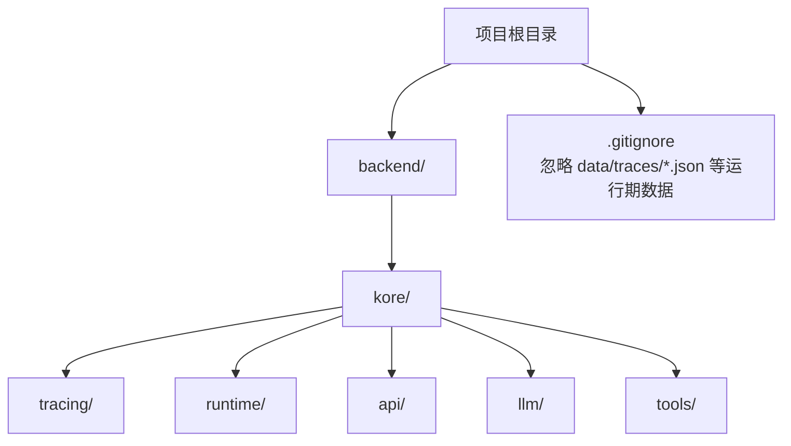
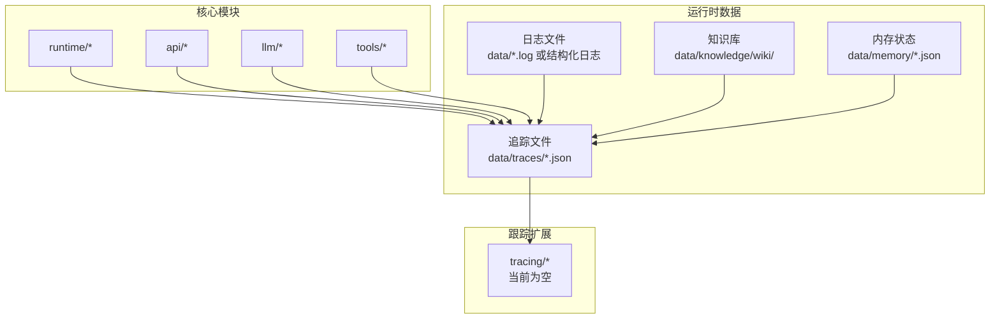
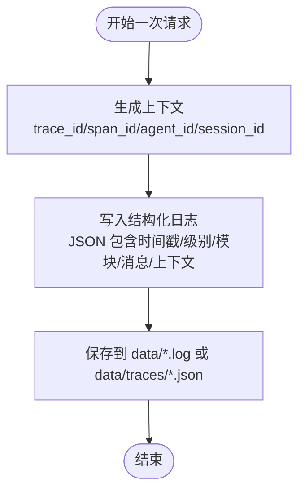
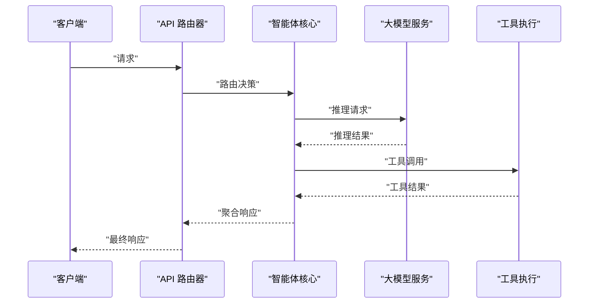
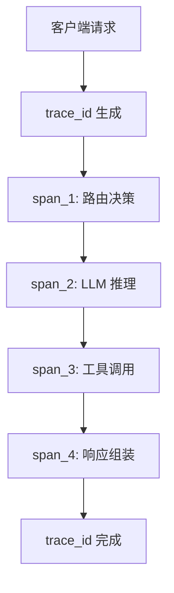
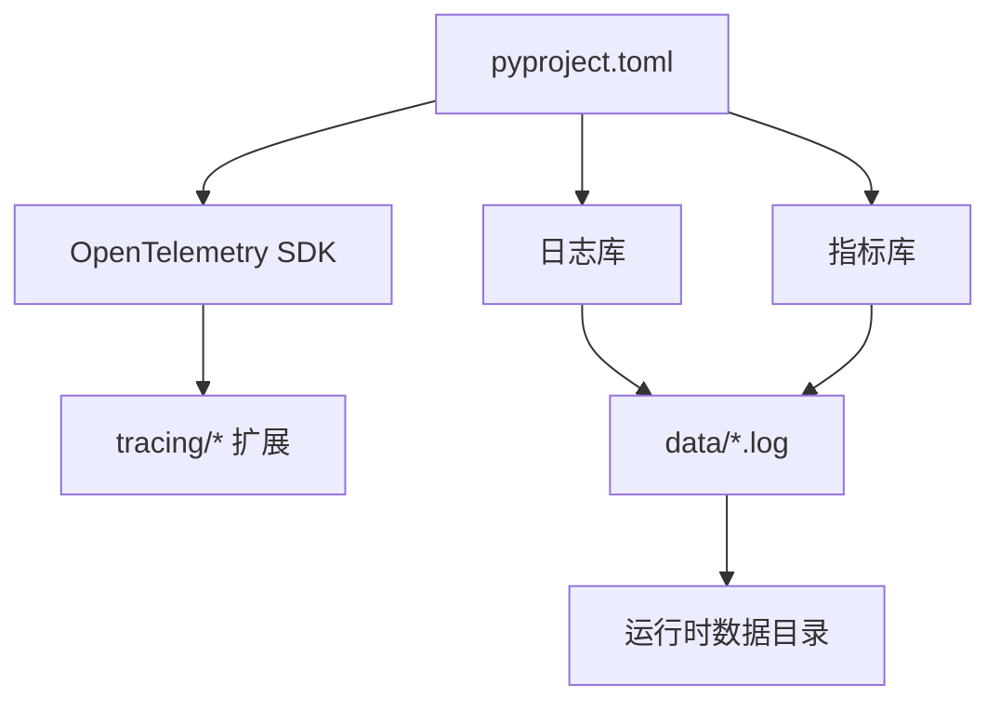

# 跟踪系统

<cite>
**本文引用的文件**
- [.gitignore](file://.gitignore)
- [backend/pyproject.toml](file://backend/pyproject.toml)
- [backend/kore/__init__.py](file://backend/kore/__init__.py)
- [backend/kore/tracing/__init__.py](file://backend/kore/tracing/__init__.py)
</cite>

## 目录
1. [简介](#简介)
2. [项目结构](#项目结构)
3. [核心组件](#核心组件)
4. [架构总览](#架构总览)
5. [详细组件分析](#详细组件分析)
6. [依赖分析](#依赖分析)
7. [性能考虑](#性能考虑)
8. [故障排除指南](#故障排除指南)
9. [结论](#结论)
10. [附录](#附录)

## 简介
本文件面向 Kore 智能体框架的跟踪系统，聚焦于日志记录、性能监控与调试工具的设计与实践。根据当前仓库可见内容，跟踪系统以“数据目录”为核心载体，通过统一的日志与追踪输出路径实现跨模块的可观测性。本文将从架构设计、日志规范、性能指标、分布式追踪、调试与故障排除、日志管理与存储策略等方面进行系统化说明，并提供可操作的配置与监控建议。

## 项目结构
Kore 的跟踪能力主要依托于运行时数据目录与模块化组织方式：
- 运行时数据目录：用于存放日志、追踪、知识库等运行期产物
- tracing 包：作为跟踪功能的命名空间入口（当前为空，后续可扩展）
- 根级忽略规则：通过版本控制忽略策略，确保运行期数据不污染源码树

**图表来源**
- [.gitignore:12-16](file://.gitignore#L12-L16)

**章节来源**
- [.gitignore:12-16](file://.gitignore#L12-L16)
- [backend/kore/__init__.py:1-200](file://backend/kore/__init__.py#L1-L200)
- [backend/kore/tracing/__init__.py:1-1](file://backend/kore/tracing/__init__.py#L1-L1)

## 核心组件
- 数据目录与输出规范
  - 追踪输出：data/traces/*.json
  - 日志输出：data/*.log 或按模块划分的 JSON 结构化日志
  - 知识库与内存：data/knowledge/wiki/、data/memory/*.json
- tracing 包
  - 当前为空包，作为未来扩展分布式追踪与链路追踪的命名空间
- 配置与依赖
  - 通过 pyproject.toml 管理后端依赖与构建配置，便于集成外部观测性工具（如 OpenTelemetry、Prometheus）

**章节来源**
- [.gitignore:12-16](file://.gitignore#L12-L16)
- [backend/kore/tracing/__init__.py:1-1](file://backend/kore/tracing/__init__.py#L1-L1)
- [backend/pyproject.toml:1-200](file://backend/pyproject.toml#L1-L200)

## 架构总览
下图展示了 Kore 追踪系统的高层架构：以数据目录为中心，各子系统在运行期生成结构化日志与追踪事件；通过统一的忽略策略与目录约定，保证可观测性与源码隔离。

**图表来源**
- [.gitignore:12-16](file://.gitignore#L12-L16)
- [backend/kore/tracing/__init__.py:1-1](file://backend/kore/tracing/__init__.py#L1-L1)

## 详细组件分析

### 日志记录机制
- 输出位置与格式
  - 结构化日志：建议采用 JSON 格式，包含时间戳、级别、模块、消息、上下文字段等
  - 文本日志：按模块或服务划分文件，便于检索与归档
- 上下文信息
  - 建议在每条日志中包含 trace_id、span_id、agent_id、session_id 等上下文键，支持跨模块关联
- 时间戳管理
  - 使用 ISO 8601 格式与 UTC 时间，避免时区转换误差
- 日志级别
  - 建议采用 TRACE/INFO/WARN/ERROR/FATAL 分层，结合业务语义细化（如 AGENT/ROUTER/LLM/TOOL 等子级别）

[此图为概念流程图，无需图表来源]

**章节来源**
- [.gitignore:12-16](file://.gitignore#L12-L16)

### 性能监控与指标
- 关键指标
  - 响应时间：端到端延迟、各阶段延迟（路由、推理、工具调用）
  - 吞吐量：QPS、并发会话数、任务完成速率
  - 资源使用：CPU、内存、磁盘 IO、网络带宽
- 指标采集
  - 在关键节点埋点：请求进入、路由决策、LLM 推理开始/结束、工具执行开始/结束、响应返回
  - 将指标导出至 Prometheus 或 InfluxDB，结合 Grafana 可视化
- 报警阈值
  - 响应时间 P95/P99 超过阈值
  - 错误率异常升高
  - 资源使用接近上限

[此图为概念序列图，无需图表来源]

**章节来源**
- [backend/pyproject.toml:1-200](file://backend/pyproject.toml#L1-L200)

### 分布式追踪与链路追踪
- 设计原则
  - 为每个请求生成全局 trace_id，并在各模块传递
  - 在关键边界生成 span，标注操作名、标签与事件
- 实现建议
  - 使用 OpenTelemetry SDK 在核心模块注入 tracer
  - 将 spans 导出至 Jaeger、Tempo 或 Zipkin，实现跨服务链路可视化
- 与 Kore 的对接
  - 利用 data/traces/*.json 存储结构化追踪事件，便于离线分析与回放
  - tracing 包作为未来扩展点，逐步替换为标准化的追踪 SDK

[此图为概念架构图，无需图表来源]

**章节来源**
- [backend/kore/tracing/__init__.py:1-1](file://backend/kore/tracing/__init__.py#L1-L1)

### 调试工具与故障排除
- 常见问题定位
  - 请求无响应：检查路由与 LLM 服务连通性、超时配置
  - 工具执行失败：核对工具参数、权限与返回格式
  - 性能抖动：分析追踪链路热点、资源瓶颈
- 诊断步骤
  - 开启更细粒度日志（如 TRACE），重放问题场景
  - 提取 data/traces/*.json，使用链路分析工具定位耗时环节
  - 对比历史指标，识别异常波动
- 快速修复
  - 调整超时与重试策略
  - 优化工具调用顺序或缓存中间结果
  - 扩容资源或拆分热点模块

**章节来源**
- [.gitignore:12-16](file://.gitignore#L12-L16)

### 日志管理与存储策略
- 日志轮转
  - 基于大小与时间的轮转策略，保留最近 N 天/文件数量
- 归档与清理
  - 周期性归档到对象存储或冷存储，清理过期文件
- 访问与检索
  - 统一命名与索引，支持按 trace_id、时间范围、级别过滤
- 安全与合规
  - 敏感信息脱敏（如 API Key、用户输入）
  - 控制访问权限与审计日志

**章节来源**
- [.gitignore:12-16](file://.gitignore#L12-L16)

## 依赖分析
- 运行时依赖
  - 通过 pyproject.toml 管理后端依赖，便于引入观测性库（如 OpenTelemetry、日志库、指标库）
- 版本控制隔离
  - .gitignore 明确忽略 data/traces/*.json 等运行期数据，避免污染源码树

**图表来源**
- [backend/pyproject.toml:1-200](file://backend/pyproject.toml#L1-L200)

**章节来源**
- [backend/pyproject.toml:1-200](file://backend/pyproject.toml#L1-L200)
- [.gitignore:12-16](file://.gitignore#L12-L16)

## 性能考虑
- I/O 与序列化
  - 优先使用流式写入与批量落盘，减少同步阻塞
  - JSON 序列化尽量避免重复计算，复用上下文字段
- 并发与锁
  - 日志与追踪写入使用无锁队列或轻量级锁，降低竞争
- 指标采样
  - 对高频事件进行采样，平衡精度与开销
- 缓存与预热
  - 热点模块预加载，减少首次延迟

[本节为通用指导，无需章节来源]

## 故障排除指南
- 症状：追踪文件未生成
  - 检查 data/traces 目录权限与磁盘配额
  - 确认 tracing 包已正确初始化（未来扩展）
- 症状：日志缺失或乱序
  - 核对时间源与时区配置
  - 检查异步写入缓冲与 flush 策略
- 症状：性能异常
  - 使用追踪链路定位慢调用
  - 对比指标曲线，识别资源瓶颈

**章节来源**
- [.gitignore:12-16](file://.gitignore#L12-L16)

## 结论
Kore 的跟踪系统以“数据目录 + 模块化”为核心，通过统一的输出规范与忽略策略，为未来的分布式追踪与指标体系奠定基础。建议尽快在 tracing 包中接入标准化追踪 SDK，并完善日志与指标的采集、存储与可视化，形成闭环的可观测性体系。

[本节为总结，无需章节来源]

## 附录

### 配置示例与监控仪表板设置
- 追踪输出目录
  - data/traces/*.json：结构化追踪事件
- 日志输出目录
  - data/*.log：文本日志
  - data/memory/*.json：内存状态快照
  - data/knowledge/wiki/：知识库内容
- 监控仪表板建议
  - Grafana 面板：请求延迟分布、错误率、资源使用趋势、工具调用耗时 TopN
  - 报警规则：P95 延迟越线、错误率突增、磁盘空间不足

**章节来源**
- [.gitignore:12-16](file://.gitignore#L12-L16)