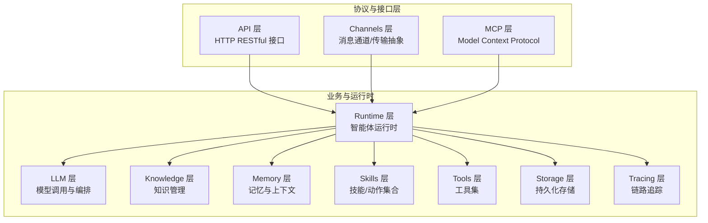
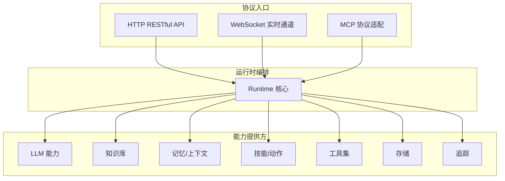
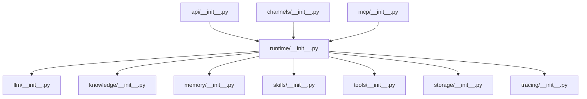

# 协议支持

<cite>
**本文引用的文件**
- [backend/kore/__init__.py](file://backend/kore/__init__.py)
- [backend/kore/api/__init__.py](file://backend/kore/api/__init__.py)
- [backend/kore/channels/__init__.py](file://backend/kore/channels/__init__.py)
- [backend/kore/knowledge/__init__.py](file://backend/kore/knowledge/__init__.py)
- [backend/kore/llm/__init__.py](file://backend/kore/llm/__init__.py)
- [backend/kore/mcp/__init__.py](file://backend/kore/mcp/__init__.py)
- [backend/kore/memory/__init__.py](file://backend/kore/memory/__init__.py)
- [backend/kore/prompting/__init__.py](file://backend/kore/prompting/__init__.py)
- [backend/kore/runtime/__init__.py](file://backend/kore/runtime/__init__.py)
- [backend/kore/skills/__init__.py](file://backend/kore/skills/__init__.py)
- [backend/kore/solver/__init__.py](file://backend/kore/solver/__init__.py)
- [backend/kore/storage/__init__.py](file://backend/kore/storage/__init__.py)
- [backend/kore/tools/__init__.py](file://backend/kore/tools/__init__.py)
- [backend/kore/tracing/__init__.py](file://backend/kore/tracing/__init__.py)
- [backend/pyproject.toml](file://backend/pyproject.toml)
</cite>

## 目录
1. [简介](#简介)
2. [项目结构](#项目结构)
3. [核心组件](#核心组件)
4. [架构总览](#架构总览)
5. [详细组件分析](#详细组件分析)
6. [依赖分析](#依赖分析)
7. [性能考虑](#性能考虑)
8. [故障排查指南](#故障排查指南)
9. [结论](#结论)
10. [附录](#附录)

## 简介
本文件面向 Kore 智能体框架的“协议支持系统”，聚焦于当前仓库中已实现或可扩展的通信协议能力：HTTP RESTful API、WebSocket 实时通信以及 MCP（Model Context Protocol）协议。文档从系统架构、组件关系、数据流与处理逻辑出发，结合配置项与扩展指南，帮助开发者在不同场景下正确选择与使用协议，并安全地进行协议扩展。

## 项目结构
Kore 后端采用模块化组织方式，协议相关能力主要分布在以下子系统：
- API 层：对外提供 HTTP 接口能力（RESTful API）
- Channels 层：抽象消息通道与传输层，便于接入 WebSocket 等实时通信
- MCP 层：实现 MCP 协议适配与交互
- LLM 层：大语言模型调用与推理编排
- Runtime 层：智能体运行时核心逻辑
- 其他支撑模块：知识、记忆、提示工程、工具、存储、追踪等

**图表来源**
- [backend/kore/api/__init__.py](file://backend/kore/api/__init__.py)
- [backend/kore/channels/__init__.py](file://backend/kore/channels/__init__.py)
- [backend/kore/mcp/__init__.py](file://backend/kore/mcp/__init__.py)
- [backend/kore/runtime/__init__.py](file://backend/kore/runtime/__init__.py)
- [backend/kore/llm/__init__.py](file://backend/kore/llm/__init__.py)
- [backend/kore/knowledge/__init__.py](file://backend/kore/knowledge/__init__.py)
- [backend/kore/memory/__init__.py](file://backend/kore/memory/__init__.py)
- [backend/kore/skills/__init__.py](file://backend/kore/skills/__init__.py)
- [backend/kore/tools/__init__.py](file://backend/kore/tools/__init__.py)
- [backend/kore/storage/__init__.py](file://backend/kore/storage/__init__.py)
- [backend/kore/tracing/__init__.py](file://backend/kore/tracing/__init__.py)

**章节来源**
- [backend/kore/api/__init__.py](file://backend/kore/api/__init__.py)
- [backend/kore/channels/__init__.py](file://backend/kore/channels/__init__.py)
- [backend/kore/mcp/__init__.py](file://backend/kore/mcp/__init__.py)
- [backend/kore/runtime/__init__.py](file://backend/kore/runtime/__init__.py)
- [backend/kore/llm/__init__.py](file://backend/kore/llm/__init__.py)
- [backend/kore/knowledge/__init__.py](file://backend/kore/knowledge/__init__.py)
- [backend/kore/memory/__init__.py](file://backend/kore/memory/__init__.py)
- [backend/kore/skills/__init__.py](file://backend/kore/skills/__init__.py)
- [backend/kore/tools/__init__.py](file://backend/kore/tools/__init__.py)
- [backend/kore/storage/__init__.py](file://backend/kore/storage/__init__.py)
- [backend/kore/tracing/__init__.py](file://backend/kore/tracing/__init__.py)

## 核心组件
- HTTP RESTful API：通过 API 层暴露统一的 HTTP 接口，用于请求-响应式交互，适合状态明确、边界清晰的任务编排与控制流。
- WebSocket 实时通信：通过 Channels 层抽象传输通道，支持双向实时数据流，适用于需要低延迟、持续交互的场景（如对话、事件推送）。
- MCP 协议：通过 MCP 层实现对 Model Context Protocol 的适配，提供标准化的上下文与资源访问能力，便于与外部工具/服务进行协作。

上述组件均以模块化方式存在，便于独立演进与替换；运行时层负责协调各协议入口与业务逻辑，确保协议间解耦与可插拔。

**章节来源**
- [backend/kore/api/__init__.py](file://backend/kore/api/__init__.py)
- [backend/kore/channels/__init__.py](file://backend/kore/channels/__init__.py)
- [backend/kore/mcp/__init__.py](file://backend/kore/mcp/__init__.py)
- [backend/kore/runtime/__init__.py](file://backend/kore/runtime/__init__.py)

## 架构总览
协议支持系统遵循“分层解耦 + 运行时编排”的设计原则：
- 协议层：API、Channels、MCP 分别承担请求-响应、实时通道与 MCP 协议适配职责
- 编排层：Runtime 负责路由、调度与上下文传递
- 业务层：LLM、Knowledge、Memory、Skills、Tools、Storage、Tracing 提供具体能力

**图表来源**
- [backend/kore/api/__init__.py](file://backend/kore/api/__init__.py)
- [backend/kore/channels/__init__.py](file://backend/kore/channels/__init__.py)
- [backend/kore/mcp/__init__.py](file://backend/kore/mcp/__init__.py)
- [backend/kore/runtime/__init__.py](file://backend/kore/runtime/__init__.py)
- [backend/kore/llm/__init__.py](file://backend/kore/llm/__init__.py)
- [backend/kore/knowledge/__init__.py](file://backend/kore/knowledge/__init__.py)
- [backend/kore/memory/__init__.py](file://backend/kore/memory/__init__.py)
- [backend/kore/skills/__init__.py](file://backend/kore/skills/__init__.py)
- [backend/kore/tools/__init__.py](file://backend/kore/tools/__init__.py)
- [backend/kore/storage/__init__.py](file://backend/kore/storage/__init__.py)
- [backend/kore/tracing/__init__.py](file://backend/kore/tracing/__init__.py)

## 详细组件分析

### HTTP RESTful API 组件
- 角色与职责
  - 对外提供统一的 HTTP 接口，承载请求-响应式交互
  - 作为运行时编排的入口之一，接收任务、策略与控制指令
- 特性与适用场景
  - 易于集成、标准通用，适合状态明确、边界清晰的任务
  - 适合批处理、定时任务、外部系统对接
- 性能特点
  - 非长连接，每次请求建立与释放开销相对固定
  - 可通过并发与缓存优化吞吐量
- 配置要点（示例性说明）
  - 路由与端点：定义清晰的资源路径与方法映射
  - 超时与并发：设置请求超时、最大并发数与队列容量
  - 认证与鉴权：支持 Token、签名或自定义中间件
  - 压缩与缓存：启用 Gzip、ETag 等提升传输效率
- 使用建议
  - 将长耗时任务转交运行时异步执行，避免阻塞请求线程
  - 对频繁查询使用缓存策略，降低后端压力

**章节来源**
- [backend/kore/api/__init__.py](file://backend/kore/api/__init__.py)

### WebSocket 实时通信组件
- 角色与职责
  - 通过 Channels 层抽象传输通道，提供双向实时数据流
  - 支持事件推送、会话保持与低延迟交互
- 特性与适用场景
  - 低延迟、高并发，适合对话、监控告警、协同编辑等
- 性能特点
  - 长连接减少握手开销，但需关注连接数与内存占用
  - 需要心跳与断线重连机制保障稳定性
- 配置要点（示例性说明）
  - 心跳间隔与超时：维持连接活跃度与及时发现异常
  - 消息大小限制与压缩：平衡带宽与 CPU 开销
  - 并发与队列：限制单连接并发与消息积压
  - 认证与鉴权：在握手阶段完成身份校验
- 使用建议
  - 对高频小包使用批量聚合，降低帧开销
  - 为不同业务通道划分子协议或命名空间，便于治理

**章节来源**
- [backend/kore/channels/__init__.py](file://backend/kore/channels/__init__.py)

### MCP 协议组件
- 角色与职责
  - 通过 MCP 层实现对 Model Context Protocol 的适配
  - 提供标准化的上下文与资源访问能力，便于与外部工具/服务协作
- 特性与适用场景
  - 标准化、可扩展，适合跨系统协作与能力复用
- 性能特点
  - 基于请求-响应的消息模式，适合按需调用
  - 需要合理的超时与重试策略，避免阻塞主流程
- 配置要点（示例性说明）
  - 服务器地址与端口：指向 MCP 服务端
  - 认证凭据：令牌或证书配置
  - 超时与重试：根据外部服务性能设定
- 使用建议
  - 将 MCP 调用纳入运行时的统一调度，确保上下文一致性
  - 对外部资源进行限流与熔断，防止级联故障

**章节来源**
- [backend/kore/mcp/__init__.py](file://backend/kore/mcp/__init__.py)

### 运行时编排组件
- 角色与职责
  - 作为协议与业务能力之间的桥梁，负责路由、调度与上下文传递
- 设计要点
  - 解耦协议入口与业务实现，支持多协议并存与动态切换
  - 提供统一的错误处理与可观测性接口
- 性能与可靠性
  - 通过并发池与背压策略提升吞吐
  - 引入超时、重试与熔断机制增强鲁棒性

**章节来源**
- [backend/kore/runtime/__init__.py](file://backend/kore/runtime/__init__.py)

### 协议间兼容与互操作性
- 兼容性设计
  - 通过运行时层统一对接不同协议入口，屏蔽底层差异
  - 上下文在运行时内流转，确保跨协议的一致性体验
- 互操作性
  - HTTP 与 WebSocket 可在同一运行时内并存，分别服务于不同交互模式
  - MCP 作为外部协作协议，与内部能力通过运行时编排互通
- 切换与配置示例（概念性说明）
  - 在运行时中注册多个协议入口，依据请求来源或业务类型选择对应通道
  - 通过配置文件或环境变量切换协议开关与参数，实现灰度与回滚

**章节来源**
- [backend/kore/runtime/__init__.py](file://backend/kore/runtime/__init__.py)

### 协议扩展指南
- 扩展步骤
  - 新建协议适配模块，遵循现有命名与目录规范
  - 在运行时层新增入口注册与路由逻辑
  - 定义协议专属配置项与默认值
  - 补充单元测试与集成测试，覆盖典型场景
- 最佳实践
  - 保持协议实现与业务逻辑解耦
  - 统一错误码与日志格式，便于问题定位
  - 对外暴露最小可用接口，避免过度耦合

**章节来源**
- [backend/kore/__init__.py](file://backend/kore/__init__.py)
- [backend/kore/runtime/__init__.py](file://backend/kore/runtime/__init__.py)

## 依赖分析
- 项目依赖与模块关系
  - 各功能模块以“__init__.py”作为入口，形成清晰的包结构
  - 协议层（API、Channels、MCP）与运行时层相互独立，通过运行时编排耦合
  - 业务层模块（LLM、Knowledge、Memory、Skills、Tools、Storage、Tracing）作为能力提供方被运行时调用
- 外部依赖
  - 项目使用 Python 包管理工具进行依赖声明与版本约束

**图表来源**
- [backend/kore/runtime/__init__.py](file://backend/kore/runtime/__init__.py)
- [backend/kore/api/__init__.py](file://backend/kore/api/__init__.py)
- [backend/kore/channels/__init__.py](file://backend/kore/channels/__init__.py)
- [backend/kore/mcp/__init__.py](file://backend/kore/mcp/__init__.py)
- [backend/kore/llm/__init__.py](file://backend/kore/llm/__init__.py)
- [backend/kore/knowledge/__init__.py](file://backend/kore/knowledge/__init__.py)
- [backend/kore/memory/__init__.py](file://backend/kore/memory/__init__.py)
- [backend/kore/skills/__init__.py](file://backend/kore/skills/__init__.py)
- [backend/kore/tools/__init__.py](file://backend/kore/tools/__init__.py)
- [backend/kore/storage/__init__.py](file://backend/kore/storage/__init__.py)
- [backend/kore/tracing/__init__.py](file://backend/kore/tracing/__init__.py)

**章节来源**
- [backend/pyproject.toml](file://backend/pyproject.toml)

## 性能考虑
- 协议层面
  - HTTP：合理设置超时与并发，启用压缩与缓存，避免长连接带来的资源占用
  - WebSocket：控制连接数与消息大小，实现心跳与断线重连，避免内存泄漏
  - MCP：设置合理的超时与重试，对外部服务进行限流与熔断
- 运行时层面
  - 并发池与背压策略，保障在高负载下的稳定性
  - 统一日志与指标采集，便于性能分析与瓶颈定位

## 故障排查指南
- 常见问题
  - HTTP 请求超时：检查上游服务健康状况与网络延迟，调整超时阈值
  - WebSocket 断连：确认心跳配置与防火墙策略，实现自动重连
  - MCP 调用失败：核对认证凭据与目标地址，增加重试与熔断保护
- 排查步骤
  - 通过运行时的日志与追踪信息定位问题发生环节
  - 对协议入口与业务能力分别进行隔离测试，缩小问题范围
  - 结合指标监控（延迟、错误率、并发）识别性能瓶颈

## 结论
Kore 的协议支持系统以模块化与运行时编排为核心，实现了 HTTP、WebSocket 与 MCP 的解耦接入。通过统一的上下文与调度机制，系统能够在不同协议之间灵活切换，并为后续协议扩展提供了清晰的路径。建议在生产环境中结合业务特征合理配置协议参数，并完善可观测性与弹性策略，以获得稳定高效的运行表现。

## 附录
- 配置项建议（示例性说明）
  - HTTP：端口、超时、并发、压缩、缓存策略、认证方式
  - WebSocket：心跳间隔、消息大小限制、并发与队列、认证
  - MCP：服务地址、认证凭据、超时与重试
- 测试与验证
  - 单元测试覆盖协议解析与错误分支
  - 集成测试验证运行时编排与上下文传递
  - 压力测试评估不同协议在高并发下的表现