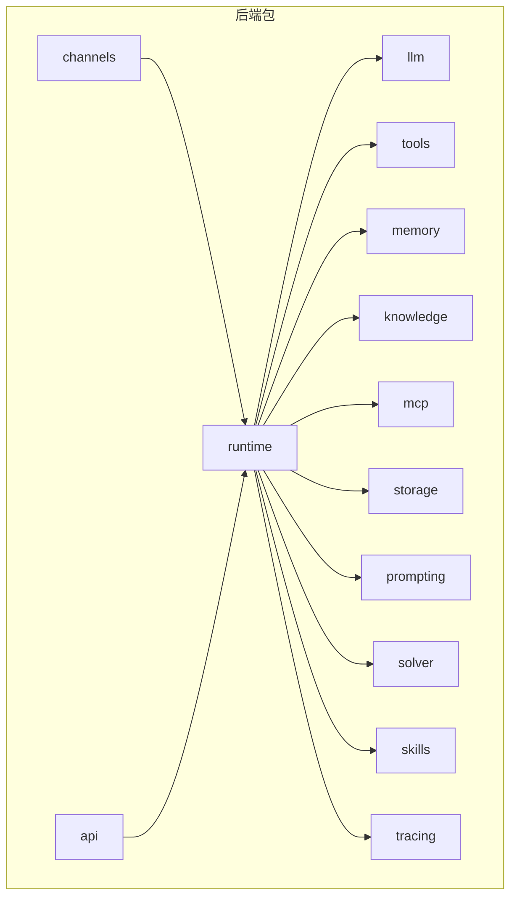
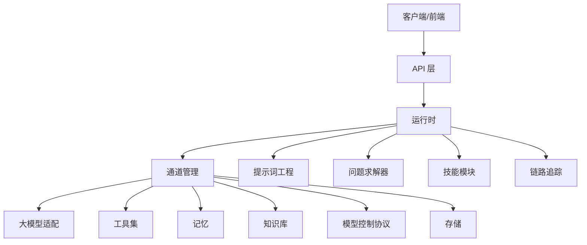
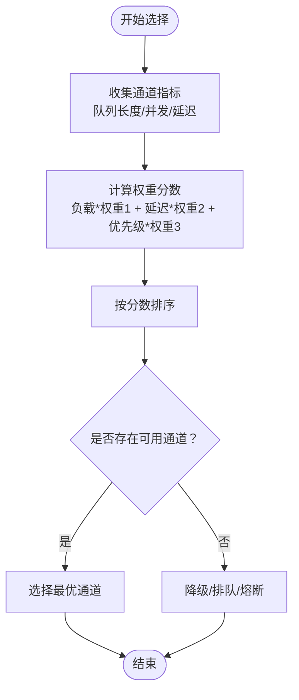
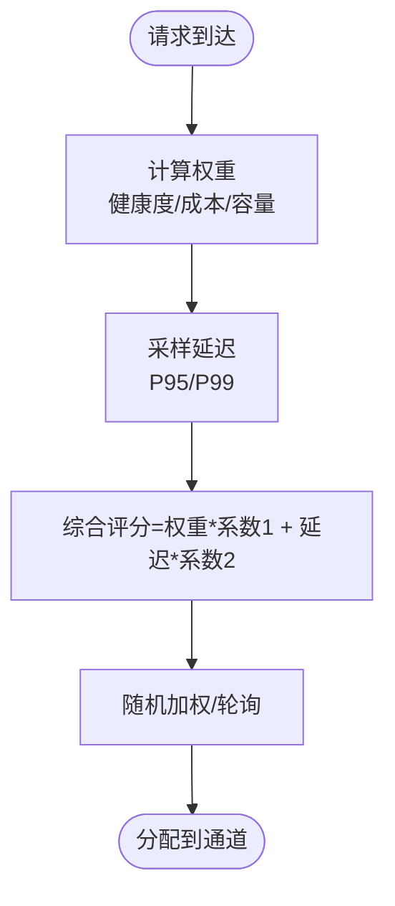
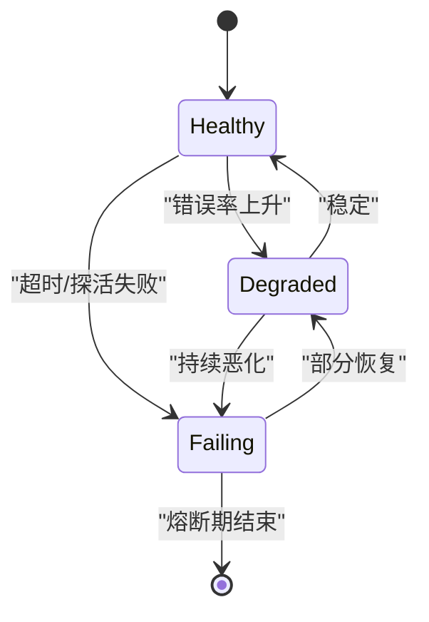
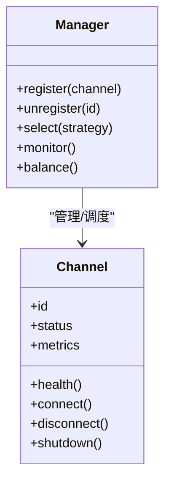
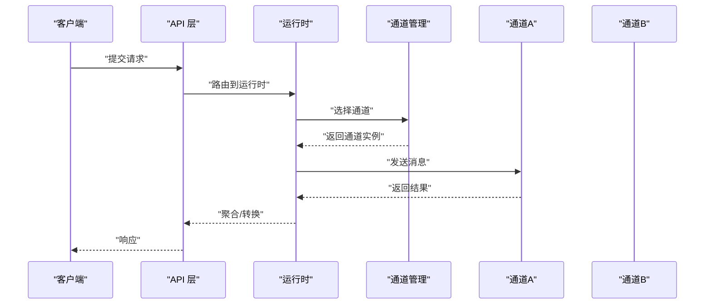
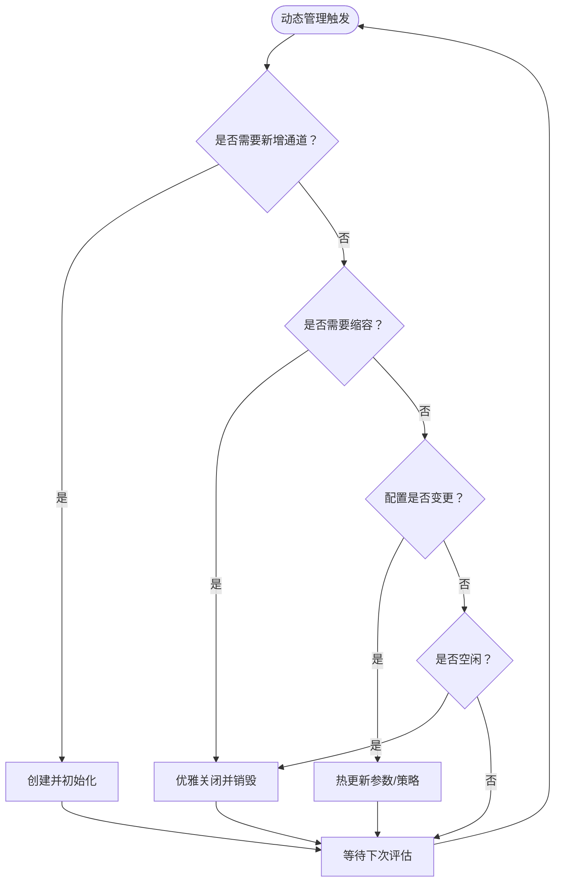
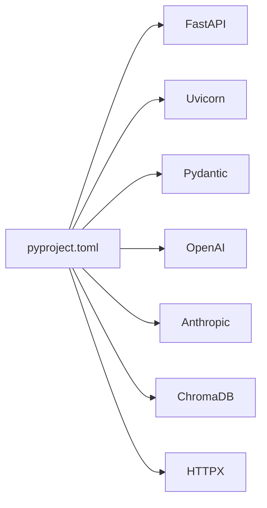

# 多通道管理

<cite>
**本文档引用的文件**
- [backend/pyproject.toml](file://backend/pyproject.toml)
- [backend/kore/__init__.py](file://backend/kore/__init__.py)
- [backend/kore/api/__init__.py](file://backend/kore/api/__init__.py)
- [backend/kore/channels/__init__.py](file://backend/kore/channels/__init__.py)
- [backend/kore/knowledge/__init__.py](file://backend/kore/knowledge/__init__.py)
- [backend/kore/llm/__init__.py](file://backend/kore/llm/__init__.py)
- [backend/kore/mcp/__init__.py](file://backend/kore/mcp/__init__.py)
- [backend/kore/memory/__init__.py](file://backend/kore/memory/__init__.py)
- [backend/kore/prompting/__init__.py](file://backend/kore/prompting/__init__.py)
- [backend/kore/runtime/__init__.py](file://backend/kore/runtime/__init__.py)
- [backend/kore/skills/__init__.py](file://backend/kore/skills/__init__.py)
- [backend/kore/solver/__init__.py](file://backend/kore/solver/__init__.py)
- [backend/kore/storage/__init__.py](file://backend/kore/storage/__init__.py)
- [backend/kore/tools/__init__.py](file://backend/kore/tools/__init__.py)
- [backend/kore/tracing/__init__.py](file://backend/kore/tracing/__init__.py)
</cite>

## 目录
1. [简介](#简介)
2. [项目结构](#项目结构)
3. [核心组件](#核心组件)
4. [架构总览](#架构总览)
5. [详细组件分析](#详细组件分析)
6. [依赖关系分析](#依赖关系分析)
7. [性能考虑](#性能考虑)
8. [故障排除指南](#故障排除指南)
9. [结论](#结论)
10. [附录](#附录)

## 简介
本文件面向 Kore 智能体框架的多通道管理系统，围绕“多通道协同工作机制、通道状态管理、通道间通信协调、动态通道管理、配置最佳实践、监控与诊断”等主题，提供系统化技术文档。当前仓库中未包含具体实现代码文件，但通过模块目录结构与依赖清单可推断：系统采用分层模块设计（如 channels、runtime、llm、tools 等），并基于 FastAPI 提供 API 能力，结合多种外部服务（如 OpenAI、Anthropic、ChromaDB 等）构建智能体运行时。

由于缺少具体实现文件，本文档在“已知结构”基础上进行概念性说明与最佳实践建议，并给出可落地的配置与排障思路，帮助读者在现有模块边界内完成多通道系统的规划与实施。

## 项目结构
后端采用 Python 包结构组织，核心模块按职责划分如下：
- channels：通道抽象与管理（入口）
- runtime：智能体运行时核心
- llm：大模型能力封装与工厂模式
- tools：工具集与外部能力接入
- memory：记忆与上下文存储
- knowledge：知识库与检索
- mcp：模型控制协议相关
- storage：通用存储抽象
- prompting：提示词工程
- solver：问题求解器
- skills：技能模块
- tracing：链路追踪
- api：API 路由与接口
- 其他：__init__.py 统一导出

**章节来源**
- [backend/pyproject.toml:1-35](file://backend/pyproject.toml#L1-L35)
- [backend/kore/__init__.py](file://backend/kore/__init__.py)
- [backend/kore/api/__init__.py](file://backend/kore/api/__init__.py)
- [backend/kore/channels/__init__.py](file://backend/kore/channels/__init__.py)
- [backend/kore/knowledge/__init__.py](file://backend/kore/knowledge/__init__.py)
- [backend/kore/llm/__init__.py](file://backend/kore/llm/__init__.py)
- [backend/kore/mcp/__init__.py](file://backend/kore/mcp/__init__.py)
- [backend/kore/memory/__init__.py](file://backend/kore/memory/__init__.py)
- [backend/kore/prompting/__init__.py](file://backend/kore/prompting/__init__.py)
- [backend/kore/runtime/__init__.py](file://backend/kore/runtime/__init__.py)
- [backend/kore/skills/__init__.py](file://backend/kore/skills/__init__.py)
- [backend/kore/solver/__init__.py](file://backend/kore/solver/__init__.py)
- [backend/kore/storage/__init__.py](file://backend/kore/storage/__init__.py)
- [backend/kore/tools/__init__.py](file://backend/kore/tools/__init__.py)
- [backend/kore/tracing/__init__.py](file://backend/kore/tracing/__init__.py)

## 核心组件
- 通道（Channels）：负责多通道的统一抽象、生命周期管理、状态监控与事件分发。作为上层运行时与底层能力（LLM、工具、存储等）之间的适配层。
- 运行时（Runtime）：编排智能体执行流程，调度通道与工具，维护上下文与状态。
- 大模型（LLM）：通过工厂模式支持多供应商（OpenAI、Anthropic 等），统一接口与缓存策略。
- 工具（Tools）：外部能力接入与封装，提供统一的输入输出规范。
- 记忆与知识（Memory/Knowledge）：上下文与知识检索，支撑多轮对话与任务执行。
- 存储（Storage）：持久化与会话数据管理。
- API 层（API）：对外提供 HTTP 接口，路由到运行时与通道。

上述组件在模块层面已清晰分离，便于扩展与替换。多通道管理的关键在于通道抽象与运行时编排的协作。

**章节来源**
- [backend/kore/channels/__init__.py](file://backend/kore/channels/__init__.py)
- [backend/kore/runtime/__init__.py](file://backend/kore/runtime/__init__.py)
- [backend/kore/llm/__init__.py](file://backend/kore/llm/__init__.py)
- [backend/kore/tools/__init__.py](file://backend/kore/tools/__init__.py)
- [backend/kore/memory/__init__.py](file://backend/kore/memory/__init__.py)
- [backend/kore/knowledge/__init__.py](file://backend/kore/knowledge/__init__.py)
- [backend/kore/storage/__init__.py](file://backend/kore/storage/__init__.py)
- [backend/kore/api/__init__.py](file://backend/kore/api/__init__.py)

## 架构总览
下图展示多通道管理在整体系统中的位置与交互关系：

该图为概念性架构图，用于说明多通道在系统中的定位与职责边界。

## 详细组件分析

### 通道选择策略
通道选择策略应基于以下维度：
- 负载与容量：根据通道当前队列长度、并发请求数、响应时间等指标动态选择。
- 优先级：高优先级任务（如实时对话）优先分配到低延迟通道。
- 一致性：对同一会话或请求序列，保持通道一致性以复用上下文。
- 成本与质量：在满足 SLA 的前提下，优先选择成本更低或质量更高的通道。

[本节为概念性流程图，不直接映射具体源码文件]

### 负载均衡算法
推荐采用“加权最少连接数 + 延迟感知”的混合策略：
- 动态权重：根据通道健康度与历史性能调整权重。
- 实时延迟采样：定期采样各通道的 P95/P99 延迟，避免“虚假低负载”。
- 预热与退避：新通道先预热，失败率过高则退避一段时间再试。

[本节为概念性流程图，不直接映射具体源码文件]

### 故障转移机制
- 快速检测：心跳/探活失败、错误率阈值、超时异常。
- 熔断：连续失败超过阈值时短时熔断，防止雪崩。
- 降级：切换到备用通道或本地缓存；必要时返回兜底结果。
- 自愈：通道恢复后自动摘除熔断，逐步恢复流量。

[本节为概念性状态图，不直接映射具体源码文件]

### 通道状态管理
- 连接状态监控：心跳、探活、断线重连、背压检测。
- 健康检查：周期性探测、错误率统计、延迟分布。
- 资源分配：CPU/内存/网络带宽、并发上限、队列深度。
- 生命周期：创建、初始化、运行、优雅关闭、销毁。

[本节为概念性类图，不直接映射具体源码文件]

### 通道间通信协调
- 消息路由：基于会话 ID 或任务 ID 的一致性哈希，确保同一流水线在同一通道。
- 优先级处理：高优先级通道优先，普通通道作为缓冲。
- 冲突解决：幂等性设计、去重键、版本号；冲突时回滚或重试。

[本节为概念性时序图，不直接映射具体源码文件]

### 动态通道管理
- 创建：按需扩容，支持异步初始化与探活。
- 销毁：优雅关闭，清空队列，释放资源。
- 配置热更新：参数变更无需重启，平滑迁移流量。

[本节为概念性流程图，不直接映射具体源码文件]

## 依赖关系分析
从依赖清单可见系统依赖 FastAPI、Uvicorn、Pydantic、OpenAI、Anthropic、ChromaDB、HTTPX 等，这些为多通道管理提供了基础设施：
- Web 框架与服务器：FastAPI/Uvicorn 提供 API 与异步能力。
- 数据模型：Pydantic 支持结构化配置与校验。
- 外部服务：OpenAI/Anthropic 提供多供应商 LLM 能力；ChromaDB 提供向量检索。
- HTTP 客户端：HTTPX 用于通道间或外部服务调用。

**图表来源**
- [backend/pyproject.toml:6-19](file://backend/pyproject.toml#L6-L19)

**章节来源**
- [backend/pyproject.toml:1-35](file://backend/pyproject.toml#L1-L35)

## 性能考虑
- 并发与队列：限制单通道并发与队列深度，避免尾延迟放大。
- 缓存与预热：对热点通道进行预热与结果缓存，降低冷启动开销。
- 网络与 I/O：合理设置超时与重试，避免阻塞；使用流式传输提升体验。
- 监控与告警：建立 P95/P99 延迟、错误率、资源利用率等指标阈值。
- 资源隔离：不同优先级通道使用独立资源池或 QoS 策略。

[本节为通用性能建议，不直接分析具体文件]

## 故障排除指南
- 通道不可用
  - 检查探活与心跳是否正常；确认外部服务凭据与网络连通。
  - 查看错误日志与链路追踪，定位慢查询与异常点。
- 延迟升高
  - 分析通道队列长度与并发；检查上游依赖（LLM/工具）的可用性与限流。
  - 启用降级策略，临时切换到备用通道或本地缓存。
- 资源耗尽
  - 检查 CPU/内存/磁盘占用；限制并发与批量大小。
  - 对长时间运行的任务启用超时与取消机制。
- 配置错误
  - 使用 Pydantic 校验配置结构；开启热更新时做好灰度与回滚预案。

[本节为通用排障建议，不直接分析具体文件]

## 结论
多通道管理的核心在于“抽象统一、编排有序、可观测可治理”。在当前模块化结构下，建议优先完善 channels 与 runtime 的对接，明确通道生命周期与状态机，再逐步引入负载均衡、故障转移与动态扩缩容能力。配合完善的监控与配置体系，可实现高性能、高可用的多通道智能体运行时。

## 附录
- 配置示例（概念性）
  - 通道基础配置：名称、类型、地址、凭据、超时、重试次数。
  - 负载均衡策略：权重、阈值、退避时间、采样窗口。
  - 健康检查：间隔、超时、失败阈值、熔断时间。
  - 动态扩缩容：最小/最大实例数、扩容阈值、缩容阈值。
- 最佳实践
  - 以会话为中心的路由与一致性哈希。
  - 优先保障高优先级通道的 SLA。
  - 将外部依赖视为不稳定因素，设计完备的降级与熔断。
  - 所有变更均具备可观测与可回滚能力。

[本节为概念性附录，不直接分析具体文件]