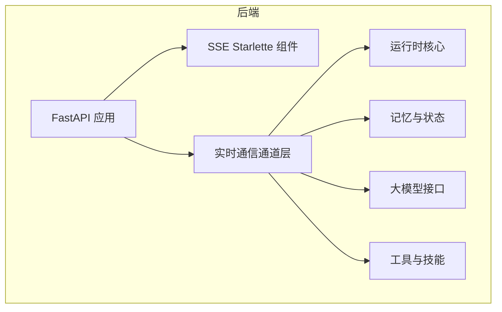
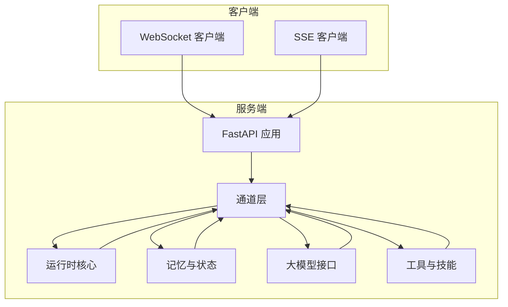
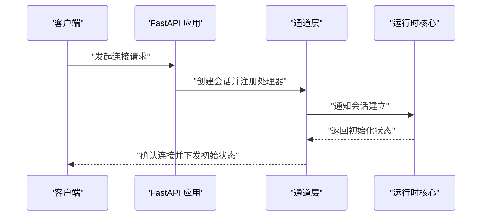
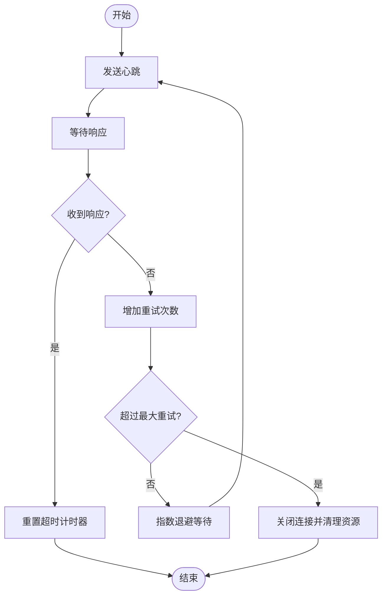
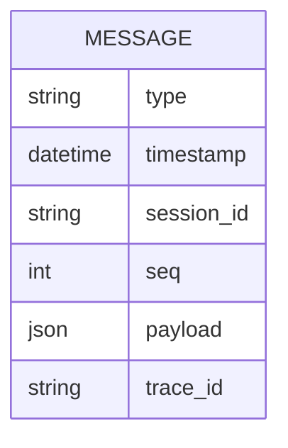
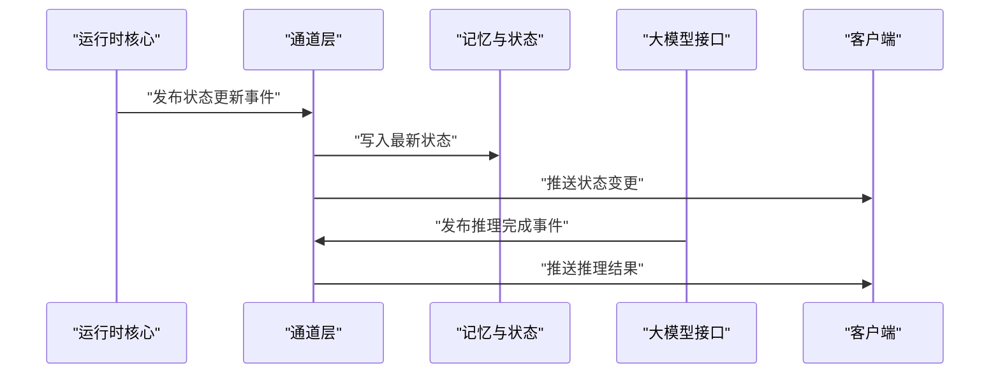
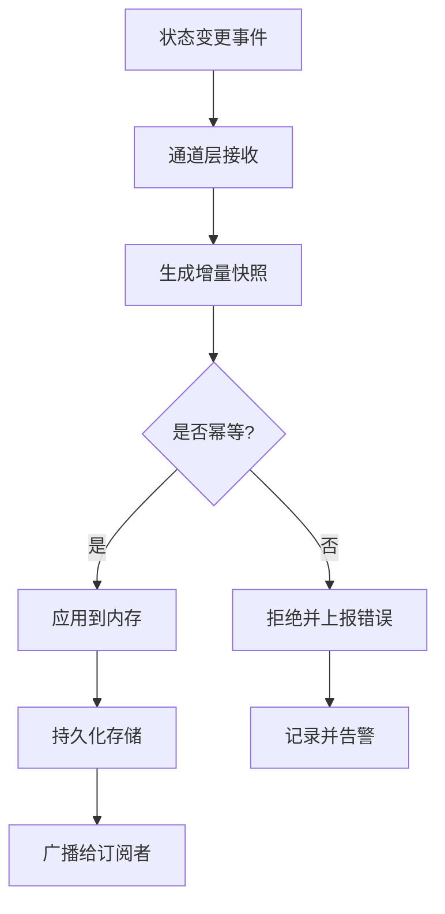
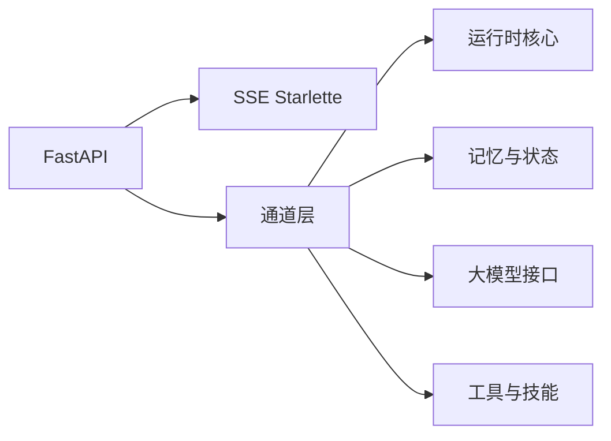

# 实时通信

<cite>
**本文档引用的文件**
- [pyproject.toml](file://backend/pyproject.toml)
- [.gitignore](file://.gitignore)
</cite>

## 目录
1. [引言](#引言)
2. [项目结构](#项目结构)
3. [核心组件](#核心组件)
4. [架构总览](#架构总览)
5. [详细组件分析](#详细组件分析)
6. [依赖关系分析](#依赖关系分析)
7. [性能考虑](#性能考虑)
8. [故障处理与错误恢复](#故障处理与错误恢复)
9. [结论](#结论)
10. [附录](#附录)

## 引言
本文件面向 Kore 智能体框架的实时通信子系统，聚焦于 WebSocket 连接建立、心跳检测与断线重连策略、消息格式规范（类型、结构与编码）、事件驱动的消息处理机制（订阅、发布与路由）、状态同步（智能体状态更新、内存同步与一致性保证）、配置示例与使用模式（客户端集成与服务端处理）、性能优化策略（消息压缩与批量处理）以及故障处理与错误恢复机制。  
当前仓库未包含实时通信的具体实现代码文件，但根据项目依赖与模块组织，可推断实时通信能力将基于 FastAPI 与 SSE（Server-Sent Events）等技术栈构建。本文档以现有信息为基础，提供可落地的设计与实施指南，帮助开发者在 Kore 中实现稳定高效的实时通信。

## 项目结构
- 后端采用 Python 与 FastAPI 框架，依赖包括 SSE 支持库，适合构建事件驱动的实时通信服务。
- 项目包含多个领域模块（如 runtime、memory、knowledge 等），建议将实时通信抽象为独立通道层，向上对接各业务模块，向下封装底层传输协议（WebSocket/SSE）。

**章节来源**
- [pyproject.toml:1-34](file://backend/pyproject.toml#L1-L34)

## 核心组件
- 通道层（Channels）：负责连接管理、消息编解码、事件路由与状态同步协调。
- 运行时核心（Runtime）：承载智能体生命周期与状态机，接收来自通道层的状态更新请求。
- 记忆与状态（Memory）：维护智能体内存与上下文，确保状态变更的持久化与一致性。
- 大模型接口（LLM）与工具（Tools）：作为事件消费者，响应通道层触发的推理与执行事件。
- SSE 组件：提供服务端推送能力，适合作为 WebSocket 的补充或替代方案。

**章节来源**
- [pyproject.toml:17-18](file://backend/pyproject.toml#L17-L18)

## 架构总览
实时通信架构采用“事件驱动 + 状态同步”的设计，通过通道层统一接入多种传输协议，向上提供一致的事件 API，向下与运行时、记忆、工具等模块协作。

## 详细组件分析

### 连接建立与协议选择
- 协议选择：WebSocket 适合双向低延迟交互；SSE 适合单向事件推送与长连接复用。
- 连接入口：在 FastAPI 路由中注册 WebSocket 与 SSE 端点，统一由通道层进行会话管理。
- 会话标识：为每个连接分配唯一会话 ID，并绑定到用户/智能体上下文。

### 心跳检测与断线重连
- 心跳策略：客户端与服务端均周期性发送心跳帧；超时阈值可配置，支持动态调整。
- 断线检测：服务端维护连接活跃度表；异常断开时清理资源并广播离线事件。
- 重连机制：客户端按指数退避策略重连；服务端在重连窗口内保留会话上下文以便恢复。

### 消息格式规范
- 消息类型：定义通用事件类型（如状态更新、推理请求、工具调用、日志输出等）。
- 数据结构：统一使用结构化 JSON，包含消息头（类型、时间戳、会话 ID、序列号）与负载（payload）。
- 编码方式：UTF-8 文本帧；二进制场景下采用 Base64 编码；必要时启用压缩（如 gzip）。
- 扩展字段：支持 trace_id、span_id 等链路追踪字段，便于跨组件关联。

### 事件驱动的消息处理机制
- 订阅：客户端通过通道层订阅感兴趣的主题（如智能体状态、推理进度、工具结果）。
- 发布：运行时或外部系统通过通道层发布事件，通道层根据主题路由至目标会话或广播。
- 路由：基于会话 ID、主题过滤与权限控制进行路由；支持优先级队列与背压处理。

### 状态同步机制
- 智能体状态更新：运行时在关键节点生成状态快照，通道层负责分发与持久化。
- 内存同步：通过增量更新与版本号避免全量同步；支持冲突检测与回滚。
- 一致性保证：采用幂等写入与事务式批处理，确保多副本一致性；对关键路径启用强一致读。

### 配置示例与使用模式
- 服务端配置：FastAPI 应用启动参数（如主机、端口、调试模式）、SSE 选项与通道层参数（心跳间隔、超时阈值、重连策略）。
- 客户端集成：WebSocket 客户端需实现重连、心跳与事件解析逻辑；SSE 客户端需处理事件流与断线恢复。
- 使用模式：单智能体实时对话、多智能体协作、状态订阅与事件回调。

### 性能优化策略
- 消息压缩：对大负载消息启用压缩（gzip/snappy），降低带宽占用。
- 批量处理：聚合小消息为批次，减少握手与序列化开销；设置批量上限与超时阈值。
- 背压控制：基于队列长度与内存使用率动态调节速率；必要时丢弃低优先级事件。
- 连接池与复用：SSE 场景下复用连接；WebSocket 场景下合理设置连接数与心跳频率。

## 依赖关系分析
- FastAPI：提供 Web 服务与路由能力，作为实时通信的入口。
- SSE Starlette：提供服务端推送能力，适合作为 WebSocket 的补充。
- 其他依赖：数据库、向量库、HTTP 客户端等，用于支撑运行时与记忆模块。

**章节来源**
- [pyproject.toml:7-18](file://backend/pyproject.toml#L7-L18)

## 性能考虑
- 延迟与吞吐：通过批量与压缩提升吞吐，通过心跳与断线重连保障延迟稳定性。
- 资源占用：限制每连接消息大小与队列长度，避免内存膨胀。
- 可观测性：在通道层埋点统计连接数、消息速率、错误率与延迟分布。

## 故障处理与错误恢复
- 连接异常：检测到异常断开时，服务端清理会话资源并广播离线事件；客户端按策略重连。
- 消息丢失：通过序列号与确认机制实现可靠投递；对关键事件启用重试与降级策略。
- 状态不一致：通过版本号与快照对比检测差异，必要时触发回滚或全量同步。
- 错误上报：统一错误码与日志结构，结合 trace_id 进行问题定位。

## 结论
Kore 的实时通信应以事件驱动为核心，通过通道层抽象统一接入 WebSocket 与 SSE，结合心跳与重连策略、消息格式规范与状态同步机制，实现高可用、高性能的智能体实时交互。建议在后续开发中逐步完善通道层与运行时的协同，强化可观测性与容错能力。

## 附录
- 开发建议：先实现基础通道层与 SSE 推送，再扩展 WebSocket；优先保证状态一致性与错误恢复能力。
- 测试策略：覆盖连接建立、心跳、断线重连、消息编解码与状态同步等关键路径。