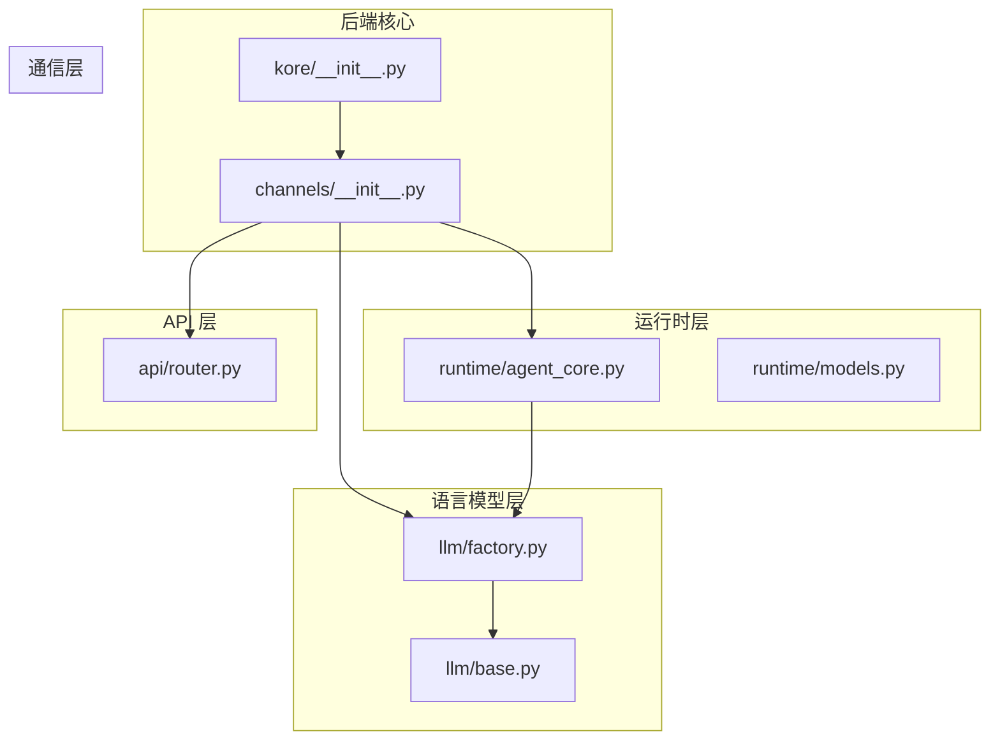
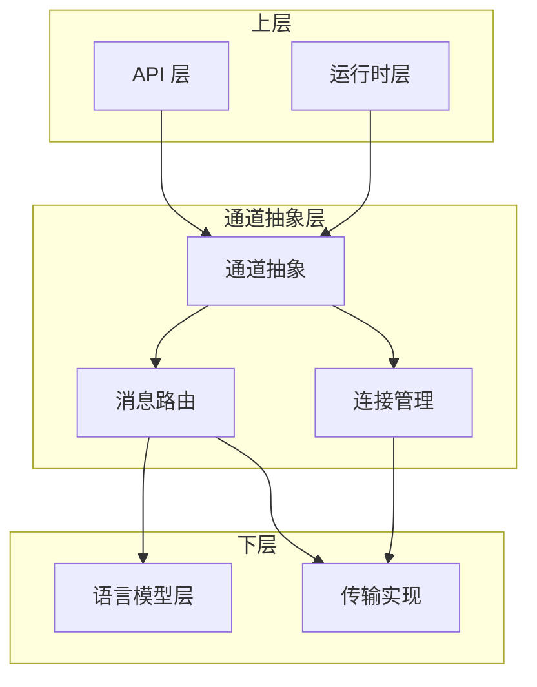
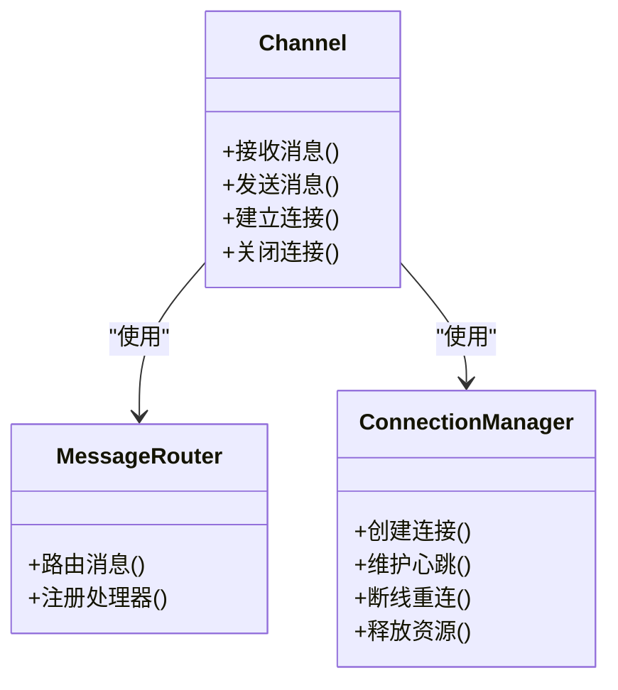
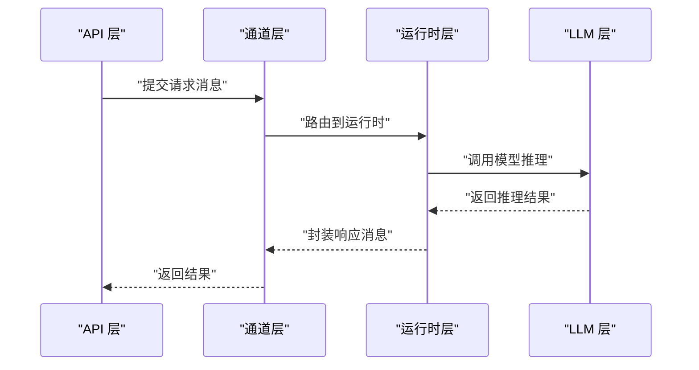
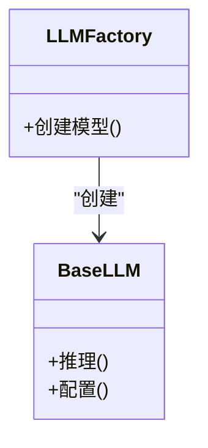
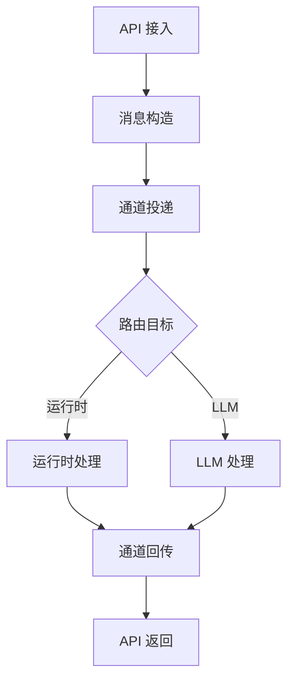
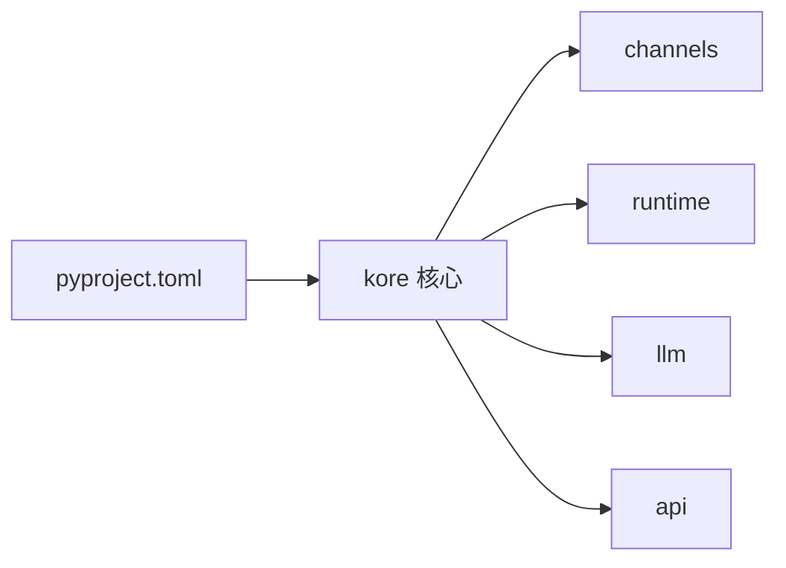

# 通信架构设计

<cite>
**本文档引用的文件**
- [backend/kore/__init__.py](file://backend/kore/__init__.py)
- [backend/kore/channels/__init__.py](file://backend/kore/channels/__init__.py)
- [backend/pyproject.toml](file://backend/pyproject.toml)
- [backend/tests/README.md](file://backend/tests/README.md)
</cite>

## 目录
1. [引言](#引言)
2. [项目结构](#项目结构)
3. [核心组件](#核心组件)
4. [架构总览](#架构总览)
5. [详细组件分析](#详细组件分析)
6. [依赖分析](#依赖分析)
7. [性能考虑](#性能考虑)
8. [故障排除指南](#故障排除指南)
9. [结论](#结论)

## 引言
本文件面向 Kore 智能体框架的通信架构设计，聚焦于通道抽象层、连接管理与消息路由策略，以及与 API 层、LLM 层、运行时层的集成方式。文档同时总结了可扩展性设计（插件化与模块化）、设计模式（工厂与观察者）的应用场景，并提供架构图与组件关系图，帮助开发者快速理解系统整体设计思路。

## 项目结构
Kore 后端采用模块化分层组织，核心通信相关模块位于 channels 子包，配合 runtime、llm、api 等子系统协同工作。项目使用 Python 包结构组织，入口与初始化文件位于顶层，测试目录独立存放。

**图表来源**
- [backend/kore/__init__.py:1-1](file://backend/kore/__init__.py#L1-L1)
- [backend/kore/channels/__init__.py:1-1](file://backend/kore/channels/__init__.py#L1-L1)

**章节来源**
- [backend/kore/__init__.py:1-1](file://backend/kore/__init__.py#L1-L1)
- [backend/kore/channels/__init__.py:1-1](file://backend/kore/channels/__init__.py#L1-L1)

## 核心组件
- 通道抽象层：负责统一的消息输入输出接口、连接生命周期管理与消息路由策略。该层向上对接运行时与 API 层，向下对接具体传输协议实现。
- 运行时层：包含智能体核心逻辑与状态管理，通过通道层进行外部通信。
- 语言模型层：提供模型工厂与基础抽象，支持多模型接入与切换。
- API 层：对外提供 HTTP/WS 接口，经由通道层转发到运行时或 LLM 层。
- 配置与依赖：通过 pyproject.toml 管理依赖项，确保模块解耦与版本约束。

**章节来源**
- [backend/kore/channels/__init__.py:1-1](file://backend/kore/channels/__init__.py#L1-L1)
- [backend/pyproject.toml](file://backend/pyproject.toml)

## 架构总览
通信架构以“通道抽象层”为核心，形成“上通下联”的分层设计：
- 上层：API 层与运行时层通过通道抽象进行松耦合交互。
- 下层：通道层根据消息类型与目标路由至 LLM 层或具体传输实现。
- 扩展点：通过工厂模式注入不同模型与传输实现；通过观察者模式实现事件广播与状态变更通知。

**图表来源**
- [backend/kore/channels/__init__.py:1-1](file://backend/kore/channels/__init__.py#L1-L1)

## 详细组件分析

### 通道抽象层设计
- 抽象职责：定义统一的通道接口，屏蔽底层传输差异；提供消息编解码、序列化与反序列化能力。
- 连接管理：维护连接状态、心跳检测、断线重连与资源回收；支持多连接并发处理。
- 消息路由：基于消息头或目标标识选择下游处理器（运行时或 LLM）；支持优先级队列与背压控制。
- 可扩展性：通过工厂模式注册不同传输实现；通过观察者模式订阅连接事件与消息事件。

**图表来源**
- [backend/kore/channels/__init__.py:1-1](file://backend/kore/channels/__init__.py#L1-L1)

**章节来源**
- [backend/kore/channels/__init__.py:1-1](file://backend/kore/channels/__init__.py#L1-L1)

### 运行时层集成
- 与通道层：运行时通过通道发送/接收消息，通道负责序列化与路由；运行时仅关注业务逻辑。
- 与 LLM 层：运行时调用 LLM 工厂创建适配器，通道负责将请求/响应在两者间传递。
- 与 API 层：API 层将外部请求转换为内部消息，经通道路由到运行时；运行时处理完成后通过通道回传结果。

**图表来源**
- [backend/kore/channels/__init__.py:1-1](file://backend/kore/channels/__init__.py#L1-L1)

**章节来源**
- [backend/kore/channels/__init__.py:1-1](file://backend/kore/channels/__init__.py#L1-L1)

### LLM 层集成
- 工厂模式：通过模型工厂创建不同供应商/版本的适配器，通道层透明转发请求与响应。
- 观察者模式：通道层发布连接与消息事件，LLM 层订阅并执行相应处理（如统计、限流、缓存）。

**图表来源**
- [backend/kore/llm/factory.py](file://backend/kore/llm/factory.py)
- [backend/kore/llm/base.py](file://backend/kore/llm/base.py)

**章节来源**
- [backend/kore/llm/factory.py](file://backend/kore/llm/factory.py)
- [backend/kore/llm/base.py](file://backend/kore/llm/base.py)

### API 层集成
- 请求接入：API 层解析外部请求，构造内部消息并通过通道层投递。
- 响应回传：通道层将运行时或 LLM 的响应按协议格式回传给客户端。
- 错误处理：API 层与通道层共同保证错误信息的标准化与可追踪性。

**图表来源**
- [backend/kore/channels/__init__.py:1-1](file://backend/kore/channels/__init__.py#L1-L1)

**章节来源**
- [backend/kore/channels/__init__.py:1-1](file://backend/kore/channels/__init__.py#L1-L1)

## 依赖分析
- 项目使用 Python 包结构组织，模块间通过相对导入与显式导出保持低耦合。
- 依赖管理集中在 pyproject.toml，建议在此处声明通信相关库（如异步网络库、序列化库等），以便后续扩展。
- 测试目录独立，便于对通道层与各子系统进行单元测试与集成测试。

**图表来源**
- [backend/pyproject.toml](file://backend/pyproject.toml)

**章节来源**
- [backend/pyproject.toml](file://backend/pyproject.toml)

## 性能考虑
- 并发处理：通道层应支持多连接并发与消息队列，避免阻塞主循环；结合异步 I/O 提升吞吐量。
- 背压控制：在高负载场景下，通道层实施限流与排队策略，防止下游过载。
- 序列化优化：采用高效序列化方案（如二进制协议或压缩算法），降低带宽占用。
- 缓存与复用：对频繁访问的资源（如模型句柄、连接池）进行缓存与复用，减少创建成本。
- 监控与可观测性：通过观察者模式收集连接与消息事件，构建指标体系，辅助性能调优。

## 故障排除指南
- 连接异常：检查通道层的心跳与断线重连逻辑，确认传输层的错误码与日志级别。
- 路由失败：核对消息头中的目标标识与处理器注册表，确保路由规则正确。
- LLM 调用超时：增加超时阈值与重试策略，同时在工厂层实现熔断与降级。
- API 响应异常：验证消息序列化/反序列化过程，确保字段映射一致。

## 结论
Kore 的通信架构以通道抽象层为核心，实现了上通下联的清晰分层与强扩展性。通过工厂与观察者模式，系统在不修改核心代码的前提下支持多模型与多传输的灵活组合。建议在现有结构基础上完善通道层的具体实现细节（如消息编解码、连接池、路由策略），并在 pyproject.toml 中明确通信相关依赖，以支撑后续功能演进与性能优化。