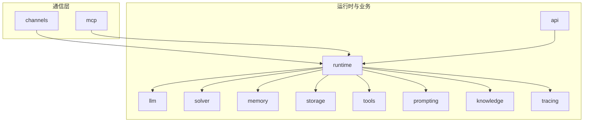
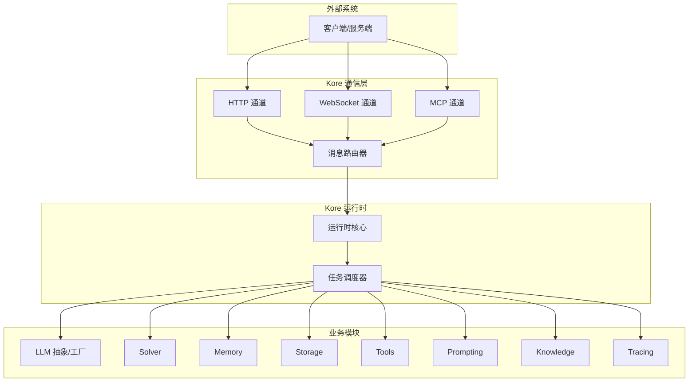
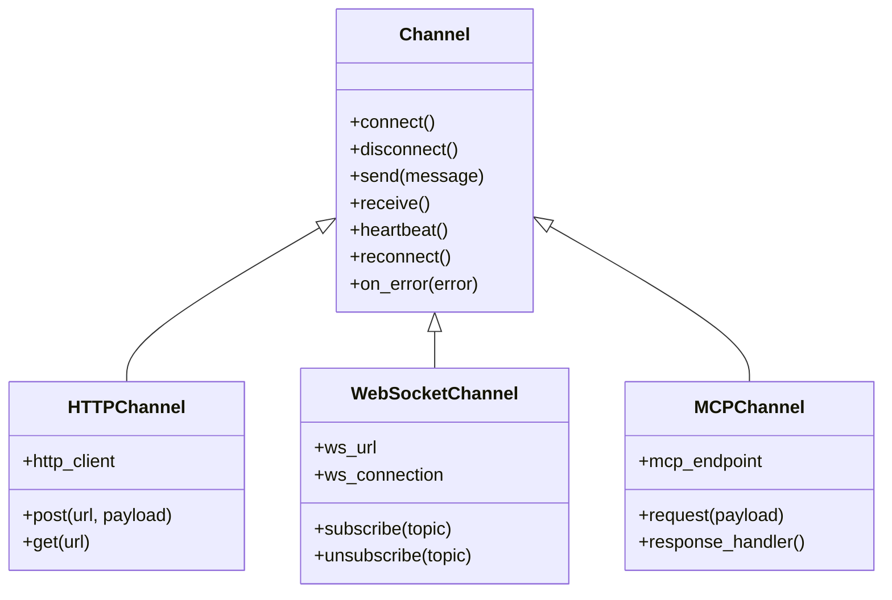
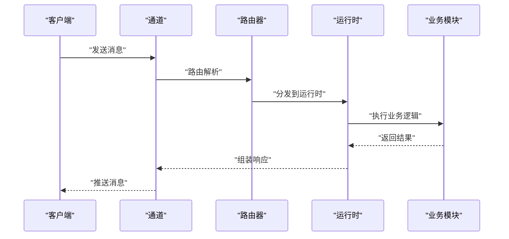
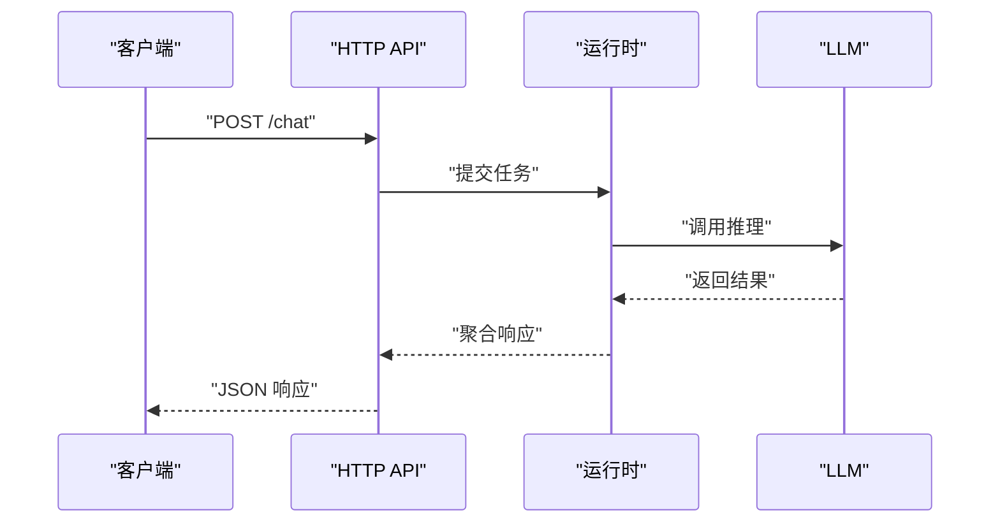
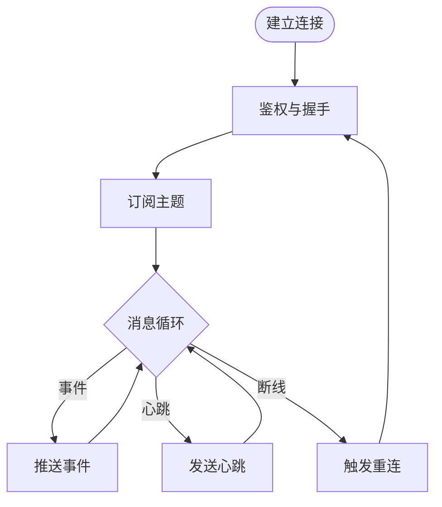
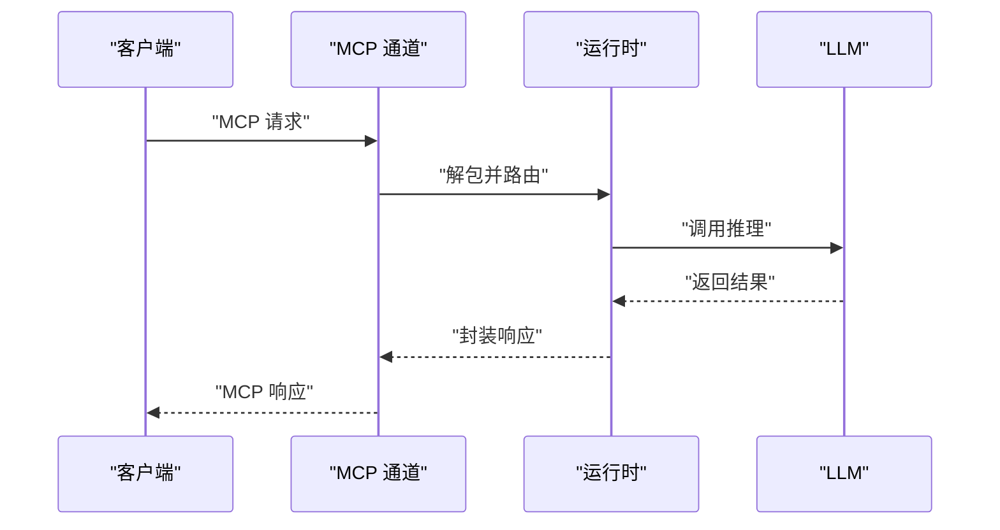
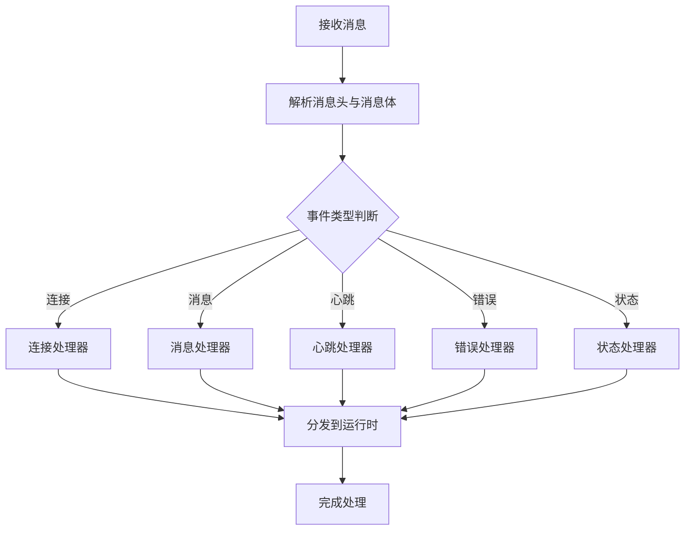
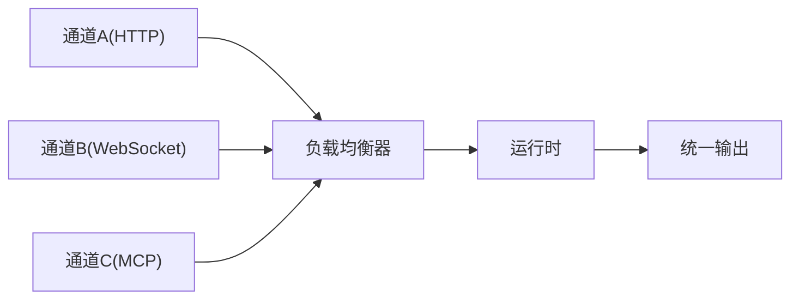
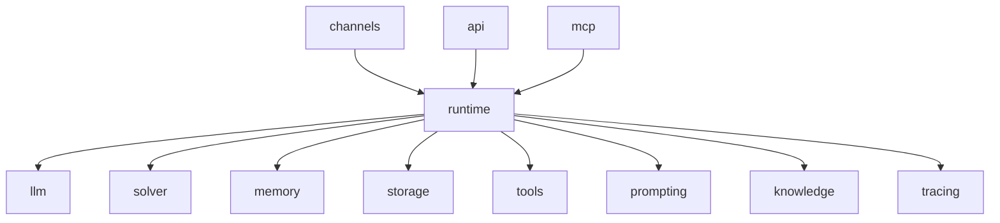

# 通信通道

<cite>
**本文引用的文件**
- [channels/__init__.py](file://backend/kore/channels/__init__.py)
- [mcp/__init__.py](file://backend/kore/mcp/__init__.py)
- [runtime/__init__.py](file://backend/kore/runtime/__init__.py)
- [api/__init__.py](file://backend/kore/api/__init__.py)
- [llm/base.py](file://backend/kore/llm/base.py)
- [llm/factory.py](file://backend/kore/llm/factory.py)
- [solver/__init__.py](file://backend/kore/solver/__init__.py)
- [memory/__init__.py](file://backend/kore/memory/__init__.py)
- [storage/__init__.py](file://backend/kore/storage/__init__.py)
- [tools/__init__.py](file://backend/kore/tools/__init__.py)
- [prompting/__init__.py](file://backend/kore/prompting/__init__.py)
- [knowledge/__init__.py](file://backend/kore/knowledge/__init__.py)
- [tracing/__init__.py](file://backend/kore/tracing/__init__.py)
</cite>

## 目录
1. [引言](#引言)
2. [项目结构](#项目结构)
3. [核心组件](#核心组件)
4. [架构总览](#架构总览)
5. [详细组件分析](#详细组件分析)
6. [依赖关系分析](#依赖关系分析)
7. [性能考虑](#性能考虑)
8. [故障排除指南](#故障排除指南)
9. [结论](#结论)
10. [附录](#附录)

## 引言
本文件面向 Kore 智能体框架的通信通道系统，旨在为开发者提供从架构设计到实现细节的完整技术文档。内容涵盖通道类型定义、连接管理与消息路由机制，支持的通信协议（HTTP API、WebSocket、MCP）的实现要点，实时通信的消息格式与事件类型，多通道协同的工作机制（通道选择策略与负载均衡），以及自定义通信协议的开发指南与安全加密实践。由于当前仓库中通信通道的具体实现文件尚未提供，本文基于现有模块化结构进行概念性说明与最佳实践指导，帮助读者在 Kore 框架中构建与扩展通信能力。

## 项目结构
Kore 后端采用模块化组织，通信通道系统可视为“通道层”与“上层业务”的桥梁。当前可见的关键模块如下：
- channels：通信通道抽象与实现入口（当前为空，待填充）
- mcp：MCP（Model Context Protocol）相关适配与集成
- runtime：运行时核心，负责智能体生命周期与任务调度
- api：HTTP API 路由与控制器
- llm：大语言模型抽象与工厂模式
- solver：推理与决策模块
- memory/storage：记忆与存储抽象
- tools/prompting/knowledge/tracing：工具、提示工程、知识库与追踪模块

**图表来源**
- [channels/__init__.py](file://backend/kore/channels/__init__.py)
- [mcp/__init__.py](file://backend/kore/mcp/__init__.py)
- [runtime/__init__.py](file://backend/kore/runtime/__init__.py)
- [api/__init__.py](file://backend/kore/api/__init__.py)
- [llm/base.py](file://backend/kore/llm/base.py)
- [llm/factory.py](file://backend/kore/llm/factory.py)
- [solver/__init__.py](file://backend/kore/solver/__init__.py)
- [memory/__init__.py](file://backend/kore/memory/__init__.py)
- [storage/__init__.py](file://backend/kore/storage/__init__.py)
- [tools/__init__.py](file://backend/kore/tools/__init__.py)
- [prompting/__init__.py](file://backend/kore/prompting/__init__.py)
- [knowledge/__init__.py](file://backend/kore/knowledge/__init__.py)
- [tracing/__init__.py](file://backend/kore/tracing/__init__.py)

**章节来源**
- [channels/__init__.py](file://backend/kore/channels/__init__.py)
- [mcp/__init__.py](file://backend/kore/mcp/__init__.py)
- [runtime/__init__.py](file://backend/kore/runtime/__init__.py)
- [api/__init__.py](file://backend/kore/api/__init__.py)

## 核心组件
- 通道抽象层（channels）：定义统一的通道接口、连接管理、消息路由与状态同步机制。建议以类或接口形式封装不同协议（HTTP、WebSocket、MCP）的共性行为。
- MCP 适配层（mcp）：提供与 MCP 协议的对接能力，包括请求/响应序列化、上下文传递与错误处理。
- 运行时（runtime）：作为中枢协调各模块，负责通道选择、消息分发、状态同步与异常恢复。
- HTTP API 层（api）：暴露 RESTful 接口，用于外部系统与 Kore 的交互；可作为通道的一种实现。
- LLM/Solver/Memory/Storage 等：通过通道与外部系统通信，完成推理、记忆与数据持久化等任务。

**章节来源**
- [channels/__init__.py](file://backend/kore/channels/__init__.py)
- [mcp/__init__.py](file://backend/kore/mcp/__init__.py)
- [runtime/__init__.py](file://backend/kore/runtime/__init__.py)
- [llm/base.py](file://backend/kore/llm/base.py)
- [llm/factory.py](file://backend/kore/llm/factory.py)
- [solver/__init__.py](file://backend/kore/solver/__init__.py)
- [memory/__init__.py](file://backend/kore/memory/__init__.py)
- [storage/__init__.py](file://backend/kore/storage/__init__.py)

## 架构总览
下图展示了 Kore 通信通道系统的高层架构：通道层负责协议适配与消息路由，运行时作为中枢协调业务模块，API 提供 HTTP 入口，MCP 提供标准化的模型上下文协议接入。

**图表来源**
- [channels/__init__.py](file://backend/kore/channels/__init__.py)
- [mcp/__init__.py](file://backend/kore/mcp/__init__.py)
- [runtime/__init__.py](file://backend/kore/runtime/__init__.py)
- [api/__init__.py](file://backend/kore/api/__init__.py)
- [llm/base.py](file://backend/kore/llm/base.py)
- [llm/factory.py](file://backend/kore/llm/factory.py)
- [solver/__init__.py](file://backend/kore/solver/__init__.py)
- [memory/__init__.py](file://backend/kore/memory/__init__.py)
- [storage/__init__.py](file://backend/kore/storage/__init__.py)
- [tools/__init__.py](file://backend/kore/tools/__init__.py)
- [prompting/__init__.py](file://backend/kore/prompting/__init__.py)
- [knowledge/__init__.py](file://backend/kore/knowledge/__init__.py)
- [tracing/__init__.py](file://backend/kore/tracing/__init__.py)

## 详细组件分析

### 通道类型与连接管理
- 通道抽象：定义统一的通道接口，包含连接建立、断开、心跳检测、重连策略与错误回调等。
- 连接池与会话管理：对长连接（如 WebSocket）维护会话状态，对短连接（如 HTTP）复用连接或按需创建。
- 多路复用：在同一通道内区分不同主题或目标，确保消息路由正确性。
- 安全与鉴权：在连接建立阶段进行身份验证与权限校验，支持令牌、签名与证书等机制。

**图表来源**
- [channels/__init__.py](file://backend/kore/channels/__init__.py)

**章节来源**
- [channels/__init__.py](file://backend/kore/channels/__init__.py)

### 消息路由与状态同步
- 路由策略：根据消息头中的目标标识（如目标 ID、主题、协议版本）选择对应处理器。
- 广播与单播：支持向特定会话广播或定向投递消息。
- 状态同步：通过增量更新或快照方式保持通道状态一致性，避免重复处理与丢失。
- 事务与幂等：对关键操作引入事务与幂等控制，确保消息不丢不重。

**图表来源**
- [channels/__init__.py](file://backend/kore/channels/__init__.py)
- [runtime/__init__.py](file://backend/kore/runtime/__init__.py)

**章节来源**
- [channels/__init__.py](file://backend/kore/channels/__init__.py)
- [runtime/__init__.py](file://backend/kore/runtime/__init__.py)

### 支持的通信协议

#### HTTP API
- 设计原则：RESTful 风格，资源化接口，明确的请求/响应结构与状态码。
- 请求流程：鉴权 -> 参数校验 -> 业务处理 -> 结果封装 -> 响应返回。
- 错误处理：统一错误码与错误信息结构，便于前端与外部系统处理。
- 扩展点：中间件（日志、限流、缓存）、钩子（前置/后置处理）。

**图表来源**
- [api/__init__.py](file://backend/kore/api/__init__.py)
- [runtime/__init__.py](file://backend/kore/runtime/__init__.py)
- [llm/base.py](file://backend/kore/llm/base.py)

**章节来源**
- [api/__init__.py](file://backend/kore/api/__init__.py)
- [runtime/__init__.py](file://backend/kore/runtime/__init__.py)
- [llm/base.py](file://backend/kore/llm/base.py)

#### WebSocket
- 实时性：双向通信，适合事件推送、状态变更与流式输出。
- 心跳与重连：定期心跳检测链路健康，失败后自动重连与状态恢复。
- 主题订阅：支持按主题订阅/退订，降低带宽与处理压力。
- 流控与背压：对高频事件进行节流与合并，避免拥塞。

**图表来源**
- [channels/__init__.py](file://backend/kore/channels/__init__.py)

**章节来源**
- [channels/__init__.py](file://backend/kore/channels/__init__.py)

#### MCP 协议
- 协议适配：遵循 MCP 规范，实现请求/响应的序列化与反序列化。
- 上下文传递：在通道层注入与提取上下文信息，保证跨模块一致性。
- 错误映射：将底层异常映射为标准 MCP 错误码与描述。
- 版本兼容：支持多版本 MCP 协议，平滑升级与降级。

**图表来源**
- [mcp/__init__.py](file://backend/kore/mcp/__init__.py)
- [runtime/__init__.py](file://backend/kore/runtime/__init__.py)
- [llm/base.py](file://backend/kore/llm/base.py)

**章节来源**
- [mcp/__init__.py](file://backend/kore/mcp/__init__.py)
- [runtime/__init__.py](file://backend/kore/runtime/__init__.py)
- [llm/base.py](file://backend/kore/llm/base.py)

### 实时通信与消息格式
- 消息格式：建议采用 JSON 或 Protobuf，包含消息头（类型、目标、时间戳、签名）与消息体（payload）。
- 事件类型：连接事件、消息事件、心跳事件、错误事件、状态变更事件。
- 事件分发：根据事件类型路由至对应处理器，支持异步与同步两种模式。
- 状态同步：通过增量更新或全量快照保持通道状态一致，结合去重与幂等控制。

**图表来源**
- [channels/__init__.py](file://backend/kore/channels/__init__.py)
- [runtime/__init__.py](file://backend/kore/runtime/__init__.py)

**章节来源**
- [channels/__init__.py](file://backend/kore/channels/__init__.py)
- [runtime/__init__.py](file://backend/kore/runtime/__init__.py)

### 多通道协同与负载均衡
- 通道选择策略：根据目标系统特性（实时性、可靠性、吞吐量）选择最优通道；支持动态切换与降级。
- 负载均衡：对多实例部署进行流量分摊，结合健康检查与熔断策略提升可用性。
- 一致性保障：通过分布式锁、队列与事务确保跨通道的一致性。
- 监控与可观测性：埋点统计延迟、吞吐、错误率与重试次数，辅助优化与告警。

**图表来源**
- [channels/__init__.py](file://backend/kore/channels/__init__.py)
- [runtime/__init__.py](file://backend/kore/runtime/__init__.py)

**章节来源**
- [channels/__init__.py](file://backend/kore/channels/__init__.py)
- [runtime/__init__.py](file://backend/kore/runtime/__init__.py)

### 自定义通信协议开发指南
- 接口实现：实现通道接口的 connect/disconnect/send/receive/heartbeat/reconnect/on_error 方法。
- 协议适配：定义请求/响应的数据结构与序列化规则，确保与上游/下游兼容。
- 集成方法：在运行时注册新通道，配置路由规则与优先级；编写单元测试与集成测试。
- 最佳实践：日志分级、超时与重试、错误码标准化、监控指标埋点。

**章节来源**
- [channels/__init__.py](file://backend/kore/channels/__init__.py)
- [runtime/__init__.py](file://backend/kore/runtime/__init__.py)

### 通信安全与加密
- 认证与授权：支持 JWT、OAuth、API Key 等多种认证方式；在通道层进行鉴权与权限校验。
- 传输安全：启用 TLS/SSL，强制 HTTPS 与 WSS；配置证书与吊销列表。
- 数据加密：对敏感字段进行加密存储与传输；使用对称/非对称加密算法。
- 审计与追踪：记录访问日志与关键操作审计，支持合规与溯源。

**章节来源**
- [channels/__init__.py](file://backend/kore/channels/__init__.py)
- [api/__init__.py](file://backend/kore/api/__init__.py)
- [mcp/__init__.py](file://backend/kore/mcp/__init__.py)

## 依赖关系分析
- 模块耦合：通道层与运行时紧密耦合，与业务模块松耦合；通过统一接口与消息路由实现解耦。
- 外部依赖：HTTP 依赖 HTTP 库与中间件；WebSocket 依赖网络库与心跳机制；MCP 依赖序列化库与协议栈。
- 循环依赖：避免通道层直接依赖业务模块，通过运行时与接口隔离。

**图表来源**
- [channels/__init__.py](file://backend/kore/channels/__init__.py)
- [runtime/__init__.py](file://backend/kore/runtime/__init__.py)
- [api/__init__.py](file://backend/kore/api/__init__.py)
- [mcp/__init__.py](file://backend/kore/mcp/__init__.py)
- [llm/base.py](file://backend/kore/llm/base.py)
- [llm/factory.py](file://backend/kore/llm/factory.py)
- [solver/__init__.py](file://backend/kore/solver/__init__.py)
- [memory/__init__.py](file://backend/kore/memory/__init__.py)
- [storage/__init__.py](file://backend/kore/storage/__init__.py)
- [tools/__init__.py](file://backend/kore/tools/__init__.py)
- [prompting/__init__.py](file://backend/kore/prompting/__init__.py)
- [knowledge/__init__.py](file://backend/kore/knowledge/__init__.py)
- [tracing/__init__.py](file://backend/kore/tracing/__init__.py)

**章节来源**
- [channels/__init__.py](file://backend/kore/channels/__init__.py)
- [runtime/__init__.py](file://backend/kore/runtime/__init__.py)
- [api/__init__.py](file://backend/kore/api/__init__.py)
- [mcp/__init__.py](file://backend/kore/mcp/__init__.py)
- [llm/base.py](file://backend/kore/llm/base.py)
- [llm/factory.py](file://backend/kore/llm/factory.py)
- [solver/__init__.py](file://backend/kore/solver/__init__.py)
- [memory/__init__.py](file://backend/kore/memory/__init__.py)
- [storage/__init__.py](file://backend/kore/storage/__init__.py)
- [tools/__init__.py](file://backend/kore/tools/__init__.py)
- [prompting/__init__.py](file://backend/kore/prompting/__init__.py)
- [knowledge/__init__.py](file://backend/kore/knowledge/__init__.py)
- [tracing/__init__.py](file://backend/kore/tracing/__init__.py)

## 性能考虑
- 连接复用：HTTP 使用连接池，WebSocket 维护长连接，减少握手与建连开销。
- 流水线与并发：对高并发场景采用异步 I/O 与并发队列，避免阻塞。
- 缓存与预热：对热点数据与常用模型进行缓存与预热，降低延迟。
- 监控与调优：通过指标与日志定位瓶颈，持续优化参数与资源配置。

## 故障排除指南
- 连接问题：检查网络连通性、证书与鉴权配置；启用重连与熔断机制。
- 超时与丢包：调整超时阈值与重试策略；对关键消息增加确认与重发。
- 协议不匹配：核对消息格式与版本号；在通道层进行协议转换与兼容处理。
- 日志与追踪：开启详细日志与追踪，定位问题根因并形成修复闭环。

**章节来源**
- [channels/__init__.py](file://backend/kore/channels/__init__.py)
- [runtime/__init__.py](file://backend/kore/runtime/__init__.py)

## 结论
Kore 的通信通道系统以模块化与抽象化为核心，通过统一的通道接口与消息路由实现多协议协同与高可用运行。HTTP、WebSocket 与 MCP 在通道层被标准化接入，配合运行时的调度与业务模块的协作，形成完整的智能体通信体系。建议在实际落地中优先完善通道层实现，确保安全、性能与可观测性的统一。

## 附录
- 配置示例（概念性说明）
  - HTTP 通道：设置基础 URL、超时、重试与鉴权头。
  - WebSocket 通道：配置连接地址、心跳间隔、订阅主题与重连策略。
  - MCP 通道：配置端点、协议版本与上下文参数。
- 集成示例（概念性说明）
  - 将新协议封装为通道实现，注册到运行时并配置路由规则。
  - 对关键路径添加监控与告警，持续优化性能与稳定性。