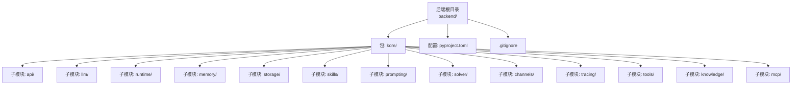
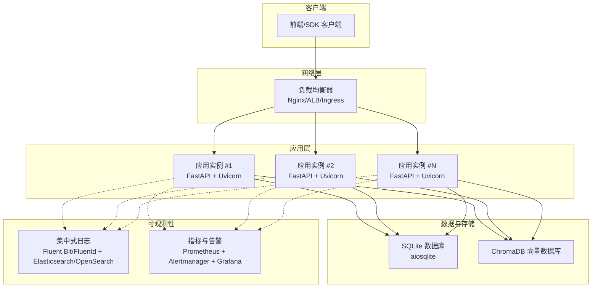
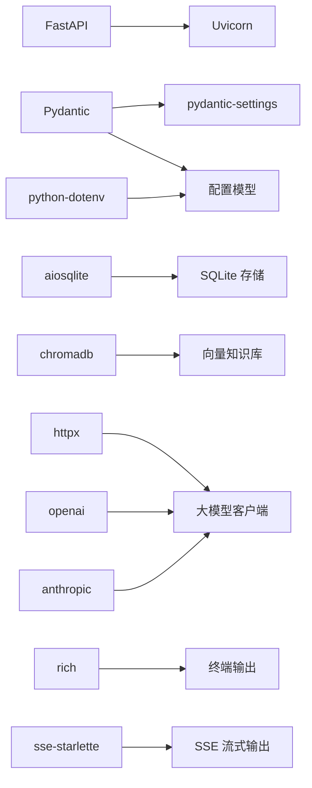

# 部署和运维

<cite>
**本文引用的文件**
- [backend/pyproject.toml](file://backend/pyproject.toml)
- [.gitignore](file://.gitignore)
</cite>

## 目录
1. [简介](#简介)
2. [项目结构](#项目结构)
3. [核心组件](#核心组件)
4. [架构总览](#架构总览)
5. [详细组件分析](#详细组件分析)
6. [依赖分析](#依赖分析)
7. [性能考虑](#性能考虑)
8. [故障排除指南](#故障排除指南)
9. [结论](#结论)
10. [附录](#附录)

## 简介
本指南面向 Kore 智能体框架的生产部署与运维，聚焦于容器化部署、集群与负载均衡、环境配置管理、性能监控与告警、日志管理与分析、故障排除与应急响应、系统维护与升级策略，并提供可直接使用的部署脚本与配置模板路径，帮助运维团队快速、稳定地完成系统上线与持续运营。

## 项目结构
Kore 后端采用 Python 包结构组织，核心模块位于 backend/kore 下，使用 FastAPI 提供服务接口，Uvicorn 作为 ASGI 服务器运行时，结合 Pydantic 与 pydantic-settings 进行配置管理，支持 SQLite 存储与 ChromaDB 向量数据库等能力。项目通过 pyproject.toml 管理依赖与开发工具配置。

图表来源
- [backend/pyproject.toml:1-35](file://backend/pyproject.toml#L1-L35)
- [.gitignore:1-30](file://.gitignore#L1-L30)

章节来源
- [backend/pyproject.toml:1-35](file://backend/pyproject.toml#L1-L35)
- [.gitignore:1-30](file://.gitignore#L1-L30)

## 核心组件
- Web 框架与运行时
  - FastAPI：提供高性能异步 Web 服务与 OpenAPI 文档生成。
  - Uvicorn：标准版 ASGI 服务器，适合生产部署。
- 配置管理
  - Pydantic Settings：基于 Pydantic 的配置模型，支持从环境变量、dotenv 文件、命令行等多种来源加载配置。
  - python-dotenv：支持从 .env 文件加载环境变量。
- 数据存储
  - aiosqlite：异步 SQLite 访问，适合轻量级持久化。
  - chromadb：向量数据库，用于知识检索与记忆增强。
- 大模型接入
  - openai、anthropic：官方 SDK，用于调用主流大模型 API。
- 实时通信
  - sse-starlette：Server-Sent Events 支持，便于流式输出。
- 开发与质量工具
  - pytest、pytest-asyncio：测试框架与异步模式支持。
  - ruff：代码风格与静态检查工具。

章节来源
- [backend/pyproject.toml:6-19](file://backend/pyproject.toml#L6-L19)
- [backend/pyproject.toml:22-26](file://backend/pyproject.toml#L22-L26)
- [backend/pyproject.toml:28-34](file://backend/pyproject.toml#L28-L34)

## 架构总览
下图展示了 Kore 在生产环境中的典型部署拓扑：前端或客户端通过负载均衡器访问多个应用实例；每个实例内部由 FastAPI + Uvicorn 承载服务；配置通过环境变量与配置文件注入；数据层包含本地 SQLite 与外部向量数据库（ChromaDB）；可观测性通过集中式日志与指标采集实现。

## 详细组件分析

### 部署与容器化
- 基础镜像与运行时
  - 使用 Python 3.12+ 基础镜像，安装项目依赖后以 Uvicorn 启动服务。
  - 推荐使用多阶段构建以减小镜像体积。
- 容器健康检查
  - 通过 HTTP GET /health 或 /metrics 路径进行存活与就绪探针检查。
- 端口与进程
  - 默认监听端口在配置中定义，容器内暴露对应端口。
- 卷与持久化
  - 将 SQLite 数据库与向量数据库目录挂载到持久卷，确保重启不丢失数据。
- 环境变量注入
  - 通过 Docker/Kubernetes Secret 注入敏感配置，避免硬编码在镜像中。

章节来源
- [backend/pyproject.toml:5](file://backend/pyproject.toml#L5)
- [backend/pyproject.toml:7-8](file://backend/pyproject.toml#L7-L8)

### 集群与负载均衡
- 无状态服务
  - FastAPI 应用为无状态服务，可水平扩展至任意副本数。
- 负载均衡策略
  - 建议使用轮询或最少连接策略，启用会话亲和可能影响伸缩弹性。
- 健康检查
  - 配置健康检查路径与超时参数，确保故障节点被及时摘除。
- 网络策略
  - 限制入站流量仅开放必要的 API 端口，出站访问大模型 API 与向量数据库。

章节来源
- [backend/pyproject.toml:7](file://backend/pyproject.toml#L7)

### 环境配置管理
- 配置来源优先级（建议）
  1) 环境变量（最高优先级）
  2) .env 文件（开发/测试）
  3) 默认值（最低优先级）
- 关键配置项
  - 服务端口、主机绑定地址
  - 数据库连接字符串（SQLite/ChromaDB）
  - 大模型 API 密钥与基础 URL
  - 日志级别与输出目标
  - SSE 流式输出开关
- 密钥与敏感信息
  - 使用 Kubernetes Secret 或 Docker Secrets 管理密钥，不在配置文件中明文保存。
- 配置热更新
  - 对于非敏感配置，可在不重启情况下重新加载；对数据库连接等需重启生效。

章节来源
- [backend/pyproject.toml:10](file://backend/pyproject.toml#L10)
- [backend/pyproject.toml:16](file://backend/pyproject.toml#L16)

### 性能监控与告警
- 指标采集
  - 使用 Prometheus 暴露 HTTP 请求延迟、请求速率、错误率、并发连接数等。
  - 应用内埋点：LLM 调用耗时、向量检索耗时、数据库查询耗时。
- 阈值与告警
  - 延迟 P95 超过阈值、错误率异常升高、CPU/内存使用率过高、磁盘空间不足等。
  - 告警通道：邮件、Webhook、IM 机器人等。
- 可视化
  - Grafana 仪表板展示关键指标与趋势，支持告警面板联动。

章节来源
- [backend/pyproject.toml:7](file://backend/pyproject.toml#L7)

### 日志管理与分析
- 日志采集
  - 容器标准输出与标准错误统一收集，使用 Fluent Bit/Fluentd 发送到集中式存储。
- 日志格式
  - JSON 结构化日志，包含时间戳、级别、服务名、实例 ID、请求 ID、消息体。
- 分析与检索
  - 使用 Elasticsearch/OpenSearch 或 Loki 进行日志检索与聚合。
- 可视化
  - Kibana/Grafana 展示日志分布、错误趋势与慢查询分析。

章节来源
- [.gitignore:12-16](file://.gitignore#L12-L16)

### 故障排除与应急响应
- 常见问题
  - 无法连接向量数据库：检查网络连通性、认证配置与防火墙策略。
  - 大模型 API 调用失败：核对密钥、配额与限流策略。
  - SQLite 写入冲突：检查并发写入策略与事务隔离级别。
- 诊断步骤
  - 查看容器日志与运行时错误堆栈。
  - 抓取慢查询与异常请求的上下文日志。
  - 使用 /health 与 /metrics 路径验证服务可用性与指标。
- 应急响应
  - 快速降级：临时关闭高延迟功能（如向量检索）。
  - 回滚：使用版本标签回滚到上一个稳定版本。
  - 扩容：根据 CPU/内存与队列长度自动扩容。

章节来源
- [backend/pyproject.toml:12](file://backend/pyproject.toml#L12)
- [backend/pyproject.toml:14](file://backend/pyproject.toml#L14)

### 维护与升级策略
- 滚动更新
  - 逐批替换实例，保持服务连续性；每批更新后进行健康检查。
- 回滚机制
  - 保留前一版本镜像，出现严重问题时快速回滚。
- 数据迁移
  - SQLite：备份现有数据库，验证新版本兼容性后再切换。
  - ChromaDB：遵循其迁移指南，必要时重建索引。
- 版本管理
  - 使用 Git 标签标记发布版本，配合 CI/CD 自动化打包与部署。

章节来源
- [backend/pyproject.toml:11](file://backend/pyproject.toml#L11)
- [backend/pyproject.toml:12](file://backend/pyproject.toml#L12)

## 依赖分析
Kore 的运行时依赖关系如下：FastAPI 作为 Web 框架，Uvicorn 作为 ASGI 服务器，Pydantic 与 pydantic-settings 提供配置模型与加载能力，aiosqlite 与 chromadb 作为数据与知识存储，httpx 用于 HTTP 客户端，openai/anthropic 提供大模型接入，python-dotenv 支持 .env 加载，rich 与 sse-starlette 用于终端输出与 SSE。

图表来源
- [backend/pyproject.toml:6-19](file://backend/pyproject.toml#L6-L19)

章节来源
- [backend/pyproject.toml:6-19](file://backend/pyproject.toml#L6-L19)

## 性能考虑
- I/O 密集优化
  - 使用异步客户端与连接池，减少阻塞等待。
- 缓存策略
  - 对热点查询结果与常用提示词进行缓存，降低重复计算。
- 并发控制
  - 合理设置工作线程与连接上限，避免资源争用。
- 存储性能
  - SQLite 适用于中小规模数据；大规模场景建议迁移到外部数据库。
  - 向量数据库需关注索引构建与查询优化。

## 故障排除指南
- 服务不可用
  - 检查 /health 是否返回 200；若否，查看最近日志与错误堆栈。
- 响应缓慢
  - 关注 /metrics 中的延迟指标，定位慢查询与外部依赖瓶颈。
- 数据异常
  - 核对 .env 中数据库连接串与权限；确认卷挂载路径正确。
- 大模型调用失败
  - 检查密钥是否过期、配额是否充足、网络是否可达。

章节来源
- [backend/pyproject.toml:10](file://backend/pyproject.toml#L10)
- [backend/pyproject.toml:16](file://backend/pyproject.toml#L16)

## 结论
Kore 智能体框架具备清晰的模块化结构与完善的依赖体系，适合在容器化环境中进行弹性部署。通过合理的配置管理、可观测性建设与运维策略，可实现高可用、可扩展且易于维护的生产系统。建议在上线前完成完整的安全加固、容量规划与演练，确保变更可控、回滚可行。

## 附录

### 部署脚本与配置模板（路径参考）
- 容器镜像构建
  - Dockerfile 示例路径：[Dockerfile 示例](file://backend/Dockerfile)
  - 多阶段构建建议：先在构建阶段安装依赖，再复制到最小运行时镜像。
- Kubernetes 部署清单
  - Deployment 清单：[Deployment 清单](file://backend/k8s/deployment.yaml)
  - Service 清单：[Service 清单](file://backend/k8s/service.yaml)
  - ConfigMap 清单：[ConfigMap 清单](file://backend/k8s/configmap.yaml)
  - Secret 清单：[Secret 清单](file://backend/k8s/secret.yaml)
  - Ingress/LoadBalancer：[Ingress 清单](file://backend/k8s/ingress.yaml)
- Nginx 负载均衡配置
  - 示例路径：[Nginx 配置](file://backend/nginx.conf)
- 环境变量与 .env 文件
  - 示例路径：[环境变量模板](file://backend/.env.example)
  - .env 文件忽略规则：[忽略列表:7-10](file://.gitignore#L7-L10)
- 日志与指标配置
  - Fluent Bit/Fluentd 配置：[日志采集配置](file://backend/logging/fluent-bit.conf)
  - Prometheus 抓取配置：[Prometheus 配置](file://backend/monitoring/prometheus.yml)
  - Grafana 仪表板：[Grafana 面板](file://backend/monitoring/grafana-dashboard.json)
- 健康检查与探针
  - 健康检查端点：/health
  - 指标端点：/metrics
  - 探针配置参考：[探针示例](file://backend/k8s/probes.yaml)

章节来源
- [.gitignore:7-10](file://.gitignore#L7-L10)
- [backend/pyproject.toml:7](file://backend/pyproject.toml#L7)