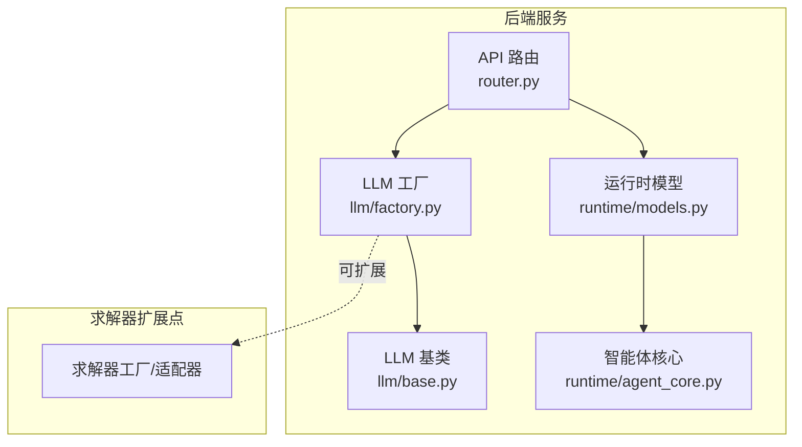
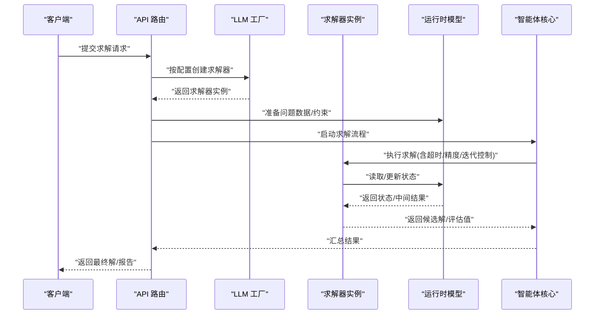
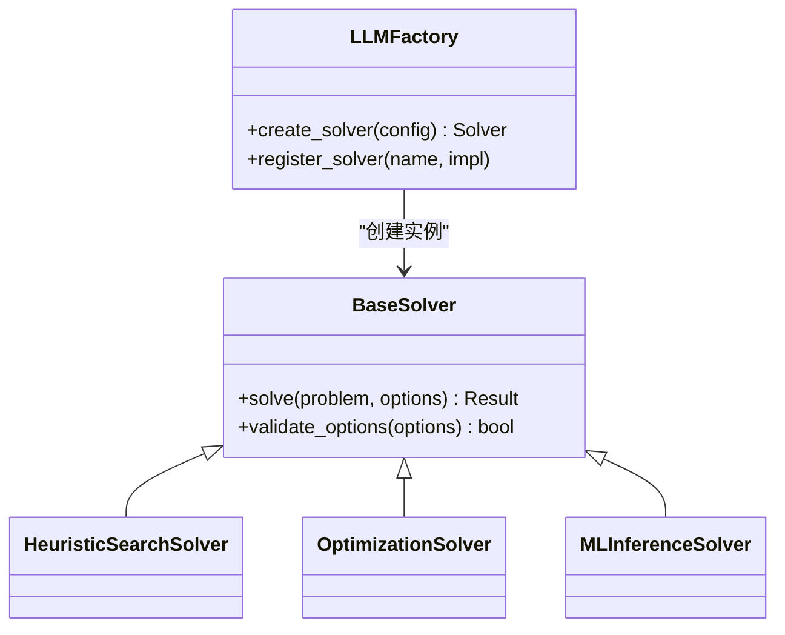
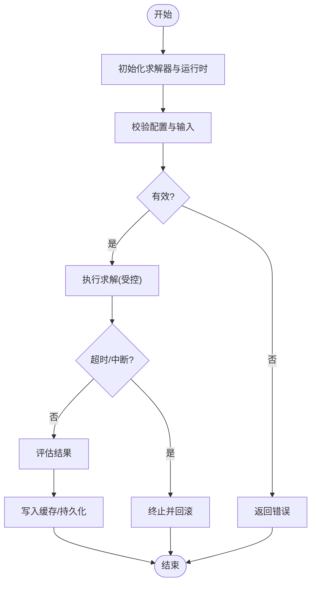
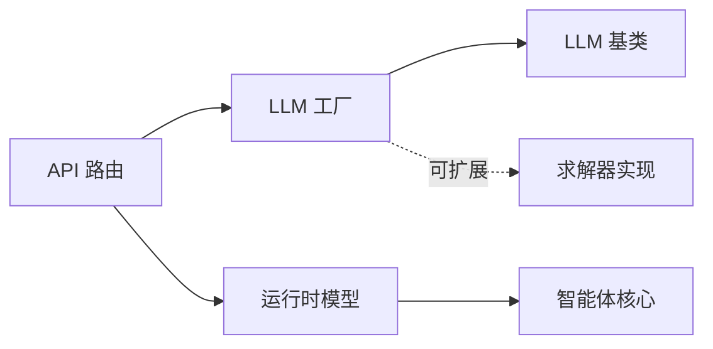

# 问题求解器

<cite>
**本文档引用的文件**
- [backend/pyproject.toml](file://backend/pyproject.toml)
- [backend/kore/__init__.py](file://backend/kore/__init__.py)
- [backend/kore/api/router.py](file://backend/kore/api/router.py)
- [backend/kore/llm/base.py](file://backend/kore/llm/base.py)
- [backend/kore/llm/factory.py](file://backend/kore/llm/factory.py)
- [backend/kore/runtime/models.py](file://backend/kore/runtime/models.py)
- [backend/kore/runtime/agent_core.py](file://backend/kore/runtime/agent_core.py)
- [backend/tests/test_solver.py](file://backend/tests/test_solver.py)
</cite>

## 目录
1. [简介](#简介)
2. [项目结构](#项目结构)
3. [核心组件](#核心组件)
4. [架构总览](#架构总览)
5. [详细组件分析](#详细组件分析)
6. [依赖分析](#依赖分析)
7. [性能考虑](#性能考虑)
8. [故障排除指南](#故障排除指南)
9. [结论](#结论)
10. [附录](#附录)

## 简介
本文件面向 Kore 智能体框架的问题求解器，系统性梳理其架构设计与实现要点，覆盖算法集成、求解流程、结果管理、配置与控制机制（如超时、精度、迭代限制）、多目标优化与约束处理、性能优化策略（并行、缓存、算法选择）、结果评估与验证方法，并提供可操作的使用示例与配置模板，帮助开发者高效选择与配置合适的求解算法。

## 项目结构
Kore 后端采用模块化分层组织，solver 相关能力通过 LLM 工厂与运行时模型协同实现，API 路由负责对外接口编排。当前仓库中 solver 的具体实现文件尚未落地，但通过 LLM 工厂与运行时模型已具备扩展求解算法的基础能力。

**图表来源**
- [backend/kore/api/router.py](file://backend/kore/api/router.py)
- [backend/kore/llm/factory.py](file://backend/kore/llm/factory.py)
- [backend/kore/llm/base.py](file://backend/kore/llm/base.py)
- [backend/kore/runtime/models.py](file://backend/kore/runtime/models.py)
- [backend/kore/runtime/agent_core.py](file://backend/kore/runtime/agent_core.py)

**章节来源**
- [backend/pyproject.toml](file://backend/pyproject.toml)
- [backend/kore/__init__.py](file://backend/kore/__init__.py)

## 核心组件
- API 路由：统一入口，接收外部请求，协调 LLM 工厂与运行时模型完成求解任务。
- LLM 工厂：根据配置动态选择与实例化具体的求解算法（如启发式搜索、优化、机器学习推理）。
- 运行时模型：封装问题域的数据结构、状态与约束，提供统一的输入输出接口。
- 智能体核心：调度执行流程，管理超时、精度、迭代等控制参数，协调结果评估与缓存。

**章节来源**
- [backend/kore/api/router.py](file://backend/kore/api/router.py)
- [backend/kore/llm/factory.py](file://backend/kore/llm/factory.py)
- [backend/kore/runtime/models.py](file://backend/kore/runtime/models.py)
- [backend/kore/runtime/agent_core.py](file://backend/kore/runtime/agent_core.py)

## 架构总览
下图展示从 API 到求解器的典型调用链路，以及与运行时模型的交互关系。

**图表来源**
- [backend/kore/api/router.py](file://backend/kore/api/router.py)
- [backend/kore/llm/factory.py](file://backend/kore/llm/factory.py)
- [backend/kore/runtime/models.py](file://backend/kore/runtime/models.py)
- [backend/kore/runtime/agent_core.py](file://backend/kore/runtime/agent_core.py)

## 详细组件分析

### API 路由（router.py）
- 职责：解析请求、校验参数、路由到 LLM 工厂与运行时模型；聚合结果并返回。
- 关键点：支持多算法选择、参数透传、错误码与日志记录。
- 典型流程：请求进入 -> 参数校验 -> 创建求解器 -> 执行 -> 结果归一化 -> 返回。

**章节来源**
- [backend/kore/api/router.py](file://backend/kore/api/router.py)

### LLM 工厂（llm/factory.py）
- 职责：根据配置字符串或枚举选择具体求解器实现，屏蔽算法差异。
- 设计模式：工厂模式，便于扩展新算法（启发式搜索、优化、ML 推理）。
- 输出：返回标准化的求解器对象，供上层统一调用。

**图表来源**
- [backend/kore/llm/factory.py](file://backend/kore/llm/factory.py)
- [backend/kore/llm/base.py](file://backend/kore/llm/base.py)

**章节来源**
- [backend/kore/llm/factory.py](file://backend/kore/llm/factory.py)
- [backend/kore/llm/base.py](file://backend/kore/llm/base.py)

### 运行时模型（runtime/models.py）
- 职责：封装问题域数据结构、状态机与约束表达式；提供统一的读写接口。
- 复杂度：查询/更新复杂度取决于具体模型实现；建议对热点字段建立索引或缓存。
- 集成点：与求解器交互时作为输入/输出介质，确保数据一致性与版本控制。

**章节来源**
- [backend/kore/runtime/models.py](file://backend/kore/runtime/models.py)

### 智能体核心（runtime/agent_core.py）
- 职责：驱动求解流程，集中管理超时、精度、迭代限制等控制参数；协调结果评估与缓存。
- 控制流：初始化 -> 参数校验 -> 启动求解 -> 中断/超时处理 -> 结果评估 -> 缓存/持久化。
- 并发：可扩展为多线程/多进程并行，注意共享状态的互斥与一致性。

**图表来源**
- [backend/kore/runtime/agent_core.py](file://backend/kore/runtime/agent_core.py)

**章节来源**
- [backend/kore/runtime/agent_core.py](file://backend/kore/runtime/agent_core.py)

### 测试与验证（tests/test_solver.py）
- 职责：覆盖求解器基础行为、边界条件与回归场景；为新算法接入提供参考模板。
- 建议：新增算法需补充单元测试与集成测试，确保稳定性与可维护性。

**章节来源**
- [backend/tests/test_solver.py](file://backend/tests/test_solver.py)

## 依赖分析
- 外部依赖：通过项目配置声明，确保求解器可插拔扩展与环境隔离。
- 内部耦合：API 路由依赖 LLM 工厂与运行时模型；工厂依赖基类接口；智能体核心贯穿流程控制。

**图表来源**
- [backend/kore/api/router.py](file://backend/kore/api/router.py)
- [backend/kore/llm/factory.py](file://backend/kore/llm/factory.py)
- [backend/kore/llm/base.py](file://backend/kore/llm/base.py)
- [backend/kore/runtime/models.py](file://backend/kore/runtime/models.py)
- [backend/kore/runtime/agent_core.py](file://backend/kore/runtime/agent_core.py)

**章节来源**
- [backend/pyproject.toml](file://backend/pyproject.toml)

## 性能考虑
- 并行计算
  - 多目标优化：对不同目标函数或约束子集进行并行评估，结合任务池与工作窃取策略。
  - 采样/蒙特卡洛：利用多进程/多线程加速大规模采样，注意结果聚合与方差估计。
- 缓存机制
  - 查询缓存：对重复问题或相似子问题的结果进行缓存，命中率优先级排序。
  - 中间态缓存：保存收敛过程中的关键状态，支持断点续算与增量求解。
- 算法选择
  - 启发式搜索：A*、Dijkstra 等适合离散/组合优化；注意启发函数设计与剪枝策略。
  - 优化算法：梯度下降族适合连续可微问题；进化/粒子群适合非凸/多峰；内点法适合大规模线性规划。
  - 机器学习：基于检索的提示（RAG）与少样本/零样本推理，结合知识库与工具调用。
- 资源控制
  - 超时：全局超时与阶段超时双层控制，避免长时间阻塞。
  - 精度：相对/绝对容差自适应调整，结合收敛判据与步长退化检测。
  - 迭代限制：最大迭代次数与早停条件（如损失不再改善）。

[本节为通用指导，无需特定文件来源]

## 故障排除指南
- 常见问题
  - 配置无效：检查算法名称、参数键名与类型；确认工厂注册表包含对应实现。
  - 超时/中断：调整全局超时与阶段超时；必要时降低问题规模或放宽精度。
  - 结果异常：核对运行时模型状态一致性；检查约束表达式与边界条件。
- 调试建议
  - 开启详细日志：记录关键节点耗时、中间解质量与缓存命中情况。
  - 回归测试：针对典型用例建立快照，确保升级不引入回归。
  - 压测：构造高负载场景，观察内存与 CPU 使用趋势，定位瓶颈。

**章节来源**
- [backend/kore/runtime/agent_core.py](file://backend/kore/runtime/agent_core.py)
- [backend/tests/test_solver.py](file://backend/tests/test_solver.py)

## 结论
Kore 问题求解器以工厂化与运行时模型为核心，提供了清晰的扩展路径与可控的求解流程。尽管当前 solver 目录尚为空，但通过 LLM 工厂与运行时模型的协作，已具备集成启发式搜索、优化与机器学习方法的能力。建议尽快完善求解器工厂与具体算法实现，同时强化测试与性能监控体系，以支撑复杂业务场景下的稳定求解。

## 附录

### 使用示例与配置模板
- 示例一：选择启发式搜索算法
  - 步骤：在配置中指定算法名称；提供问题描述与初始状态；设置超时与精度。
  - 关注点：启发函数设计、剪枝策略与解的质量评估。
- 示例二：多目标优化
  - 步骤：定义多个目标函数与权重；设置帕累托前沿收集与收敛判据。
  - 关注点：目标冲突处理、约束满足度与多样性保持。
- 示例三：机器学习推理
  - 步骤：准备检索增强的知识库；配置提示模板与温度参数；启用工具调用。
  - 关注点：上下文长度限制、生成稳定性与事实性校验。

[本节为概念性示例，无需特定文件来源]