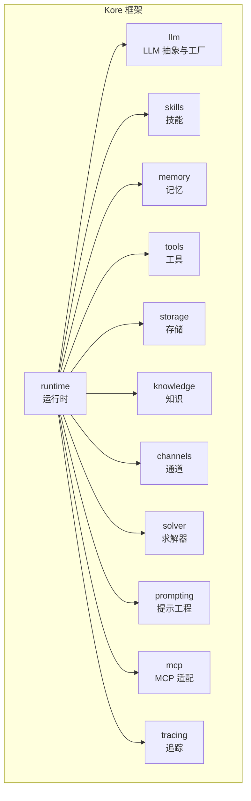
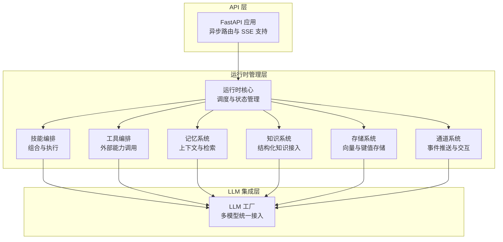
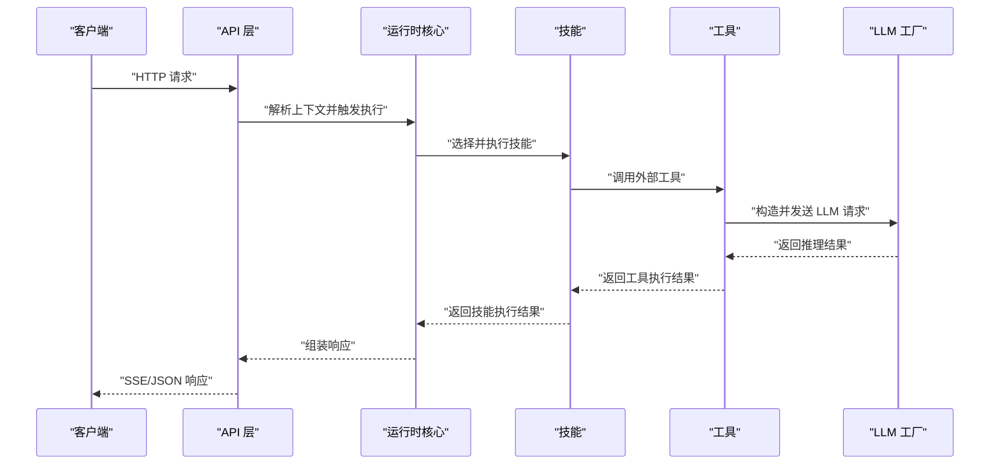
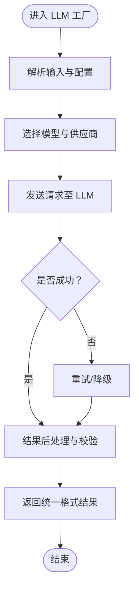
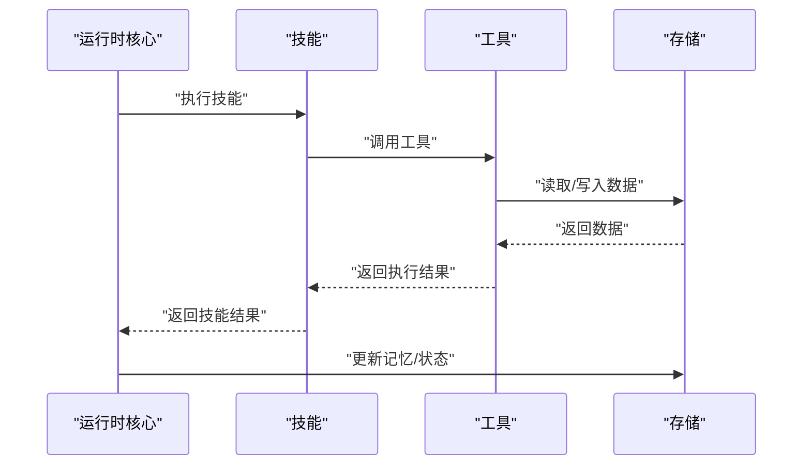
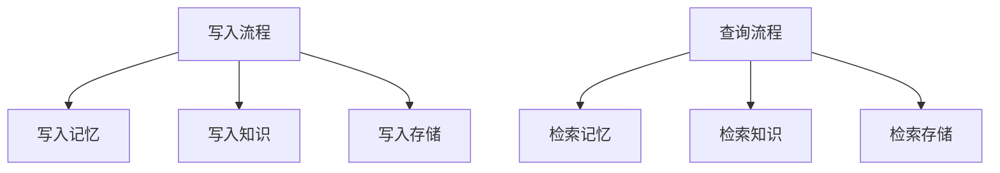
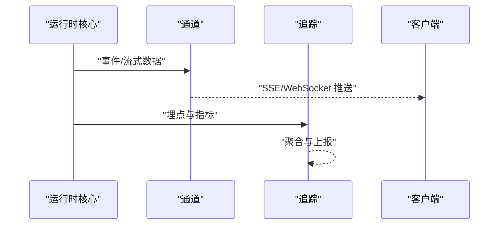
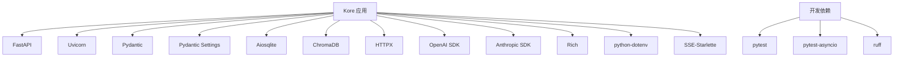

# 项目概述

<cite>
**本文档引用的文件**
- [pyproject.toml](file://backend/pyproject.toml)
- [__init__.py](file://backend/kore/__init__.py)
- [runtime/__init__.py](file://backend/kore/runtime/__init__.py)
- [llm/__init__.py](file://backend/kore/llm/__init__.py)
- [skills/__init__.py](file://backend/kore/skills/__init__.py)
- [memory/__init__.py](file://backend/kore/memory/__init__.py)
- [tools/__init__.py](file://backend/kore/tools/__init__.py)
- [storage/__init__.py](file://backend/kore/storage/__init__.py)
- [knowledge/__init__.py](file://backend/kore/knowledge/__init__.py)
- [channels/__init__.py](file://backend/kore/channels/__init__.py)
- [solver/__init__.py](file://backend/kore/solver/__init__.py)
- [prompting/__init__.py](file://backend/kore/prompting/__init__.py)
- [mcp/__init__.py](file://backend/kore/mcp/__init__.py)
- [tracing/__init__.py](file://backend/kore/tracing/__init__.py)
</cite>

## 目录
1. [引言](#引言)
2. [项目结构](#项目结构)
3. [核心组件](#核心组件)
4. [架构总览](#架构总览)
5. [详细组件分析](#详细组件分析)
6. [依赖分析](#依赖分析)
7. [性能考虑](#性能考虑)
8. [故障排除指南](#故障排除指南)
9. [结论](#结论)
10. [附录](#附录)

## 引言
Kore 是一个面向个人与团队的智能体（Agent）开发与运行时框架，旨在通过模块化设计、多模型支持与可扩展架构，降低智能体构建门槛并提升工程化能力。其核心价值主张包括：
- 模块化分层：清晰的 API 层、LLM 集成层与运行时管理层，便于独立演进与替换。
- 多模型支持：对主流大语言模型（LLM）与推理服务（如 OpenAI、Anthropic）提供统一抽象与工厂模式接入。
- 可扩展性：通过插件化技能（Skills）、工具（Tools）、存储（Storage）、记忆（Memory）与知识（Knowledge）等子系统，支撑复杂智能体场景。
- 工程化实践：结合异步 I/O、流式事件传输（SSE）、配置管理与日志追踪，满足生产级部署需求。

本项目以 Python 3.12+ 为基础，采用 FastAPI 提供高性能异步 API，配合 Pydantic 进行数据建模与校验，并集成 ChromaDB、SQLite 等存储组件，形成从接口到推理再到持久化的完整链路。

## 项目结构
后端采用“按功能域分层”的包组织方式，核心模块如下：
- runtime：运行时核心，负责智能体生命周期、调度与状态管理（入口与初始化由运行时子包导出）。
- llm：LLM 抽象与工厂，屏蔽不同模型供应商的差异，提供统一调用接口。
- skills：技能模块，定义可复用的智能体行为单元（如规划、决策、执行等）。
- memory：记忆系统，提供短期与长期记忆的读写与检索能力。
- tools：工具系统，封装外部能力（如搜索、计算、调用第三方 API）。
- storage：通用存储抽象，支持向量数据库、键值存储等。
- knowledge：知识图谱或知识库的接入与查询能力。
- channels：通信通道（如 Webhook、WebSocket、SSE），用于事件推送与交互。
- solver：问题求解器，面向特定任务的推理与优化模块。
- prompting：提示词工程与模板管理，提升提示质量与一致性。
- mcp：Model Context Protocol（MCP）相关适配，扩展智能体与外部服务的协作边界。
- tracing：分布式追踪与可观测性，辅助调试与性能分析。

**图表来源**
- [runtime/__init__.py](file://backend/kore/runtime/__init__.py)
- [llm/__init__.py](file://backend/kore/llm/__init__.py)
- [skills/__init__.py](file://backend/kore/skills/__init__.py)
- [memory/__init__.py](file://backend/kore/memory/__init__.py)
- [tools/__init__.py](file://backend/kore/tools/__init__.py)
- [storage/__init__.py](file://backend/kore/storage/__init__.py)
- [knowledge/__init__.py](file://backend/kore/knowledge/__init__.py)
- [channels/__init__.py](file://backend/kore/channels/__init__.py)
- [solver/__init__.py](file://backend/kore/solver/__init__.py)
- [prompting/__init__.py](file://backend/kore/prompting/__init__.py)
- [mcp/__init__.py](file://backend/kore/mcp/__init__.py)
- [tracing/__init__.py](file://backend/kore/tracing/__init__.py)

**章节来源**
- [pyproject.toml:1-35](file://backend/pyproject.toml#L1-L35)
- [__init__.py:1-1](file://backend/kore/__init__.py#L1-L1)

## 核心组件
- 运行时（Runtime）
  - 职责：协调智能体生命周期、调度技能与工具、维护状态与上下文。
  - 设计：通过子包导出统一入口，便于在上层 API 中组合调用。
- LLM 抽象与工厂（LLM）
  - 职责：屏蔽不同模型供应商差异，提供统一的请求/响应接口与工厂创建逻辑。
  - 设计：基于工厂模式与配置驱动，支持动态切换模型与参数。
- 技能（Skills）
  - 职责：封装可复用的行为单元，如计划制定、意图识别、反思迭代等。
  - 设计：模块化与可插拔，便于组合与测试。
- 记忆（Memory）
  - 职责：短期对话记忆与长期知识检索，支撑上下文与个性化。
  - 设计：与存储与知识模块协同，提供检索与更新能力。
- 工具（Tools）
  - 职责：对外部能力的封装，如搜索、计算、调用第三方 API。
  - 设计：安全与权限控制、超时与重试策略。
- 存储（Storage）
  - 职责：向量数据库、键值存储等，支撑嵌入与元数据持久化。
  - 设计：抽象接口与具体实现分离，便于替换与扩展。
- 知识（Knowledge）
  - 职责：知识图谱或知识库的接入与查询，增强推理能力。
  - 设计：与记忆与工具联动，形成多源信息融合。
- 通道（Channels）
  - 职责：事件推送与交互通道，如 SSE、Webhook、WebSocket。
  - 设计：异步与流式处理，保障实时性与可靠性。
- 求解器（Solver）
  - 职责：面向特定任务的推理与优化模块（如规划、调度、决策树）。
  - 设计：可插拔与可扩展，适配不同业务场景。
- 提示工程（Prompting）
  - 职责：模板化与版本化提示词，提升一致性与可维护性。
  - 设计：参数化与动态注入，支持上下文与变量替换。
- MCP 适配（MCP）
  - 职责：扩展智能体与外部服务的协作边界，标准化协议交互。
  - 设计：适配层与桥接模式，降低耦合度。
- 追踪（Tracing）
  - 职责：分布式追踪与可观测性，辅助调试与性能分析。
  - 设计：轻量埋点与聚合上报，兼顾开销与效果。

**章节来源**
- [runtime/__init__.py:1-1](file://backend/kore/runtime/__init__.py#L1-L1)
- [llm/__init__.py:1-1](file://backend/kore/llm/__init__.py#L1-L1)
- [skills/__init__.py:1-1](file://backend/kore/skills/__init__.py#L1-L1)
- [memory/__init__.py:1-1](file://backend/kore/memory/__init__.py#L1-L1)
- [tools/__init__.py:1-1](file://backend/kore/tools/__init__.py#L1-L1)
- [storage/__init__.py:1-1](file://backend/kore/storage/__init__.py#L1-L1)
- [knowledge/__init__.py:1-1](file://backend/kore/knowledge/__init__.py#L1-L1)
- [channels/__init__.py:1-1](file://backend/kore/channels/__init__.py#L1-L1)
- [solver/__init__.py:1-1](file://backend/kore/solver/__init__.py#L1-L1)
- [prompting/__init__.py:1-1](file://backend/kore/prompting/__init__.py#L1-L1)
- [mcp/__init__.py:1-1](file://backend/kore/mcp/__init__.py#L1-L1)
- [tracing/__init__.py:1-1](file://backend/kore/tracing/__init__.py#L1-L1)

## 架构总览
Kore 的整体架构分为三层：
- API 层：基于 FastAPI 提供异步 HTTP 接口，支持 SSE 流式输出与参数校验。
- LLM 集成层：通过 LLM 抽象与工厂对接多家模型供应商，统一请求与响应格式。
- 运行时管理层：协调技能、工具、记忆、存储与知识等子系统，完成智能体的执行闭环。

**图表来源**
- [pyproject.toml:6-19](file://backend/pyproject.toml#L6-L19)
- [runtime/__init__.py:1-1](file://backend/kore/runtime/__init__.py#L1-L1)
- [llm/__init__.py:1-1](file://backend/kore/llm/__init__.py#L1-L1)
- [skills/__init__.py:1-1](file://backend/kore/skills/__init__.py#L1-L1)
- [memory/__init__.py:1-1](file://backend/kore/memory/__init__.py#L1-L1)
- [tools/__init__.py:1-1](file://backend/kore/tools/__init__.py#L1-L1)
- [storage/__init__.py:1-1](file://backend/kore/storage/__init__.py#L1-L1)
- [knowledge/__init__.py:1-1](file://backend/kore/knowledge/__init__.py#L1-L1)
- [channels/__init__.py:1-1](file://backend/kore/channels/__init__.py#L1-L1)

## 详细组件分析

### 运行时管理层（Runtime）
- 设计要点
  - 统一入口：通过子包导出，便于在 API 层直接组合调用。
  - 可扩展：与技能、工具、记忆、存储、知识等模块解耦，支持按需启用。
  - 可观测：结合追踪模块，记录关键事件与耗时指标。
- 典型流程
  - 接收请求 → 解析上下文 → 调用技能 → 执行工具 → 更新记忆/存储 → 通过通道返回结果。

**图表来源**
- [runtime/__init__.py:1-1](file://backend/kore/runtime/__init__.py#L1-L1)
- [skills/__init__.py:1-1](file://backend/kore/skills/__init__.py#L1-L1)
- [tools/__init__.py:1-1](file://backend/kore/tools/__init__.py#L1-L1)
- [llm/__init__.py:1-1](file://backend/kore/llm/__init__.py#L1-L1)

**章节来源**
- [runtime/__init__.py:1-1](file://backend/kore/runtime/__init__.py#L1-L1)

### LLM 集成层（LLM）
- 设计要点
  - 工厂模式：集中管理模型实例与参数，支持热切换与灰度发布。
  - 统一抽象：屏蔽供应商差异，统一请求/响应格式与错误处理。
  - 安全与限流：内置超时、重试与速率限制策略。
- 典型流程
  - 输入预处理 → 选择模型 → 发送请求 → 结果后处理 → 返回给调用方。

**图表来源**
- [llm/__init__.py:1-1](file://backend/kore/llm/__init__.py#L1-L1)

**章节来源**
- [llm/__init__.py:1-1](file://backend/kore/llm/__init__.py#L1-L1)

### 技能（Skills）与工具（Tools）
- 设计要点
  - 技能：行为单元化，支持组合、优先级与条件分支。
  - 工具：封装外部能力，提供安全沙箱与权限控制。
- 典型流程
  - 技能选择 → 参数解析 → 工具调用 → 结果回传 → 记忆更新。

**图表来源**
- [skills/__init__.py:1-1](file://backend/kore/skills/__init__.py#L1-L1)
- [tools/__init__.py:1-1](file://backend/kore/tools/__init__.py#L1-L1)
- [storage/__init__.py:1-1](file://backend/kore/storage/__init__.py#L1-L1)

**章节来源**
- [skills/__init__.py:1-1](file://backend/kore/skills/__init__.py#L1-L1)
- [tools/__init__.py:1-1](file://backend/kore/tools/__init__.py#L1-L1)
- [storage/__init__.py:1-1](file://backend/kore/storage/__init__.py#L1-L1)

### 记忆（Memory）、知识（Knowledge）与存储（Storage）
- 设计要点
  - 记忆：短期对话与长期检索，支持向量化与关键词混合检索。
  - 知识：结构化知识库接入，支持图谱与规则引擎。
  - 存储：向量数据库与键值存储并存，满足不同查询与写入场景。
- 典型流程
  - 写入：技能/工具执行结果 → 写入记忆/知识/存储。
  - 查询：运行时请求 → 检索记忆/知识 → 返回上下文。

**图表来源**
- [memory/__init__.py:1-1](file://backend/kore/memory/__init__.py#L1-L1)
- [knowledge/__init__.py:1-1](file://backend/kore/knowledge/__init__.py#L1-L1)
- [storage/__init__.py:1-1](file://backend/kore/storage/__init__.py#L1-L1)

**章节来源**
- [memory/__init__.py:1-1](file://backend/kore/memory/__init__.py#L1-L1)
- [knowledge/__init__.py:1-1](file://backend/kore/knowledge/__init__.py#L1-L1)
- [storage/__init__.py:1-1](file://backend/kore/storage/__init__.py#L1-L1)

### 通道（Channels）与追踪（Tracing）
- 设计要点
  - 通道：SSE、Webhook、WebSocket 等，满足不同交互场景。
  - 追踪：轻量埋点与聚合上报，支持链路追踪与性能分析。
- 典型流程
  - 事件产生 → 通道推送 → 客户端接收 → 日志/追踪上报。

**图表来源**
- [channels/__init__.py:1-1](file://backend/kore/channels/__init__.py#L1-L1)
- [tracing/__init__.py:1-1](file://backend/kore/tracing/__init__.py#L1-L1)

**章节来源**
- [channels/__init__.py:1-1](file://backend/kore/channels/__init__.py#L1-L1)
- [tracing/__init__.py:1-1](file://backend/kore/tracing/__init__.py#L1-L1)

## 依赖分析
- 核心依赖
  - FastAPI 与 Uvicorn：提供高性能异步 HTTP 服务与 SSE 支持。
  - Pydantic 与 Pydantic Settings：数据建模、校验与配置管理。
  - Aiosqlite：异步 SQLite 访问，适合轻量持久化。
  - ChromaDB：向量数据库，支撑记忆与知识检索。
  - HTTPX：异步 HTTP 客户端，用于调用外部服务。
  - OpenAI 与 Anthropic：主流 LLM 供应商 SDK。
  - Rich：终端输出与日志美化。
  - Python-dotenv：环境变量加载。
- 开发依赖
  - pytest 与 pytest-asyncio：异步测试支持。
  - ruff：代码风格与静态检查。

**图表来源**
- [pyproject.toml:6-19](file://backend/pyproject.toml#L6-L19)
- [pyproject.toml:21-26](file://backend/pyproject.toml#L21-L26)

**章节来源**
- [pyproject.toml:1-35](file://backend/pyproject.toml#L1-L35)

## 性能考虑
- 异步优先：API 与存储访问均采用异步 I/O，减少阻塞，提升吞吐。
- 流式输出：SSE 支持实时反馈，改善用户体验。
- 缓存与检索：记忆与知识模块结合向量与关键词检索，平衡准确与速度。
- 超时与重试：工具与 LLM 调用内置超时与重试策略，提升鲁棒性。
- 观测性：追踪模块辅助定位瓶颈，指导优化方向。

## 故障排除指南
- 常见问题
  - LLM 调用失败：检查密钥与网络连通性，确认超时与重试配置。
  - SSE 推送异常：确认客户端兼容性与网络稳定性。
  - 数据校验失败：核对请求体结构与字段类型，确保符合 Pydantic 模型。
  - 存储访问异常：检查数据库连接与权限，关注异步上下文。
- 建议排查步骤
  - 启用追踪与日志，定位关键节点耗时。
  - 分模块隔离测试，逐步缩小范围。
  - 使用开发依赖进行单元与集成测试，确保变更稳定。

## 结论
Kore 通过清晰的分层架构与模块化设计，将智能体开发从“接口—推理—运行时”三个维度解耦，既满足初学者快速上手，也为资深工程师提供了高扩展性与工程化能力。依托 FastAPI、异步 I/O、向量存储与多模型工厂，Kore 能够覆盖从个人助理到企业级智能体的多样化场景。

## 附录
- 快速开始建议
  - 配置环境变量与模型密钥。
  - 启动 API 服务，验证 SSE 推送与基本路由。
  - 编写首个技能与工具，接入记忆与存储。
  - 使用追踪模块观察执行链路，持续优化性能。
- 参考路径
  - [pyproject.toml:1-35](file://backend/pyproject.toml#L1-L35)
  - [__init__.py:1-1](file://backend/kore/__init__.py#L1-L1)
  - [runtime/__init__.py:1-1](file://backend/kore/runtime/__init__.py#L1-L1)
  - [llm/__init__.py:1-1](file://backend/kore/llm/__init__.py#L1-L1)
  - [skills/__init__.py:1-1](file://backend/kore/skills/__init__.py#L1-L1)
  - [memory/__init__.py:1-1](file://backend/kore/memory/__init__.py#L1-L1)
  - [tools/__init__.py:1-1](file://backend/kore/tools/__init__.py#L1-L1)
  - [storage/__init__.py:1-1](file://backend/kore/storage/__init__.py#L1-L1)
  - [knowledge/__init__.py:1-1](file://backend/kore/knowledge/__init__.py#L1-L1)
  - [channels/__init__.py:1-1](file://backend/kore/channels/__init__.py#L1-L1)
  - [solver/__init__.py:1-1](file://backend/kore/solver/__init__.py#L1-L1)
  - [prompting/__init__.py:1-1](file://backend/kore/prompting/__init__.py#L1-L1)
  - [mcp/__init__.py:1-1](file://backend/kore/mcp/__init__.py#L1-L1)
  - [tracing/__init__.py:1-1](file://backend/kore/tracing/__init__.py#L1-L1)